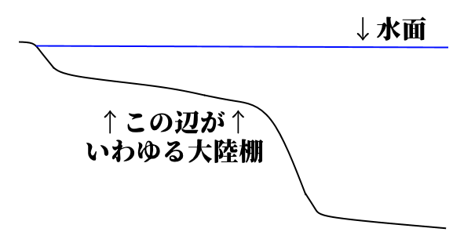
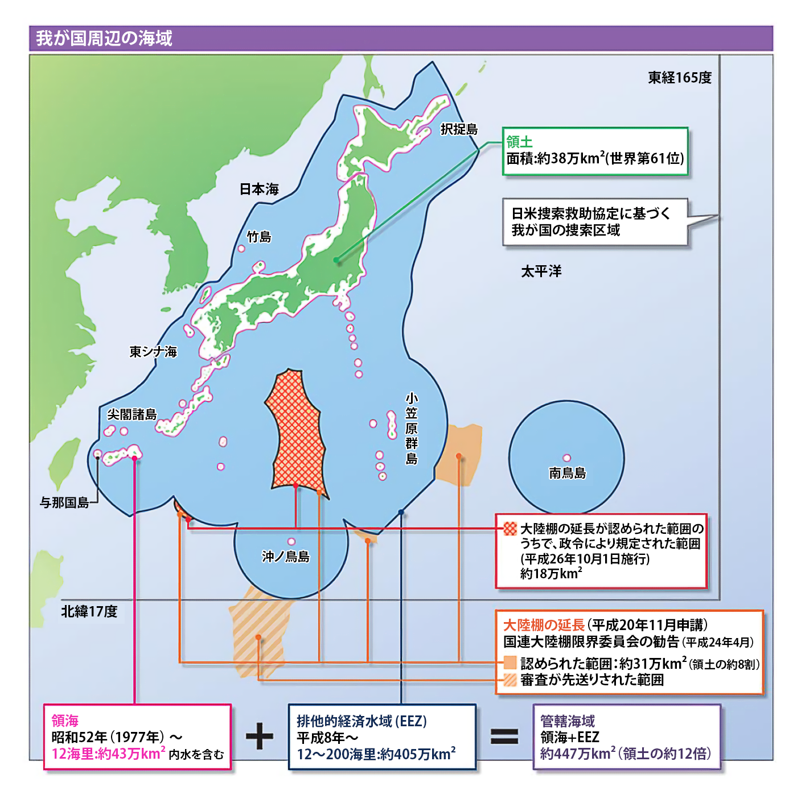
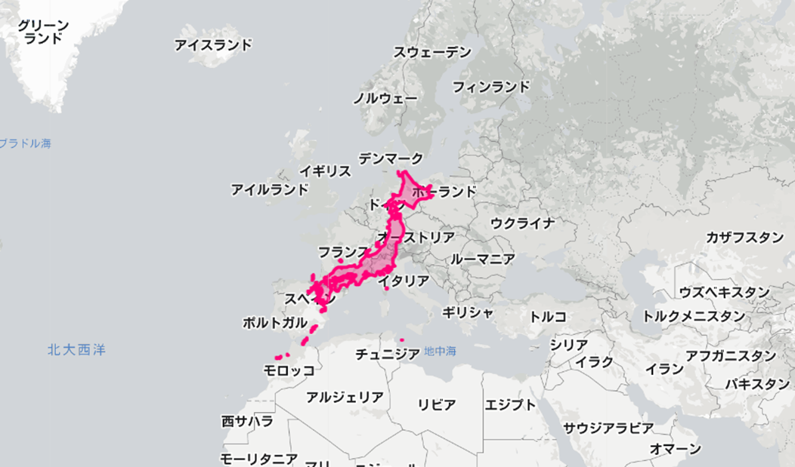

# 国家とは何か    
  
## 授業動画一覧
[本節の授業動画はこちら](LIST.md#国家とは何か)

## ●概要  
  
・国家とは何か？　と言われた時の、有名な解答が「国家三要素説」である  
⇒ドイツの法学者【ゲオルグ・イェリネック】が［『一般国家学』］で唱えたもの  
  
・概要としては、「国家は【領域】【国民】【主権】の三要素を備える」というものである  
⇒この三要素、国民はまぁそこに住んでる人でいいとして、領域と主権については詳しく解説しよう  
  
  
  
## ●領域  
### ○領海、接続水域、排他的経済水域  
・領域とは何か？　普通に考えると領土の事だが、実は海や上空も一部、領域となる  
・まずは海について見てみよう  
  
・まず、沿岸に基準となる線、【基線】を引く  
⇒自然の地形は複雑なので、基線で話を分かりやすくする  
  
・基線から【12】海里が、【領海】　※1海里＝［1852m］  
⇒領土と同等。完全にその国のものとなる「領域」  
  
・領海から更に12海里が、［接続水域］  
⇒領土と同等ではないが、その国の法令が及ぶ「領域」  
  
・基線から【200】海里が、【排他的経済水域(EEZ)】  
⇒領土と同等ではないがではないが、そこにある水産資源や鉱物資源はその国の専有物と見做される「領域」。また、その国はEEZ内の資源管理と海洋汚染防止の義務を負う  
  
※「領海から12海里」みたいな勘違いに注意  
※EEZは、【国連海洋法条約】(西暦1994年)にて制定。日本は1996年に批准  
※［大陸棚が200海里以上ある］場合、EEZは延長可能  
  
  
Pqks758 11:24, 29 November 2007 (UTC), CC BY-SA 3.0 <http://creativecommons.org/licenses/by-sa/3.0/>, via Wikimedia Commons  
https://commons.wikimedia.org/wiki/File:Zonmar-ja.png  
  
  
### ○領海、接続水域あれこれ  
・領海は完全にその国の領域と見做され、その国の法律が有効である  
・例えば「麻薬は持っているだけで犯罪」という国の領海に、麻薬を積んだ外国船が進入したら？  
・当然、その国の海上警察（日本で言えば海上保安庁）に捕まる事になる  
※領海から接続水域に逃げたとしても捕まる。接続水域は、「完全にその国の領域という訳ではない」が「その国の法令（法律と命令）が有効」な領域なので…  
  
  
### ○排他的経済水域  
・何でこんなものができたのか？　…というのを知るには、まず改定の地形を知る必要がある  
・という訳で、まずは海底の地形を示した以下の図を見てほしい  
  
  
  
・海底というのは普通、岸から離れるほどに深くなっていく  
・なっていくのだが、岸から近い場所は普通、傾斜がなだらかになっている  
・このなだらかな部分を大陸棚と呼び、大抵、長さは200海里以下である  
  
・そしてこの大陸棚、大抵の場合、魚や貝のような水産資源が豊富である  
・また石油や天然ガスが埋まっている場合も掘り出しやすい  
・そうなってくると、「大陸棚も沿岸国の持ち物って事にしたいね」という話が出てくる  
・結果として誕生したのが、排他的経済水域という概念である  
・だからこそ基線から200海里が排他的経済水域であり、大陸棚が長ければ延長可能なのである  
  
   
### ～ちょっと雑談～  
  
  
日本国のEEZを示した図。日本国政府の主張通り「北方領土は、北方四島のみ日本領」とした場合になっている。EEZを大陸棚延長している範囲があるのに注目。  
Ministerial Meeting Coast Guard, CC BY 4.0 <https://creativecommons.org/licenses/by/4.0>, via Wikimedia Commons  
https://commons.wikimedia.org/wiki/File:Japan_Exclusive_Economic_Zone_Map_2016.png  
  
・ところで、日本国は狭い国だと思い込んでいる人が多い  
・実際には、そうでもない。世界中の国家を対象に領土の面積ランキングを作ると、六十位ぐらいになる  
⇒全世界で大体200ぐらいの国家が存在すると考えると、「めっちゃ大きい」国ではないが、日本人が思い込んでいるほど小さい国家ではない事が分かる。まぁ、普通に大きい方である  
  
   
・そして、「排他的経済水域の大きさ」だと、日本国は滅茶苦茶大きくなる  
・排他的経済水域の面積ランキングを作ると、日本国は上位一桁になる  
⇒現ロシア連邦が不法占拠している北方領土を、何処まで計算に入れるか…で日本の排他的経済水域の面積はかなり変動する。そういうのもあって考え方次第で順位は変動するのだが、それでも世界八位は堅い
  
・もっと言えば、日本国の人口は令和四年現在、1億2500万人ぐらいである  
・これは、世界人口ランキングを作ると十一位になる  
⇒例えば欧州の国家で、日本国の人口を超える国は基本、存在しない。強いて言えばロシア連邦が人口1億4000万だが、それぐらいである  
  
・脱線ついでに言ってしまえば、母語として日本語を話す人間も、人口と同じぐらいいる  
※その人が赤ちゃんの時、親から聞く等して自然に話せるようになった言語を母語と呼ぶ  
・で、母語話者数の世界ランキングを作ると、日本語は九位である  
・日本語を母語とする者は、ドイツ語よりも、フランス語よりも、イタリア語よりも、トルコ語よりも多い  
  
  
日本列島を、大きさそのままに欧州へ持ってきた図。北方領土完全にナシでこれである。でっか（素の反応）となる人も多いのでは。となる人も多いのでは。  
https://thetruesize.com/  
  
・ここまでの話で「え、そうなの！？」となった人。そういう人は今まで、疑ってこなかった人である  
・「日本は小さい、人も少ない、弱い」と言うテレビを、親を、教員を、動画を、疑ってこなかったのだ  
・「小さいって言うけど、具体的にはどれぐらい小さいんだ？」と疑って調べれば、そうはならなかった  
  
・だからこそ。是非とも、疑ってほしい。教科書も、テレビも、新聞も、そして私の授業も  
・「これって本当か？」と疑ってほしい。そして自分で調べる習慣をつけてほしい  
・受験とかそういうのを抜きにすれば、社会科を勉強する意義の核心は、そういう感覚を養う事にある   
  
  
### ○領空  
・国の上空、【領空】も国家の領域である  
⇒完全にその国の領域と見做される。なので外国の飛行機が勝手に領空へ進入すると、いわゆる領空侵犯になる。その国の空軍が出動する事態になるし、最悪、撃墜される事になる  
  
・領空は、【領土】と【領海】の上空。尚、高さ制限があり、大気圏内限定である  
⇒宇宙まで領空にしてしまうと、人工衛星どうなるの…という話を通り越して、そもそも地球は回転している訳で。「この星はこの国の領域」が一日の間に物凄い勢いで変化する事になる  
  
  
### ○領域まとめ  
|||  
|:----:|:----:|  
|1海里|［1852m］|  
|【領海】|【基線】から【12】海里|  
|［接続水域］|領海から更に12海里|  
|【排他的経済水域(EEZ)】|【基線】から【200】海里 西暦1994年の【国連海洋法条約】で制定 ［大陸棚が200海里以上ある］場合、延長可能|  
|【領空】|【領土】と【領海】の上空 但し大気圏内まで|  
  
  
## ●主権  
・主権という言葉の意味を問われる事は、ほぼない  
・どちらかと言うと、「主権の意味ぐらい、知ってて当然」という形である  
  
・では、主権の意味は何か？　実は、主権という言葉は側面が三つぐらいある  
  
１：「統治権」  
⇒国を統治する権利そのものを、主権と呼ぶ事がある。「統治」とは、軍隊・警察のような暴力装置の強制力を背景に、社会集団の秩序を維持し、人民の利益を調整・統合する行為である、と言える  
  
２：「国家意思最終決定権」  
⇒国家の意思（この法律を作る、作らないとか、戦争をする、しないとか）を、最終的に決定する権利・権力を、主権と呼ぶ事がある。君主（王、皇帝）が最終的に決定するなら君主主権、国民が最終的に決定するなら国民主権  
  
３：「対外的独立性」  
⇒国家の権力が対外的に独立しており、他国に口出しされない事を指して、「主権がある」と表現する事がある。逆に言えば、ある国が「この法律を作ろう」と言ったところに他国が「やめろ」と口を出し、やめざるを得なくなった…というのであれば、「対外的独立性」という意味での「主権がない」状態と言える  
  
