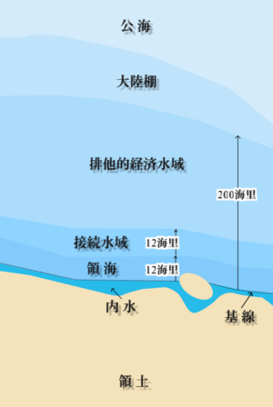

# 国家とは何か

・国家とは何か？　と言われた時の、有名な解答が「国家三要素説」
・ドイツの法学者【ゲオルグ・イェリネック】が［『一般国家学』］で唱えたもの
・国家は、【領域】【国民】【主権】の三要素を備える、というもの
⇒この三要素、国民はまぁそこに住んでる人でいいとして、領域と主権について詳しく解説します

### 〇領域
・領域とは何か？　普通に考えると領土の事だが、実は海や上空も一部、領域となる
・海について説明する前に、地形について

・海底というのは普通、岸から離れるほどに深くなっていく
・なっていくのだが、岸から近い場所は普通、傾斜がなだらかになっている
・このなだらかな部分を大陸棚と言う
※この後の海の領域の説明で大陸棚って単語が出てくるので、一応解説しました

・海に面した国家の場合、海の一部も「領域」になる

Pqks758 11:24, 29 November 2007 (UTC), CC BY-SA 3.0 &lt;http://creativecommons.org/licenses/by-sa/3.0/&gt;, via Wikimedia Commons
https://commons.wikimedia.org/wiki/File:Zonmar-ja.png

・まず、沿岸に基準となる線、【基線】を引く
⇒自然の地形は複雑なので、基線で話を分かりやすくする
・基線から【12】海里を【領海】と呼ぶ
⇒領土と同等。完全にその国のものとなる「領域」
　（1海里＝［1852m］）
・領海から更に12海里を、［接続水域］という
⇒領土と同等ではないが、その国の法令が及ぶ「領域」

・基線から【200】海里を、【排他的経済水域(EEZ)】という
⇒領土と同等ではないがではないが、そこにある水産資源や鉱物資源はその国の専有物と見做される「領域」。また、その国はEEZ内の資源管理と海洋汚染防止の義務を負う
※EEZは、【国連海洋法条約】(1994年)にて制定。日本は1996年に批准
※［大陸棚が200海里以上ある］場合、EEZは延長可能

・国の上空、【領空】も国家の領域となる
・領空は、【領土】と【領海】の上空で、大気圏内まで有効

### 〇主権
・主権とは何か？　実は、主権という言葉は側面が三つぐらいある
一：「統治権」
⇒軍隊・警察のような暴力装置の強制力を背景に、社会集団の秩序を維持し、人民の利益を調整・統合する
二：「国家意思最終決定権」
⇒国の政治を、最終的に決定する権利・権力
　君主が最終的に決定するなら君主主権、国民が最終的に決定するなら国民主権
三：「対外的独立性」
⇒国家の権力が対外的に独立しており、他国に口出しされない