# 近世・近代・現代史概略  
  
※令和六年八月に本ページの内容を全面改訂しました。授業動画は改訂前のものです。改訂後の資料を使った授業動画は現在作成中です  
  
## ●授業動画一覧
|||
|:----:|:----:|
|近世・近代・現代史概略1／近世英国史|[YouTube](https://youtu.be/3ErHCccEjak)|
|近世・近代・現代史概略2／十八、十九世紀|[YouTube](https://youtu.be/wy7ZqQbcmZw)|
|近世・近代・現代史概略3／第一次世界大戦～1980年代|[YouTube](https://youtu.be/by5A8JrR8TA)|
|近世・近代・現代史概略4／1980年代以降|[YouTube](https://youtu.be/r5OQ_reiTs8)|

## ●前置きと資料  
・ここから暫く、「どうして我々は現代日本みたいな国家に住んでいるのか」という話をしていく  
⇒その為に、「現代的な国家はどういう経緯で登場してきたのか」という話をしていく事になる  
  
・つまり、歴史の話をする事になる  
※現代（令和五年現在）の文系で政経を選択する高校生は、「歴史が嫌いだから政経に逃げてきた」という人が多い。しかし実際には、政経も公共も倫理も、歴史の話が多い  
  
・しかも以下のような形で、色んな時代を何度も行ったり来たりする事になる  
  
１：中世～現代が、どんな時代かを概観する（「近世・近代・現代史概略」の前半）  
２：近世後半～現代の、各時代の特徴を概観する（「近世・近代・現代史概略」の後半）  
３：絶対主義の時代～現代を、国家の正当性という側面から見る（「国家の正当性の原理」）  
４：中世～現代を、法という側面から見る（「法の支配と法治主義」）  
５：中世～現代を、人権という側面から見る（「人権の拡大」）  
  
・…こんな感じなので、「今どの時代の話をしているのか？」というのが頭から飛ぶと大変な事になる  
・以下に時代区分の資料を載せるので、今後、勉強をしていく際の参考にしてほしい  
  
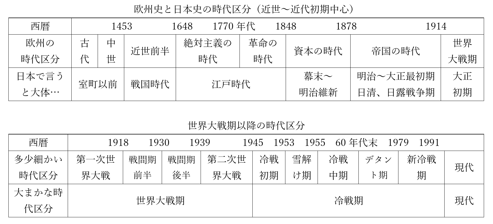  
  
※「×年から×年が△△時代」というのは人によって変わる。上記はあくまで一例である。私の授業では、この時代区分で通す予定  
例：「革命の時代」という概念を最初に言い出した歴史家は、革命の時代を1789年開始としている  
  
※尚、本来公民の授業（つまり公共の授業とか政経の授業とか）では、「中世～現代が、どんな時代か」はやりません。「世界史でやったでしょ」という感じで、ある程度どんな時代か分かってる事前提で授業が行われます。が、私の授業では先に、「中世～現代が、どんな時代か」という話をします  
  
※歴史の概略が終わるまでは、細かい知識の暗記よりも「“どんな事件がいつ起きたか”“この時代はどんな時代か”みたいなものを、をなんとなーくでいいから把握する」という事を優先してください  
  
・また、以下にワークシートを載せる。このワークシートを埋めながら授業を受けるとよいだろう  
  
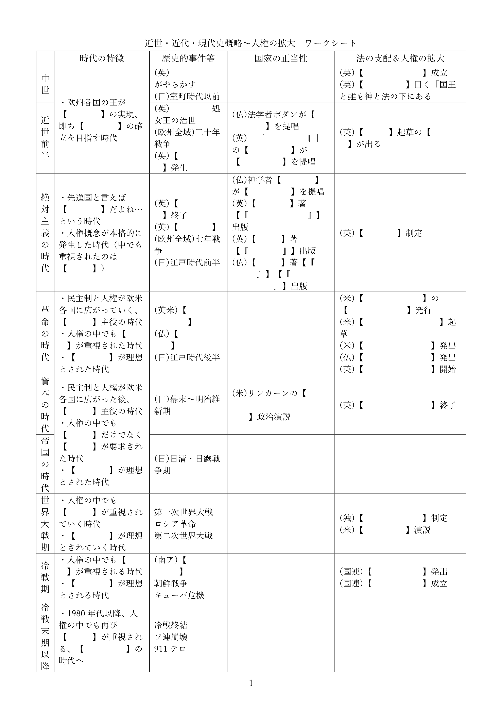  
<a href="https://teacheramesaka.github.io/highschoolpolitics/forDL/01_02-05worksheet.pdf" target="_blank" rel="noopener noreferrer">※（印刷したい人等向け）上記ワークシートのpdfをダウンロード</a> 
<a href="https://teacheramesaka.github.io/highschoolpolitics/forDL/01_02-05worksheet_kotaelast.pdf" target="_blank" rel="noopener noreferrer">※（念の為）上記ワークシートの最終的な模範回答pdfをダウンロード</a> 
  
## ●中世と絶対主義  
・これから、欧州の中世～現代が、どんな時代かを見ていく事になる  
  
・なるのだが、中世という時代に対して一般に、重大な誤解がある  
⇒欧州の中世は長いので一般化するのは難しいが、概して、「王がいてお城に住んでて、騎士がいて、騎士団なんかもあって、農民は貴族に年貢を納めてて、村には教会があって…」みたいな時代と想像すればよい  
  
・この時代について、一般の人は大きな誤解をしている。まずは↓の、二つ図を見てほしい  
  
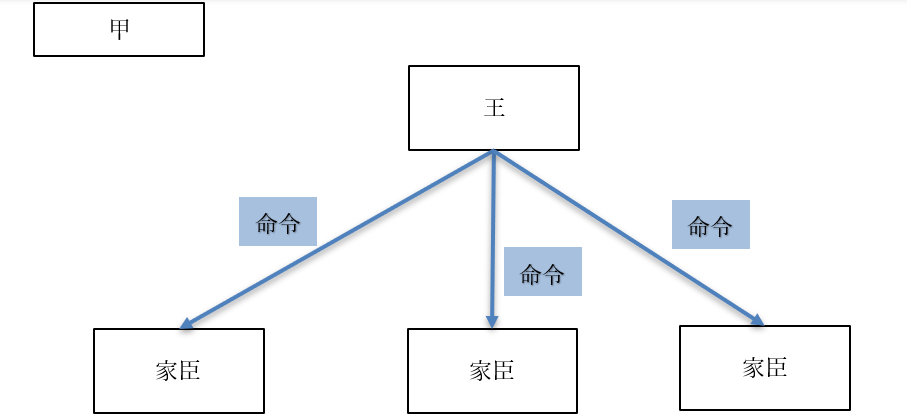  
  
-----
  
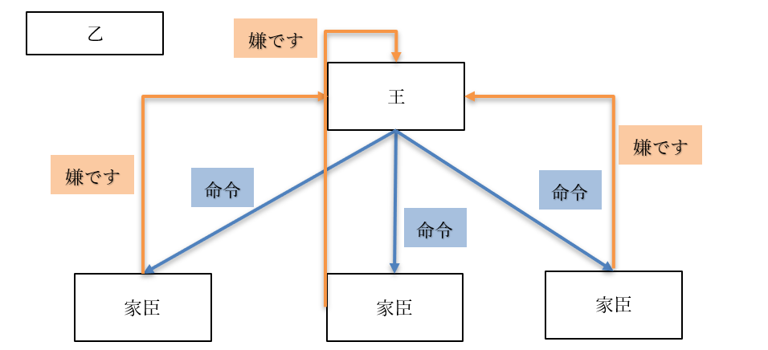  
  
>「中世って、まぁ大体王国ってイメージだよね」「じゃあ王国の権力構造ってどうなってると思う？」  
  
・↑こう聞くと、大抵の人は甲の図を思い浮かべる  
⇒即ち、「王という一番偉い人がいて」「その下に沢山家臣がいて」「王が家臣に命令を下す」…という権力構造を、大抵の人は思い浮かべるのである  
  
・しかし、現実の中世はむしろ、乙図のような状態であった  
⇒中世の王は「独裁者」ではなかった。（特に初期の）王は「貴族筆頭」であり、絶対的な権力は無かった  
  
・無論王であるから、家臣へ命令を下す事はできる。が、王と家臣との関係は、契約次第であった  
⇒例えば、以下のような契約である  
  
１：王Aは騎士Bに対し、土地を与える  
２：騎士Bは王Aの命令に従い、従軍する  
３：但し、騎士Bが王Aの命令により従軍するのは、一年につき六十日までとする  
  
※つまり、王Aが騎士Bを戦争に連れて行っても、戦争が六十日以上かかった場合、騎士Bは勝手に帰ってしまう。契約でそうなっているので、王Aはどうにもできない  
※強いて言えば、お願いする事はできる。例えば王Aが「ごめんだけどもうちょい戦って、追加でカネ払うから！」とお願いすれば、騎士Bは残業（？）してくれるかもしれない  
  
・中世欧州に於いては、このような関係が普通であった  
⇒家臣たる貴族達は、王の命令に対して、様々な形で「嫌です」と言える権利を持っていたのである  
  
・当然、各地の王からすれば、全ての人間が自分の命令通りに動く国家の方がよい  
⇒このような体制を【絶対王政】と呼び、これを実現しよう、という思想を【絶対主義】と呼ぶ  
  
・絶対王政とは、要するに以下のような政治体制、国家である  
  
１：国の隅々までが、王の命令によって動く体制  
２：王が「戦争やるぞ」と言えば、全国がその戦争に参加する国  
３：王が「新しい法律作るぞ」と言えば、全国にその法律が適用される国  
  
・絶対主義的な国家は、中世を通して少しずつ作られていく事になる  
⇒その中で、貴族の「“嫌です”と言う権利」も、少しずつ取り上げられていった  
※中世欧州に絶対主義という言葉はなくとも、多くの王が目指したところは要するに、絶対王政である  
  
・そして絶対主義の時代前半に至って、ついに、それらしい国が欧州に誕生するのである  
⇒筆者が「絶対主義の時代」と呼ぶ時代は、まさに、欧州全域で絶対主義が流行した時代であった。「先進国なら絶対主義だよね」「絶対王政できてない国は遅れてるなぁ～」…というような認識が、各国に現れるのである  
  
※実際にできたかどうかは別として、そういう時代ではあった  
※現代（令和五年現在）も、「先進国なら民主主義だよね」「民主制できてない国は遅れてるなぁ～」という意識がある筈である。そういう流行があった時代が、絶対主義の時代だと言える  
  
・この時代背景を抑えた上で、続きを学習してほしい  
  

「中世と絶対主義」まとめ
 
 
・誤解 
⇒中世の王は、最初から国全体を自由に支配していたわけではない 
 
・実際 
⇒中世の王は「貴族筆頭」に近く、家臣達も、王命を拒否する権利を持っていた 
 
・重要 
⇒王達は、全国を自分の命令で動かせる政治体制（【絶対王政】）を目指した 
⇒絶対王政の実現を目指す考え方が【絶対主義】である 

  
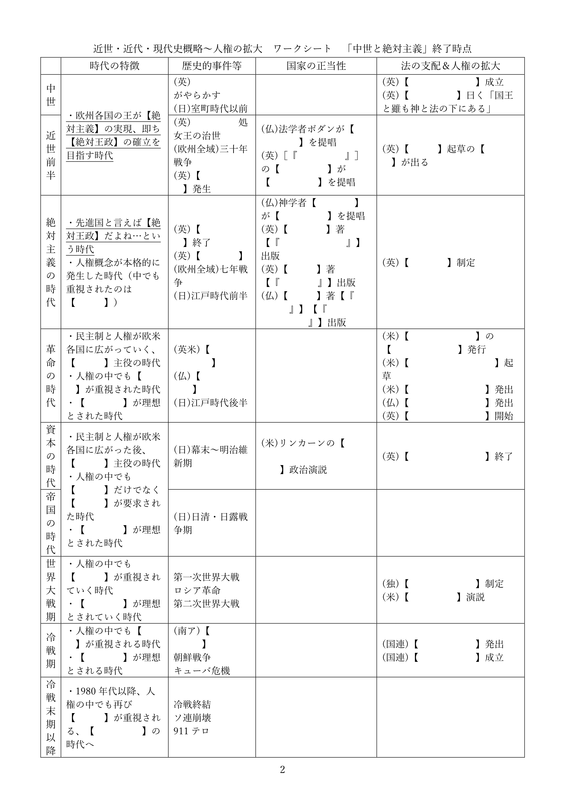
  
## ●中近世英国史概略  
### ○前説  
・現代的な民主主義国家の源泉として、イングランド王国（イギリス）が挙げられる場合が多い  
※この国は、イングランド王国⇒グレートブリテン王国⇒グレートブリテン及びアイルランド連合王国⇒グレートブリテン及び北アイルランド連合王国…と名前が変わる。筆者は、国名が長い国もできるだけちゃんと呼ぶようにしているが、流石に長すぎるので、三番目の名前になってからは「イギリス」と呼んでいる  
  
・何故、イギリスなのか？　理由は大体三つに集約できる  
  
１：現代の国際社会が「正義の連合国が、悪のドイツを倒した」という神話の上に成り立つ社会である  
⇒もうちょっと言えば、令和五年現在の国際社会は、「第二次世界大戦で、正義の民主主義国家が、悪の独裁者を倒した」「民主主義は正義、独裁者は悪」という神話の上に成り立っている  
  
２：イギリスは、民主主義国家建設の時期がかなり早い  
⇒現代的な民主主義国家は、革命の時代から資本の時代にかけて、欧州に誕生していく。が、イギリスだけは、絶対主義の時代からして既に、そういう国家を作っていた。しかも現代まで、その政治体制は大きく変わっていない  
  
※どの時代がどのあたりの話なのか、先に挙げた資料で必ず確認しておくように  
  
・つまりイギリスは、「正義の民主主義国家」の一角な上、「（現存する）最古の民主主義国家」でもある  
⇒当然、現代的な民主主義国家の源泉として、この手の授業でやたらと名前が出てくる事になる  
  
・もっと言えば、日本は明治維新後、「イギリス式民主主義をやろう」という方向性を持った歴史がある  
⇒無論、明治維新後の日本は、ドイツ式を目指した面やフランス式を目指した面もある。が、最終的には、日本はイギリス式民主主義国家を志向して現代へ至っている。となると、「現代日本は何でこんな国なのか？」という話をする上でも、イギリスは重要である  
  
・そういう訳で、この国に注目して、中世からの歴史を見てみよう  
  
  

「中近世英国史概略　前説」　まとめ
 
・重要 
⇒イギリスは、現代的な民主主義国家の成立が早く、しかもその体制を大きく崩さず現代まで生き残った国である 
 
・だからこそ 
⇒「現代的な国家はどうやってできたのか」を考える時、イギリスは重要な手がかりになる 
 
・現代日本との関係 
⇒現代日本もイギリス式民主主義国家を志向してできた国であるため、日本の政治制度を理解する上でも、イギリス史は重要である 

  
  
  
### ○中世／ジョン欠地王とマグナ・カルタ（大憲章）  
・中世盛期。十字軍の時代。この時期即位したイングランド王に、ジョン欠地王がいる  
⇒在位1199-1216。日本で言えば鎌倉幕府ができた直後ぐらいの話である  
  
・この欠地王、イングランド王国史上最悪の暗君である…とよく言われている  
⇒現代イギリスに於いても無能の見本とされるぐらいのナイスガイであり、その後二度とイングランド国王の名に「ジョン」が使われる事はなかった…というぐらいの男である。どうしてそこまで言われてしまうのか？　地図を見れば一発だろう  
  
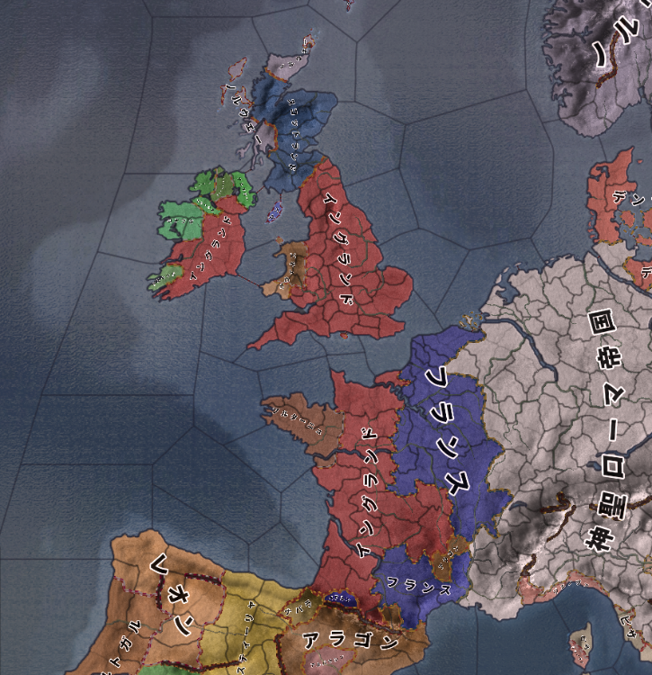  
  
↓↓↓↓↓↓↓↓↓↓↓↓↓↓↓↓↓↓↓↓↓↓↓↓↓↓↓↓↓↓↓↓↓↓↓↓↓↓↓↓↓↓↓↓↓↓↓↓↓↓  
  
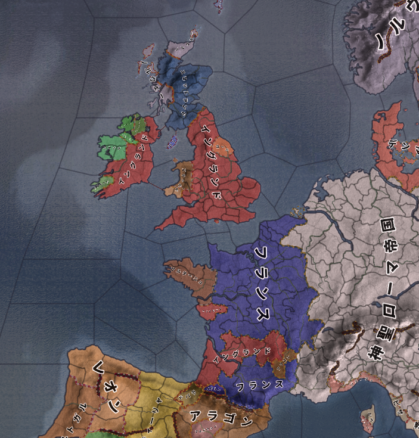  
上が、ジョン欠地王即位時の地図。下が、欠地王没時の地図。尚、フランス王国北西の島がブリテン島、その西にある島がアイルランド島である。  
CrusaderKingsII（日本語化MOD使用）より  
  
・大陸のイングランド勢力圏がほぼなくなちゃってるんですが、これは…  
⇒しかもこれ、家臣が言う事も聞かずに戦争を繰り返した結果である。もっと言えば、戦費調達の為家臣や領民に重税を課しながら戦争を繰り返して、結果これである  
  
※一応現代では、欠地王はそこまで無能ではなかった、という擁護説も出てきている。ただ何せ、結果がちょっと酷過ぎるのでね…  
  
・これだけやらかした以上、当然ながら、ジョン欠地王は家臣達から猛烈な突き上げを食らった  
⇒つまるところ、王でありながら彼は、家臣達（貴族や都市の代表）にこう言われた訳である。「お前もう勝手に動くな」「まず俺らに話を通せ」…と  
  
・その結果が、【マグナ・カルタ（大憲章）】である  
⇒これは今で言う憲法みたいなものであった。「王であってもやってはいけない事はある」「王と雖も議会の言う事を無視してはならない」というような事が書かれている  
  
・当時の裁判官ヘンリー・ド・【ブラクトン】の言葉は、マグナ・カルタの精神をよく表している  
⇒即ち、【「国王と雖も神と法の下にある」】。王であっても、議会が作る法よりは下、という精神である。この考え方は、現代のイギリスの政治制度の根幹にもなっている  
  
・ジョン欠地王は、度重なる失政と敗戦の結果、このマグナ・カルタを認めざるを得なくなった  
⇒これは、イングランド王国の「王の権利を議会と法で制限する」という伝統の代表となった  
  
・勿論、既に見たように、欧州各国は中世を通して、王の権力を強化していく  
⇒絶対主義の時代ともなれば、「先進国なら絶対王政！」「絶対王政できてない国は遅れてるな」というのが欧州の風潮である。イングランドでも、後の王達が欠地王の失政を挽回し、絶対王政を目指して王の権力を拡張していった。その中で、マグナ・カルタは忘れられていった  
  
・それでもイングランド王国はやはり、欧州の中では王権が弱い方である  
⇒これはマグナ・カルタに代表される、「王の権利を議会と法で制限する」伝統と無関係ではなかった。結局、歴代イングランド王の努力にも拘わらず、イングランド王国で絶対王政が実現する事はなかった  
  
・特に、議会の権力が強いのは、イングランド王国の特徴と言ってもいいだろう  
⇒イングランド王の権力は常に、議会によって牽制され続けた。中世も終盤となる1330年頃になると、二院制の議会も整備された。現代でも、イギリス議会は上院（貴族院）と下院（庶民院）に別れているが、その基本は、中世終盤には整備されていたのである  
  
  

「中近世英国史概略　中世／ジョン欠地王とマグナ・カルタ」まとめ
 
・原因 
⇒ジョン欠地王は、失政と敗戦を重ねた上、戦費調達の為に重税を課した 
 
・結果 
⇒これに反発した貴族や都市の代表が王を押さえ込み、【マグナ・カルタ（大憲章）】を認めさせた 
 
・重要 
⇒マグナ・カルタは、【「国王と雖も神と法の下にある」】という考え方の代表であり、イングランドの「王の権利を法で制限する」伝統の出発点となった 
※「国王と雖も～」を言ったのがヘンリー・ド・【ブラクトン】 
 
・その後 
⇒他の欧州諸国に比べ、イングランド王国では議会の権力が強いままだった。王の権力は常に、議会によって牽制され続けた 

  
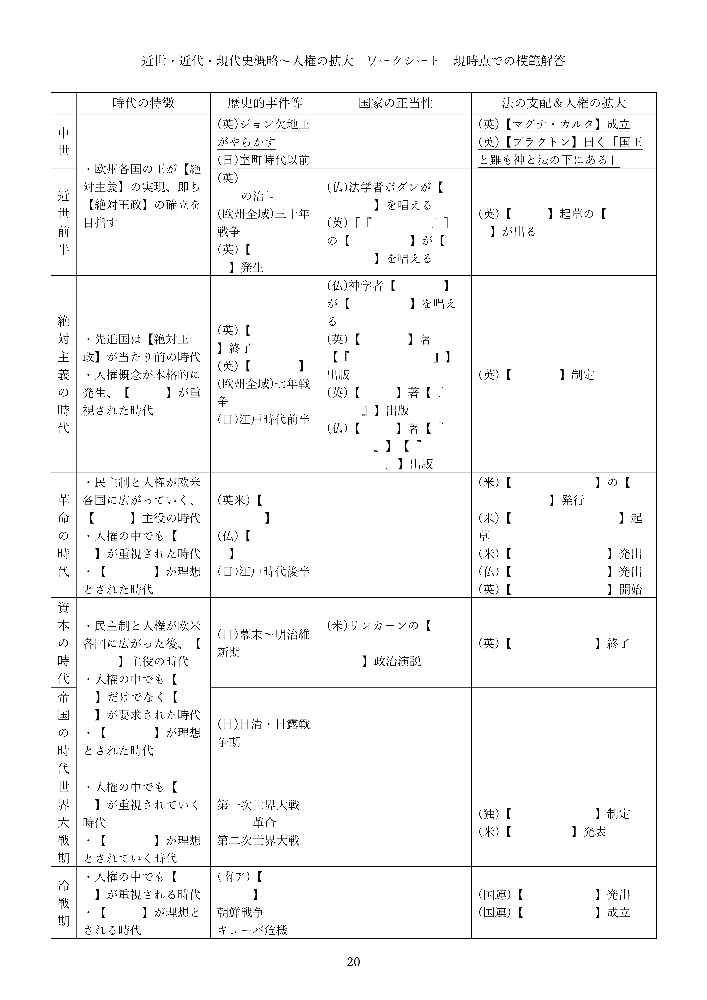  
  
### ○近世前半／エリザベス処女王  
・既に見たように、イングランド王国で絶対王政が実現する事はなかった  
⇒しかし、人によっては、「いや、世界史でエリザベス一世がイングランド絶対王政の絶頂期とか何とか見たぞ？」と思うかもしれない。という訳で、中世の次の時代、近世の歴史を取り上げよう  
  
・中世の次の時代、近世前半のイングランドは、ランカスター家とヨーク家の王位争いから始まった  
⇒いわゆる薔薇戦争。王位争いは結局、ランカスター家でもなくヨーク家でもなく、テューダー家の勝利に終わる  
  
・テューダー朝イングランド王国は、日本の歴史で言えば戦国時代とほぼ重なる事になる  
⇒応仁の乱が終わって十年もしない内にテューダー家が王位を獲得し、関ヶ原の三年後まで続く事になる  
  
・この時期の重要なイングランド王を一人挙げよ、と言われたならどうなるか？  
・多くの場合、テューダー家最後のイングランド王、“処女王”エリザベス一世の名前が挙がるだろう  
⇒西暦1533年生まれ、1603年没。イングランド王としての在位は1558-1603。日本で言えば、豊臣秀吉とほぼ同世代（秀吉は1537年生まれ1598年没）で、関ヶ原の戦い（1600年）の直後に没した事になる  
  
・彼女の治世の特徴は、大きく分けて二つある  
１：極めて議会操縦が上手く、傍からは絶対王政が実現したようにすら見える  
２：欧州の片田舎でしかなかったイングランド王国が、世界最強の大帝国になる最初の一歩となった  
  
・まず１。彼女の議会操縦の上手さは本物で、議会の同意を得るに秀でていた  
・高校世界史だと雑に「イングランド絶対王政の絶頂期」と表記されてしまう事があるぐらいである  
⇒これは要するに、処女王があまりにも議会操縦に秀でていたものだから、「処女王の意志≒議会の意志」状態になってしまい、「傍からは絶対王政が実現したようにすら見える」という話である。イングランド王国は相変わらず、（他の欧州諸国に比べて）王の権力は弱いまま、議会の権力は強いままなのに…  
  
・さて、ここで主な問題にしたいのが２である  
⇒今でこそ「西欧」と言えば先進国であるが、昔は違った。それこそ中世の初期なら、今の「西欧」は全部まとめて田舎である。況して、イングランド王国があるブリテン島は「ド田舎」であった。中世とはある面に於いて、「西欧」という田舎が、千年かけてちょっとずつ「都会」になっていく時代でもある  
  
・近世前半ともなると、欧州はかなり「都会」になり、強くなってくる  
⇒例えば、近世前半になると、欧州諸国は南北アメリカ大陸のそれなりの範囲を征服し、植民地を作るようになる。勿論、近世前半はまだまだ「世界最強の先進国は中華帝国」という時代であり、欧州人はまだまだ、中華帝国や日本を相手に喧嘩する事はできなかった。だがそれでも、欧州人はアメリカ大陸では軍事的な成功を収め、巨大な植民地を築く事ができた  
  
※植民地とは、（特に欧州各国が、欧州の外にある）外国の領土を征服し、自らのものとしたものを指す言葉である。現地の人間を奴隷にしたり、現地の資源を掘って本国へ持ち去ったりするのみならず、本国で余った人間を移民（入植）させる土地としても機能した。アメリカ合衆国も、元はと言えばイギリスの植民地である  
  
・そしてこの時期、イングランド王国もまた、「欧州の片田舎」の地位を脱し始める  
⇒これに関しては、テューダー王家の諸王がかなり頑張っている。例えば高校の世界史では、“英国海軍の父”ヘンリー八世（処女王の父）の事績がかなり取り上げられる。が、やはり、テューダー朝イングランド王国から一人「名君」を選べと言われれば、やはりそこは“処女王”エリザベス一世が選ばれるだろう  
・処女王の治世は、欧州の田舎の島国が、世界を支配する大帝国へと雄飛する最初の一歩であった  
⇒首都ロンドンでウィリアム・シェイクスピアが活躍し、多くの古典的名作が生まれたのは彼女の時代である。大海賊フランシス・ドレイクが世界を一周したのも、王立海軍がスペイン王国の無敵艦隊を沈めたのも彼女の時代である。そしてまた、彼女に時代に、イングランド王国もアメリカ大陸への入植を始めたのであった  
  
・しかし処女王エリザベス一世没後、イングランド王は再び苦労する事になる  
⇒確かに彼女の治世は、イングランド王国が大英帝国へと雄飛する契機となった。一方、テューダー朝イングランド王国が抱えていた二つの問題を、そのまま次代へ持ち越してしまったのも彼女であった  
  
・テューダー朝イングランド王国が抱えていた問題とは、以下の二つである  
１：王の権力が弱い（議会の権力が強い）  
２：財政難  
  
・まず１から。これは、中世以来続いてきたイングランド王国の伝統的な問題である  
・歴代のイングランド王と同様、処女王もまた、この問題を解決できなかった  
⇒エリザベス処女王は、あくまで「議会操縦が上手い」王であって、「イングランド王の権力を強化した王」ではなかった。中世に比べればマシになっていたとは言え、イングランドは王の権力が弱く、議会の権力が強いままだった  
  
※この問題は、言い方を変えれば、「貴族や議会が王に反抗的」という問題を解決できなかった、という話になる  
  
・続いて２。テューダー朝イングランド王国は、二代目の王以来、ずっと財政難であった  
⇒二代目は、“王立海軍の父”ヘンリー八世。処女王の父でもあり、英国国教会の創設者でもあり、そしてまた、処女王の成功の下準備をしてくれた王でもある。これは間違いなくそうで、そういう面だけ見れば、彼は名君である。しかし同時に、彼は「離婚したくて宗教改革した男」であり、「贅沢と戦争でイングランド王室を大赤字にした男」でもある  
  
・以降のイングランド王室は慢性的に赤字であり、王領地を売って赤字を補填している状態であった  
⇒当然だが、いつまでも王領地を売り続ける事はできない。収入を増やすなり、支出を減らすなり、何かしら抜本的な改革が必要である。しかしエリザベス処女王も、結局は、王領地を売る事でその場凌ぎを続ける事になってしまった  
  
・結果として、処女王没後のイングランド王には、テューダー家が抱えていた問題がそのまま残された  
⇒処女王は、テューダー家最後のイングランド王だった。彼女が死に、ステュアート家が王位を継承した時。この時既に、イングランド王室は「もう売る財産ないですよ…どうすんのこれ……」状態であった。しかも王の権力は弱く、議会の権力は強く、貴族や議会は王に反抗的であり…ほんとにどうすんのこれ……  
  

「中近世英国史概略　近世前半／エリザベス処女王」まとめ
 
 
・表面 
⇒“処女王”エリザベス一世の治世は、イングランド王国の全盛期のように見える 
 
・実態① 
⇒実際には、王の権力弱いまま、議会の権力は強いままであり、貴族や議会も王に反抗的なまだった 
 
・実態② 
⇒しかも王室財政は万年赤字で、処女王が没する頃には、切り売りする資産も尽きつつあった 
 
・結果 
⇒王権が弱いのに金もない、という深刻な問題を抱えたまま、次の時代がやってきてしまう 

  
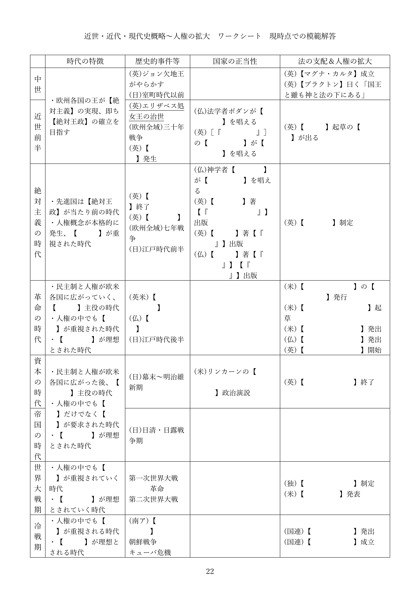  
  
### ○清教徒革命とクロムウェル護国卿の独裁  
・王権の弱さと、財政難。この二つの問題は、処女王の二代後の時代になって、大爆発する事になる  
⇒処女王の二代後の王は“殉教王”チャールズ一世。1625年（近世前半末期。日本で言うと大阪の陣から十年後、島原の乱の十年前ぐらい）に即位した彼は、暗君の教科書とでも言うべき存在であり…処女王が残した爆弾が、彼の代で大爆発してしまうのである  
  
・よく分かる！　チャールズ殉教王の無能ムーブ  
１：王太子時代、国王の命令を無視してスペイン王国へ旅行、現地で騙されるだけ騙されて帰国  
２：欧州全域を巻き込んだ大戦争、三十年戦争に介入して連戦連敗する。ただでさえカネないのに…  
３：財政破綻寸前なのに圧政やる⇒地方で反乱発生⇒反乱鎮圧の軍を動かすカネありません⇒負ける  
  
・駄目みたいですね…  
  
・こんな調子なので、議会から【権利（の）請願】というものが出た事もあった  
⇒この請願を起草したのが当時の法学者エドワード・【コーク（クック）】であり、【ブラクトン】の「国王と雖も神と法の下にある」を引用したというので有名。つまるところ、議会が王に対し、「マグナ・カルタの精神を思い出せ」「勝手に動くな、まず議会に話を通せ」と言った訳である。イングランド王国は、やはり、こんな事を言えるぐらい議会の権力が強かった  
※尚、チャールズ殉教王はこの請願を当然のように無視している  
  
・こんな事を続けていれば、いつか大きな反乱が起きるのは当然であった  
  
・1642年。首都ロンドンを含むイングランド全域は、戦闘状態へ突入した  
⇒いわゆるイングランド内戦である。即ち、イングランド王国が国王派と議会派に分かれ、内戦となったのである  
  
・内戦は十年近くに及び、結局、1649年に議会軍が勝利する  
⇒チャールズ殉教王は処刑され、「イングランド王国」は「イングランド共和国」へと生まれ変わった。内戦勃発からのこの一連の事件を、【清教徒革命（ピューリタン革命）】と呼ぶ  
  
   
・しかし、清教徒革命は、悪い王様を倒してハッピーエンド…とはならなかった  
⇒清教徒革命の後にやってきたのは、自由と繁栄ではなく、独裁と恐怖政治であった。議会軍の中心人物だったオリヴァー・クロムウェルが、“護国卿”という名の独裁者となったのである。彼の権力の源泉は、軍であった。彼は軍の要望に応えて殉教王を処刑し、議会を骨抜きにし、軍による恐怖政治を支持したのであった  
  
※本稿の筆者は、三十年戦争が終わる1648年を近世前半から絶対主義の時代へ移る年としているが、清教徒革命は1642年から1649年。まさに、時代の変わり目に起きた騒乱であった  
  
  

「中近世英国史概略　清教徒革命とクロムウェル護国卿の独裁」まとめ
 
・原因 
⇒“殉教王”チャールズ一世の失政は、王権の弱さと財政難という問題を、イングランド内戦という形で大爆発させてしまった 
※エドワード・【コーク（クック）】の【権利（の）請願】を無視したのも失政ポイント 
 
・革命 
⇒国王派と議会派による内戦は、最終的に議会派が勝利。チャールズ一世は処刑された 
※いわゆる【清教徒革命】 
 
・帰結 
⇒今度はオリヴァー・クロムウェルが独裁者となり、恐怖政治を始めた 
 

  
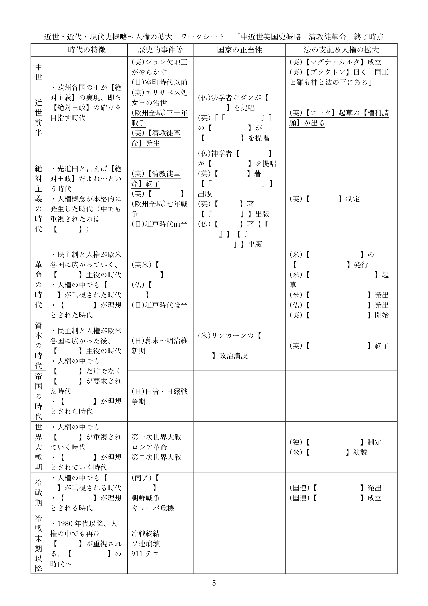  
  
### ○絶対主義の時代／王政復古と名誉革命  
・当然ながら、独裁者クロムウェルの死後すぐ、イングランド共和国は瓦解する  
⇒殉教王チャールズ一世の子はイングランドに帰還、議会に迎えられて国王に即位。ここに、イングランド王国が復活する（いわゆる王政復古）  
  
・この時イングランド王となった男は、なかなかに有能だったと言ってよい  
⇒その治世の末期には議会工作を成功させ、議会の多数が王を支持する状態を作り上げた。後継者のジェームズ二世はイングランド国内でも人気がなかったが、それでも「次の王はジェームズ二世で異論ありません！」と議会に言わせるぐらいの状態を作り、そして没した  
  
・問題は、ジェームズ二世本人であった  
⇒先代の王のお陰で、議会にも歓呼の声で迎えられた身分なのに…肝心の本人は先代に「兄上は甘すぎる」「議会に媚びを売るなんて王のやる事じゃない」というような事を言っていた。こんなんなので、即位後、ジェームズ二世は議会と対立し、失政を重ねた  
  
・1688年、イングランド議会はついに王の追放、即ちジェームズ二世の追放を決議する  
⇒ただ、今回は議会も考えた。今の王を追放するのはいいし、その為の反乱を起こすのもいいが、それで新型のクロムウェルが出てきても困る。だから今回は、他国から自分達に都合のいい王様を連れてこよう…こう考えたのである  
  
・白羽の矢が立ったのは、ドーバー海峡の向こうの国、ネーデルラント（オランダ）連邦共和国だった  
  
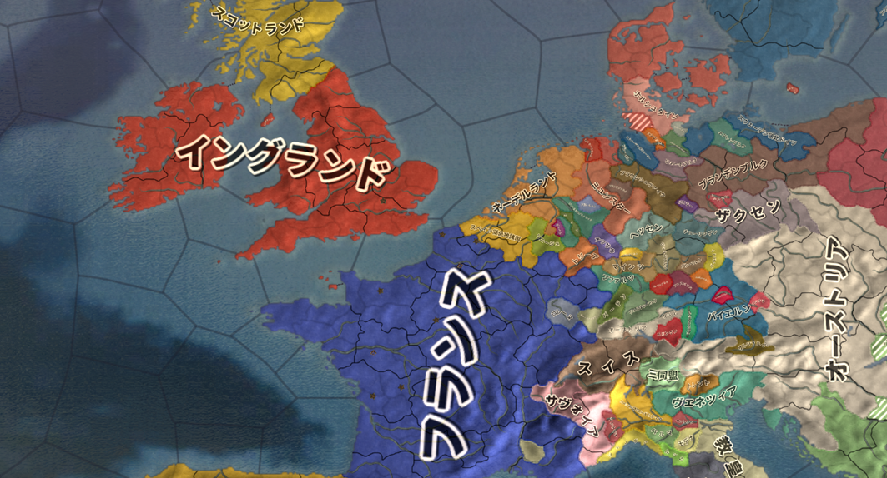  
1688年の西欧。イングランド王国の東、フランス王国の北東にある「ネーデルラント」が、ネーデルラント連邦共和国、いわゆるオランダ連邦共和国である。  
Europa Universalis IV（Extended timeline及び日本語化MOD使用）より  
  
・ネーデルラント連邦共和国には王はいなかったが、事実上の王がいた  
⇒「共和国」という言葉は「王とか皇帝とかそういうのがいない国」という意味なので、普通の共和国に王はいない。が、歴史を見てみると得てして、「共和国の王」とか「共和国の皇帝」は存在する。ネーデルラント連邦共和国もまた、「ネーデルラント総督」という事実上の王を戴く国であった  
  
・イングランド議会は、当時のネーデルラント総督ウィレム三世を招聘する事に決した  
⇒彼はイングランド王家の血を継いでおり、また、殉教王時代に出た権利請願を認めると言っていた。つまるところ、「王と雖も神と法の下にある」をイングランド王は受け入れるべきだ、と言っていたのである。イングランド議会にとってみれば、ここまで都合のいい人材は、なかなかいない  
  
・招聘を受けたウィレム三世は、軍を率いてブリテン島へ上陸する  
⇒一方、当時のイングランド国王ジェームズ二世は軍を率いて対抗しようとするのだが…失政の連発により、あまりに人気がなさすぎて軍が動かず、戦う事すらできず亡命。結果、ネーデルラント総督ウィレム三世は、イングランド王にもなったのである  
  
・イギリス人は現代でも、「無血革命だ」「名誉な話だ」として、この事件を【名誉革命】と呼んでいる  
※実際にはこの後、ジェームズ二世が軍を率いて逆襲を仕掛けてくる、いわゆるウィリアマイト戦争が起こっている。幕末日本で言えば、大政奉還が名誉革命、戊辰戦争がウィリアマイト戦争である。つまりイギリス人は、明治維新を「無血革命だ」「名誉な話だ」と自慢しているのと同じ、という話になるのだが…この面の皮の千枚張りを、日本人も多少は見習うべきかもしれない  
  
・ともあれ。名誉革命によって、イングランド内戦以来の混乱は、ようやく収まった  
⇒これ以降、イングランド、ひいてはイギリスは、欧州の列強国への道を歩み始める。そして革命の時代に至って、世界を支配する“大英帝国”と呼ばれる存在へと進化するのである  
  
・さて、世界史的な話から政経的な話に戻ろう。名誉革命の翌年、【権利章典】が定められている  
⇒これは権利請願を元に制定されたもので、現代イギリスに於いても、マグナ・カルタと並びイギリス憲法の根幹とされている存在である。権利章典の制定がイングランドにもたらした主な変化は、以下の二つになる  
  
１：王が議会の同意なく勝手に課税したり、法を停止したりできなくなった  
２：名誉革命の結果として、王位の帰属や継承も議会と法が決定できるようになった  
  
⇒「王の権利を議会と法で制限する」というイングランドの伝統は、ついに、「誰を王にするか、また王位をどう継承するかも議会と法が決める」という段階に至ったのである  
  
・こうしてイングランド王国は、絶対主義の時代に早くも民主主義国家（の基礎）を形成した  
⇒議会とは、国民による選挙（当時は全国民が選挙権を持っていた訳ではないにせよ、選挙は選挙である）によって選ばれた政治家の集まりである。その議会がついに、「誰を王にするか」まで決められるようになってしまった訳で…これは民主主義国家の基礎ができたと言っていいだろう  
  
※しかも、この後も議会が外国から王を連れてくる事はあり、外国人の王は「この国の事なんて分かんないから内政は議会がやってよ」になっていく。そういう意味でも、名誉革命は民主主義国家の基礎を作った事件だったと言ってよいだろう  
  
・一方、（清教徒革命と）名誉革命は、他の欧州国家に民主主義を広げなかった  
⇒民主主義がブリテン島の外へと広がるのは、革命の時代のアメリカ独立戦争やフランス革命からの話である  
  

「中近世英国史概略　絶対主義の時代／王政復古と名誉革命」まとめ
 
 
・復古 
⇒クロムウェルの独裁が崩壊すると、王家が呼び戻され、イングランドは再び王国となった 
 
・追放 
⇒しかしジェームズ二世は議会と対立し、追放された 
 
・革命 
⇒議会はネーデルラント総督ウィレム三世を招き、新たな王として迎えた 
※いわゆる【名誉革命】 
 
・到達点 
⇒【権利章典】によって、王の権力は議会と法によって制限され、イングランド王国は民主主義国家（の基礎）を形成した 

  

「中近世英国史概略」全体まとめ
 
 
・中世 
⇒イングランド王国にはこの時代から、「王の権利を議会と法で制限する」伝統があった。”欠地王”ジョンの失政の結果成立したマグナ・カルタ（大憲章）は、その典型である 
 
・近世前半 
⇒”処女王”エリザベス一世の時代に至り、イングランドは繁栄の第一歩を踏み出したが、王権の弱さと財政難という問題は解決されずに残された 
 
・清教徒革命（近世前半末～絶対主義の時代初頭） 
⇒上記の二つの問題は、”殉教王”チャールズ一世が連発した失政により、内戦、そして王の処刑という事態を引き起こす 
⇒しかしこの清教徒革命は、悪い王を倒してハッピーエンド、とはならなかった 
 
・名誉革命（絶対主義の時代） 
⇒清教徒革命の反省を生かした名誉革命、及び権利章典によって、「王の権利を議会と法で制限する」民主主義国家（の基礎）が形成された 

  
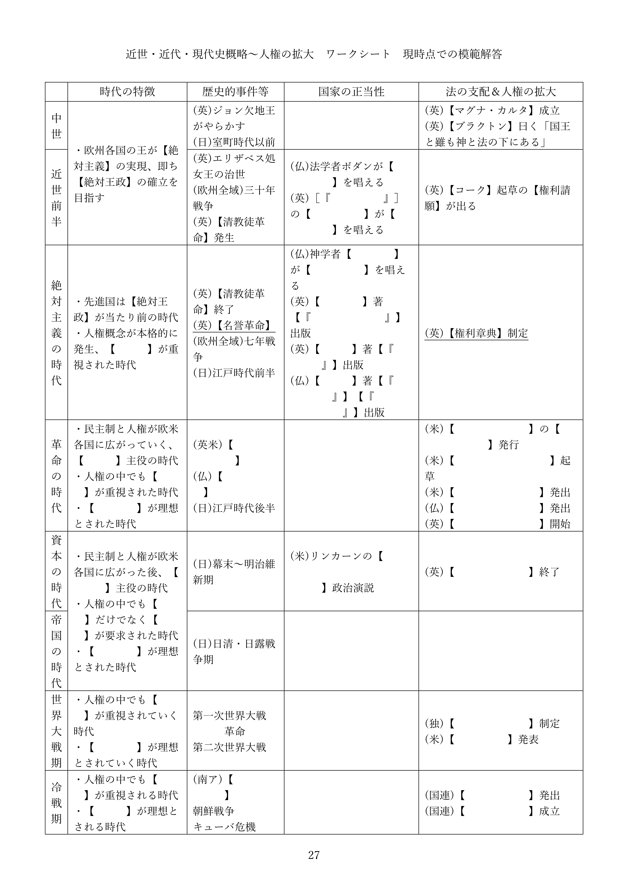  
  
## ●絶対主義の時代末期～革命の時代概略  
・既に見たように、名誉革命は直ちに現代的民主主義を欧州に広めた事件ではない  
⇒名誉革命は、イングランド王国に現代的な民主主義国家の原形を形成した…という事件である。イングランド以外の欧州諸国では絶対主義が流行しており、絶対王政こそが先進国の証明とすら言える時代であった。ブリテン島の外に民主主義が広がるのは、革命の時代を待たねばならない  
  
・革命の時代に至って民主主義は爆発的に広がるが、その直接的な原因は、絶対主義の時代末期にある  
⇒即ち、1754年から1763年にかけて起きた七年戦争が、契機となった。この七年戦争の影響でアメリカ独立戦争が、更にフランス革命が、そしてナポレオン戦争が起こる。そしてナポレオン戦争が終わる頃には、欧米諸国に「民主主義」という考え方が広まっていた  
  
・という訳で、まず七年戦争から見ていこう  
⇒この戦争は、欧州全域、更には欧州各国の植民地を巻き込んだ大戦争である。プロイセン王国＋イギリスvs残りの欧州列強全部、と表現できるような戦争であった  
  
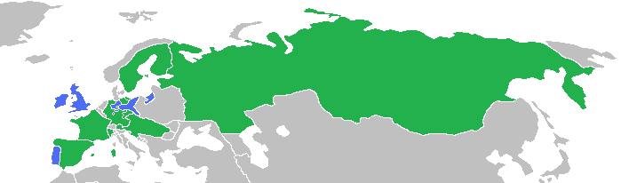  
七年戦争の外交概略図その１。青がプロイセン王国・イギリス側、緑が残りの欧州列強全部側。  
Gabagool, CC BY 3.0 <https://creativecommons.org/licenses/by/3.0>, via Wikimedia Commons  
https://commons.wikimedia.org/wiki/File:SevenYearsWar.png  
  
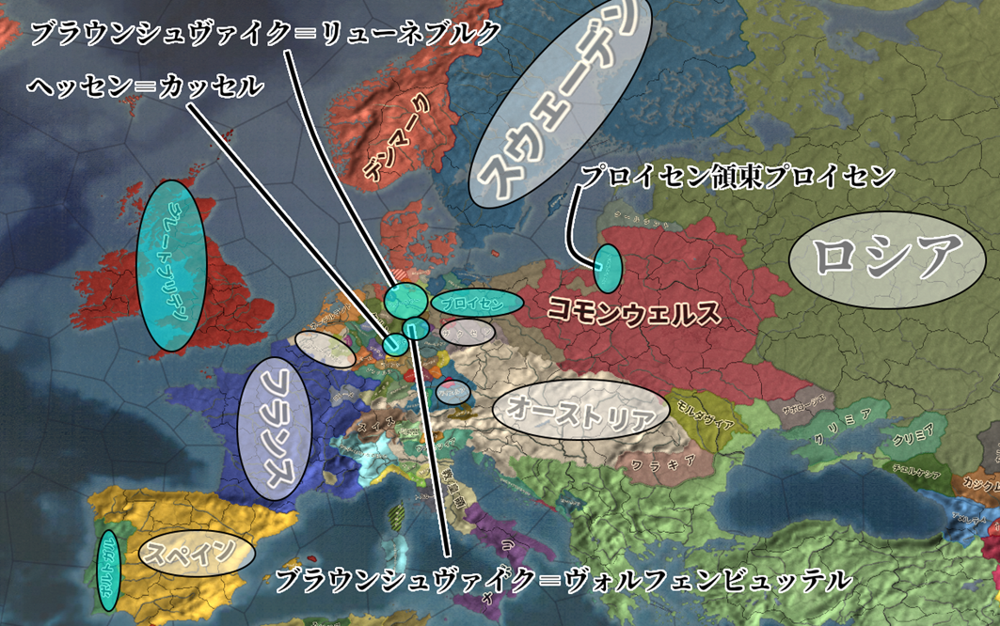  
七年戦争の外交概略図その２。水色がプロイセン王国・イギリス側。  
Europa Universalis IV（Extended timeline及び日本語化MOD使用）より  

・見るからに、プロイセン王国・イギリス側が劣勢の戦争である  
⇒この戦争についてインターネットで検索すると、人口比が400万：8000万だったとか、1:30だったとかそういう話がすぐ出てくる。その数字の真偽は別にして、「まぁ、それぐらいの差だったらあるんじゃない？」と思えるほどの、絶望的な戦力差があったのがこの戦争である。しかし、プロイセンの“大王”フリードリヒ二世の奮戦が、プロイセン・イギリス側に奇跡的な勝利をもたらしたのだった  
  
・当然、これだけの劣勢を挽回するのに、プロイセン王国もイギリスも相当の無茶をしている  
⇒イギリスの場合、軍隊の被害は少なかった（陸戦は主にプロイセン王国とその周辺の小国が担当したので）が、とにかく膨大なカネがかかった（陸戦担当諸国の金策を担当していたので）。結果、戦後のイギリスには膨大な借金が残った。この返済資金を調達するべく、戦後、イギリス本国政府は、北アメリカの植民地に膨大な額の税金を課す事になる  
  
※植民地とは、（特に欧州各国が、欧州の外にある）外国の領土を征服し、自らのものとしたものを指す言葉である。現地の人間を奴隷にしたり、現地の資源を掘って本国へ持ち去ったりするのみならず、本国で余った人間を移民（入植）させる土地としても機能した。アメリカ合衆国も、元はと言えばイギリスの植民地である  
  
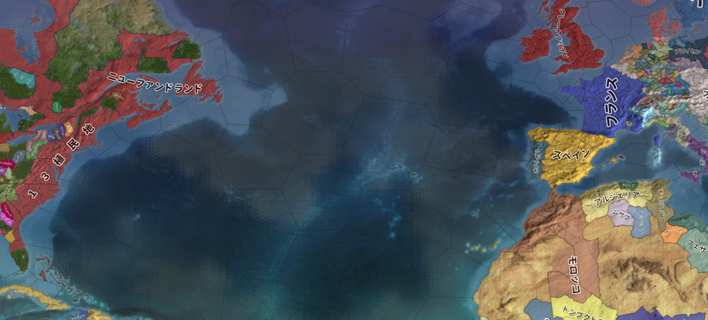  
七年戦争終結直後の西欧～北米大陸東海岸。欧州大陸側、フランスの北にある赤い島国がイギリス。アメリカ大陸側、東海岸沿岸の赤（「１３植民地」及び「ニューファンドランド」表記のところ）がイギリスのアメリカ植民地である。  
Europa Universalis IV（Extended timeline及び日本語化MOD使用）より  
  
・この重税が、イギリス本国とアメリカ植民地の戦争を引き起こしたのである  
⇒イギリス本国政府が課す重税に、アメリカ植民地の住民は反発した。それだけならいいのだが、イギリス本国政府は、対応を誤った。即ち、懲罰的な措置で対抗したのである。本国と植民地の対立は頂点に達し、ついに戦争となった  
  
・こうして、革命の時代の始まりを告げる【アメリカ独立戦争（アメリカ独立革命）】が始まった  
⇒この戦争は紆余曲折あって、植民地側が勝利する。そして、現代まで続くアメリカ合衆国が建国される事となった。アメリカ合衆国の成立は、現代の欧米系国家の中で二番目に古い、民主主義国家の誕生となったのである  
  
※尚、この独立戦争は1775～1783年と、八年に渡っている  
  
・ところで、植民地側は何故、独立戦争で勝てたのか？  
⇒植民地側が頑張ったというのもあるが、それだけでは説明がつかない。何せこの時期のイギリスは、世界を支配する“大英帝国”になりつつあった。当時のイギリスは、欧州の強国どころか、世界の強国であった。一方、当時のアメリカはザ・田舎と言う他ないぐらいのド田舎である。何故、アメリカ植民地はイギリス本国政府に勝てたのか？  
  
・実は、アメリカ独立戦争に於いて、フランス王国がアメリカ側を支援していたのである  
⇒当時の記録を見てみると、アメリカ独立戦争は「反乱を起こした植民地と、イギリス本国政府の戦争」ではなく「植民地の反乱をダシに、フランスとイギリスが代理戦争しとる…」と思われていた節がある。それぐらい、フランス王国の支援は大きかった  
  
・フランス王国とイギリスは、とにかく昔から仲が悪い  
⇒直近では、七年戦争でイギリスが勝ち、フランス王国が負けた恨みもあった。勝てない戦争を繰り返して国家財政が火の車だったフランス王国は、それでもアメリカ独立戦争に（イギリスに対する嫌がらせに）国力を注いだ。植民地を支援し、アメリカ独立を達成させて、イギリスに屈辱を味あわせた。…そしてフランス王国の国家財政は、完全に破綻したのだった  
  
・結果としてフランス王国は、借金まみれの大赤字国家になってしまったのである  
  
・現代はともかく、この時代の国が大赤字に陥ると非常に危険である  
⇒現代なら、インクを縫った紙を「カネ」と言い張っている訳で、最悪それを大量印刷する手がある（これはこれで問題があるが、手があるだけマシである）。しかしこの時代はまだギリギリ、金貨や銀貨を使っているような時代であった。そんな時代の大赤字国家でできる事は何か？　それは勿論、重税の繰り返ししかない。では、重税の取り立てを繰り返された臣民が最後にやる事は何か？　それは言うまでもなく、反乱である  
  
・時は1789年。平民の不満がついに爆発、反乱が発生する  
⇒欧州を揺るがし世界の歴史を変えた、【フランス革命】の始まりであった  
  
・フランス革命は、前半戦と後半戦に分けると理解しやすい  
⇒即ち、ナポレオン・ボナパルト登場以前と以後に分けるやり方である。これは割とよくあるやり方で、ナポレオン登場以前を「フランス革命」及び「フランス革命戦争」、ナポレオン登場以後を「ナポレオン戦争」と呼称する場合も多い  
  
・ナポレオン登場以前のフランス革命の要点は、以下の四つであろう  
  
１：重税に苦しむ平民の不満が爆発して始まった  
２：「民主主義」や「人権」といった理想を掲げ、自由、平等、博愛に満ちた理想国家を作ろうとした  
３：実際には、「理想の実現を邪魔する者は殺せ！」という方向へ暴走する  
４：３の結果、ギロチン、虐殺、恐怖政治…と国内は大混乱。しかも対外戦争まで始めてしまう  
  
・この混乱を収拾したのがナポレオン・ボナパルトである。彼の登場から退場までの要点が、以下である  
  
１：ナポレオンはフランス国内の混乱を収拾し、権力を握った  
２：そして、（それこそ「夢はでっかく世界征服！」ぐらいの勢いで）大戦争を繰り広げた  
３：ナポレオンは、一時は欧州征服完了目前まで迫ったが結局は敗れ、フランス革命は終わった  
  
⇒外国から見ると、ナポレオン登場以前のフランス革命は「なんか自国民同士で殺し合いしてる…こわ…」という感じ。そしてナポレオン登場以後のフランス革命は「こいつら世界征服始めたぞ！？」という感じである  
  
・ナポレオンの退場によって、フランス革命は完全に終わった。その影響には、二つの側面がある  
  
１：革命フランスは、欧州諸国からしてみれば、「世界征服を始めた危険集団」である。しかもその組織が掲げていたのが、「民主主義」「人権」といった理念であった。故に、「民主主義」「人権」という考え方は、戦後、各国の指導者に忌避され、封印しようという動きが出た  
  
２：一方、欧州諸国の庶民には、「民主主義」そして「人権」という思想は、単純な“悪”ではなく、人々に自由を与え、解放する“理想”としても受け取られた。各国の人々は、「俺達も民主主義やりたい」「人権が保障された国家を作っていきたい」と思うようになった  
  
⇒結果、ナポレオンの敗北から数十年で、欧州各国の人々が「民主主義」そして「人権」という概念を採用するよう国に求め始める。そして、各国の指導者もそれに逆らえなくなっていき…各国で憲法が作られたり、憲法に「人権」が明記されたり、各国で議会が作られたりしていくのである  
  
※つまるところ、フランス革命の本質のひとつとして、「暴力」と「戦争」があるのは間違いない。しかしその「暴力」と「戦争」によって欧州全域を無理矢理フランス革命に巻き込んだ結果、「民主主義」「人権」という理想が欧州各国に広がったのである  
  
  

「絶対主義の時代末期～革命の時代概略」まとめ
 
・絶対主義の時代末期 
⇒七年戦争は、イギリスとフランス王国を大赤字にした。これが、アメリカ独立戦争とフランス革命の契機となった 
 
・革命の時代（最初期） 
⇒アメリカ独立戦争によって、現代まで続く民主主義国家として、アメリカ合衆国が成立した 
 
・革命の時代（初期～中期） 
⇒フランス革命は、「民主主義」や「人権」という理想を掲げた。しかし、ギロチン、虐殺、恐怖政治を生み、更にはナポレオン戦争という大戦争にも繋がった 
 
・結果 
⇒暴力と戦争を伴いながらも、「民主主義」と「人権」という考え方は欧米世界へ広がった。ナポレオンの退場後、数十年も経つと、欧米諸国の人々は「民主主義」と「人権」を求めるようになり、各国政府も徐々にこれを受け入れるようになる 

  
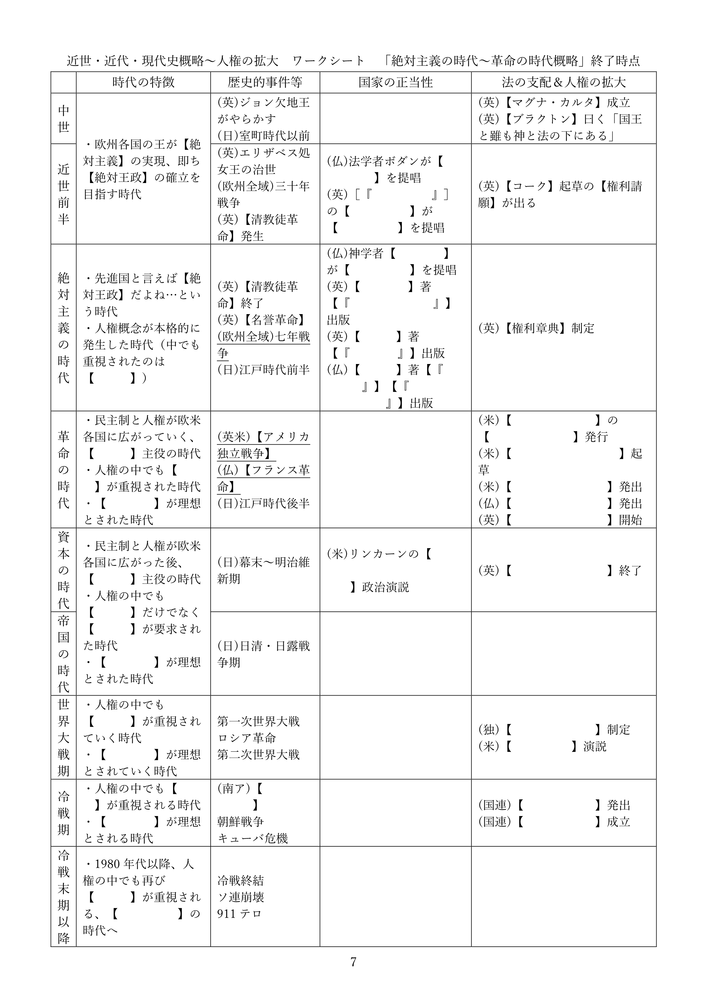  
  
## ●各時代の特徴  
### ○前説  
・通史の授業は一旦、ここで終わりとする  
⇒ここまで、中世から革命の時代までの歴史をざっくりと見てきた。この後の資本の時代と帝国の時代は、経済分野でまた取り上げる。現段階ではざっくり「欧米諸国が世界中の国を征服して植民地にしていく」時期だと思えばいい。そして帝国の時代の後、即ち世界大戦期以降の話は、政治分野第四章でまた取り上げる  
  
・ここからは、歴史は歴史でも、各時代の特徴について述べる  
⇒ここまでの通史の授業は、公共や政治経済を勉強する上での土台、予備知識である。一方、ここから先は、大学入試の公共や政治経済でもバンバン出題される話となる。今までに学んだ予備知識を元に、しっかり学習していこう  
  
  
### ○市民革命期  
・【名誉革命】【アメリカ独立戦争】【フランス革命】は、［市民革命］と呼ばれる事が多い  
⇒市民革命が起きた時期を、政経の教科書や参考書では「十八世紀」と表現する事が多い。十八世紀とは勿論、1701年から1800年を指す。が…知っての通り、名誉革命が起きたのは1688年。十八世紀ではない。また、フランス革命が起きたのは1789年でも、完全に終わるのは1815年である。それでも、政経の教科書や参考書では「十八世紀」と言い切ってしまうパターンが結構ある。注意しておこう  
  
※市民革命は「近現代的な社会（民主主義や資本主義を軸とする社会）を創出した」と説明される事が多い  
※市民革命という言葉、実は訳語なのだが、翻訳がよくない。本来は「金持ち革命」みたいな言葉である  
※尚、【清教徒革命】は「市民革命」に入れてもらえない事が多い  
  
・十八世紀（？）、特に革命の時代には、以下のような特徴がある  
１：【資本家】が主役の時代である  
２：人権の中でも【自由権】が重視された時代である  
３：自由主義国家が理想とされ、特に【夜警国家】こそが理想とされた  
  
・資本家とは、ざっくり言えば、会社の社長や工場の所有者といった層である  
⇒革命の時代は産業革命が進行し、徐々に「機械で商品を大量生産する」ができるようになっていく時代である。故に会社を興し、機械を設置した工場を作り、社員を雇って働かせる金持ちがどんどん増えていく。が資本家であり、彼らが市民革命期の主役となったのである  
  
※市民革命は英語だとbourgeois revolutionなのだが、このbourgeois、片仮名で言えばブルジョワジー、普通に訳すと資本家である。市民革命は本来「金持ち革命」みたいな意味だ…というのは、つまりそういう事である  
  
・この時期に最も重視された人民の権利とは、【自由権】であった  
⇒当たり前だが、資本家の求める事は常に、「もっと自由に経済活動させろ」「もっと自由に金を儲けさせろ」である。十八世紀（？）、特に革命の時代は、資本家が時代の主役であった。となれば当然、重視される人権は自由権、「国家は黙って座ってろ。俺達国民を自由にしろ」という人権になる。  
  
※いわゆる自由主義であり、特に、経済活動の自由が重視された  
  
・この時期の経済活動の自由重視路線は、イギリスの経済学者【アダム・スミス】によって理論化された  
⇒代表作は【『国富論』】。政府は何もせず、国民が自由に金儲けする事を認める【自由放任（レッセ・フェール）】主義によってこそ、国は発展する…という理論である  
  
・そしてまた、この時期に理想とされたのは、自由を尊重する自由主義国家であった  
⇒中でも、【夜警国家】こそが理想とされた。いわゆる【小さな政府】路線の究極形、【必要最小限の役割だけを担う国家】をこう呼ぶ  
  
※ここで言う「必要最小限の役割」は最低限の立法・国防・治安・裁判等を指す  
  
※夜警国家という名前自体は、そのような国家を批判したプロイセン王国の政治学者、フェルディナント・ヨハン・ゴットリープ・［ラッサール］によるものである  
  

「各時代の特徴　市民革命期」　まとめ
 
 
<table>
  <tr>
    <th rowspan="5">市民革命期 ※革命の時代まで</th>
    <th>［市民革命］とされる事件</th>
    <td>
      【名誉革命】【アメリカ独立戦争】【フランス革命】 
      ※【清教徒革命】を含めるかは立場による
    </td>
  </tr>
  <tr>
    <th>主役となった層</th>
    <td>【資本家】</td>
  </tr>
  <tr>
    <th>重視された人権</th>
    <td>【自由権】</td>
  </tr>
  <tr>
    <th>理想とされた国家</th>
    <td>
      【小さな政府】路線の【夜警国家】 
      ※名付け親はフェルディナント・ヨハン・ゴットリープ・［ラッサール］
    </td>
  </tr>
  <tr>
    <th>理論的背景</th>
    <td>
      【『国富論』】の【アダム・スミス】 
      ※【自由放任（レッセ・フェール）】を推奨
    </td>
  </tr>
</table>

  
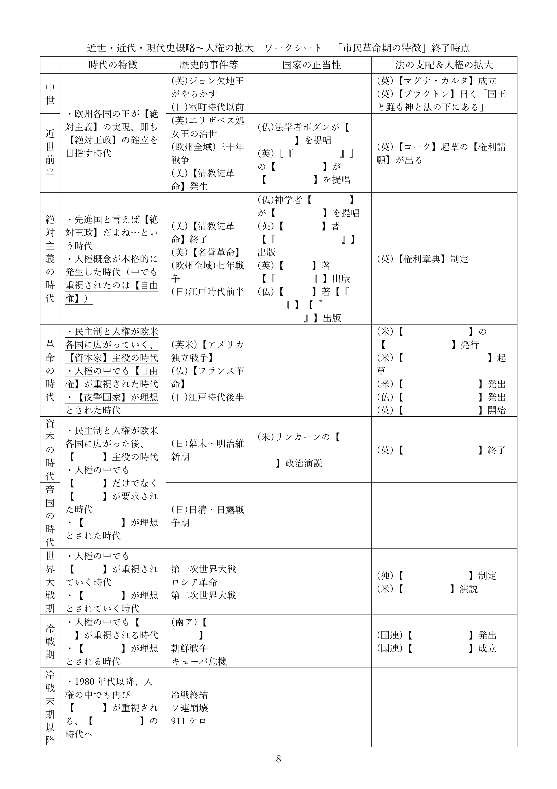  
  
### ○資本の時代、帝国の時代  
・革命の時代が終わった後も、基本的な枠組みは維持された  
⇒即ち、時代の主役は資本家だったし、人権の中でも特に自由権が大事にされたし、理想国家とは即ち夜警国家を指していた  
  
・しかし、自由権の尊重は、厄介な問題を引き起こした  
⇒資本家の言う「自由」は、結局のところ、自分達に都合のいい「自由」だったのである。例えば資本家層は、以下のような「自由」を行使した  
  
例１：労働者を一日に十四時間働かせる「自由」  
例２：子供であろうとも過酷な労働に従事させる「自由」  
例３：貧乏な労働者は選挙に行かせない「自由」  
  
⇒その癖、金持ちは「貧乏人が貧乏なのは、怠惰で無能だからだ。自己責任である！」と考えるのである。当然、労働者をはじめとする貧困層は、これに対する反動を強めていく事になる  
  

  
<b>～何でそうなんねんおかしいやろ～（クリック・タップして雑談を表示）</b>

  

 
　自由権を最大限尊重する国家（自由主義国家）は、国民の行動が政府によって制限されない。国民は生まれながらに皆平等であり、何をしても自由。そういう社会になる。 
　こういった社会に、だらしない成功者というのはほぼいない。即ち、自由主義国家に於ける成功者は、非常に勤勉で大変な努力を積み重ねている。 
　そしてそういう人ほど、こう思うのである。 
 
「自分は特別な存在ではない」 
「皆と同じただの人間で、人一倍努力しただけだ」 
 
　もっと言えば、こう思うのである。 
 
「自分と同じように努力すれば、誰でも自分のように成功できる」 
 
　この考え方自体は無論、美徳である。しかしこの考え方が裏返ると、まずい事になる。何故なら、「努力すれば成功できる」という命題の対偶は、「努力しない者は失敗する」なのである。つまり、「貧乏人が貧乏なのは、怠惰で努力不足だからだ」と思ってしまうのだ。 
　こうして、「貧乏人が貧乏なのは、怠惰で無能だからだ。自己責任である！」と考える金持ちが誕生するのである。 
 
　この説明で分かりにくければ、学校の成績で考えると分かりやすいかもしれない。いい成績を取っている生徒は大抵、非常に勤勉でよく勉強している。しかしそれを元に「勉強すれば成績は上がる」と考え、更に「成績の低い奴は勉強していない」もしくは「勉強する気がない奴は成績が低い」、そして「成績低いのは自己責任！」とすると、問題が出てくる。 
　世の中には、「勉強してるけど成績上がらない」人や「勉強したくてもできない環境で生活している」人もいるのである。 
<b>～「努力できる」という事そのものが「恵まれている」事の証明だと、恵まれている人には分からない～</b> 
 
  

  
・革命の時代末期から資本の時代、帝国の時代にかけて、【参政権】が求められるようになる  
⇒これは、資本家が振り回す「自由」に対する反動であった  
⇒参政権は「政治に参加する権利」、要するに選挙に出たり選挙で投票したりする権利である。「貧乏人には選挙に行かせない自由」を行使する資本家に対する反動であった  
  
・とは言え、資本の時代にしろ帝国の時代にしろ、革命の時代から続く枠組みは、維持されていた  
⇒例えば、参政権が重視されるようになったからと言って、自由権を重視する風潮がなくなった訳ではない。自由権に加えて参政権も重視されるようになった、というだけである。自由権を重視し夜警国家を理想とする、革命の時代以来の枠組みが崩れるには、二度の世界大戦を待たねばならない  
  

「各時代の特徴　資本の時代、帝国の時代」
 
 
<table>
  <tr>
    <th rowspan="5">市民革命期 ※革命の時代まで</th>
    <th>［市民革命］とされる事件</th>
    <td>
      【名誉革命】【アメリカ独立戦争】【フランス革命】 
      ※【清教徒革命】を含めるかは立場による
    </td>
  </tr>
  <tr>
    <th>主役となった層</th>
    <td>【資本家】</td>
  </tr>
  <tr>
    <th>重視された人権</th>
    <td>【自由権】</td>
  </tr>
  <tr>
    <th>理想とされた国家</th>
    <td>
      【小さな政府】路線の【夜警国家】 
      ※名付け親はフェルディナント・ヨハン・ゴットリープ・［ラッサール］
    </td>
  </tr>
  <tr>
    <th>理論的背景</th>
    <td>
      【『国富論』】の【アダム・スミス】 
      ※【自由放任（レッセ・フェール）】を推奨
    </td>
  </tr>

  <tr>
    <th rowspan="4">資本の時代、帝国の時代</th>
    <th>主役となった層</th>
    <td>【資本家】</td>
  </tr>
  <tr>
    <th>重視された人権</th>
    <td>
      【自由権】と【参政権】 
      ※市民革命期からここだけ変わった
    </td>
  </tr>
  <tr>
    <th>理想とされた国家</th>
    <td>【小さな政府】路線の【夜警国家】</td>
  </tr>
  <tr>
    <th>理論的背景</th>
    <td>【『国富論』】の【アダム・スミス】 
      ※【自由放任（レッセ・フェール）】を推奨</td>
  </tr>
</table>

  
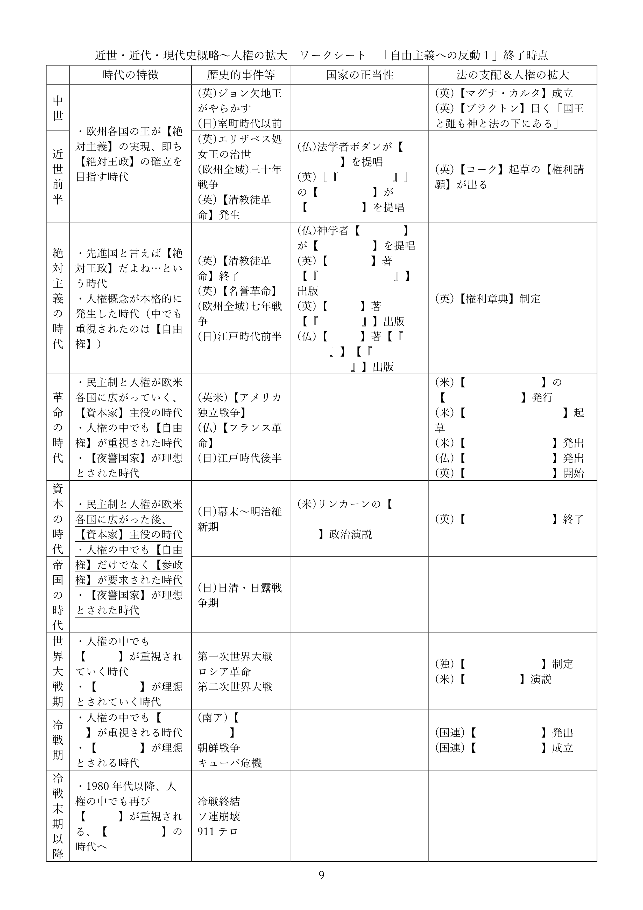  
  
### ○世界大戦期、冷戦期  
・ここから、世界大戦期から冷戦期（1980年代まで）の特徴を述べていこう  

  

※「×年から×年が△△時代」というのは人によって変わる。上記はあくまで一例である。私の授業では、この時代区分で通す予定  
例：「革命の時代」という概念を最初に言い出した歴史家は、革命の時代を1789年開始としている  
  
・上記表を見ての通り、世界大戦期には二度の世界大戦があった  
⇒世界中の先進国が二つの陣営に分かれ、全面戦争を繰り広げた戦争が、二回あったのである  
  
・一方、冷戦は、第二次世界大戦終結後の時代である  
⇒世界中がアメリカ陣営とソ連（現ロシア連邦）陣営に分かれ、対立し続けた時代であった  
  
※「世界大戦が何で起きたのか？」や「冷戦期にはどんな事件が起きたのか？」というのは、政治分野第四章にて詳しく扱う。今は、「へ～1914年から1991年ぐらいまでってそんな時代だったんやな～」ぐらいに思っておいてくれればよい  
  
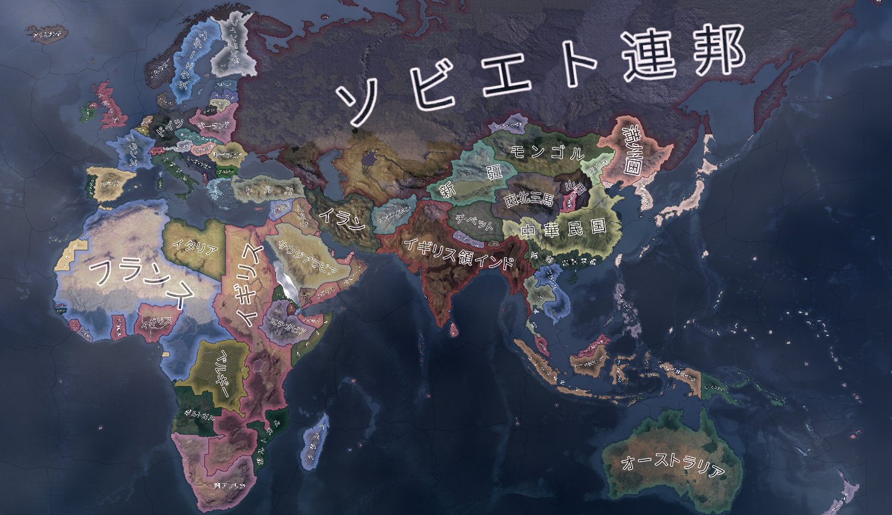
1936年の旧大陸地図。これから話題にするソヴィエト社会主義共和国連邦（ソ連）は、ロシア革命の結果誕生した。この国は、大日本帝国、そして日本国の隣国でもあった。  
Paradox Interactive社のHearts of Iron IVより
  
・さて、市民革命が連続した時代以来、人権は一つの「流行」になっていた  
⇒中でも「流行」となったのは自由権であり、自由権が最も尊重される時代が続いていた  
  
・そんな、自由権尊重の風潮への反動は、世界大戦期になって極限へと達する  
⇒第一次世界大戦中にロシア革命が発生したのは、その反動が極限に達したから、というのが大きな理由の一つとして挙げられるだろう。この革命によってロシア帝国は滅び、ソヴィエト社会主義共和国連邦（ソ連）が誕生する  
  
・尚、ロシア革命は市民革命には分類されない事が多い  
⇒この革命は、資本家が主役となった革命ではなかった。【共産主義（社会主義）】に基づく反乱だったのである  
  
※以前、「市民革命という言葉は本来、金持ち革命みたいな意味の言葉だよ」という旨の事を言ったが…元はと言えば、共産主義（社会主義）者が、「俺達の革命は、市民革命みたいな金持ちがやった革命とは全然違う！」という文脈で作った言葉が“市民革命”である。そりゃあ市民革命には入らないだろう  
  
・では、共産主義（社会主義）はどんな思想なのか？  
⇒詳しいところは、経済分野第一章で細かく解説する。よって今は、ざっくり以下のような思想であると考えてよい  
  
>「そもそも自由権を尊重した結果、貧乏人が困窮する事になったのは誰のせいだ？」  
>「自由の美名の下に私腹を肥やし、労働者をいじめる資本家がいるからだ」  
>「だから、資本家中心の社会を打ち倒し、労働者による労働者の為の国家を作るのだ」  
>  
>以上が、共産主義（社会主義）の基本的な考え方である。  
>  
>尚、共産主義（社会主義）者が権力を握った国は例外なく、暴力革命、一党独裁、秘密警察、監視国家…という路線へ進んだ。即ち、「資本家中心の社会を打ち倒し」は「敵対階級の排除」つまり「金持ちを皆殺し」になり、その後の社会は独裁と恐怖政治となり、「革命の裏切り者を殺そう！」系監視国家へと必ず進んだ。言ってみれば、共産主義（社会主義）国家に於ける共産主義（社会主義）は、「金持ちを殺しましょう教」と化した。  
  
・上記共産主義（社会主義）が初めて起こした革命がロシア革命であり、初めて作った国がソ連であった  
⇒この革命によってロシア帝国は滅び、ソヴィエト社会主義共和国連邦（ソ連）が誕生する。そしてソ連は、「金持ちを皆殺し」にし、独裁と恐怖政治を行い、「革命の裏切り者を殺そう！」系監視国家と化した。しかも、世界各国へ「君達も敵対階級を排除しよう！」と宣伝し、スパイを派遣（やる事は「金持ちを殺しましょう」教の宣教）していく。これは第二次世界大戦の原因の一つであり、また、冷戦の原因でもある  
  
※「共産主義と社会主義って何か違うの？」という疑問があるかと思いますが、「俺は社会主義だ！」と言えばそいつは社会主義、ぐらいの雑な認識で問題ありません。日本共産党自身が、本来は「同じ意味」と言っているぐらいなので、細かい違いが気になる人は、大学で研究してください。本稿では、ソ連をはじめとする政治勢力として言う時は共産主義、経済理論として言う時は社会主義で使い分けます  
  
・当然、ロシア革命及びソ連の「金持ち殺しましょうよ」攻勢に、一般自由主義国家の皆さんは恐怖する  
⇒何せ、人権だ自由権だとか言って労働者を虐め過ぎたら、金持ち皆殺し国家が誕生したのである。ロシア革命は明らかに、「自由権至上主義はやめましょう」という風潮の誕生に大きな役割を果たした  
  
※言うまでもなく、「自由権至上主義はやめましょう」という風潮を生んだ要因は他にもある。が、全部説明していくと膨大な量になるし、「最大の要因を挙げろ」と言われたら「ロシア革命とソ連誕生」という人は多い。そういう訳で、この要因を手掛かりに、以下、世界大戦期と冷戦期の特徴を説明していく事にする  
  
・こうして、「自由権を多少制限してでも【社会権】を重視しよう」という新しい流行が生まれた  
⇒社会権をざっくり説明すると「困窮する国民が、国家によって救済される権利」。健康保険制度を導入したり、貧困で食うにも困る国民に生活保護を与えたり、不況で仕事がない国民に公共事業で仕事を与えたりするのは、社会権の実現である  
  
・自由権と社会権は、全く逆の概念と言っていいだろう。以下に比較してみよう  
自由権：「政府は黙って座ってろ」「俺達国民を自由にしろ」  
社会権：「政府は黙って座ってないで立て」「俺達国民を助けろ」  
  
・革命の時代から帝国の時代にかけて流行った自由権は、必然的に小さな政府を志向させる  
⇒言い方を変えれば、自由権が重視される社会は、「黙って座ってる」政府を要求する。国民は自由に、勝手に幸福になっていくから、「政府は黙って座ってろ」という社会である。その極端な例が、夜警国家であると言っていい  
  
・一方、世界大戦期から流行り始めた社会権は、【大きな政府】を志向させる  
⇒即ち、社会権が重視される社会では、「国民を幸せにしてくれる政府」「“みんな”を幸せにしてくれる政府」が要求される  
※勿論、どこまでが“みんな”に入るのか、というのは大きな問題になる  
  
・この流行は、世界大戦期から冷戦期にかけて、様々な国家を生む事になる  
  
|大きな政府路線の流行で誕生した国家|代表例|  
|:---:|:--:|
|共産主義国家 （自由なんて知らん、“みんな”が幸せになるのが大事だろ！）|ソ連、ソ連の属国群|  
|ファシズム系国家 （自由なんて知らん、“みんな”が幸せになるのが大事だろ！）|ドイツ国（第二次世界大戦期）、イタリア王国（第二次世界大戦期）|  
|【福祉国家】 （社会権重視だが、自由権もそれなりには重視したい）|第二次世界大戦後の日本国、欧米先進諸国|  
  
※ソ連はともかく、ここにヒトラー時代のドイツ国が並んでいるのを見てびっくりする人もいるかもしれない。しかしながら、両国共に、「自由権を多少制限してでも社会権を重視しよう」という流行、もっと言えば「“みんな”を幸せにしてくれる政府」を作ろう、という流行に乗って作られた国である。勿論、“みんな”の中に入っていない人達はえらい目に遭った訳だが  
  
・これらの国の中で、世界大戦を勝ち抜き、そして冷戦の勝者となったのは【福祉国家】である  
⇒もっと言えば、冷戦中期には、先進国の大勢は【福祉国家】になっていた  
  
※ファシズム系国家は冷戦期には消滅済み。一方、冷戦期の共産主義国家で先進国と言えるのは、ソ連ぐらいなものである  
  
・上記の事情もあり、世界大戦期から冷戦期に理想とされた国家は、【福祉国家】と言われる事が多い  
⇒その説明は【社会保障や、公共事業による雇用の創出などを重視する国家】というものが多い。要するに、【社会権】重視だが自由権も完全に投げ捨ててはいない、【大きな政府】路線の国家である  
  
※福祉国家が重視される時代の経済理論の基礎を提供したのは、イギリスの経済学者ジョン・メイナード・【ケインズ】。その代表作は［『雇用、利子及び貨幣に関する一般理論』］である。「不景気なら、景気が良くなるように政府が仕事をしろ！」という、まさに大きい政府路線の時代の経済学者である  
  

「各時代の特徴　世界大戦期、冷戦期」　まとめ
 
 
<table>
  <tr>
    <th rowspan="5">市民革命期 ※革命の時代まで</th>
    <th>［市民革命］とされる事件</th>
    <td>
      【名誉革命】【アメリカ独立戦争】【フランス革命】 
      ※【清教徒革命】を含めるかは立場による
    </td>
  </tr>
  <tr>
    <th>主役となった層</th>
    <td>【資本家】</td>
  </tr>
  <tr>
    <th>重視された人権</th>
    <td>【自由権】</td>
  </tr>
  <tr>
    <th>理想とされた国家</th>
    <td>
      【小さな政府】路線の【夜警国家】 
      ※名付け親はフェルディナント・ヨハン・ゴットリープ・［ラッサール］
    </td>
  </tr>
  <tr>
    <th>理論的背景</th>
    <td>
      【『国富論』】の【アダム・スミス】 
      ※【自由放任（レッセ・フェール）】を推奨
    </td>
  </tr>

  <tr>
    <th rowspan="4">資本の時代、帝国の時代</th>
    <th>主役となった層</th>
    <td>【資本家】</td>
  </tr>
  <tr>
    <th>重視された人権</th>
    <td>【自由権】と【参政権】</td>
  </tr>
  <tr>
    <th>理想とされた国家</th>
    <td>【小さな政府】路線の【夜警国家】</td>
  </tr>
  <tr>
    <th>理論的背景</th>
    <td>
      【『国富論』】の【アダム・スミス】 
      ※【自由放任（レッセ・フェール）】を推奨
    </td>
  </tr>

  <tr>
    <th rowspan="3">世界大戦期、冷戦末期まで</th>
    <th>重視された人権</th>
    <td>【社会権】</td>
  </tr>
  <tr>
    <th>理想とされた国家</th>
    <td>【大きな政府】路線の【福祉国家】</td>
  </tr>
  <tr>
    <th>理論的背景</th>
    <td>［『雇用、利子及び貨幣に関する一般理論』］のジョン・メイナード・【ケインズ】</td>
  </tr>
</table>

  
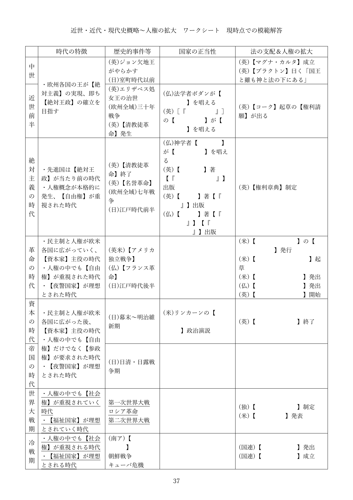  
  
### ○冷戦末期以降（新自由主義の時代）  
・世界がアメリカ陣営とソ連陣営に分かれて争った冷戦は、1991年には終了する  
⇒実際のところ、1980年代のソ連は、崩壊寸前の失敗国家と化しつつあった。それもあって、1985年にソ連のトップとなった政治家が「もう米ソで争うのはやめよう！」と言い始め、1989年には米ソ首脳会談によって冷戦終結宣言が発出。そして1991年、ソ連が実際に崩壊。ここに、冷戦は完全に終わった  
  
・冷戦末期となる1980年代、先進各国は大きな変化を経験する  
⇒この時期になると、先進国各国で「福祉国家路線はもう駄目だ」「やっぱり自由主義が一番！」という声が大きくなってくるのである  
  
１：欧米先進諸国が、経済的に行き詰ってきた  
⇒1980年代ぐらいになると、福祉国家を志向する多くの国の経済が、伸び悩むようになった。結果、「福祉国家はもう駄目だ」「ケインズ的なやり方はもう駄目だ」という人が出てきた  
  
２：そもそも、欧米先進国が福祉国家をやる事そのものが難しかった  
⇒結局、福祉国家は「国民の自由をある程度制限」して社会権を重視する国家である。そして、福祉国家をやっている欧米先進国は、自分達を「自由主義陣営」と言っているぐらいで、本音では自由権を重視したい国家であった。となれば、「福祉国家路線はもう駄目だ」となった時、「やっぱり自由主義（自由権重視）が一番！」となるのは当然であった  
  
※アメリカ合衆国やイギリスのような欧米先進国は、冷戦期、ソ連と対立していた。故に、自由権重視で貧乏な国民を放置していると、ソ連に「ほら見てください！」「結局こいつら、自由の美名の下、金持ちが貧乏人を虐めるのを放置してるんですよ！」と宣伝されてしまう。結果、「社会権重視だが自由権も完全に投げ捨ててはいない」という形になったのが福祉国家であり…ソ連が弱体化したり消滅したりする中で自由主義が復活するのは、当然の話と言えた  
  
・こうして欧米先進国では、反社会権、反福祉国家、反ケインズ的な考え方が流行となった  
⇒こういった考え方を、まとめて【反ケインズ主義】と呼ぶ場合が多い。一方、反ケインズ主義的な人々が乗った新たな流行は【新自由主義（ネオリベラリズム）】と呼ばれる事が多い  
  
※革命の時代前後、自由権を重視する考え方は自由主義（リベラリズム）と呼ばれていた。今回、一度自由が重視されなくなった後、新たにまた自由が重視されるようになった…という事で、1980年代以降の自由権重視思想を新自由主義（ネオリベラリズム）と呼ぶのである  
  
※同じ反ケインズ主義的な考え方として、［新保守主義（ネオコンサバティズム）］もある。小さな政府路線を志向するという意味で新自由主義とよく似た考え方であり、明確にここが違う、と指摘するのは難しい。「社会権なんていいんだよ、国民は自由にさせておけばいいんだ」という政治的な考え方が前者、「俺達国民に、自由に金儲けさせろ」という経済的な考え方が後者…と考えると分かりやすいかもしれない  
  
・新自由主義を掲げる人々は、【自由権】を重視した【小さな政府】路線を称賛した  
⇒【財政赤字】解消、【政治腐敗】の防止等をお題目に、【小さな政府】路線の復活を提唱した。こうして、【自由権】を重視した【小さな政府】路線の国家が、再び人気を得るのである  
  
・1980年代に新自由主義を導入し始めた各国の政治指導者としては、以下の者が挙げられる  
  
日本国：【中曽根】康弘内閣総理大臣  
アメリカ合衆国：ロナルド・【レーガン】大統領  
イギリス：マーガレット・【サッチャー】首相  
  
※日本の場合、こういう流れを最初に始めたのは中曾根だが、決定的にしたのは【小泉純一郎】である  
  
・また、新自由主義の理論を提供した学者としては、一般にミルトン・【フリードマン】が挙がる  
⇒新自由主義には様々な流派がある（マネタリズムとか、サプライサイドエコノミクスとか）が、中でも一番有名なのは、【マネタリズム】を提唱したミルトン・フリードマンである  
  

  
「各時代の特徴　冷戦末期以降」まとめ

  <table>
    <tr>
      <th rowspan="5">市民革命期 ※革命の時代まで</th>
      <th>［市民革命］とされる事件</th>
      <td>
        【名誉革命】【アメリカ独立戦争】【フランス革命】 
        ※【清教徒革命】を含めるかは立場による
      </td>
    </tr>
    <tr>
      <th>主役となった層</th>
      <td>【資本家】</td>
    </tr>
    <tr>
      <th>重視された人権</th>
      <td>【自由権】</td>
    </tr>
    <tr>
      <th>理想とされた国家</th>
      <td>
        【小さな政府】路線の【夜警国家】 
        ※名付け親はフェルディナント・ヨハン・ゴットリープ・［ラッサール］
      </td>
    </tr>
    <tr>
      <th>理論的背景</th>
      <td>
        【『国富論』】の【アダム・スミス】 
        ※【自由放任（レッセ・フェール）】を推奨
      </td>
    </tr>
    <tr>
      <th rowspan="4">資本の時代、帝国の時代</th>
      <th>主役となった層</th>
      <td>【資本家】</td>
    </tr>
    <tr>
      <th>重視された人権</th>
      <td>【自由権】と【参政権】</td>
    </tr>
    <tr>
      <th>理想とされた国家</th>
      <td>【小さな政府】路線の【夜警国家】</td>
    </tr>
    <tr>
      <th>理論的背景</th>
      <td>【『国富論』】の【アダム・スミス】</td>
    </tr>
    <tr>
      <th rowspan="3">世界大戦期、冷戦末期まで</th>
      <th>重視された人権</th>
      <td>【社会権】</td>
    </tr>
    <tr>
      <th>理想とされた国家</th>
      <td>【大きな政府】路線の【福祉国家】</td>
    </tr>
    <tr>
      <th>理論的背景</th>
      <td>［『雇用、利子及び貨幣に関する一般理論』］のジョン・メイナード・【ケインズ】</td>
    </tr>
    <tr>
      <th rowspan="5">1980年代以降 （冷戦末期以降）</th>
      <th>重視された人権</th>
      <td>
        【自由権】 
        ※いわゆる【新自由主義（ネオリベラリズム）】。似た考え方として［新保守主義（ネオコンサバティズム）］もある
      </td>
    </tr>
    <tr>
      <th>↑をやる上でのお題目</th>
      <td>
        【財政赤字】解消 
        【政治腐敗】の防止
      </td>
    </tr>
    <tr>
      <th>理想とされた国家</th>
      <td>
        【小さな政府】路線の国家 
        ※夜警国家という言葉はあまり使われない
      </td>
    </tr>
    <tr>
      <th>理論的背景</th>
      <td>【マネタリズム】のミルトン・【フリードマン】</td>
    </tr>
    <tr>
      <th>代表的な政治家</th>
      <td>
        【中曽根】康弘（日） 
        ロナルド・【レーガン】（米） 
        マーガレット・【サッチャー】（英）
      </td>
    </tr>
  </table>

  
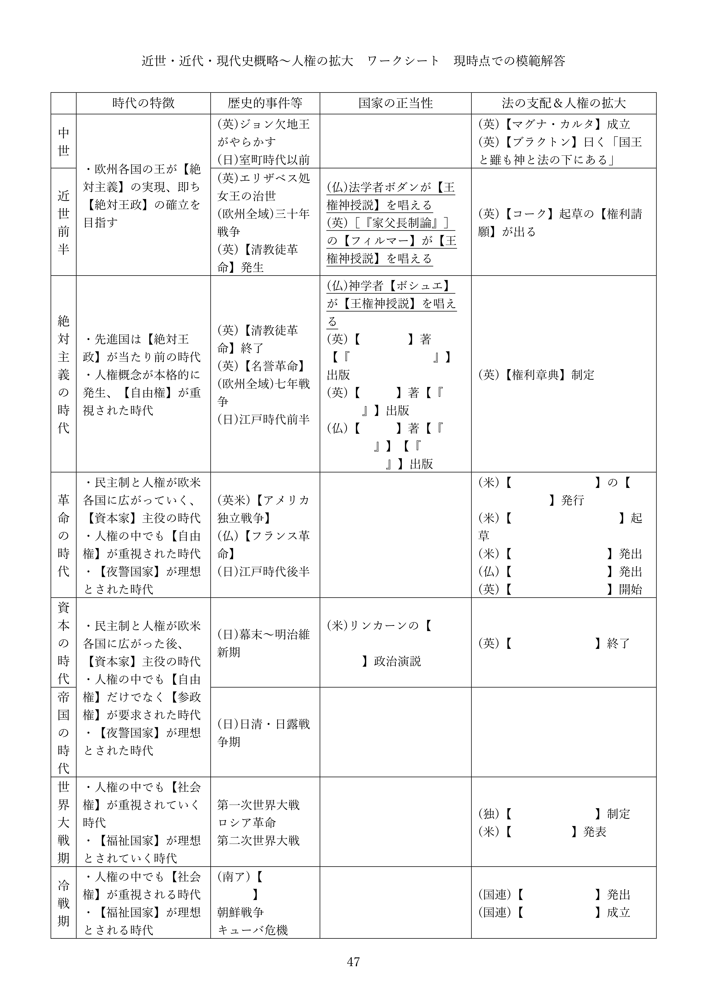  
  
### ○現代  
・先のまとめやワークシートの「冷戦末期以降」の箇所を見て、読者は既視感を覚えた筈である  
⇒「市民革命期」「資本の時代、帝国の時代」の箇所と、「冷戦末期以降」の箇所、書いてある事がかなり似ていた筈である。重視された人権も、理想とされた国家も一緒だから当然なのだが…  
  
・となると鋭い人は、以下のような疑問が湧いてくる筈である  
  
>もしかして、「市民革命期」の時に言っていたような問題が、「冷戦末期以降」、つまり現代でも起きているのでは…？  
  
⇒これは勿論、その通りである。過度の経済的自由、過度のグローバル化から、以前何処かで見たような問題が起こっているのが、現代という時代である。例えば、自由権重視の風潮が再来した事により、↓のような自由が行使されるようになってしまった  
  
例１：労働者の給料を極限まで減らす「自由」  
例２：労働者を長時間働かせて残業代も払わない「自由」  
例３：海外に工場を作って海外の人間を雇い、自国の労働者をクビにする「自由」  
  
・結果として、令和八年現在、新自由主義への反発が起きている  
⇒その象徴が、ドナルド・トランプが合衆国大統領として二度も当選した事実である。彼が当選した理由はいくつもあるが、そのひとつが「アメリカの会社はアメリカに工場を作り、アメリカ人を雇え！」という主張である。これは、（新）自由主義者が信奉する「自由」に真っ向から対立する発言である  
  
・現代は流動的な時代である。次の時代の流行がどうなるかは、まだ分からない  
  

  
<b>近世・近代・現代史概略を終えての雑談（クリック・タップして雑談を表示）</b>

  

　歴史は、同じ話の繰り返しである。もっと言えば、「それ前にやって駄目だったじゃん」の宝庫である。自由権重視の風潮復活は、まさにその典型と言えるだろう。 
 
<table>
  <tr>
    <th>革命の時代</th>
    <td>
      自由権重視・小さな政府賛美の時代 
      ⇒金持ちが庶民を虐める
    </td>
  </tr>
  <tr>
    <th>資本の時代、帝国の時代</th>
    <td>
      金持ちに虐められた庶民の不満が溜まる 
      ※まだ「何が自由だ！」という次元までは行ってない
    </td>
  </tr>
  <tr>
    <th>世界大戦期 ～冷戦中期（1970年代）</th>
    <td>
      「何が自由だ！」という次元での「自由権重視・小さな政府賛美」の忌避 
      ⇒社会権重視、大きな政府賛美の時代
    </td>
  </tr>
  <tr>
    <th>冷戦末期（1980年代） ～2010年代</th>
    <td>
      自由権重視・小さな政府賛美の時代 
      ⇒金持ちが庶民を虐める
    </td>
  </tr>
  <tr>
    <th>現代（2020年代）</th>
    <td>
      金持ちに虐められた庶民の不満が溜まる 
      ※まだ「何が自由だ！」という次元までは行ってない
    </td>
  </tr>
</table>
 
　ここまでの授業の流れは上記図のようにまとめられるが、まさに、「歴史は繰り返す」といった感じである。 
 
　ところで、読者の中には、「自由権重視・小さな政府賛美」という風潮が、何故「金持ちが庶民を虐める」に行くのか、よく分からない…という人もいるだろう。 
　これは要するに、自由放任の社会、即ち自由権が重視された小さな政府の国では、経営者（資本家）が労働者（社員）を虐める、という話なのだが…「自分が金持ちだったら」「自分が企業の経営者だったら」と思えば理解できる筈である。 
 
　例えば、「有能な社員」とはどのような者か？　普通の高校生であれば、「一人で十人分の仕事ができるような人」と答えるだろう。 
　では仮に、あなたが会社の社長だとする。そしてあなたは、以下の二種類の内、どちらかを自社に採用できる…という状態だとする。その場合あなたは、どちらを取るだろうか？ 
 
１：「一人で十人分の仕事ができる」「年収二千万円」を一人 
２：「一人で一人分の仕事ができる」「年収百万円」を十人 
 
　あなたが会社の経営者なら、２を取る筈である。その方が、人件費が安くなるのだから。では、ここで更に、以下のような選択肢が現れたらどうなるだろうか？ 
 
３：「一人で0.5人分の仕事しかできない」「けど年収ゼロでいい人」を二十人 
※法的・道徳的な問題はないものとする 
 
　あなたが合理的な社長なのであれば、この３を、迷わず取る筈である。人件費ゼロで済むのだから。 
　結局のところ、企業とは、利益をとにかく増やそうとする存在である。そして利益最大化を徹底するなら、経営者にとって「有能な社員」とは「能力がある」者ではない。「タダ同然の給料」で「いくらでも働いてくれる」者こそが“経営者にとって有能な社員”である。 
 
　この論理を極限まで突き詰めれば、経営者が求める理想の労働者とは即ち、奴隷となるのである。 
 
　そして、自由権重視・小さな政府賛美の社会は、原則、国が民間の活動に口出ししない社会である。つまり、企業が従業員を奴隷労働させていても、国は口出ししないのだ。 
　しかも、企業と労働者なら、企業の方が強い。何せ、「従業員に奴隷労働させるな！」と労働者が運動しても「じゃあ君らクビね」と言えばそれで済むのだ。経営者からしてみれば、「私にも社員を選ぶ“自由”があるように、君達にも、働く会社を選ぶ“自由”がある。俺の会社はイヤなんでしょ？」という訳である。 
 
　以前見たように、自由を重視した社会は実力主義社会になる。 
　同時に、自由を重視した社会は、「金持ちが庶民を虐める」社会にもなるのである。 
　世界大戦期以降、社会権重視の「庶民を守ろう！」の時代が来たのは、当然の帰結だったと言えよう。“みんなが幸せになれる”国家を目指す、大きな政府が賛美される時代である。 
 
　ただ、社会権重視・大きな政府賛美の社会は、金持ちからすると面白くない。先の人件費の例を見るまでもなく、金持ちが儲けるやり方としては、“庶民から搾り取る”が典型である。それに、社会権が重視された社会は「金持ちから沢山税金を集めて、貧乏な人を助けるのに使おう」みたいな事もするので… 
　また、社会権重視・大きな政府賛美の社会は、実力主義は弱まる。例えば、そういう時代の日本では、「年齢が上がると給料が上がる（実力や実績では上がらない）」という制度が一般的だった。すると一般庶民も、結構な割合の人が、こう考えるのだ。「実力主義の自由な社会になれば、俺はもっと稼げるのに」と。 
 
　結局、冷戦末期に社会権重視・大きな政府賛美の時代が終わったのは、先進国の人々が「自由権重視・小さな政府・実力主義の社会がいい！」と思ったからでもあるのである。 
 
　こうして1980年代から、先進各国は再び、自由権を重視した社会へ切り替わっていった。結果として、先進各国は自由で、実力主義で「金持ちが庶民を虐める」社会になっていった訳である。この時、人々がちゃんと社会科を勉強していれば「いや、自由権重視ってもうやったじゃん」「やって駄目だったじゃん」になる筈だったのだが、皆社会科の勉強が嫌いなので… 
 
　だからこそ筆者は、今の日本人には、真面目に社会科を勉強してほしいと思う訳である。 
  

