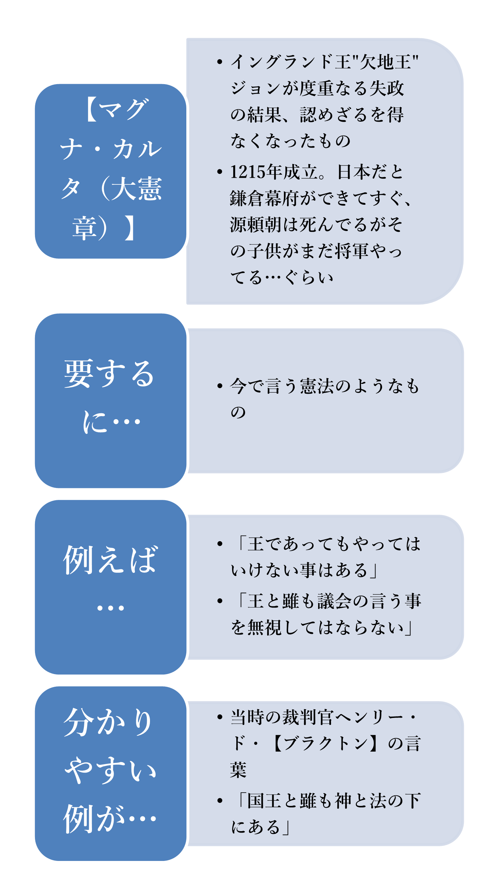
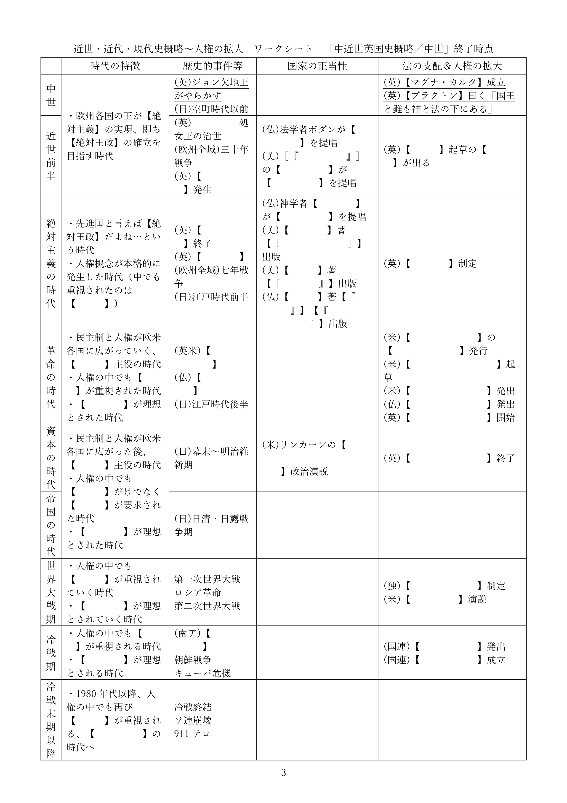
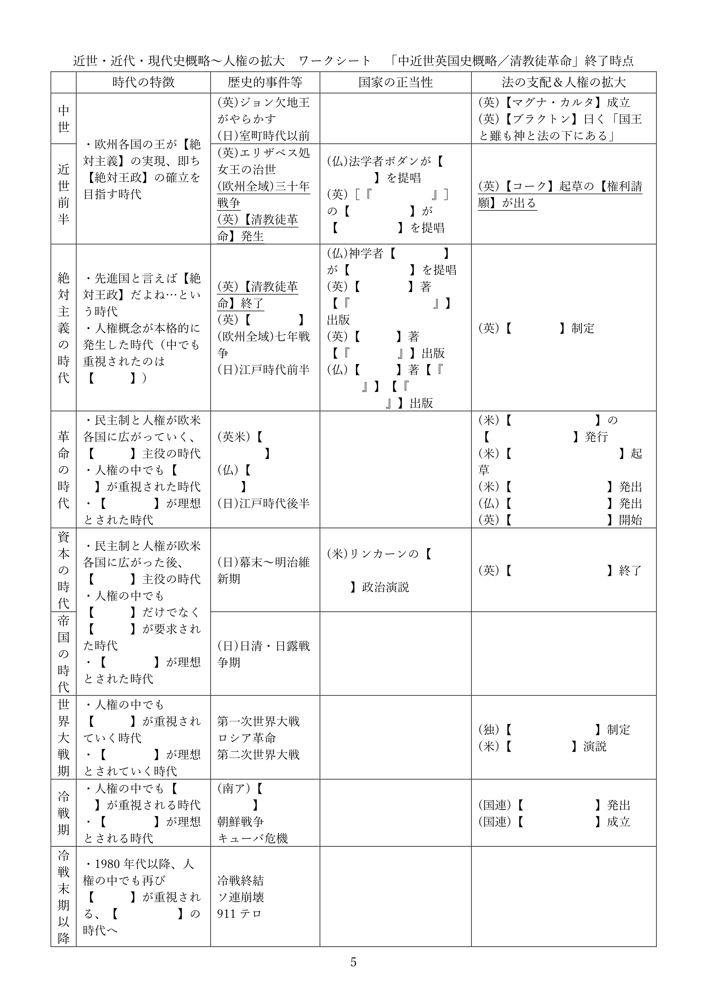
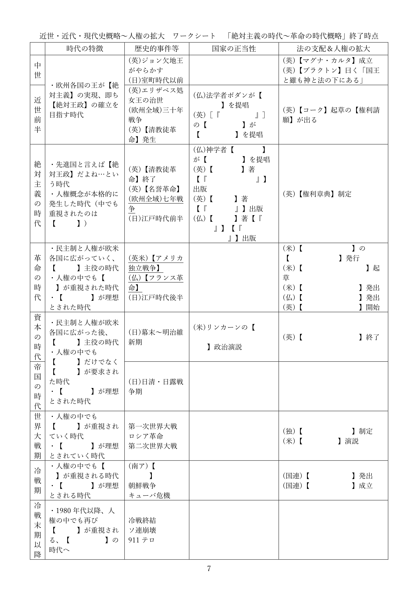
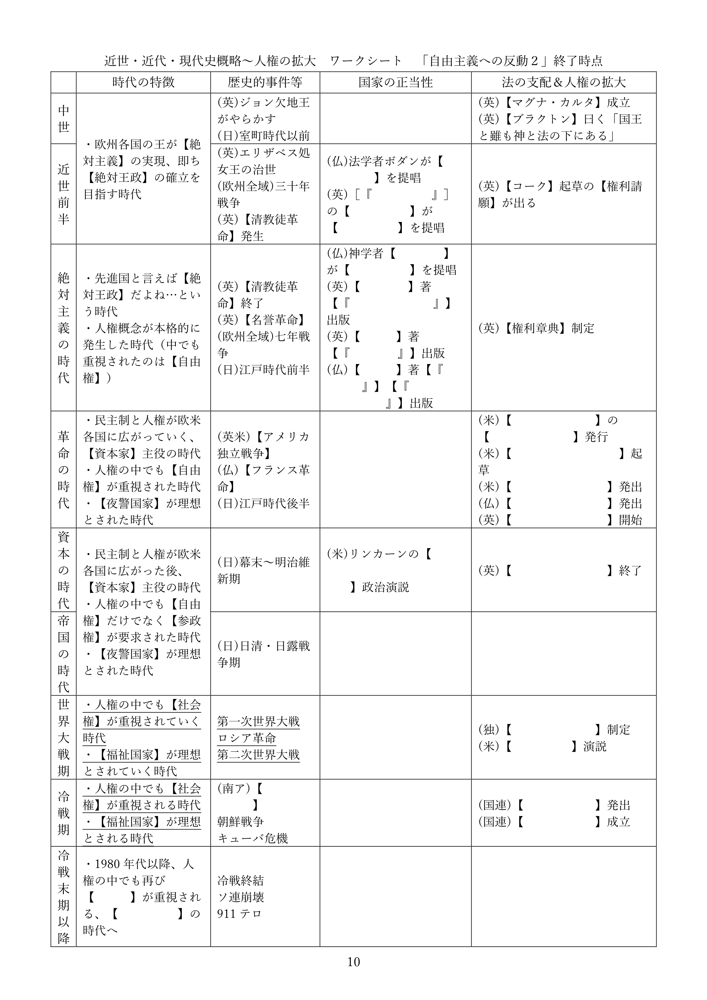
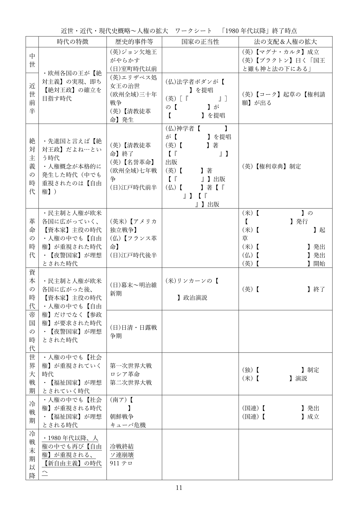

# 近世・近代・現代史概略    

## ●授業動画一覧
|||
|:----:|:----:|
|近世・近代・現代史概略1／近世英国史|[YouTube](https://youtu.be/3ErHCccEjak)|
|近世・近代・現代史概略2／十八、十九世紀|[YouTube](https://youtu.be/wy7ZqQbcmZw)|
|近世・近代・現代史概略3／第一次世界大戦～1980年代|[YouTube](https://youtu.be/by5A8JrR8TA)|
|近世・近代・現代史概略4／1980年代以降|[YouTube](https://youtu.be/r5OQ_reiTs8)|

※令和五年八月に本ページの内容を全面改訂しました。授業動画は改訂前のものです。改訂後の資料を使った授業動画は現在作成中です

## ●前置きと資料  
・ここから先の話は、「どうして我々は現代日本みたいな国家に住んでいるのか」という話になる  
・その為に「現代的な国家はどういう経緯で登場してきたのか」という話をしていく事になる  
・つまり、歴史の話をする事になる  
⇒現代（令和五年現在）の文系選択の高校生は、「歴史が嫌いだから政経に逃げてきた」という人が多い。しかし実際には、公民科の授業は歴史の話が多い。政経も公共も倫理もそう  
  
・しかも以下のような形で、色んな時代を何度も行ったり来たりする事になる  
  
１：中世～現代が、どんな時代かを概観する  
２：絶対主義の時代～現代を、国家の正当性という側面から見る  
３：中世～現代を、法という側面から見る  
４：中世～現代を、人権という側面から見る  
  
・…こんな感じなので、「今どの時代の話をしているのか？」というのが頭から飛ぶと大変な事になる  
・以下に時代区分の資料を載せるので、今後、勉強をしていく際の参考にしてほしい  
  
  
  
※「×年から×年が△△時代」というのは人によって変わる。上記はあくまで一例である。私の授業では、この時代区分で通す予定  
例：「革命の時代」という概念を最初に言い出した歴史家は、革命の時代を1789年開始としている  
  
※尚、本来公民の授業（つまり公共の授業とか政経の授業とか）では、「中世～現代が、どんな時代か」はやりません。「世界史でやったでしょ」という感じで、ある程度どんな時代か分かってる事前提で授業が行われます。が、私の授業では先に、「中世～現代が、どんな時代か」という話をします  
  
※歴史の概略が終わるまでは、細かい知識の暗記よりも「“どんな事件がいつ起きたか”“この時代はどんな時代か”みたいなものを、をなんとなーくでいいから把握する」という事を優先してください  
  
・また、以下にワークシートを載せる。このワークシートを埋めながら授業を受けるとよいだろう  
  
  
<a href="https://teacheramesaka.github.io/highschoolpolitics/forDL/01_02-05worksheet.pdf" target="_blank" rel="noopener noreferrer">※（印刷したい人等向け）上記ワークシートのpdfをダウンロード</a> 
<a href="https://teacheramesaka.github.io/highschoolpolitics/forDL/01_02-05worksheet_kotaelast.pdf" target="_blank" rel="noopener noreferrer">※（念の為）上記ワークシートの最終的な模範回答pdfをダウンロード</a> 
  
## ●中世と絶対主義  
・これから、欧州の中世～現代が、どんな時代かを見ていく事になる  
・なるのだが、中世という時代に対して、一般に重大な誤解がある  
⇒欧州の中世は長いので一般化するのは難しいが、概して、「王がいてお城に住んでて、騎士がいて、騎士団なんかもあって、農民は貴族に年貢を納めてて、村には教会があって…」みたいな時代と想像すればよい  
  
・この時代について、一般の人は大きな誤解をしている  
・まずは↓の、二つ図を見てほしい  
  
  
  
・「中世って、まぁ大体王国ってイメージだよね」「じゃあ王国の権力構造ってどうなってると思う？」  
・↑こう聞くと、大抵の人は甲の図を思い浮かべる  
・即ち、王という一番偉い人がいて、その下に沢山家臣がいて、王が家臣に命令を下す…という形である  
  
・しかし、現実の中世はむしろ、乙図のような状態であった  
・中世の王とはそもそも「貴族筆頭」というだけの存在であり、絶対的な権力は無かった  
  
・無論王であるから、家臣へ命令を下す事はできる  
・しかし、中世欧州に於ける王と家臣との関係は、契約次第だった  
・例えば、以下のような契約である  
  
１：王Aは騎士Bに対し、土地を与える  
２：騎士Bは王Aの命令に従い、従軍する  
３：但し、騎士Bが王Aの命令により従軍するのは、一年につき六十日までとする  
⇒つまり、王Aが騎士Bを戦争に連れて行っても、戦争が六十日以上かかった場合、騎士Bは勝手に帰ってしまう。契約でそうなっているので、王Aはどうにもできない  
  
・中世欧州に於いては、このような関係が普通であった  
・家臣たる貴族達は、王の命令に対して、様々な形で「嫌です」と言える権利を持っていたのである  
  
・当然、各地の王からすれば、部下の「嫌です」と言う権利を取り上げたい  
・故にこそ、中世を通して、この「“嫌です”と言う権利」は少しずつ取り上げられていった  
  
・国の隅々までが、王の命令によって動く体制  
・王が「戦争やるぞ」と言えば、全国がその戦争に参加する国  
・王が「新しい法律作るぞ」と言えば、全国にその法律が適用される国  
・このような体制を【絶対王政】と呼び、これを実現しよう、という思想を【絶対主義】と呼ぶ  
  
・絶対主義的な国家は、中世を通して少しずつ作られていく  
※中世欧州に絶対主義という言葉はなくとも、多くの王が目指したところは要するに、絶対王政である  
  
・そして絶対主義の時代前半に至って、ついに、それらしい国が欧州に誕生するのである  
・絶対主義の時代はまさに、欧州全域で絶対主義が流行した時代であった  
・「先進国なら絶対主義だよね」「絶対王政できてない国は遅れてるなぁ～」  
・こういう認識が、各国に現れるのである  
※実際にできたかどうかは別として、そういう時代ではあった  
※現代（令和五年現在）も、「先進国なら民主主義だよね」「民主制できてない国は遅れてるなぁ～」という意識がある筈である。そういう流行があった時代が、絶対主義の時代だと言える  
  
・この時代背景を抑えた上で、続きを学習してほしい  
  
|||
|:----:|:----:|
|【絶対王政】|君主（王、皇帝）の命令に全国民が従い、誰も逆らわない政治体制。言い方を変えれば、統治権を君主（王、皇帝）が独占する政治体制|
|【絶対主義】|↑を実現しよう、という思想|
|↑の実現時期|中世初期以来、欧州各地の王は実現を目指していた。が、実際に「実現した」と言えるような状況になるのは絶対主義の時代から。この時期には、時代の流行ともなる|
  

  
## ●中近世英国史概略  
### ○前説  
・現代的な民主主義国家の源泉として、イングランド王国（イギリス）が挙げられる場合が多い  
※この国は、イングランド王国⇒グレートブリテン王国⇒グレートブリテン及びアイルランド連合王国⇒グレートブリテン及び北アイルランド連合王国…と名前が変わる。筆者は、国名が長い国もできるだけちゃんと呼ぶようにしているが、流石に長すぎるので、三番目の名前になってからは「イギリス」と呼んでいる  
  
・何故、イギリスなのか？  
・実はこの国、民主主義国家建設の時期が早く、尚且つ現代まで生き残っているのである  
・現代的な民主主義国家は、革命の時代から資本の時代にかけて、欧州に誕生していくが…  
・イギリスだけは、絶対主義の時代からして既に、そういう国家を作っていた  
⇒どの時代がどのあたりの話なのか、先に挙げた資料で必ず確認しておくように  
  
・しかも、民主主義国家となってからは政治体制を大きくは変えず、第二次世界大戦にも勝ち抜いた  
・故に、「現代的な国家がどうやってできてきたか？」という話をする時、やたらと出てくる  
⇒現代の国際社会は、「正義の連合国が、悪のドイツを倒した」という神話の上に成り立つ社会である。もうちょっと言えば、「正義の民主主義国家が、悪の独裁者率いるドイツを倒した」という神話の上に成り立っている。となれば、「正義の民主主義国家」の中でも建設が最も早い、イギリスがやたら出てくるのは当然と言えよう  
  
・もっと言えば、日本という国は明治維新後、「イギリス式民主主義をやろう」という方向性を持った  
・無論、明治維新後の日本は、ドイツ式を目指した面やフランス式を目指した面もある  
・が、最終的には、日本はイギリス式民主主義国家を志向して現代へ至っている  
・となると、「現代日本は何でこんな国なのか？」という話をする上でも、イギリスは重要である  
  
・そういう訳で、この国に注目して、中世からの歴史を見てみよう  
  
  
  
### 〇中世／ジョン欠地王とマグナ・カルタ（大憲章）  
・中世盛期。十字軍の時代。この時代、イングランド王国は国難を迎える。ジョン欠地王の即位である  
・彼は、現代イギリスに於いても無能の見本とされるぐらいのナイスガイである  
・その後二度とイングランド国王の名に「ジョン」が使われる事はなかった、というぐらいの男である  
・どうしてそこまで言われてしまうのかは、地図を見れば一発で分かる  
  
  
  
  
  
↓↓↓↓↓↓↓↓↓↓↓↓↓↓↓↓↓↓↓↓↓↓↓↓↓↓↓↓↓↓↓↓↓↓↓↓↓↓↓↓↓↓↓↓↓↓↓↓↓↓  
  
  
上が、ジョン欠地王即位時の地図。下が、欠地王没時の地図。尚、フランス王国北西のイングランド本国がある島がブリテン島、その西にある島がアイルランド島である。  
CrusaderKingsII（日本語化MOD使用）より  
  
・しかもこれ、家臣が言う事も聞かずに戦争を繰り返した結果である  
・もっと言えば、戦費調達の為家臣や領民に重税を課しながら戦争を繰り返して、結果これである  
  
・当然ながらジョン欠地王は、家臣達、つまり貴族や都市の代表から猛烈な突き上げを食らった  
・「お前もう勝手に動くな」「まず俺らに話を通せ」と  
⇒一応現代では、欠地王はそこまで無能ではなかった、という擁護説も出てきている。ただ何せ、結果がちょっとね…  
  
・その結果が、【マグナ・カルタ（大憲章）】である  
・これは今で言う憲法みたいなものであった。例えば、以下のようなものである  
・「王であってもやってはいけない事はある」「王と雖も議会の言う事を無視してはならない」  
  
・当時の裁判官ヘンリー・ド・【ブラクトン】の言葉は、マグナ・カルタの精神をよく表している  
・即ち、「国王と雖も神と法の下にある」  
・王であっても、議会が作る法よりは下。この考え方は、現代のイギリスにも通じるものである  
  
・ジョン欠地王は、度重なる失政と敗戦の結果、このマグナ・カルタを認めざるを得なくなった  
・これは、イングランド王国の「王の権利を法で制限する」という伝統の代表となった  
  
・勿論、先に見たように、欧州各国は中世を通して、王の権力を強化していく  
・絶対主義の時代ともなれば、「絶対王政できてない国は遅れてるな」というのが欧州の風潮である  
・イングランドでも、後の王達が欠地王の失政を挽回し、王の権力を拡張していった  
・そして王の権力の拡張に伴い、マグナ・カルタは忘れられていった  
  
・それでもイングランド王国はやはり、欧州の中では権力が弱い方である  
・これはマグナ・カルタに代表される、「王の権利を法で制限する」伝統と無関係ではなかった  
  
・特に、議会の権力が強いのは、イングランド王国の特徴と言ってもいいだろう  
・イングランド王の権力は常に、議会によって牽制され続けた  
⇒中世も終盤となる1330年頃になると、二院制の議会も整備された。現代でも、イギリス議会は上院（貴族院）と下院（庶民院）に別れているが、その基本は中世終盤には整備されていたのである  
  
  
  
  
  
  
  
### 〇近世前半／エリザベス処女王  
・中世の次の時代、近世前半のイングランドは、ランカスター家とヨーク家の王位争いから始まった  
・王位争いは結局、ランカスター家でもなくヨーク家でもなく、テューダー家の勝利に終わる  
・テューダー朝イングランド王国は、日本の歴史で言えば戦国時代とほぼ重なる事になる  
⇒応仁の乱が終わって十年もしない内にテューダー家が王位を獲得し、関ヶ原の三年後まで続く事になる  
  
・この時期の重要なイングランド王を一人挙げよ、と言われたならどうなるか？  
・多くの場合、テューダー家最後のイングランド王、“処女王”エリザベス一世の名前が挙がるだろう  
⇒西暦1533年生まれ、1603年没。イングランド王としての在位は1558～1603。日本で言えば、豊臣秀吉とほぼ同世代（秀吉は1537年生まれ1598年没）。ちなみに関ヶ原の戦いが1600年である  
  
・彼女の治世の特徴は、大きく分けて二つある  
１：極めて議会操縦が上手く、傍からは絶対王政が実現したようにすら見える  
２：欧州の片田舎でしかなかったイングランド王国が、世界最強の大帝国になる最初の一歩となった  
  
・まず１。彼女の議会操縦の上手さは本物で、議会の同意を得るに秀でていた  
・高校世界史だと雑に「イングランド絶対王政の絶頂期」と表記されてしまう事があるぐらいである  
⇒これは要するに、処女王があまりにも議会操縦に秀でていたものだから、「処女王の意志≒議会の意志」状態になってしまい、「傍からは絶対王政が実現したようにすら見える」という話である。イングランド王国は相変わらず、（他の欧州諸国に比べて）王の権力は弱いまま、議会の権力は強いままなのに…  
  
・さて、ここで主な問題にしたいのが２である  
・実を言えば、中世初期、そもそも欧州という地域そのものが、世界的に見ればかなりの田舎だった  
・イングランド王国は、そんな欧州の中でも特に田舎であった  
  
・とは言え、欧州もイングランドもいつまでもド田舎ではなく、徐々に発展していく  
⇒例えば、近世前半になると、欧州諸国は南北アメリカ大陸のそれなりの範囲を征服し、植民地を作るようになる。勿論、近世前半はまだまだ「世界最強の先進国は中華帝国」という時代であり、欧州人が中華帝国や日本を相手に喧嘩する事はできなかった時代ではある。だがそれでも、バリバリの石器時代だったアメリカ大陸では軍事的な成功を収め、巨大な植民地を築く事ができた  
  
※植民地とは、（特に欧州各国が、欧州の外にある）外国の領土を征服し、自らのものとしたものを指す言葉である。現地の人間を奴隷にしたり、現地の資源を掘って本国へ持ち去ったりするのみならず、本国で余った人間を移民（入植）させる土地としても機能した。アメリカ合衆国も、元はと言えばイギリスの植民地である  
  
・この時期、イングランド王国もまた、テューダー王家の指導の下「欧州の片田舎」の地位を脱し始める  
・そのテューダー王朝の諸王の中でも特筆されるのが、“処女王”エリザベス一世なのである  
  
・この時期、首都ロンドンではウィリアム・シェイクスピアが活躍し、多くの古典的名作が生まれた  
・大海賊フランシス・ドレイクも参加した王立海軍が、スペイン王国の無敵艦隊を沈めた  
・そして、アメリカ大陸への入植が始まったのであった  
   
・彼女の治世は、欧州の田舎の島国が、世界を支配する大帝国へと雄飛する最初の一歩であった  
  
・しかし処女王エリザベス一世の後の時代、イングランド王は再び苦労する事になる  
⇒確かに彼女の治世は、イングランド王国が大英帝国へと雄飛する契機となった。一方、テューダー朝イングランド王国が抱えていた二つの問題を、そのまま次代へ持ち越してしまったのも彼女であった  
  
・テューダー朝イングランド王国が抱えていた問題とは、以下の二つである  
１：王の権力が弱い（議会の権力が強い）  
２：財政難  
  
・まず１から。これは、中世以来続いてきたイングランド王国の伝統的な問題である  
・テューダー朝イングランド王国は、以前の王室からこの問題を受け継いだ  
・そして、テューダー家最後のイングランド王たる処女王もまた、この問題を解決できなかったのである  
⇒エリザベス処女王は、あくまで「議会操縦が上手い」王であって、「イングランド王の権力を強化した王」ではなかった。中世に比べればマシになっていたとは言え、イングランドは王の権力が弱く、議会の権力が強いままだった  
⇒この問題は、言い方を変えれば、「貴族や議会が王に反抗的」という問題を解決できなかった、という話になる  
  
・続いて２。テューダー朝イングランド王国は、二代目の王以来、ずっと財政難であった  
⇒二代目は、“王立海軍の父”ヘンリー八世。処女王の父でもあり、英国国教会の創設者でもあり、そしてまた、処女王の成功の下準備をしてくれた王でもある。…と言えば聞こえはいいが、「離婚したくて宗教改革した男」「贅沢と戦争でイングランド王室を大赤字にした男」でもある  
  
・この時期のイングランド王室は慢性的に赤字であり、王領地を売って赤字を補填している状態であった  
・当然だが、いつまでも王領地を売り続ける事はできない  
・しかしエリザベス処女王も、結局は、王領地を売る事でその場凌ぎを続ける羽目に陥った  
⇒処女王は、テューダー家最後のイングランド王だった。彼女が死に、ステュアート家が王位を継承した時。この時既に、イングランド王室は「もう売る財産ないですよ…どうすんのこれ……」状態であった  
  

  

  
  
  
### 〇清教徒革命とクロムウェル護国卿の独裁  
・王権の弱さと、財政難。この二つの問題は、処女王の二代後の時代になって、大爆発する事になる  
・即ち、処女王の二代後の王、“殉教王”チャールズ一世  
・近世前半の末期、1625年に即位した彼は、暗君の教科書とでも言うべき存在であった  
  
・よく分かる！　チャールズ殉教王の無能ムーブ  
１：王太子時代、国王の命令を無視してスペイン王国へ旅行、現地で騙され帰国  
２：欧州全域を巻き込んだ大戦争、三十年戦争に軍事介入して連戦連敗する  
３：財政破綻寸前なのに圧政やる⇒地方で反乱発生⇒反乱鎮圧の軍を動かすカネありません⇒負ける  
  
・駄目みたいですね…  
・こんな調子なので、議会から【権利（の）請願】というものが出た事もあった  
・これは、チャールズ殉教王に対し、「マグナ・カルタの精神を思い出せ」と言ったものである  
⇒この請願を起草したのが当時の法学者エドワード・【コーク（クック）】であり、ブラクトンの「国王と雖も神と法の下にある」を引用したのでも有名。イングランドではやはり、こんな事を言えるぐらい議会の権力が強く、王の権力が弱かった。チャールズ殉教王はこの請願を無視している  
  
・こんな事を続けていれば、いつか破綻するのは分かり切っていた  
・特に、テューダー朝から受け継いだ赤字財政が痛かった  
・何せこの時代の国家が「赤字」であるのと、現代の国家が「赤字」というのは、根本的に意味が異なる  
・現代国家は、インクが塗られた紙を「現金」と言い張っているから、最悪、その紙を大量に刷ればよい  
・しかし当時の国家は、そうではない。金貨や銀貨を使用している  
  
・当時の国家が大赤字になった時、何ができるか？  
・それは勿論、重税しかない  
・では、臣民から重税を取り立てまくる王はどうなるか？  
・言うまでもなく、最後には反乱を起こされるのである  
  
・1642年。首都ロンドンを含むイングランド全域は、戦闘状態へ突入した  
・即ち、イングランド王国が国王派と議会派に分かれ、内戦となったのである  
  
・絶対主義の時代に入った直後、1651年に議会軍が勝利。イングランド王国はイングランド共和国となる  
・この一連の事件を、【清教徒革命（ピューリタン革命）】と呼ぶ  
  
・しかしこの勝利の後に待っていたのは、独裁と恐怖政治であった  
・即ち、議会軍の中心人物だったオリヴァー・クロムウェルが護国卿を名乗り、独裁者となったのである  
・彼は殉教王を処刑し、議会を骨抜きにし、各地に軍を派遣して恐怖政治を布いたのであった  
⇒現代日本の読者には、「悪い王様を倒してハッピーエンドだと思ったら、独裁者が出てきて北朝鮮になっちゃった」と表現すると分かりやすいか？  
  
※本稿の筆者は、三十年戦争が終わる1648年を近世前半から絶対主義の時代へ移る年としているが、清教徒革命は1642年から1651年。まさに、時代の変わり目に起きた騒乱であった  
  
  
  
  
  
### 〇絶対主義の時代／王政復古と名誉革命  
・当然ながら、独裁者クロムウェルの死後すぐ、イングランド共和国は瓦解する  
・殉教王チャールズ一世の子はイングランドに帰還、議会に迎えられて国王に即位  
・ここに、イングランド王国が復活する（いわゆる王政復古）  
  
・この時イングランド王となった男は、なかなかに有能だったと言ってよい  
・その治世の末期には議会工作を成功させ、議会の多数が王を支持する状態を作り上げた  
・…のだが、その次。ジェームズ二世という男だが、彼が無能だった  
・チャールズ殉教王に並ぶ次元で、本当に無能だった。議会と対立し、失政を重ねた  
  
・1688年、イングランド議会は王の追放、即ちジェームズ二世の追放を決議する  
・ただ、今回は議会も考えた。また反乱起こして、それで新型のクロムウェルが出てきても困る  
・そこで、他国から自分達に都合のいい王様を連れてこよう、と考えたのである  
・白羽の矢が立ったのは、ドーバー海峡の向こうの国、ネーデルラント（オランダ）連邦共和国だった  
  
  
1688年の西欧。イングランド王国の東、フランス王国の北東にある「ネーデルラント」が、ネーデルラント連邦共和国、いわゆるオランダ連邦共和国である。  
Europa Universalis IV（Extended timeline及び日本語化MOD使用）より  
  
・ネーデルラント連邦共和国は「共和国」を名乗るだけあって、王がいない  
・しかし、事実上の王はいた。ネーデルラント総督を名乗る、ウィレム三世である  
・彼はイングランド王家の血を継いでおり、また、殉教王時代に出た権利請願を認めると言っていた  
・イングランド議会にとってみれば、ここまで都合のいい人材は、なかなかいない  
  
   
・イングランド議会に招聘されたウィレム三世は、軍を率いてブリテン島へ上陸  
・当時のイングランド国王ジェームズ二世は軍を率いて対抗しようとするのだが…  
・失政の連発により、あまりに人気がなさすぎて軍が動かず、戦う事すらできず亡命  
・結果、ネーデルラント総督ウィレム三世は、イングランド王ウィリアム三世にもなったのである  
  
・イギリス人は現代でも、「無血革命だ」「名誉な話だ」として、この事件を【名誉革命】と呼んでいる  
※実際にはこの後、ジェームズ二世が軍を率いて逆襲を仕掛けてくる、いわゆるウィリアマイト戦争が起こっている。幕末日本で言えば、大政奉還が名誉革命、戊辰戦争がウィリアマイト戦争である。つまりイギリス人は、明治維新を「無血革命だ」「名誉な話だ」と自慢しているのと同じ、という話になるのだが…この面の皮の千枚張りを、日本人も多少は見習うべきかもしれない  
  
・ともあれ。名誉革命の翌年には、権利請願を元に【権利章典】が定められた  
・権利章典には、議会が立法権、徴税権、軍事権、王の任免権を保持する事が定められていた  
・現代まで続くイギリスの民主主義的政治制度の基礎は、ここに確立したのである  
⇒現代イギリスに於いても、権利章典はイギリス憲法の根幹とされている（マグナ・カルタも）  
  
・ともあれ。名誉革命の翌年には、権利請願を元に【権利章典】が定められた  
・権利章典には、議会が立法権、徴税権、軍事権、王の任免権等を保持する事が定められていた  
・現代まで続くイギリスの民主主義的政治制度の基礎は、ここに確立したのである  
⇒現代イギリスに於いても、権利章典はマグナ・カルタと並び、イギリス憲法の根幹とされている  
  
・こうしてイングランド王国は、絶対主義の時代に早くも（民主主義国家の基礎）を形成した  
・また、混乱の時代を脱したこの国はいよいよ、世界を支配する世界帝国へと本格的に成長し始める  
⇒エリザベス処女王の時代前後には、世界帝国へと成長する最初の一歩は踏み出していたが、清教徒革命や名誉革命に伴う混乱で停滞。名誉革命が終わってようやく、本格的に成長し始める…というイメージで捉えるとよい。帝国の時代には、世界の約四分の一がイギリスの支配下になる  
  
・一方、（清教徒革命と）名誉革命は、他の欧州国家に民主主義を広げなかった  
・民主主義がブリテン島の外へと広がるのは、革命の時代を待たねばならない  
⇒革命の時代に入ってすぐの1775年から始まるアメリカ独立戦争、そして1789年のフランス革命から、欧州各国に民主主義が広がっていく事になる  
  

  
  
  
## ●絶対主義の時代末期～革命の時代概略  
・名誉革命によって、現代的な民主主義国家の原形と言える体制が成立した  
・しかしこれは、あくまでイングランド王国一国でのみ起きた現象であった  
・欧州の他の国家では、むしろ、絶対王政こそが先進国の証明であった  
・ブリテン島の外に民主主義が広がるのは、革命の時代を待たねばならない  
  
・革命の時代に至って民主主義は爆発的に広がるが、その直接的な原因は、絶対主義の時代末期にある  
・即ち、1754年から1763年にかけて起きた七年戦争が、契機となった  
・この戦争は、欧州全域、更には欧州各国の植民地を巻き込んだ大戦争である  
・プロイセン王国＋イギリスvs残りの欧州列強全部、と表現できるような戦争であった  
  
  
七年戦争の図。青がプロイセン王国・イギリス側、緑が残りの欧州列強全部側。  
Gabagool, CC BY 3.0 <https://creativecommons.org/licenses/by/3.0>, via Wikimedia Commons  
https://commons.wikimedia.org/wiki/File:SevenYearsWar.png  
  
・見るからに、プロイセン王国・イギリス側が劣勢の戦争である  
・事実この戦争は、人口比が400万：8000万だったとか、１：３０だったとか言われている  
・が、プロイセンの“大王”フリードリヒ二世の奮戦もあり、プロイセン・イギリス側が勝利した  
  
・当然、これだけの劣勢を挽回するのに、プロイセン王国もイギリスも相当の無茶をしている  
・イギリスの場合は、北アメリカの植民地に膨大な額の税金を課して戦費を調達していた  
  
  
七年戦争終結直後の西欧～北米大陸東海岸。欧州大陸側、フランスの北にある赤い島国がイギリス。アメリカ大陸側、東海岸沿岸の赤（「１３植民地」及び「ニューファンドランド」表記のところ）がイギリスのアメリカ植民地である。  
Europa Universalis IV（Extended timeline及び日本語化MOD使用）より  
  
・この重税に、イギリスのアメリカ植民地は反発した  
・それだけならいいのだが、イギリス本国政府は、対応を誤った  
・即ち、懲罰的な措置で対抗したのである  
・本国と植民地の対立は頂点に達し、ついに戦争となった  
  
・こうして、革命の時代の始まりを告げる【アメリカ独立戦争（アメリカ独立革命）】が始まった  
・この戦争は紆余曲折あって、植民地側が勝利。現代まで続くアメリカ合衆国が建国される事となる  
・アメリカ合衆国の成立は、欧米系国家の中で二番目に古い、民主主義国家の誕生となった  
⇒この独立戦争は［1775～1783年］と、八年に渡っている  
  
・ところで、植民地側は何故、独立戦争で勝てたのか？  
・植民地側が頑張ったというのもあるが、それだけでは説明がつかない  
・何せこの時期のイギリスは、世界を支配する世界最強国家への道を踏み出しつつあったのである  
・そんな国家への反乱が成功した背景には、フランス王国の支援があった  
⇒当時の記録を見てみると、アメリカ独立戦争は「反乱を起こした植民地と、イギリス本国政府の戦争」ではなく「植民地の反乱をダシに、フランスとイギリスが代理戦争しとる」と思われていた節がある。それぐらい、フランス王国の支援は大きかった  
  
・フランス王国とイギリスは、とにかく昔から仲が悪い  
・直近では、七年戦争でイギリスが勝ち、フランス王国が負けた恨みもあった  
・七年戦争の時点で財政破綻気味だったフランス王国は、それでもアメリカ独立戦争に国力を注いだ  
・植民地を支援し、アメリカ独立を達成させて、イギリスに屈辱を味あわせ…  
・そしてフランス王国の国家財政は、完全に破綻した  
・フランス王国は、借金まみれの大赤字国家になってしまった  
  
・現代はともかく、金貨や銀貨を使っているような時代の大赤字国家でやる事は何か？  
・それは勿論、重税の繰り返しである  
・では、重税の取り立てを繰り返された臣民が最後にやる事は何か？  
・言うまでもなく、反乱である  
  
・時は1789年。平民の不満がついに爆発、反乱が発生する  
・それは、欧州を揺るがし世界の歴史を変えた、【フランス革命】の始まりであった  
  
・フランス革命は、最初は「重税に苦しむ平民の不満が爆発」したものだった  
・そしてまた、「人権を大事にしよう」「民主主義を実現しよう」という理想も伴っていた  
  
・しかし。フランス革命はやがて、流血と暴力の群体へと進化した  
・恐怖政治が布かれ、王も貴族も民衆も問わず、次々とギロチンの刃によって首が飛んだ  
・恐怖政治に対する反乱も起きたが、本国政府はむしろ、反乱を起こした者を虐殺する始末であった  
  
・この混乱を収拾したのがかの有名なナポレオン・ボナパルトだったが…  
・彼は、欧州全域を征服しようと大戦争を開始する  
⇒戦争自体はナポレオン登場前からやっていたのだが、「ガチで欧州征服やり始めたのはナポレオンですよね？」と言われたら「はい」となる。ナポレオンは実際、欧州征服まであと一歩というところまで行くが、それは彼の野望の大きさ、そして軍事的天才があってこそだった  
  
・フランス革命勃発に端を発し、欧州全域を巻き込んだ戦争は、足かけ二十年に渡った  
・欧州征服まであと一歩まで迫ったナポレオンが完全に敗れた1815年、フランス革命は完全に終わった  
・そしてこの大戦争の間に、民主主義、そして人権という概念は、欧州全域へ広がったのである  
⇒「民主主義だの人権だの言ってたフランス革命が最後には、恐怖政治＆欧州征服マシンになっちゃったじゃん」というのは事実なので、戦争が終わったらすぐに、欧州各国が民主主義を採用する訳ではない。しかし、この戦争を通して「民主主義」そして「人権」という理想は欧州各国に広がった。人々は、「俺達も民主主義やりたい」「俺達の人権を守ってくれ」と思うようになった。結果、ナポレオンの敗北から半世紀もしない内に、欧州各国は「民主主義」と「人権」という概念を採用するようになるのである  
  
  
  
  
  
## ●世界大戦期までの特徴  
### ○概要  
・ここまで、革命の時代までの歴史をざっくりと見てきた  
・この後の資本の時代と帝国の時代は、経済分野でまた取り上げる  
・現段階ではざっくり「欧米諸国が世界中の国を征服して植民地にしていく」時期だと思えばいい  
・そして帝国の時代の後、世界大戦期以降の話は、政治分野第四章でまた取り上げる  
  
・故に歴史の概略は一旦、ここまで。ここからは近世から現代の、時代ごとの特徴を見ていく事にしよう  
  
### ○市民革命期の特徴  
・【名誉革命】【アメリカ独立戦争】【フランス革命】は、［市民革命］と呼ばれる事が多い  
⇒こういった市民革命が起きた時代を、政経の教科書や参考書では「十八世紀」と表現する事が多い。十八世紀とは勿論、1701年から1800年を指す。が…知っての通り、名誉革命が起きたのは1688年、フランス革命が起きたのは1789年でも完全に終わるのは1815年である。それでも、政経の教科書や参考書では「十八世紀」と言い切ってしまうパターンが結構あるので、注意しておこう  
  
※市民革命は「近現代的な社会（民主主義や資本主義を軸とする社会）を創出した」と説明される事が多い  
※市民革命という言葉、実は訳語なのだが、翻訳がよくない。本来は「金持ち革命」みたいな言葉である  
  
・市民革命が連続する時期、特に革命の時代には、以下のような特徴がある  
１：【資本家】が主役の時代である  
２：人権の中でも【自由権】が重視された時代である  
３：自由主義国家が理想とされ、特に【夜警国家】こそが理想とされた  
  
・資本家とは、ざっくり言えば、会社の社長や工場長といった層である  
・革命の時代には産業革命が進行し、欧州では「機械で商品を大量生産する」ができるようになっていた  
・故に会社を興し、機械を設置した工場を作り、社員を雇って働かせる金持ちが出てきた  
・それこそが資本家であり、彼らが市民革命期の主役となったのである  
⇒市民革命が本来「金持ち革命」みたいな意味だ、というのはつまりそういう事である  
  
・資本家の求める事は、「もっと自由に経済活動させろ」「もっと自由に金を儲けさせろ」であった  
・故にこそ、この時期に最も重視された人民の権利とは【自由権】であった  
・いわゆる自由主義であり、特に、経済活動の自由が重視された  
  
※この時期の経済活動の自由重視路線は、イギリスの経済学者【アダム・スミス】（代表作【『国富論』】）によって理論化された。政府は何もせず、国民が自由に金儲けする事を認める【自由放任（レッセ・フェール）】主義によってこそ、国は発展する…という理論である  
  
   
・そしてまた、この時期に理想とされたのは、自由を尊重する自由主義国家であった  
・中でも、【夜警国家】こそが理想とされた  
⇒いわゆる【小さな政府】路線の究極形、【国防・治安・最低限の立法や公共事業等、必要最小限の役割だけを担う国家】をこう呼ぶ。夜警国家という名前は、そのような国家を批判したプロイセン王国の政治学者、フェルディナント・ヨハン・ゴットリープ・［ラッサール］によるものである  
  
  
  
  
  
### ○自由主義への反動１（世界大戦発生前まで）  
・革命の時代が終わった後も、基本的な枠組みは維持された  
・時代の主役は資本家だったし、自由権は大事にされたし、理想国家とは夜警国家を指していた  
  
・しかし、自由権の尊重は、厄介な問題を引き起こした  
・資本家の言う「自由」は、結局のところ、自分達に都合のいい「自由」だったのである  
例１：労働者を一日に十四時間働かせる「自由」  
例２：子供であろうとも過酷な労働に従事させる「自由」  
例３：貧乏な労働者は選挙に行かせない「自由」  
  
・その癖、金持ちは「貧乏人が貧乏なのは、怠惰で無能だからだ。自己責任である！」と考えるのである  
・当然、労働者をはじめとする貧困層は、これに対する反動を強めていく事になる  
  
～何でそうなんねんおかしいやろ～  
・自由権を最大限尊重する国家（自由主義国家）は、国民の行動が政府によって制限されない  
・国民は生まれながらに皆平等であり、何をしても自由。そういう社会になる  
・こういった社会に、だらしない成功者というのはほぼいない  
・即ち、自由主義国家に於ける成功者は、非常に勤勉で大変な努力を積み重ねている  
  
・そしてそういう人ほど、こう思うのである  
・「自分は特別な存在ではない」「皆と同じただの人間で、人一倍努力しただけだ」  
・もっと言えば、こう思うのである。「自分と同じように努力すれば、誰でも自分のように成功できる」  
  
・この考え方自体は無論、美徳である  
・しかしこの考え方が裏返ると、まずい事になる  
・何故なら、「努力すれば成功できる」という命題の対偶は、「努力しない者は失敗する」なのである  
・つまり、「貧乏人が貧乏なのは、怠惰で努力不足だからだ」と思ってしまう  
  
・こうして「貧乏人が貧乏なのは、怠惰で無能だからだ。自己責任である！」と考える金持ちが誕生する  
⇒これで分かりにくければ、学校の成績で考えると分かりやすいかもしれない。いい成績を取っている生徒は大抵、非常に勤勉でよく勉強している。しかしそれを元に「勉強すれば成績は上がる」と考え、更に「成績の低い奴は勉強していない」もしくは「勉強する気がない奴は成績が低い」、そして「成績低いのは自己責任！」とすると、問題が出てくる。世の中には、「勉強してるけど成績上がらない」人や「勉強したくてもできない環境で生活している」人もいるのである  
～「努力できる」という事そのものが「恵まれている」事の証明だと、恵まれている人には分からない～  
  
・革命の時代末期から資本の時代、帝国の時代にかけて、【参政権】が求められるようになる  
・これは、資本家が振り回す「自由」に対する反動であった  
⇒参政権は「政治に参加する権利」、要するに選挙に出たり選挙で投票したりする権利である。「貧乏人には選挙に行かせない自由」を行使する資本家に対する反動であった  
   
・とは言え、資本の時代にしろ帝国の時代にしろ、革命の時代から続く枠組みは、維持されていた  
⇒例えば、参政権が重視されるようになったからと言って、自由権を重視する風潮がなくなった訳ではない。自由権に加えて参政権も重視されるようになった、というだけである。自由権を重視し夜警国家を理想とする、革命の時代以来の枠組みが崩れるのは、二度の世界大戦（とその間にあった世界恐慌）以後の話である  
  
  
  
  
  
### 〇自由主義への反動２（世界大戦期以降）  
・市民革命以来の、自由権尊重の風潮への反動が極限に達して発生したのが、ロシア革命である  
・第一次世界大戦中に起きたロシア革命は、市民革命には分類されない事が多い  
・と言うのは、この革命は【共産主義（社会主義）】に基づく反乱だったのである  
⇒「そもそも自由権を尊重した結果、貧乏人が困窮する事になったのは誰のせいだ？」「自由の美名の下に私腹を肥やし、労働者をいじめる資本家がいるからだ」「資本家を殺せ。皆殺しにしろ。そうすれば労働者は幸せになれる」「そして労働者による労働者の為の楽園を作るのだ」という、極端から極端へ行く人達。現段階では、これが共産主義者（社会主義者）である、と考えるぐらいでよい  
  
・そして共産主義者は、本当に金持ちを皆殺しにして、革命を起こす。ロシア革命である  
・この革命によってロシア帝国は滅び、ソヴィエト社会主義共和国連邦（ソ連）が誕生する  
・そしてソ連は、世界各国に向けて「君達も金持ちを殺しましょうよ～」と言い始める  
・また、各国へスパイを派遣（やる事は「金持ちを殺しましょう」教の宣教）していく  
・これは第二次世界大戦の原因の一つであり、また、冷戦の原因でもある  
  
※「共産主義と社会主義って何か違うの？」と言うと、まぁ違うは違うんですが、ぶっちゃけこれは神学論争みたいなもんで、言ったもん勝ちです。「俺は社会主義だ！」と言えばそいつは社会主義、ぐらいの雑な認識で構いません。本稿では、ソ連をはじめとする政治勢力として言う時は共産主義、経済理論として言う時は社会主義で使い分けます  
  
・当然、ロシア革命及びソ連の「金持ち殺しましょうよ」攻勢に一般自由主義国家の皆さんは恐怖する  
・何せ、人権だ自由権だとか言って労働者を虐め過ぎたら、金持ち皆殺し国家が誕生したのである  
・ロシア革命は明らかに、「自由権至上主義はやめましょう」という風潮の誕生に大きな役割を果たした  
⇒無論、他にも要因はあるが、全部説明していくと膨大な量になる。「この段階で要因を一つ挙げろ」と言われたらロシア革命とソ連誕生になるので、この要因を元に、世界大戦期と冷戦期の特徴を説明していく事にする  
  
・こうして、「自由権を多少制限してでも【社会権】を重視しよう」という新しい流行が生まれてくる  
⇒社会権をざっくり説明すると「困窮する国民が、国家によって救済される権利」。健康保険制度を導入したり、貧困で食うにも困る国民に生活保護を与えたり、不況で仕事がない国民に公共事業で仕事を与えたりするのは、社会権の実現である  
  
・自由権と社会権は、全く逆の概念と言っていいだろう。以下に比較してみよう  
自由権：「政府は黙って座ってろ」「俺達国民を自由にしろ」  
社会権：「政府は黙って座ってないで立て」「俺達国民を助けろ」  
  
・革命の時代から帝国の時代にかけて流行った自由権は、必然的に小さな政府を志向させる  
・言い方を変えれば、自由権が重視される社会は、「黙って座ってる」政府を要求する  
・国民は自由に、勝手に幸福になっていくから、「政府は黙って座ってろ」という社会である  
⇒その極端な例が、夜警国家であると言っていい  
  
・一方、世界大戦期から流行り始めた社会権は、【大きな政府】を志向させる  
・即ち、社会権が重視される社会では、「国民を幸せにしてくれる政府」が要求される  
  
・この流行は、世界大戦期から冷戦期にかけて、様々な国家を生む事になる  
  
|社会権の流行で誕生した国家|代表例|  
|:---:|:--:|
|共産主義国家 （社会権最重視、自由なんてクソ食らえ！）|ソ連、ソ連の属国群|  
|ファシズム系国家 （社会権最重視、自由なんてクソ食らえ！）|ドイツ国（第二次世界大戦期）、イタリア王国（第二次世界大戦期）|  
|【福祉国家】 （社会権重視だが、自由権もそれなりには重視したい）|第二次世界大戦後の日本国、欧米先進諸国|  
  
・これらの国の中で、世界大戦を勝ち抜き、そして冷戦の勝者となったのは【福祉国家】である  
・また、少なくとも冷戦期には、先進国の大勢は【福祉国家】になっていた  
⇒ファシズム系国家は冷戦期には消滅済み。一方、冷戦期の共産主義国家で先進国と言えるのはソ連ぐらいなものだった  
  
・上記の事情もあり、世界大戦期から冷戦期に理想とされた国家は、【福祉国家】と言われる事が多い  
・その説明は【社会保障や、公共事業による雇用の創出などを重視する国家】というものが多い  
・要するに、【社会権】重視だが自由権も完全に投げ捨ててはいない、【大きな政府】路線の国家である  
  
※福祉国家を標榜した国家の多くは、本音では自由権を重視したい国家である。だが、そういった国の多くは、世界大戦期はドイツ国（社会権最重視）、冷戦期はソ連（社会権最重視）と対立していた。故に、自由権重視で貧乏な国民を放置していると、対立相手に「ほら見てください！」「結局こいつら、自由の美名の下、金持ちが貧乏人を虐めるのを放置してるんですよ！」と相手に宣伝されてしまう。結果、「社会権重視だが自由権も完全に投げ捨ててはいない」という形になった、とも言えるだろう  
  
※福祉国家が重視される時代の経済理論の基礎を提供したのは、イギリスの経済学者ジョン・メイナード・【ケインズ】。その代表作は［『雇用、利子及び貨幣に関する一般理論』］である  
  

  
  
  
## ●冷戦期以後の特徴  
### ○1980年代以降  
・冷戦終結直前になると、先進国各国で「福祉路線はもう駄目だ」という声が大きくなってくる  
・これも様々な要因があるのだが、今回は二つ挙げよう  
  
１：そもそも、欧米先進国が福祉国家をやる事そのものに無理があった  
⇒結局、福祉国家は「国民の自由をある程度制限」して社会権を重視する国家である。そして、福祉国家をやっている欧米の国は、本音では自由権を重視したい国家である  
  
２：欧米先進諸国が、経済的に行き詰ってきた  
⇒1980年代ぐらいになると、福祉国家を志向する多くの国の経済が、伸び悩むようになった。結果、「福祉国家はもう駄目だ」「ケインズ的なやり方はもう駄目だ」という人が出てきた  
  
・こうして、反社会権、反福祉国家、反ケインズ的な考え方が流行となった  
⇒こういった考え方を、及び考え方をする人々を、まとめて【反ケインズ主義】と呼ぶ  
  
・彼らは、【自由権】を重視した【小さな政府】路線を称賛した  
・【財政赤字】解消、【政治腐敗】の防止等をお題目に、【小さな政府】路線の復活を提唱した  
・こうして、【自由権】を重視した夜警国家的な国家が、再び人気を得るのである  
⇒革命の時代前後、自由権を重視する考え方は自由主義（リベラリズム）と呼ばれていた。今回、一度自由が重視されなくなった後、新たにまた自由が重視されるようになった…という事で、1980年代以降の自由権重視思想は【新自由主義（ネオリベラリズム）】と呼ばれる事が多い  
  
※同じ反ケインズ主義的な考え方として、［新保守主義（ネオコンサバティズム）］もある。小さな政府路線を志向するという意味で新自由主義とよく似た考え方であり、明確にここが違う、と指摘するのは難しい。「社会権なんていいんだよ、国民は自由にさせておけばいいんだ」という政治的な考え方が前者、「俺達国民に、自由に金儲けさせろ」という経済的な考え方が後者…と考えると分かりやすいかもしれない  
  
・しかも、1980年代後半からは、ソ連の脅威が急減する  
⇒1985年には米ソ首脳会談が実現、1989年には冷戦終結宣言、そして1991年にはソ連が崩壊する  
  
・ソ連の消滅は、世界中の国家へ「金持ち殺しましょうよ」攻勢をする存在が消えた事を意味する  
・もっと言えば、「労働者を虐め過ぎたら革命になる」という恐怖の源泉が消えた事を意味していた  
・この状況では、小さな政府を志向する路線は加速こそすれど、止まる筈がなかった  
・こうして、1980年代に始まった自由権再評価路線は、1990年代以降加速していく事になる  
  
・1980年代に新自由主義を導入し始めた各国の政治指導者としては、以下の者が挙げられる  
日本国：【中曽根】康弘内閣総理大臣  
アメリカ合衆国：ロナルド・【レーガン】大統領  
イギリス：マーガレット・【サッチャー】首相  
※日本の場合、こういう流れを最初に始めたのは中曾根だが、決定的にしたのは【小泉純一郎】である  

  
  
  
### 〇現代  
・過度の経済的自由、過度のグローバル化から、以前何処かで見たような問題が起こっている  
・即ち、↓のような自由が行使されるようになってしまった  
  
例１：労働者の給料を極限まで減らす「自由」  
例２：労働者を長時間働かせて残業代も払わない「自由」  
例３：海外に工場を作って海外の人間を雇い、自国の労働者をクビにする「自由」  
  
・結果として、令和五年現在、新自由主義への反発が起きている  
・再び、時代は変化しつつあると言えるだろう  
  
### ～雑談～  
・歴史は、同じ話の繰り返しである  
・もっと言えば、「それ前にやって駄目だったじゃん」の宝庫である  
・自由権重視の風潮復活は、まさにその典型と言えるだろう  
  
|||  
|:---:|:---:|  
|十八世紀以前、十九世紀|自由権重視 ⇒金持ちが庶民を虐める|  
|世界大戦期～冷戦末期（1980年代）|社会権重視 ⇒庶民を守ろう！の時代|  
|冷戦末期（1980年代）～現代|自由権重視 ⇒金持ちが庶民を虐める|  
|現代|自由権重視の風潮に不満が溜まる|  
  
・何で自由権を重視すると金持ちが庶民を虐めるのか  
・言い換えれば、何故経営者が社員を虐めるのか  
・これは、「自分が金持ちだったら」「自分が企業の経営者だったら」と思えば分かる  
  
・例えば、「有能な社員」とはどのような者か？  
・以下の二種類の内、どちらかを取るとなったら、どちらを取るか？  
  
１：「一人で十人分の仕事ができる」「年収二千万円」を一人  
２：「一人で一人分の仕事ができる」「年収百万円」を十人  
  
・あなたが経営者なら、２を取る筈である  
・ここで更に、以下のような選択肢が現れたらどうなるか？  
  
３：「一人で0.5人分の仕事しかできない」「けど年収ゼロでいい奴隷」を二十人  
  
・この３を、迷わず取る筈である。人件費ゼロで済むのだから  
・つまり企業の経営者にとって、有能な労働者とは「能力がある者」ではない  
・経営者にとっては「タダ同然の給料」で「いくらでも働いてくれる」奴隷こそが、有能な労働者なのだ  
  
・そして、自由権が重視された社会というのは、国が民間の活動に口出ししない社会である  
・つまり、企業が従業員を奴隷労働させていても、国は口出ししない  
・しかも、企業と労働者なら、企業の方が強い  
⇒「従業員に奴隷労働させるな！」と労働者が運動しても「うるせぇクビだ」で済む  
  
・だからこそ、自由を重視した社会は「金持ちが庶民を虐める」構図になるのである  
  
・世界大戦期以降、社会権重視の「庶民を守ろう！」の時代が来たのは、当然の帰結だったと言えよう  
・なのだが、当然、これは金持ちからすると面白くない  
⇒金持ちが儲けるには、庶民から搾り取るのが一番。それに、社会権が重視された社会は「金持ちから沢山税金を集めて、貧乏な人を助けるのに使おう」みたいな事もするので、「有能な俺が稼いだカネを、何で無能な貧乏人を助けるのに使わなきゃならねぇんだ」ともなる  
  
・で、1980年代から、再び自由権を重視した社会へ切り替わっていった訳だが…  
・当然ながら、「金持ちが庶民を虐める」社会にもなっていった  
⇒この時、人々がちゃんと社会科を勉強していれば「いや、自由権重視ってもうやったじゃん」「やって駄目だったじゃん」になる筈だったのだが、皆社会科の勉強が嫌いなので…  
  
・しゃかいかのべんきょうってだいじですね（幼稚園生並の感想）  
  
～ここまで雑談～  
  
