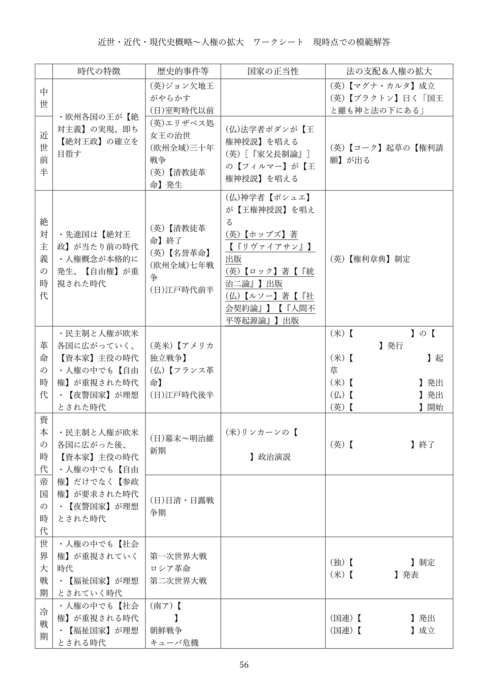
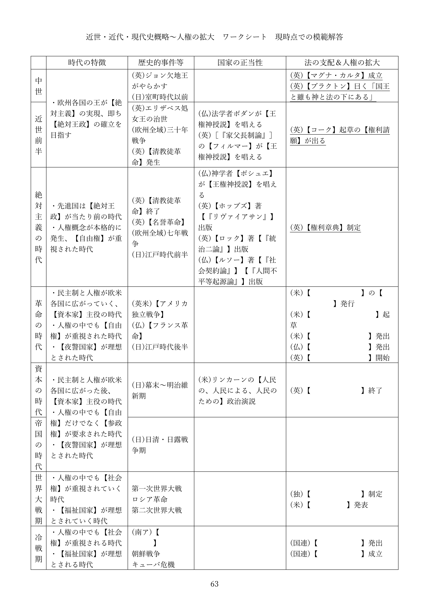
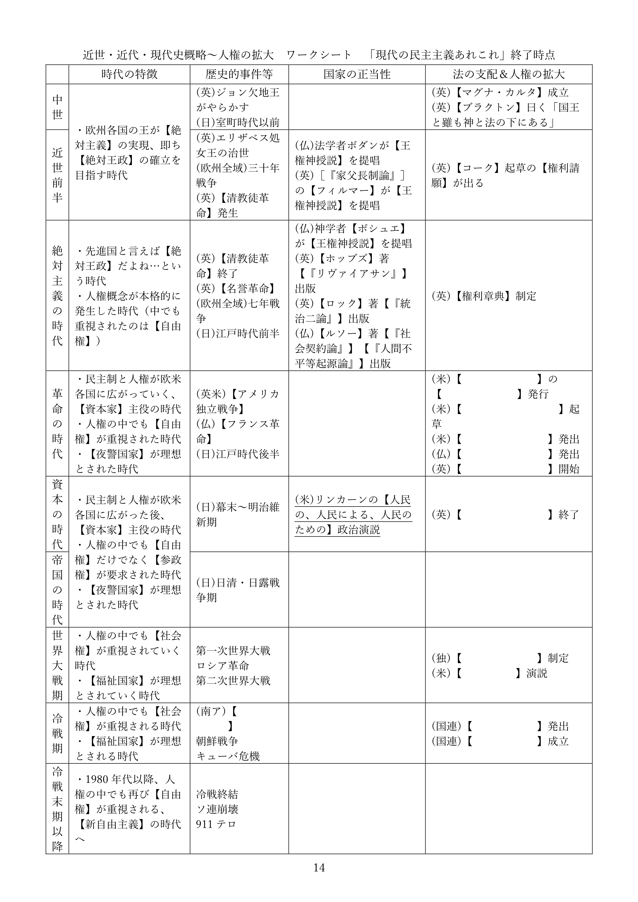

# 国家の正当性の原理  
  
※令和六年八月に本ページの内容を全面改訂しました。授業動画は改訂前のものです。改訂後の資料を使った授業動画は現在作成中です  
  
## ●授業動画一覧＆問題集リンク  
  
|問題集|[ウェブサイト](https://teacheramesaka.github.io/hsworkbookcivics/tag/pol01_03/)|  
|:---:|:---:|  
|国家の正当性の原理1／王権神授説|[YouTube](https://youtu.be/wVH3yEoYkBY)|  
|国家の正当性の原理2／ホッブズの社会契約説|[YouTube](https://youtu.be/D-wTVCPVlqg)|  
|国家の正当性の原理3／ロックとルソーの社会契約説|[YouTube](https://youtu.be/Wa3cVCwms9k)|  
|国家の正当性の原理4／民主主義の原則|[YouTube](https://youtu.be/iVITTGe0no0)|  
    
## ●概要  
・現代的な国家に関する歴史的な経緯を、現在学習中である  
・その順序は、以前見たように、以下の通りである  
  
１：中世～現代が、どんな時代かを概観する（「近世・近代・現代史概略」の前半）  
２：近世後半～現代の、各時代の特徴を概観する（「近世・近代・現代史概略」の後半）  
３：絶対主義の時代～現代を、国家の正当性という側面から見る（「国家の正当性の原理」）  
４：中世～現代を、法という側面から見る（「法の支配と法治主義」）  
５：中世～現代を、人権という側面から見る（「人権の拡大」）  
  
⇒先にやった「近世・近代・現代史概略」は、１と２にあたる。ここからは３。即ち、「絶対主義の時代～現代を、国家の正当性という側面から見る」形になる  
  
・特に統治権を「誰」が「何故」行使できるのか、という正当性の議論と発展を学習していこう  
  
## ●王権神授説  
・中世に欧州各地の王が求め、絶対主義の時代に先進的な制度とされたのが【絶対王政】である  
⇒【絶対主義】に基づく【絶対王政】の基本は、「国家とは国王である」であった。絶対主義の時代のフランス王、“太陽王”ルイ十四世の「朕は国家なり」は絶対王政を象徴する台詞である  
  
・絶対王政に於いて、国家とは国王であり、国家の意思とは国王の意思である  
⇒それで出てきた台詞が太陽王の「朕は国家なり」である。これは、家臣に「そんなことをなさっては国家と民のためになりません」と諫言された時に、「民だけでよい。朕は国家なり」（我自身が国家なので、「国家の為に」とか言わなくていい）と答えたのである  
  
・当然ながら、絶対王政に於いては主権も統治権も、王のものである  
⇒王や皇帝のような存在を、一般に、君主と呼ぶ。現代の日本はよく「国民主権」であると言われるが、絶対王政のような体制は、言ってみれば「君主主権」という訳である  
  
・このような体制を作るには、「何で王様にはそこまでの権力があるの？」を理論化せねばならない  
⇒意外な事かもしれないが、「この人は、何で偉いの？」が何らかの形で説明されないと、人はなかなか従わない。例えば中学高校でも、「この変な校則、意味不明…何を意図して作ったのよ」と思われている校則は、だいたい皆守ろうとしないのである  
  
・この疑問に回答し、絶対主義を正当化する学説が【王権神授説】である。代表的な論者は以下の通り  
  
|||||  
|:----:|:----:|:----:|:----:|  
|時期|国|名前|特記事項|  
|近世前半|フランス王国|ジャン・ボダン|法学者|  
|近世前半|イングランド王国|サー・ロバート・【フィルマー】|［『家父長制論』］を書いた思想家|  
|絶対主義の時代|フランス王国|ジャック＝ベニーニュ・【ボシュエ】|神学者|  
  
⇒ボダンは、大学入試を見ていると、「名前を問われる事はない」が「王権神授説に関係する地の文ではやったら出てくる」みたいな特殊な立ち位置である。まぁ実際のところ、この人、この三人の中ではちょっと異色なので…  
  
・王権神授説の骨子は、以下のようなものである  
１：王権は【神】から付与されたものであり、王は【神】に対してのみ責任を負う  
２：【神】の代理人たる王への反抗は【神】への反抗であり、誰も王の支配に反抗する事は【許されない】  
  
・この理論の背景には、中世以来、欧州にあった考え方がある  
⇒即ち、中世ヨーロッパでは、王や貴族が権力を持つことや、戦争の勝敗そのものを、神の意思の表れとして理解する考え方が広く存在した。例えば、「この王は何で、この戦争で勝てたんですか？」「神がそうしようと思ったから」という具合である。この伝統的な理解を受け継ぎ、理論を精緻化し、絶対主義の根拠に使われるようになったのが王権神授説である、と考えるとよい  

  

  
王権神授説　まとめ

  <table>
    <tbody>
      <tr>
        <th rowspan="6">【王権神授説】</th>
        <th>主唱者 主著</th>
        <td>
          ・(仏)法学者ボダン 
          ・(英)［『家父長制論』］の思想家【フィルマー】 
          ・(仏)神学者【ボシュエ】
        </td>
      </tr>
      <tr>
        <th>自然状態</th>
        <td>特に想定されない</td>
      </tr>
      <tr>
        <th>要旨</th>
        <td>
          ・王権は【神】から付与されたもの、王は【神】に対してのみ責任を負う 
          ・【神】の代理人たる王への反抗は【神】への反抗であり、誰も王の支配に反抗する事は許されない
        </td>
      </tr>
      <tr>
        <th>主権</th>
        <td>【王】が保持する</td>
      </tr>
      <tr>
        <th>抵抗権</th>
        <td>【認められない】</td>
      </tr>
      <tr>
        <th>特徴</th>
        <td>・【絶対王政】の正当化に使われた</td>
      </tr>
    </tbody>
  </table>

  
  
  
## ●社会契約説  
### ○概要  
・【社会契約説】は、三十年戦争や清教徒革命の前後から唱えられ始める学説である  
  
・三十年戦争は、西欧全域を巻き込んだ、凄惨な戦争であった  
⇒略奪、強姦、虐殺何でもござれの戦争である。戦争なんて全部そんなもんと言えばそうだが、規模がかなり大きい。主な戦場はドイツであったが、「ドイツの人口がここまでの勢い減ったの、この後世界大戦までないのでは」と言われる事もあるぐらいである  
  
・そして、この三十年戦争は神によって始まり、神のせいで凄惨になったという側面がある  
⇒三十年戦争は、最初は「カトリック系キリスト教徒とプロテスタント系キリスト教徒の戦争」という形で始まった。そしてこの両者は、互いが互いを「神の教えを誤って理解している最悪の連中」と考えており、「そもそも神を信じてないだけ、まだ異教徒の方がマシ」ぐらいの勢いで憎悪し合っていた。そりゃ大変な事になるわ…  
  
※例えばカトリックの軍がプロテスタントの都市（マクデブルク）を落とした時、人口二万五千人の内二万人が殺されたとされている。三十年戦争も中盤以降は政治的な対立が主になるのだが、初期は…  
  
・実を言えば、三十年戦争の前にも、宗教を原因とする戦争がいくつもあった  
⇒清教徒革命も実は、宗教戦争の要素がある。何ならクロムウェル独裁による恐怖政治も、宗教を背景にしている。このような時代に、「王は神の代理人、だから従え」という理論に説得力を感じない人々が出てくるのは当然である。すると、「国家権力の正当化に使える、神以外の要素はないか？」と考える人々も現れる。そのような中で、新たに社会契約説が登場してくるのである  
  
・社会契約説は、王権神授説に似ている部分がある  
⇒統治権や主権を誰が、どうして持つのか…を考えるという意味では、王権神授説と同じである。また、社会契約説は必ずしも王政と対立するものでもなかった  
  
・一方で王権神授説と社会契約説には、明確に異なる点も多い  
⇒よく指摘されるのは、王権神授説は議論の根拠に【神】を使うが、社会契約説は契約や【合意】を根拠とする、という点である。また、王権神授説は現代の国家には直接繋がっていない一方、社会契約説は［市民革命］を経て、現代的な民主主義政体を正当化するのに使われている  
  
・社会契約説は、主に三人の思想家によって提唱、発展させられた。以下の三人である  
⇒トマス・【ホッブズ】、ジョン・【ロック】、ジャン＝ジャック・【ルソー】の三人である  
  
   
・三人の共通事項として、【自然状態】【自然権】【自然法】という概念がある  
  
自然状態：人がいるだけで社会も法律も政治も何もない状態、原始時代的な状態  
自然権：自然状態でも人が有する権利。後の「基本的人権」に繋がる考え方  
自然法：自然状態でも「これはやったらいかんでしょ」みたいな感覚はある筈。それに基づく法を指す  
  
⇒「自然状態の人間であっても人権を持ってる、自然権を持ってる…って考え方をするとどうなるかと言いますと…」とか、「自然状態だった時代は王なんかいなかった筈だが、今はいる。って事は、自然状態の人間は何らかの合意を結んで、王という存在を承認した筈だ。じゃあどんな合意を結んだんだろう」とか、こういう形で話を展開するのは三者共通である  
  
・以下、三人の社会契約説をそれぞれ見て行こう  
  

  
社会契約説概要まで　まとめ

  <table>
    <tbody>
      <tr>
        <th rowspan="6">【王権神授説】</th>
        <th>主唱者 主著</th>
        <td>
          ・(仏)法学者ボダン 
          ・(英)［『家父長制論』］の思想家【フィルマー】 
          ・(仏)神学者【ボシュエ】
        </td>
      </tr>
      <tr>
        <th>自然状態</th>
        <td>特に想定されない</td>
      </tr>
      <tr>
        <th>要旨</th>
        <td>
          ・王権は【神】から付与されたもの、王は【神】に対してのみ責任を負う 
          ・【神】の代理人たる王への反抗は【神】への反抗であり、誰も王の支配に反抗する事は許されない
        </td>
      </tr>
      <tr>
        <th>主権</th>
        <td>【王】が保持する</td>
      </tr>
      <tr>
        <th>抵抗権</th>
        <td>【認められない】</td>
      </tr>
      <tr>
        <th>特徴</th>
        <td>・【絶対王政】の正当化に使われた</td>
      </tr>
      <tr>
        <th>【ホッブズ】【ロック】【ルソー】の【社会契約説】の特徴</th>
        <td colspan="2">
          ・契約や【合意】を根拠とする(↑は【神】が根拠) 
          ・【自然状態】【自然権】【自然法】を想定する 
          ・特にロックとルソーは、［市民革命］の理論的根拠となった
        </td>
      </tr>
    </tbody>
  </table>

  
### ○トマス・ホッブズ  
・エリザベス処女王の時代に生まれ、王政復古期まで生きたイングランドの哲学者である  
⇒代表作は【『リヴァイアサン』】。この本、昔はレヴァイアサンと呼ぶ事も多かった。ラテン語だとレビヤタンになるので、そこと混ざったか…？  
  
・彼は、三十年戦争が始まった年に三十歳、終わった年に六十歳という世代である  
⇒つまり彼は、三十年戦争という、神が生んだ凄惨な戦争共に生きた世代である。それだけでなく、イングランド内戦、清教徒革命と国王の処刑、クロムウェル護国卿の独裁と恐怖政治…という時代を生きたイングランド人である  
  
・ホッブズが社会契約説の最初の一人とも言える立場になったのは、こういった経験故であろう  
  
・ホッブズはまず、人間の【自然状態】は【万人の万人に対する闘争状態】であるとする  
⇒これを分かりやすく、２段階に分けて説明しよう  
  
１：自然状態は「人がいるだけで社会も法律も政治も何もない状態」である。それはどんな社会か？  
⇒「人がいるだけで社会も法律も政治も何もない状態」は、原始時代をイメージすると分かりやすいだろう。現代の考古学でも、原始時代の人間社会には、力こそ全てという面が多分にあったと考えられている。一例として略奪婚、即ち気に入った女性を他者から力で奪う、という形態も普通だったと考えられている  
  
２：上記のような社会を、彼は「あらゆる人間が無限の人権（自然権）を主張できる状態」としたのである  
⇒現代的な国家では、「ここまでは人権と認めるけど、これ以上はちょっと…」と決まっている。そういう事を決めてくれる国家が存在しない自然状態では、主張できない人権（自然権）はないのだ、という訳である  
  
例１：現代日本では、「内心の自由」を人権と認めている。だから「こいつキモいんだよな、殺してぇ～～～」と思ってもよい。一方、現代日本では、「キモい奴を殺していい権利」は、人権として認められていない。よって、「こいつキモいから殺しました」とやると警察に捕まり、裁判にかけられる  
  
例２：自然状態（例えば原始時代）では国家が存在しない。故に、「ムカつく奴を殺していい権利」は人権であると主張し「こいつムカつくから殺しました」とやっても、警察に捕まる事はないし裁判にかけられる事はない  
  
※勿論、例２の場合、「殺された仲間の復讐をする権利」も制限される事はない。もっと言えば、「欲しいと思ったモノを奪う権利」とか「綺麗な人妻を強奪する権利」なんかも制限されない。結局、人権にしろ自然権にしろ、無限に主張すると他者の人権とぶつかってしまうものなのである  
  
・こうしてホッブズは、国家が存在しない社会は即ち無法社会である、と結論した  
  
・ここまでの彼の理屈をまとめると、以下のようになる  
１：人間は【自己保存】を至上命題とする生命体である  
２：また、［「人間は人間に対して狼である」］  
３：よって自然状態の社会は、【万人の万人に対する闘争状態】となる  
  
・ホッブズは、この自然状態から、国家の起源を説明する  
⇒即ち、万人の万人に対する闘争状態では、いかにもまずい。若くて力のある内はいいかもしれないが、老いたら盗まれ、殺される側になるだけである。況して最初から力のない人は…そこで人々は、全ての【自然権】を【国家】に譲渡する、という合意を結んだ。即ち、社会契約を結んだ。これが国家の起源である、故に国家は（王や政府は）人々を支配できる、とホッブズは説明する  
  
・つまりホッブズは、既存の国家（及び王）による支配の正当化という形で社会契約説を構築した訳である  
  
・ここまで見てきたトマス・ホッブズの思想を雑にまとめると、以下のようになる  
１：「国家が存在しなければ、万人の万人に対する闘争状態になってしまう」  
２：「だから人間には国家が必要だ」「人々は国家に服従しなければならない！」  
  
・この理論は理路整然としていて、現代にも通じる先進的な思想である。しかし、厄介な問題も抱えている  
⇒即ち、「じゃあ、国家（もしくは王）が圧政・暴政したらどうするんですか？」と言われた時、明快な回答を与える事が難しいのである  
  
・何せトマス・ホッブズの思想は、国家に対する国民の抵抗を【認めていない】  
⇒より正確に言うと、「今すぐ亡命しないと警察に射殺される！」みたいな状態で個人的に抵抗するのは問題ない。しかし、「圧政をする政府に対して反乱を起こそう！」みたいな抵抗は、一切認めていない  
  
・何故そうなるか。ホッブズは、「圧政国家でもないよりはマシでしょ」を見ているのである  
⇒“殉教王”チャールズ一世がイングランド王に即位した時、ホッブズは三十七歳である。殉教王は失政を重ねた王であるし、その時代、イングランド王国は圧政国家だったと言ってもまぁ、いいだろう。じゃあ、「圧政をする政府に対して反乱を起こそう！」をやった結果どうなったか？　五年以上にわたる内戦、内戦に伴う破壊と殺戮…しかも内戦後にやってきたのは、自由と繁栄ではなく、独裁と恐怖政治だった  
  
・だからホッブズ的には、「圧政国家でも万人の万人に対する闘争状態よりはマシでしょ」になるのである  
⇒それは確かにそうなのだが、「もう少しこう、ないのか…」という話が出てくるのは避けられない。この欠点にのみ注目し「こいつは所詮【絶対王政】を擁護する、圧政者御用達の思想家に過ぎない」と非難する者も多い  
  

<b>～ちょっと雑談～（クリック・タップして雑談を表示）</b>

　このような欠点を抱えながらも、トマス・ホッブズの理論はやはり、現代でも通用する。現実主義者の現代人は勿論、現役高校生でも社会科が好きなような生徒は、「社会契約説三人組の中ではやはり、ホッブズが最も優れている」と答える場合が多い（筆者の経験上）。 
 
　ホッブズの思想の強みは明確で、理路整然としていて、現実的なのである。例えば、「何故戦争はなくならないのか？」という問いに、ホッブズの思想であれば明確に答える事ができる。 
 
　現代は「人間にとっての国家」はある。だから同じ国民同士ならそうそう殺しあわない。しかし、「国家にとっての国家」が存在しない。国連はあるがいかにも力不足である。だからこそ、国家間の関係は「万人の万人に対する闘争状態」となり、戦争が頻発する。 
 
　だから戦争をなくしたいのなら、「国家にとっての国家」を作れ。…このように、現代の様々な問題に対して明確に答えられるのが、ホッブズの思想の強みである。 
 
　一方で、現代の先進国は、彼の思想を批判的に継承した思想家（この後に紹介する）の理論を、支配の正当化に使っている。例えばアメリカ合衆国は、「ちょっとでも油断したら政府は圧政をする！」「いつでも反乱が起こせるように、政府は国民の武装する権利を保障しろ！」という設計になっている国なので…「圧政国家でも万人の万人に対する闘争状態よりはマシでしょ」なホッブズとは相性が悪いのである。 
 
<b>～ほんとにちょっとだけでした～</b>

  

  
トマス・ホッブズの社会契約説まで　まとめ

  <table>
    <tbody>
      <tr>
        <th rowspan="6">【王権神授説】</th>
        <th>主唱者 主著</th>
        <td>
          ・(仏)法学者ボダン 
          ・(英)［『家父長制論』］の思想家【フィルマー】 
          ・(仏)神学者【ボシュエ】
        </td>
      </tr>
      <tr>
        <th>自然状態</th>
        <td>特に想定されない</td>
      </tr>
      <tr>
        <th>要旨</th>
        <td>
          ・王権は【神】から付与されたもの、王は【神】に対してのみ責任を負う 
          ・【神】の代理人たる王への反抗は【神】への反抗であり、誰も王の支配に反抗する事は許されない
        </td>
      </tr>
      <tr>
        <th>主権</th>
        <td>【王】が保持する</td>
      </tr>
      <tr>
        <th>抵抗権</th>
        <td>【認められない】</td>
      </tr>
      <tr>
        <th>特徴</th>
        <td>・【絶対王政】の正当化に使われた</td>
      </tr>
      <tr>
        <th>↓の【社会契約説】に共通する特徴</th>
        <td colspan="2">
          ・契約や【合意】を根拠とする(↑は【神】が根拠) 
          ・【自然状態】【自然権】【自然法】を想定する 
          ・特にロックとルソーは、［市民革命］の理論的根拠となった
        </td>
      </tr>
      <tr>
        <th rowspan="6">トマス・ 【ホッブズ】 の社会契約説</th>
        <th>主著</th>
        <td>【『リヴァイアサン』】</td>
      </tr>
      <tr>
        <th>自然状態</th>
        <td>
          ・【万人の万人に対する闘争状態】 
          ※人間は【自己保存】を至上命題とし、［「人間は人間に対して狼である」］が故
        </td>
      </tr>
      <tr>
        <th>要旨</th>
        <td>自然状態の人々が、自然権を【放棄】、国家へ【全面的に譲渡】した事によって国家が成立した</td>
      </tr>
      <tr>
        <th>主権</th>
        <td>【国家】もしくは【王】が保持</td>
      </tr>
      <tr>
        <th>抵抗権</th>
        <td>原則【認められない】</td>
      </tr>
      <tr>
        <th>特徴</th>
        <td>【絶対王政】とも親和性が高い</td>
      </tr>
    </tbody>
  </table>

  
### ○ジョン・ロック  
・ジョン・ロックは、清教徒革命の直前に産まれ、名誉革命の直後に死んだイングランドの哲学者である  
⇒代表作は【『統治二論（市民政府二論）』】『人間悟性論』。単に社会契約説を展開した人というだけでなく、イギリス経験論の父とも呼ばれる偉大な哲学者である。社会契約説について書いてあるのは、『統治二論（市民政府二論）』の方で、哲学的な事が書いてあるのが『人間悟性論』の方である  
  
※つまるところ、政治経済だけでなく倫理の授業でもバンバン出てくる人である。政治経済だと『統治二論（市民政府二論）』に書いてあるような話しかしないが、倫理だと、『人間悟性論』に書いてある内容の方が詳しく解説される  
  
・『統治二論』を書いた男としてのジョン・ロックは、【名誉革命】を正当化した人物として評価される  
⇒名誉革命は、現代イギリスの社会体制、その基礎である。しかし一方で、名誉革命とは、議会（国民）が王に反乱を起こし、追放した事件でもある。となれば当然、「そんな事していいんか？」「反逆者の国じゃん」という話が出てくる。これに対し、「いいんだ！」「名誉革命は正当だし、名誉革命後の政府は正当な英国政府だ！」と言ったのが、ジョン・ロックという訳である  
  
・故に彼の社会契約説は、結論として以下のようなものを導き出す  
  
１：王は存在してよいし、人々を支配しよい  
２：但し圧政が行われた等があれば、その支配に抵抗し、反乱を起こすのも正当である  
３：政治の基本は議会にある  
  
⇒明らかに、現代イギリスを含む、名誉革命後の英国の社会体制を正当化する内容になっている。既存の王や国家であれば何でも正当化するホッブズとは、ここが大きく異なる  
  
・もう一つ、ロックとホッブズが大きく異なるのは、自然状態に対する認識である  
⇒ロックは、自然状態の人々はむしろ、比較的平和に暮らしていた…と考えている。【自由】で［平和］で［平等］である、と。以下で、自然状態をまた、原始時代に例えて考えてみよう  
  
例：原始時代の人間は今より少なかった筈であり、一方で、食糧をはじめとする資源は豊富にあった筈である。だから狩猟採集生活なんてのができたのだ。よって、自然状態の人々は、資源を奪い合い、殺しあう必要はなかった。だいたい、普通の人間には理性や常識があるのであって、国家・警察・裁判所・刑務所がないからと言って無限に泥棒しまくり殺人しまくり、というのは不自然である  
  
・この違いをちょっと難しく言うと、ロックとホッブズでは、自然法に対する認識が違う、という話になる  
⇒自然状態でも「これはやったらいかんでしょ」みたいな感覚はある筈で、それに基づく法を自然法と呼ぶ。ホッブズは、「自然状態では、自然法は守られない」（自然状態では万人の万人に対する闘争状態になるので）と考える。一方ロックは、「自然状態でも、自然法は（大体は）守られる」（自然状態は意外と平和なので）と考えるのである  
  
   
・ともかくロックは、自然状態の人々は原則、各自の自然権を尊重しあい、自然法を守る…と考える  
⇒この時彼が想定した自然権は、【生命】を守る権利、自由の権利、【所有】もしくは【財産】の権利である。ここもホッブズと違うところで、ホッブズは「自然状態の人間は、無限の自然権を主張できてしまう」と言うが、ロックは自然権をかなり具体的に「生命を守る権利、自由権、所有権、財産権」と規定している  
  
※所有もしくは財産の権利は、「ある人が労働によって獲得したものはその人の所有物になる」という権利である。分かりづらいので例を挙げよう。自然の森の中にあるものは誰のものでもない。しかしある人、例えばジャックさんが「木の実を集める」という労働をして木の実を手に入れたとする。そうであれば、その実を所有する権利はジャックさんにある（ジャックさんの所有物・財産になる）  
  
・しかし、自然状態がいくら平和だと言っても、理想郷ではあり得ない  
⇒ロックが想定する自然状態は「“原則”、各自の自然権を尊重しあい、自然法を守る」である。大体の人は他者の権利を尊重し、自然法を守る。しかし人間は［過ち］を犯す生き物であり、それによって［自然権］が侵害される可能性はある  
  
・今風に言えば犯罪者だが、そういう人が出た時、自然状態では手の打ちようがない  
⇒自然状態では国家が存在しないので、警察も裁判所も刑務所も存在しない。だから自然法を破る者（他者の自然権を侵害する者）（例えば泥棒）が出たとしても、中立的な裁きを下す者がいない  
  
・ここで、ロックの社会契約説の根幹たる、【委託（信託）】契約という発想が出てくる  
⇒自然状態は比較的平和だが、犯罪（自然法を破るという意味での犯罪）は起きる。それによって［自然権］を侵害される被害者も出る。だから人々は、［国家］に［自然権］を守ってもらうよう、［統治権］を【委託（信託）】した。この社会契約が国家の起源であり、だからこそ国家や王が存在する、とロックは結論するのである  
  
・即ち、ロックは、国家が国民を支配する正当性は、この委託契約にある、としたのである  
  
・彼のこの思想は、名誉革命を理論化・正当化するものとなった  
⇒名誉革命は結局、何をどう言い繕っても「反乱を起こして王を追い出した」ものである。ロックの理論を使えば、「そんな事していいの？」に対して「いいんだ！」と言えるのだ  
  
※「人々は、自然権を守ってもらう、という委託契約を王や政府と結んだんだ」「暴政するような暴君は委託契約違反だ、追い出していいんだ！」「だから名誉革命が起きて、イギリス人は新しい王と新しい委託契約を結んだんだ」という形である  
  
・このようなロックの思想は、絶対王政的な王との相性は悪い  
⇒何せ、ロックの考え方からすると、王が王足り得るのは国民から委託を受けたからである。国民は、委託契約違反があれば契約解除を求めて反乱を起こせる立場にある。つまりロックの考え方は【国民主権（主権在民）】であり、国民に【抵抗権（革命権）】を認めている  
  
※それこそ、後の【アメリカ独立戦争】はロックの思想の影響によって起こっている。即ち、「イギリス政府の暴政に対し、アメリカは抵抗し独立する」という形である。また、後の【フランス人権宣言】も彼の影響を受けている  
  
・逆に言えば、ロックの思想は［立憲君主制］的な王制とは相性がいい  
⇒立憲君主制は、君主（王）はいるにはいるが、絶対的な権力を持っている訳ではない体制である。憲法があり、「王（政府）はこういう事をしてはいけません」「王（政府）は国民にこういう権利があると認めます」みたいな事が書いてあり、王（政府）はそれを守らねばならない…というような類の体制が立憲君主制と呼ばれる。現代イギリスや現代日本は、典型的な立憲君主制である  
  
・また、ロックの思想は【間接民主主義（議会制民主主義）】とも相性がいい  
⇒国民主権なのであれば国民自身が政治を行うべきだが、何千万人もいる国民が一堂に会して議論するのは非現実的である。だから、国民が選挙で代議士（国会議員とかそういうの）を選び、その代議士が政治を行う…これが間接民主主義とか議会制民主主義と呼ばれるものである。現代イギリスや現代日本も、典型的な間接民主主義（議会制民主主義）国家である  
  
※何せロックは、名誉革命、つまり「議会が王を追放する」を正当化した思想家である。その理屈として、彼は国民主権を使う。即ち…国家の主権は国民が持っていて、その国民の代表が議会だから、「議会が王を追放する」をしていいんだ、という訳である  
  
・もっと言うと、ロックは現代国家の基本、［権力分立］についても語っている  
⇒国家権力をいくつかに分割しよう、という発想が権力分立である。現代日本では、中学社会でもやった三権分立が有名だが、ロックが唱えたものは二権分立であった、というのが一般的な説明である。即ち、以下のようなものである  
  
１：国家権力を［立法権］（議会）と行政権（国王、政府）に分ける  
２：両者の意見が対立した場合、立法権（議会）の決定が優先する  
  
・このロックの権力分立思想もやはり、現代を含む名誉革命後の英国の政治制度を正当化するものである  
⇒現代イギリスは［議会］主権であるとよく言われる。議会の承認がなければ、誰も、あらゆる統治権を行使できない…という発想を元に、現代イギリスの統治機構は作られている。故に現代イギリスでは、王も内閣も、議会の下にある。それこそ2009年までは、最高裁判所の役割も議会がこなしていたのである  
  

  
ジョン・ロックの社会契約説まで　まとめ

  <table>
    <tbody>
      <tr>
        <th rowspan="6">【王権神授説】</th>
        <th>主唱者 主著</th>
        <td>
          ・(仏)法学者ボダン 
          ・(英)［『家父長制論』］の思想家【フィルマー】 
          ・(仏)神学者【ボシュエ】
        </td>
      </tr>
      <tr>
        <th>自然状態</th>
        <td>特に想定されない</td>
      </tr>
      <tr>
        <th>要旨</th>
        <td>
          ・王権は【神】から付与されたもの、王は【神】に対してのみ責任を負う 
          ・【神】の代理人たる王への反抗は【神】への反抗であり、誰も王の支配に反抗する事は許されない
        </td>
      </tr>
      <tr>
        <th>主権</th>
        <td>【王】が保持する</td>
      </tr>
      <tr>
        <th>抵抗権</th>
        <td>【認められない】</td>
      </tr>
      <tr>
        <th>特徴</th>
        <td>・【絶対王政】の正当化に使われた</td>
      </tr>
      <tr>
        <th>↓の【社会契約説】に共通する特徴</th>
        <td colspan="2">
          ・契約や【合意】を根拠とする(↑は【神】が根拠) 
          ・【自然状態】【自然権】【自然法】を想定する 
          ・特にロックとルソーは、［市民革命］の理論的根拠となった
        </td>
      </tr>
      <tr>
        <th rowspan="6">トマス・ 【ホッブズ】 の社会契約説</th>
        <th>主著</th>
        <td>【『リヴァイアサン』】</td>
      </tr>
      <tr>
        <th>自然状態</th>
        <td>
          ・【万人の万人に対する闘争状態】 
          ※人間は【自己保存】を至上命題とし、［「人間は人間に対して狼である」］が故
        </td>
      </tr>
      <tr>
        <th>要旨</th>
        <td>自然状態の人々が、自然権を【放棄】、国家へ【全面的に譲渡】した事によって国家が成立した</td>
      </tr>
      <tr>
        <th>主権</th>
        <td>【国家】もしくは【王】が保持</td>
      </tr>
      <tr>
        <th>抵抗権</th>
        <td>原則【認められない】</td>
      </tr>
      <tr>
        <th>特徴</th>
        <td>【絶対王政】とも親和性が高い</td>
      </tr>
      <tr>
        <th rowspan="6">ジョン・ 【ロック】 の社会契約説</th>
        <th>主著</th>
        <td>【『統治二論』】</td>
      </tr>
      <tr>
        <th>自然状態</th>
        <td>
          ・人々は【生命】を守る権利、【所有】もしくは【財産】の権利を持ち、【自由】で［平等、平和］ 
          ※但し、時折誰かが［過ち］を犯し、人々の［自然権］を侵害する
        </td>
      </tr>
      <tr>
        <th>要旨</th>
        <td>自然状態の人々が、【自然権】を守ってもらう【委託契約】を国家と結んだ事によって、国家が成立した</td>
      </tr>
      <tr>
        <th>主権</th>
        <td>【間接民主制】的な【国民主権】</td>
      </tr>
      <tr>
        <th>抵抗権</th>
        <td>暴政のような委託契約違反があった場合、【抵抗権（革命権）】が【認められる】</td>
      </tr>
      <tr>
        <th>特徴</th>
        <td>
          ・【名誉革命】、及び近現代イギリスの［議会］主権的な［権力分立］体制を正当化する 
          ・後の【アメリカ独立戦争】へも影響 
          ・王制とも［立憲君主制］という形で並立できる 
          ・【フランス人権宣言】への影響も強い
        </td>
      </tr>
    </tbody>
  </table>

  
### ○ジャン＝ジャック・ルソー  
・ジャン＝ジャック・ルソーは、ジュネーヴ共和国生まれの哲学者である  
⇒代表作は【『社会契約論』】【『人間不平等起源論』】  
  
・ルソーは、時期的にはジョン・ロックの一世代後、絶対主義の時代後半の人物である  
⇒この時期は、イギリス以外の欧州国家が次々と絶対王政を実現させた、いわば絶対王政の完成期である。絶対王政を基礎とした社会秩序を［アンシャン・レジーム］などと呼ぶが、ルソーはそのアンシャン・レジームの完成期に、フランス王国で活躍した哲学者である  
  
※ダメ男エピソードの多彩さでも有名。ヒモだった時期が一番幸せだったと正直に告白する男でもあり、露出狂で、また女性に尻を叩かれるプレイが大好きで…なんだこいつは（困惑）　しかしこんなんでも論文を書かせたら当代一流であり、四十手前になってからは一流の思想家として大活躍する  
  
・彼の社会契約説の特徴をまず、二つ挙げたい  
  
１：彼は基本、「実現不可能な高い理想を掲げた男」である  
⇒ルソーは、教員免許持ちの人間には「自分は子供を捨てた割に“子育てとはこうあるべきだ！”という本を書いた男」としても有名。これも言ってみれば「実現不可能な高い理想」である  
  
２：「これから実現されるべき理想国家」の実現方法について語っている  
⇒トマス・ホッブズは、社会契約説によって既存の国家を正当化した。ジョン・ロックは、社会契約説によって名誉革命（と名誉革命によって成立した国家）を正当化した。ジャン＝ジャック・ルソーは、既存の国家の正当化はせず、「これから実現されるべき理想国家」が何故正当なのか、それはどうやれば実現できるか…という点を論じている  
  
・では、ルソーの社会契約説を、自然状態から見ていこう  
  
・ルソーは、自然状態の人々は［自由、自足、平等、調和］と評せる状態にあると考えていた  
⇒自然状態の人々は、【自愛】と【憐み】を持ち、平等で自由である。そう、自然状態の時代、人間は自由であった。しかし、技術が発展し、国家が形成されていく中、私有財産というものが生まれてしまった為に、人は不平等になり、不自由になった。即ち、自由を失った。ルソーはこう考えるのである  
  
※これは、後の共産主義（社会主義）や、何なら、現代の日本の教育にも影響を与えている。例えば令和八年現在も、中学の社会の教科書や参考書には「縄文時代の日本は、平等な社会でした」「弥生時代に入って、保存可能な財産（コメ）と、それを生産する手段（農業）が手に入り、結果、格差が広がりました」というような事が書いてある場合がある。要するに、縄文時代は自然状態で、自由、自足、平等、調和、しかし弥生時代以降の日本人は自由を失った…と言いたい訳である  
  
・つまるところ、ルソーは、自然状態を一種の［理想郷］と考えるのである  
⇒故にルソーは、政治経済では【自然に帰れ】と言った思想家、と整理される事がある  
  
・ただ実際には、ルソーは「文明を捨てて森に帰れ」とは言っていない  
⇒今更そんな事できる訳ないだろ、というのもあるが…それ以上に、ルソーは「今の人類は、もっとよい自由を手に入れられる」と考えていた  
  
・彼が求めた、「新たな」「もっとよい」自由を、［社会的自由（市民的自由）］と呼ぶ  
⇒そして彼は、その為に人々は、社会契約という合意によって理想国家を建設すべきだ、と言う。理想国家の建設によって、「新たな」「もっとよい」自由が手に入る、という訳である  
  
・では、理想国家を建設し、社会的自由を手に入れるにはどうすればよいのか？  
⇒彼は、【一般意志】（公共の利益を考える気持ち）を以って、皆で【話し合って】物事を決めるようにしろ、と言う。【特殊意志】（自分の事だけを考える気持ち）で話し合いに参加してもしょうがない。【全体意志】（皆が自分の事だけを考えている状態）で話し合いをしても、やっぱり意味がない。一般意志に従って、皆で話し合う事で決まり事ができる。そういう決まり事に従う事で、人は初めて自由になれる、これこそ理想国家だ…という訳である  
  
|ナントカ意志|分かりやすく言うと|もうちょっと難しい言い方だと|
|:---:|:---:|:---:|
|一般意志|公共の利益を考える気持ち|共同体全体の共通善を目指す意志|
|特殊意志|自分の事だけを考える気持ち|各人の私的利害|
|全体意志|皆が自分の事だけを考えている状態|私的利害の総和|
  
・ルソーはこのように考える為、ロック的な民主主義を否定する  
⇒ルソーもロックも国民主権という意味では同じである。一応、ルソーは［人民主権］という言葉を使うが、ともあれ主権が誰にあるかという意味では立場を同じくする。しかしルソーは、間接民主主義的な国民主権を否定する  
  
有名な例：ルソーが生きた当時、イギリス（当時の国号はグレートブリテン王国）は民主主義国家（の基礎）を形成していた一方、フランス王国は絶対王政であった。それでイギリス人が、「フランス人は王の奴隷だから大変だよね、民主主義やってる自由な国に産まれてよかったわ」みたいな事を言う。これに対してルソーは、「何が自由じゃ、お前らイギリス人が自由なのは選挙の時だけで、選挙が終わったら政府の奴隷やないかい」と反論する  
  
・上記の話は、現代日本人にも深く突き刺さる話の筈である  
⇒現代日本人は「自分の国は民主主義国家だ」と思っているが、同時に「何が民主主義だ、何が国民主権だ、選挙に行ったってなにも変わらねぇ」と思う気持ちも強い。「イギリスの人民が自由なのは選挙の間だけであり、選挙が終われば奴隷となる」というルソーの言葉は、現代日本の民主主義にすら突き刺さる、鋭い刃である  
  
・このような問題意識があるからこそ、ルソーは、【直接民主主義】でなければ意味がない、とする  
⇒全国民が一箇所に集まって、全員で議論して法律を作る、というような類の民主主義が直接民主主義である。これでなければ民主主義とは言えない、間接民主主義（政治家を選挙で国会議員とし、政治家が国民を代表して政治を行う）は不可である、何故なら「意志は代表され得ない」のだ…というのがルソーの思想である  
  
   
・また、直接民主主義を志向するルソーの思想は、王制と並立させるのは非常に難しい  
⇒ロックであれば、立憲君主制という形であれば王制と並立する。一方ルソーの思想は、令和八年現在の全ての王制（君主制）国家がNGである。現代日本の象徴天皇制でも全く、引っかかる余地がない。事実上、ルソーの思想を実行しながら王制も、というのは不可能に近い  
  
※そもそもルソーの思想の実行するのが不可能に近い？　まぁそれはそう  
  
・一方、抵抗権については、あるかないかで言えば「ある」と言ってよいだろう  
⇒ルソーの思想に於いて政府というのは、直接民主主義によって「こういう事をしよう」というのが決まった後、実際にそれを実行する存在である。なので、直接民主主義によって決まった事に逆らうようであれば、そんな政府は打倒してよい、という話になる訳である  
  
・このようなルソーの思想は、しかし、実現不可能な高い理想でもあった  
⇒それこそ、何千万人もいる国民を一箇所に集めて話し合いなんて物理的に無理である。また、実現不可能な高い理想を掲げると、現実には大変面倒な事態が起こるという問題もある  
  
例：ルソーの思想は、彼の死後十年もすれば始まる［フランス革命］に与えた影響は大である。だからこそフランス革命は、理想国家を作ろうとし、「理想の実現を邪魔する者は殺せ！」という方向へ暴走したとも言える  
  
・尚、フランス革命時に出た【フランス人権宣言】は、むしろ【ロック】の色が濃いので注意が必要である  
⇒一応、ルソーの影響もない訳ではないが…基本的にはロックの影響が強い  
  
※まぁそもそも、フランス人権宣言は、フランス革命が起こった直後に出たものなので…「理想国家を作ろう！」と言い出して暴走し、ギロチン、虐殺、恐怖政治、対外戦争…とえらい騒ぎになった後に出たものではないのである  
  

  
王権神授説＆社会契約説　まとめ

  <table>
    <tbody>
      <tr>
        <th rowspan="6">【王権神授説】</th>
        <th>主唱者 主著</th>
        <td>
          ・(仏)法学者ボダン 
          ・(英)［『家父長制論』］の思想家【フィルマー】 
          ・(仏)神学者【ボシュエ】
        </td>
      </tr>
      <tr>
        <th>自然状態</th>
        <td>特に想定されない</td>
      </tr>
      <tr>
        <th>要旨</th>
        <td>
          ・王権は【神】から付与されたもの、王は【神】に対してのみ責任を負う 
          ・【神】の代理人たる王への反抗は【神】への反抗であり、誰も王の支配に反抗する事は許されない
        </td>
      </tr>
      <tr>
        <th>主権</th>
        <td>【王】が保持する</td>
      </tr>
      <tr>
        <th>抵抗権</th>
        <td>【認められない】</td>
      </tr>
      <tr>
        <th>特徴</th>
        <td>・【絶対王政】の正当化に使われた</td>
      </tr>
      <tr>
        <th>↓の【社会契約説】に共通する特徴</th>
        <td colspan="2">
          ・契約や【合意】を根拠とする(↑は【神】が根拠) 
          ・【自然状態】【自然権】【自然法】を想定する 
          ・特にロックとルソーは、［市民革命］の理論的根拠となった
        </td>
      </tr>
      <tr>
        <th rowspan="6">トマス・ 【ホッブズ】 の社会契約説</th>
        <th>主著</th>
        <td>【『リヴァイアサン』】</td>
      </tr>
      <tr>
        <th>自然状態</th>
        <td>
          ・【万人の万人に対する闘争状態】 
          ※人間は【自己保存】を至上命題とし、［「人間は人間に対して狼である」］が故
        </td>
      </tr>
      <tr>
        <th>要旨</th>
        <td>自然状態の人々が、自然権を【放棄】、国家へ【全面的に譲渡】した事によって国家が成立した</td>
      </tr>
      <tr>
        <th>主権</th>
        <td>【国家】もしくは【王】が保持</td>
      </tr>
      <tr>
        <th>抵抗権</th>
        <td>原則【認められない】</td>
      </tr>
      <tr>
        <th>特徴</th>
        <td>【絶対王政】とも親和性が高い</td>
      </tr>
      <tr>
        <th rowspan="6">ジョン・ 【ロック】 の社会契約説</th>
        <th>主著</th>
        <td>【『統治二論』】</td>
      </tr>
      <tr>
        <th>自然状態</th>
        <td>
          ・人々は【生命】を守る権利、【所有】もしくは【財産】の権利を持ち、【自由】で［平等、平和］ 
          ※但し、時折誰かが［過ち］を犯し、人々の［自然権］を侵害する
        </td>
      </tr>
      <tr>
        <th>要旨</th>
        <td>自然状態の人々が、【自然権】を守ってもらう【委託契約】を国家と結んだ事によって、国家が成立した</td>
      </tr>
      <tr>
        <th>主権</th>
        <td>【間接民主制】的な【国民主権】</td>
      </tr>
      <tr>
        <th>抵抗権</th>
        <td>暴政のような委託契約違反があった場合、【抵抗権（革命権）】が【認められる】</td>
      </tr>
      <tr>
        <th>特徴</th>
        <td>
          ・【名誉革命】、及び近現代イギリスの［議会］主権的な［権力分立］体制を正当化する 
          ・後の【アメリカ独立戦争】へも影響 
          ・王制とも［立憲君主制］という形で並立できる 
          ・【フランス人権宣言】への影響も強い
        </td>
      </tr>
      <tr>
        <th rowspan="6">ジャン＝ ジャック・ 【ルソー】</th>
        <th>主著</th>
        <td>【『社会契約論』】【『人間不平等起源論』】</td>
      </tr>
      <tr>
        <th>自然状態</th>
        <td>一種の［理想郷］。［自由、自足、平等、調和］。人々は【自愛】と【憐み】を持ち、また［自然的自由］を持つ</td>
      </tr>
      <tr>
        <th>要旨</th>
        <td>
          ・人々が、【一般意志】に基づく【話し合い】によって、理想国家を建設し、［社会的自由（市民的自由）］を得るべきだ 
          ※【特殊意志】や【全体意志】では駄目
        </td>
      </tr>
      <tr>
        <th>主権</th>
        <td>【直接民主制】的な【国民主権】（ルソー曰く［人民主権］）</td>
      </tr>
      <tr>
        <th>抵抗権</th>
        <td>ルソーの言う人民主権に逆らう政府なら打倒してOK</td>
      </tr>
      <tr>
        <th>特徴</th>
        <td>
          ・「今後実現されるべき理想社会」の話をしていて、「既存の体制の正当化」に使う理論の話はしていない 
          ・後に【フランス革命】へ影響を与える 
          ・王制と並立させるのは事実上不可能
        </td>
      </tr>
    </tbody>
  </table>

  
  
  
## ●現代の民主主義あれこれ  
### ○前説  
・日本を含む現代の先進国は、その多くが民主主義政体を採用している  
  
・では、選挙をやって国会を運営していれば民主主義なのか、と言うとそうではない  
⇒例えば、現代に於ける「民主主義国家」は、「民主主義だけ」の国家ではない。その本質だけ取り出して言えば、民主主義とは「人民が決める」、要するに「多数決」、「多数決で決まった事には従え」である。それさえやっていれば民主主義国家だと言えるのであれば、古代ギリシアのアテナイも、ヒトラー時代のドイツ国も、ソ連も、現代のロシア連邦も、全て「民主主義国家」になる筈だが、これらの国々は一般に、現代的な意味での「民主主義国家」には入れてもらえない  
  
|国|評価|
|:---:|:---:|
|古代ギリシアのアテナイ|↓よりは扱いがマシだが、それでも奴隷がいるし、「現代的な意味での民主主義国家ではないよね」という扱い|
|ヒトラー時代のドイツ国|大体は独裁国家扱い アドルフ・ヒトラーに全権を委任する件についても、国会で法律を通しているが、やっぱり独裁国家扱い|
|ソ連|大体は独裁国家扱い 実は選挙も国会もあったが、やっぱり独裁国家扱い|
|ロシア連邦|大体は独裁国家扱い 選挙も国会もあるし、何なら政党も複数あるが、やっぱり独裁国家扱い|
  
⇒上記を見れば分かるように、どの国も選挙があったり、何らかの形で多数決をしていたりする。しかしどれも、現代的な意味での「民主主義国家」には勘定されない。「多数決をしている」や「選挙があって、国会がある」というだけでは、現代的な意味での「民主主義国家」の条件を満たさないのである  
  
・何故こうなるのかと言えば、現代的な意味での民主主義国家には、自由主義がくっついているからである  
⇒ここで言う自由主義は、「人権という発想の中でも自由権を尊重する」という意味である。現代的な意味での「民主主義国家」は、実際には「自由民主主義国家」であり、自由主義がくっついていない国家は「民主主義国家ではない」判定をするのである  
  
※ヒトラー時代のドイツ国やソ連は、「自由なんて知らん、“みんな”が幸せになるのが大事だろ！」という国家なので、当然外れる。古代ギリシアのアテナイも、奴隷がいるという事は人権が保障されていない（当然自由権も保障されていないし、自由主義がくっついていない）という事で、やっぱり外れる  
  
・言うまでもない事だが、「民主主義」と「自由主義」は、本来、合体して自明のものではない  
⇒民主主義の本質は多数決、「多数決で決まった事に従え」。一方、自由主義の本質は「俺が何をしようが自由だ」である。そもそも「民主主義」と「自由主義」は、食い合わせがいいものではないのである  
  
・しかしながら、現代の民主主義国家は、その正当化に社会契約説、特にロックの理論を使っている  
⇒直接的にはイギリスがそうだし、明治維新以降、紆余曲折ありつつも結局はイギリス式民主主義を目指してきた現代日本もやはり、ロックの理論によって正当化されていると言っていいだろう  
  
・現代の「民主主義国家」に「多数決」だけでなく「人権」「自由主義」がセットなのは、この為である  
⇒既に見たように、社会契約説の三人は全員、自然状態、自然権、自然法という発想を使っている。そして自然権という発想から、基本的人権という発想が生まれたのである。故に、ロックやルソーの議論によって正当化された「民主主義国家」は、「多数決」と「人権」「自由主義」がセットになるのだ  
  
※むしろ現代では、「多数決」のみで運営される国家を［多数者専制］と呼び、「民主主義国家」と呼ばない。それぐらい、現代の「民主主義国家」は、実質、「自由民主主義」になっている  
  
・では、現代的な国家の運営には、どのような原則が適用されるのかを見ていこう  
  
  
### ○民主主義政体の原則  
・既に見たように、現代の「民主主義国家」は、「多数決」と「人権」「自由主義」がセットになっている  
⇒これもあって、現代の「民主主義国家」は、直接民主主義をやるにせよ、間接民主主義をやるにせよ、【国民主権】、【国民自治】、【国民受益】が原則である、とされるようになっている  
  
・この三つの原則を短くまとめた台詞が、【「人民の、人民による、人民のための政治」】である  
⇒南北戦争の時のアメリカ合衆国大統領、エイブラハム・【リンカーン】の台詞である。「人民の政治」即ち国民主権、「人民による政治」即ち国民自治、「人民のための政治」即ち国民受益、という訳である  
  
・この三つの原則は、日本国憲法前文にも表れている。分かりやすさという意味ではこちらの方が上だろう  
  
>日本国憲法前文「（前略）そもそも国政は、国民の厳粛な信託によるものであつて、その権威は国民に由来し、その権力は国民の代表者がこれを行使し、その福利は国民がこれを享受する（後略）」  
  
⇒「その権威は国民に由来し」つまり国民主権。「その権力は国民の代表者がこれを行使し」つまり国民自治。「その福利は国民がこれを享受する」つまり国民受益…という話である  
  
### ○間接民主制（間接民主主義）の原則  
・現代の「民主主義国家」は全て、主に間接民主主義によって運営されている  
⇒選挙で国会議員を選び、国会議員が議会で政治を行う…というような類の民主主義がこれ。ルソーが言ったような直接民主主義（全国民が一箇所に集まり、討論し、投票する形式の民主主義政体）は、村や町ならともかく国家ではまず不可能なのでね…  
  
※間接民主主義は、必ず議会を形成するので、議会制民主主義とも呼ばれる。また、議会は代議士（国民を代表して議論する士）によって構成されるので、代議制民主主義とも呼ばれる  
  
・勿論、現代の「民主主義国家」に於ける間接民主制は、自由主義とくっついている  
⇒その為、現代の「民主主義国家」では、どんな国の間接民主制であっても、以下のような原則を貫いている事が求められる  
  
１：【代表の原理】  
⇒選挙によって代表（代議士、議員）を選ぶ。また、選ばれた議員は［国民全体の代表者］である事を求められる（特定の集団、特定の地域の代表者であってはならない）  
  
２：【審議と多数決の原理】  
⇒討論は、多数決によって決する（多数決の原理）。この際、少数意見も尊重せねばならない（審議の原理）  
  
３：【行政監督の原理】  
⇒統治権の行使に際し、汚職等の問題がないかどうかを、国民が監視せねばならない  
  
### ○現代日本の政体  
・現代日本は、言うまでもなく、【立憲君主制】と【間接民主制】を併用する「民主主義国家」である  
⇒つまり、現代日本の国家としての正当性はジョン・ロックの理論に拠っている。また、「民主主義国家」である以上「多数決」という意味での民主主義のみならず、「人権」「自由主義」がセットになっている国家である  
  
・その為、既に述べたような原理は全て、現代日本にも適用されている  
  
・ところで、ジャン＝ジャック・ルソーが言っていたように、間接民主制には明らかな欠陥がある  
⇒「イギリスの人民が自由なのは選挙の間だけであり、選挙が終われば奴隷となる」は、明らかに現代日本人が思っている事でもあるし、また、間接民主制を採用する限りは絶対に発生する問題でもある  
  
・ルソーの言う問題が厄介なのは、根本的な解決が不可能なところである  
⇒直接民主制を採用しない限り、この問題は根本的に解決されない。しかしながら、現代の日本で直接民主制を全面的に採用するなど、到底不可能である。減り始めたとは言え、令和八年現在の日本人は一億二千万人以上いるのだ。一つの場所に集めて議論＆投票など、物理的に不可能である  
  
・そこで折衷案的に採用されるのが、「基本は間接民主制だが、一部国民投票を取り入れる」制度である  
⇒あるひとつの事案に対し、有権者全員が投票して多数決をする国民投票は、非常に直接民主制的なやり方である（直接民主制は「全国民が」が大事だが、国民投票は基本そうなる）  
  
現代日本の例：憲法改正の国民投票、地方特別法の住民投票、最高裁判所裁判官の国民審査  
  
※この折衷案は日本独自のものという訳ではなく、多くの先進国で採用されている  
  

  
現代の民主主義あれこれ　まとめ

  <table>
    <tbody>
      <tr>
        <th>項目</th>
        <th>結論</th>
      </tr>
      <tr>
        <td>現代の民主主義国家</td>
        <td>現代の民主主義国家は、単なる「多数決の国家」ではなく、【人権】や【自由主義】を重視する【自由民主主義】国家である</td>
      </tr>
      <tr>
        <td>民主主義政体の原則</td>
        <td>現代の民主主義政体は、【国民主権】【国民自治】【国民受益】を原則とする</td>
      </tr>
      <tr>
        <td>直接民主制と間接民主制</td>
        <td>【直接民主制】は全国民が直接政治を行う形、【間接民主制】は代表を選んで政治を任せる形であり、現代国家の多くは後者を採用する</td>
      </tr>
      <tr>
        <td>間接民主制の原則</td>
        <td>間接民主制では、【代表の原理】【審議と多数決の原理】【行政監督の原理】が重要となる</td>
      </tr>
      <tr>
        <td>現代日本の政体</td>
        <td>現代日本は、【立憲君主制】と【間接民主制】を組み合わせた国家であり、一部に国民投票など直接民主制的要素も持つ</td>
      </tr>
    </tbody>
  </table>

  
  