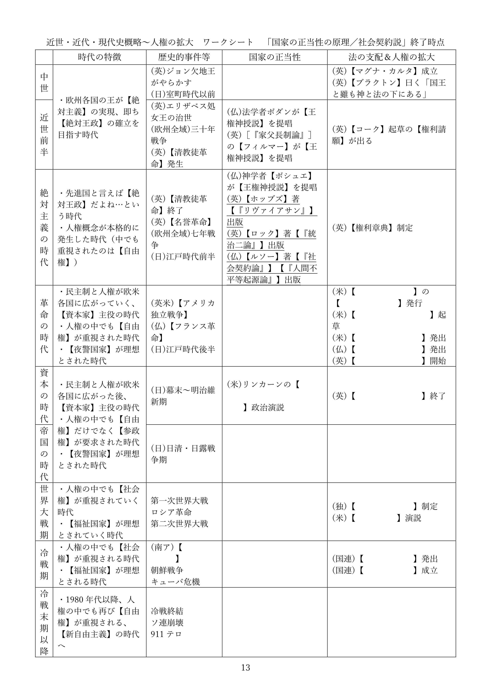

# 国家の正当性の原理    
  
※令和六年八月に本ページの内容を全面改訂しました。授業動画は改訂前のものです。改訂後の資料を使った授業動画は現在作成中です  
  
## ●授業動画一覧＆問題演習リンク  
  
|問題演習|[ウェブサイト](https://teacheramesaka.github.io/hsworkbookcivics/tag/pol01_03/)|  
|:---:|:---:|  
|国家の正当性の原理1／王権神授説|[YouTube](https://youtu.be/wVH3yEoYkBY)|  
|国家の正当性の原理2／ホッブズの社会契約説|[YouTube](https://youtu.be/D-wTVCPVlqg)|  
|国家の正当性の原理3／ロックとルソーの社会契約説|[YouTube](https://youtu.be/Wa3cVCwms9k)|  
|国家の正当性の原理4／民主主義の原則|[YouTube](https://youtu.be/iVITTGe0no0)|  
    
## ●概要  
・現代的な国家に関する歴史的な経緯を、現在学習中である  
・その順序は、以前見たように、以下の通りである  
  
１：中世～現代が、どんな時代かを見る  
２：絶対主義の時代～現代を、国家の正当性という側面から見る  
３：中世～現代を、法という側面から見る  
４：中世～現代を、人権という側面から見る  
  
・先にやった『近世・近代・現代史概略』は、１にあたる  
・ここからは２。即ち、「絶対主義の時代～現代を、国家の正当性という側面から見る」形になる  
  
・話の主軸は、国家の正当性である  
・特に統治権を「誰」が「何故」行使できるのか、という正当性の議論と発展を学習していこう  
  
  
  
## ●王権神授説  
・中世を通して欧州各地の王が求め、絶対主義の時代に先進的な制度とされたのが【絶対王政】である  
・【絶対主義】に基づく【絶対王政】の基本は、「国家とは国王である」であった  
  
・絶対主義の時代のフランス王、太陽王ルイ十四世の「朕は国家なり」は絶対王政を象徴する台詞である  
・これは、家臣に「そんなことをなさっては国家と民のためになりません」と諫言された時の答えである  
・彼は、「民だけでよい」「朕は国家なり」と答えた  
⇒絶対王政に於いて、国家とは国王であり、国家の意思とは国王の意思である。そして国家を統治する権利（統治権）を保持し行使するのもまた、王でなければならない。これが絶対王政であり、その実現を目指すのが絶対主義という考え方である  
  
・このような体制を作るには、「何で王様にはそこまでの権力があるの？」を理論化せねばならない  
・そうでもしなければ、人はなかなか従わない  
・そういった疑問に回答し、絶対主義を正当化する学説が【王権神授説】である。代表的な論者は以下  
  
|||||  
|:----:|:----:|:----:|:----:|  
|時期|国|名前|特記事項|  
|近世前半|フランス王国|ジャン・ボダン|法学者|  
|近世前半|イングランド王国|サー・ロバート・【フィルマー】|［『家父長制論』］を書いた思想家|  
|絶対主義の時代|フランス王国|ジャック＝ベニーニュ・【ボシュエ】|神学者|  
  
・王権神授説の骨子は、以下のようなものである  
１：王権は【神】から付与されたものであり、王は【神】に対してのみ責任を負う  
２：【神】の代理人たる王への反抗は【神】への反抗であり、誰も王の支配に反抗する事は許されない  
  
・このような理論が出てきたのには、中世初期から欧州にあった考え方がある  
・と言うのは、王を含む貴族が権力を持つ事の説明として、「神に愛されているから」というのがあった  
・この伝統はやがて、王権神授説として理論化され、絶対主義の根拠として使われるようになる  
⇒欧州に於いて貴族（王は貴族の筆頭である）というのは軍人であり、戦争の勝者であった。そして、戦争で勝てるのは「神に愛されているから」（負けるのは愛されていないから）であり、神に愛されているから権力があるし支配者になれるのだ、みたいな理屈があった。この伝統的な理解を受け継ぎ、理論を精緻化し、絶対主義の根拠に使われるようになったのが王権神授説である、と考えるとよい  
  
  
  
  
  
## ●社会契約説  
### ○概要  
・【社会契約説】は、近世中盤、三十年戦争前後から唱えられ始める学説である  
  
・三十年戦争は、凄惨を極めた戦争である。略奪、強姦、虐殺何でもござれな戦争であった  
・「ヨーロッパの人口がここまで減ったの、この後世界大戦までないのでは」と言われるぐらいである  
・そして、その三十年戦争は神によって始まり、神のせいで凄惨になったという側面がある  
  
※三十年戦争には「カトリック系キリスト教徒とプロテスタント系キリスト教徒の戦争」という側面があった。そしてこの両者は、互いが互いを「神の教えを誤って理解している最悪の連中」と考えており、「そもそも神を信じてないだけ、まだ異教徒の方がマシ」という感じで憎悪し合っていた。そら大変な事になるわ  
  
※例えばカトリックの軍がプロテスタントの都市（マクデブルク）を落とした時、人口二万五千の内二万が殺されたとされている  
  
・三十年戦争は凄惨な戦争だった一方、欧州中を巻き込んだ大戦争でもあった  
・実を言えば、三十年戦争の直前にも、宗教を原因とする戦争がいくつもあった  
・この事実は、「王は神の代理人」という理論を、無邪気に信じられない人々を生んだ  
・その結果誕生してくるのが、【社会契約説】である  
  
・社会契約説は、統治権を誰が、どうして持つのかを考えるという意味では王権神授説と同じである  
・また、社会契約説は必ずしも王政と対立するものでもなかった  
・一方で王権神授説は【神】を根拠とするが、社会契約説は契約や【合意】を根拠とするところが異なる  
・また、社会契約説は［市民革命］を経て現代的な民主主義政体に至る道筋も作っている  
※近現代的な社会（民主主義や資本主義を軸とする社会）を作り出した革命を、一般に市民革命と呼んでいる。代表例は【名誉革命】【アメリカ独立戦争】【フランス革命】  
  
・社会契約説は、主に三人の思想家によって提唱、発展させられた  
⇒トマス・【ホッブズ】、ジョン・【ロック】、ジャン＝ジャック・【ルソー】の三人である  
  
・三人の共通事項として、【自然状態】【自然権】【自然法】という概念がある  
  
・人がいるだけで社会も法律も政治も何もない状態、原始時代的な状態を自然状態と呼ぶ  
・この状態で人が有する権利を【自然権】と言う  
・また、この状態でも「これはやったらいかんでしょ」みたいな感覚はある筈で、それを【自然法】と呼ぶ  
⇒「自然状態の人間であっても人権を持ってる、自然権を持ってる…って考え方をするとどうなるかと言いますと…」とか、「自然状態だった時代は王なんかいなかった筈だが、今はいる。って事は、自然状態の人間は何らかの合意を結んで、王という存在を承認した筈だ。じゃあどんな合意を結んだんだろう」とか、こういう形で話を展開するのは三者共通である  
  
・以下、三人の社会契約説をそれぞれ見て行こう  
   
### ○トマス・ホッブズ  
・エリザベス処女王の時代に生まれ、王政復古期まで生きたイングランドの哲学者  
・代表作は【『リヴァイアサン』】である  
※昔はレヴァイアサンと呼ぶ事も多かった。ラテン語だとレビヤタンになるので、そこと混ざったのか…？  
  
・彼は、三十年戦争が始まった年に丁度三十歳、という世代である  
・つまり彼は、三十年戦争という、神が生んだ凄惨な戦争を目の当たりにした  
・更に、イングランド内戦からクロムウェル護国卿の独裁に至る、清教徒革命も経験している  
※尚、清教徒革命もまた、キリスト教が絡んだ宗教戦争の側面がある  
  
・こういった経験故に、ホッブズにとって、王権神授説は信じるに値しないものだった  
・社会契約説を考えるようになったのは、それ故であったと言ってよいだろう  
  
・そんな彼は、人間の【自然状態】は【万人の万人に対する闘争状態】であると結論している  
  
・分かりやすく説明しよう。自然状態、即ち原始時代の人間は、どういう状態にあるか？  
・例えば原始時代の人間社会には、力こそ全てという面が多分にあったと考えられる  
・一例として略奪婚、即ち気に入った女性を他者から力で奪う、という形態も普通だったと考えられる  
  
・これをホッブズは「あらゆる人間が無限の人権（自然権）を持っている状態」と定義づけたのである  
  
・現代的な国家では、「ここまでは人権と認めるけど、これ以上はちょっと…」と決まっている  
・そういう事を決めてくれる国家が存在しない原始時代は、認められない人権はなかった、と言うのだ  
  
例１：現代日本では、「内心の自由」を人権と認めている。だから「こいつムカつくんだよな、殺してぇ～～～」と思ってもよい。一方、現代日本では、「ムカつく奴を殺していい権利」は、人権として認められていない。よって、「こいつムカつくから殺しました」とやると警察に捕まり、裁判にかけられる  
  
例２：自然状態（原始時代）では国家が存在しない。故に、「ムカつく奴を殺していい権利」は人権であると主張し「こいつムカつくから殺しました」とやっても、警察に捕まる事はないし裁判にかけられる事はない  
  
※勿論、例２の場合、「殺された仲間の復讐をする権利」も制限される事はない。もっと言えば、「欲しいと思ったモノを奪う権利」とか「綺麗な人妻を強奪する権利」なんかも制限されない  
  
・こうしてホッブズは、国家が存在しない状態社会は即ち無法社会である、と結論した  
・ここまでの彼の理屈をまとめると、以下のようになる  
１：人間は【自己保存】を至上命題とする生命体である  
２：また、［「人間は人間に対して狼である」］  
３：よって自然状態の社会は、【万人の万人に対する闘争状態】となる  
  
   
・ホッブズは言う。万人の万人に対する闘争状態では、いかにもまずい  
・そこで人々は、全ての【自然権】を【国家】に譲渡する、という合意を結んだ  
・即ち、社会契約を結んだ。これが国家の起源である、と  
・故に国家（そして国家の主たる王）は人々を支配できる、と  
・…このような理屈で国家（及び王）による支配を正当化するのが、ホッブズの社会契約説である  
  
～ちょっと雑談～  
・トマス・ホッブズは三百年以上前の人間ではあるが、その思想は、現代でも通用する  
・例えば、「何故戦争はなくならないのか？」という問いに、明確に答える事ができる  
・と言うのは、現代は「人間にとっての国家」はある。だから同じ国民同士ならそうそう殺しあわない  
・しかし、「国家にとっての国家」が存在しない。国連はあるがいかにも力不足である  
・だからこそ、国家間の関係は「万人の万人に対する闘争状態」となり、戦争が頻発する  
・戦争をなくしたいのなら、「国家にとっての国家」を作れ。…このように、明確に答えられるのである  
～ほんとにちょっとだけでした～  
  
・ここまで見てきたトマス・ホッブズの思想を雑にまとめると、以下のようになる  
１：「国家が存在しなければ、万人の万人に対する闘争状態になってしまう」  
２：「だから人間には国家が必要だ」「人々は国家に服従しなければならない！」  
  
・この理論は理路整然としていて、現代にも通じる先進的な思想である  
・しかしひとつ、解決困難な問題が存在する  
・即ち、以下のような質問に対し、明快な回答を与える事が難しいのである  
・「じゃあ、国家（もしくは王）が圧政・暴政したらどうするんですか？」  
  
・何せトマス・ホッブズの思想は、国家に対する国民の抵抗を【認めていない】  
⇒国家に対する国民の抵抗とはつまり、国家を破壊する行為である、みたいな考え方をする。じゃあ国家が破壊されるとどうなるかと言うと、フランス革命みたいになる  
  
・基本的には「圧政国家でも万人の万人に対する闘争状態よりはマシでしょ」という回答になってしまう  
・それは確かにそうなのだが、もう少しこう、ないのか…という話がどうしても出てくるのである  
⇒この欠点にのみ注目し「こいつは所詮【絶対王政】を擁護する思想家に過ぎない」と非難する者も多い  
  
   
### ○ジョン・ロック  
・ジョン・ロックは、清教徒革命直前に生まれ名誉革命まで生きたイングランドの哲学者である  
・代表作は【『統治二論（市民政府二論）』】『人間悟性論』  
⇒単に社会契約説を展開した人というだけでなく、イギリス経験論の父とも呼ばれる偉大な哲学者である。社会契約説について書いてあるのは、『統治二論』の方  
  
・彼は清教徒革命直前に生まれ、クロムウェルの恐怖政治下のイングランドで育った  
・クロムウェルの死後、イングランド人は王を呼び戻す  
・しかし呼び戻された王は、思想的には親カトリックであった  
⇒これがまずかった。当時のイングランド人はほぼほぼプロテスタントであり、しかも、カトリックを「独裁者のヤバい宗教」だと思っていた。故に「ヤバい独裁者はNG」という形で再び王への反感が高まり、最終的に、また反乱が起こる。反乱側は当時のネーデルラント連邦共和国総督ウィレム三世を、新たな王として迎え入れた。これが名誉革命である  
  
・名誉革命は、現代イギリスの社会体制、その基礎である  
・ジョン・ロックはその名誉革命の直後に死んだ男であり、名誉革命を擁護し、正当化した男でもあった  
・故に彼の社会契約説は、現代イギリスの社会体制を正当化する内容になっている  
・即ち、ジョン・ロックの社会契約説は、結論として以下のようなものを導き出す  
１：王は存在してよいし、人々を支配しよい  
２：但し時には、人々が王を追放し、自らの望む王を迎え入れるのも正当である  
３：政治の基本は議会制民主主義である  
  
・では、ロックの社会契約説を、ざっと見てみよう  
・ロックはホッブズと違い、自然状態はむしろ平和だと、【自由】で平等であるとしている  
例：自然状態の人間は今より少なかった筈であり、一方で、食糧をはじめとする資源は豊富にあった筈である。だから狩猟採集生活なんてのができたのだ。よって、自然状態の人々は、資源を奪い合い、殺しあう必要はなかった。むしろ自然状態、つまり原始時代の人々は平和で、自由で、平等だった筈である  
  
・こうして、人々はそれぞれの自然権を尊重しあい、平穏な暮らしをする筈だ、と考えるのがロックである  
・この時彼が想定した自然権は、【自由】、【生命】を守る権利、【所有】もしくは【財産】の権利である  
※所有もしくは財産の権利は、「ある人が労働によって獲得したものはその人の所有物になる」という権利である。分かりづらいので例を挙げよう。自然の森の中にあるものは誰のものでもない。しかしある人、例えばジャックさんが「木の実を集める」という労働をして木の実を手に入れたとする。そうであれば、その実を所有する権利はジャックさんにある（ジャックさんの所有物・財産になる）  
  
・しかし、自然状態がいくら平和だと言っても、理想郷ではあり得ない  
・何せ人間は［過ち］を犯す生き物であり、それによって［人の権利］が侵害される可能性はある  
・そこで人々は、［国家］に［自然権］を守ってもらうよう、［統治権］を【委託（信託）】した…  
・この社会契約が国家の起源であり、だからこそ国家や王が存在する、とロックは結論する  
⇒国家が国民を支配する正当性は、この委託契約にある、とロックは考えるのである  
  
   
・彼のこの思想は、名誉革命を理論化・正当化するものとなった  
・名誉革命は結局、何をどう言い繕っても「反乱を起こして王を追い出した」ものである  
・ロックの理論を使えば、「そんな事していいの？」に対して「いいんだ！」と言える  
⇒「人々は、自然権を守ってもらう、という委託契約を王や政府と結んだんだ」「暴政するような暴君は委託契約違反だ、追い出していいんだ！」「だから名誉革命が起きて、イギリス人は新しい王と新しい委託契約を結んだんだ」という形  
  
・このようなロックの思想は、絶対王政的な王との相性は悪い  
・何せ、ロックの考え方からすると、王が王足り得るのは国民から委託を受けたからである  
・国民は、委託契約違反があれば契約解除を求めて反乱を起こせる立場にある  
・つまりロックの考え方は【国民主権（主権在民）】であり、国民に【抵抗権（革命権）】を認めている  
⇒それこそ、後の【アメリカ独立戦争】はロックの思想の影響によって起こっている。即ち、「イギリス政府の暴政に対し、アメリカは抵抗し独立する」という形である。また、後の【フランス人権宣言】も彼の影響を受けている  
  
・逆に言えば、ロックの思想は［立憲君主制］的な王制とは相性がいい  
⇒君主（王）はいるにはいるが、絶対的な権力を持っている訳ではない。憲法があり、「王（政府）はこういう事をしてはいけません」「王（政府）は国民にこういう権利があると認めます」みたいな事が書いてあり、王（政府）はそれを守らねばならない…というような類の体制をこう呼ぶ。現代イギリスや現代日本は典型的な立憲君主制である  
  
・また、ロックの思想は【間接民主主義（議会制民主主義）】とも相性がいい  
⇒国民が選挙で代議士（国会議員とか）を選び、その代議士が政治を行う、という類の政体  
※現代日本も、立憲君主制かつ間接民主主義という政体を採用している  
⇒何せロックの思想に於いては、主権は国民が持っている。だったら国民が政治を行うべきだが、何千万人もいる国民が一堂に会して議論する…というのは非現実的。なら、国民の代表（代議士）を選んで、そいつらに議論して政治をやって貰おう…という形  
  
・もっと言うと、ロックは現代国家の基本、［権力分立］についても語っている  
・現代日本では三権分立が一般的だが、ロックが唱えたのは二権分立であった  
・即ち、国家権力を［立法権］（議会）と行政権（国王、政府）を分ける…という発想である  
・そして両者の意見が対立した場合、立法権（議会）の決定が優先する、としている  
  
・このロックの権力分立思想は、現代イギリスの政治制度にも大きな影響を与えている  
・即ち、現代イギリスは［議会］主権であるとよく言われる  
⇒立法権を持つ議会の承認がなければ、誰も、あらゆる統治権を行使できない…という発想を元に、現代イギリスの統治機構は作られている。故に現代イギリスでは、王も内閣も、議会の下にある。それこそ2009年までは、裁判所すらも議会の指揮監督下にあった。「国家権力を国王と議会で分け合う」「国王と議会の意見が対立した場合は、議会が優先される」というロックの思想の影響が見て取れる  
  
   
### ○ジャン＝ジャック・ルソー  
・ジャン＝ジャック・ルソーは、ジュネーヴ共和国生まれの哲学者である  
・代表作【『社会契約論』】【『人間不平等起源論』】  
⇒時期的にはジョン・ロックの一世代後の人物。この時期は、イギリス以外の欧州国家が次々と絶対王政を完成させた、いわば絶対王政の完成期である。絶対王政を基礎とした社会秩序を［アンシャン・レジーム］などと呼ぶが、ルソーはそのアンシャン・レジームの完成期に、フランス王国で活躍した哲学者である  
  
・彼を簡潔に表現するなら「実現不可能な高い理想を掲げた男」となる  
⇒教員免許持ちの人間には、「自分は子供を捨てた割に“子育てとはこうあるべきだ！”という本を書いた男」としても有名。これも言ってみれば「実現不可能な高い理想」である  
※ヒモだった時期が一番幸せだったと正直に告白する男でもあり、露出狂で何度も捕まっており、また横暴な女性の前に跪いて許しを請うプレイが大好きで…なんだこいつは（困惑）  
  
・そんなルソーだが、論文を書かせたら当代一流であり、四十手前になってから思想家として活躍する  
・彼は、自然状態こそが人類の理想郷であると考えていた  
・自然状態の人々は、【自愛】と【憐み】を持ち、平等で自由である  
⇒私有財産というものが生まれてしまった為に、人は不平等になり、不自由になった  
※ここから、ルソーの考えは原則【自然に帰れ】となる  
  
・理想は自然に帰る事。人間が自然状態で持っていた自由、［自然的自由］を回復する事  
・しかし流石のルソーにも、今更自然に帰れないという事ぐらいは分かっていた  
・そこで、人々は社会契約という合意によって、新しい自由を手に入れるべきだと主張する  
・即ち、［社会的自由（市民的自由）］という、新しい自由である  
  
・これはどうやったら手に入るのか？  
・【一般意志】（公共の利益を考える気持ち）を以って、皆で【話し合って】物事を決めるのだ  
・そうする事によって、新しい自由が初めて手に入る。ルソーはそう論じたのである  
⇒【特殊意志】（自分の事だけを考える気持ち）で話し合いに参加してもしょうがない。【全体意志】（皆が自分の事だけを考えている状態）で話し合いをしても、やっぱり意味がない。一般意志に従って、皆で話し合う事で決まり事ができる。そういう決まり事に従う事で、人は初めて自由になれる、という考え方  
  
・ルソーはこのように考える為、ロック的な民主主義を否定する  
⇒ルソーもロックも国民主権という意味では同じである。一応、ルソーは［人民主権］という言葉を使うが、ともあれ主権が誰にあるかという意味では立場を同じくする。しかしルソーは、間接民主主義（議会制民主主義。要するに、選挙で選ばれた政治家が国会等で政治をやる類の民主主義）を否定する  
  
・間接民主主義では、選挙の時にしか人々に自由はない、とルソーは考えるのである  
・民主主義をやるのであれば、【直接民主主義】でなければ意味がない、というのがルソーの立場である  
⇒全国民が一箇所に集まって、全員で議論して法律を作る、というような類の民主主義  
  
・また直接民主主義を志向するルソーの思想は、王制とは並立し得ないものでもあった  
※ロックであれば、立憲君主制という形であれば王制と並立し得る  
  
・ルソーの思想は、彼の死後十年もすれば始まる［フランス革命］に大きな影響を与えた  
・但し、いかんせんルソーの言う事は、実現不可能な高い理想であった  
⇒それこそ、何千万人もいる国民を一箇所に集めて話し合いなんて物理的に無理  
・そういう訳で、革命時に出た【フランス人権宣言】は、むしろ【ロック】の色が濃い  
  
   
### ○社会契約説まとめ  
  
  
  
   
  
  
  
## ●現代の民主主義あれこれ  
・日本を含む現代の国家は、その多くが民主主義政体を採用している  
⇒つまり、ロックやルソーの社会契約説によって正当化されている  
・民主主義政体について、もう少し具体的に見て行こう  
  
  
### ○民主主義政体の原則  
・エイブラハム・【リンカーン】の「人民の、人民による、人民のための政治」がこれをよく表している  
⇒つまり、【国民主権】、【国民自治】、【国民受益】  
  
・日本国憲法前文も分かりやすい  
日本国憲法前文「そもそも国政は、国民の厳粛な信託によるものであつて、その権威は国民に由来し、その権力は国民の代表者がこれを行使し、その福利は国民がこれを享受する」  
⇒「その権威は国民に由来し」つまり国民主権。「その権力は国民の代表者がこれを行使し」つまり国民自治。「その福利は国民がこれを享受する」つまり国民受益  
  
  
### ○直接民主制（直接民主主義）  
・国民全員が一箇所に集まり、討論する形式の民主主義政体  
・古代ギリシアのポリスの政治はこれ（奴隷を除く市民による直接民主制）  
・現代日本のような大国は言うに及ばず、殆どの国で実行不可能な政体  
⇒何百万何千万という国民をどこに集めてどうやって討論するんですか…という問題  
  
  
   
### ○間接民主制（間接民主主義）  
・国民が代表者を選出し、その代表者が統治権を行使する形式の民主主義政体  
⇒代表者なので、政治家の事を代議士とか言う。また、代議士同士が討議を行う議会を形成する。この為、代議制民主主義、議会制民主主義などとも呼ぶ  
  
・間接民主制には、いくつか重要な原理があり、これを逸脱すると間接民主制の意味がなくなる  
１：【代表の原理】  
⇒選挙によって代表（代議士、議員）を選ぶ。また、選ばれた議員は［国民全体の代表者］である事を求められる（特定の集団、特定の地域の代表者であってはならない）  
２：【審議と多数決の原理】  
⇒討論は、多数決によって決する（多数決の原理）。この際、少数意見も尊重せねばならない（審議の原理）  
３：【行政監督の原理】  
⇒統治権の行使に際し、汚職等の問題がないかどうかを、国民が監視せねばならない  
  
・現代日本の政治も、上記の原理によって行われている  
⇒現代の日本の政体は？　無論、【立憲君主制】の【間接民主制】である。つまり、現代日本の国家としての正当性は、ロックの理論に拠っていると言える  
  
・なお、間接民主制に欠点があるのは事実である  
⇒例えばルソーの「選挙の時にしか人々に自由はない」というような指摘は、一定の理がある  
  
・その為現代日本では、間接民主制を基本にしつつも、一部直接民主制的な要素を取り入れている  
例：憲法改正の国民投票、地方特別法の住民投票、最高裁判所裁判官の国民審査  
  
|まとめの一問一答　問題文|まとめの一問一答　模範回答|
|:----:|:----:|
|「人民の、人民による、人民のための政治」という演説で知られる、南北戦争時のアメリカ合衆国大統領は？|エイブラハム・【リンカーン】|
|現代民主主義政体の三原則は？|【国民主権】、【国民自治】、【国民受益】|
|国民全員が一箇所に集まり、討論する形式の民主主義政体を何と呼ぶ？|【直接民主制（直接民主主義）】|
|国民が選挙で政治家を選び、その政治家が討論する形式の民主主義政体を何と呼ぶ？|【間接民主制（間接民主主義）】※代議制民主主義、議会制民主主義なども可|
|間接民主制の重要原理を三つ答えよ|【代表の原理】、【審議と多数決の原理】、【行政監督の原理】|
|代表の原理について、代議士はどのような存在である事を求められるか？|［国民全体の代表者］|
|現代日本の政体は？|【立憲君主制】の【間接民主制（間接民主主義）】|
  
