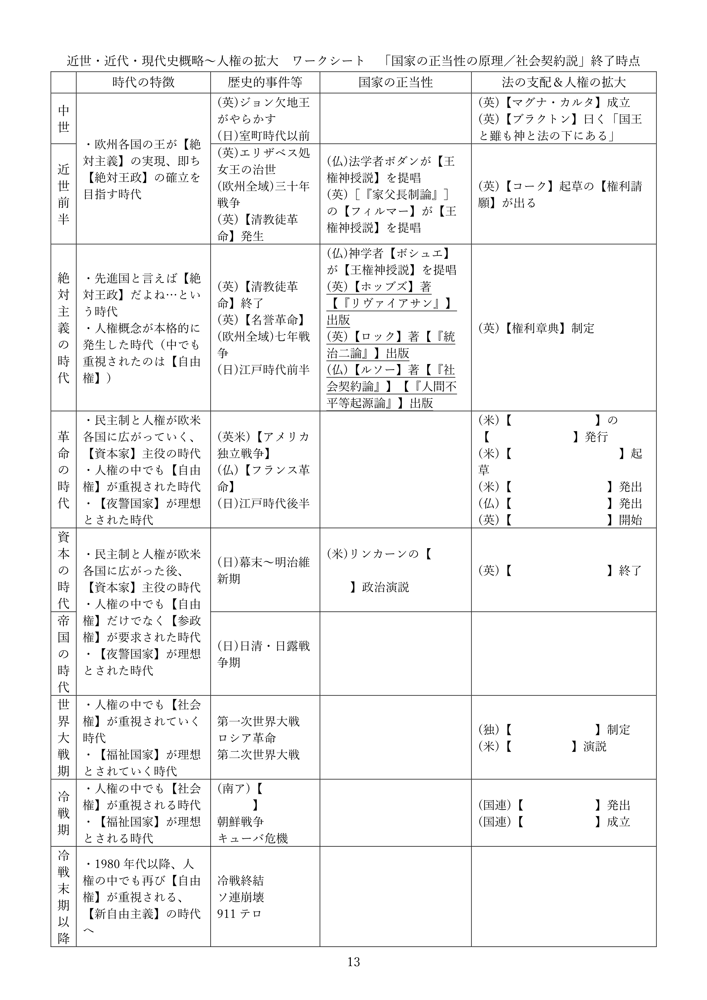
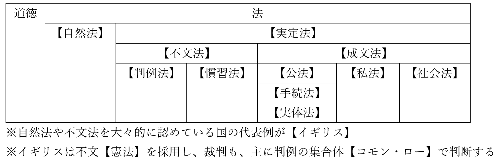

# 法の支配と法治主義  
## ●授業動画一覧  
|||  
|:----:|:----:|  
|法の支配と法治主義1／人の支配と法の支配|[YouTube](https://youtu.be/r6uq_kiZHV8)|  
|法の支配と法治主義2／法の支配と法治主義|[YouTube](https://youtu.be/sj2-v5bAwMI)|  
|法の支配と法治主義3／法の種類|[YouTube](https://youtu.be/eWWT0MFhtzM)|  
  
## ●概要  
・現代的な国家に関する歴史的な経緯を、現在学習中である  
・その順序は、以前見たように、以下の通りである  
  
１：中世～現代が、どんな時代かを見る  
２：絶対主義の時代～現代を、国家の正当性という側面から見る  
３：中世～現代を、法という側面から見る  
４：中世～現代を、人権という側面から見る  
  
・本節は３。即ち、「中世～現代を、法という側面から見る」である  
・換言すれば、「法という観点から見ると、現代的な国家はどういう経緯で登場してきたのか」である  
⇒現代的な国家は、法がなければ国家権力に捜査されないし、処罰されない。また法がなければ税金を取られないし、法がなければ年金を受け取れない。こういった「法」が強い力を持つ国家は、どういう経緯で作られてきたのかという点を見ていく  
  
  
## ●人の支配と法の支配  
・絶対王政の基本的な考え方は、「国は王の持ち物」「王は国であり、国は王である」というものである  
・こういう“人の支配”に於いては、支配のやり方も法も、王という人の思いのままとなる  
⇒例えば、窃盗は罰金、という法があったとする。しかし絶対王政のような「人の支配」にある国の場合、王は「確かに法では罰金って書いてある。でもそれはそれとしてお前はムカつくから死刑」と言えてしまう。何だったら「盗賊××は死刑にします法」を特別に制定できてしまう  
※当然、人権も糞もない  
  
・そういうのはよくない、王のような権力者と雖も従わねばならぬものはある、という思想も当然ある  
・王（権力者）の全能を否定し、王と雖も法に従わねばならないとする考え方を【法の支配】という  
※この考え方は、「法によって【人権】を保障するに行きつく。実際、人権の保障は法の支配の目的であるとされる  
  
・この法の支配という発想は、イングランド王国で発展してきた  
  
・まずもって、中世盛期の【マグナ・カルタ】が、法の支配という考え方の由来の一つと言える  
⇒当時の裁判官ヘンリー・ド・【ブラクトン】の台詞「国王と雖も神と法の下にある」はマグナ・カルタの精神を現したものとされるが、言っている事が法の支配と一緒である。何せ法の支配は「王と雖も法に従わねばならない」という発想なので…  
  
・また、【清教徒革命】直前にも、議会が王へ法の支配を要求している  
・いわゆる【権利（の）請願】である。起草したのは法学者エドワード・【コーク（クック）】であった  
⇒彼は、ブラクトンの「国王と雖も神と法の下にある」を引用した事でも有名。請願した相手が“殉教王”チャールズ一世であり、ガン無視され…最終的に、清教徒革命が発生する  
  
・そして【名誉革命】後、マグナ・カルタや権利請願の考え方は、正式な法となる  
・即ち、名誉革命で即位したイングランド王、ウィレム三世が承認した【権利章典】である  
  
・マグナ・カルタと権利章典は現代でも、イギリス憲法を構成する重要な文書である  
・現代では、「法の支配」と「議会主権」こそがイギリス憲法の二大原理であると認識されている  
⇒名誉革命から約二百年後の1885年。憲法学者アルバート・ヴェン・【ダイシー】の代表作［『憲法序説』］が出版されてから、この認識が広がった  
  
**人の支配と法の支配まとめ**  
|||
|:----:|:----:|
|人の支配の基本的な考え方|「国は王の持ち物」「王は国であり、国は王である」 ↓ 王は法に縛られないし、好きな法を好きに作ってよい|
|【法の支配】の基本的な考え方|王のような権力者と雖も従わねばならぬものはある ↓ 王と雖も法に従わねばならない|
|法の支配という発想が発展してきた地域|イングランド|
|そもそも「王のような権力者と雖も従わねばならぬものはある」って要するに…|【大憲章（マグナ・カルタ）】が作られた当時の裁判官、ヘンリー・ド・【ブラクトン】の「国王と雖も神と法の下にある」|
|近世に入ってから、「国王と雖も神と法の下にある」を復活させたのが…|【清教徒革命】直前の、いわゆる【権利（の）請願】。起草は法学者エドワード・【コーク（クック）】|
|【名誉革命】後に、マグナ・カルタや権利請願の精神を正式な法としたのが	|【権利章典】|
|「法の支配」と「議会主権」こそがイギリス憲法の二大原理であるとされるようになった契機|1885年、憲法学者アルバート・ヴェン・【ダイシー】の代表作［『憲法序説』］の出版|
  

  
## ●法の支配と法治主義  
### ○概要  
・ここまで法の支配という考え方の発展を見てきた  
・実は、同じ「法に依る支配」という考え方でも二種類ある。【法の支配】と【法治主義】である  
  
||||
|:----:|:----:|:----:|
||法の支配|法治主義|
|由来|イギリス等の英米系国家|プロイセン王国等の欧州大陸国家|
|別名|【実質的法治主義】|【形式的法治主義】|
|目的|被治者の【権利・自由の保障】 ⇒【人権の保障】|【行政の効率化】|
|認められる法|【成文法】のみならず【不文法】、【自然法】も認められる|【成文法】のみが認められる|
|欠点|「悪法」や「圧政」を誰が認定するのか、という問題がある|［悪法もまた法なり］になる可能性がある|
  
### ○法の支配  
・法の支配は、既に見てきたようにイングランドで、国王の権力に抵抗する形で発展してきた  
⇒つまり英米系の考え方（アメリカも元イングランドなので考え方を受け継いでいる）  
※【実質的法治主義】ともいう  
  
・国王の権力に抵抗する形で発展してきた以上、目的は【人権の保障】となる  
⇒発想が「国王と雖も神と法の下にある」、つまり「いくら国王でも、やっていい事と悪い事があるでしょ」から来ているので…  
  
・また、その目的や経緯から、【自然法】や【不文法】も認められる  
※自然法：「普通に考えたら、こういう事しちゃ駄目でしょ」のような、自然な正義に基づいた法  
※不文法：「民法」「独占禁止法」のような文章になっていない法律。慣習や判例等  
  
### ○法治主義  
・一方、法治主義は主にプロイセン王国等の大陸国家で発展してきた。【形式的法治主義】ともいう  
  
・法治主義と法の支配は、発想も前提も異なる  
・法の支配は、「国王は圧政をしたがる」を前提に、「国王であっても法を守れ」となって生まれた  
・一方、例えばプロイセン王国では、「国王や政府は圧政をしたがるもの」という前提がなかった  
⇒政治分野第二章で詳しく述べるが、プロイセン王国は「理性的である」「合理的である」という事を至上命題にしてきた国である。王や政府が、「圧政は合理的ではない」「人権の蹂躙は理性的ではない」といった発想をする為、圧政を布くという事があまりなかった  
  
・故に法治主義では、「王であっても法を守れ」「人々の人権を守れ」は重視されない  
・そもそも「圧政は合理的ではない」「人権の蹂躙は理性的ではない」ので、そこは重要ではない  
・重要なのは、合理的かつ理性的に政治をする事である  
・国家が機能する際の形式や手続きを法によって定め、効率的に政治を行うのである  
  
・当然ながら法治主義に基づく場合、法律は【成文法】でなければならない  
・即ち、不文法や自然法は認められない訳である  
  
  
### ○法の支配と法治主義あれこれ  
・日本の場合、戦前は完全に法治主義だった  
・現代日本は両者のハイブリッドというのが一般的な考え方である  
⇒敗戦と日本国憲法によって法の支配的な考え方が導入された結果、ハイブリッドになった  
  
・法の支配にしろ、法治主義にしろ、欠点（もしくは盲点）がある  
・両者の欠点は共に、圧政や暴政を正当化する悪法ができてしまった時、露わになる  
  
・例えば法治主義は、「一度法として定めてしまえば、どんな悪法でも通用してしまう」欠点がある  
・と言うのは、法の支配と違って法治主義は、「悪法は無効だから守らなくていい」という発想がない  
・法が作られたなら、それがどんな法でも守りましょう、というのが法治主義の発想である  
⇒法治主義は「王や政府が合理的に、理性的に政治を行う」というのが前提なので、「王や政府が悪意を持って法を作る」とか「悪法は法ではないから破ってよい」という発想はない。仮に悪法ができてしまっても、「悪法だから守らなくていい」なんてのは理性的ではない。政治をする人々が合理的に考え、悪法を廃止すればよい…法治主義の発想だとこうなる  
  
・こうして、法治主義の国では［悪法もまた法なり］となる  
・どんな悪法でも、法として存在している間は守らねばならない…というのが法治主義の欠点と言える  
  
・この点、法の支配であれば、王や政府が悪法を作った時、人々は「人権侵害だ！」と反撃できる  
・「人権侵害になるような法律は、そもそも無効だ！」と言えるのが法の支配の強みである  
・しかし一方で、法の支配にも、「悪法とはどういう基準で誰が決めるのか」という問題がある  
・悪法認定をする人を余程慎重に選ばないと、「悪法認定者による人の支配」になってしまうのである   
  
## ●法の種類  
・ここまで見てきた経緯によって、現代日本は法によって支配される事になった  
・ただ、法と一言で述べても、色々ある。本項はこれを整理する  
  

  
  
### ○そもそも法とは何か  
・法とは何か。これは道徳と比べて考えると分かりやすい  
  
・ここでは「他人を殺してはいけない」を例にしよう  
・法でも道徳でも、「他人を殺してはいけない」は結果として、殺人を減らす事になる  
・但し、その減らし方が異なる  
  
・道徳は、人間の心（内面）に働きかけて、人の外面的な行動を律する  
⇒「他人を殺してはいけない」という道徳が存在すると、人は、心の中で「こいつ殺してぇ～～～～」と思っていても、「でも“他人を殺してはいけない”って言うからな…」と思いとどまる  
※道徳を破って、実際に他人を殺してしまったからと言って、誰かに罰される訳ではない  
  
・一方、法は普通、人の心に働きかけない  
・「他人を殺してはいけない」という法を破った場合、国家によって罰される。ただそれだけである  
・つまり法とは、「人間の外面的な行為を律し、国家による強制力があるもの」だと言えるだろう  
  
・法には大きく分けて二つある。【実定法】と【自然法】である  
  
  
### ○実定法と自然法  
・実定法は、ある社会で実際に効力がある、人が作った法の総称である  
・一方自然法は、自然な正義、人の本性に基づいた法を指す  
⇒「普通に考えたら圧政しちゃ駄目でしょ」みたいなもの。当然、大抵の国では法として通用しない  
  
・実定法は、大きく分けて二つある。【不文法】と【成文法】である  
  
   
### ○不文法  
・法典という形で明文化されていない法律  
※単に「文章になっていない法律」という意味ではない。商法とか刑法とか、そういう法典として明文化されていない、という話。例えば不文法の一種に判例法があるが、これは過去の裁判の判決（つまり判例）の集合体である。そして普通、裁判の判決は文章になっている  
  
・国によっては法として認められない  
・大々的に法律として認めているので有名な国は、現代の【イギリス】。何せ【憲法】すら不文法である  
  
・不文法は、主に【慣習法】と【判例法】に分けられる  
・慣習法は、社会的な慣習、伝統的な慣行が、国家によって法としての力を認められたもの  
・判例法は、過去の裁判の判決、即ち判例の集合体である  
⇒イギリスは、主に判例の集合体【コモン・ロー】によって裁判を行う  
  
  
### ○成文法  
・法典として明文化されている法律。法の存在を認めるあらゆる国によって認められている  
・成文法は、主に【公法】、【私法】、【社会法】に分けられる  
  
・公法は、国家と私人（個人や企業）の関係、手続きを規定する法である  
⇒憲法、刑法、地方自治法、民事訴訟法、刑事訴訟法等  
・公法の中でも、権利、義務関係の法を特に［実体法］と呼ぶ  
⇒憲法、刑法、地方自治法等  
・公法の中でも、国家と私人の間の手続きを規定する法を特に［手続法］と呼ぶ  
⇒民事訴訟法、刑事訴訟法等  
  
・私法は、私人と私人の関係を規律する法  
⇒民法、商法等。各私人間の関係を、なるべく自由かつ平等に扱おうとする傾向にある  
  
・ところで私人と言っても、個人と企業では持つ力が違い過ぎる  
⇒個人と企業を対等な存在として扱い、企業を自由にさせ過ぎるとどうなるか？　企業は「社員の給料を下げる自由」「社員の労働時間を増やす自由」「目障りな社員をクビにする自由」を堂々と行使するようになるだろうし、個人がこれに対抗するのは大変である  
  
・こうして、個人を保護し、実質的な平等を実現させる法が必要となる。社会法である  
⇒労働基準法、独占禁止法等  
