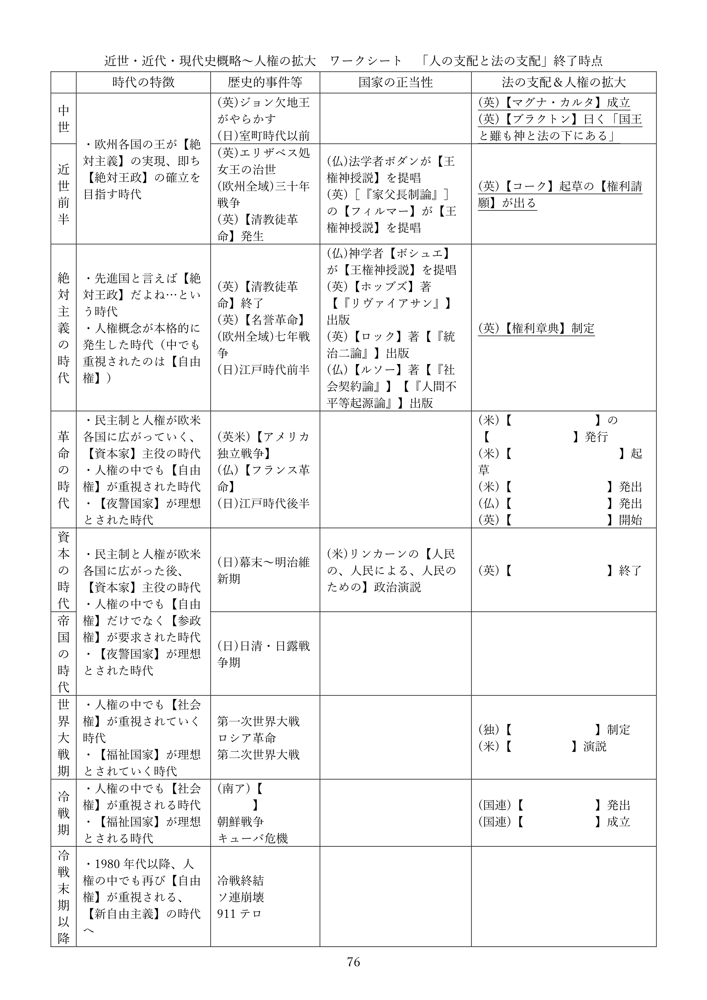
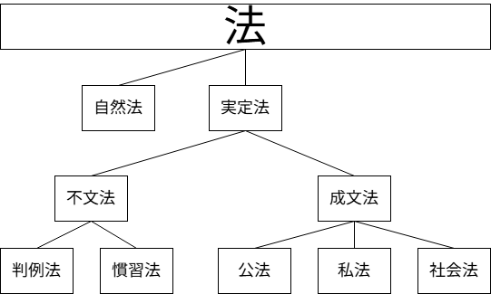

# 法の支配と法治主義  
  
※令和六年八月に本ページの内容を全面改訂しました。授業動画は改訂前のものです。改訂後の資料を使った授業動画は現在作成中です  
  
## ●授業動画一覧＆問題集リンク  
  
|問題集|[ウェブサイト](https://teacheramesaka.github.io/hsworkbookcivics/tag/pol01_04/)|  
|:----:|:----:|  
|法の支配と法治主義1／人の支配と法の支配|[YouTube](https://youtu.be/r6uq_kiZHV8)|  
|法の支配と法治主義2／法の支配と法治主義|[YouTube](https://youtu.be/sj2-v5bAwMI)|  
|法の支配と法治主義3／法の種類|[YouTube](https://youtu.be/eWWT0MFhtzM)|  
  
## ●概要  
・現代的な国家に関する歴史的な経緯を、現在学習中である  
・その順序は、以前見たように、以下の通りである  
  
１：中世～現代が、どんな時代かを概観する（「近世・近代・現代史概略」の前半）  
２：近世後半～現代の、各時代の特徴を概観する（「近世・近代・現代史概略」の後半）  
３：絶対主義の時代～現代を、国家の正当性という側面から見る（「国家の正当性の原理」）  
４：中世～現代を、法という側面から見る（「法の支配と法治主義」）  
５：中世～現代を、人権という側面から見る（「人権の拡大」）  
  
・本節は４。即ち、「中世～現代を、法という側面から見る」である  
⇒現代的な国家では、国家権力であろうとも、法がなければ国民を逮捕・処罰できず、税金を課すこともできない。逆に、年金の支給のように、国民の権利や利益を保障するのも法である。こうした「法」が強い力を持つ国家は、どのような経緯で作られてきたのか…というのが、ここからの話である  
  
## ●人の支配と法の支配  
・絶対王政の基本的な考え方は、「国は王の持ち物」「王は国であり、国は王である」というものである  
⇒絶対王政はいわば、「王による支配」であり、「王という“人”による支配」であると言えるだろう。そこから、絶対王政的な支配を、「人の支配」と呼ぶ事がある  
  
・こういう「人の支配」に於いては、支配のやり方も法も、王という人の思いのままとなる  
⇒例えば、「窃盗は罰金」という法があったとする。しかし絶対王政のような「人の支配」にある国の場合、王は「確かに法では罰金って書いてある。でもそれはそれとしてお前はムカつくから死刑」と言えてしまう。何だったら「盗賊××は死刑にします法」を特別に制定できてしまう  
  
※「人権はどうなってるんだ人権は！」と思うかもしれないが、「人の支配」に於いては、現代的な意味での「人権」は存在し得ない。少なくとも、日本国憲法の言うような「侵すことのできない永久の権利」にはなり得ない  
  
・そういうのはよくない、王のような権力者と雖も従わねばならぬものはある、という思想も当然ある  
⇒王（権力者）の全能を否定し、「王と雖も法に従わねばならない」とする考え方を【法の支配】という  
  
・法の支配に於ける「法」とは、権力者が勝手に作って勝手に使う命令ではない  
⇒むしろ、「侵すことのできない永久の権利」という意味での【人権】を法によって保障するものである。公共や政治経済の教科書でよく見る、「法の支配の目的は人権の保障」であるという文章には、そういう意味がある  
  
※言ってみれば、「人の支配」とは「権力者の自由」を擁護するものであり、法の支配は「権力者の自由」を制限するものである。故に法の支配に於ける「法」は、「権力者の自由を制限するもの」という側面を持ち得るのである  
  
|支配の類型|基本的な考え方|だから…|例えば…|
|:----:|:----:|:----:|:----:|
|人の支配|「国は王の持ち物」「王は国であり、国は王である」|王は法に縛られない|王は好きな法を好き勝手に作ってよいし、処罰したい者がいるなら好きに処罰してよい|
|【法の支配】|王のような権力者と雖も従わねばならぬものはある|王と雖も法に従わねばならない	王と雖も好きな法を好き勝手に作れはしないし、処罰したい者がいたとしても法の定めがなければ処罰できない|
  
・この法の支配という発想は、イングランド王国で発展してきたものである。以下に簡単にまとめよう  
  
|時期|画期|
|:----:|:----:|
|中世盛期|ジョン欠地王が認めさせられた【マグナ・カルタ（大憲章）】 ヘンリー・ド・【ブラクトン】の「国王と雖も神と法の下にある」|
|近世前半（【清教徒革命】直前）|法学者エドワード・【コーク（クック）】が起草した【権利（の）請願】|
|絶対主義の時代（【名誉革命】直後）|ウィレム三世が承認した【権利章典】|
|帝国の時代|憲法学者アルバート・ヴェン・【ダイシー】の代表作［『憲法序説』］出版|
  
・まずもって、中世盛期の【マグナ・カルタ】が、法の支配という考え方の由来の一つと言える  
⇒当時の裁判官ヘンリー・ド・【ブラクトン】の台詞「国王と雖も神と法の下にある」はマグナ・カルタの精神を現したものとされるが、言っている事が法の支配と一緒である。何せ法の支配は「王と雖も法に従わねばならない」という発想なので…  
  
・マグナ・カルタは、イングランド王国の「王の権利を議会と法で制限する」伝統の典型と言えよう  
⇒既に見たように、欧州各国の王は家臣の権力を弱め、王権を強め、もって絶対王政を実現しようと努力してきた。しかしイングランド王国は他国に比べて明らかに「王権が弱く、議会が強い」国であった  
  
・この伝統は、【清教徒革命】直前になると再び、【権利（の）請願】という形で歴史の表舞台に立つ  
⇒議会が王に対して出した請願だが、起草したのは法学者エドワード・【コーク（クック）】である。彼はブラクトンの「国王と雖も神と法の下にある」を引用し、“殉教王”チャールズ一世に対し、「法の支配」というやり方の導入と遵守を求めたのであった  
  
・権利請願は無視されたが、【名誉革命】後、権利請願やマグナ・カルタの考え方は、正式な法となる  
⇒名誉革命は、議会が王を追放し、議会にとって都合がいい王を外国から連れてきた…という事件である。連れてこられたウィレム三世（ウィリアム三世）は、「議会に都合がいい王」というだけあって、議会が作った法（権利請願やマグナ・カルタの精神を改めて確認する法）を承認してくれた。これが【権利章典】である  
  
・マグナ・カルタと権利章典は現代でも、イギリス憲法を構成する重要な文書である  
⇒実は、イギリス憲法は「イギリス憲法第一条　ナントカカントカ」みたいな形になっていない。「イギリス憲法の一部」として指定されている法の集合体こそが、イギリス憲法である。その中でも特に根幹とされる法が、マグナ・カルタと権利章典なのである  
  
・現代では、「法の支配」と「議会主権」がイギリス憲法の二大原理であると認識されている  
⇒名誉革命から約二百年後の1885年。憲法学者アルバート・ヴェン・【ダイシー】の代表作［『憲法序説』］が出版されてから、この認識が広がった  
  

  
## ●法の支配と法治主義  
### ○概要  
・法の支配とは即ち、「法に依る支配」であるが、この考え方、実は二種類存在する  
⇒【法の支配】と【法治主義】である。ここから、それぞれの違い、長所と短所を見ていこう  
  
||法の支配|法治主義|
|:----:|:----:|:----:|
|由来|イギリス等の英米系国家|プロイセン王国等の欧州大陸国家|
|別名|【実質的法治主義】|【形式的法治主義】|
|目的|被治者の【権利・自由の保障】 ⇒【人権の保障】|【行政の効率化】|
|認められる法|【成文法】のみならず【不文法】、【自然法】も認められる|【成文法】のみが認められる|
|欠点|「悪法」や「圧政」を誰が認定するのか、という問題がある|［悪法もまた法なり］になる可能性がある|
  
※言うまでもなく上記表は、高校教育用に単純化した表である。この後解説はするが、細かい話は大学の法学部で学ぼう！  
  
### ○法の支配  
・法の支配は、既に見てきたようにイングランドで、国王の権力に抵抗する形で発展してきた  
⇒つまり英米系の考え方（アメリカも元イングランド植民地なので考え方を受け継いでいる）である  
  
・既に見たように、その目的は【人権の保障】である  
⇒人の支配に対抗する形で発展してきた以上、発想が「国王と雖も神と法の下にある」、つまり「いくら国王でも、やっていい事と悪い事があるでしょ」から来ているので…  
  
・そして法の支配は、高校の政治経済では、【実質的法治主義】という概念と同一視される  
⇒「法に依る支配」は「法に依る支配」なのだが、人権の保障という目的が達成できるのであれば、その「法」は「国会が制定した法律」でなくともいい、という訳である  
  
例１：「イギリスは議会主権国家である」「イギリスでは、国王と議会なら議会の方が偉い」というのは、今でこそ、権利章典を含むイギリス憲法に記載されており、「国会が制定した法律」になっている。しかし権利章典が「国会が制定した法律」になったのは、名誉革命の後である  
⇒「イギリスでは、国王と議会なら議会の方が偉い」という法律が国会で制定される前に、議会は国王を追い出し、それは合法とみなされている。つまるところ、「法の支配」の「法」は、「国会が制定した法律」でなくともよいのだ  
  
・法の支配に於いては、具体的には、【自然法】や【不文法】も「法」として扱われている  
  
自然法：自然状態でも「これはやったらいかんでしょ」みたいな感覚はある筈。それに基づく法を指す  
不文法：「民法」「独占禁止法」のような法典になっていない法。慣習や判例等を指す  
  
⇒より正確に言うと、自然法は、不文法の正当化の材料として使われる事が多い  
  
例２：名誉革命に於ける国王の追放は、国王が、国会で制定された「圧政禁止法第××条に違反した」から起きたものではない。国王が古より続く不文法を破ったからである  
⇒イギリスでは古来、「圧政はいかん」という伝統や「人々の権利は保障せないかん」という慣習があった。国王が追放されたのは、こういう伝統や慣習を破ったからである  
  
※そんな伝統とか慣習みたいなふわふわしたもので「国王の行動は違法！」ってやってええんか…？　というのは当然誰もが考える訳で、そこで、「圧政はいかん」を正当化する根拠として、自然法（や自然状態、自然権）が持ち出される。ジョン・ロックの『統治二論』は、その代表例である  
  
### ○法治主義  
・一方、法治主義は主にプロイセン王国等の大陸国家で発展してきた考え方である  
⇒高校の政治経済では、やはり、【形式的法治主義】という概念と同一視される  
  
・法治主義と法の支配は、発想も前提も異なる  
⇒法の支配は、「国王は圧政をしたがる」を前提に、「国王であっても法を守れ」となって生まれた。一方、例えばプロイセン王国では、「国王は圧政をしたがる」という前提がそんなになかった  
  
※政治分野第二章で詳しく述べるが、プロイセン王国は「理性的である」「合理的である」という事を至上命題にしてきた国である。王や政府が、「圧政は合理的ではない。重税をかけたところで反乱と脱税が増えるだけで、税収は増えない」「人権の蹂躙は理性的ではない。国家の生き残りがかかった戦争中ならともかく、理性的な王はむしろ、国民に人権を与えるものだ」といった発想をする国である  
  
・故に法治主義では、「王であっても法を守れ」「人々の人権を守れ」は第一義ではない  
⇒そもそも「圧政は合理的ではない」「人権の蹂躙は理性的ではない」と考える国家なので、そこを殊更に強調する必要があまりない  
  
・重要なのは、合理的かつ理性的に政治をする事、即ち【行政の効率化】である  
⇒国家が機能する際の形式や手続きを法によって定め、効率的、安定的に政治を行うのである。無論、一度国会を通って定められた法であれば、王でも従わねばならない訳だが…その目的は洗練された現代的国家として、合理的かつ理性的な国家運営をする事である  
  
・当然ながら法治主義に基づく場合、法律は【成文法】でなければならない  
⇒先程、法の支配の特徴を見た時、「ロックの理論は知ってるけど、いやでも、そんな伝統とか慣習とかふわふわなモノを法として扱って、“国王は圧政者だから違法！”とかやって大丈夫…？」と思ったかもしれない。法治主義では逆に、「国会で可決された」「ナントカ法ナントカ条みたいな形に整えられている」といった、きちんとした形式を持った法のみが、法と認められる。無論、不文法や自然法は認められない  
  
・この「形式」に着目する点が、「形式的法治主義」という言葉の所以である  
⇒一見すると悪口にしか見えない言葉だが、「正しい手続きを踏んで作られた、きちんとした形式を伴った法律だけが法律ですよ」という意味の言葉であり、裏を返せば、「自然法とか不文法みたいなふわふわしたものを法律として認めちゃ駄目でしょう」を含意している  
  
### ○法の支配と法治主義あれこれ  
・日本の場合、戦前は法治主義だったと言ってよいだろう  
⇒そもそも憲法がプロイセン＝ドイツ式憲法なので、当然と言えば当然である  
  
・一方、戦後日本は両者のハイブリッドというのが一般的な考え方である  
⇒敗戦と日本国憲法によって法の支配的な考え方が導入された結果、ハイブリッドになった  
  
※と言っても、ハイブリッドになっているのは戦後日本だけではなく、現代の先進国の多くがそうである。法の支配にも法治主義にも長所と短所があり、組み合わせて長所を伸ばし、短所を克服しよう…という訳である。では、どのような長所と短所があるのか、以下で見てみよう  
  
・両者の欠点は共に、圧政や暴政を正当化する悪法ができてしまった時、露わになる  
  
・例えば法治主義は、「一度法として定めてしまえば、どんな悪法でも通用してしまう」欠点がある  
⇒と言うのは、法治主義は「王や政府は圧政をしたがる」という前提がなく、むしろ、「王や政府が合理的に、理性的に政治を行う」を前提にしている。だから「王や政府が悪意を持って法を作る」というのはあまり想定していない  
  
※仮に悪法ができてしまっても、理性主義的な発想だと「“悪法だから守らなくていい”なんてのは理性的ではない」「政治をする人々が合理的に考え、悪法を廃止すればよい」という風になる  
  
・こうして、法治主義の国では［悪法もまた法なり］となる  
⇒どんな悪法でも、法として存在している間は守らねばならない…というのが法治主義の欠点と言えるだろう  
  
・一方、法の支配であれば、王や政府が悪法を作った時、人々は「人権侵害だ！」と主張可能である  
⇒「人権侵害になるような法律は、そもそも無効だ！」「悪法だから守らなくていい！」と言え、その根拠として不文法や自然法を持ち出せるのは、元から「王や政府は圧政をしたがる」という前提を持つ、法の支配の強みと言えよう  
  
・しかし一方で、法の支配にも、「悪法とはどういう基準で誰が決めるのか」という問題がある  
⇒悪法を悪法と誰が認定し、守らなくてよいとするのか。もっと言えば、どのような政治を圧政とし、これに反乱を起こしていいとするのか。その判断は誰が、どのような基準で行うのか。これが非常に難しく、一歩間違えれば「悪法認定者による人の支配」の世界や、「反乱起こしてみて、勝てば官軍」の世界になってしまう  
  
※実際のところ、イギリスの法の支配を確立した名誉革命も、後から議会が「名誉革命は合法でした法」（より正確に言うと、「ウィレム三世の即位は合法です法」）を作っている。「法の支配は正しいんだ、国王の追放は合法なんだ！」と本気で思っているなら、こんな法律は要らない訳で…結局のところ名誉革命にも、「反乱起こしてみて、勝てば官軍」の側面がある事は否定できないのである  
  
## ●法の種類  
・ここまで見てきた経緯によって、現代日本は法によって支配される事になった  
・ただ、法と一言で述べても、色々ある。本項はこれを整理する  
  

  
|成文法の類型|現代の日本の例|
|:----:|:----:|
|公法|憲法、刑法、地方自治法、民事訴訟法、刑事訴訟法|
|私法|民法、商法|
|社会法|労働基準法、独占禁止法|
  
※自然法や不文法を重視する国の代表例が【イギリス】。イギリスは不文【憲法】を採用し、裁判も、主に判例の集合体【コモン・ロー】で判断する  
  
### ○解説  
#### ▽自然法と実定法
・法にも大きく分けて二種類ある。【自然法】と【実定法】である  
  
実定法：ある社会で実際に効力がある、人が作った法の総称  
自然法：自然状態でも「これはやったらいかんでしょ」みたいな感覚はある筈だ、という考えに基づく法  
  
・実定法は、大きく分けて二つある。【不文法】と【成文法】である。まず成文法から見ていこう  
  
#### ▽成文法
  
成文法：法典として明文化されている法  
⇒「商法何条　ナントカカナントカ」「刑法何条　ナントカカントカ」というような形で、法典になっている法をこう呼ぶ  
  
・成文法は、主に【公法】、【私法】、【社会法】に分けられる  
  
公法：国家と私人（個人や企業）の関係を規定する法  
私法：私人と私人の関係を規律する法  
社会法：弱者を保護し、実質的な平等を実現させる法  
  
・高校政経では、公法は、［実体法］と［手続法］に分けて解説される事が多い  
⇒権利、義務関係の法を特に［実体法］、手続きを規定する法を特に［手続法］と呼ぶ事が多い。実体法の例として、憲法、刑法、地方自治法等がよく挙がる一方、手続法の例としては民事訴訟法、刑事訴訟法等がよく挙がる  
  
※実際には、実体法と手続法という分類は公法だけのものではないのだが…まぁ高校の政経なのでね…  
  
・私法は、各私人間の関係を、なるべく自由かつ平等に扱おうとする傾向にある  
⇒とは言え、同じ「企業と企業」でも大企業と下請け企業では全然平等ではないし、「企業と個人」なら明らかに企業の方が強い。という訳で弱者を保護し、実質的な平等を実現させる法として、社会法が必要とされるのである  
  
#### ▽不文法
・次いで、不文法を見てみよう  
  
不文法：法典という形で明文化されていない法  
⇒「不文法」とは言うが、「文章になっていない法」ではない。成文法のような法典になっていない法を指す  
  
※不文法は、国によっては法として認められない。不文法を重視する国として有名なのは勿論、【イギリス】である。何せ【憲法】すら不文法である  
  
・不文法は、主に【慣習法】と【判例法】に分けられる  
  
慣習法：社会的な慣習、伝統的な慣行が、国家によって法としての力を認められたもの  
判例法：過去の裁判の判決、即ち判例の蓄積  
  
※判例法の代表例は、やはり【イギリス】の【コモン・ロー】である。分かりにくいので例を出そう  
  
例：1987年にイギリス国会で制定された消費者保護法は、例えば、「店で買ったジュースに異物が入っていて、それで病気になった」という場合、被害者がジュースの製造企業に対し損害賠償請求の裁判を起こせるよう規定されている。じゃあ、この法律ができる前のイギリスでは、ジュースの製造企業に対して裁判を起こせなかったのか…と言うと、起こせた。のみならず裁判所も、過去の似たような裁判を参考にして判決を出していた。イギリスでは、成文法がなくてもコモン・ローを根拠に裁判を起こせるし、判決も出せるのである  