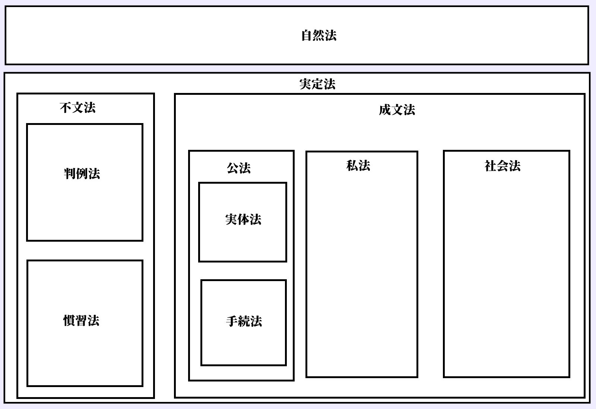

# 法の支配と法治主義  
## 授業動画一覧
[本節の授業動画はこちら](LIST.md#法の支配と法治主義)

## ●概要
・本節は「法という観点から見ると、現代的な国家はどういう経緯で登場してきたのか」にあたる  
⇒現代的な国家は、法がなければ国家権力に捜査されないし、処罰されない。また法がなければ税金を取られないし、法がなければ年金を受け取れない。こういった「法」が強い力を持つ国家は、どういう経緯で作られてきたのかという点を見ていく  
  
  
## ●人の支配と法の支配  
・中世末から近世にかけての絶対王政は、国は王の持ち物であり、王は国であるというもの  
・こういう人の支配に於いては、支配のやり方も法も、王という人の思いのままとなる  
⇒例えば、窃盗は罰金、という法があったとする。しかし絶対王政のような「人の支配」にある国の場合、王は「確かに法では罰金って書いてある。でもそれはそれとしてお前はムカつくから死刑」と言えてしまう。何だったら「盗賊●●は死刑にします法」を特別に制定できてしまう  
※当然、人権も糞もない  
  
・そういうのはよくない、王のような権力者と雖も従わねばならぬものはある、という思想も当然ある  
・王（権力者）の全能を否定し、王と雖も法に従わねばならないとする考え方を【法の支配】という  
※この考え方があるから【人権】を保障できる。と言うか何なら人権の保障は法の支配の目的の一つ  
  
・この法の支配という発想は、イングランドで発展してきた  
・マグナ・カルタ当時の裁判官【ブラクトン】は、「国王と雖も神と法の下にある」と述べている  
・法学者【エドワード・コーク】は、チャールズ一世（エリザベス処女王の二代後の王）に対し、ブラクトンの「国王と雖も神と法の下にある」を引用。議会が王へ法の支配を要求した［権利請願］を起草した  
⇒この要求がチャールズ一世に無視され、それに対する反発が清教徒革命へ繋がる  
・1885年、憲法学者【ダイシー】の代表作［『憲法序説』］以降、「法の支配」と「議会主権」こそがイギリス憲法の二大原理であると認識されるようになった  
  
  
  
## ●法の支配と法治主義  
・ここまで法の支配という考え方の発展を見てきた  
・実は、同じ「法に依る支配」という考え方でも、二種類ある。【法の支配】と【法治主義】  
  
|        |                                            |                      |  
|--------|--------------------------------------------|----------------------|  
|        |目的                                        |認められる法          |  
|法の支配|被治者の【権利・自由の保障】⇒【人権の保障】|【成文法と不文法両方】|  
|法治主義|【行政の効率化】                            |【成文法のみ】        |  
  
  
・法の支配は、既に見てきたようにイングランドで、国王の権力に抵抗する形で発展してきた  
⇒つまり英米系の考え方（アメリカも元イングランド植民地なので考え方を受け継いでいる）  
※【実質的法治主義】ともいう  
  
・国王の権力に抵抗する形で発展してきた以上、目的は【人権の保障】となる  
・また、「国王と雖も神と法の下にある」、つまり「普通に考えたら、王と雖も好き勝手しちゃ駄目でしょ」というところから来ている為、【自然法】や【不文法】も認められる  
※自然法：「普通に考えたら、他人を殺しちゃ駄目でしょ」のような、自然な正義に基づいた法  
※不文法：「民法」「独占禁止法」のような法典になっていない法律  
  
・一方、法治主義は主にプロイセン王国等の大陸国家で発展してきた。【形式的法治主義】ともいう  
・法の支配にせよ、法治主義にせよ、目標とするところは正義の実現である。但し以下のような違いがある  
法の支配：国王の横暴に抵抗する形で発展してきた為、人権の保障が志向される  
法治主義：合理的に政治を行う事こそ正義であるとし、合理的な法律によって正義の政治を目指す  
※第二章で詳しく述べるが、プロイセン王国は「理性的である」「合理的である」という事を至上命題にしてきた国。王や政府が、「圧政は合理的ではない」「人権の蹂躙は理性的ではない」といった発想をする為、あまり圧政を布いてこなかった。故に、法の支配のような考え方が必要なかった…と考えるといい  
  
・故に、国家が機能する際の形式・手続きを法律によって制定し、行政を効率的に執行するのが法治主義の目的となる。当然、法治主義に基づく場合、法律は明文化されていなければならず、不文法は認められない  
  
・日本の場合、戦前は完全に法治主義だった。敗戦と日本国憲法によって法の支配的な考え方が導入され、現代日本は両者のハイブリッドというのが一般的な考え方である  
  
  
### 〇法の支配と法治主義の欠点（盲点）  
・法の支配にしろ、法治主義にしろ、欠点（もしくは盲点）がある  
  
・法治主義の欠点としては、「一度法として定めてしまえば、どんな悪法でも通用してしまう」がある  
・圧政や暴政を正当化する法であっても［悪法もまた法なり］という事になり、守らねばならなくなる  
・この点、法の支配は「人権保護」が目的なので、「悪法は法ではない」と言う事ができる  
・ただし、法の支配にも、「悪法とはどういう基準で誰が決めるのか」という問題がある  
※一歩間違えれば「これ人の支配と何も変わらんやん」になる可能性がある  
## ●法の種類  
・ここまで見てきた経緯によって、現代日本は法によって支配される事になった  
・ただ、法と一言で述べても、色々ある。本項はこれを整理する  
  
  
### 〇そもそも法とは何か  
・法とは何か。これは道徳と比べて考えると分かりやすい  
・ここでは「他人を殺してはいけない」という道徳を例にとる。この道徳は、人間の心（内面）に働きかけて、人の外面的な行動を律する（この場合は、他人を殺すような真似をしないようにする）。しかし、実際に他人を殺してしまったからと言って、誰かに罰される訳ではない  
・一方、「他人を殺してはいけない」という法を破った場合、国家によって罰される  
・つまり法とは、人間の外面的な行為を律し、国家による強制力があるものである  
  
・法には大きく分けて二つある。【実定法】と【自然法】である  
  
  
### 〇実定法と自然法  
・「普通に考えたら、他人を殺しちゃ駄目でしょ」のような、自然な正義、人の本性に基づいた法が自然法  
・ある時代のある社会に於いて実効性を持っている（現実に有効な）法が実定法  
・もしくは、ある社会で実際に効力がある、人が作った法の総称が実定法、と捉えてもいい  
・実定法は、大きく分けて二つある。【不文法】と【成文法】である  
  
  
### 〇不文法  
・法典という形で明文化されていない法律  
※商法とか刑法とか、そういう法典としてきちんと明文化されていない、という事  
・国によっては法として認められない  
・大々的に法律として認めているので有名な国は、現代の【イギリス】。何せ、【憲法】すら不文法である  
  
・不文法は、主に【慣習法】と【判例法】に分けられる  
・慣習法は、社会的な慣習、伝統的な慣行が、国家によって法としての力を認められたもの  
・判例法は、過去の裁判の判例の集合体  
⇒イギリスは、主に判例の集合体【コモン・ロー】によって裁判を行う  
  
  
  
### 〇成文法  
・法として明文化されている法律。法の存在を認めるあらゆる国によって認められている  
・成文法は、主に【公法】、【私法】、【社会法】に分けられる  
  
・私法は、私人（個人や企業）と私人の関係を規律する法  
⇒民法、商法等。各私人間の関係を、なるべく自由かつ平等に扱おうとする傾向にある  
・ところで私人と言っても、個人と企業では持つ力が違い過ぎる。個人と企業を対等な存在として扱い、企業を自由にさせ過ぎると、個人は企業に蹂躙され、搾取されてしまう存在となり得る  
⇒個人を保護し、実質的な平等を実現させる法が必要となる。これが社会法。労働基準法、独占禁止法等  
※夜警国家から福祉国家からの流れを思い出してください。あの関係と一緒です  
  
・公法は、国家と私人の関係、手続きを規定する法  
⇒憲法、刑法、地方自治法、民事訴訟法、刑事訴訟法等  
・公法の中でも、権利、義務関係の法を特に［実体法］と呼ぶ  
⇒憲法、刑法、地方自治法  
・公法の中でも、国家と私人の間の手続きを規定する法を［手続法］と呼ぶ  
⇒民事訴訟法、刑事訴訟法等  
  
法の種類まとめ  
  