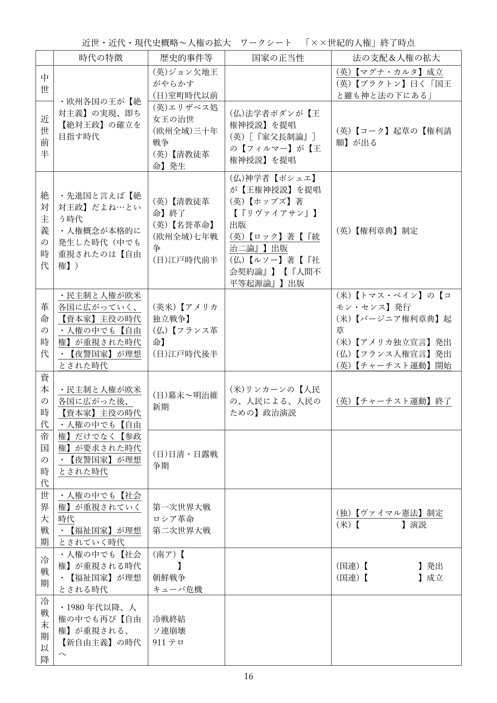
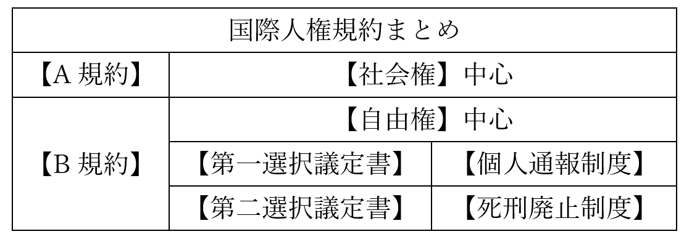
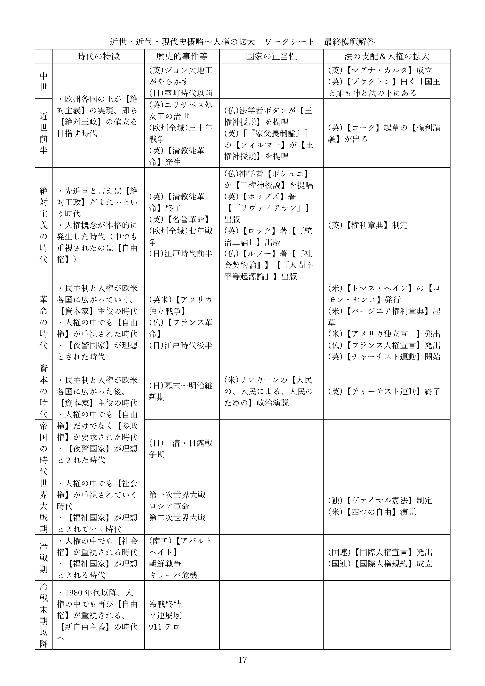

# 人権の拡大  
  
※令和六年八月に本ページの内容を全面改訂しました。授業動画は改訂前のものです。改訂後の資料を使った授業動画は現在作成中です  
  
## ●授業動画一覧＆問題集リンク  
  
|問題集|[ウェブサイト](https://teacheramesaka.github.io/hsworkbookcivics/tag/pol01_05/)|  
|:----:|:----:|
|人権の拡大1／イングランド王国|[YouTube](https://youtu.be/TjrS34UcC2g)|
|人権の拡大2／アメリカ合衆国|[YouTube](https://youtu.be/lqPTmOPNVoY)|
|人権の拡大3／フランス共和国|[YouTube](https://youtu.be/gf3W7ND39aI)|
|人権の拡大4／十九世紀まで|[YouTube](https://youtu.be/d8g-ndyUfYI)|
|人権の拡大5／第二次世界大戦まで|[YouTube](https://youtu.be/KCfxxhGSsyI)|
|人権の拡大6／戦後～現代（概要）|[YouTube](https://youtu.be/6AGT2Olg6Kk)|
|人権の拡大7／戦後～現代（個別の条約）|[YouTube](https://youtu.be/X63NJypuCD4)|
  
## ●概要
・現代的な国家に関する歴史的な経緯を、以下の順序で学習中である  
  
１：中世～現代が、どんな時代かを概観する（「近世・近代・現代史概略」の前半）  
２：近世後半～現代の、各時代の特徴を概観する（「近世・近代・現代史概略」の後半）  
３：絶対主義の時代～現代を、国家の正当性という側面から見る（「国家の正当性の原理」）  
４：中世～現代を、法という側面から見る（「法の支配と法治主義」）  
５：中世～現代を、人権という側面から見る（「人権の拡大」）  
  
・本節は５。即ち、「中世～現代を、人権という側面から見る」である  
⇒現代的な国家はよく、「民主主義国家」であると言われる。しかし既に見たように、現代の「民主主義国家」は、民主主義一点突破で出来ているわけではない。人権、自由主義、立憲主義といった要素がくっついている。今回は、「人権」という考え方がどのように広がり、現代的な国家に欠かせない要素になっていったのかを見ていこう  
  
※本節の完了と共に、ワークシートも完成する。頑張ろう！  
  
## ●中世から近世に於ける人権の拡大  
・英米仏の人権文書を軸に、中世からフランス革命にかけての人権の拡大を概観する  
  
### ○中世～絶対主義の時代／イギリス　をやる前の問題演習  
・この項で出てくる重要単語は全て、これまでの授業で一回はやったものである  
※物によっては三回やった  
・なので普通にやってもつまらないので、問題にしてみた  
  
**～ここから問題～**  
問１：以下の事件・人権関連文書を、起きた順（発出された順）に並べ替えよ  
①清教徒革命　　②権利請願　　③権利章典　　④マグナ・カルタ（大憲章）　　⑤名誉革命  
  
**問２：『統治二論』について、適切なものを二つ選べ**  
①ジョン・ロックの代表作である  
②トマス・ホッブズの代表作である  
③清教徒革命を正当化した書籍として重要である  
④名誉革命を正当化した書籍として重要である  
～ここまで問題（このすぐ後に模範回答と解説）～  
  

<b>問１模範回答（クリック・タップすると出てきます）</b>

④⇒②⇒①⇒⑤⇒③

<b>問２模範回答（クリック・タップすると出てきます）</b>

①、④

  
### ○中世～絶対主義の時代／イギリス
・以下、先の問題演習で万が一「全然覚えてない…やった記憶がない…」となった人向け解説  
※ちゃんと覚えてた人は、次の項「アメリカ合衆国」まで飛ばして大丈夫です  
  
**基本の流れ：【マグナ・カルタ】⇒【権利請願】⇒【清教徒革命】⇒【名誉革命】⇒【権利章典】、【『統治二論』】**  
  
**・【マグナ・カルタ（大憲章）】**  
⇒歴代イングランド王の中でも“暴君”の代名詞とされるジョン欠地王に、貴族らが認めさせたもの。議会の承諾なしの課税や法的根拠のない逮捕の禁止等が記されている。イギリスの「王や政府の権力を、法や議会で制限する」伝統の代表であり、結果的に、「議会主権」「人権保障」「法の支配」といった考え方を柱とする現代イギリス政治の源流となった  
※「国王と雖も神と法の下にある」のヘンリー・ド・【ブラクトン】はこの時代の人  
  
**・【権利請願】**  
⇒暴走・失政・敗北を繰り返した“殉教王”チャールズ一世に議会が提出したもの。法学者のエドワード・【コーク】が起草。内容としてはマグナ・カルタとほぼ同じ  
  
**・【清教徒革命】**  
⇒ピューリタン革命とも。「王の圧政に対する抵抗」とも言える事件であり、人権保護の記念碑的事件と言える。無論、手放しで褒められるような事件ではないが…クロムウェル独裁やらアイルランドでの虐殺やらが発生するし……なお、社会契約説でやったトマス・ホッブズの『リヴァイアサン』が出たのはこの混乱期である  
  
**・【名誉革命】**  
⇒こちらも「王の圧政に対する抵抗」と言える事件であり、また清教徒革命からの混乱にけりをつけた事件。やはり手放しで褒められるような事件ではない（そもそも無血での革命に成功したから名誉なことだ、名誉革命だ、って言ってるのがほぼ嘘）が、人権保護の記念碑的事件とも言える  
  
**・【権利章典】**  
⇒名誉革命を受け、新王ウィリアム三世の承認を得て認められたもの。議会主権が明記されたもので、現代でもイギリス不文憲法の中心になっている文書。人権面でも、信教の自由、財産権の保障など、現代の人権保障に直接繋がる内容が整備されている  
  
**・【『統治二論（市民政府二論）』】**  
⇒ジョン・【ロック】の代表作。彼の社会契約説が述べられているのみならず、名誉革命を正当化した著作という意味でも重要  
  

  
ここまでのまとめ：人権の拡大　中世～絶対主義の時代／イギリス

  <table class="rights-chronology-table">
    <thead>
      <tr>
        <th class="era-col"></th>
        <th class="country-col">イギリス</th>
        <th class="country-col">アメリカ</th>
        <th class="country-col">フランス</th>
      </tr>
    </thead>
    <tbody>
      <tr class="middle-row">
        <th class="era-col">中 世</th>
        <td>【マグナ・カルタ】 （【大憲章】）</td>
        <td></td>
        <td></td>
      </tr>
      <tr>
        <th class="era-col" rowspan="2">近 世 前 半</th>
        <td>【権利請願】 ⇒起草者は法学者のエドワード・【コーク】</td>
        <td></td>
        <td></td>
      </tr>
      <tr class="middle-row">
        <td>【清教徒革命】（開始）</td>
        <td></td>
        <td></td>
      </tr>
      <tr>
        <th class="era-col" rowspan="5">絶 対 主 義 の 時 代</th>
        <td>【清教徒革命】（終了）</td>
        <td></td>
        <td></td>
      </tr>
      <tr class="middle-row">
        <td>【名誉革命】</td>
        <td></td>
        <td></td>
      </tr>
      <tr class="middle-row">
        <td>【権利章典】</td>
        <td></td>
        <td></td>
      </tr>
      <tr>
        <td class="compact">【『統治二論』】 （【『市民政府二論』】） ⇒著者はジョン・【ロック】</td>
        <td></td>
        <td></td>
      </tr>
    </tbody>
  </table>

  
### ○革命の時代／アメリカ  
・ここからは、単なる「王権の制限」の話ではなくなってくる  
⇒イングランド王国（イギリス）のマグナ・カルタ、権利請願、権利章典等々は、結局、やっている事は「王の権利を議会と法で制限する」である。勿論、それが結果的には人権保障に繋がるのだが、日本国憲法が言う「基本的人権」的な発想との間にはやはり、大きな差がある  
  
・「基本的人権」的な発想が本格的に出てくるのが、実は、【アメリカ独立戦争】である  
⇒現代的な民主主義国家がよく言う、「人は生まれながらに権利を持っている」「政府はその権利を守るために存在する」…的な考え方が前面に出てくるのが、この事件なのである  
  
・ここで、アメリカ独立戦争に至る年表をもう一度確認しておこう  
  

  

<table class="chronology-table">
  <tr>
    <th></th>
    <th>西暦</th>
    <th>政経関係の世界史</th>
    <th>日本で言うと…</th>
    <th>時代の雰囲気</th>
  </tr>
  <tr>
    <th rowspan="6">近世前半</th>
    <td>1600</td>
    <td></td>
    <td>関ヶ原の戦い</td>
    <td rowspan="6">「鉄砲も大砲もある、でも甲冑武者もいるし槍も刀もある」時代</td>
  </tr>
  <tr>
    <td>1603</td>
    <td>“処女王”エリザベス一世、死去</td>
    <td></td>
  </tr>
  <tr>
    <td>1623</td>
    <td></td>
    <td>三代将軍家光、征夷大将軍就任</td>
  </tr>
  <tr>
    <td>1637-1638</td>
    <td></td>
    <td>島原の乱</td>
  </tr>
  <tr>
    <td>1642</td>
    <td>清教徒革命（イングランド内戦）開始</td>
    <td></td>
  </tr>
  <tr>
    <td>1649</td>
    <td>“殉教王”チャールズ一世、処刑</td>
    <td></td>
  </tr>
  <tr>
    <th rowspan="7">絶対主義の時代</th>
    <td>1651</td>
    <td></td>
    <td>三代将軍家光、死去</td>
    <td></td>
  </tr>
  <tr>
    <td>1680</td>
    <td></td>
    <td>五代将軍綱吉、征夷大将軍就任 ※生類憐みの令の人</td>
    <td rowspan="4">日本：「戦国時代っぽさ」が消え、「江戸時代っぽい」時代へ 欧州：甲冑や槍が戦場から消え始める</td>
  </tr>
  <tr>
    <td>1688</td>
    <td>名誉革命</td>
    <td></td>
  </tr>
  <tr>
    <td>1709</td>
    <td></td>
    <td>五代将軍綱吉、死去</td>
  </tr>
  <tr>
    <td>1716</td>
    <td></td>
    <td>八代将軍吉宗、征夷大将軍就任 ※享保の改革の人</td>
  </tr>
  <tr>
    <td>1751</td>
    <td></td>
    <td>八代将軍吉宗、死去</td>
    <td rowspan="5">欧州は「兵隊は甲冑を着なくなり槍も持たなくなり、代わりに軍服を着て（銃剣付の）鉄砲を持つ」時代に</td>
  </tr>
  <tr>
    <td>1756-1763</td>
    <td>七年戦争</td>
    <td></td>
  </tr>
  <tr>
    <th rowspan="3">革命の時代</th>
    <td>1775-1783</td>
    <td>アメリカ独立戦争</td>
    <td></td>
  </tr>
  <tr>
    <td>1787-1793</td>
    <td></td>
    <td>寛政の改革</td>
  </tr>
  <tr>
    <td>1789-1815</td>
    <td>フランス革命＆ナポレオン戦争</td>
    <td></td>
  </tr>
</table>

  
⇒日本で言えば江戸時代中盤、八代将軍吉宗が死んですぐに起きたのが七年戦争。欧州全域を巻き込んだ大戦争である。イギリスはこの戦争で勝ちはしたものの借金地獄に陥り、返済の為、北アメリカに持っていた植民地に重税を課し、これに反発した植民地が反乱を起こし…結果、アメリカ独立戦争が発生する  
  
・何でもそうだが、特に反乱に於いては、思想的な裏付けが非常に重要である  
⇒人間、「偉い人に逆らう」は「悪い事」と認識するもので…反乱というのはなかなか成功させづらい。逆に言えば、「偉い人に逆らうのはいい事なんだ！」という裏付けがあると、反乱は一気に成功させやすくなる  
  
※共産主義に基づく反乱が強いのもこれである。共産主義に於いては「貧乏な一般庶民を虐める金持ちを殺すのは正義！」になるし、偉い人は大体金持ちな訳で…  
  
・アメリカ独立戦争の初期に於いては、【コモン・センス】が思想的な裏付けとなった  
⇒アメリカ独立戦争が始まってすぐ、【トマス・ペイン】が発行した、一種のパンフレット。独立戦争初期には他にも、「代表なくして課税なし」という標語があった  
  
・コモン・センスの発行と流行もあり、アメリカ側は徐々に、独立を志向し始める  
⇒コモン・センスの発行と流行までは、アメリカ側も「もうイギリスとはやっていけん！」「独立だ！」という人は非常に少なかった。反乱によってイギリス本国政府にアメリカ人の不満（重税）を理解してもらいたい、最終的にはイギリス本国と和解したい…ぐらいの意識の人が大勢であった。しかしアメリカ側は徐々に、イギリス本国政府との決別、そして独立へと傾いていく  
  
・では、イギリス本国政府に対する反乱と独立を、何を以て正当化するのか？   
⇒これが、人権であった。もっと言えば、現代的な民主主義国家が言うような「人権」、例えば日本国憲法に書いてある「基本的人権」的な発想、これによってアメリカ独立を正当化しようとしたのである  
  
・その正当化の第一歩として、【バージニア権利章典】を挙げる事ができよう  
⇒独立戦争中、バージニア州で起草された文書である。後のバージニア州憲法（地方分権が著しいアメリカ合衆国では、州ごとに憲法があり、議会があり、軍がある）にも収録された。その第一条には「全ての人は生まれながらにして等しく自由で独立しており、一定の生来の権利を有している」とあり、高校の政治経済や公共の授業では、「【天賦人権思想】を明文化した初の法的文書」として登場する  
  
※天賦人権思想とは、「人権とは、国や王によって授与されるものではない」「人は誰であれ、生まれながらに人権を持っている」という思想。【自然権】という発想に由来する。日本国憲法が言う「基本的人権」も、基本的には天賦人権的な発想で書かれている  
  
・一方、アメリカ独立の正当化の決定版は、【アメリカ独立宣言】である  
⇒独立戦争中、トマス・ジェファーソン（後の第三代アメリカ合衆国大統領）が起草した文書。イギリス植民地の中でも、北米大陸のいわゆる「十三植民地」の独立宣言である。その理屈は「人間には、平等、自由、幸福追求といった基本的人権がある」「それ故植民地は本国の暴政に抵抗し独立する」となっている。即ち、天賦人権思想を基盤に、基本的人権を保障する為にアメリカは独立する…という論理構造になっている  
  
・こうしてアメリカ独立戦争は、イギリス思想の影響を受けつつも、「人権」という概念をより強化した  
⇒例えばアメリカ独立宣言は、明らかにジョン・【ロック】の『統治二論（市民政府二論）』の影響が強い文書である。しかし一方で、独立宣言は、ロックのように自然状態とか社会契約とか委託契約違反とか、そういう回りくどい事を言っていない。「人は誰しも基本的人権を持ってるんだから、人権侵害するような政府に反乱を起こすのは正当」と、とにかく「人権」を前面に押し出している  
  
※尚、そうは言っても、この時期の欧米人の言う「人権」には注意が必要である。この時期の欧米に於いては、少なくとも現代的な意味での「人権」は、非キリスト教徒には無かった。勿論、白人以外の人種にも無かったし、何なら、子供や女性にも無かった  
  
※だから独立後のアメリカ合衆国にも当然、黒人奴隷はいる。インディアンを皆殺し寸前まで追い込むのはむしろ、アメリカ独立後が本番である。何なら1900年前後のフィリピン戦争では、アメリカ本国の新聞に「我がアメリカ軍は、フィリピン人とあれば男も女も子供も全員、区別なく殺しています！」という旨の記事が書かれている。自国軍の蛮行の告発としてこれを書く記事もあったが、一方で、「我が軍は“文明国による非文明国への、当然の懲罰”をちゃんとやってますよ」という趣旨で書く記事も、当たり前に存在した  
  

  
<b>～またまたこの教員は嘘ばっかり、と言われそうなので一応、当時の記事を～（クリック・タップして雑談を表示）</b>

  

The present war is no bloodless, fake opera bouffe engagement; our men have been relentless, having killed to exterminate men, women, children, prisoners and captives, active insurgents and suspected people from lads of ten up, an idea prevailing that the Filipino as such was little better than a dog, a noisome reptile in some instances, whose best disposition was the rubbish heap. Our soldiers have pumped salt water into men to “make them talk,” have taken prisoners people who held up their hands and peacefully surrendered, and an hour later, without an atom of evidence to show that they were even insurrectors, stood them on a bridge and shot down one by one, to drop into the water below and float down, as examples to those who found their bullet-loaded corpses. It is not civilised warfare, but we are not dealing with a civilised people. The only thing they know and fear is force, violence and brutality, and we give it to them.（Philadelphia Public Ledger紙のマニラ特派員記事。Bruce Herald紙の1902年5月6日の記事に転載されたものの孫引き） 
 
（以下拙訳） 
 
今回の戦争は、流血の無い、茶番めいた喜劇ではない。我が軍は容赦なく、男、女、子供、捕虜、活動中の反乱分子、そして十歳ほどの少年に至るまで、疑わしい者全てを殲滅している。 
 
フィリピン人という存在は犬とほとんど変わらない…場合によっては不快な爬虫類であり、その最良の行き先は、ゴミ捨て場である。 
 
我が軍は、フィリピン人に「白状させる」べく塩水を無理矢理流し込み、両手を挙げて平和的に降伏した人々を捕虜とした。彼らが反乱分子であると示す証拠は何も無かったが、それはそれとして一時間後、彼らを橋の上に立たせ、一人ずつ射殺した。その死体は水面に落ちて川を流れ下り、見せしめとなった。 
 
これは文明的な戦争ではない。だが、我々が相手としているのは文明的な人々ではないのだ。彼らが知り、恐れるのは力と暴力と残虐さだけであり、我々はそれを彼らに与えている。 
 
<b>～第一次世界大戦の十年前でもこんなもんですよ～</b>
  

  

  
ここまでのまとめ：人権の拡大　革命の時代／アメリカ

  <table class="rights-chronology-table">
    <thead>
      <tr>
        <th class="era-col"></th>
        <th class="country-col">イギリス</th>
        <th class="country-col">アメリカ</th>
        <th class="country-col">フランス</th>
      </tr>
    </thead>
    <tbody>
      <tr class="middle-row">
        <th class="era-col">中 世</th>
        <td>【マグナ・カルタ】 （【大憲章】）</td>
        <td></td>
        <td></td>
      </tr>
      <tr>
        <th class="era-col" rowspan="2">近 世 前 半</th>
        <td>【権利請願】 ⇒起草者は法学者のエドワード・【コーク】</td>
        <td></td>
        <td></td>
      </tr>
      <tr class="middle-row">
        <td>【清教徒革命】（開始）</td>
        <td></td>
        <td></td>
      </tr>
      <tr>
        <th class="era-col" rowspan="5">絶 対 主 義 の 時 代</th>
        <td>【清教徒革命】（終了）</td>
        <td></td>
        <td></td>
      </tr>
      <tr class="middle-row">
        <td>【名誉革命】</td>
        <td></td>
        <td></td>
      </tr>
      <tr class="middle-row">
        <td>【権利章典】</td>
        <td></td>
        <td></td>
      </tr>
      <tr>
        <td class="compact">【『統治二論』】 （【『市民政府二論』】） ⇒著者はジョン・【ロック】</td>
        <td></td>
        <td></td>
      </tr>
      <tr class="middle-row">
        <td>七年戦争</td>
        <td>七年戦争</td>
        <td>七年戦争</td>
      </tr>
      <tr>
        <th class="era-col" rowspan="4">革 命 の 時 代</th>
        <td></td>
        <td>【アメリカ独立戦争】</td>
        <td></td>
      </tr>
      <tr>
        <td></td>
        <td>【コモン・センス】 ⇒著者は【トマス・ペイン】</td>
        <td></td>
      </tr>
      <tr>
        <td></td>
        <td class="compact">【バージニア権利章典】 ⇒【自然権】思想に由来する【天賦人権思想】を記した初の法的文書</td>
        <td class="compact"></td>
      </tr>
      <tr class="middle-row">
        <td></td>
        <td>【アメリカ独立宣言】</td>
        <td></td>
      </tr>
    </tbody>
  </table>

### ○革命の時代／フランス  
・アメリカ独立戦争は、人権という概念を発展させたが、欧米全体に浸透させはしなかった  
⇒「近世・近代・現代史概略」で既に見た通りである。名誉革命によって現代的な民主主義国家の原形が完成し、アメリカ独立戦争によって現代まで続く民主主義国家が成立したが、「民主主義」や「人権」は欧米の流行にはならなかった。流行になるのは、【フランス革命】とナポレオン戦争の後である  
  
・よく知られているように、フランス革命は、【自由・平等・博愛】という理念を掲げていた  
⇒言うまでもなく、「掲げていた」というだけで、フランス革命の現実とは別の話である。既に「近世・近代・現代史概略」で見たように、実際には大変な事になった。とは言え、そういう理念を掲げていたのも事実ではある  
  
・フランス革命初期、【フランス人権宣言】が作られたのは、上記の理念に沿ったものであった  
⇒アメリカ独立戦争の英雄でもあるラ＝ファイエット侯マリー＝ジョゼフらの案をもとに、フランス革命初期の国民議会で採択された。正式名称は【人間および市民の権利の宣言】だが、大抵はフランス人権宣言と呼ばれる  
  
・ここで注目すべきなのは、正式名称が「人間および市民の権利の宣言」になっている点である  
⇒「フランス人権宣言」と言うと単なる「フランス人の権利」っぽいが、そうではなく、少なくとも理念上は、「人間」や「市民」であれば誰しもが「権利」、即ち人権を持つ、と宣言した文書なのである  
  
※天賦人権思想的な、「人は誰しも、生まれながらに人権を持つ」というような話は、アメリカ独立宣言にもある。ただ、アメリカ独立宣言はあくまで、反乱と独立の正当化に「人権」を使っている文書である。一方、フランス人権宣言は、「これからの国家は人権を保障しなくてはならないし、その為には、こういう国家であらねばならない」と規定する文書であった  
  
※尚、「人は誰しも、生まれながらに人権を持つ」と言いつつ、実際には白人・キリスト教徒・成人男性以外には…と言うのは、アメリカ独立宣言の項で話した通りである  
  
・フランス人権宣言の主な特徴は、以下の通りである  
  
>１：［自由権と平等権の確認］  
>※第一条「人間は自由で権利に於いて平等」  
  
⇒作られた時代が時代なので、やはり、自由権を重視している  
  
>２：【人権保障と権力分立の主張】、国民主権の確認  
>※第三条「すべての主権の原理は、本質的に国民に存する」  
>※第十六条「いかなる社会であれ、権利の保障が確保されておらず、また権力の分立が定められていない社会には、憲法はない」  
  
⇒現代の民主主義国家は、民主主義（最終的には多数決で物事を決めよう）だけで作られておらず、人権保障（人権は大事だよ）、自由主義（人権の中でも特に自由権が大事だよ）、立憲主義（政府の権限は憲法で決めます）、国民主権（国家の意志を最終的に決定するのは国民だよ）、権力分立（いわゆる三権分立等）といった思想とセットになっている。この”現代民主主義欲張りセット”は、フランス人権宣言には既に見られるのだ  
  
>３：【所有権の不可侵性の確認】  
>※第十七条「所有権は、神聖かつ不可侵の権利」  
  
⇒自由権と言っても色々あるが、この時代の自由権は「もっと自由に経済活動させろ」「もっと自由に金を儲けさせろ」といった意味での自由権が重視される。所有権（財産権）は、経済的な意味での自由権の中でも、特に重要な権利である  
  
※所有権（財産権）は、「自分の所有物は自分が好きなようにしてよい」という権利である。例えば、「自分で稼いだカネは自分の好きに使っていい」というような考え方である  
  

  
ここまでのまとめ：中世からフランス革命にかけての人権の拡大

  <table class="rights-chronology-table">
    <thead>
      <tr>
        <th class="era-col"></th>
        <th class="country-col">イギリス</th>
        <th class="country-col">アメリカ</th>
        <th class="country-col">フランス</th>
      </tr>
    </thead>
    <tbody>
      <tr class="middle-row">
        <th class="era-col">中 世</th>
        <td>【マグナ・カルタ】 （【大憲章】）</td>
        <td></td>
        <td></td>
      </tr>
      <tr>
        <th class="era-col" rowspan="2">近 世 前 半</th>
        <td>【権利請願】 ⇒起草者は法学者のエドワード・【コーク】</td>
        <td></td>
        <td></td>
      </tr>
      <tr class="middle-row">
        <td>【清教徒革命】（開始）</td>
        <td></td>
        <td></td>
      </tr>
      <tr>
        <th class="era-col" rowspan="5">絶 対 主 義 の 時 代</th>
        <td>【清教徒革命】（終了）</td>
        <td></td>
        <td></td>
      </tr>
      <tr class="middle-row">
        <td>【名誉革命】</td>
        <td></td>
        <td></td>
      </tr>
      <tr class="middle-row">
        <td>【権利章典】</td>
        <td></td>
        <td></td>
      </tr>
      <tr>
        <td class="compact">【『統治二論』】 （【『市民政府二論』】） ⇒著者はジョン・【ロック】</td>
        <td></td>
        <td></td>
      </tr>
      <tr class="middle-row">
        <td>七年戦争</td>
        <td>七年戦争</td>
        <td>七年戦争</td>
      </tr>
      <tr>
        <th class="era-col" rowspan="4">革 命 の 時 代</th>
        <td></td>
        <td>【アメリカ独立戦争】</td>
        <td>【フランス革命】 ⇒革命の精神は【自由・平等・博愛】</td>
      </tr>
      <tr>
        <td></td>
        <td>【コモン・センス】 ⇒著者は【トマス・ペイン】</td>
        <td></td>
      </tr>
      <tr>
        <td></td>
        <td class="compact">【バージニア権利章典】 ⇒【自然権】思想に由来する【天賦人権思想】を記した初の法的文書</td>
        <td class="compact">【フランス人権宣言】 （【人間および市民の権利の宣言】） ↓特徴↓ １：［自由権と平等権の確認］ ２：【人権保障と権力分立の主張】 ３：【所有権の不可侵性の確認】</td>
      </tr>
      <tr class="middle-row">
        <td></td>
        <td>【アメリカ独立宣言】</td>
        <td></td>
      </tr>
    </tbody>
  </table>

  
  
  
## ●近代に於ける人権の拡大  
### ○××世紀的人権一覧  
・既に見たように欧米全域に「人権」という概念が広がるのは、革命の時代後半以降である  
⇒フランス革命とナポレオン戦争によって、「民主主義」「自由主義」「人権」といった概念が欧米全域に広がっていく事になる  
  
・ただ、中学社会でも学習したように、「人権」にも色々な側面がある  
⇒大きく分けても「自由権」「参政権」「社会権」「平等権」「請求権」「新しい人権」…といった具合だった筈である  
  
・ナポレオン戦争後、「人権」が広まると言っても、人権の全ての側面が同時に実現した訳ではない  
⇒特に有名な【自由権】【参政権】【社会権】の実現時期について、まずは見ていこう  
  
|人権の側面|【自由権】|【参政権】|【社会権】|
|:----:|:----:|:----:|:----:|
|別名|［消極的権利］|［能動的権利］|［積極的権利］|
|別名その２|十八世紀的人権|十九世紀的人権|二十世紀的人権|
|国家への要求|国家は余計な事をするな|国家の意思決定に参加させろ|国家は生活を保障しろ|
|実現し始めた時期|絶対主義の時代～革命の時代|資本の時代～帝国の時代|世界大戦期|
|実現に関係する事件|【清教徒革命】 【名誉革命】 【アメリカ独立戦争】 【フランス革命】|【チャーチスト運動】|【ヴァイマル憲法】制定|
|同時期の有名な出来事||明治維新 日清戦争 日露戦争|第一次世界大戦 ロシア革命 第二次世界大戦|
  
### ○十八世紀的人権  
・既に見たように、人権はまず、市民革命を経る中で実現していった  
⇒市民革命は一般に、【清教徒革命】【名誉革命】【アメリカ独立戦争】【フランス革命】を指す  
  
・「人権」という概念が実現する当初に於いて、その意味するところは【自由権】であった  
⇒自由権は、「国家は余計な事をするな」という類の人権である。言い方を変えれば、「政府は黙って座ってろ」「俺達国民を自由にしろ」である。このような特性から、自由権は特に［消極的権利］と呼ばれる事もある  
  
・自由権と言っても色々あるが、この時代の自由権は特に、経済的自由を志向するものであった  
⇒即ち、「もっと自由に経済活動させろ」「もっと自由に金を儲けさせろ」という意味での「俺達国民を自由にしろ」が重視されたのである。フランス人権宣言で所有権（財産権）が神聖不可侵とされているのは、つまりそういう事と言える  
  
※この時代…特にフランス革命後の時代を主導したのが資本家層であった事実は、自由権重視、特に経済的自由重視の風潮と無関係ではない  
  
・尚、自由権は「十八世紀的人権」と呼ばれる事もある  
⇒「近世・近代・現代史概略」で触れた通り、市民革命が起きた時期を、政経の教科書や参考書では「十八世紀」と表現する事が多い。これもあってか、市民革命期に確立した自由権を「十八世紀的人権」と呼ぶ事もある  
  
### ○十九世紀的人権  
・既に見たように、自由権重視、資本家主役の社会が生んだ歪みは、【参政権】獲得運動を招来した  
⇒「近世・近代・現代史概略」で見た通りである。資本家（会社の社長等）層の言う「自由」とは、労働者を一日に十四時間働かせる「自由」であったり、貧乏人は選挙に行かせない「自由」であったりした。その反動として起きたのが、参政権獲得運動だった訳である  
  
※革命の時代や資本の時代は、「民主主義国家」であっても、選挙権は金持ちにしかないのが普通であった。アメリカ合衆国憲法の起草者の一人ガバヌーア・モリスは、貧乏な一般庶民を「無知で依存的な者」であるとし、「公共の利益を任せるには信頼できない」とはっきり言っている。要するに、“貧乏人には政治はできない”と言っているのだが、当時はこれが普通の感覚であった  
  
・こうして、各国で参政権獲得運動が起こるのである  
⇒イギリス【チャーチスト運動】は、政治経済や公共の授業では、「最初期の参政権獲得運動」かつ「参政権獲得運動の代表例」として扱われる。これに限らず、特に資本の時代から帝国の時代にかけては、各国で参政権獲得運動が盛んに行われた  
  
・尚、参政権は、［能動的権利］と称される事もある  
⇒参政権は、「国家の意思決定に参加させろ」という類の人権である。国家の運営に能動的に参加する権利、という訳である  
  
・同様に、参政権は、「十九世紀的人権」と称される事もある  
⇒チャーチスト運動は革命の時代末期には始まっているし、「革命の時代」「資本の時代」「帝国の時代」を三つ合わせて「長い十九世紀」と呼ぶ事も多い。そう考えれば、参政権をこう呼ぶのも妥当と言えるだろう  
  
※尚、ここで言っている「参政権獲得運動」は「（成年）男子普通選挙運動」、つまり、「成人男性なら誰でも選挙に行けるようにしろ運動」である。女子選挙権とかそっちまで話を広げると色々ややこしくなるので、「資本の時代から帝国の時代にかけては男子普通選挙運動が激しかったよ」「世界大戦期以降、女子普通選挙も実現する国が増えてくるよ」という風に覚えておけばそれでよい  
  
※え？　何で女子選挙権の話までするとややこしくなるかって？　だって、女子選挙権運動家が、男子普通選挙権運動に対して「貧乏なオッサンに選挙権とかありえないでしょ（笑）」とやって大喧嘩になったとか、そういう話がいっぱいあるので…  
  
### ○二十世紀的人権  
・既に見たように、世界大戦期に入ると、【社会権】が流行となる  
⇒「近世・近代・現代史概略」で見た通りである。様々な要因があって、世界大戦期から冷戦期にかけて、「自由権を多少制限してでも社会権を重視しよう」という流行が出てくる。国民の自由を保障する「何もしない」政府よりも、「国民を幸せにしてくれる政府」「“みんな”を幸せにしてくれる政府」が要求される、そういう流行である  
  
・「社会権重視」という流行が広がった要因を、改めて、二つぐらい挙げておこう  
  
風潮１：労働者を虐め過ぎると革命が起きる、という実例が出てきた  
⇒ロシア革命。「“労働者を一日に十四時間働かせる自由”だって自由権だ！」とかやってたら反乱が起きて金持ちは皆殺しにされる…という認識が先進諸国に広がった  
  
風潮２：「国が、企業や個人の活動に介入して、困っている人を救っていこう」という発想が生まれる  
⇒世界大戦期に起きた様々な事件が、この発想を作った。代表例としては、上記のロシア革命（金持ちに好き勝手させると反乱起きて国が壊れる）、世界恐慌（金持ちに自由に経済活動させてたら世界中が大不況になった）、世界大戦（金持ちも貧乏人も同じ軍隊で戦い、仲間意識ができた）あたりが挙がる  
  
・社会権実現の画期としては、【ヴァイマル憲法】や日本国憲法が挙がる  
⇒前者は第一次世界大戦直後のドイツ国で制定されたもので、「社会権が書いてある憲法」として最初期のものである。後者は第二次世界大戦直後の制定で、時代の流行を反映して、自由権・参政権のみならず社会権も盛り込んだ人権全部盛り憲法である  
  
・尚、社会権は［積極的権利］と呼ばれる事もある  
⇒社会権は、「国家は国民の生活を保障しろ」という類の人権である。言い方を変えれば、「政府は黙って座ってないで立て」「俺達国民を助けろ」という、自由権とは真逆の、積極性の強い人権である  
  
・同様に、社会権は「二十世紀的人権」と呼ばれる事もある  
⇒社会権は、世界大戦期から流行が始まり、冷戦末期ぐらいまでは流行していた。そして歴史学では、1914年（第一次世界大戦開幕）から1991年（ソ連崩壊と冷戦の完全終結）を「短い二十世紀」と呼ぶ事もある。…と考えれば、社会権を「二十世紀的人権」と呼ぶのもあながち間違いではない  
  
  
  
## ●戦後～現代に於ける人権の拡大  
### 「戦後」の原型  
・アメリカ合衆国は、世界大戦期に入るまで、国際政治での存在感は皆無に近い国である  
・これは世界大戦期に入ってからもあまり変わらず、第二次世界大戦でも初期は脇役である  
⇒これは要するに、かつての米国は、他国の政治にあまり介入しなかったという事である  
  
・しかし第二次世界大戦後期、アメリカ合衆国は国際政治の主役となる  
・そして戦後の冷戦を通して、アメリカ合衆国は世界を支配する覇権国と言える存在となっていく  
⇒これは言い方を変えると、世界大戦期末期以降の米国は、他国の政治に介入するようになった…という事である  
  
・では、世界大戦期末期以降の米国は、どのような大義名分で他国の政治に介入するようになったのか？  
・それは、「人権」の一言に集約される  
⇒言ってみれば米国は、外国に対し、「お前達の国家は人権を保障していない！」「野蛮だ！」「だから俺が“文明化”してやる！」という形で介入しているのである  
  
・この人権を大義名分にした他国への介入を宣言したものとして、1941年の演説がある  
・当時のアメリカ合衆国大統領、【F.D.ルーズベルト】の【四つの自由】演説である  
※アメリカ大統領はルーズベルトが二人いるので注意。戦間期にニューディール政策を行い、第二次世界大戦に参戦した（それこそアメリカ合衆国が第二次世界大戦に参戦したのは1941年である）のがフランクリン・デラノ・ルーズベルトである。一方、帝国の時代に大統領を務めたのは【セオドア・ルーズベルト】。米西戦争で軍を率いた海軍軍人であり、大統領となってからは棍棒外交と呼ばれる帝国主義政策でカリブ海をアメリカの支配下に置いた人物である  
  
・F.D.ルーズベルトの四つの自由演説は、既に起きていた第二次世界大戦への介入宣言であった  
・伝統的に、他国の政治・他国の戦争への介入を嫌うアメリカ国民へ、大戦への参加を宣言した演説である  
・その大義名分として掲げられたのが、「四つの自由」という、一種の人権であった  
  
・F.D.ルーズベルトが演説で述べた「四つの自由」は、以下の四つから構成されていた  
１：【言論と表現の自由】  
２：【信仰の自由】  
３：【欠乏からの自由】  
４：【恐怖からの自由】  
⇒四つの自由とは言うが、自由権だけで構成されている訳ではないので注意。１と２は明らかに自由権だが、３は要するに「餓えない権利」。つまり、「国は国民の生活に介入するな」の自由権ではなく、「多少国民の自由を制限してもいいから国民を助けろ」の社会権。４も「戦争など、生存を脅かされるという恐怖から逃れる権利」なので、社会権（もしくは社会権の中でも特に生存権と呼ばれるもの）である  
  
・この、有体に言えば「人権の為に戦争する」という方針は、戦後の米国へ受け継がれる  
⇒戦後の米国が起こした・介入した戦争は全て、「圧政に苦しむナントカ人を解放する」とか「ナントカ人の為の民主主義国家を作る」というような大義名分が使われている。要するに、「人権の為」である。まぁその割に、第二次世界大戦だけ見ても、都市部に原爆落としているが。何なら、都市を（ひいては民間人を）焼く能力に特化した新型爆弾(M69焼夷弾)を作って、日独の都市を焼き払ってもいる訳だが…  
  
### 戦後～現代に於ける人権の拡大　概要
  
|||
|:----:|:----:|
|1941年|F.D.ルーズベルトが【四つの自由】演説 （１：【言論と表現の自由】２：【信仰の自由】） （３：【欠乏からの自由】４：【恐怖からの自由】）|
|1948年|国際連合で【世界人権宣言】採択 南アフリカ連邦で【アパルトヘイト】開始|
|1966年|【国際人権規約】採択|
|1977年|【国際人権規約】発効|
  
・「人権の実現の為ならば、他国の政治への介入は正当化される」という考え方は国際連合へ持ち込まれた  
※…と言うか、F.D.ルーズベルトは、現代的な意味での「国際連合」を作った中心人物の一人である  
  
・その初期の成果として、【世界人権宣言】が挙げられる  
⇒［1948年］の第三回国連総会に於いて、全会一致で採択された  
⇒無論、「時代は人権保障。少なくとも自国民の人権は保障せねば…」という世界的な流れを受けてのものとも言える  
  
・この宣言は、戦後の人権保障の基準となった。ただ、宣言なので法的拘束力はなかった  
⇒実際、同年に南アフリカ連邦で【アパルトヘイト】が始まっている。これは南アフリカ国内で、白人が黒人を差別する事を公認する政策だった  
  
・世界人権宣言には法的拘束力はなく、アパルトヘイトのような政策を防止する力はなかった  
・故に、世界人権宣言に法的拘束力を持たせようという動きが出てくる  
・この潮流は、後に【国際人権規約】として結実する  
⇒これは、F.D.ルーズベルトの四つの自由演説以来の、「人権の実現の為ならば他国の政治に介入は正当化される」という考え方の具現だったとも、「時代は人権保障」という世界的な流れを受けてのものとも言える  
  


　第二次世界大戦後、「時代は人権保障」という世界的な流れが出てきたのは事実と言ってよいのか？  
　実際のところ、第二次世界大戦後も人種差別は続いたのは事実である。特に、人種差別の本場アメリカ合衆国（そもそもこの国は、白人移民が原住民をほぼ皆殺しにして作った国である）は顕著で、1956年まではバス車内に白人席と黒人席があり、黒人が白人席に座ると罰された。1967年までは、白人と黒人の結婚も非合法であった。その後も白人による差別は根強く残っており、現代アメリカで最も差別される人種はアジア人であるとよく言われる。  
　このような状況で、“第二次世界大戦後、時代は人権保障、という世界的な流れが出てきましたよ”と言われても信用できないと言われたらその通りではある。結局のところ、「人権」とは「他国の政治に介入する事を正当化する為の、ただの看板」でしかないのではないか、と言われるとあまり反論できない。  
　人権を看板にして他国の政治に介入すると言うのは、要するに、「お前達の国家は人権を保障していない！」「野蛮だ！」「だから俺が“文明化”してやる！」という話である。「それって、かつてアメリカ合衆国がアメリカ・インディアンをほぼ皆殺しにしてたのと一緒じゃないですか」「あの時も看板は“文明化”でしたよね」と言われると、反論はしづらいのである。  
　ただ一方で、先に挙げた史実は、逆の見方もできる。1956年からは、米国内のバスから白人席と黒人席がなくなったのである。1967年からは、白人と黒人の結婚が合法化されたのである。欧米人は百年以上に渡って他人種を家畜扱いしてきたのであって、それが第二次世界大戦後、急速に変わっていったと考える事もできる。  
　例えばイギリスは、かつてはアメリカ・インディアンに天然痘ウィルスのついた毛布を贈って喜んでいたような国である。そんな国でも、1948年に始まった南アフリカ連邦でのアパルトヘイトに対しては「時代的にもう、そういうのはマズいでしょ」という態度を採った。それが1961年の、南アフリカ連邦の英連邦離脱（すごくざっくり言うと、南アフリカ連邦はイギリスと極めて親密な関係もあったが、喧嘩別れした）にも繋がっている。  
　そう考えると、第二次世界大戦後、「時代は人権保障」という風潮が出てきた…と言ってもよい部分は間違いなくある。少なくとも、“人権”という看板はかつての“文明化”と違い、少数民族の消滅の正当化に使うのは難しい。  
<b>～本質は変わってなくても、多少なりともマシになってるよね、とは言えるかもしれない～</b>


  
・こうして、1966年に採択され、1977年に発効したのが【国際人権規約】である  
※「規約」と呼称されているが、要するに国際条約である。批准すれば当然、法的拘束力を持つ  
  

  
・この規約は【A規約】と【B規約】に分かれており、批准する場合は別々に批准する  
※つまり、B規約だけ批准してA規約は批准しない、みたいな事ができる  
  
・A規約は【社会権】が中心。正式名称「経済的・社会的及び文化的権利に関する国際規約」  
・B規約は【自由権】が中心。正式名称「市民的・政治的権利に関する国際規約」  
  
・A規約には一つ、B規約には二つ、【選択議定書】が附属する。この選択議定書の批准は任意である  
※A規約B規約共に批准するが、B規約選択議定書は一つも批准しない、とかもできるということ
  
※A規約B規約共に批准するが、B規約選択議定書は一つも批准しない、とかもできるということ  
  
・B規約の【第一選択議定書】は、【個人通報制度】である  
⇒B規約に記載の人権を侵害された場合、個人が国際連合自由権規約委員会へ通報できる  
・B規約の【第二選択議定書】は、【死刑制度廃止】である  
※この議定書を指して「死刑廃止条約」と呼ぶ場合もある  
※日本の場合、A規約B規約共に批准しているが、B規約の選択議定書は一切批准していない。また、A規約の一部は留保という形にしており、批准していない（休日の労働者への報酬支払等）  
  
・この後も、人権保障の枠組みは徐々に拡大していく事になる  
・個別の人権保障を実現する為の、様々な国際条約も結ばれていく  
※個別の国際条約の詳細については、すぐ後の「戦後（個別の人権保障条約）」にまとめたのでそちらで
  
  
  
### ○戦後（個別の人権保障条約）  
・前項で、戦後の人権保障の展開を、大きな流れで概観した  
・その際、【国際人権規約】という包括的な国際規約を見た  
・そして、「個別の人権保障を実現する為の、様々な国際条約も結ばれていく」と述べた  
・本項では、この個別的な人権保障条約を一つ一つ見ていく  
※国際条約は国際的な決まり事であり、国内法に優先する。その為、人権保障の国際条約を批准する事は、「我が国はこういう人権問題について、解決していかねばならないと考えております」と内外にアピールする事へも繋がる。そこで、各条約に日本がどう対応しているかも見ていく  
  
|条約概要|概説|日本の対応|
|:----:|:----:|:----:|
|【ジェノサイド条約】 1948年採択 1951年発効|・ジェノサイドを禁止する条約|・【未批准】|
|【難民条約】 1951年採択 1954年発効|・難民を保護する条約 ・但し【経済難民】は含まない ・いわゆる【ノン・ルフールマンの原則】の記述あり。難民の【追放及び送還を禁止】 ・【国連難民高等弁務官事務所(UNHCR)】はこの条約を基に活動|・1981年に批准 ・1982年に出入国管理及び難民認定法（いわゆる入管法）を改正|
|【人種差別撤廃条約】 1965年採択 1969年発効|・人種差別を撤廃する条約|・1995年に批准 ・1997年、北海道旧土人保護法をアイヌ文化振興法へ改正|
|【女子差別撤廃条約】 1979年採択 1981年発効|・女子差別を撤廃する条約 ・もしくは、男女同権を実現する条約|・［対応する法改正を行ってから批准］ ・1984年、［男女雇用機会均等法］を制定＆国籍法を改正⇒翌年、批准|
|【拷問等禁止条約】 1984年採択 1987年発効|・正式名称「拷問及び他の残虐な、非人道的な又は品位を傷つける取り扱い又は刑罰に関する条約」|・1999年批准|
|【子どもの権利条約】 1989年採択 1990年発効|・名前のまんま、子供（未成年）の権利を尊重しなさいという条約 ・子供を【権利を行使する主体】とする|・1994年に批准|
|【死刑廃止条約】|・要するに【国際人権規約】の【B規約】の【第二選択議定書】|・未批准|
|【障害者権利条約】 2006年採択 2008年発効|・障碍者の人権を保障しようという条約|・［対応する法改正を行ってから批准］ ・2011年、障害者基本法を改正 ・2013年、障害者差別解消法を制定 ・2014年に批准|
  
#### ・【ジェノサイド条約】1948年採択、1951年発効  
・世界人権宣言を採択した、第三回国連総会で採択された条約  
・読んで字の如く、ジェノサイドを禁止する条約。第二次世界大戦を受けてのもの。日本は【未批准】  
  
#### ・【難民条約】1951年採択、1954年発効  
・正式名称「難民の地位に関する条約」。読んで字の如く、難民を保護する条約  
・ここでいう難民とは、人種、宗教、政治的要素による迫害を理由に、国籍国にいられない者をいう  
⇒要するに【経済難民】は難民に含みませんよ、という事  

・この条約を批准した国は、難民に対し様々な権利を保障しなければならない。例えば…  
１：批准国は難民の【追放及び送還を禁止】される。いわゆる【ノン・ルフールマンの原則】  
２：批准国は、批准国へ難民が不法入国した、または不法滞在している事を理由に罰してはならない  

・また、この条約を基に難民保護と難民問題解決を国際的に執り行う組織も設立された  
⇒【国連難民高等弁務官事務所(UNHCR)】。名前から分かる通り、国際連合に所属する組織の一つである  

・日本は1981年に批准  
・また条約に対応すべく、1982年に出入国管理及び難民認定法（いわゆる入管法）を改正  
  
#### ・【人種差別撤廃条約】1965年採択、1969年発効  
・正式名称「あらゆる形態の人種差別の撤廃に関する国際条約」。人種差別を撤廃する条約  

・南アフリカ共和国のアパルトヘイトを念頭に置いて、あらゆる人種差別を撤廃する事を趣旨とした条約  
※南アフリカ連邦は、宗主国のイギリスすらアパルトヘイト政策を擁護してくれなかったので、1961年に完全独立して（英連邦から抜けて）南アフリカ共和国となった  

・日本は、1995年に批准。これを受け、1997年、北海道旧土人保護法をアイヌ文化振興法へ改正  
  
#### ・【女子差別撤廃条約】1979年採択、1981年発効  
・正式名称「女子に対するあらゆる形態の差別の撤廃に関する条約」  
・女子差別を撤廃する条約。もしくは、男女同権を実現する条約  
⇒例えば性による役割分担（男は外で働き、女は家を守る、みたいな）を否定する。法的な待遇が男女で違う事を否定する。そういうものを求める条約  

・日本は、［対応する法改正を行ってから批准した］  
※他の条約はだいたい批准⇒法改正だが、この条約は逆なので注意！  

・日本は［1984年］、［男女雇用機会均等法］を制定。また同年、［国籍法］を改正  
・そして［翌年］、批准した  
※国籍法はこの時、国籍の取得条件を父系血統主義から父母両系血統主義に変えている。要するに、この法改正までは「父親が日本人なら日本国籍を取れる。母親は日本人だが父親は外国人なら取れない」だった。これを「父親か母親どちらかが日本人なら日本国籍を取れる」に変えた  
  
#### ・【拷問等禁止条約】1984年採択、1987年発効  
・正式名称「拷問及び他の残虐な、非人道的な又は品位を傷つける取り扱い又は刑罰に関する条約」  
・正式名称を読んで分かるように、情報収集の為の拷問のみならず、非人道的な刑罰も禁止する  
・日本は［1999年］に批准している。法改正による対応は特にしていない  
  
#### ・【子どもの権利条約】1989年採択、1990年発効  
・正式名称「児童の権利に関する条約」  

・名前のまんま、子供（未成年）の権利を尊重しなさいという条約  
⇒子供は「義務を果たしていないから権利もない、よって子供に人権はない」とかやられやすい存在。んな訳ないでしょ子供も【権利を行使する主体】ですよ、という条約  

・日本は1994年に批准している。批准にあたって法改正による対応は必要ないと、政府が見解を出している  
  
#### ・【死刑廃止条約】  
・死刑廃止条約とは、要するに【国際人権規約】の【B規約】の【第二選択議定書】の事である  
※国際人権規約B規約第二選択議定書の事を「死刑廃止条約」という言い方で表現してくる場合もあるので、「え、B規約の選択議定書とは別にそんなんあったの…」とならないように注意  

・前述の通り、日本は未批准  
  
#### ・【障害者権利条約】2006年採択、2008年発効  
・正式名称「障害者の権利に関する条約」。そのまんま、障碍者の人権を保障しようという条約  

・日本は、［対応する法改正を行ってから批准］した  
※女子差別撤廃条約と同じ、法改正して状況を整えてから批准した条約。対応した法が二つあるのも同じ  

１：2011年、障害者基本法を改正（法自体は元からあったが、条約に合わせて改正した）  
２：2013年、障害者差別解消法を制定（障害者差別の禁止と解消を規定した法を制定）  
⇒この流れを受けて、2014年に批准  
  
#### さいごにひとこと
※これらの条約は、「批准しているからその国は人権を重視している」「批准していない国は人権を軽んじている」という風に、単純に考えない方がいい。例えばフランス共和国は死刑廃止条約を批准しているが、その分凶悪犯は大抵、現場で射殺してしまう。「それなら日本の方がましだわ、死刑廃止条約には参加してないけど」という意見は当然あり得るものである  
  

  