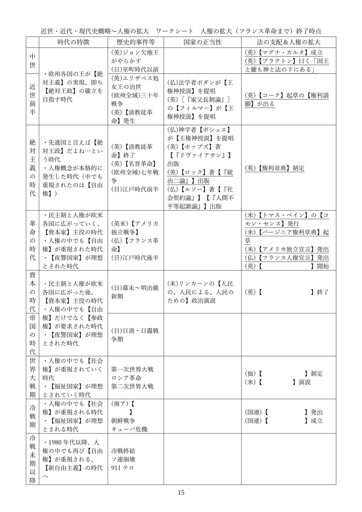

# 人権の拡大  
  
※令和六年八月に本ページの内容を全面改訂しました。授業動画は改訂前のものです。改訂後の資料を使った授業動画は現在作成中です  
  
## ●授業動画一覧＆問題集リンク  
  
|問題集|[ウェブサイト](https://teacheramesaka.github.io/hsworkbookcivics/tag/pol01_05/)|  
|:----:|:----:|
|人権の拡大1／イングランド王国|[YouTube](https://youtu.be/TjrS34UcC2g)|
|人権の拡大2／アメリカ合衆国|[YouTube](https://youtu.be/lqPTmOPNVoY)|
|人権の拡大3／フランス共和国|[YouTube](https://youtu.be/gf3W7ND39aI)|
|人権の拡大4／十九世紀まで|[YouTube](https://youtu.be/d8g-ndyUfYI)|
|人権の拡大5／第二次世界大戦まで|[YouTube](https://youtu.be/KCfxxhGSsyI)|
|人権の拡大6／戦後～現代（概要）|[YouTube](https://youtu.be/6AGT2Olg6Kk)|
|人権の拡大7／戦後～現代（個別の条約）|[YouTube](https://youtu.be/X63NJypuCD4)|
  
## ●概要
・現代的な国家に関する歴史的な経緯を、以下の順序で学習中である  
  
１：中世～現代が、どんな時代かを見る  
２：絶対主義の時代～現代を、国家の正当性という側面から見る  
３：中世～現代を、法という側面から見る  
４：中世～現代を、人権という側面から見る  
  
・まずは、英米仏の人権文書を軸に、中世からフランス革命にかけての人権の拡大を概観する  
  
## ●中世から近世に於ける人権の拡大  
・法の支配という概念を生んだイングランド王国、それを直接受け継いだアメリカ合衆国、そしてフランス革命によって民主主義と人権という概念を世界各国へ輸出したフランス共和国。この三ヶ国で、人権の保護という概念はどのように発展し獲得されたか、各国の人権文書を軸に概観する  
  
### ○イングランド王国　をやる前の問題演習  
・この項で出てくる重要単語は全て、これまでの授業で一回はやったものである  
※物によっては三回やった  
・なので普通にやってもつまらないので、問題にしてみた  
  
～ここから問題～  
問１：以下の事件・人権関連文書を、起きた順（発出された順）に並べ替えよ  
①清教徒革命　　②権利請願　　③権利章典　　④マグナ・カルタ（大憲章）　　⑤名誉革命  
  
問２：『統治二論』について、適切なものを二つ選べ  
①ジョン・ロックの代表作である  
②トマス・ホッブズの代表作である  
③清教徒革命を正当化した書籍として重要である  
④名誉革命を正当化した書籍として重要である  
～ここまで問題（このすぐ後に模範回答と解説）～  
  

問１模範回答（クリック・タップすると出てきます）

④⇒②⇒①⇒③⇒⑤

問２模範回答（クリック・タップすると出てきます）

①、④

  
### ○イングランド王国
・以下、先の問題演習で万が一「全然覚えてない…やった記憶がない…」となった人向け解説  
※ちゃんと覚えてた人は、次の項「アメリカ合衆国」まで飛ばして大丈夫です  
  
**基本の流れ：【マグナ・カルタ】⇒【権利請願】⇒【清教徒革命】⇒【名誉革命】⇒【権利章典】、【『統治二論』】**  
  
**・【マグナ・カルタ（大憲章）】**  
⇒歴代イングランド王の中でも“暴君”の代名詞とされるジョン欠地王に、貴族らが認めさせたもの。議会の承諾なしの課税や法的根拠のない逮捕の禁止等が記されている。イギリスの「王や政府の権力を、法や議会で制限する」伝統の代表であり、結果的に、「議会主権」「人権保障」「法の支配」といった考え方を柱とする現代イギリス政治の源流となった  
※「国王と雖も神と法の下にある」のヘンリー・ド・【ブラクトン】はこの時代の人  
  
**・【権利請願】**  
⇒暴走・失政・敗北を繰り返した“殉教王”チャールズ一世に議会が提出したもの。法学者のエドワード・【コーク】が起草。内容としてはマグナ・カルタとほぼ同じ  
  
**・【清教徒革命】**  
⇒ピューリタン革命とも。「王の圧政に対する抵抗」とも言える事件であり、人権保護の記念碑的事件と言える。無論、手放しで褒められるような事件ではないが…クロムウェル独裁やらアイルランドでの虐殺やらが発生するし……なお、社会契約説でやったトマス・ホッブズの『リヴァイアサン』が出たのはこの混乱期である  
  
**・【名誉革命】**  
⇒こちらも「王の圧政に対する抵抗」と言える事件であり、また清教徒革命からの混乱にけりをつけた事件。やはり手放しで褒められるような事件ではない（そもそも無血での革命に成功したから名誉なことだ、名誉革命だ、って言ってるのがほぼ嘘）が、人権保護の記念碑的事件とも言える  
  
**・【権利章典】**  
⇒名誉革命を受け、新王ウィリアム三世の承認を得て認められたもの。議会主権が明記されたもので、現代でもイギリス不文憲法の中心になっている文書。人権面でも、信教の自由、財産権の保障など、現代の人権保障に直接繋がる内容が整備されている  
  
**・【『統治二論（市民政府二論）』】**  
⇒ジョン・【ロック】の代表作。彼の社会契約説が述べられているのみならず、名誉革命を正当化した著作という意味でも重要  
  
### ○アメリカ合衆国  
・こちらは「近世・近代・現代時概略」で一回やったっきりなので、流れを復習してから解説に進む  
  
**基本の流れ：七年戦争⇒【アメリカ独立戦争】、【コモン・センス】⇒【バージニア権利章典】⇒【アメリカ独立宣言】**  
  
**・七年戦争**  
⇒欧州全域、更には欧州各国の植民地を巻き込んだ大戦争。プロイセン王国＋イギリスvs残りの欧州列強全部、みたいな戦争。勝利したイギリスは世界最強国家への道を歩み始めるが、一方で大赤字に陥った  
  
**・【アメリカ独立戦争】**  
⇒イギリスがアメリカに持つ植民地の中でも特に十三植民地と呼ばれる地域は、七年戦争以来の重税に反発。これに対し、本国は懲罰的な措置で対抗した。本国と十三植民地の対立は頂点に達し、ついに戦争となった。最終的に植民地側が勝利し、現代まで続くアメリカ合衆国が建国される事となる  
  
**・【コモン・センス】**  
⇒アメリカ独立戦争が始まってすぐ、【トマス・ペイン】が発行した、一種のパンフレット。アメリカ独立戦争初期の、思想的な裏付けとなった。独立戦争初期には他にも、「代表なくして課税なし」という標語があった  
  
**・【バージニア権利章典】**  
⇒独立戦争中、バージニア州で起草された文書。後のバージニア州憲法（地方分権が著しいアメリカ合衆国では、州ごとに憲法があり、議会があり、軍がある）にも収録された。その第一条には「全ての人は生まれながらにして等しく自由で独立しており、一定の生来の権利を有している」とあり、【天賦人権思想】を明文化した初の法的文書として重要とされる  
※天賦人権思想：人権とは、国や王によって授与されるものではない。人は誰であれ、生まれながらに人権を持っている、という思想。【自然権】という発想に由来する  
  
**・【アメリカ独立宣言】**  
⇒独立戦争中、トマス・ジェファーソン（後の第三代アメリカ合衆国大統領）が起草した文書。イギリス植民地の中でも、北米大陸のいわゆる「十三植民地」の独立宣言。その理屈は「人間には、平等、自由、幸福追求といった基本的人権がある」「それ故植民地は本国の暴政に抵抗し独立する」となっている。即ち、人権保障の観点からアメリカは独立する、という論理構造になっている。明らかにジョン・【ロック】の影響が強い  
  
### ○フランス共和国  
・仏国に於ける人権保護の展開とその文書については、以下の二つを抑えておけばよい  
・即ち、【フランス革命】と【フランス人権宣言】である  
・こちらも、「近世・近代・現代時概略」で一回やったきりなので、まず復習から始める  
  
|フランス王|フランスでは|他の国では|
|:----:|:----:|:----:|
|“太陽王”ルイ十四世|・むしろこの時代が絶対王政の完成期 ・戦争のやりすぎで、末期には国家財政が大赤字に|英：名誉革命と権利章典で絶対王政が崩れる|
|“最愛王”ルイ十五世|・戦争を繰り返すがだいたい負ける ・特に七年戦争では、大負けするわ植民地ほぼなくなるわ国家財政は破綻寸前だわで大変な事に|欧州全域：七年戦争|
|“末王”ルイ十六世|・アメリカ独立戦争に介入、国家財政が完全に破綻 ・反乱がフランス革命へ発展、処刑される|英米：アメリカ独立戦争|
  
・イングランドでは1688年の名誉革命と翌年の権利章典で絶対王政が完全に崩れた  
・フランス王国ではむしろ、この頃が絶対王政の完成期である  
・“太陽王”ルイ十四世は、特にその治世の前半、戦勝を重ね黄金時代を演出した  
・…が、後半ともなると、得るものの少ない戦争を長期に渡って繰り返し、国家財政は大赤字に陥った  
  
・太陽王は結局、「俺はめっちゃ戦争したけど真似したらいかん」との遺言を残して死去  
・次代のルイ十五世は、太陽王の遺言を無視して戦争を繰り返した  
・特に七年戦争の大敗は深刻で、息子が即位する頃には、国家財政は破綻寸前だった  
  
・その息子、ルイ十六世は即位後アメリカ独立戦争に介入。国家財政が完全に破綻する  
・この時代の国家が大赤字になると、もうひたすら重税をかけるしかない  
・多くの平民が重税に苦しむ一方、貴族は腐敗して使い物にならなかった  
  
・この状況で、平民の不満がついに爆発、反乱発生する  
・この反乱はフランス革命へ発展。この時唱えられた革命の精神が、【自由・平等・博愛】である  
※あくまで「唱えられた」というだけで、フランス革命の現実とは別の話である  
  
・フランス革命初期、ラ・ファイエット侯マリー＝ジョセフらが起草したのがフランス人権宣言である  
・正式名称は【人間および市民の権利の宣言】だが、大抵はフランス人権宣言と呼ばれる  
・この宣言は、どちらかと言うとロックの抵抗権の思想やアメリカ独立宣言の影響が強い  
  
・主な特徴は以下の通り  
１：［自由権と平等権の確認］  
※第一条「人間は自由で権利に於いて平等」  
２：【人権保障と権力分立の主張】  
※第十六条「いかなる社会であれ、権利の保障が確保されておらず、また権力の分立が定められていない社会には、憲法はない」  
３：【所有権の不可侵性の確認】  
※第十七条「所有権は、神聖かつ不可侵の権利」  
  

  
  
  
## ●近代に於ける人権の拡大  
### ○××世紀的人権一覧  
・フランス革命以降、欧州中に「人権」という概念が広がっていく  
・ただ、既に見たように、「人権」にも色々な側面がある  
・そして、全ての側面が同時に実現した訳ではない  
・特に有名な【自由権】【参政権】【社会権】の実現時期について、まずは見ていこう  
  
|人権の側面|【自由権】|【参政権】|【社会権】|
|:----:|:----:|:----:|:----:|
|別名|［消極的権利］|［能動的権利］|［積極的権利］|
|別名その２|十八世紀的人権|十九世紀的人権|二十世紀的人権|
|実現し始めた時期|絶対主義の時代～革命の時代|資本の時代～帝国の時代|世界大戦期|
|実現に関係する事件|【清教徒革命】 【名誉革命】 【アメリカ独立戦争】 【フランス革命】|【チャーチスト運動】|【ヴァイマル憲法】制定|
|同時期の有名な出来事||明治維新 日清戦争 日露戦争|第一次世界大戦 ロシア革命 第二次世界大戦|
  
### ○十八世紀的人権  
・人権はまず、市民革命を経る中で実現していった  
⇒市民革命は一般に、【清教徒革命】【名誉革命】【アメリカ独立戦争】【フランス革命】を指す  
  
・中でもフランス革命は、「欧州各国で人権が実現するようになった」という意味で重要である  
⇒清教徒革命、名誉革命、アメリカ独立戦争は外国へ波及しなかった。一方、フランス革命は欧州各国へ革命を輸出し、欧州各国では何らかの形で市民革命が起こった  
  
・フランス革命後の欧州社会を主導したのは、いわゆる資本家だった  
⇒資本家は、言い方を変えれば富裕市民層。つまり会社の社長とか工場長とかにあたる  
※フランス革命は、ちょうど産業革命の真っ最中に起きた事件である。そして産業革命と言えば、現代的な資本主義社会、つまり「皆どこかの会社の社員で、毎朝職場に出社して働き、給料を貰って生活する」社会を生んだ出来事である。だからこそ、フランス革命後の欧州社会を主導したのは資本家だった  
  
・そんな資本家が求めたのは、【自由権】（［消極的権利］）であった  
・こうして、【自由権】が重視され、獲得された  
⇒自由権と言っても色々あるが、この時代の自由権は「もっと自由に経済活動させろ」「もっと自由に金を儲けさせろ」といったものである。フランス人権宣言で所有権（財産権）が神聖不可侵とされているのは、つまりそういう事と言える  
  
※清教徒革命等も、「圧政から解放されて自由になる」という意味で自由権を求めていたと言える   
  
### ○十九世紀的人権  
・現代的な社会、即ち資本主義は、放っておくと金持ちはより金持ちに、貧乏人はより貧乏になっていく  
・また、富裕市民層が求めた自由とは、自分達資本家がいかに儲けるかという自由だった  
⇒そういう自由を「人権」「自由権」として全面的に認めると、当然、「労働者を一日に十四時間も働かせる自由」とか「労働者の選挙権を認めない自由」とかそういったものが横行するようになる  
  
・十九世紀は、この合わせ技で貧富の格差が拡大する時代であった  
・しかし労働者達は、自由権を制限しようとは考えなかった  
・代わりに、議会へ自分達の代表を送り込む事で、生活を改善させようと考えたのである  
⇒昔はどの国でも、金持ちにのみ選挙権を認めるのが普通であった  
  
・こうして、各国で【参政権】獲得運動が起こった  
⇒最初の参政権運動として有名なのが、イングランドの【チャーチスト運動】である。これに限らず、特に資本の時代から帝国の時代にかけては、各国で参政権獲得運動が盛んに行われた  
  
・【参政権】（［能動的権利］）が十九世紀的人権と呼ばれるのは、こういう事情がある  
・先進国では、資本の時代・帝国の時代を中心に男子普通選挙が実現していく事になる  
※男女普通選挙については、次の時代の課題となる  
  
### ○二十世紀的人権  
・資本・帝国の時代は、革命の時代から引き続き自由権を尊重しつつ、参政権も実現していく時代であった  
・しかし、参政権の具現たる（男子）普通選挙が実現しても、貧富の格差の問題はそのままであった  
  
・世界大戦期に入ると、いよいよ、「自由権を制限するのは仕方ない」という発想が出てくる  
風潮１：労働者を虐め過ぎると革命が起きる、という実例が出てきた  
⇒ロシア革命。「“労働者を一日に十四時間傍からせる自由”だって自由権だ！」とかやってたら反乱が起きて金持ちは皆殺しにされる…という認識が先進諸国に広がった  
風潮２：「国が、企業や個人の活動に介入して、困っている人を救っていこう」という発想が生まれる  
⇒世界大戦期に起きた様々な事件が、この発想を作った。代表例としては、上記のロシア革命（金持ちに好き勝手させると反乱起きて国が壊れる）、世界恐慌（金持ちに自由に経済活動させてたら世界中が大不況になった）、世界大戦（金持ちも貧乏人も同じ軍隊で戦い、仲間意識ができた）あたりが挙がる  
  
・こうして、「自由国家」よりもむしろ「福祉国家」が志向されるようになった  
・この福祉国家を実現する人権が、二十世紀的人権、即ち【社会権】（［積極的権利］）である  
  
・社会権実現の画期としては、1919年のドイツ国で制定された【ヴァイマル憲法】が挙がる  
・日本でも、1947年制定の日本国憲法において社会権が盛り込まれた  
⇒前者は史上初めて社会権が盛り込まれた憲法。また後者も、時代の流行を反映して、自由権・参政権のみならず社会権も盛り込まれた人権全部盛り憲法である  
  
  
  
## ●戦後～現代に於ける人権の拡大  
### 「戦後」の原型  
・アメリカ合衆国は、世界大戦期に入るまで、国際政治での存在感は皆無に近い国である  
・これは世界大戦期に入ってからもあまり変わらず、第二次世界大戦でも初期は脇役である  
⇒これは要するに、かつての米国は、他国の政治にあまり介入しなかったという事である  
  
・しかし第二次世界大戦後期、アメリカ合衆国は国際政治の主役となる  
・そして戦後の冷戦を通して、アメリカ合衆国は世界を支配する覇権国と言える存在となっていく  
⇒これは言い方を変えると、世界大戦期末期以降の米国は、他国の政治に介入するようになった…という事である  
  
・では、世界大戦期末期以降の米国は、どのような大義名分で他国の政治に介入するようになったのか？  
・それは、「人権」の一言に集約される  
⇒言ってみれば米国は、外国に対し、「お前達の国家は人権を保障していない！」「野蛮だ！」「だから俺が“文明化”してやる！」という形で介入しているのである  
  
・この人権を大義名分にした他国への介入を宣言したものとして、1941年の演説がある  
・当時のアメリカ合衆国大統領、【F.D.ルーズベルト】の【四つの自由】演説である  
※アメリカ大統領はルーズベルトが二人いるので注意。戦間期にニューディール政策を行い、第二次世界大戦に参戦した（それこそアメリカ合衆国が第二次世界大戦に参戦したのは1941年である）のがフランクリン・デラノ・ルーズベルトである。一方、帝国の時代に大統領を務めたのは【セオドア・ルーズベルト】。米西戦争で軍を率いた海軍軍人であり、大統領となってからは棍棒外交と呼ばれる帝国主義政策でカリブ海をアメリカの支配下に置いた人物である  
  
・F.D.ルーズベルトの四つの自由演説は、既に起きていた第二次世界大戦への介入宣言であった  
・伝統的に、他国の政治・他国の戦争への介入を嫌うアメリカ国民へ、大戦への参加を宣言した演説である  
・その大義名分として掲げられたのが、「四つの自由」という、一種の人権であった  
  
・F.D.ルーズベルトが演説で述べた「四つの自由」は、以下の四つから構成されていた  
１：【言論と表現の自由】  
２：【信仰の自由】  
３：【欠乏からの自由】  
４：【恐怖からの自由】  
⇒四つの自由とは言うが、自由権だけで構成されている訳ではないので注意。１と２は明らかに自由権だが、３は要するに「餓えない権利」。つまり、「国は国民の生活に介入するな」の自由権ではなく、「多少国民の自由を制限してもいいから国民を助けろ」の社会権。４も「戦争など、生存を脅かされるという恐怖から逃れる権利」なので、社会権（もしくは社会権の中でも特に生存権と呼ばれるもの）である  
  
・この、有体に言えば「人権の為に戦争する」という方針は、戦後の米国へ受け継がれる  
⇒戦後の米国が起こした・介入した戦争は全て、「圧政に苦しむナントカ人を解放する」とか「ナントカ人の為の民主主義国家を作る」というような大義名分が使われている。要するに、「人権の為」である。まぁその割に、第二次世界大戦だけ見ても、都市部に原爆落としているが。何なら、都市を（ひいては民間人を）焼く能力に特化した新型爆弾(M69焼夷弾)を作って、日独の都市を焼き払ってもいる訳だが…  
  
### 戦後～現代に於ける人権の拡大　概要
  
|||
|:----:|:----:|
|1941年|F.D.ルーズベルトが【四つの自由】演説 （１：【言論と表現の自由】２：【信仰の自由】） （３：【欠乏からの自由】４：【恐怖からの自由】）|
|1948年|国際連合で【世界人権宣言】採択 南アフリカ連邦で【アパルトヘイト】開始|
|1966年|【国際人権規約】採択|
|1977年|【国際人権規約】発効|
  
・「人権の実現の為ならば、他国の政治への介入は正当化される」という考え方は国際連合へ持ち込まれた  
※…と言うか、F.D.ルーズベルトは、現代的な意味での「国際連合」を作った中心人物の一人である  
  
・その初期の成果として、【世界人権宣言】が挙げられる  
⇒［1948年］の第三回国連総会に於いて、全会一致で採択された  
⇒無論、「時代は人権保障。少なくとも自国民の人権は保障せねば…」という世界的な流れを受けてのものとも言える  
  
・この宣言は、戦後の人権保障の基準となった。ただ、宣言なので法的拘束力はなかった  
⇒実際、同年に南アフリカ連邦で【アパルトヘイト】が始まっている。これは南アフリカ国内で、白人が黒人を差別する事を公認する政策だった  
  
・世界人権宣言には法的拘束力はなく、アパルトヘイトのような政策を防止する力はなかった  
・故に、世界人権宣言に法的拘束力を持たせようという動きが出てくる  
・この潮流は、後に【国際人権規約】として結実する  
⇒これは、F.D.ルーズベルトの四つの自由演説以来の、「人権の実現の為ならば他国の政治に介入は正当化される」という考え方の具現だったとも、「時代は人権保障」という世界的な流れを受けてのものとも言える  
  

<b>～実際のところ、第二次世界大戦直後の先進国に於ける人権・人種差別意識ってどんなもんですか～（クリック・タップして雑談を表示）</b>

　第二次世界大戦後、「時代は人権保障」という世界的な流れが出てきたのは事実と言ってよいのか？ 
　実際のところ、第二次世界大戦後も人種差別は続いたのは事実である。特に、人種差別の本場アメリカ合衆国（そもそもこの国は、白人移民が原住民をほぼ皆殺しにして作った国である）は顕著で、1956年まではバス車内に白人席と黒人席があり、黒人が白人席に座ると罰された。1967年までは、白人と黒人の結婚も非合法であった。その後も白人による差別は根強く残っており、現代アメリカで最も差別される人種はアジア人であるとよく言われる。 
　このような状況で、“第二次世界大戦後、時代は人権保障、という世界的な流れが出てきましたよ”と言われても信用できないと言われたらその通りではある。結局のところ、「人権」とは「他国の政治に介入する事を正当化する為の、ただの看板」でしかないのではないか、と言われるとあまり反論できない。 
　人権を看板にして他国の政治に介入すると言うのは、要するに、「お前達の国家は人権を保障していない！」「野蛮だ！」「だから俺が“文明化”してやる！」という話である。「それって、かつてアメリカ合衆国がアメリカ・インディアンをほぼ皆殺しにしてたのと一緒じゃないですか」「あの時も看板は“文明化”でしたよね」と言われると、反論はしづらいのである。 
　ただ一方で、先に挙げた史実は、逆の見方もできる。1956年からは、米国内のバスから白人席と黒人席がなくなったのである。1967年からは、白人と黒人の結婚が合法化されたのである。欧米人は百年以上に渡って他人種を家畜扱いしてきたのであって、それが第二次世界大戦後、急速に変わっていったと考える事もできる。 
　例えばイギリスは、かつてはアメリカ・インディアンに天然痘ウィルスのついた毛布を贈って喜んでいたような国である。そんな国でも、1948年に始まった南アフリカ連邦でのアパルトヘイトに対しては「時代的にもう、そういうのはマズいでしょ」という態度を採った。それが1961年の、南アフリカ連邦の英連邦離脱（すごくざっくり言うと、南アフリカ連邦はイギリスと極めて親密な関係もあったが、喧嘩別れした）にも繋がっている。 
　そう考えると、第二次世界大戦後、「時代は人権保障」という風潮が出てきた…と言ってもよい部分は間違いなくある。少なくとも、“人権”という看板はかつての“文明化”と違い、少数民族の消滅の正当化に使うのは難しい。 
<b>～本質は変わってなくても、多少なりともマシになってるよね、とは言えるかもしれない～</b> 

 
  
・こうして、1966年に採択され、1977年に発効したのが【国際人権規約】である  
※「規約」と呼称されているが、要するに国際条約である。批准すれば当然、法的拘束力を持つ  
  

  
・この規約は【A規約】と【B規約】に分かれており、批准する場合は別々に批准する  
※つまり、B規約だけ批准してA規約は批准しない、みたいな事ができる  
  
・A規約は【社会権】が中心。正式名称「経済的・社会的及び文化的権利に関する国際規約」  
・B規約は【自由権】が中心。正式名称「市民的・政治的権利に関する国際規約」  
  
・B規約には、【選択議定書】が二つ附属する。この選択議定書の批准は任意である  
※A規約B規約共に批准するが、B規約選択議定書は一つも批准しない、とかもできるということ  
  
・B規約の【第一選択議定書】は、【個人通報制度】  
⇒B規約に記載の人権を侵害された場合、個人が国際連合自由権規約委員会へ通報できる  
・B規約の【第二選択議定書】は【死刑制度廃止】  
※この議定書を指して「死刑廃止条約」と呼ぶ場合もある  
※日本の場合、A規約B規約共に批准しているが、B規約の選択議定書は一切批准していない。また、A規約の一部は留保という形にしており、批准していない（休日の労働者への報酬支払等）  
  
・この後も、人権保障の枠組みは徐々に拡大していく事になる  
・個別の人権保障を実現する為の、様々な国際条約も結ばれていく  
※個別の国際条約の詳細については、すぐ後の「戦後（個別の人権保障条約）」にまとめたのでそちらで
  
  
  
### ○戦後（個別の人権保障条約）  
・前項で、戦後の人権保障の展開を、大きな流れで概観した  
・その際、【国際人権規約】という包括的な国際規約を見た  
・そして、「個別の人権保障を実現する為の、様々な国際条約も結ばれていく」と述べた  
・本項では、この個別的な人権保障条約を一つ一つ見ていく  
※国際条約は国際的な決まり事であり、国内法に優先する。その為、人権保障の国際条約を批准する事は、「我が国はこういう人権問題について、解決していかねばならないと考えております」と内外にアピールする事へも繋がる。そこで、各条約に日本がどう対応しているかも見ていく  
  
|条約概要|概説|日本の対応|
|:----:|:----:|:----:|
|【ジェノサイド条約】 1948年採択 1951年発効|・ジェノサイドを禁止する条約|・【未批准】|
|【難民条約】 1951年採択 1954年発効|・難民を保護する条約 ・但し【経済難民】は含まない ・いわゆる【ノン・ルフールマンの原則】の記述あり。難民の【追放及び送還を禁止】 ・【国連難民高等弁務官事務所(UNHCR)】はこの条約を基に活動|・1981年に批准 ・1982年に出入国管理及び難民認定法（いわゆる入管法）を改正|
|【人種差別撤廃条約】 1965年採択 1969年発効|・人種差別を撤廃する条約|・1995年に批准 ・1997年、北海道旧土人保護法をアイヌ文化振興法へ改正|
|【女子差別撤廃条約】 1979年採択 1981年発効|・女子差別を撤廃する条約 ・もしくは、男女同権を実現する条約|・［対応する法改正を行ってから批准］ ・1984年、［男女雇用機会均等法］を制定＆国籍法を改正⇒翌年、批准|
|【拷問等禁止条約】 1984年採択 1987年発効|・正式名称「拷問及び他の残虐な、非人道的な又は品位を傷つける取り扱い又は刑罰に関する条約」|・1999年批准|
|【子どもの権利条約】 1989年採択 1990年発効|・名前のまんま、子供（未成年）の権利を尊重しなさいという条約 ・子供を【権利を行使する主体】とする|・1994年に批准|
|【死刑廃止条約】|・要するに【国際人権規約】の【B規約】の【第二選択議定書】|・未批准|
|【障害者権利条約】 2006年採択 2008年発効|・障碍者の人権を保障しようという条約|・［対応する法改正を行ってから批准］ ・2011年、障害者基本法を改正 ・2013年、障害者差別解消法を制定 ・2014年に批准|
  
**・【ジェノサイド条約】1948年採択、1951年発効**  
・世界人権宣言を採択した、第三回国連総会で採択された条約  
・読んで字の如く、ジェノサイドを禁止する条約。第二次世界大戦を受けてのもの。日本は【未批准】  
  
**・【難民条約】1951年採択、1954年発効**  
・正式名称「難民の地位に関する条約」。読んで字の如く、難民を保護する条約  
・ここでいう難民とは、人種、宗教、政治的要素による迫害を理由に、国籍国にいられない者をいう  
⇒要するに【経済難民】は難民に含みませんよ、という事  
・この条約を批准した国は、難民に対し様々な権利を保障しなければならない。例えば…  
１：批准国は難民の【追放及び送還を禁止】される。いわゆる【ノン・ルフールマンの原則】  
２：批准国は、批准国へ難民が不法入国した、または不法滞在している事を理由に罰してはならない  
・また、この条約を基に難民保護と難民問題解決を国際的に執り行う組織、【国連難民高等弁務官事務所(UNHCR)】も設立された  
・日本は1981年に批准  
・また条約に対応すべく、1982年に出入国管理及び難民認定法（いわゆる入管法）を改正  
  
**・【人種差別撤廃条約】1965年採択、1969年発効**  
・正式名称「あらゆる形態の人種差別の撤廃に関する国際条約」。人種差別を撤廃する条約  
・南アフリカ共和国のアパルトヘイトを念頭に置いて、あらゆる人種差別を撤廃する事を趣旨とした条約  
※南アフリカ連邦は、宗主国のイギリスすらアパルトヘイト政策を擁護してくれなかったので、1961年に完全独立して（英連邦から抜けて）南アフリカ共和国となった  
・日本は、1995年に批准。これを受け、1997年、北海道旧土人保護法をアイヌ文化振興法へ改正  
  
**・【女子差別撤廃条約】1979年採択、1981年発効**  
・正式名称「女子に対するあらゆる形態の差別の撤廃に関する条約」  
・女子差別を撤廃する条約。もしくは、男女同権を実現する条約  
⇒例えば性による役割分担（男は外で働き、女は家を守る、みたいな）を否定する。法的な待遇が男女で違う事を否定する。そういうものを求める条約  
・日本は、［対応する法改正を行ってから批准した］  
※他の条約はだいたい批准⇒法改正だが、この条約は逆なので注意！  
・日本は［1984年］、［男女雇用機会均等法］を制定。また同年、［国籍法］を改正  
・そして［翌年］、批准した  
※国籍法はこの時、国籍の取得条件を父系血統主義から父母両系血統主義に変えている。要するに、この法改正までは「父親が日本人なら日本国籍を取れる。母親は日本人だが父親は外国人なら取れない」だった。これを「父親か母親どちらかが日本人なら日本国籍を取れる」に変えた  
  
**・【拷問等禁止条約】1984年採択、1987年発効**  
・正式名称「拷問及び他の残虐な、非人道的な又は品位を傷つける取り扱い又は刑罰に関する条約」  
・正式名称を読んで分かるように、情報収集の為の拷問のみならず、非人道的な刑罰も禁止する  
・日本は［1999年］に批准している。法改正による対応は特にしていない  
  
**・【子どもの権利条約】1989年採択、1990年発効**  
・正式名称「児童の権利に関する条約」  
・名前のまんま、子供（未成年）の権利を尊重しなさいという条約  
⇒子供は「義務を果たしていないから権利もない、よって子供に人権はない」とかやられやすい存在。んな訳ないでしょ子供も【権利を行使する主体】ですよ、という条約  
・日本は1994年に批准している。批准にあたって法改正による対応は必要ないと、政府が見解を出している  
  
**・【死刑廃止条約】**  
・死刑廃止条約とは、要するに【国際人権規約】の【B規約】の【第二選択議定書】の事である  
※国際人権規約B規約第二選択議定書の事を「死刑廃止条約」という言い方で表現してくる場合もあるので、「え、B規約の選択議定書とは別にそんなんあったの…」とならないように注意  
・前述の通り、日本は未批准  
  
**・【障害者権利条約】2006年採択、2008年発効**  
・正式名称「障害者の権利に関する条約」。そのまんま、障碍者の人権を保障しようという条約  
・日本は、［対応する法改正を行ってから批准］した  
※女子差別撤廃条約と同じ、法改正して状況を整えてから批准した条約。対応した法が二つあるのも同じ  
１：2011年、障害者基本法を改正（法自体は元からあったが、条約に合わせて改正した）  
２：2013年、障害者差別解消法を制定（障害者差別の禁止と解消を規定した法を制定）  
⇒この流れを受けて、2014年に批准  
  
※これらの条約は、「批准しているからその国は人権を重視している」「批准していない国は人権を軽んじている」という風に、単純に考えない方がいい。例えばフランス共和国は死刑廃止条約を批准しているが、その分凶悪犯は大抵、現場で射殺してしまう。「それなら日本の方がましだわ、死刑廃止条約には参加してないけど」という意見は当然あり得るものである  
  

  