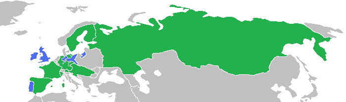

# 人権の拡大  
## ●授業動画一覧
|||
|:----:|:----:|
|人権の拡大1／イングランド王国|[YouTube](https://youtu.be/TjrS34UcC2g)|
|人権の拡大2／アメリカ合衆国|[YouTube](https://youtu.be/lqPTmOPNVoY)|
|人権の拡大3／フランス共和国|[YouTube](https://youtu.be/gf3W7ND39aI)|
|人権の拡大4／十九世紀まで|[YouTube](https://youtu.be/d8g-ndyUfYI)|
|人権の拡大5／第二次世界大戦まで|[YouTube](https://youtu.be/KCfxxhGSsyI)|
|人権の拡大6／戦後～現代（概要）|[YouTube](https://youtu.be/6AGT2Olg6Kk)|
|人権の拡大7／戦後～現代（個別の条約）|[YouTube](https://youtu.be/X63NJypuCD4)|
  
## ●概要
・本項は「人権という観点から見ると、現代的な国家はどういう経緯で登場してきたのか」にあたる  
⇒人権はどのように拡大してきたのか、その経緯を見ていく  
  
## ●中世から近世に於ける人権の拡大  
・法の支配という概念を生んだイングランド王国、それを直接受け継いだアメリカ合衆国、そしてフランス革命によって民主主義と人権という概念を世界各国へ輸出したフランス共和国。この三ヶ国で、人権の保護という概念はどのように発展し獲得されたか、各国の人権文書を軸に概観する  
  
### 〇イングランド王国  
基本の流れ：【マグナ・カルタ】⇒【権利請願】⇒【清教徒革命】⇒【名誉革命】⇒【権利章典】  
  
・マグナ・カルタ（大憲章）［1215年］  
⇒ジョン欠地王の暴走と失政を見かねた貴族らが、議会の承諾なしの課税や法的根拠のない逮捕の禁止といった内容を要求。英国の立憲政治の源流であり、人権保障の第一歩  
  
・権利請願［1628年］  
⇒チャールズ一世の暴走と失政を見かねた議会が提出した、請願。法学者の【エドワード・コーク】が起草。内容としてはマグナ・カルタとほぼ同じ。これを無視したチャールズ一世への反発が、清教徒革命の要因の一つ  
  
・清教徒革命［1642～1649］  
⇒ピューリタン革命とも。チャールズ一世の暴走と失政に対する抵抗であり、人権保護の記念碑的事件ではある。が、その後クロムウェル独裁、王政復古による王権の暴走等、再び混乱する。ちなみに、社会契約説でやったホッブズの『レヴァイアサン』が出たのはこの混乱期  
  
・名誉革命［1688］  
⇒清教徒革命からの混乱にけりをつけた事件。議会が王を追放、外国から新たな王を招聘し王朝を交代させた  
  
・権利章典［1689］  
⇒名誉革命を受けて、新王ウィリアム三世の承認を得て認められたもの。議会主権が明記され、現代でもイギリス不文憲法の中心になっており、「君臨すれども統治せず」のイギリス立憲君主制はここに誕生した。人権面でも、信教の自由、財産権の保障など、現代の人権保障に直接繋がる内容が整備されている。  
  
・おまけ：【『統治二論（市民政府二論）』】［1690年］  
⇒【ロック】の代表作。名誉革命を正当化した社会契約説を発表  
  
### 〇アメリカ合衆国  
基本の流れ：七年戦争⇒【アメリカ独立戦争】、【コモン・センス】⇒【バージニア権利章典】⇒【アメリカ独立宣言】  
  
・七年戦争（1754年～1763年）  
⇒欧州全域、更には欧州各国の植民地を巻き込んだ大戦争。プロイセン王国＋大英帝国vs残りの欧州列強全部、みたいな戦争  
  
七年戦争の図。青がプロイセン王国・大英帝国側、緑が残りの欧州列強全部側。見るからにプロイセン王国・大英帝国側が劣勢で、事実人口比は四百万対八千万とか１：３０とか言われている。が、この劣勢を覆してプロイセン・大英帝国側が勝利した。当然、これだけの劣勢を挽回するのにプロイセン王国も大英帝国も相当の無茶をしており、大英帝国は特に、アメリカの植民地に膨大な額の税金を課して戦費を調達した  
Gabagool, CC BY 3.0 &lt;https://creativecommons.org/licenses/by/3.0&gt;, via Wikimedia Commons  
https://commons.wikimedia.org/wiki/File:SevenYearsWar.png  
  
・アメリカ独立戦争［1775～1783年］  
⇒大英帝国のアメリカ植民地は重税に反発し、本国は懲罰的な措置で対抗。本国と植民地の対立は頂点に達し、ついに戦争となった。最終的に植民地が勝利し、現代まで続くアメリカ合衆国が建国される事となる  
  
・コモン・センス［1776年1月］  
⇒アメリカ独立戦争が始まってすぐ、【トマス・ペイン】が発行した、一種のパンフレット。アメリカ独立戦争初期の、思想的な裏付けとなった。他にも、独立戦争初期には、スローガンとして「代表なくして課税なし」というのもある  
  
・バージニア権利章典［1776年6月］  
⇒独立戦争中、バージニア州で起草された文書。後のバージニア州憲法（アメリカ合衆国では、各州にも憲法がある）にも収録された。その第一条は「全ての人は生まれながらにして等しく自由で独立しており、一定の生来の権利を有している」とあり、【天賦人権思想】を明文化した初の法的文書として重要とされる  
※天賦人権思想：人権とは、国や王によって授与されるものではない。人は誰であれ、生まれながらに人権を持っている、という思想。【自然権】に由来する  
  
・アメリカ独立宣言［1776年7月］  
⇒独立戦争中、トマス・ジェファーソンが起草した文書。大英帝国の北米植民地十三州の独立宣言。人間には、平等、自由、幸福追求といった基本的人権があるとし、それ故植民地は本国の暴政に抵抗し独立する、とする。即ち、人権保障の観点からアメリカは独立する、という論理構造になっている  
### 〇フランス共和国  
・仏国に於ける人権保護の展開とその文書については、以下の二つを抑えておけばよい  
・【フランス革命】（［1789年］）  
・【フランス人権宣言】（同年）  
  
・以下、フランス革命に至るまでの簡単な流れから解説  
  
・イングランドでは1688年の名誉革命と翌年の権利章典で絶対王政が完全に崩れた  
・フランス王国ではむしろ、この頃が絶対王政フランス王国の黄金期  
・太陽王ルイ十四世は、特にその治世の前半、戦争に勝利し絶対王政フランスの絶頂を演出した  
・…が、後半ともなると、得るものの少ない戦争を長期に渡って繰り返し、国家財政は大赤字に陥った  
  
・太陽王は結局、「俺はめっちゃ戦争したけど真似したらいかん」との遺言を残して死去  
・次代のルイ十五世は、太陽王の遺言を無視して戦争を繰り返した（しかも得るものはほぼなかった）  
・続くルイ十六世が即位する頃には、国家財政は完全に破綻していた  
・多くの平民は重税に苦しみ、一方で貴族は腐敗して使い物にならない  
・更に、一部の富裕な平民は、もっと自由に金儲けをさせろと不満を溜めていた  
  
・この状況で、平民の不満がついに爆発。これがフランス革命となる  
・王は処刑され、身分制社会は崩壊する  
・この時唱えられた革命の精神が、【自由・平等・博愛】である  
  
・このフランス革命初期の成果の一つが、ラ・ファイエットが起草したフランス人権宣言  
・正式名称は【人間および市民の権利の宣言】  
・この宣言は、ルソーの平等思想とロックの抵抗権の思想の影響を受けている  
・主な特徴は以下の通り  
１：［自由権と平等権の確認］  
※第一条「人間は自由で権利に於いて平等」  
２：【人権保障と権力分立の主張】  
※第十六条「いかなる社会であれ、権利の保障が確保されておらず、また権力の分立が定められていない社会には、憲法はない」  
３：【所有権の不可侵性の確認】  
※第十七条「所有権は、神聖かつ不可侵の権利」  
  
  
  
## ●近代に於ける人権の拡大  
### 〇18世紀以前  
・フランス革命は、欧州各国へ革命を輸出した。各国では何らかの形で市民革命が起こった  
・フランス革命後の体制を主導したのは、いわゆる資本家だった  
※富裕市民層、つまり会社の社長とか工場長とか  
・資本家が求めたのは【自由権】（［消極的権利］）だった  
⇒「もっと自由に経済活動させろ」「もっと自由に金を儲けさせろ」といった自由  
※この結果、【夜警国家】という［ラッサール］の言葉も生まれる。この時期は、国家の主たる任務は国民の自由の確保にあり、国家はなるべく社会へ干渉すべきでないとする「自由国家」思想が主流であった  
・こうして、革命の世紀たる18世紀では【自由権】が重視され、獲得された  
  
  
### 〇19世紀  
・資本主義は、放っておくと金持ちはより金持ちに、貧乏人はより貧乏になる体制である  
・また、富裕市民層が求めた自由とは、自分達資本家がいかに儲けるかという自由だった  
⇒労働者を一日に十四時間も働かせたり、労働者の選挙権を認めないようにしたり  
・この合わせ技で、貧富の格差が拡大  
⇒しかし労働者達は、自由権を制限しようとは考えなかった。代わりに、議会へ自分達の代表を送り込む事で、生活を改善させようと考えた  
・こうして、各国で【参政権】獲得運動が起こる  
⇒有名なのはイングランドの【チャーチスト運動】  
・結果として、19世紀では、【参政権】（［能動的権利］）が重視され、獲得されていった  
⇒19世紀の間に、男子普通選挙については各国で達成されていく。  
　男女普通選挙については20世紀の課題となる  
  
  
### 〇20世紀（第二次世界大戦頃まで）  
・19世紀は参政権が万人に与えられていく傾向にあった一方で、貧富の格差の問題は残った  
・特に第一次世界大戦から世界恐慌の流れは、「「自由国家」じゃ駄目だ。多少自由権を制限するのはもう、仕方ない事なんだ」「もっと国が、企業や個人の活動に介入して、困っている人を救っていかないと駄目だ」という潮流を生んだ  
・しかも、「労働者を虐めすぎると革命が起こる」という実例、ロシア革命も発生した  
・こうして、「自由国家」よりもむしろ「福祉国家」が志向されるようになる  
⇒結果、20世紀中盤までは、【社会権】（［積極的権利］）が重視され、獲得されていく  
・その画期となったのは、1919年のドイツ国で制定された【ヴァイマール憲法】である  
⇒世界で初めて、社会権を明記した憲法  
・日本でも、1947年制定の日本国憲法において社会権が盛り込まれた  
  
  
  
### 〇第二次世界大戦  
・アメリカが第二次世界大戦に参戦した［1941年］、【F.D.ルーズベルト】が【四つの自由】を発表する  
※アメリカ大統領はルーズベルトが二人いるので注意。戦間期にニューディール政策を行い、第二次世界大戦に参戦したのがフランクリン・デラノ・ルーズベルト。米西戦争で軍を率いた海軍軍人であり、大統領となってからは棍棒外交と呼ばれる帝国主義政策でカリブ海をアメリカの支配下に置いたのが【セオドア・ルーズベルト】である  
・四つの自由は、戦後の人権拡大に影響を与える事となる  
・四つの自由は、以下の四つから構成されていた  
１：【言論と表現の自由】  
２：【信仰の自由】  
３：【欠乏からの自由】  
４：【恐怖からの自由】  
⇒四つの自由とは言うが、自由権だけで構成されている訳ではないので注意。１と２は明らかに自由権だが、３は要するに「餓えない権利」なので社会権。４は「戦争など、生存を脅かされるという恐怖から逃れる権利」なので生存権である  
  
  
  
## ●戦後～現代に於ける人権の拡大  
### 〇大きな流れ  
・［1948年］の第三回国連総会に於いて、全会一致で【世界人権宣言】が採択される  
⇒「時代は人権保障。少なくとも自国民の人権は保障せねば…」という世界的な流れを受けてのもの  
・この宣言は、戦後の人権保障の基準となった。ただ、宣言なので法的拘束力はなかった  
⇒実際、同年に南アフリカ連邦で【アパルトヘイト】が始まる。これは南アフリカ国内で、白人が黒人を差別する事を公認する政策だった。世界人権宣言には法的拘束力はなく、このような政策を防止する力はなかった。故に、世界人権宣言に法的拘束力を持たせようという動きが出てくる。この動きは、後に【国際人権規約】として結実する  
※逆に言えば、アパルトヘイトのような人権侵害政策はやめようという動きが世界的に出てきたという話でもある。イギリスは南アフリカの宗主国であり、かつてはアメリカ・インディアンに天然痘ウィルスのついた毛布を贈っていたような国だが、それでもアパルトヘイトには賛同しなかった  
  
・こうして、［1966年］に採択され、［1977年］に発効したのが【国際人権規約】である  
※批准した場合、国際条約と同様に法的拘束力を持つ  
・国際人権規約は、様々な人権を包括的に保障しようとして作られた規約で、様々な人権が盛り込まれている  
・この規約は【A規約】と【B規約】に分かれており、批准する場合は別々に批准する  
※当然、B規約だけ批准してA規約は批准しない、みたいな国もある  
・A規約は【社会権】が中心。正式名称「経済的・社会的及び文化的権利に関する国際規約」  
・B規約は【自由権】が中心。正式名称「市民的・政治的権利に関する国際規約」  
・B規約には、【選択議定書】が二つ附属する。この選択議定書の批准は任意  
※A規約B規約共に批准するが、B規約選択議定書は一つも批准しない、とかもできるということ  
・B規約の【第一選択議定書】は、【個人通報制度】  
⇒B規約に記載の人権を侵害された場合、個人が国際連合自由権規約委員会へ通報できる  
・B規約の【第二選択議定書】は【死刑制度廃止】  
※日本の場合、A規約B規約共に批准しているが、B規約の選択議定書は一切批准していない。また、A規約の一部は留保という形にしており、批准していない（休日の労働者への報酬支払等）  
  
・その後も、人権保障は徐々に拡大していく  
⇒個別の人権保障を実現する為の、様々な国際条約も結ばれていく  
※個別の国際条約の詳細については、すぐ後の「戦後（個別の人権保障条約）」にまとめたのでそちらで  
・1980年代以降、新自由主義の台頭（「もっと自由に金を儲けさせろ」思想の復活）が見られる  
⇒これによってグローバル化が促進され、貧富の格差も再び拡大  
  
・新自由主義への揺り戻しが現在、進行しつつある  
⇒トランプ大統領政権誕生、イギリスのブレグジット等。国家の主権回復（参政権の回復）、自由権の過度な重視への反省、社会権の重視といった傾向が見られる。一方で、新自由主義によって得をする層というのも存在するので、対立も見られる  
※新自由主義をざっくり言えば、「実力主義」「自己責任」「無駄の削減」「国家の役割は最小限に」。新自由主義による実力主義の横行は、「貧乏人が貧乏で大変？」「真面目に働けば貧乏からは抜け出せるはずだ」「よって貧乏人が貧乏で大変なんてのは努力不足」「貧乏人が貧乏で死ぬのは自己責任」という風潮を生んだ。金持ちにとって極めて都合のいい風潮である  
### 〇戦後（個別の人権保障条約）  
・前項で、戦後の人権保障の展開を、大きな流れで概観した  
・その際、【国際人権規約】という包括的な国際規約を見た  
・そして、「個別の人権保障を実現する為の、様々な国際条約も結ばれていく」と述べた  
・本項では、この個別的な人権保障条約を一つ一つ見ていく  
※国際条約は国際的な決まり事であり、国内法に優先する。その為、人権保障の国際条約を批准する事は、「我が国はこういう人権問題について、解決していかねばならないと考えております」と内外にアピールする事へも繋がる。そこで、各条約に日本がどう対応しているかも見ていく  
  
・【ジェノサイド条約】［1948年採択、1951年発効］  
・世界人権宣言を採択した、第三回国連総会で採択された条約  
・読んで字の如く、ジェノサイドを禁止する条約。第二次世界大戦を受けてのもの。日本は【未批准】  
  
・【難民条約】［1951年採択、1954年発効］  
・正式名称「難民の地位に関する条約」。読んで字の如く、難民を保護する条約  
・ここでいう難民とは、人種、宗教、政治的要素による迫害を理由に、国籍国にいられない者をいう  
⇒要するに【経済難民】は難民に含みませんよ、という事  
・この条約を批准した国は、難民に対し様々な権利を保障しなければならない。例えば…  
１：批准国は難民の【追放及び送還を禁止】される。いわゆる【ノン・ルフールマンの原則】  
２：批准国は、批准国へ難民が不法入国した、または不法滞在している事を理由に罰してはならない  
・また、この条約を基に難民保護と難民問題解決を国際的に執り行う組織、【国連難民高等弁務官事務所(UNHCR)】も設立された  
・日本は［1981年］に批准  
・また条約に対応すべく、［1982年］に出入国管理及び難民認定法（いわゆる入管法）を改正  
  
・【人種差別撤廃条約】［1965年採択、1969年発効］  
・正式名称「あらゆる形態の人種差別の撤廃に関する国際条約」。人種差別を撤廃する条約  
・南アフリカ共和国のアパルトヘイトを念頭に置いて、あらゆる人種差別を撤廃する事を趣旨とした条約  
※南アフリカ連邦は、宗主国のイギリスすらアパルトヘイト政策を擁護してくれなかったので、1961年に完全独立して（英連邦から抜けて）南アフリカ共和国となった  
・日本は、［1995年］に批准。これを受け、［1997年］、北海道旧土人保護法をアイヌ文化振興法へ改正  
  
  
・【女子差別撤廃条約】［1979年採択、1981年発効］  
・正式名称「女子に対するあらゆる形態の差別の撤廃に関する条約」  
・女子差別を撤廃する条約。もしくは、男女同権を実現する条約  
⇒例えば性による役割分担（男は外で働き、女は家を守る、みたいな）を否定する。法的な待遇が男女で違う事を否定する。そういうものを求める条約  
・日本は、［対応する法改正を行ってから批准した］  
※他の条約はだいたい批准⇒法改正だが、この条約は逆なので注意！  
・日本は［1984年］、［男女雇用機会均等法］を制定。また同年、［国籍法］を改正  
・そして［翌年］、批准した  
※国籍法はこの時、国籍の取得条件を父系血統主義から父母両系血統主義に変えている。要するに、この法改正までは「父親が日本人なら日本国籍を取れる。母親は日本人だが父親は外国人なら取れない」だった。これを「父親か母親どちらかが日本人なら日本国籍を取れる」に変えた。  
  
・【拷問等禁止条約】［1984年採択、1987年発効］  
・正式名称「拷問及び他の残虐な、非人道的な又は品位を傷つける取り扱い又は刑罰に関する条約」  
・正式名称を読んで分かるように、情報収集の為の拷問のみならず、非人道的な刑罰も禁止する  
・日本は［1999年］に批准している。法改正による対応は特にしていない  
  
・【子どもの権利条約】［1989年採択、1990年発効］  
・正式名称「児童の権利に関する条約」  
・名前のまんま、子供（未成年）の権利を尊重しなさいという条約  
⇒子供は弱く搾取しやすい場合が多い上、「義務を果たしていないから権利もない、よって子供に人権はない」とかやられやすい存在。んな訳ないでしょしっかり権利を守ってあげなさい、という条約  
・日本は1994年に批准している。批准にあたって法改正による対応は必要ないと、政府が見解を出している  
  
・【死刑廃止条約】  
・死刑廃止条約とは、要するに【国際人権規約】の【B規約】の【第二選択議定書】の事である  
※国際人権規約B規約第二選択議定書の事を「死刑廃止条約」という言い方で表現してくる場合もあるので、「え、B規約の選択議定書とは別にそんなんあったの…」とならないように注意  
・前述の通り、日本は未批准  
  
・【障害者権利条約】［2006年採択、2008年発効］  
・正式名称「障害者の権利に関する条約」。そのまんま、障碍者の人権を保障しようという条約  
・日本は、［対応する法改正を行ってから批准］した  
※女子差別撤廃条約と同じ、法改正して状況を整えてから批准した条約。対応した法が二つあるのも同じ  
１：［2011年］、障害者基本法を改正（法自体は元からあったが、条約のレベルに合わせて改正した）  
２：［2013年］、障害者差別解消法を制定（具体的に、障害者差別の禁止と解消を規定した法を制定）  
⇒この流れを受けて、［2014年］に批准  
  
※これらの条約は、「批准しているからその国は人権を重視している」「批准していない国は人権を軽んじている」という風に、単純に考えない方がいい。例えばフランス共和国は死刑廃止条約を批准しているが、その分凶悪犯は大抵、現場で射殺してしまう。「それなら日本の方がましだわ、死刑廃止条約には参加してないけど」という意見は当然あり得るものである  
  