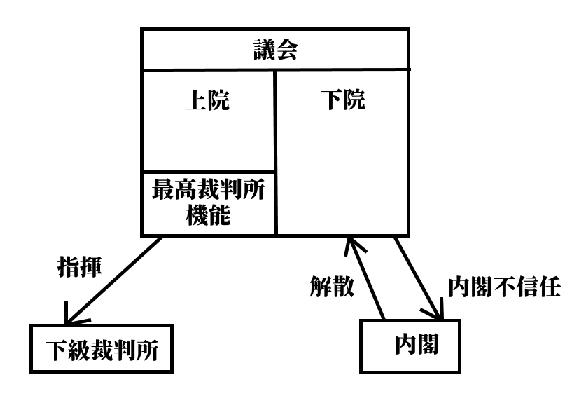

# 世界の政治制度  

## ●授業動画一覧
|||
|:----:|:----:|
|世界の政治制度1／チェック・アンド・バランス1|[YouTube](https://youtu.be/OwArhP-RUik)|
|世界の政治制度2／チェック・アンド・バランス2|[YouTube](https://youtu.be/W1lypKsFbYQ)|
|世界の政治制度3／イギリスの政治制度1|[YouTube](https://youtu.be/z1I8z4j15js)|
|世界の政治制度4／イギリスの政治制度2|[YouTube](https://youtu.be/ALbfJmZbziw)|
|世界の政治制度5／アメリカの政治制度1|[YouTube](https://youtu.be/n2rQDqoEv4Y)|
|世界の政治制度6／アメリカの政治制度2|[YouTube](https://youtu.be/UfGVGmlBgew)|
|世界の政治制度7／中華人民共和国の政治制度|[YouTube](https://youtu.be/ZFbp15eJl9M)|

## ●概要

・本節では、現代の、諸外国の政治制度として、以下の三ヶ国を取り上げて見ていく  
１：我が国によく似た立憲君主制の、議院内閣制国家、英国  
２：西欧民主主義国家代表として、現代の覇権国家アメリカ合衆国  
３：その覇権国に挑戦できる存在へ成長しつつある、中華人民共和国  
  
  
## ●抑制と均衡（チェック・アンド・バランス）  
　現代の、西欧型民主主義国家は、必ず【権力分立】の原則をベースに成立している。まず、この権力分立について、抑制と均衡（チェック・アンド・バランス）という発想を通して解説する。それから改めて、各国の政治制度を見ていく。  
　権力分立の具体例としては恐らく、中学公民以来の「三権分立」という言葉が最も馴染み深いだろう。国を統治する権力を、行政権、立法権、司法権の三つに分けて、それぞれを別の機関（行政権は内閣、立法権は議会、司法権は裁判所）に担当させる、という奴である。  
　こんな面倒な事を何故やるのか。言ってみれば、このやり方は非効率という側面がある。全ての統治権を一人の人間、一つの地位に集約して、その下に彼を支える官僚組織を作り上げれば、極めて効率的に統治ができる。その典型例は、絶対王政である。  
　このやり方の問題点は、「有能な人物がその地位に在れば」効率的だという点である。無能がその地位に就いてしまうと、暴走と失政を誰も止められない。何せ全ての権力を一つの地位に集約してしまっているから、彼を牽制できる権力がない。  
　王政を続けるにせよ民主政をやるにせよ、これはまずい。国のトップになるような人間は、基本的には高度な専門教育を受けているから、どうしようもない無能がなる可能性は低い。が、それはそれとして暴走を制御するシステムが必要である。この、暴走を制御するシステムが権力分立であり、制御と均衡（チェック・アンド・バランス）という思想であると言ってよい。  
　この「制御と均衡（チェック・アンド・バランス）」というのは、ざっくり言えば「権力をいくつかに分けて、権力と権力で綱引きさせる」「権力同士の綱引きによって均衡状態を作る」「そうすると権力の暴走を制御できるしうまくいく」というものである。  
　言い方を変えれば、こういう表現もできる。「権力をいくつかに分ける」「それぞれの権力には、互いにに攻撃（チェック）できる機能を持たせる」「すると、権力と権力は互いに牽制（チェック）し合って膠着状態（バランス）に陥る」「すると、権力が暴走しない。これこそがチェック・アンド・バランスである」  
　制御と均衡の実例を、英国＝日本式の【君臨すれども統治せず】な王（天皇）と内閣の関係から見てみよう。  
　名誉革命以後の英国、伊藤博文による内閣創立以後の日本に於いて、どちらも行政の長は（基本的には）内閣総理大臣である。王もしくは天皇は原則、行政に関する権力を保持せず、大臣や高級官僚を形式的に任免する儀式を執り行うに過ぎない（正確には、英国王は、名誉革命後も議会に働きかける事で実質的な行政権を保持しようとした事はあったが、やがて「君臨すれども統治せず」へと向かっていった。戦前日本の天皇の場合、法的には極めて強力な権力を持っていたが、歴代天皇がその行使を望まなかった。むしろ、いい言い方なら象徴、悪い言い方であればお飾りである事を自ら望み、それを自らに課した）。  
　しかしながら、英国の王にせよ日本の天皇にせよ、権力はないにしても権威は絶大なものがあった。例えば、戦前昭和の日本は軍人による独裁が行われたと思われているが、その軍人達も「やべぇ陛下に怒られる…どうしよう…」みたいな状態によくなっている。そして天皇自身、よく怒っている。天皇に怒られたショックで辞職し、数ヶ月後には心臓発作で死んだ内閣総理大臣までいる。  
　そもそも選挙で選ばれた政治家と、（退位でもしない限りは）死ぬまで王で在り続ける王とは、ものの見え方が違う。政治家は民意で選ばれるが故にその時々の民意を反映できるという強みがあるものの、数年で任期が来て、また選挙となる。それ故に、どうしても近視眼的になりがちで、民衆が喜ぶような派手な（そして往々にして中身がなかったり、長期的に見るとまずかったりする）政策を採りがちである。一方、王は死ぬまで王であるから民意を気にする必要がなく、長期的な視野に立って物事を見る事ができる。また、代々受け継いできた地位であるから、伝統にも理解がある。だが一方で、死ぬまで王であるという強み故に民意に疎く、短期的なものの見方も苦手である。そして、王と内閣総理大臣は、どうしても会話する機会が多くある。  
　こうして、王と内閣総理大臣の間には、力の引っ張り合いによる均衡（均衡、バランス）が生まれる。総理大臣が「こういう政策をするつもりです」と言った時、王が「長期的に見ればそれはよくないと思うけどねぇ」と言うような形で。言うまでもなく、王に権力はなく、権威しかない。決めるのは権力を持つ政治家であり、内閣総理大臣である。だが、絶大な権威を持つ者からの助言は深く、重い。故に、権力の暴走に対する強力なブレーキ（制御、チェック）として働く。  
　今、仲がいいからこの国と同盟しよう。そういう短期的な視点でものを考える政治家に対して、王は長期的な視点から、「その国前の戦争で同盟国裏切ってたやん」とか「その国、あの国と仲悪いから、後で戦争に巻き込まれるかもしれないよ」というような助言を与える。この助言には何の法的拘束力もないが、王という絶大な権威による裏付けがある。最終的に決めるのは民意で選ばれた政治家ではあるが、権力の暴走に歯止めをかける強力な存在として、王が機能する。  
　無論、逆も然りである。いくら王に絶大な権威があると言っても、「絶対王政の夢よもう一度」という感じで王が独裁に向けて暴走する事はできない。実際に物事を決めるのは、国民に選ばれた政治家だからである。故に、王が政治家に対するチェックとして働くのと同じぐらい、政治家が王に対するチェックとしても働く。互いが互いに対するチェックとして機能する。  
　これが、立憲君主制の王と政治家の間に於ける、権力分立と制御と均衡（チェック・アンド・バランス）である。権力を分立させ、それぞれの権力によって相互に監視、牽制を行わせる。そうする事によって権力の暴走が抑えられ、多少非効率であっても、国はよりよい方向へ進めるだろう、と考えるのだ。この観点もあって、西欧型民主主義国家では国家元首（国の一番偉い人）と政府首班（政府の一番偉い人）を分けている例は多い。  
　権力分立という思想は、様々な哲学者や法学者によって語られてきた。が、高校政経レベルで言うなら、【ロック】（代表作【『統治二論（市民政府二論）』】）と【モンテスキュー】（代表作【『法の精神』】）を押さえておけばいいだろう。ロックの権力分立論は、各々の権力は対等ではなく、議会が最高の権力を持つとしたのが特徴であった。英国式の統治体制は、このロックを理論的根拠とする。一方モンテスキューの権力分立論は、行政権、立法権、司法権の三権を平等に分立させるものであり、米国式統治体制の理論的根拠と言える。  
  
  
## ●イギリスの政治制度  
・イギリス、正式名称【グレートブリテン及び北アイルランド連合王国】  
※ちなみに、1707年までがイングランド王国、1707～1800がグレートブリテン連合王国、1801年～1927年がグレートブリテン及びアイルランド連合王国、1927年からがこの国号である  
  
・【立憲君主制】、【不文憲法】、【議院内閣制】、三権分立が厳密でない、等の特徴が挙げられる  
⇒現代日本に割とよく似ている  
・イギリスの政治制度の根幹にある発想は、「国家権力で一番偉いのは、議会。議会の承認がなければ、誰もあらゆる統治権を行使できない」というもの。これを基に政治制度が整備されている  
  
  
### 〇王制  
・王が国家元首を務める（政府首班は内閣総理大臣）  
・日本と同じ【立憲君主制】国家。即ち、王がいるにはいるが、憲法によってその王権が制限されている  
・しかもその制限の仕方が、現代日本と同じ【君臨すれども統治せず】式  
⇒王は形式的な儀式や外交訪問等をするだけで、権力を行使しない。日英で違うのは、日本の場合は「あらゆる権力を王に持たせない」、英国の場合は「王は権力を持っているが行使しない」になっている点  
  
  
### 〇憲法  
・不文憲法。きちんとした法典になっている憲法はない  
⇒【マグナ・カルタ（大憲章）】、【権利請願】、【権利章典】、及び慣習法、判例法、更に各種の憲法関係の法律の集合体が憲法とされる  
  
  
### 〇議会  
・【二院制】。【上院（貴族院）】と【下院（庶民院）】に分かれる  
・［本会議中心主義］で、主に議会での討論で政策を審議・決定する  
⇒日本は、戦前は本会議中心主義だったが、戦後は［委員会中心主義］で、本会議はただの儀式に近い  
  
・上院は、貴族（昔から貴族な世襲貴族、高位の聖職者である聖職貴族、恩典で一代限りの貴族になった一代貴族。また2005年までは、特殊な一代貴族の法服貴族もいた）から成る。よって選挙は無い。また定数もないが、だいたい八百人程度  
・上院は、2005年までは【最高裁判所】としての役割も担っていた  
⇒裁判官としての役割を果たす特殊な一代貴族、法服貴族（2005年時点での定数は十二人）が裁判を行った。2005年に連合王国最高裁判所が設立された際、この法服貴族は上院議員を辞め、そのまま最高裁判所の裁判官となった。但し、法服貴族が一代貴族であるという点は変わらないので、最高裁判所の裁判官を辞めた後は、再び上院議員になっている  
  
・下院は、選挙で選ばれた政治家から成る。定数六百五十議席  
⇒［18歳以上］の国民による、小選挙区制の直接選挙で選ばれる。任期五年  
  
  
・上院と下院では、【下院】が優越する  
１：内閣総理大臣には、原則、【下院の第一党の党首】が任命される  
２：下院で【内閣不信任】となった場合、内閣は総辞職するか下院を解散しなければならない  
※上院でも内閣不信任決議自体はできるが、拘束力がなく無視できてしまう  
３：金銭法案（予算案等）は必ず下院が先議する。上院は下院の決定を拒否できない  
※一応、成立を一ヶ月遅延させる事はできるがそれだけ  
４：非金銭法案の場合も、二期連続で下院が可決した法案は拒否できない  
  
※現代の上院は、その殆どが一代貴族である。そして、現在の一代貴族は政界・官界・軍・司法界の大立者や、一流の学者、経済人、作家、労働組合幹部、芸術家、科学者などから選ばれる事が多い。その為、現代英国の上院は、「政府任命の専門家会議による議会の監視機構」と化している感がある  
  
・下院は、歴史的に【二大政党制】である  
・現代では、【保守党】と【労働党】という二大政党が鎬を削っている  
⇒基本的には保守党が資本家、貴族寄り。労働党が労働者寄り  
※かつてはホイッグ党とトーリー党だった。トーリー党は保守党と名を変えて生き残ったが、ホイッグ党は労働党に支持層を奪われ消滅した  
  
  
### 〇内閣  
・内閣総理大臣が政府首班を務める（国家元首は王）  
・日本と同じ【議院内閣制】。議会（特に下院）の信任に基づいて内閣が成立する  
・よって、議会（特に下院）の信任を失った場合、そのまま内閣を続ける事はできない  
⇒英国政治制度の根幹的発想にあたる、「国家権力で一番偉いのは、議会。議会の承認がなければ、誰もあらゆる統治権を行使できない」に基づいた制度。基本的には日本と同じで、「議会はお前を信じて行政権を託します」という形で内閣総理大臣が決まる。逆に議会で不信任が決議された場合、「議会はお前を信じて行政権を託したけど、間違いだったわ。辞めろ」という形になる。ちなみに、不信任が決議された場合の対応も、日英でだいたい一緒である。日本では衆議院で内閣不信任が決議された場合、内閣は対抗措置として衆議院を解散するか、内閣が総辞職するかを選択しなければならない。英国でも、下院で内閣不信任が決議された場合は、下院を解散するか、内閣が総辞職するかの二択を迫られる  
※この、「政府首班たる内閣総理大臣は、下院の信任に依る」という原則を作ったのが初代オーフォード伯爵【ウォルポール】である。まだ首相とか内閣総理大臣とかいう地位が制定されていない時代、彼は王、上院、下院に支持されて、首相のように振る舞った。そして、人気が衰えて選挙で負けると（下院の議席数で負けると）、王と上院にはまだ支持されていたのに潔く職を辞した。惜しんだ王がオーフォード伯爵に叙し、公式に首相ではなかったのに現代でも「初代英国首相」と呼ばれる傑物である  
  
・また、日本と同じ議院内閣制である為、内閣総理大臣を含む閣僚は、同時に【国会議員】でもある  
・更に、下院の野党は【影の内閣（シャドー・キャビネット）】を作り、政権交代に備えている  
⇒英国は、議院内閣制国家にとって、適度な政権交代と野党の政策立案能力が必要だと考えている。野党にその能力がなければ与党による一党独裁が続くし、政策に関する健全な議論もできない、という理論である。その為影の内閣は公職であり、その運営は公費に拠り、また議会内には専用の執務室も用意される  
  
  
### 〇裁判所  
・実は2005年まで、最高裁判所としての機能を貴族院が持っていた  
⇒英国政治制度の根幹的発想にあたる、「国家権力で一番偉いのは、議会。議会の承認がなければ、誰もあらゆる統治権を行使できない」に基づいた制度になっていた。貴族院には、法服貴族という特殊な議員がおり、彼らの議論が最高裁判所として機能していた  
・2005年、貴族院の最高裁判所としての機能を分離、連合王国最高裁判所を創立した  
⇒これによって行政権と司法権が完全に分立する事となった  
・連合王国最高裁判所には、［違憲立法審査権は無い］  
⇒ここは日本とは明確に違うので注意  
  
  
英国の統治制度まとめ図。矢印はチェック・アンド・バランスでいうところのチェックを表しているが、要は攻撃だと思ってほしい。例えば議会の下院は、内閣に対し「内閣不信任」という攻撃ができる。一方で内閣も、議会の下院に対し「解散」という攻撃ができる。一方上院の最高裁判所機能は、下級裁判所（日本で言う地方裁判所とか）に対し「指揮」という攻撃ができ、下級裁判所はこの攻撃に従う他ない。尚、議会の最高裁判所機能は、2005年に連合王国最高裁判所となり議会から分離した  
  
## ●アメリカ合衆国の政治制度  
・現代の覇権国家アメリカ合衆国は、【三権分立】を厳格に採用しているのが特徴である  
⇒英国式の議院内閣制国家の場合、議会（立法権）の信任によって内閣（行政権）が成立する  
つまり、立法権と行政権が完全に分離している訳ではない  
・また、地方分権要素の強い国家であり、【連邦制】を採る事も特徴である  
⇒「中央政府の権力を地方自治体に分け与える」のではなく、「多種多様な地方自治体が合体した結果、合衆国政府ができた」という考え方を採る。その為日本国とは比べ物にならない地方分権ぶりになっている  
・政府首班としては【大統領】制を採る  
  
  
### 〇連邦制  
・複数の国（もしくは州）が、一つの主権の下に結合してできる国家形態  
⇒アメリカの場合は、五十の州がアメリカ合衆国として結合している。それぞれの州は、主権の独立性が無い以外は、普通の国家と同じ。それぞれが独自の憲法、法律、議会、裁判所、警察、軍隊を持つ  
※他には、例えばアラブ首長国連邦もこの連邦制である。この国は七つの首長国が結合してできており、それぞれの首長国は首都を持ち、絶対王政によって統治されている  
  
  
### 〇憲法  
・合衆国憲法は、【成文憲法】である  
⇒国レベルの憲法としては、世界初の成文憲法  
※連邦制なので、州ごとにも憲法がある  
  
  
  
### 〇大統領  
・合衆国大統領は、国家元首であり政府首班でもある  
・大統領は任期【四年】。憲法で【三選】が禁止されている（つまり二期までしかできない）  
  
・合衆国大統領（行政権を司る）は、日英と違って議会（立法権を司る）と明確に分離しているのが特徴  
⇒議会の許可がなければ議会に参加する事さえできないし、議会を解散する事もできない。議会の与党の人間が大統領になるとも限らないし、議会から不信任と決議されたとしても、特に問題は起きない。行政権の長として立法権を司る議会をチェックし、議会は議会で大統領をチェックする、互いが互いをチェックし合うチェック・アンド・バランスの概念に基づいた関係になっている  
  
・大統領は議会に対し［教書］の送付権を持つ  
⇒議会に対し、文書の形で「これからこういう政策をしていきます」という報告や、「こういう法律を審議してほしい」という勧告を行える、という事  
※議会に対して法案提出権を持つ訳ではない。また、「こういう法律を審議しろ」と強制できる訳でもない  
  
・大統領は、議会で可決された法案について［拒否］する事ができる  
⇒拒否した場合、法案は議会に差し戻される。但し、［議会の2/3以上による再可決には抵抗できない］  
  
・大統領は、［高級官吏の任免権］と［条約締結権］を持つ。但し、［上院の同意］が必要  
※高級官吏は、最高裁判事や、各省の長官など  
・大統領は、［臨時議会の招集］、［議会の停会］の権限を持つ  
※招集については、招集できるだけ。法案を提出する権限はない。また、議会も停会はできるが解散は不可  
  
・この他、大統領は［陸海空軍の統帥権］、［恩赦の決定権］を持つ  
  
・大統領選挙は【間接選挙】。［18歳以上］の国民に選挙権がある  
⇒国民は、選挙人と呼ばれる人へ投票する。投票によって選出された選挙人は、それぞれ大統領候補へ投票する。つまり、大統領候補は選挙人による投票で選出され、国民はその選挙人を投票で選出するという形になっているのであって、国民は大統領を直接選挙で選べる訳ではない。ただ一応、各選挙人は、事前に「私は### 〇### 〇さんに投票します」と表明してはいる  
  
  
  
### 〇議会  
・立法権を司る。大統領（政府）に法案提出権すら無い為、全ての法は［議員立法］によって立法される  
⇒日英は議院内閣制で、総理大臣であろうとも国会議員であるので、政府が法案を提出する政府立法が可能  
・連邦議会は【二院制】。【上院（元老院）】と【下院（代議院）】  
・下院は世論に敏感な人民の院、上院は各州の代表の院、という伝統を持つ  
・上院と下院は、立法権に関しては原則、対等の関係にある  
・基本的に、【二年ごと】に選挙を行う。詳しくは後述するが、上院も下院も二年ごとに選挙するのは同じ  
⇒大統領選は四年ごと。大統領選と議会選挙を同時にやり、二年後に議会選挙があり、更に二年後また大統領選と議会選挙を同時にやる、という周期で選挙を行っていく。アメリカでは議会の解散がないので、この周期がずれる事はない。大統領選＋議会選挙と大統領選＋議会選挙の間に行われる議会選挙を【中間選挙】と呼ぶ  
  
・［委員会中心主義］を採る。本会議前の、委員会による話し合いや根回しが中心で、本会議は儀式に近い  
⇒委員会中心主義である為、日本と同様、【ロビイスト】による【ロビイング】が盛ん。即ち、企業や市民団体が圧力団体と化し、自らの主張・利益に沿った法を作って貰えるよう議員へ働きかける政治活動である  
※日本は本来議院内閣制＋本会議中心主義というイギリス式だったのだが、戦後にアメリカから委員会中心主義を導入したので、議院内閣制＋委員会中心主義となった  
  
・下院は、世論に敏感な人民の院という伝統を持つ。任期［二年］、小選挙区制選挙で定数四百三十五名  
・予算の先議権を持つが、立法権については対等である  
・大統領を含む高級官吏（裁判官や各省の長官等）弾劾の訴追権を持つ。実際の弾劾裁判は上院で行う  
  
・上院は、合衆国各州の代表という伝統を持ち、［各州あたり定数二名から成る百名］で構成される  
・任期は［六年］で、［二年ずつ1/3を改選］する  
・上院議長は［副大統領］が務める  
・大統領の行う［高級官吏の任免］と［条約締結］は、上院の同意がなければ執行できない  
・下院の訴追を受けて、弾劾裁判を行う権限を持つ  
※なお、失政の責任を問う形での弾劾裁判はできない。合衆国の法の執行を妨害した、というような法的な責任しか問えない  
  
・アメリカ合衆国の政党は、【二大政党制】となっている。【民主党】と【共和党】  
・民主党は［労働者］の支持が厚く、共和党は［資本家など保守層］の支持が厚い  
⇒民主党は労働者を保護するような政策を採り、共和党は資本家の自由な経済活動を支援するような政策を採る  
※但し、近年の新自由主義の台頭から民主党はグローバル化と自由主義の尊重に走り、結果労働者を顧みなくなってきている。その分かりやすい例が2016年大統領選の民主党候補ヒラリー・クリントンである。一方、本来資本家の味方をして労働者を苦しめる立場にある筈の共和党から、むしろ労働者の権利を擁護するような政治家も出てきた。その最大の例がドナルド・トランプである  
  
  
  
### 〇裁判所  
・【連邦最高裁判所】の判事は、［大統領の任命と上院の同意］によって任命される  
⇒この連邦最高裁判所が、行政権（大統領）と立法権（議会）へのチェック機能を持つ。一方で、大統領と議会は判事の任命という形で司法権へのチェック機能を持つ  
・連邦最高裁判所は、大統領に対し［違憲行政審査権］を持つ  
⇒大統領へのチェック機能  
・連邦最高裁判所は、議会に対し［違憲立法審査権］を持つ  
⇒議会へのチェック機能。なお、判例上権利があるとされているだけで合衆国憲法に記載がある訳ではない  
  
  
  
アメリカの政治制度まとめ図。「三権が完全に分離している」「三権は対等であり、それぞれがそれぞれに対しチェック（攻撃）機能を持つ」というのが特徴。英国と比べると、全然違うのが分かる。  
  
## ●中華人民共和国の政治制度  
・中華人民共和国は共産党が支配するアジアの国家であり、西欧型民主主義国家とは全く異なる  
⇒権力分立とか、そのような発想に基づいて作られた国家ではない。ここまで学んだ政体で言えば、むしろ絶対王政が近い。議会での派閥争いを制した者が王となり、その王が絶対王政を敷き、王の統治を容易ならしめる組織が整備されている、という風にイメージするとよい。立法を司る議会、司法を司る裁判所等もあるが、三権を分立させていると言うよりは、王の下で役割分担して王を補助している、というようなイメージ  
・絶対王政に近い為、長所と短所も似ている。即ち…  
・国家主席（王）の意志が迅速に実行される、極めて効率的な統治が可能  
・気紛れな世論を気にせず、長期的な視野で連続性のある政治が行える  
・但し、一度王権が暴走を始めると止める手立てに乏しい  
・また、短期的な視点が無い故に、悪い意味で保守的になりがち  
  
  
### 〇政体及び憲法  
・初期は、ソ連的な民主集中制による国家だった  
※民主主義中央集権制とも。民主主義の名の通り一応選挙はあるが、「上位組織の決定に下位組織は絶対服従（批判すら許されない）」「分派形成の禁止（例えば最高指導者がスターリンであるなら、スターリン派以外の存在は許されない。例として、今の最高指導者はスターリンだけどその内トロツキーに最高指導者になってほしいな、とか考える者はトロツキー派とされて粛清される）」といった原則を持つ。国内に存在を許される政党は共産党のみで、共産党が国内を独裁し、その共産党を最高指導者が独裁する仕組みと言える  
・その後、［1982年憲法］にて、自らを［人民民主主義独裁の社会主義国家］と規定する  
※人民民主主義も、共産党によって国内が独裁されるという点は一緒。但し、共産党の体制を支持し、狭い範囲の利益を代表する場合に限り、共産党以外の政党（衛星政党）の存在が認められる。完全な共産党独裁だと国内に不満が溜まりやすいが、この体制ならば衛星政党の存在で幾分、ガス抜きができる  
・更に、［1993年］の憲法改正で【社会主義市場経済】を実施すると謳われた  
※共産主義・社会主義的な経済政策ではもう立ち行かないので、資本主義的な経済を導入しますよ、但しうちらが共産主義国家であるという建前は崩しませんよ、という風に理解するとよい  
  
  
  
### 〇国家元首と議会  
・国家元首は【国家主席】  
⇒実質的な、中華人民共和国の王。かつてはお飾りだった時期もあるが、江沢民以降は国家主席が共産党総書記（共産党の首長）を兼ねており、これ以降は国家主席こそが中華人民共和国という国の絶対王政的な王と考えてよい。江沢民、胡錦濤を経て、現在習近平が国家主席  
・国家主席の任期は無い  
⇒元は任期五年で二期までという制限があったが、習近平が撤廃した  
  
・議会に当たるのが、【全国人民代表大会】。通称【全人代】。立法機関である  
・【一院制】で、憲法上では（つまり建前上は）最高機関にあたり、国家主席の選出も行う  
⇒実際には、「ここでの派閥抗争を勝ち抜いた者が国家主席となるトーナメント会場」兼「国家主席の立法行為を補助する機関」と考えると分かりやすい  
・また、【全人代常務委員会】の選出も行う  
⇒全人代常務委員会は、全人代の閉会中、代わって役割を果たす  
  
  
### 〇内閣  
・【国務院】が、他国で言う内閣にあたる。行政機関である  
・【国務院総理】が、他国で言う内閣総理大臣にあたる  
・国務院総理は、国家主席が指名する。一応その後、全人代が承認する事で任命される  
・憲法上は全人代の執行機関。全人代への議案提出権も持つ  
・実際のところは、国家主席の行政、特に内政を補助・代行する機関と考えると分かりやすい  
⇒この機関のお陰で、国家主席は外交等に集中しやすい  
  
  
### 〇司法  
・【最高人民法院】が、他国で言う最高裁判所にあたる  
・裁判所は、最高、高級、地方、基礎の四階層に分かれている  
・事案によって、扱い始める裁判所が違う。また、二審制である  
⇒例えば、地方人民法院で最初に審理された事件は、控訴された場合高級人民法院に移され、そこで決着する  