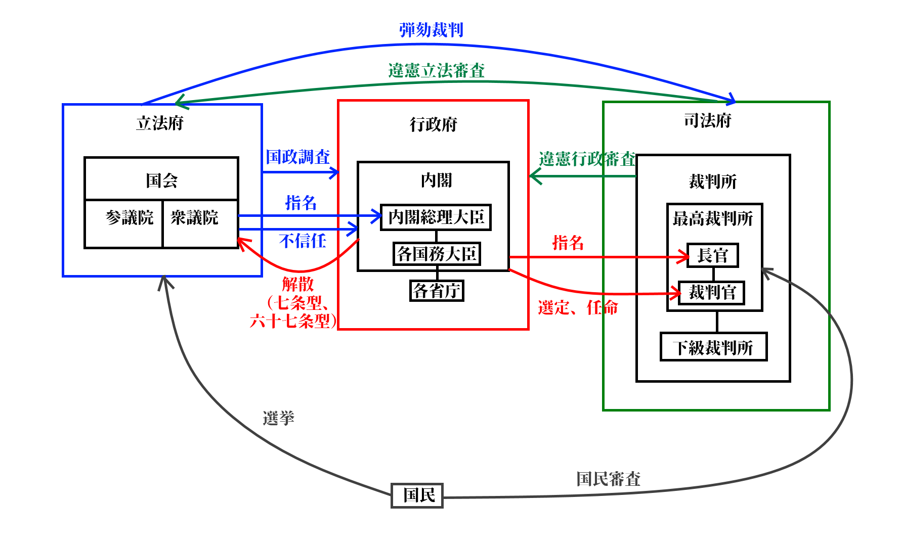

# 現代日本の統治制度と権力分立

## 授業動画一覧
[本節の授業動画はこちら](LIST.md#現代日本の統治制度と権力分立)  

## ●概要

・政治分野第一章でやったように、現代の欧米型民主主義国家は権力分立を骨子として成立する  
・現代日本の場合、英米式のハイブリッドと言っていい形で権力分立を行っている  
・まずは本節で、大雑把に日本の政治制度と権力分立を見る  
  
・現代日本の政治制度は、【立憲君主制】や【議院内閣制】を採るという意味では英国式に近い  
⇒三権分立がさほど厳密ではないとか、君主が「君臨すれども統治せず」式だというのも同じ。一方で、英国式政治制度の根本にある「国家権力で一番偉いのは、議会。議会の承認がなければ、誰もあらゆる統治権を行使できない」という議会主権の発想は受け継いでいない。日本はあくまで国民主権である、という事になっている  
・一方、「三権それぞれがそれぞれに対しチェック機能を持つ」という意味では米国式に近い  
⇒特に、裁判所が【違憲立法審査権】及び【違憲行政審査権】を持つのは英国式とは違うところ。イギリスの場合、内閣と議会は（不充分にせよ）互いに対しチェック機能を持っているが、裁判所は内閣や議会に対しチェック機能を持っていない  
・【国民主権】なのも日本の政治制度・権力分立の特徴の一つ  
※但し、「英国に比べれば厳密であるにせよ、米国ほどには三権分立が厳密ではない」の影響で、米国式に比べると「国民主権って言う割に国民あんま政治に参加できないね？」という形になってはいる  
  
現代日本の権力分立図  
  
  
  
### 〇立法府と行政府  
・国会は衆参問わず、行政府に対し【国政調査】を行う事ができる  
・衆議院は、【内閣総理大臣】を指名できる  
※［国会議員］の中から指名する  
・衆議院は、【内閣不信任】決議を行う事ができる  
・内閣は、衆議院を【解散】させる事ができる  
※解散には二種類ある。内閣不信任が決議された時にやるもの（六十九条型）と、普段からいつでもできるもの（七条型）。詳しい話は後述  
  
  
### 〇行政府と司法府  
・内閣は、最高裁判所【長官】を指名する  
※指名するだけ。任命は天皇の国事行為  
・内閣は、最高裁判所【裁判官】を選定し、任命する  
・全ての裁判所は、行政府に対し【違憲行政審査】を行う事ができる  
  
  
### 〇立法府と司法府  
・国会は、全ての裁判所裁判官について【弾劾裁判】を行う事ができる  
※弾劾裁判で「不適格」とされた裁判官は罷免される  
・全ての裁判所は、【違憲立法審査】を行う事ができる  
  
  
### 〇国民と三権  
・【十八歳】以上の全国民は、【国会】の選挙に参加する  
・【十八歳】以上の全国民は、【最高裁判所裁判官（長官含む）】の審査に参加する  
⇒この国民審査で「不適格」とされた裁判官は罷免される  
・逆に、首相（内閣総理大臣）、国務大臣、国会議員の【リコール】はない  
・また、国民は【首相（内閣総理大臣）】の選定に参加できない  
⇒言い換えると、【首相公選制】ではない  
  
  
  
・では、次節から、立法府、行政府、司法府のそれぞれについて、詳しく見ていこう