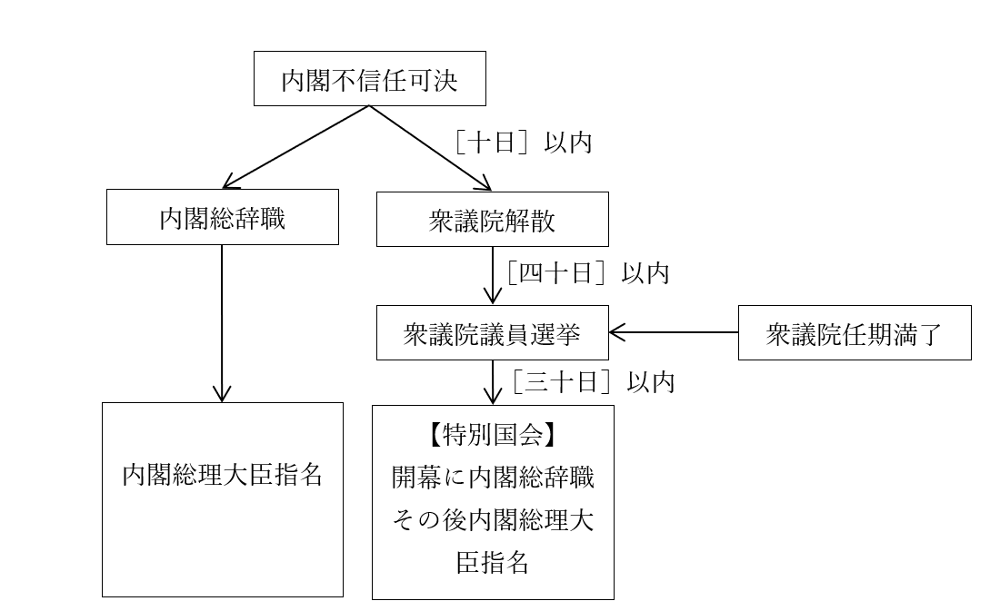

# 立法府（国会）
## ●授業動画一覧
|||
|:----:|:----:|
|立法府1／国会の概要と定義|[YouTube](https://youtu.be/QCskuBE35Ow)|
|立法府2／会期と解散|[YouTube](https://youtu.be/NcQy7Uj3r-U)|
|立法府3／委員会1|[YouTube](https://youtu.be/hfB8hEFqIZM)|
|立法府4／委員会2|[YouTube](https://youtu.be/cMF0LItwnEI)|
|立法府5／国会の機能1(議決)|[YouTube](https://youtu.be/ESG_pv0Feu0)|
|立法府6／国会の機能2|[YouTube](https://youtu.be/LdYZlscjlFI)|
|立法府7／国会の機能3|[YouTube](https://youtu.be/9LWkPUCauW4)|
|立法府8／その他国会あれこれ1|[YouTube](https://youtu.be/qED8Apdocd0)|
|立法府9／その他国会あれこれ2|[YouTube](https://youtu.be/0sNZd58lnGo)|
## ●国会の概要  
・基本的に復習ゾーン  
  
  
### ○構造  
・【十八歳】以上の全国民による選挙で議員を選ぶ  
・【衆議院】と【参議院】の二院制  
・【参議院】は、任期途中での解散がない  
・【衆議院】は、任期途中での解散があり得る  
⇒解散があり得るのでより短期的な視点でものを見る衆議院と、解散が無いのでより長期的な視点でものを見る参議院で綱引きをさせて権力を均衡させる（チェック・アンド・バランスを働かせる）、という設計になっている  
  
  
### ○三権分立関係：内閣との関係  
・国会、特に【衆議院】の信任によって内閣が成立する  
⇒内閣総理大臣は、憲法六十七条によって「［国会議員］の中から【国会】の議決で指名される」と規定されている  
・国会、と言うか【衆議院】は、【過半数】の賛成によって内閣に対し【不信任】決議を行える  
・不信任が決議された場合、内閣は【十日】以内に衆議院を【解散】するか、または【総辞職】する  
  
  
### ○三権分立関係：司法との関係  
・国会は、裁判官に罷免を行う［弾劾裁判］を行う事ができる  
⇒より具体的に言うと、国会は［弾劾裁判所］を設置できる。この弾劾裁判所は、衆議院議員七名、参議院議員七名によって構成される  
・一方、裁判所は【違憲立法審査】を行う事ができる  
  
  
  
## ●国会の定義  
・国会とは何かというものは、日本国憲法［四十一条］に明記されている  
  日本国憲法第四十一条　国会は、【国権の最高機関】であつて、国の唯一の【立法機関】である。  
  
  
### ○国権の最高機関  
・実を言えば、日本国憲法は結構「ん？」みたいなところが多い。これがその一つ  
・何せ、この言葉を額面通り信用すれば、国会は内閣や裁判所に優越する最高の権力という事になる  
※英国式の、議会主権国家だという事になる  
・ただ一方で、日本国憲法前文には「ここに主権が国民に存することを宣言」とある  
・また、行政権にしろ司法権にしろ、国会に従属するとは書いていない  
  日本国憲法第六十五条　行政権は、内閣に属する。  
  日本国憲法第七十六条　すべて司法権は、最高裁判所及び法律の定めるところにより設置する下級裁判所に属する。  
  
⇒「国権の最高機関」という言葉を信用するなら、現代日本は議会主権国家だし、内閣や裁判所は国会の指揮下にある事になる。にも拘らず、憲法前文には国民主権って書いてあるし、七十六条に至っては、司法権は裁判所が独占する、みたいな書き方になっている。矛盾である  
  
・そういう訳で、この「国権の最高機関」という言葉は、「単なる美称」と解釈される場合が多い  
※大日本帝国の頃から、日本の民主主義は英国式を模範としてきた。英国式民主主義は議会主権なので、その影響が日本国憲法にもうっかり、ポロッと出ちゃった…と思っておくといい  
  
  
### ○国の唯一の立法機関  
・この言葉には、大体二つの側面がある  
⇒［国会中心立法］の原則と［国会単独立法］の原則  
  
・国会中心立法の原則とは、国会だけが立法行為を行える、という意味  
※原則なので、例外もある。地方自治体が制定する条例なんかはその典型  
・国会単独立法の原則とは、立法には国会の議決しか要らない、という意味  
※やっぱりこっちも例外はある。国民投票も必要になる憲法改正なんかはその典型  
  
  
## ●衆議院と参議院  
### ○概要  
・定数  
衆議院：【465】名  
参議院：【248】名  
※ちなみに、世界的に見ると現代日本は議員数が滅茶苦茶少ない。国民100万人あたりの議員数で言うと日本は5.63人で、これは全世界188国中168位。少ない分、議員の仕事は大変である  
  
・任期、解散  
衆議院：【四】年、解散【あり】  
参議院：【六】年、解散【なし】  
  
・選挙  
衆議院：小選挙区＋全国十一区に分けた比例代表。一度の選挙で全議員を選出する  
参議院：大・小選挙区＋全国ひとまとめの比例代表。三年毎に半数を改選  
※詳しくは別途、「選挙制度」という節を設けてありますのでそっちで  
  
・被選挙権  
衆議院：［二十五］歳以上  
参議院：［三十］歳以上  
  
・優越  
・基本的には【衆議院】が優越する  
※例えば、衆議院はA党が過半数だが参議院はB党が過半数みたいな、いわゆる【ねじれ】国会のような時。こういう時、衆議院と参議院の意見が対立する場合が想定されるが、最終的には衆議院の意見が通る…というようなもの。具体的にどういう時、どのように優越するのかは後述  
  
## ●会期と解散、委員会  
### ○会期  
・実は、国会は一年中やっている訳ではない  
・一年に一回定期的に開かれるものの他、臨時に開かれるものもある  
  
  会期まとめ
|名称                  |招集                                                                                                                                                  |主な内容                                                                                      |  
|:----------------------:|:------------------------------------------------------------------------------------------------------------------------------------------------------:|:----------------------------------------------------------------------------------------------:|  
|【常会】【通常国会】  |毎年一月に召集。会期［百五十］日                                                                                                                      |主に来年度予算の審議                                                                          |  
|【臨時会】【臨時国会】|１：内閣が決定２：衆参いずれかの議員［四分の一］の要求３：衆議院の任期満了選挙後［三十日］以内に必ず招集４：参議院の通常選挙後［三十日］以内に必ず招集|その時による                                                                                  |  
|【特別会】【特別国会】|衆議院の解散総選挙後、［三十日］以内に必ず招集                                                                                                        |［内閣総理大臣］の指名                                                                        |  
|［参議院の緊急集会］  |衆議院の解散中に緊急の必要がある場合に招集                                                                                                            |その時による。但し、議決した内容は次の国会で［十日］以内に衆議院の同意を得られないと無効となる|  
  
  
  
### ○衆議院の解散二種  
・衆議院の解散は、二種類ある  
１：憲法七条に基づく解散  
⇒内閣の判断に応じて、天皇が国事行為として衆議院を解散するもの  
※日本国憲法七条は「天皇は、内閣の助言と承認により、国民のために、左の国事に関する行為を行ふ」とあり、その後十項の国事行為が列挙されている。その中に「三　衆議院を解散すること」がある。要するに、天皇が執行する国事行為（儀礼行為）として「衆議院を解散する」があり、この国事行為の実施を内閣が指示できる、という形  
２：憲法六十九条に基づく解散  
⇒衆議院で内閣不信任が決議された場合、内閣は十日以内に衆議院を解散するか総辞職する、というもの  
  
  
  
### ○内閣総理大臣の指名時期  
・いつどこで内閣が総辞職して総理大臣の指名になるのか、意外と分かりづらいので図説する  
  
  

  
※七条型解散の場合は、「衆議院解散」からスタート  
※内閣不信任可決からそのまま内閣総辞職が発生した事はない  
※これ以外にも、何らかの理由（事故死等）で総理大臣が欠けた場合も、内閣総辞職からの総理大臣指名となる。どの国会で指名するかは、場合による。例えば2000年に小渕恵三内閣総理大臣（当時）が病死した際は、通常国会が開催中だった為、その通常国会で新しい総理大臣を指名した  
  
  
### ○委員会  
・国会が一年中やっていない理由は色々あるが、そのひとつに［委員会中心主義］がある  
・通常国会や臨時国会のような、議員が一堂に会して議論するのを本会議と言う。議決もここでやる  
・一方、少人数の議員が集まって、専門的な議論をするのを委員会と言う  
  
・現代日本は［委員会中心主義］を採る  
・即ち、本会議前の、委員会による話し合いや根回しが中心で、本会議は儀式に近い  
⇒米国式と同じ。米国同様、日本でも【ロビイスト】による【ロビイング】が盛ん。ロビイングとは、企業や市民団体が圧力団体と化し、自らの主張・利益に沿った法を作って貰えるよう議員へ働きかける政治活動である。逆に言えば、こういう団体を作っていない職業や業界は政治から軽んじられがち  
例：フリーター（バイトの掛け持ちで生活しなければならない人）は政治による保護が弱い。詳しくは経済分野でやるが、例えば各種の社会保険も、本来経営者向け（つまり金持ち向け）に作られたものに入らなければならないので、収入が低い割に保険料が滅茶苦茶高い。何故こうなるかと言えば、その理由の一端としては、フリーターは圧力団体を作って圧力をかけないから…というのがある  
  
  
・日本国憲法でも定められているように、戦後日本国会の本会議は［公開］が原則  
※そりゃ国民主権ですから。国民が見れない国会なんて、ね？　一応出席議員の［三分の二］の賛成で秘密会を実施できるが、実際に実施された事はない  
・しかし、日本国憲法下の委員会は［非公開］で構わない  
・実際、戦後から長い間、日本の委員会は非公開が原則だった  
・しかも、実は内閣の閣議は今でも［非公開］が原則である  
⇒戦後日本の国会の本会議は所詮儀式に過ぎず、実際の政治は委員会（と内閣）で行われている。が、委員会は非公開、内閣の閣議も非公開が原則。ついでに言えば、日本国民は内閣総理大臣を選べない（議院内閣制だから、国会議員が選ぶ）…  
  
・これ本当に国民主権か？  
・やっぱり「国会議員という名の貴族を、選挙という儀式で選ぶ貴族共和制」じゃないか？  
・という訳で近年、委員会は公開が原則になりつつある  
※大日本帝国憲法下では、議院内閣制＋本会議中心主義という英国式だった。「内閣総理大臣を選べないし、内閣が何やってるかは分からないが、議会が偉いしその議会が何をやってるかも公開された本会議で見れる」式。それが、戦後に米国から委員会中心主義だけを導入したせいで、議院内閣制＋委員会中心主義となってしまい、政治の密室化が進んだ  
  
・制度的な話をすると、国会議員は［常任委員会］のいずれかに所属して活動している  
例１：防衛委員会に所属した議員は、防衛省関係や安全保障関係の政治活動をしている  
例２：環境委員会に所属した議員は、環境省関係や環境問題関係の政治活動をしている  
・この常任委員会は、衆議院と参議院がそれぞれに設置する  
・衆議院と参議院は、必要に応じて［特別委員会］を設置する事もある  
例：東日本大震災以来、「東日本大震災復興特別委員会」が設置されている  
・委員会の亜種みたいなものとして、長期的な政治活動として参議院が［調査会］を設置している  
  
・委員会の議員は、その分野で専門的に活動しているとは言え、基本的には素人である  
・そこで、玄人を呼ぶ場合がある。それが［公聴会］  
⇒呼ぶのは、利害関係者や学識経験者が多い  
・公聴会は、［総予算］、及び重要な歳入法案では開催を義務付けられている  
・近年、［参考人］制度ができた事で、公聴会はほぼ開かれなくなった  
⇒公聴会は、少なくとも形式上は、「この事案について詳しい人、誰か委員会で発言してくれませんか」と公募をかけないといけない。一方参考人は、「この人に話を聞こう」と委員会側で都合のいい人を指名できる。そりゃあ参考人制度しか使いませんよね、という  
  
  
  
## ●国会の機能  
・国会は、立法府と言うだけあって基本的には法律を作るところ  
・ただ実は、他にも様々な機能を持っている  
・とは言え、どの機能にせよ、最終的には議決するという点には変わりない  
・という訳で、国会での議決の仕方をやってから、国会の各機能を見ていく  
※国会の各機能を見ていく時には、いわゆる衆議院の優越についても併せて見る  
  
### ○国会の議決  
・根本的に、総議員の三分の一以上が出席していないと、国会は開けない  
・いわゆる「可決」には、原則［出席議員の過半数］の賛成が必要  
※賛否が同数の場合は、議長が決める  
  
・議題によっては、もっと多くの賛成が必要になる場合もある  
例１：【衆】議院に於ける【法案の再可決】。［出席］議員の【三分の二】の賛成が必要  
例２：議員の［除名］。［出席］議員の［三分の二］の賛成が必要  
例３：［資格争訟］。［出席］議員の［三分の二］の賛成が必要  
※「こいつ、当選した時実は未成年だったんじゃない？」「被選挙権ないじゃん除名しよう」みたいなものを資格争訟と言う  
例４：秘密会（非公開の国会）の開催の判断。［出席］議員の［三分の二］の賛成が必要  
例５：憲法改正の【発議】には【総】議員の【三分の二】の賛成が必要  
  
・その他の議決関連あれこれを以下に記載する  
・国会の会期中に審議はされたが議決されなかった、という議案はそれで廃案となる  
・国会の会期中に一度議決された議案は、その会期中には再審議できない  
※逆に言えば、次の会期になれば出せる。どんな悪法でもしつこく法案を提出し続ければいつか可決されるかもしれない。と考えると、やっぱり国民がきちんと国会を監視するのは大事ですね  
  
  
### ○国会の機能まとめ  
|概要|根拠条文|解説|衆議院の優越|  
|:----:|:----:|:----:|:----:|  
|【法案】の議決  |五十九条        |法律を制定する。衆参どちらから審議を始めてもよい                      |あり。法案型  |  
|【予算】の議決  |六十条          |【内閣】が作成した予算案を議決により承認する。［衆議院］が先に審議する|あり。その他型|  
|【条約】の承認  |六十一条七十三条|【内閣】が締結した国際条約を承認する。事前でも事後でもよい            |あり。その他型|  
|【首相】の指名  |六十七条        |首相（内閣総理大臣）を指名する                                        |あり。その他型|  
|【内閣不信任】  |六十九条        |内閣に総辞職しろと勧告する                                            |あり。不信任型|  
|［国政調査］    |六十二条        |主に行政が適切に行われているかの調査を行う                            |なし          |  
|【弾劾裁判】    |六十四条        |裁判官の罷免を行う                                                    |なし          |  
|【憲法改正】    |九十六条        |憲法改正の【発議】（この改正案で憲法改正しましょう、の提案）を行う    |なし          |  
  
### ○【法案】の議決  
・名前の通り、法案を審議するもの。立法府としての立法機能  
・法案が可決されると、国の法律として制定される  
・法案は、衆議院、参議院のどちらから審議を始めても構わない  
  
・両院の意見が対立した場合、衆議院が優越【する】  
衆議院先議の場合：衆議院が可決⇒参議院が否決、もしくは衆議院の可決後【六十日】経っても参議院で未決⇒衆議院の［出席議員］の【三分の二】以上の賛成が取れるかどうかで再議決⇒衆議院の議決を国会全体の議決として採用  
参議院先議の場合：参議院が可決⇒衆議院が否決⇒衆議院の議決を国会全体の議決として採用（法案は廃案となる）  
※衆議院先議の場合、衆議院で再度決議する前に、両院協議会を開いて交渉する場合もある  
※先議した議院が法案を否決した場合、そのまま廃案になる  
※この手の優越の仕方をするのは、法案の議決をする時のみ。なので前掲表でも「法案型」と表記  
  
  日本国憲法第五十九条　法律案は、この憲法に特別の定のある場合を除いては、両議院で可決したとき法律となる。  
  ２　衆議院で可決し、参議院でこれと異なつた議決をした法律案は、衆議院で出席議員の三分の二以上の多数で再び可決したときは、法律となる。  
  ３　前項の規定は、法律の定めるところにより、衆議院が、両議院の協議会を開くことを求めることを妨げない。  
  ４　参議院が、衆議院の可決した法律案を受け取つた後、国会休会中の期間を除いて六十日以内に、議決しないときは、衆議院は、参議院がその法律案を否決したものとみなすことができる。  
  
  
### ○【予算】の議決  
・【内閣】が作成した予算案を審議し、議決するもの  
・可決された場合、予算は承認され実際に執行される  
・必ず［衆議院］が先に審議する  
  
・衆議院と参議院の意見が対立した場合、衆議院が優越【する】  
・【条約】の承認、【首相】の指名と（ほぼ）同じ形で優越する  
※なので、前掲表でも「その他型」と表記  
  
・両院の意見対立時の順序としては、三通りに分かれる。以下に示す  
１：衆議院が可決⇒参議院が否決⇒【両院協議会】で調整⇒両院協議会でも決裂⇒衆議院の議決を国会全体の議決として採用  
２：衆議院が可決⇒参議院が否決⇒【両院協議会】で調整⇒両院協議会で妥協案が成立⇒衆議院、参議院共に妥協案を議決⇒両院共に妥協案を可決した場合、妥協案で成立  
３：衆議院が可決⇒参議院が特定の日数（予算、条約の場合は【三十】日間、首相の場合は【十】日）経過しても未決⇒衆議院の議決を国会全体の議決として採用  
※法律型と違って、順序１、２の場合は両院協議会を必ず開く  
  
  
### ○【条約】の承認  
・【内閣】が締結した条約を承認するもの  
※条約は基本的に首相や国家元首が締結するが、それだけでは駄目で、その国の議会が承認して初めてその条約が成立した事になる…という形。現代的な西欧型民主主義国家なら、大体この形を採っている  
・この承認をやる時期は、［締結前でも締結後でも構わない］  
  
・衆議院と参議院の意見が対立した場合、その他型で衆議院が優越【する】  
※参議院未決により成立する日数は【三十】日  
  
  
### ○【首相（内閣総理大臣）】の指名  
・名前の通り、内閣総理大臣の指名を行うもの  
・何らかの形で内閣総理大臣がいなくなった場合、行われる  
  
・衆議院と参議院の意見が対立した場合、その他型で衆議院が優越【する】  
※参議院未決により成立する日数は【十】日  
  
・衆議院の優越の関係で、基本的には衆議院で過半数を取った政党の人間が総理大臣に指名される  
・単独で過半数を取れる政党がいない場合、複数の政党が協力して内閣を作る場合もある  
⇒いわゆる［連立］内閣  
  
例１：衆議院の定数は、令和三年現在465人。なので、例えば自民党が300人当選すれば、自民党が一致して「この人を総理大臣に！」とやればそれで決まる。残りの165人が全員反対したって、覆しようがない  
例２：衆議院選挙の結果、自民党150人、立憲民主党150人、国民民主党150人だった場合。それぞれの政党がばらばらの候補者を選んでしまっては、話が進まない。そこで、立憲民主党が国民民主党に対し、「我が党は、国民民主党さんの党首を総理大臣に選びます。代わりに、うちの党の人間を大量に、大臣として採用してください」と持ち掛けたとする。この交渉が成立すれば、国民民主党の党首が300人の賛成を得て内閣総理大臣となる。こういうのが、連立内閣  
  
  
### ○［国政調査］  
・名前の通り、国の政治が適正に行われているか調査するもの  
・実際には、主に行政府（内閣やその下にある各省庁）が適正に活動しているか監査する場合が多い  
※「国政」調査の「国政」は立法、行政、司法、全てを含む。ただ、司法は【司法の独立】（司法府のやる事は、憲法に書いてあるような方法でもない限り、他所から一切介入されない）があるので、基本的には手を出さない。立法はそもそも国会でやってる。という事で、基本系には行政が相手になる  
※国政調査に於いて、衆議院と参議院に差はない  
  
・国政調査では、［証人喚問］として国会に証人を呼ぶ事ができる  
・呼ばれた証人が理由もなく［出頭を拒否］したり、［偽証］したりすると罪に問われる  
  
・この国政調査で有名な例としては、【ロッキード事件】がある  
⇒元内閣総理大臣【田中角栄】を中心とした汚職事件。戦後最大の疑獄である。ロッキード社から賄賂を受け取り、その分ロッキード社へ優先的に仕事を回していた事が発覚したもの。この時、国政調査権に基づき国会で証人喚問が行われている  
※基本的に行政が相手に行われる為、国政調査の主な役割は［行政民主化］や国民の【知る権利】への奉仕となる。前者は、内閣や省庁の役人といった、国民が関与できないところで選ばれた人間が行う「行政」に、国民に選ばれた議員が介入するという事。後者は、国民には分からない密室で行われる「行政」への介入である  
  
・また、国勢調査が原因で騒動になったものとして、【浦和事件】がある  
⇒一家で無理心中を図ったが結局死にきれず自首した【浦和充子】という女性がいた。彼女に対する量刑が軽すぎるとして、参議院が国政調査を行った。すると最高裁判所が【司法の独立】の侵害だと抗議し、一方参議院も国政調査は憲法で認められた議会の権能だと主張、真っ向からぶつかって大騒動になった  
※現在では、国政調査で司法に介入する事はなくなっている  
  
  
### ○【内閣不信任】  
・【議院内閣制】を採る日本では、内閣は議会の信任によって成立している  
・その内閣に、議会が「お前らは信用ならん、辞めろ」というもの  
・不信任が決議された場合、内閣は【十日】以内に衆議院を【解散】するか、または【総辞職】する  
  
・【衆議院】のみが内閣不信任を決議できる  
・【参議院】は、内閣不信任を決議できない代わり、【問責】決議ができる  
⇒この決議に法的拘束力はない。嫌がらせにはなるが  
  
  
### ○【弾劾裁判】  
・国会は、裁判官に罷免を行う［弾劾裁判］を行う事ができる  
⇒より具体的に言うと、国会は［弾劾裁判所］を設置できる。この弾劾裁判所は、衆議院議員七名、参議院議員七名によって構成される  
  
  
### ○【憲法改正】  
・日本国憲法の改正は、分かりやすく言うと以下の三段階で行われる  
１：憲法改正案を、衆議院・参議院両方の議員三分の二以上の賛成によって決定（これが発議）  
２：１で決定した改正案を、国民投票等によって国民が承認  
３：２で承認された改正案を、天皇が公布  
  
  日本国第【九十六条】　この憲法の改正は、【各議院】の総議員の【三分の二】以上の賛成で、国会が、これを【発議】し、国民に提案してその承認を経なければならない。この承認には、特別の【国民投票】又は国会の定める選挙の際行はれる投票において、その過半数の賛成を必要とする。  
  ２　憲法改正について前項の承認を経たときは、天皇は、国民の名で、この憲法と一体を成すものとして、直ちにこれを【公布】する。  
  
  
## ●その他国会・国会議員あれこれ  
### ○国会議員の身分保障  
・政治分野第二章でも見たように、国会議員は［全国民］の代表である  
  日本国憲法前文　日本国民は、正当に選挙された国会における代表者を通じて行動（後略）  
  第四十三条　両議院は、全国民を代表する選挙された議員でこれを組織する。  
  
・故に、国会議員は全国民の代表として、他の権力に脅かされずに行動できねばならない  
例：詳しくは後述するが、警察は行政府（内閣）に属する。故に、警察が国会議員を逮捕できるとした場合、内閣が「あの国会議員邪魔だなぁ」「警察庁ちゃん？　ちょっとあの議員逮捕してくれない？」…みたいな事が発生し得る。実際、似たような事件は大日本帝国憲法下であった  
⇒このような事態が発生し得るようでは、国会議員は全国民の代表として、十全に活動できるとは言い難い  
  
・そこで、国会議員は様々な［議員特権］を持っている  
  
・［不逮捕］特権は、分かりやすく「国会議員は、会期中に逮捕される事はない」というもの  
⇒警察（行政府に所属）に対抗する為の権利。但し、［現行犯］の場合、及び［所属する院］の許諾がある場合は可能となる  
  
・［免責］特権は、「国会議員は、国会での活動について［法律］上の責任を問われない」というもの  
⇒裁判所（司法府）に対抗する為の権利。但し、所属する議院の合議と議決によって［懲罰］を受けたり、最悪［除名］されたりする事はある  
※尚、国務大臣になっている場合は、［内閣総理大臣］の同意によって訴追が可能になる  
  
・［歳費］特権は、「国会議員の給料、経費、待遇は良質のものを保障する」というもの  
⇒これがないと、貧乏人は国会議員になれなくなる。言い換えれば、金持ちしか国会議員にしかならなくなる。そうなると、金持ち向けの政治ばかり行われるようになってしまう  
※実際地方議会の議員は、副業としてやらないとまず生きていけないというような次元で給料が少なく、待遇は悪い。故に、「地元の名士」みたいな層ばかりが議員になってしまっている上、若者の貧困化が進んだのもあり、議員の高齢化も進んでいる。「全国民の代表」と定義される国会議員がそうなるのは、明らかにまずい  
※このような事情から、むしろ庶民ほど「議員の待遇はよくしてやれ」と言わねばならない。日本人はどうしても「俺も給料少なくて苦しいんだから、お前も少ない給料に苦しめ」になりがちだが、その行き着く先は、金持ちの金持ちによる金持ちの為の政治である  
  
  
  
### ○官僚主導から政治主導へ  
・元々、「日本の政治は官僚主義だ」という批判があった  
⇒「官僚の言う通り政治が動くってのは、国民主権とは言えないだろう」という批判。実際、官僚は国民に選ばれてなった訳ではないので、本当に日本の政治が官僚主導であったとするなら、理のある批判である  
・そこで、1999年に国会審議活性化法というものが出た  
・この法律の骨子は以下の三点  
  
１：［党首討論］制  
・国会の開催中には週一回、国家基本政策委員会に於いて、与党党首と野党各党首が討論する制度  
・英国の［クエスチョン・タイム］制を参考に導入された  
※ではこの制度は有効に機能しているのかと言うと、そもそも現代日本は自民党による事実上の一党独裁状態。政権交代の芽がまずない者達と、まず政権を持ち続けるだろうと思われる者達が討論してもね…という話が厳然として存在する  
  
２：［政府委員］の廃止  
・かつては、委員会での審議に於いて、首相や国務大臣への質問に対し官僚が答えるという制度があった  
⇒「こういう方針でやってます」ならともかく、「具体的にこういう事をしています」という話なら、実務を担当する官僚が答えた方がいいだろう…という制度と考えていい  
・一理ある制度ではあったが、一方で「それで政治してるって言えるの？」という問題はあった  
・そこで政府委員を廃止し、政治家が直接答弁するように変えた  
  
３：［副大臣］と［大臣政務官］の設置  
・基本的に立法府（国会）ではなく行政府（内閣）の話だが、国会審議活性化法で設置されたので一応  
・当時は、各国務大臣の補佐役として政務次官というのがいた  
・いたのだが、権限が小さく何やってるかよく分からない、何ができるかもよく分からない存在だった  
※若手議員が勉強と人脈作り目的で任命される事が普通にあったほど、どうでもいい存在だった  
・また、度重なる行政改革で省庁が統合された結果、大臣一人あたりの仕事が増えてきてもいた  
※例えば総務省は、自治省、郵政省、総務庁を統合して創設された。総務省の首長にあたる総務大臣は、単純計算で三人分の仕事をこなす必要があるという話になる。どうしても、まともな補佐役が必要である  
  
・こういった経緯から、政務次官を廃止して副大臣と大臣政務官が設置された  
・大臣の仕事全般を補佐し、大臣不在時には職務代行の権限も持つのが副大臣  
・大臣の特定の仕事を補佐し、代行の権限を持たないのが大臣政務官  