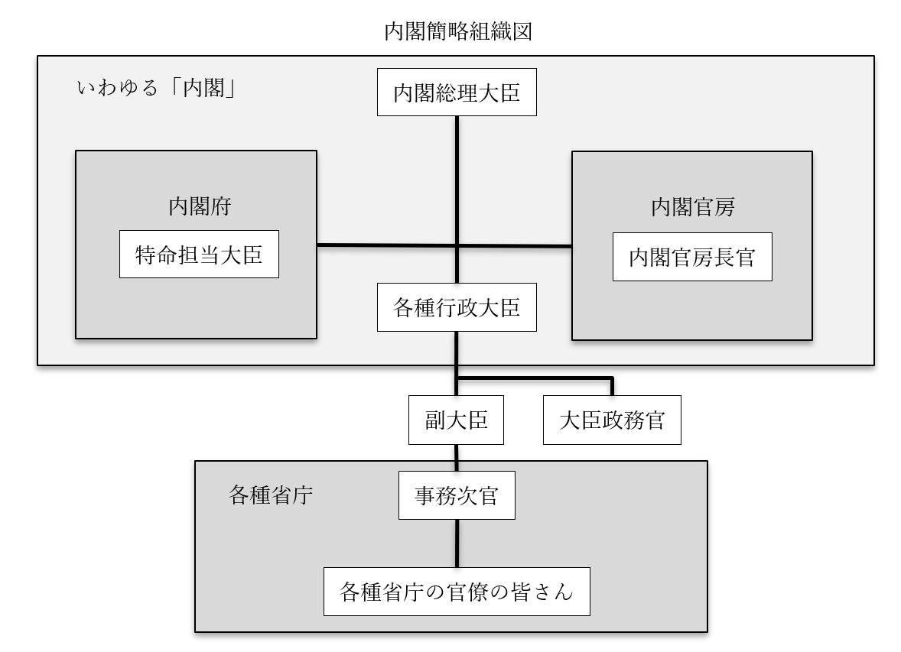

# 行政府（内閣）
## ●授業動画一覧
|||
|:----:|:----:|
|行政府1／概要1(三権分立関係)|[YouTube](https://youtu.be/9V4LxUEEe-4)|
|行政府2／概要2(成立と消滅)|[YouTube](https://youtu.be/1mldn1k5jf0)|
|行政府3／構造1(概要と首相)|[YouTube](https://youtu.be/Oscp05J6nn0)|
|行政府4／構造2(国務大臣)|[YouTube](https://youtu.be/HESMMCMdVHI)|
|行政府5／構造3(内閣府と内閣官房)|[YouTube](https://youtu.be/5wUe65-UG8Q)|
|行政府6／機能(法の執行)|[YouTube](https://youtu.be/x8Py9Zc9UVs)|
|行政府7／機能(その他)|[YouTube](https://youtu.be/XFZlSWP07TM)|
## ●行政府（内閣）の概要  
・基本的に復習ゾーン  
  
### ○三権分立関係：国会との関係と議院内閣制  
・議院内閣制を採る為、内閣は国会の信任によって成立する  
・具体的には【衆議院】の信任によって成立する  
・尚、内閣総理大臣は日本国憲法六十七条によって【国会議員】でなければならないと規定されている  
⇒もうちょっと具体的に言うと、憲法六十七条によって、【国会議員】の中から【国会】の議決で指名される、と決まっている  
  
・国会の中でも【衆議院】は、【過半数】の賛成によって内閣に対し【不信任】決議を行える  
・不信任が決議された場合、内閣は【十日】以内に衆議院を【解散】するか、または【総辞職】する  
⇒この辺の不信任周りについては、日本国憲法六十九条に記載がある。また、総辞職については、日本国憲法六十六条にも記載があって、そこには「行政権の行使について、【国会】に対し【連帯】して責任を負ふ」とある。これを嚙み砕いて言うと、「お前ら内閣は、国会の信任があるからこそ、統治権を行使していいってなってる訳よ」「だから国会の信任を失ったら連帯責任で全員辞めろ」という話  
※尚、内閣総理大臣は、任意の時期に（不信任とか関係なく、好きな時に）衆議院を解散する事もできる。こちらは日本国憲法七条に基づいている  
  
  
### ○三権分立関係  
・司法に対しては、内閣は最高裁判所【長官】の【指名】を行える  
※日本国憲法六条に基づく。任命は、天皇の国事行為の一つ  
・また、最高裁判所【裁判官】の選考と【任命】も内閣が行う  
※こちらは日本国憲法七十九条に基づく  
・一方で、裁判所は【違憲行政審査】を行う事ができる  
  
  
### ○成立と消滅  
・基本的に、以前の内閣が総辞職した直後、国会で内閣総理大臣が指名されて成立する  
・いつ総辞職するかは既に図で見たので、ここではざっくり箇条書きに  
１：【衆】議院で【内閣不信任】が決議され、【十】日以内に衆議院を解散しなかった時  
２：【衆】議院の【解散】総選挙後【三十】日以内に開かれる【特別】国会の冒頭  
３：【衆】議院の【任期満了】総選挙後【三十】日以内に開かれる【臨時】国会の冒頭  
４：内閣総理大臣が何らかの理由で欠けた時  
⇒これらの後、内閣が総辞職して次の内閣総理大臣指名、内閣成立、となる  
  
・衆議院の優越の関係で、基本的には衆議院で過半数を取った政党の人間が総理大臣に指名される  
・単独で過半数を取れる政党がいない場合、複数の政党が協力して内閣を作る場合もある  
⇒いわゆる［連立］内閣  
  
## ●行政府（内閣）の構造  
### ○概要  
・普通、三権分立に於ける行政権を司るのは、と問うと「内閣」と答えが来る  
・それはそれで正解なのだが、国会や裁判所と違い、内閣≒行政府という事は抑えておきたい  
  
・行政府は、【内閣総理大臣（首相）】の下に【国務大臣】、そして大臣の下に【省庁】を従えている  
⇒単純に「行政府」と言うと、内閣だけを想定しがちだが、厚生労働省や警察庁のような省庁も行政府の一種である  
・また、一口に「内閣」と言っても、内閣官房や内閣府といった組織が付随している  
  

  
※一般に「内閣」と呼ばれるのは、「内閣総理大臣＋各種行政大臣＋内閣府＋内閣官房」  
※図では省略したが、内閣官房長官や特命担当大臣の下にも無論、部下がいる  
  
  
  
### ○内閣総理大臣  
・憲法六十六条によって、【文民】でなければならないと規定されている  
・憲法六十七条によって「【国会議員】の中から【国会】の議決で指名される」と規定されている  
※内閣総理大臣の任命は、天皇の国事行為  
  
・行政府の【首長】であり、国務大臣の【任免】権を持つ  
⇒内閣の意思決定は、内閣構成員による会議（いわゆる【閣議】）によって行われるが、これは［非公開］と［全会一致］を原則とする。内閣総理大臣は大臣の任免権を持っている為、全会一致が無理そうとなれば造反分子を免職すればよい  
※大日本帝国憲法下でも、非公開と全会一致の原則は一緒。但し内閣総理大臣は国務大臣の任免権を持っておらず、誰か一人でも反対が出たらもう総辞職するしかなかった。日本国憲法になって、国務大臣をクビにできるようになった  
  
・内閣総理大臣は、国会に［出席］する［権利］と［義務］を持つ  
⇒仮に内閣総理大臣が衆議院議員であっても、必要であれば参議院に出てよい…というような権利を持っている。また、国会で出席を要請された場合は、内閣総理大臣の出席は義務となる  
  
・内閣総理大臣は国務大臣の［訴追同意］権を持つ  
※言い換えれば、国務大臣は内閣総理大臣の同意がなければ裁判にかけられない  
  
・内閣総理大臣は、自衛隊の【最高指揮】権を持つ  
⇒自衛隊の最高指揮官が内閣総理大臣、普段から自衛隊を統括しているのが【防衛大臣】  
  
  
### ○国務大臣  
・国務大臣は【内閣総理大臣】によって任命される  
※この任命を認証するのも、天皇の国事行為  
  
・国務大臣の過半数は【国会議員】から選ばれなければならない  
・国務大臣の数は、原則【十四】人以内、最大【十七】人とされている  
※2001年の改正以来。その後、期間限定の大臣追加が何度か行われ、令和三年現在は原則十七人、最大二十人になっている  
  
・国務大臣として任命されると、続いて「君は○○大臣ね」という風に任命される  
⇒この二度目の任命では、「文部科学大臣」のように特定の省庁の長として任命される場合と、そうでない場合がある。前者を行政大臣、後者を無任所大臣と呼ぶ  
  
・行政大臣の下には［副大臣］と［大臣政務官］がいて、大臣を補佐する  
・副大臣の下には、官僚の最高位として事務次官がいて省庁の官僚全てを統括している  
例：文部科学大臣⇒文部科学副大臣⇒文部科学省事務次官⇒文部科学省の官僚の皆さん  
  
・現代の日本では、無任所大臣は原則、特命担当大臣として内閣府に所属する  
特命担当大臣例：沖縄及び北方対策担当大臣、少子化対策担当大臣、男女共同参画担当大臣  
### ○内閣府と内閣官房  
・どちらも、複数の省庁にまたがる必要のある仕事をする、という点では一緒  
  
・特命担当大臣が所属しているのが内閣府  
・主に、「政権が変わっても継続してやらねばならない仕事」を扱う  
⇒先に出した、特命担当大臣の例を見ると何となく分かる筈。例えば「沖縄及び北方対策担当大臣」というのがあったが、日本の領土問題は当然、政権が変わっても継続してやらねばならない仕事。少子化対策担当大臣等も同様である  
  
・内閣総理大臣の右腕として、傍で補佐する役割を担うのが内閣官房  
⇒内閣官房長官が総理大臣の代弁者として記者会見してる姿をよく見る筈だが、要は、内閣官房という総理大臣の右腕となる存在の首長だからそういう位置づけになる  
※内閣官房には、官房長官以外にも総理大臣補佐官や内閣危機管理官等がいる  
・内閣官房は、その時の内閣総理大臣の目玉となる仕事を担当する事が多い  
例：第二次安倍政権の働き方改革は、内閣官房主導で行われた  
  
  
## ●行政府（内閣）の機能  
・行政府（内閣）の機能を一口で言えば「行政権の行使」となる  
・実際のところ、この「行政権」を具体的に言うと多岐にわたる  
・基本的には、「立法と司法以外全部」と思った方がいい  
・以下、代表的なものを挙げる  
  
  
### ○［法律］の執行  
・法律で「こうしなさい」と決まった事を実際にやる事。また、その為の命令を出す事  
※米国と違って、日本の内閣は法案を［拒否］する権利は持たない  
  
・警察も実は行政府の所属  
⇒「この人多分、（刑）法が適用される人だと思うんですけど」と言って、証拠と一緒にその人を検察に引き渡す、法の執行機関が警察。法の執行機関という事はつまり、行政府  
  
・法の執行機関としては、［行政委員会］というものもある  
・【内閣】の指揮下にある一方で、ある程度の独立性も有するのが特徴  
・規則制定等の［準立法］的機能を持つもの、処罰の決定等の［準司法］的機能を持つものも多い  
例１：【公正取引委員会】。詳しくは経済分野でやるが、【独占禁止法】に違反するような、不公正な企業活動を監視、捜査する。更に、捜査の結果「クロ」となれば処罰を申し渡す、準司法的権限も持つ  
例２：【国家公安委員会】。警察が暴走しないように監視する、御目付役。例えば、国民は警察の職務質問に答える義務を持たない（人身の自由でやったように、強制的な捜査には令状が必要）が、答えないと警官が複数でその人を囲んで動けなくする等、不適切な行動に出る場合がある。そういう時連絡する先が国家公安委員会である（弁護士に連絡してもいいが）  
  
  
### ○予算案の［作成］と［提出］  
・そのまんま、来年度予算の作成と提出を行う  
・提出するのは【通常国会】。詳しい話は前節をどうぞ  
  
  
### ○［外交］  
・基本的に、外交は行政府がほぼ一手に担っている  
※天皇による外交とかもあるが、その辺の手綱は内閣が握っている  
・【条約】を【締結】するのも内閣の機能の一つ  
  
・条約の成立までの流れは以下  
１：【内閣】が条約を【締結】  
２：【国会】が条約を【承認】（ここで条約が成立する）  
※詳しくは前節。１の前に［やってもいい］  
３：［内閣］が条約を［批准］する（成立の確認）  
４：締結国間で、［批准書］を交換する（条約が国際的な効力を持つようになる）  