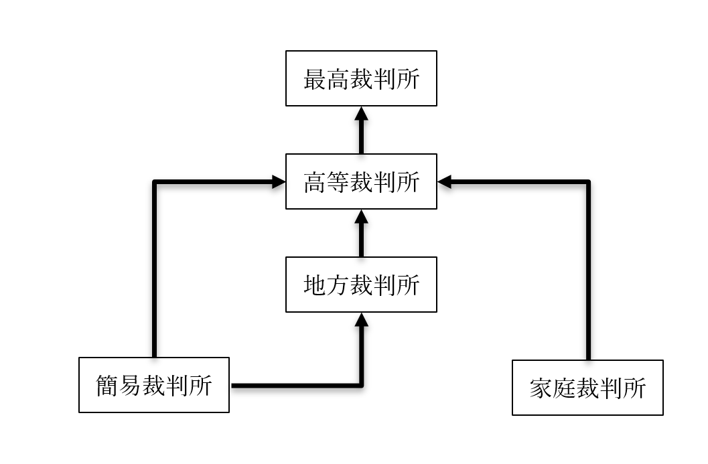

# 司法府（裁判所）

## 授業動画一覧
[本節の授業動画はこちら](LIST.md#司法府裁判所)  

## ●司法府（裁判所）の概要  
### 〇概要の概要  
・ざっくり言えば、司法権とは「裁判を行う権力」  
・もう少し言えば、法の適用を独占する権力である  
⇒行政府（内閣）が行うのは、「法の執行」。法律で「こうしなさい」と決まった事を実際にやる。司法府（裁判所）は、「結局この場合、この法律を適用するの？　しないの？」という時に「適用しろ」「適用するな」という判断を下せる存在  
  
・【三審】制を採用しており、一つの案件について、原則三回まで裁判を行える  
※最初にやる裁判を一審、二回目にやる裁判を二審、というように呼ぶ場合もある。また、「これが最後の裁判。ここでの判決が最後だからね」という意味で、終審という用語を使う場合もある  
※一審から二審へ訴える事を【控訴】と言う。その為二審を【控訴】審と言う場合もある。同様に、二審から三審（終審）へ訴える事を【上告】と言い、三審を【上告】審と呼ぶ場合もある  
例：一審⇒気に入らない⇒控訴⇒二審（控訴審）⇒気に入らない⇒上告⇒三審（終審、上告審）  
  
  
### 〇裁判所（司法府）の権限  
・憲法［七十六］条１項により、司法権は原則、裁判所が独占している  
  日本国憲法第七十六条　すべて司法権は、［最高裁判所］及び法律の定めるところにより設置する下級裁判所に属する。  
  ２　【特別裁判所】は、これを設置することができない。行政機関は、終審として裁判を行ふことができない。  
  
・上記の条文により、法の適用ができるのは原則、裁判所だけとなった  
※例えば警察は、司法機関ではない。「この人多分、（刑）法が適用される人だと思うんですけど」と言って、証拠と一緒にその人を検察に引き渡す行政機関である。検察も行政機関で、「うん、やっぱりこの人（刑）法適用せんとあかんわ」と確認して、証拠と一緒にその人を裁判所に連れていくの仕事。「じゃあ刑法〇条適用！　懲役〇年！」という形で、法の適用を判断できるのは裁判所。そしてもし懲役●年と決まったとしたら、その人を刑務所に入れる訳だが、その刑務所は行政府の管轄。行政府は「法の執行」（法律で決まった事を実際にやる）、司法府は「法の適用」（法律で決まった事を実際にやるかどうか決める）、という役割分担である  
  
・また、２項によって、大日本帝国憲法では設置されていた【特別裁判所】がなくなった  
※皇室裁判所、軍法会議等の、【最高裁判所の指揮下にない】裁判所を特別裁判所と呼ぶ  
  
・ところで、先程「憲法［七十六］条１項により、司法権は原則、裁判所が独占している」と言った  
・原則と言うからには基本、例外がある  
・その例外が２項。「行政機関は、終審として裁判を行ふことができない」という部分  
・これはつまり、「行政機関が裁判をやっていいよ」「但し終審は裁判所がやりますよ」という事  
例：行政府（内閣）でやった公正取引委員会は、独占禁止法関係に限り、裁判所に代わって裁判（のような事）ができる。一方で、公正取引委員会の言い分が不服な場合の異議申し立ては、裁判所へと持ち込まれる。当然、最終的な判断（終審）も裁判所がやる事になる  
  
## ●司法府（裁判所）が扱う案件の種類  
・裁判所と言うからには、裁判所が扱うのは裁判である  
・ただ一口に裁判と言ってもいくつか種類があるのでご紹介  
・大きく分けて【刑事】裁判、【民事】裁判、【行政】裁判がある  
  
  
### 〇刑事裁判（刑事事件）  
・いわゆる【犯罪】があったと思われる場合に行われる裁判  
※犯罪は、刑法等の「刑罰が定められた法に触れる行為」と思うといい  
・基本的には、【被告（人）】対【検察（官）】という図式で行われる  
※被告は普通素人なので、被告の味方として、弁護士が【弁護人】としてつく  
  
・政治分野第二章でやった、日本国憲法［第三十七条］関係の権利は、この刑事裁判が対象  
⇒「［公平］な裁判所の［迅速］な［公開裁判］を受ける権利」と「［弁護人］を依頼する権利」  
  
・基本的には、以下の順序で刑事裁判へと至る  
１：まず、警察が捜査して犯人と思しき人（被疑者）を特定する  
２：警察は、「この人が犯人でしょう。証拠はこれ」と検察に伝える（いわゆる送検）  
３：検察は、改めて調査した上で起訴する（裁判に訴える）かどうか決める  
４：起訴した時点で被疑者は【被告（人）】へと変化し、刑事裁判が始まる  
※３の時点で、「やっぱり起訴しない」となった場合がいわゆる不起訴。ただ不起訴にも二種類あって、「起訴すればまず有罪にできるけど微罪だし、別にいいか…」がいわゆる起訴猶予、「これは起訴しても無罪になるでしょ」がいわゆる嫌疑不十分  
※検察は、［公益］を代表して犯罪を捜査し、犯罪を立証し、以って刑事裁判に訴える権利を与えられている。その為、刑事裁判に訴える事を［公訴］、刑事裁判を［公判］と呼ぶ事もある  
  
～ちょっと雑談～  
　起訴猶予と嫌疑不十分、どちらも前科はつかないが、代わりに前歴がつく。と言っても、嫌疑不十分なら社会的に「裁判で無罪を勝ち取った人」とほぼ同等と扱われる。しかし起訴猶予は、社会的に前科者と同等に扱われてしまう。  
　それだけならいいのだが、現代日本の刑事裁判の問題として、「起訴猶予の場合、裁判によって身の潔白を証明できない」というものがある。現代日本の法制だと、起訴するかどうかは検察が決める。その検察が「起訴猶予」と言ったら、被疑者の方は「何言ってんだ俺は無罪だ、裁判で白黒つけようぜ」と言っても裁判にならないのである。  
　一応、犯罪被害者や告発者であれば、不起訴になった時は検察審査会というのに申し立てる事もできるのだが、被疑者はここへの申し立てもできないという構造になっている。  
～ちょっと雑談終わり～  
  
  
  
### 〇民事裁判（民事事件）  
・私人間の争いについての裁判をこう呼ぶ  
※私人は、私法の時と同じく「一般市民」や「民間企業」を指すと思ってよい  
・基本的には、【原告】対【被告】で行われる  
※告発（起訴）した方が原告（告発の源）、告発された方が被告  
  
  
### 〇行政裁判  
・国や地方公共団体を、国民が訴える場合はこれになる  
・基本的には、【原告（国民）】対【被告（国、地方公共団体）】という形で行われる  
⇒もう少し詳しく言えば、国の行政府や地方公共団体の行政行為、これによって権利を侵害された国民が裁判に訴えるもの。だから行政裁判と呼ぶ。尚、「被告（国）」の国は、「国の行政府」を指す  
  
・例としては、政治分野第二章でやった朝日訴訟  
～ここから引用～  
・生活保護を受けていた人が、現行の生活保護による支給額では「最低限度の生活」ができないと提訴  
※起訴したのは1957年で、当時の生活保護の支給額は600円。これは、原告の請求を棄却した（支給額600円は合憲とした）高等裁判所も、その判決で「日用品費月600円はすこぶる低い」と言うぐらいには低かった。この為、支給額の増額を求めて提訴したのが朝日訴訟である  
～ここまで引用～  
⇒生活保護法を作るのは立法府（国会）だが、実際に生活保護として貧困者にカネを支給するのは行政府。つまり、「生活保護でカネを支給する」という法の執行は、法の執行者たる行政府の仕事であり、行政行為。その行政行為で生存権を侵害された、として裁判に訴えたのが朝日事件なので、これは完全に行政裁判  
  
  
### 〇一つの事件から三種の裁判を見る  
・仮に、ある人が自動車を運転中、他人を轢いてしまったとする  
・この場合、三種の裁判全てに派生する可能性がある  
  
・まず、自動車運転処罰法違反や道路交通法違反によって、刑事裁判にかけられる可能性がある  
※自動車運転処罰法は、いわゆる危険運転致死傷罪のような「刑罰」が規定されている法律  
  
・続いて、轢かれた人に訴えられて、民事裁判に発展する可能性がある  
⇒轢いた人が刑事裁判で有罪になっても、轢かれた人は気分がスッキリするだけ。治療費とかを搾り取りたかったら、民事裁判に訴える必要がある。勿論、民事裁判にまでは発展せず、話し合いによって「治療費として〇〇円を支払います」というような取り決めが行われる場合もある。こういうものを示談と言う  
※ちなみに、示談する場合も必ず弁護士に連絡して間に入って貰った方がいい。その場で約束だけして踏み倒すというのは割とよくある  
  
・また、轢いた人は、運転免許取消等の行政による処罰（行政処分）を受ける場合がある  
※運転免許を管理しているのは、行政府でやった国家公安委員会である  
・この行政による処罰という行為が不服な場合、轢いた人は行政裁判に訴える事になる  
  
## ●司法府（裁判所）の構造  
・【最高】裁判所が最も偉く、これ以外の裁判所は【下級】裁判所と呼ばれる  
・全ての下級裁判所は、最高裁判所の指揮下にある  
・下級裁判所には、【高等】裁判所、【地方】裁判所、【簡易】裁判所、【家庭】裁判所がある  
※細かい話を言えば、［特許］や［著作］権を扱う［知的財産高等］裁判所なんかもあるにはある。が、基本的には前記の四種類だと思ってよい。実際、知的財産高等裁判所も、更に細かい話をすると東京高等裁判所の支部であり、「別口で数える必要があるか？」と言うと微妙  
  
・現代日本の司法府は三審制を採用しており、原則三回の裁判が受けられる  
・次の図を見ながら、どの裁判所がどの審判を担当するかをチェックしよう  
  

  
・普通は【地方】裁判所で一審、【高等】裁判所で二審、【最高】裁判所で終審となる  
  
・仮に有罪だとしても［軽微］な罪にしかならない刑事事件の場合、一審が【簡易】裁判所となる  
・もしくは、［少額］の民事事件の場合、一審は【簡易】裁判所となる  
・刑事事件の一審を簡易裁判所でやった場合、控訴先は［高等］裁判所となる  
・民事事件の一審を簡易裁判所でやった場合、控訴先は［地方］裁判所となる  
※この場合、終審は高等裁判所となる  
  
・少年犯罪や、離婚等の家庭内問題の場合、一審が【家庭】裁判所となる  
・一審を家庭裁判所でやった場合、控訴先は［高等］裁判所となる  
  
  
  
  
## ●司法の独立と裁判官の身分保障  
### 〇司法の独立  
・司法府たる裁判所は、場合によっては行政府や立法府にNOを突き付ける場所である  
⇒違憲立法審査や違憲行政審査はまさにそう。立法府が作った法律に「憲法違反です。無効」と言ったり、行政府の行政行為に「憲法違反です。やめろ。あと賠償しろ」と言ったりせねばならない  
・そういう場所である以上、他の権力によって判決が左右されるような事はあってはならない  
・こういう、「司法府が第三者によって影響されない」という事を【司法の独立】と言う  
  
・司法の独立は、日本国憲法七十六条の３項に明記されている  
  第七十六条３項　すべて裁判官は、その［良心］に従ひ［独立］してその職権を行ひ、この［憲法及び法律］にのみ拘束される。  
・この条文から、司法の独立に二種類あると考えられる  
⇒【対外的独立性】と【対内的独立性】  
  
・対外的独立性は、司法府以外の権力による影響を排除するもの  
・分かりやすいところで言うと、戦前の例ではあるが大津事件がある  
～ここから引用～  
　大日本帝国憲法下の司法の独立についてよく挙げられるのが［大津事件］である。明治の、日清戦争すらまだ起きていない時期のアジアの小国日本を訪問していた超大国ロシア帝国の皇太子が、警備にあたっていた日本の警官に斬りつけられたという事件である。後に日露戦争で勝つとは言え、当時の日本は、ロシアの前では吹けば飛ぶような弱小国である。当然、政府は司法に対し圧力をかけたが、裁判長の児島惟謙は「法治国家として法は遵守されなければならない」として、法に則った判決を行っている。このように、実際の運用に於いては、戦前も司法は概ね独立していたと言える。  
～ここまで引用～  
  
※無論、現代日本は権力分立によるチェック・アンド・バランスを採用しているので、立法府も行政府も、司法府に圧力をかける（チェックする）手段を憲法で保障されてはいる。これは逆に言えば、憲法に書かれた手段以外では、一切、司法府に圧力をかけてはならないという事でもある  
  
・対内的独立性は、司法府内部での影響を排除するもの  
例：ある裁判官が、上司から「この案件は有罪にしろ」と圧力をかけられる  
⇒実例としては、政治分野第二章でやった長沼ナイキ訴訟で、司法の独立が侵害された事件があった。長沼ナイキ訴訟そのものは、自衛隊の存在が合憲か違憲かという争点について、一審が初めて違憲判決を出した事件として有名だが…実は、一審で裁判長を務めた人が、地方裁判所所長から「合憲判決を出せ」と圧力をかけられていた。彼はこの圧力を跳ねのけて違憲判決を出したが、以後、閑職に回されて二度と裁判長を務める事はなかった  
※長沼ナイキ訴訟では、司法の独立が見事に侵害されてしまった。が、一応憲法上は、こういう事をしてはいけないという事になっている  
  
  
### 〇裁判官の身分保障概説  
・司法の独立を達成する為には、裁判官の身分が充分に保障されていなければならない  
⇒「判決の内容によってはクビになるかも…」というような程度の身分保障だった場合、司法の独立も裁判所の機能も何もなくなってしまう  
・日本国憲法七十八条にも、その旨が書かれている  
  日本国憲法第七十八条　裁判官は、裁判により、心身の故障のために職務を執ることができないと決定された場合を除いては、公の弾劾によらなければ罷免されない。裁判官の［懲戒］処分は、［行政］機関がこれを行ふことはできない。  
  
・こういった事情から、裁判官の身分保障は非常に厳格である  
・今回は、裁判官の身分保障を「選定、任命」と「罷免」から見ていく  
  
  
### 〇裁判官の選定、任命  
・最高裁判所【長官】は、内閣によって【指名】される。任期は無し（終身）  
※任命は天皇の国事行為  
・また、最高裁判所【裁判官】の選考と【任命】も内閣が行う  
  
・下級裁判所裁判官については、【最高】裁判所が名簿を作り、これに従って内閣が任命する  
・下級裁判所裁判官の任期は【十年】  
⇒と言っても再任されるのが原則なので、基本的には定年まで裁判官をやる事になる  
  
  
### 〇裁判官の罷免  
・裁判官が罷免されるのは、以下の三つの手段による  
１：【国民審査】（【最高】裁判所裁判官のみ）（長官を含む）  
２：【弾劾裁判】（【国会】に設置される【弾劾】裁判所による）  
３：［分限裁判］（裁判所内部で開かれる）  
  
・国民審査をやる時期は、以下の通り  
１：任命後初めての【衆】議院議員選挙  
２：１から【十】年以上経過した後の、初めての【衆】議院議員選挙  
  
・弾劾裁判と分限裁判で裁判官が罷免される理由は、主に以下の三つ  
１：職務上の［義務］に著しく違反し、又は職務を甚だしく［怠った］とき  
２：その他職務の内外を問わず、裁判官としての威信を著しく失うべき［非行］があったとき  
３：回復の困難な［心身］の故障  
※仮に、ある裁判官が重い病気になって、「これはもう仕事できないなぁ」となったとしても、それでも罷免するなら裁判は開かなければならない。それぐらい身分保障が厳格になっている  
  
## ●違憲審査  
### 〇現代日本の違憲審査権の概要  
・現代日本の司法府は、【違憲審査】権を認められている  
⇒憲法は、国の【最高法規】。例えば、法律に書いてある事と憲法に書いてある事が矛盾している場合、法律に書いてある事が無効になる。現代日本の司法府は、この「矛盾しているかどうか」の審査ができる  
  
・【違憲立法】審査、【違憲行政】審査のどちらも認められているとされる  
・下級裁判所を含［む全ての］裁判所に違憲審査権があるとされている  
⇒最高裁判所は特に［憲法の番人］などと言われている  
  
  日本国憲法第八十一条　最高裁判所は、一切の【法律】、命令、規則又は処分が憲法に適合するかしないかを決定する権限を有する終審裁判所である。  
  
・「法律」  
⇒法律が違憲かどうか調べる権力がある、と解釈される。つまり違憲立法審査権がある、と解される  
・「命令」  
⇒法律に基づいて、もしくは法律で決まっていない事を命令として出すのが行政府の仕事。その命令が違憲かどうか調べる権力がある、と解釈される。つまり違憲行政審査権がある、と解される  
・「終審裁判所である」  
⇒終審と言うからには、一審、二審があると想定していると思われる。つまり、一審二審を担当する下級裁判所にも違憲審査権がある、と解される  
  
  
### 〇通常裁判所型と憲法裁判所型  
・現代日本の違憲審査は、通常の裁判所によって行われる  
・類型としては、米国と同じ  
※と言うか、日本国憲法を作る時に米国から輸入した  
  
・逆に、ドイツ等では伝統的に、特別な裁判所（【憲法】裁判所）を設けてそこにやらせている  
・現代でも、フランス共和国やイタリア共和国で採用されている  
  
・憲法裁判所型の違憲審査の場合、「そもそもこの法令は合憲か違憲か」というような抽象的な審査をする  
・この場合、違憲と判断された法令は、直ちに全て無効となる  
⇒こういうのを、【一般的効力説】と言う  
※違憲と判断された法令は、一般に無効となる、というところから命名  
  
・逆に、通常裁判所による違憲審査の場合、具体的な事件を前提とする  
⇒「こういう事件があった訳だけど…原因になったこの法令、よく考えたら違憲じゃない？」というような形で合憲か違憲かを審査する  
・この場合、仮に違憲判決が出ても、その法令は全て無効とはならない  
⇒当該事件でのみ法令を無効とする。こういうのを、【個別的効力説】と言う  
※個別の事件で無効となる、というところから命名。勿論、当該事件のみとは言っても似たような訴訟を起こされたらまた違憲判決が出かねないので、違憲判決後は普通、法令の改正が行われる  
## ●司法制度改革  
・従来から、日本の司法制度には大きな問題があると指摘されてきた  
  
例１：長すぎる裁判  
⇒特に刑事事件については「迅速」と憲法に書いてある割に、戦後日本の裁判は異常に長くかかる。長い例を挙げれば、かつて日本で革命を起こさんとした新興宗教オウム真理教の刑事裁判。1995年に教祖が逮捕されてから、全ての刑事裁判が終わるまで二十三年かかっている  
  
例２：法執行機関の不適切な捜査とそれを容認する裁判所  
⇒「逮捕や起訴をされても、判決が出るまでは罪人として扱わない」「自白を第一としてはならず、物的証拠に基づかなければならない」というような原則は、高校の公民でやる知識である。しかし、警察や検察がどうも、そういった知識を持っていないのではないかというような事をする場合が多い  
例：容疑者を逮捕したとして、原則すぐ解放せねばならない。ずっと逮捕して勾留したままにしてもいいのは、よっぽど逃亡する恐れがあるとか、証拠隠滅の恐れがある時だけで、裁判所の許可も必要。…なのだが、現実には、明らかに逃げる恐れがなくとも、罪状を否認する限り解放しない事が多い。長期間拘束して自白を強要し、そのまま有罪に持っていく訳である。裁判所も、「長期間勾留したい」と言われると右から左へ許可を出してしまう。勾留されている方も、一ヶ月近く拘束されていると会社をクビになるかもしれないし、無実であっても自白して解放を選択し、そのまま有罪になる事が多い  
  
例３：高過ぎる弁護士費用  
⇒そのまんま。特に2004年までは弁護士報酬規程というのがあって、これに準ずると高額の民事事件なんかはかなり高くなった。当然、貧乏人が弁護士を頼むのも難しかった  
  
・こういった数多くの問題を解決するべく、1999年から司法制度改革が進んだ  
・その多くは失敗に終わっているが、本節ではどのように改革されたのか見てみよう  
  
  
  
### 〇法科大学院（ロースクール）と弁護士過剰  
・現代国語では、弁護士、裁判官、検察官の三種を合わせて法曹と呼ぶ  
・この法曹人口を増やそうというのは、司法制度改革の柱の一つ  
・その目玉として投入されたのが、［法科大学院（ロースクール）］である  
⇒法科大学院が開設されたのは2004年  
  
・普通の大学生は、学部を四年で修了して学士を取る  
・法科大学院の場合、学士を取った後入学する  
・二年～三年で修了し、法務博士というものを取る  
・同時に、司法試験の受験資格を得る  
※法科大学院に行かずとも、一応、予備試験というのを受ければ司法試験の資格は取れる。ただ、制度の基本としては「法科大学院出て司法試験受けるのが本流」というもので、また、法科大学院を作った時は「法科大学院を出れば、八割ぐらいの人は司法試験に受かります！」と宣伝していた  
  
・司法試験に合格すると、弁護士、裁判官、検察官のどれかになれる  
⇒裁判官と検察官は公務員なので、採用人数は決まっている。裁判官にも検察官にもならないなら弁護士になる、という感じ  
※厳密に言うと、司法試験合格の後も司法修習生考試というのがある  
  
・この改革の結果、司法試験の合格者数が増えた  
・その割に、政府は裁判官と検察官の採用人数を増やさなかった  
・結果、弁護士だけが異常なまでに増えた  
  
・その結果どうなったかと言うと、いわゆる過当競争が発生した  
⇒弁護士の数が増えただけで、弁護士を雇いたいという人の数は別に増えなかった。となると「弁護士の仕事の数は同じ」なのに「弁護士の数だけ増えた」状態で、仕事の取り合いとなり、弁護士の生活環境は急激に悪化した。基本的に、司法試験に合格した時点での年齢は二十八歳後半なのだが、にも拘らず、「弁護士資格は取りましたが、就職できません」「昨年は弁護士初年度でしたが、弁護士としての収入はゼロでした。バイトで生きてました」みたいな例が大量に発生した  
⇒しかも、弁護士費用も別に、言うほど下がらなかった。元々、弁護士は大抵の場合、暴利をむさぼっていた訳ではなかった。「弁護士を雇う」という行為そのものがどうしたってカネかかるものに過ぎなかったのである。弁護士の数が増えれば競争が発生して価格が下がるかに思われた（この辺の細かい市場原理の話は経済分野で）が、別にそんな事はなかった  
  
・この結果、法科大学院入学者や司法試験受験者は減り続けている  
・2020年には、ついに司法試験の合格者が旧司法試験よりも低い数となった  
※2020年の合格者数は1450人。法科大学院導入前だと、例えば2004年の合格者数は1483年。ついに事態はここまで来てしまった…  
  
  
### 〇法テラス  
・弁護士費用というものはどうしても高い  
⇒当たり前の話で、実際に訴訟するともなれば、専門家を数ヶ月～数年間拘束するのである。しかも、生半可な専門家ではない。弁護士になるには、普通の大学生より二、三年多く大学に通い、更に複数の難しい試験を突破してようやくである。弁護士になる頃には、三十代が見えている。そんな専門家を長期間拘束して、安く済む筈がない  
  
・その為、従来の日本では、法的な問題が発生した時、弁護士に相談する人は少なかった  
・大抵は行政機関（村役場とか）とか、警察に相談していた  
・しかしそれが私人間の事であれば、基本的に行政機関は「知らん」である  
・警察にしても、犯罪でもない限りは「そんな事を言われても」である  
・本来はこういう時、弁護士に相談しなければならないのだが、連絡の取り方も分からないし何より高い  
・結果、泣き寝入りする人が多かった  
  
・このような問題を解消するべく導入されたのが［法テラス］である  
※正式には日本司法支援センターと言う  
・刑事民事を問わず、無料で法律相談に乗ってくれる  
・また、適切な弁護士を紹介してくれたり、弁護士費用の立替もしてくれたりする  
・法的な問題で困った時はまずここに電話する、でもいいぐらいの優良施策である  
  
※一般国民からすると信じられないぐらいの優良施策だが、弁護士からすると嫌われている部分もあるようだ。何せ司法改革でできたものなので、当然、弁護士の生活が苦しくなったのと同時期にできたもの。そして、法テラスで受けた案件は、大抵赤字のような低価格で受ける事になる…という事で、できれば関わり合いになりたくないと思う弁護士は多いようである  
  
  
### 〇裁判の迅速化  
・現代日本の裁判は、とかく時間がかかる  
※実際には諸外国の裁判もかなり時間がかかるのだが、一般の感覚として時間がかかりすぎなのは事実  
・司法制度改革に於いてはここも重視され、2003年には［裁判迅速化］法が制定されている  
・この法律では、一審はできるだけ［二年］以内に終わらせるようにと定められている  
  
・尚、現実には、相変わらずやたらと時間がかかる  
・結局、現代日本の場合、裁判官の数が足りていないのである  
⇒一般に、裁判官は一人で二百以上の案件を常時抱えていると言われている。そら遅いわ。法科大学院を作った時に、一緒に裁判官の採用人数を増やせばよかったのだが…結局裁判官も公務員である。そして、国民は「無駄を省け」「公務員の待遇を悪くしろ」「公務員を減らせ」が大好きである。結局、何をどうしたって「民間企業の社員は劣悪な待遇で働いてるんだから公務員も苦しめ」という考え方は駄目なのだ  
  
  
### 〇裁判員制度  
・言ってみれば、かつての日本の判決は全て、専門家によって行われているものだった  
・いくら公開裁判と言っても、裁判官は国民に選ばれた訳でもなし、どうしても密室という感はある  
・そこで導入されたのが裁判員制度。国民も裁判の判決に参加する  
  
・この手の制度は二種類ある。【参審制】と【陪審制】  
・陪審制は、有罪か無罪かの判断を【民間人】が行い、量刑の判断を【裁判官】が行う  
⇒米国等で行われている  
・参審制は、有罪か無罪かの判断、量刑の判断共に【民間人と裁判官】が共同で行う  
⇒フランス等で行われている  
・司法制度改革で現代日本へ導入されたのは、【参審制】である  
  
・現代日本の裁判員制度が実行されるのは、【地方】裁判所のみである  
⇒地方裁判所の、重大な【刑事】事件の時のみ、裁判員制度が適用される  
・裁判員制度適用となると、有権者から無作為に［六］名が選ばれる  
・前記の六名と、専門の裁判官【三】名で、協力して有罪無罪の判定や量刑を行う  
⇒基本的には、［過半数］で判決を決定する。但し、賛成の中に最低一人は裁判官が入っていなければならない  
  
・裁判員には出頭義務や［守秘義務］があり、破れば罰則が科せられる  
・辞退が認められる場合も、非常に限られている  
⇒この辺の制度設計がかなり滅茶苦茶なのが、裁判員裁判制度の最大の問題と言える  
例１：守秘義務が終身。つまり裁判員は生涯、裁判員として「評議の秘密」「職務上知り得た秘密」を口外できない。なので、「裁判員やった時こうこうこういう事があったから、ここは変えていった方がいい」というような話は基本出来ない  
例２：ただの一般人に、重大犯罪の判決をやらせている事そのもの。例えば、裁判官の仕事は、言ってみれば暴力団組員のような相手を有罪にして、後で報復されるかもしれないという仕事である。プロの裁判官は、そういう危険がある事を知った上で裁判官になっているからいいが、裁判員は強制的に集められた一般人である。実際、被告人の暴力団員が、裁判員に対し「あんたらの顔は覚えとるけね」と声をかけた（そして裁判員が集団で辞退を申し出た）という事件も発生している  
  
・尚、裁判員制度に合わせて［公判前整理手続］が導入されている  
・これは、裁判に入る前に、裁判官、弁護人、検察官が会議して、争点を整理しておくものである  
⇒従前の裁判は、裁判が始まってから証拠が提出され、議論があって、徐々に争点ができていくものだった。当然これだと時間がかかるし、分かりづらい。裁判員は素人だし、また本業がある訳だから短期間で裁判を終えたい。そこで、先に専門家同士である程度整理してから裁判を始めよう、という制度  
※尚、公判前整理手続は裁判の迅速化という観点も含めて導入されたものだが、この手続には平均七ヶ月かかるという事で、迅速化に貢献しているかと言われると微妙である