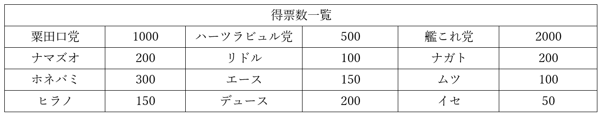
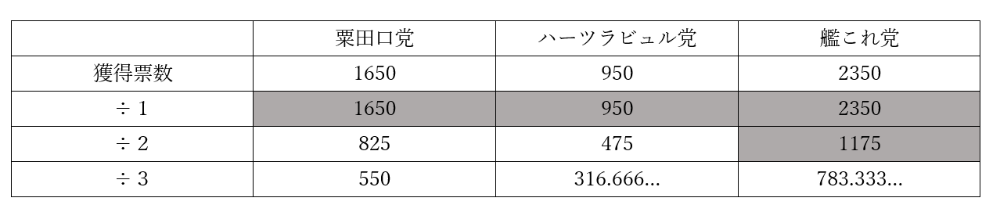

# 選挙制度
## ●授業動画一覧＆問題集リンク
|問題集|[ウェブサイト](https://teacheramesaka.github.io/hsworkbookcivics/tag/pol03_05/)|
|:----:|:----:|
|選挙制度1／選挙制度の原則|[YouTube](https://youtu.be/w-wezYw8efM)|
|選挙制度2／選挙概説|[YouTube](https://youtu.be/KQxmz2Iee3o)|
|選挙制度3／大・小選挙区|[YouTube](https://youtu.be/qgelABQdOZo)|
|選挙制度4／比例代表の概要|[YouTube](https://youtu.be/UPvo94yHfDk)|
|選挙制度5／比例代表の名簿式|[YouTube](https://youtu.be/JWWzk1oJGXc)|
|選挙制度6／衆議院議員選挙|[YouTube](https://youtu.be/p2G7YUI3zWo)|
|選挙制度7／参議院議員選挙|[YouTube](https://youtu.be/y5_QLb4mEt4)|
|選挙制度8／演習問題解説1|[YouTube](https://youtu.be/tvPFJKdVUg0)|
|選挙制度9／演習問題解説2|[YouTube](https://youtu.be/NP3qOujWMcs)|
|選挙制度10／演習問題解説3|[YouTube](https://youtu.be/73yHa6BZ1j8)|
|選挙制度11／公職選挙法あれこれ1|[YouTube](https://youtu.be/2TdyN5Ux72M)|
|選挙制度12／公職選挙法あれこれ2|[YouTube](https://youtu.be/CptDEtS7Kis)|
|選挙制度13／投票率あれこれ1|[YouTube](https://youtu.be/HdWqUtzoO3Q)|
|選挙制度14／投票率あれこれ2|[YouTube](https://youtu.be/W-0-8AIQgqE)|
|選挙制度15／選挙権あれこれ|[YouTube](https://youtu.be/V_IsZo58dQg)|

※8と9は選挙制度の問題演習  
## ●概要
・既に見たように、現代日本の選挙制度は四つの原則によって実施されている  
  
１：【普通選挙】  
⇒財産や性別、身分、教育等で制限せず、全ての成年者に選挙権を与える  
※日本国憲法【十五条】の［３項］に書いてある  
※何らかの形で選挙権を制限する場合は、【制限選挙】と呼ぶ  
  
２：【秘密選挙】  
⇒誰が誰に投票したか、という情報が秘密として守られる  
※日本国憲法【十五条】の［４項］に書いてある  
※誰が誰に投票したか公開される場合は、【公開選挙】と呼ぶ  
  
３：【平等選挙】  
⇒選挙権を持つ者は皆、同等の票を持つ（例えば全国民一人一票）。また、票の価値に差もない（金持ちの一票は貧乏人の票十票分の価値がある…とかそういう事が無い）  
※日本国憲法の［四十四条］にある  
※持てる票に格差があったり、一票の価値に格差があったりする場合は【不平等選挙】と呼ぶ  
  
４：［直接選挙］  
⇒選挙権を持つ国民が、候補者の選挙に直接参加する  
※日本国憲法に記載は無い。地方議会選挙、及び地方の首長選挙については記載されているが、国政選挙については無い  
※まず国民が選挙人を選び、選挙人が改めて選挙を行う…というような場合は［間接選挙］と呼ぶ  
⇒アメリカ大統領選なんかはこれ。一応日本でも、内閣総理大臣なんかは実質間接選挙で選ばれているとは言える  
  
・また、現代日本の選挙の原則として［自由選挙］を追加する場合もある  
⇒他者の思惑や権力、圧力で、投票先を強制されない選挙  
※日本国憲法に記載は無い。少なくとも明確に自由選挙を定めた文言は無い  
  
・尚、現代日本の選挙では、［任意投票］制が採用されている  
⇒投票するかしないかは自由。有権者の判断で投票しない（棄権）という選択もしていい  
※「投票は義務」「投票しなかったら罰則」という国もある。いわゆる［強制（義務）投票］制  
  
・ともあれ、本節では以後、こういった原則で行われる現代の国政選挙の制度について詳しく見ていく  
※現代日本の国政選挙は、衆参両院共に選挙区制と比例代表制を併用している。なのでまずは、選挙区って何だ、比例代表って何だ、というような話から進めていく  
※尚、実は選挙区制と比例代表制にも色々な種類があるのだが、本稿では戦後日本で使われている（いた）形式のみを解説する  
  

## ●選挙概説
・日本の社会科では一般に、選挙制度は「選挙区制」と「比例代表制」に分けて解説する  
・が、ここで別の考え方を基に考えてみよう  
  
・どんな選挙でも、「ここからここまでで一つの選挙区」とやる  
⇒横浜市が一つの選挙区、とか、神奈川県が一つの選挙区、とか、日本全体が一つの選挙区、とか  
・必ず、「ここからここまでが一つの選挙区です」「ここから●人当選させます」という形になる  
  
・その際、当選する人間をどうやって選ぶのか。主に三通りある  
［多数］代表制：その選挙区で最大多数を獲得した政党が当選の権利を独占する形式  
［少数］代表制：その選挙区で二位や三位になった政党にも当選の権利を与える形式  
【比例】代表制：その選挙区での得票数に比例して当選の権利を与える形式  
  
・多数代表制の選挙区では、一人だけが当選する  
⇒このような選挙区を一般に、【小選挙区】と呼んでいる  
・少数代表制の選挙区では、「得票数何位まで」と決まった、複数の人間が当選する  
⇒このような選挙区を一般に、【大選挙区】と呼んでいる  
・そして、比例代表制の事を、我々は一般に「●●選挙区」とは呼ばず、単に比例代表と呼んでいる  
  
・この三種の内、小選挙区と大選挙区は、制度として割と似ている  
⇒どちらも、立候補した政治家の名前を書いて投票する  
・一方比例代表制は、小選挙区や大選挙区とはかなり違う  
⇒そもそも、立候補した政治家の名前を書いて投票してはいけない場合もある  
  
・では以後、小・大選挙区制と比例代表制に分けて、細かく見てみよう  

## ●大・小選挙区制  
・一つの選挙区から一人しか当選しないのが【小選挙区】制である  
⇒現代日本の国政選挙では、【衆議院】議員選挙で採用。【参議院】も一部はこれ  
・一つの選挙区から複数人が当選するのが【大選挙区】制である  
⇒現代日本の国政選挙では、【参議院】議員選挙が一部これを採用  
※戦後日本では1994年まで、衆議院議員選挙に於いて大選挙区制が採用されていたが、これを特に［中選挙区］制と呼び習わしている  

  
  
### ○特徴  
・大選挙区の場合、その選挙区からは複数の候補者が当選する  
・故に以下の特徴を持つ  
１：【小政党】に有利で【大政党】だけが多数当選、は難しい（二位三位でも当選できる）  
２：１から、【小党乱立】が起きやすく、政局も【不安定化】しやすい  
３：【死票】が少なく済む  
４：【同士討ち】が起きる（複数当選する以上、同一政党から複数の候補者が出る）  
  
・小選挙区の場合、その選挙区で一位の得票数だった候補者だけが当選し、残りは落選する  
・故に以下の特徴を持つ  
１：【大政党】に有利で【小政党】に不利（弱小政党は一位取るのが厳しい）  
２：１から、【小党乱立】が防止されやすく、政局も【安定】しやすい  
３：【死票】が大量に出る（一位の候補者以外に投じられた票は全て、選挙結果に活かされない）  
４：【同士討ち】が起きない（同一政党の候補者による同士討ちが起きない）  
５：［ゲリマンダー］が起きやすい（後述）  
  
・基本的には、以下のように考えるとよい  
・大選挙区は［少数代表］制だから【公平】だがその分【小党乱立】になりがち  
・小選挙区は［多数代表］制だがその分政局が【安定】する  
※少数代表制とは、少数の人間にしか支持されていない候補者も当選できる制度。少数派の意見も政治に反映しやすくそういう意味では公平だが、その分小党乱立になりがちで、「この国いつも内閣総辞職しとるな」みたいな不安定な政局になりがち。多数代表制はその逆  
  
### ○ゲリマンダー  
  
  
ゲリマンダーの概念図。青丸は青党に投票する人の数、赤丸は赤党に投票する人の数と考えるといい  
https://commons.wikimedia.org/wiki/File:Gerrymandering_Comparison.png  
  
・先に出たゲリマンダーは、選挙区の区割りを、わざと特定の候補者や政党に有利なようにする事を言う  
・前掲図で言えば、左の区割りの場合、四つの選挙区全てで青党と赤党は八票ずつ獲得する  
・しかし、ゲリマンダーで右の区割りにすると、青党は三選挙区で勝利するようになる  
  
## ●比例代表制  
・比例代表制は、その選挙区の得票数に応じた数の議席を政党へ分配する制度である  
  
・基本的な特徴は、同士討ちが起きない大選挙区制をより極端にしたもの  
１：【小政党】に極めて有利で、【大政党】が単独で過半数を獲得、みたいなのはまず無理  
２：１から、【小党乱立】がほぼ確実に起こる。当然政局も【不安定化】しやすい  
３：【死票】はほぼ皆無に近いところまで減る  
  
  
### ○得票計算  
・比例代表制では得票数に応じて議席を分配する（当選する）  
・この「得票数に応じて」の具体的な計算方法は、現代日本では［ドント式］を使う  
・以下、例としてA党が120票、B党が90票、C党が51票、D党が30票獲得したとして説明する  
  
|        |    |    |    |    |  
|:--------:|:----:|:----:|:----:|:----:|  
|        |Ａ党|Ｂ党|Ｃ党|Ｄ党|  
|獲得票数|120 |90  |51  |30  |  
|÷１    |120 |90  |51  |30  |  
|÷２    |60  |45  |25.5|15  |  
|÷３    |40  |30  |17  |10  |  
  
  
・その場合、前掲のような表を作る  
※前掲表では÷３までしか作っていないが、必要なら÷４、÷５と更に作っていく  
・そして、前掲表で色を付けた部分の数字が大きい順に、議席を割り振っていく  
例１：定数が3の場合、120、90、60でＡ党が２議席、Ｂ党が１議席となる  
例２：定数が５の場合、120、90、60、51、45でＡ党が２議席、Ｂ党が２議席、Ｃ党が１議席となる  
  
  
### ○拘束名簿式と非拘束名簿式  
・ドント式で得票数を計算して、政党に議席数を割り振る、それは分かった  
・では、具体的に誰が当選するのか？  
・例えばＡ党に議席が２与えられたとして、具体的に当選する二人の議員は誰になるのか？  
・それを決めるのが名簿式。現代日本では、【拘束名簿】式と【非拘束名簿】式が使われている  
  
・拘束名簿式は、現代日本では基本的に【衆議院】議員選挙で採用されている方式  
・この方式では、有権者は【政党名だけ】を書いて投票する  
・政党名が書かれた投票用紙の数を集計して、前記のドント式で議席数が決まる  
・一方政党は、あらかじめ、順位をつけた名簿を作っておく  
・この名簿の順位に従って、当選する議院が決まる  
⇒A党に議席が２与えられたとしたら、事前に作った名簿で一位と二位に配置されていた人が当選する  
  
・非拘束名簿式は、現代日本では基本的に【参議院】議員選挙で採用されている方式  
・この方式では、有権者は【政党名か候補者名】を書いて投票する  
・集計では、候補者名が書かれた投票用紙もその政党の票として集計する  
例：A党から、山田太郎さんが出馬していたとする。この場合、有権者は「A党」と書いてもいいし、「山田太郎」と書いてもいい。仮に「山田太郎」と書いたとしても、ドント式で計算する時は、その票は「A党」と書いたものとして扱われる  
  
・一方政党は、拘束式名簿の時と同様、あらかじめ名簿を作っておく  
・但し、非拘束式名簿の名簿には順位が無い  
・当選順位は、名前で投票された票の数によって決まる  
例：A党から、山田太郎さん、鈴木花子さん、佐藤権兵衛さんが出馬していたとする。そして、「A党」と書かれた票が1000、「山田太郎」と書かれた票が800、「鈴木花子」と書かれた票が600、「佐藤権兵衛」と書かれた票が100だったとする。この場合、ドント式で議席を計算する時は、「A党」の得票は2500と扱われる。そして仮に、ドント式で計算した結果A党に議席が２与えられた場合、山田太郎と鈴木花子が当選する  
  
## ●現代日本の国政選挙制度  
### ○衆議院議員選挙概要  
・戦後日本では、1994年までは［中選挙区］制を採っていた  
⇒一つの選挙区から、二人～五人程度を選出する  
・1994年の法改正で、【小選挙区比例代表並立】制へ移行した  
⇒小選挙区で○○人選出、それとは別に比例代表で○○人選出、と文字通り小選挙区と比例代表を並立させる方式  
  
・小選挙区比例代表並立制では、比例代表は【拘束名簿】式を使う  
・また、この制度では、【重複立候補】が認められている  
⇒平たく言えば、小選挙区で立候補する一方で、比例代表の名簿に名前を載せる事もできる、という事  
  
・この重複立候補容認により、【復活当選】が可能である  
⇒「小選挙区で落ちちゃった」「けど比例代表の名簿に載せてたから（重複立候補してたから）、比例代表の枠で当選できました！」という事ができる  
  
・尚、重複立候補する候補者について、比例代表の名簿には同一順位で記す事が認められている  
例：ある政党では、小選挙区と比例代表の両方で立候補する人が十人、比例代表のみで立候補する人が五人いるとする。この時、比例代表のみの五人を一位～五位とし、重複立候補する十人を全員六位として名簿に載せる、というような事ができる  
  
・重複立候補して、尚且つ同一順位で拘束名簿に載っている場合の順位は［惜敗率］で決める  
⇒惜敗率の計算方法は、「小選挙区でその候補者が獲得した票数÷その選挙区の当選者が獲得した票数」。例えば、小選挙区で900票獲得したが二位だった、一位は1000票獲得した…という結果になったのであれば、900÷1000＝0.9。要は90%。この数値が高い方から順に比例代表枠で復活当選する  
  
  
### ○衆議院議員定数  
・衆議院議員の定数も、法改正によって徐々に変わっている  
⇒基本的には、徐々に減っている。前述の通り、日本は国民一人当たりの国会議員の数がかなり少ないので、当然、議員の仕事はより大変になり、国民の意見が反映されづらくなっていっていると言える  
  
・1994年の法改正当初の定数  
合計　　：【500】人  
小選挙区：［300］人  
比例代表：［200］人  
  
・2000年の法改正による定数  
合計　　：【480】人  
小選挙区：［300］人  
比例代表：［180］人  
  
・2012年の法改正による定数  
合計　　：【475】人  
小選挙区：【295】人  
比例代表：【180】人  
  
・2016年の法改正による定数  
合計　　：【465】人  
小選挙区：【289】人  
比例代表：【176】人  
  
### ○参議院議員選挙概要  
・参議院の議員は、日本国憲法で【三】年毎に半数を改選すると決まっている  
  
・戦後すぐから暫くは、［全国区］と［地方区］という二つの選挙区制で選挙をやっていた  
⇒地方区は、普通の大選挙区制。全国区は、日本全国を一つの選挙区として行う大選挙区制  
  
・1982年の法改正により、【選挙区】制と【比例代表】制を並立させる制度となる  
  
・各選挙区で当選できる人数については、その選挙区の人口によって変わる  
例：東京都選挙区（2015年時点人口1351万）は定数６、青森県選挙区（2015年時点人口130万）は定数１  
・また選挙区は、基本的に都道府県ごとに作られる  
※その為、選挙区の数は47だった。しかし近年の人口減少を受け、2015年の法改正で［島根県・鳥取県］と［徳島県・高知県］が一つの選挙区として統合された。なので、現在の選挙区の数は45という事になる  
  
・比例代表は、1982年の改正から2000年の改正まで、［拘束名簿］式を採用していた  
・2000年の法改正により、【非拘束名簿】式となった  
・2018年の法改正により、一部【拘束名簿】式が取り入れられた  
⇒【特定枠】の名前で導入された  
※2015年の法改正までは、47の都道府県から最低一人は議員が出ていたのだが、この改正で島根県・鳥取県選挙区（定数１）と徳島県・高知県選挙区（定数１）が誕生した。これで「誰も参議院議員になれなかった県」が誕生する可能性が出てきた為、2018年から「この人は優先的に当選させます」という枠が導入された  
  
  
### ○参議院議員定数  
・参議院議員選挙は「半数を改選」なので、定数の二分の一が選挙の対象となる  
・参議院議員定数も減少傾向にあったが、2018年には珍しく増加した  
  
・1982年の法改正当初の定数  
合計　　：【252】人  
選挙区　：［152］人  
比例代表：［100］人  
  
・2000年の法改正による定数  
合計　　：【242】人  
選挙区　：［146］人  
比例代表：［96］人  
  
・2018年の法改正による定数  
合計　　：【248】人  
選挙区　：【148】人  
比例代表：【100】人  
  
### ○国政選挙制度変遷一覧表  
  

|年|選挙制度|
|:----------------:|:-------------------------------------------------------------------------------------------------------------------------------------------------------------------------------------------------:|  
|戦後しばらくの間|衆議院議員選挙は中選挙区制参議院議員選挙は全国区制と地方区制                                                                                                                                     |  
|1982年          |参議院議員選挙を、【選挙区】制と【拘束名簿式比例代表】制に定数合計【252】人。内選挙区［152］人、比例代表［100］人                                                                                |  
|1994年          |衆議院議員選挙を、【小選挙区比例代表並立制】に定数合計【500】人。内小選挙区［300］人、比例代表［200］人                                                                                          |  
|2000年          |衆議院定数変更。定数合計【480】人。内小選挙区［300］人、比例代表［180］人参議院議員選挙の比例代表を、【非拘束名簿】式に変更参議院定数変更。定数合計【242】人。内選挙区［146］人、比例代表［96］人|  
|2012年|衆議院定数変更。定数合計【475】人。内小選挙区【295】人、比例代表【180】人|  
|2015年          |人口減少を受け、参議院の選挙区が変更。［島根県・鳥取県］選挙区（定数１）と［徳島県・高知県］選挙区（定数１）が誕生。参議院全体の定数に変更は無し                                                 |  
|2016年          |衆議院定数変更。定数合計【465】人。小選挙区【289】人、比例代表【176】人                                                                                                                          |  
|2018年          |参議院議員選挙の比例代表に【特定枠】（【拘束名簿】式的なもの）を追加参議院定数変更。合同選挙区の定数増加が主眼定数合計【248】人。内選挙区【148】人、比例代表【100】人                            |  
  
## ●選挙制度問題演習  
  
・選挙制度、特にドント式や惜敗率は、言葉で説明しても分からない事が多い  
・実際に問題を解いてみると「あ～～～そういう事ね」となるので、ここで問題を解いてみよう  
  
### 問題１  
  
現代日本で言う衆議院議員選挙と同じ要領の拘束名簿式の比例代表制で、八人の当選者を選ぶ。条件は以下にある。当選者を全て答えよ。  
  
  
  
### 問題２  
現代日本で言う衆議院議員選挙と同じ要領の小選挙区比例代表並立制で、選挙を行う。当選者は八人。条件は以下にある。比例代表で当選する者を全て答えよ。  

  
  
### 問題３  
非拘束名簿式の比例代表制で、選挙を行う。当選者は四人。条件は以下にある。当選する者を全て答えよ。  
  
  
  
### 問題１解説  
模範解答：ナガト、ムツ、イセ、ヒュウガ、ユキカゼ、リドル、ナマズオ、ホネバミ  
  
 ドント式で計算すれば分かる。今回の場合は、÷５まで作れば正答が分かる。  
  
  
  
### 問題２解説  
模範解答：ナガト、ムツ、イセ、ヒュウガ、アカギ、リドル、ナマズオ、ホネバミ  
  
　基本的には問題１と同じ。問題は艦これ党。  
　問題１から、艦これ党は５人受かる。そうなると、重複立候補者枠からは１人しか通らないのだが、重複立候補者枠には３人いる。ここで小選挙区を見てみると、カガは復活当選するまでもなく、小選挙区で当選しているので考えなくていい事が分かる。問題は、小選挙区で落選したユキカゼとアカギ。  
　ユキカゼとアカギは復活当選を目指す者同士。よって、惜敗率によって優先順位を決める必要がある。惜敗率は、「小選挙区で重複候補者が獲得した票数÷重複立候補者の選挙区の当選者が獲得した票数」。つまり「ユキカゼの獲得票数÷ミカヅキの獲得票数」と「アカギの獲得票数÷リリアの獲得票数」で比べればよい。  
  
5000÷20000＝0.25⇒ユキカゼの惜敗率0.25(25%)  
5000÷10000＝0.5⇒アカギの惜敗率0.5(50%)  
  
　惜敗率はアカギが上。よってアカギが当選する。  
　尚、カガは小選挙区で当選しているので、「比例代表で当選する」人ではない。注意。  
  
### 問題３解説  
解答：ホネバミ、デュース、ナガト、ムツ  
  
　非拘束名簿式では、有権者は「候補者の名前」か「政党の名前」を書いて投票する。そしてドント式で計算する時、「候補者の名前」で投じられた票は、その候補者が所属する「政党の名前」として扱う。例えば今回の粟田口党ならば、  
  
粟田口党と書かれた1000＋ナマズオと書かれた200＋ホネバミと書かれた300＋ヒラノと書かれた150＝1650  
  
　が、ドント式で計算する時の粟田口党の獲得票数となる。同様に計算するとハーツラビュル党は獲得票数950、艦これ党は2350になる。これで、ドント式を使って計算する。  
  
  
  
　よって、粟田口党からは一人、ハーツラビュル党からも一人、艦これ党からは二人当選する。  
  
　続いて、非拘束名簿式では、党内の当選順位は、「候補者の名前」によって決まる。即ち、「候補者の名前」の票数が多かった者から順に当選する。例えば粟田口党は、300票獲得のホネバミが優先順位一位、200票獲得のナマズオが優先順位二位、150票獲得のヒラノが優先順位三位となる。  
　粟田口党は当選一人なので、党内最多得票のホネバミが当選。  
　ハーツラビュル党も当選は一人であり、党内最多得票のデュースが当選。  
　艦これ党については当選二人なので、党内最多得票のナガトと、二位のムツが当選。  
  
## ●公職選挙法あれこれ  
・ここまで、「どう投票して」「どう集計して」「何人当選」みたいな話をしてきた  
・そういった制度は、基本的には【公職選挙法】に書いてある  
・そして公職選挙法には、他にも色々な決まりごとがある  
⇒基本的には、「金持ちでなくても選挙で勝負できるように」という決まりが多い。「金持ちじゃないと選挙に出られなくする」ような決まりもあるにはあるが、大抵は「金持ちでなくても選挙で勝負できるように」という規則になっている  
  
  
### ○選挙運動期間  
・選挙運動（「○○に清き一票をお願いします！」みたいな）は、やっていい期間が決まっている  
⇒具体的には投票の前日までで、衆議院が［十二］日間、参議院［十七］日間  
・逆に言えば、決められた期間以外で選挙運動をしてはいけないという事  
⇒いつでも選挙運動していいなら、長期間の選挙運動をやる財力のある者が有利になる  
※決められた期間より前から選挙運動を行う事を［事前運動］などと呼び、禁止されている。事前運動と言ってもポスターの作成や選挙事務所の設置のような準備だけならセーフだが、街宣車に乗って「○○に清き一票をお願いします！」とかやったら完全にアウト  
  
  
### ○禁止事項  
・【戸別訪問】は禁止  
※政治分野第二章の参政権でやったアレ  
・【署名】運動は禁止  
⇒「特定の候補者に投票します」もしくは「特定の候補者に投票しません」という形で署名を集めてはならない。選挙本番で投票すればいい事だし、秘密選挙の原則にも反する  
・［未成年者］の選挙運動は禁止  
⇒そもそもまだ選挙権ないでしょ、というアレ  
・［公務員］の選挙運動は禁止  
⇒現代日本の人間は忘れがちだが、公務員は権力者である。権力を使って公正な選挙を妨害されては困る  
  
  
### ○制限事項  
・［ポスター］や［ビラ］には明確な制限がある  
⇒枚数は勿論、内容にも制限があって、一定の形式に沿ったものしか認められない。無制限に作っていいなら当然、金持ちが有利  
・【インターネット】による選挙運動は、【解禁】されたが制限はある  
⇒2013年に法改正が行われ、それまで全面禁止だったものが解禁となった。選挙運動を行う者は連絡先を明かさねばならない等、いくつかの制限はある  
  
  
  
### ○違反者の処罰  
・選挙で不正があった、例えば禁止事項を破った場合、当然、罰する事になる  
・その際は、【連座制】によって立候補者の当選が無効になる場合もある  
⇒当然だが、選挙運動は立候補者一人でやる訳ではなく、様々な協力者（いわゆる選挙運動員）がいる。主要な選挙運動員が不正をした場合、立候補者の当選も無効にするよ、という制度  
  
・1994年の法改正で、「主要な選挙運動員」の対象が拡大した  
⇒［秘書］や［組織的選挙運動管理者］も対象となった  
※これ以前だと秘書は対象外だったので、国会議員が不正を追及されては「秘書がやった事です」と答える姿がよく見られた  
  
  
### ○［供託金］  
・選挙に立候補する時は、一定額のカネを提出せねばならないという制度  
⇒例えば、衆議院の小選挙区なら三百万、比例代表なら六百万が基本  
・元々、大日本帝国憲法下の普通選挙法と同時に導入された制度  
⇒当時は共産主義も勢いがあった。そして共産主義は基本、「労働者の味方」という体で出てくる。そういう事情から、「貧乏人が立候補できないようにすれば、共産主義者の当選を減らせるのでは？」というので導入された  
  
・一応、選挙で一定以上の票を集めれば返しては貰える  
・逆に言えば、一定以上の票を集められなかった場合、没収される  
※結局、票を集められなくて供託金を没収されるのは、大抵新人である。その為、新人候補者の出現を抑止できる供託金制度は、現職議員の立場を守るのに都合がよく、戦後も生き残った。と言うか、生き残るのみならず値上げされ続けてきた。立候補するなら大抵無職でないと（仕事を辞めないと）できない、という現実と合わせて、庶民の政治参加を阻害する制度と言える  
  
・没収された供託金は、選挙［公営］化資金に使われる  
⇒選挙に必要な経費を、公費で賄ってあげましょうという制度  
※一応、売名目的で落ちる事前提みたいな金持ちが落選した時の供託金を、貧乏で真面目な立候補者の援助に回す…的な制度とは言えるのだが…結局、年収三百万（手取り収入二百万）行けば御の字、というこの時代に、無職になった上で何百万もポンと払って選挙に出るって時点で特権階級ですよね、という話になって終わる  
  
## ●投票率あれこれ  
・現代日本は［任意投票］制というのもあって、あまり投票率は高い方ではない  
・と言うかぶっちゃけ、下から数えた方が早い  
⇒大体、日本の投票率は50%～60%を推移している  
  
  
### ○投票率の低さの原因（半分雑談半分復習）  
・「投票したって何も変わらない」は大きな原因ではあろう  
⇒何事も理由が一つで起こるとは言えないので難しいが、「じゃあ何で投票行かないの？」という質問に対する答えは突き詰めると、「投票したって何も変わらないから」に帰着しがち  
  
・じゃあ何で「投票したって何も変わらない」になりがちなのかは、今まである程度喋ってきましたね  
１：委員会中心主義なので、国会で何が起こってるか分かりづらい  
⇒本会議中心主義なら、本会議さえ見てれば何が起こってるか大体分かる。委員会中心主義だと、大量に存在する委員会を全部見ないと、何が起こってるか分からない。普段から忙しい国民が、委員会を全部見れる訳が無い  
２：委員会中心主義なのに、ロビイングを嫌がる国民性  
⇒委員会中心主義だと、国民皆が委員会を全部見る、みたいなのは無理。その分、業界団体を作る等して、各委員会に対し圧力をかけていくロビイングが大事になる。が、これ、一般日本人から見ると「癒着」「汚職」である  
  
・結局、「選挙で何が変わるか」と言うと、変わるのは国会議員の顔ぶれ、つまり国会である  
・その国会の委員会中心主義と国民性が悪魔合体して、「選挙で投票はしたが、国会で何が起きてるのか分からない」「何が起きてるのか分からないから、何が変わったかも分からない」「「分からない」だけが変わらない」。結果、「投票したって何も変わらない」という認識に至る…と  
  
※勿論他にも色々あるでしょう。いち主権者として、たまにはこういう問題について考えてみるのもいいでしょう  
※例えば、「三人以上の候補者から一人を選ぶ」というような選挙に於いて、いわゆる多数決が欠陥制度だというのは既に指摘されていて、学問として研究されています。気になる人は「社会的選択理論」とかで調べてみましょう  
  
  
### ○投票率向上に向けての取り組み  
・一応、投票率向上に向けての取り組みをしていない訳ではない  
・例えば、戦前からある【不在者投票】制度はその代表格である  
⇒投票は住民票のある市町村で行われる。何らかの理由でその市町村にいない場合、事前に投票ができる、という制度  
例：山田さんは北海道旭川市生まれ。高校までは地元で過ごしていましたが、東京の大学に通う事になり上京しました。ただ、住民票は実家から動かしませんでした（こういう人意外と多いです）。そうしていたら、六月に衆議院議員選挙が行われる事になりました。山田さんの住民票は旭川にあるので、旭川で投票しなければいけませんが、大学の授業があるので帰る訳にもいきません。そういう時、旭川市の選挙管理委員会に「不在者投票したいです」と申請すると、投票用紙が郵送されてきます。送られてきた封筒を持って、投票の前日までに最寄りの役所へ行けば、不在者投票ができます  
  
・1997年に公職選挙法が改正され、不在者投票を拡充する形で【期日前投票】制度もできた  
⇒投票が行われる日、住民票のある市町村に滞在はしているのだが、事情があって投票には行けない…という人向けの制度。投票日の前日までできる。投票日より前に投票する、という点以外はほぼ、普通の投票と同じやり方で投票する  
  
・また、1997年の改正では、投票時間が【午後八時】までに延長されてもいる  
⇒それまでは午前七時～午後六時までだった  
  
・更に1998年に改正では、【在外投票制度】も設けられている  
⇒政治分野第二章の参政権でやった、［在外日本人選挙権］訴訟のアレ。何らかの理由で海外に住んでいる日本人が、海外の日本大使館等で投票できる制度  
※当初は、衆議院・参議院選挙の【比例代表】に限って在外投票が認められた。つまり、選挙区には在外投票できなかった。これに違憲判決が出て、2006年の法改正によって、選挙区・比例代表問わず在外投票できるようになった   
  
※上記で見てきたように、投票制度自体はかなり便利になってきている。ぶっちゃけ私もお世話になってます。ただ、こういった取り組みは「元から投票する気はあったけど事情があって投票できなかった人」向けであって、「投票する気が無い人」をどうにかするのは難しいとも言える  
  
・尚、現代日本の国政選挙では、［電子投票］は認められていない  
⇒一応、2001年の公職選挙法の改正で、地方選挙では認められた。但し、［投票所］に［タッチパネル］を設置して行う類の電子投票である。まぁエストニア共和国みたいに、「いつまたロシア人に征服されるか分からない」というリアルな危機感を持った国ではないので…  
  
## ●選挙権あれこれ  
### ○年齢  
・現代日本に於ける、国政選挙の選挙権（投票する権利）は【十八歳】から  
⇒2015年の法改正から。それまでは【二十歳】からだった  
※十八歳から選挙権を持てる国が世界的に増えてきた事、2014年に憲法改正の国民投票制度を作った時、「十八歳から投票できる」としてしまったので整合性を取る、というような理由から引き下げられた  
・衆議院の被選挙権（立候補する権利）は【二十五歳】から  
・参議院の被選挙権は【三十歳】から  
  
  
### ○国籍  
・日本で選挙に参加するには、年齢以外に【日本国籍】の所持が原則である  
・この原則は、国政選挙か地方選挙かを【問わない】  
⇒日本国憲法第十五条（の１項）が「公務員を選定し、及びこれを罷免することは、国民固有の権利である」なので、まぁそりゃ日本国民じゃない（つまり国籍持ってない）人はそうなりますよね、という  
  
・国際的に見ても、国政選挙で外国人に参政権を与えるのは例外と言っていい  
⇒EUですら、EU加盟国がEU加盟国人に国政選挙権を与えるというのは極めて珍しい  
  
・逆に、地方選挙の場合は、選挙権を認める場合もそれなりにある  
⇒「住民自治を尊重する」という立場から。先に挙げたEU加盟国だと、大抵、EU加盟国人が国内に長期間居住している場合、地方選挙に於ける選挙権を認めている  
  
・日本では1995年の最高裁判決が拡大解釈され、論争の的になってきた  
・この裁判は、「地方選挙の選挙権を外国人に与えないのは違憲である」として起こった  
・最高裁の判決（つまり法的拘束力のある部分）は以下の通り  
  「地方公共団体の長及びその議会の議員の選挙の権利を日本国民たる住民に限るものとした」法律は憲法「に違反するものということはでき」ない  
・なのだが、この判決に至った理由（つまり法的拘束力のない部分）に、以下のように書いてあった  
  １：憲法は日本国民の選挙権を保障しているのであって、外国人の地方参政権は保障していない  
  ２：と言っても、憲法は外国人（の中でも特に、永住者でしかも地方公共団体と緊密な関係を持った者）に対し、地方参政権の付与を禁止している訳ではない  
  ３：とは言え、「禁止している訳ではない」からと言って「外国人に参政権を付与しないのは違憲だ」とはならない  
・で、上記で言う「２」だけを取り上げて、「外国人に参政権を付与しろ！」と運動してる者が多い  
⇒「最高裁は外国人地方参政権を合憲だと言った！」「最高裁の言う事に逆らうなんて許されない！」「外国人に参政権を付与しないなんて、最高裁判決に逆らうつもりか！」みたいな感じ  
※そんな騒動になってしまったので、当時の裁判長が「次似たような裁判あったらもっと違う書き方した方がいいわ」みたいな事を言ってたりもする  
  
・令和三年現在までのところ、日本では、外国人に参政権は【国政・地方問わず付与されていない】  