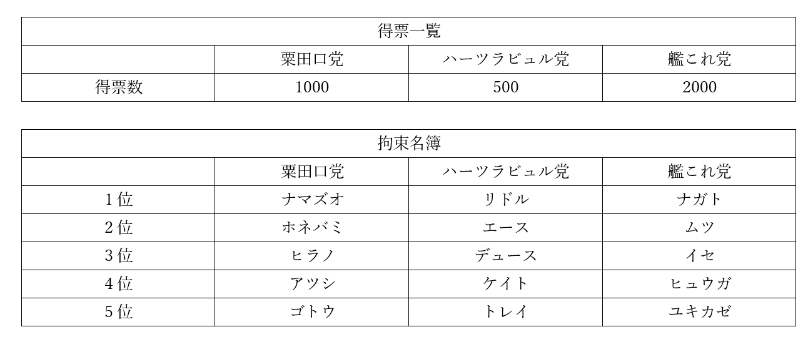
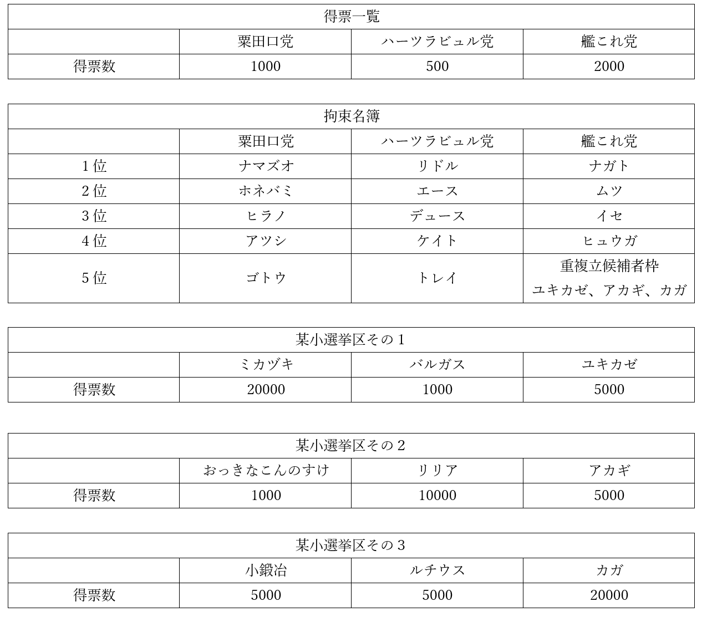
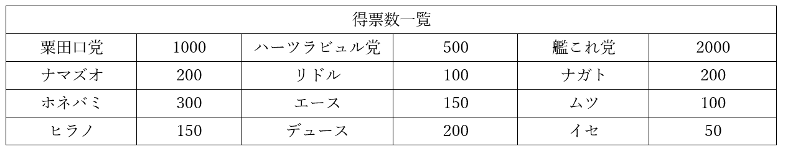
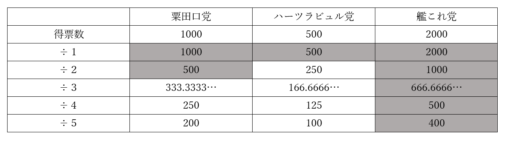
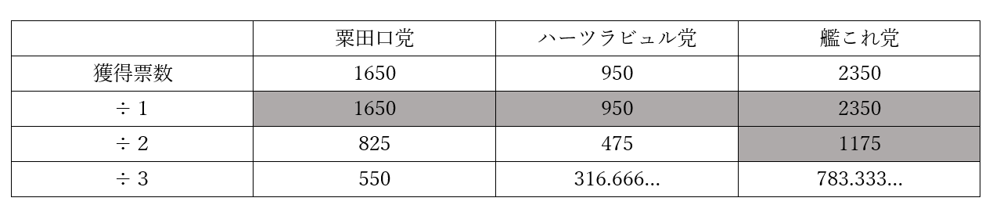

# 政治分野第三章　選挙制度問題演習  
### 問題１  
  
現代日本で言う衆議院議員選挙と同じ要領の拘束名簿式の比例代表制で、八人の当選者を選ぶ。条件は以下にある。当選者を全て答えよ。  
  
  
  
  
  
  
  
### 問題２  
現代日本で言う衆議院議員選挙と同じ要領の小選挙区比例代表並立制で、選挙を行う。当選者は八人。条件は以下にある。比例代表で当選する者を全て答えよ。  

  
  
  
  
  
  
### 問題３  
非拘束名簿式の比例代表制で、選挙を行う。当選者は四人。条件は以下にある。当選する者を全て答えよ。  
  
  
  
  
  
  
# 政治分野第三章　選挙制度問題演習解答  
  
### 問題１  
解答：ナガト、ムツ、イセ、ヒュウガ、ユキカゼ、リドル、ナマズオ、ホネバミ  
  
 ドント式で計算すれば分かる。今回の場合は、÷５まで作れば正答が分かる  
  
  
  
  
  
  
### 問題２  
  
解答：ナガト、ムツ、イセ、ヒュウガ、アカギ、リドル、ナマズオ、ホネバミ  
  
　基本的には問題１と同じ。問題は艦これ党。  
　問題１から、艦これ党は５人受かる。そうなると、重複立候補者枠からは１人しか通らないのだが、重複立候補者枠には３人いる。ここで小選挙区を見てみると、カガは復活当選するまでもなく、小選挙区で当選しているので考えなくていい事が分かる。問題は、小選挙区で落選したユキカゼとアカギ。  
　ユキカゼとアカギは復活当選を目指す者同士。よって、惜敗率によって優先順位を決める必要がある。惜敗率は、「小選挙区で重複候補者が獲得した票数÷重複立候補者の選挙区の当選者が獲得した票数」。つまり「ユキカゼの獲得票数÷ミカヅキの獲得票数」と「アカギの獲得票数÷リリアの獲得票数」で比べればよい。  
  
5000÷20000＝0.25⇒ユキカゼの惜敗率0.25(25%)  
5000÷10000＝0.5⇒アカギの惜敗率0.5(50%)  
  
　惜敗率はアカギが上。よってアカギが当選する。  
　尚、カガは小選挙区で当選しているので、「比例代表で当選する」人ではない。注意。  
  
### 問題３    
  
解答：ホネバミ、デュース、ナガト、ムツ  
  
　非拘束名簿式では、有権者は「候補者の名前」か「政党の名前」を書いて投票する。そしてドント式で計算する時、「候補者の名前」で投じられた票は、その候補者が所属する「政党の名前」として扱う。例えば今回の粟田口党ならば、  
  
粟田口党と書かれた1000＋ナマズオと書かれた200＋ホネバミと書かれた300＋ヒラノと書かれた150＝1650  
  
　が、ドント式で計算する時の粟田口党の獲得票数となる。同様に計算するとハーツラビュル党は獲得票数950、艦これ党は2350になる。これで、ドント式を使って計算する。  
  
  
  
  
　よって、粟田口党からは一人、ハーツラビュル党からも一人、艦これ党からは二人当選する。  
  
　続いて、非拘束名簿式では、党内の当選順位は、「候補者の名前」によって決まる。即ち、「候補者の名前」の票数が多かった者から順に当選する。例えば粟田口党は、300票獲得のホネバミが優先順位一位、200票獲得のナマズオが優先順位二位、150票獲得のヒラノが優先順位三位となる。  
　粟田口党は当選一人なので、党内最多得票のホネバミが当選。  
　ハーツラビュル党も当選は一人であり、党内最多得票のデュースが当選。  
　艦これ党については当選二人なので、党内最多得票のナガトと、二位のムツが当選。