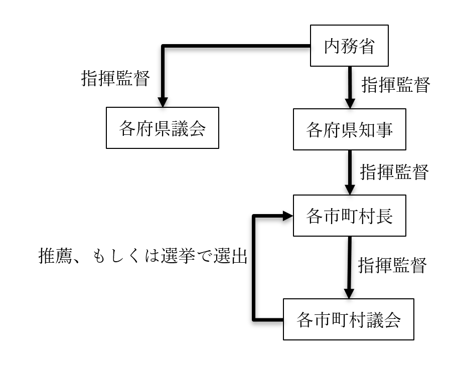
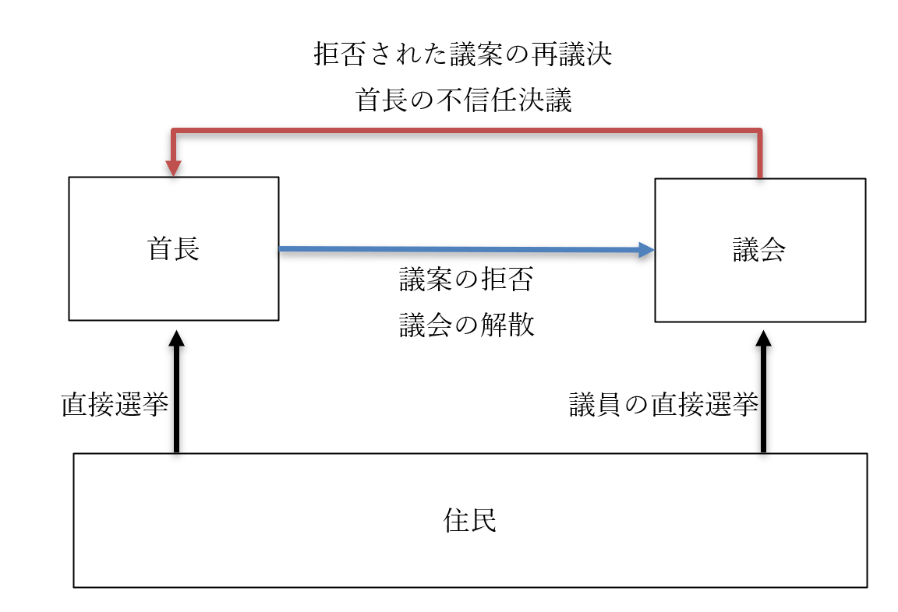

# 地方自治
## 授業動画一覧
[本節の授業動画はこちら](LIST.md#地方自治)  
## ●大日本帝国憲法下の地方自治  
・政治分野第二章でも見たように、大日本帝国憲法はプロイセン憲法を基にした中央集権的憲法  
・これは、江戸時代が封建制という地方分権の極致だったから  
⇒「中世的な地方分権的統治体制から脱却して、近代的で文明的な中央集権国家になろう！」というところから作られたのが大日本帝国憲法  
  
・故に、大日本帝国憲法には地方自治の項目が【無い】  
・勿論、だからと言って大日本帝国憲法下の日本に、府や県、市町村が無かった訳ではない  
  
・当時の府県知事は［官選］だった  
・即ち、府や県の知事は中央政府の官僚として任命され、赴任するという形を採った  
※実際に選ぶのは政府だが、形式的には［天皇］が任命した  
※任命されるのは、内務省の官僚や有力政党の政治家が多かった  
  
・赴任した府県知事は［内務省］の指揮監督下にあり、また、市町村長を指揮監督した  
・いわば、中央政府（内務省）を頂点としたピラミッド構造になっていたのが戦前の地方自治である  
  
・尚、各市町村長の選び方は時期によって二種類あった  
１：各市町村議会で推薦する者を選び、その中から中央政府が任命  
２：各市町村議会で選挙する  
※２で選ばれたとしても、各市町村長は各府県知事の指揮監督下にあったので、結局ピラミッド構造という点は変わらない  
※各市町村議会の議員は、住民の選挙で選ばれた  
  
  

  
  
  
## ●地方自治の理念  
・政治分野第二章でやったように、日本国憲法には地方自治の規定が【ある】  
・これは、極めて地方分権的な政治体制を採る米国を参考にしたからである  
・故に、日本国憲法下の日本は、大日本帝国憲法下に比べると地方分権的と言える  
  
  日本国憲法第九十二条　地方公共団体の組織及び運営に関する事項は、地方自治の［本旨］に基いて、［法律］でこれを定める。  
  
・日本国憲法下の日本に於ける地方自治は全て、最終的にはこの条文を根拠とする  
・しかし、「地方自治の本旨」が何であるかという解説は、実は日本国憲法には書いていない  
  
・現在は、「地方自治の本旨」とは恐らく、以下の二つであろうと解釈されている  
  
１：【団体自治】  
⇒地方の行政は、中央政府から独立した地方公共団体（地方自治体。都道府県とか市町村とか）が自主的に実施する、というもの。その自主性を確保するべく、例えば財源を確保する為の［課税権］や、［立法権］を持つ。ドイツ系の考え方  
※現代日本の場合、課税権は地方税として、立法権は条例制定権として具体化されている  
  
２：【住民自治】  
⇒地方の行政は、住民の意志に従って決定され、実施されるというもの。英米系の考え方  
※現代日本の場合、首長（知事や市町村長）の［選挙］や［住民投票］の実施、［直接請求権］といった形で具体化されている  
  
  
・「そもそも地方自治って必要なの？」という点については、以下の言葉がよく引用される  
  
・「地方自治は【民主】政治の最良の【学校】、その成功の最良の保証人なり」（ブライス子爵ジェームズ）  
⇒「住人皆が顔見知り…というような農村に於いて、話し合いで物事を決める」というような地方自治を想定。結局、民主主義で国を運営するというのは、そういう顔見知り同士の話し合いを国全体に拡大したものと言える。だから、そういう地方自治は民主主義による国政の学校でもあるし、そういう地方自治が盛んな地域は民主主義政治で成功する。という話  
※より正確には、ブライスの台詞と言うよりはブライスの『近代民主政治』という本に載っている格言  
  
・「地方自治制度の［自由］に対する関係は、小学校が学問に対して持つ関係と同じである」（トクヴィル）  
⇒小学校できちんと基礎を学んだからこそ学問が研究できるのと同じように、地方自治をちゃんとやるからこそ自由が保障される、という話。民主主義は多数派が勝つので、「民主主義で決まったから」と多数派が少数派を抑圧する、即ち自由が失われる方向に行きやすい。そうならないように、地方自治が必要だよ、というもの  
※「地方自治は民主主義の小学校である」とされる場合もあるが、恐らくブライスのものと混同している  
  
※言うまでもなく、「いつでもどこでも絶対・最高の統治体制」なんてものはありません。「現代日本は地方自治を重視するべきかどうか」もまた、主権者たる国民一人一人が考える事です  
## ●地方自治体（地方公共団体）の構造  
### 〇地方自治体（地方公共団体）の種類  
・都道府県や市町村のような法人を、地方自治体や地方公共団体と呼ぶ  
⇒どちらかと言えば、地方公共団体の方が公的な言い方  
  
・地方公共団体は、大きく分けて二つ  
１：［普通］地方公共団体  
⇒四十七の都道府県や市町村等、普通の地方公共団体  
２：［特別］地方公共団体  
⇒その名の通り、特別な地方公共団体  
  
・特別地方公共団体の代表例としては、特別区がある  
・「市ではない」「市町村には属さない」「市に準じた機能を持つ」という特別な地方公共団体である  
・特別区の実例は、今のところ東京都二十三区のみ  
⇒東京都の二十三区は、「市ではない」し、「市町村には属さない」が「市に準じた機能を持つ」。これは何故かと言えば、特別区だからである  
※法的には東京都の二十三区以外も特別区になれるのだが、令和三年現在、特別区になった地方公共団体は東京都二十三区以外にない  
  
  
### 〇地方自治体（地方公共団体）の二元代表制  
・地方公共団体は、原則［二元代表制］と呼ばれる制度を採用している  
⇒【首長】（知事や市町村長）と【（地方）議会】（都道府県議会や市町村議会）が並び立つもの。基本的に地方自治は、この二つの機関によって行われる。尚、裁判所に関しては全て国の管轄下にある  
  
・首長の選任は、住民の【直接選挙】で選ばれる【首長公選制】を採用している  
・任期は【四】年  
※【首長の直接選挙】は、日本国憲法［九十三条］に定められている  
  
・地方議会は、［一院制］を採る  
・地方議員は、住民の【直接選挙】で選ばれる。任期は【四】年  
※地方議会の【設置】や、議員の【直接選挙】は、日本国憲法［九十三条］に定められている  
  
  日本国憲法第九十三条　地方公共団体には、法律の定めるところにより、その議事機関として議会を設置する。  
  ２　地方公共団体の長、その議会の議員及び法律の定めるその他の吏員は、その地方公共団体の住民が、直接これを選挙する。  
  
  
### 〇二元代表制の権力分立  
・国政のいわゆる三権分立は、チェック・アンド・バランス（制御と均衡）が働くようになっている  
・地方自治に於ける二元代表制もまた、チェック・アンド・バランスが働くようになっている  
・基本的には首長（とその下にある官僚組織）が行政権を、議会が立法権を担う形になっている  
  
・議会は、［条例］や［予算］を議決できる  
・首長は、議会が議決した条例案や予算案を【拒否】できる  
・議会は、首長に拒否された案を【三分の二】以上の賛成によって強制的に成立させられる  
  
・議会は、首長の［不信任］を決議できる  
・不信任が決議された場合、首長は［十日］以内なら議会を［解散］できる  
⇒議会を解散して選挙して、選挙後再び不信任が議決された場合、首長は辞任しなければならない  
  
  

  
  
・こうして見ると、二元代表制は［大統領］制と［議院内閣］制の折衷案だというのが分かる  
・首長公選制は［大統領］制的  
・予算案や条例案といった議案の拒否権、及び議会の再議決権は［大統領］制的  
・議会の首長不信任決議権は［議院内閣］制的  
・首長の議会解散権は［議院内閣］制的  
  
※このようなチェック・アンド・バランス構造を持つ二元代表制だが、従来、首長に比べて議会の方が弱かった。その為近年は、議会の権力を強化しようという向きがある。例えばかつて、副知事もしくは副市長村長のような重要な役職を、首長は自由に選任していた。これが現在は、議会の承認がなければ選任できない、という形に変わっている  
※なお、そこまでやっても、「二元代表制は機能していない」「首長が強すぎる」という声は大きい  
  
### 〇地方議会の権能と条例  
・地方議会の権能は、主なところでは以下の三つになる  
１：［条例］の制定、改廃  
２：［予算］の議決  
３：首長の［不信任］決議  
※他にも、（国との協議は必要だが）地方税を独自に制定したり、住民の請願や陳情を受理したりするのも地方議会の仕事である  
  
  
・条例について説明する前に、法令の優劣について  
・既に見たように、憲法は国の最高法規であり、これに違反する法律は無効となる  
・ここから分かるように、法令には優劣があり、上位の法令に反する下位の法令は無効である  
・主な法令の順序は、以下の通り  
  
・憲法＞条約＞法律＞命令＞条例  
  
・憲法はそのまんま憲法、現代日本なら日本国憲法  
・条約は国際条約、国同士の約束事。国の法律に優先する  
・法律は、国が定めた法律。現代日本なら、国会で議決された法である  
・命令は、法律に従って行政府が出すもの  
⇒行政府、つまり内閣や省庁は法の執行も仕事。法律に書かれている事を実現するに必要な命令を出す事も当然ある  
  
・条例は、こういったものの下位に属する法律である  
・それ故に、法律や命令に反する条例は制定できない  
・日本国憲法でもそのように書かれている  
  日本国憲法第九十四条　地方公共団体は、その財産を管理し、事務を処理し、及び行政を執行する権能を有し、［法律］の範囲内で条例を制定することができる。  
  
・但し実際には、法律の規制より、より厳しい規制を定めた条例を制定する事もある  
・このような条例を［上乗せ］条例と呼ぶ  
⇒上乗せ条例について、裁判所は「それぞれの趣旨、目的、内容および効果を比較」して個別に「法律の範囲内」「法律違反」と判断すべきだ、というもの。そんな玉虫色の判断をしてしまった以上当然と言えば当然だが、上乗せ条例を巡っては「これは法律に違反している！」「いや違反していない！」みたいな感じで問題が起こる場合も多い  
  
・条例は、地方公共団体の議会が制定し、その地方公共団体の中でのみ通用する  
例：もし、日本国の法律に殺人罪がなく、条例でのみ定められているとする。この場合、殺人罪を定めていない地方公共団体があった場合、そこで殺人を犯しても刑罰を科されない  
  
・条例は、［罰則］付のものを制定する事も可能である  
例：一般的に痴漢は、各地方公共団体の迷惑行為防止条例に基づいて処罰される  
  
・条例の制定についての議論は普通、議会内部でのみ行われ一般住民は関与できない  
・一応、時折だが、［条例］の制定について諮問機関として［審議会］が開かれる事がある  
※諮問機関：「新しい法律作ろうと思うんだけど、ぶっちゃけ議員は素人だからよくわからんのだわ。専門家会議作って、そこに話を聞こう」みたいなもの。この諮問機関の返事に法的拘束力はないが、大抵は専門家の意見として尊重される（尊重する気が無いのに諮問する場合も無くはないが、そう多くはない）  
・この審議会に、時折、一般住民が公募で参加できる場合があり、その場合は関与できる  
  
  
### 〇首長の権能  
・より正確に言えば、首長個人だけでなく、首長の部下たる官僚の仕事も含む  
１：議会が議決した［条例］、［予算］に対する［拒否］権  
２：議会の招集権、［解散］権  
３：条例の執行  
４：地方税の徴収  
５：条例案、予算案の提出  
６：【自治事務】の執行  
７：【法定受託事務】の執行  
  
・１と２は基本、既に見た。招集権は読んで字の通り、議会の招集は首長がやる  
・３は、当然と言えば当然。首長は基本的に行政権を司るので、法の執行も行う  
・４は、地方税も最終的には条例という形で制定するので、３と同じ理屈  
  
・５は、二元代表制の特殊なところ  
・首長は、議院内閣制の内閣のように、法案を提出できる  
・どころか、予算案まで提出できる  
⇒と言うか、基本的に首長しか提出できない。議会の権能にある「予算の議決」とは、首長が提出してきた予算案を承認する（かもしくは拒否する）という事でしかない。勿論、「こんな予算だったら承認しねぇぞ」と言って修正させる事も可能である…と言うか、地方議会の主な仕事がそれになっている感は実際ある  
※そりゃあ「二元代表制は機能していない」「首長が強すぎる」と言われますわ、という話  
  
・６の自治事務は、地方公共団体が自主的に行う、あらゆる事務である  
例：都市計画の決定、飲食店の営業許可、公共施設の管理等  
・７の法定受託事務は、法律で決まった「国のお手伝い」である  
⇒例えば国政選挙は、公職選挙法のような国の法律で決まったものであり、本来国でやるべきものである。ただ、投票所の設置や管理といった仕事は、国がやるより地方公共団体に委託した方がいい。そういう、「法律で決まった、国から委託された事務」が法定受託事務である  
### 〇住民の権利  
・地方自治に於ける住民の権利は、主なところでは以下の通り  
１：首長の【直接】選挙権  
２：地方議員の【直接】選挙権  
３：［住民投票］ の権利  
４：地方自治法に基づく直接請求権  
  
・１と２は既にやった通り。憲法にも書かれている  
・３と４は下記で詳しくやる  
  
  
### 〇住民投票  
・実は、一口に住民投票と言っても種類がある  
１：憲法改正の際の住民投票  
２：［地方特別法］の住民投票  
３：［住民投票条例］による住民投票  
  
・１は、国政に於ける住民投票である  
・以下復習。引用文中の２がこれにあたる  
  
～ここから引用～  
・日本国憲法の改正は、分かりやすく言うと以下の三段階で行われる  
１：憲法改正案を、衆議院・参議院両方の議員三分の二以上の賛成によって決定（これが発議）  
２：１で決定した改正案を、国民投票等によって国民が承認  
３：２で承認された改正案を、天皇が公布  
～ここまで引用～  
  
・続いて、２の「［地方特別法］の住民投票」は、地方自治に於ける住民投票である  
・日本国憲法九十五条に定められているもの。故に法的拘束力を［持つ］  
⇒特定の地方公共団体にのみ有効な法律（これを地方特別法と呼ぶ）を制定する場合、その地方公共団体の住人による住民投票を実施して［過半数］が賛成しないと駄目、というもの  
  日本国憲法第九十五条　一の地方公共団体のみに適用される特別法は、法律の定めるところにより、その地方公共団体の住民の投票においてその過半数の同意を得なければ、国会は、これを制定することができない。  
  
・３もまた、地方自治に於ける住民投票。地方公共団体の意思決定を住民投票に委ねるもの  
例：1996年、新潟県巻町に原子力発電所を作るかどうかという住民投票が行われた  
・この住民投票は、かつてはそれ専用の［住民投票条例］を作って実施する例が多かった  
例：先の巻町の場合、「巻町における原子力発電所建設についての住民投票に関する条例」という専用の条例を作って住民投票を実施した  
・一方で、汎用の［住民投票条例］を制定し、いつでも住民投票できるようにした自治体も増えた  
※この住民投票条例による住民投票は、原則法的拘束力が［無い］。が、大抵は結果が尊重される  
  
### 〇直接請求権  
  
|住民発案と住民解職|請求の種類|必要署名数|請求先|請求後の展開|
|:----:|:----:|:----:|:----:|:----:|
|【住民発案(イニシアチブ)】|【条例の制定、改廃】|有権者の【五十分の一】以上|【首長】|二十日以内に地方議会を招集、そこで可決されれば制定、改廃が行われる|
|　－　|監査|有権者の【五十分の一】以上|監査委員|監査を実施し、その結果を首長や議会へ報告する|
|【住民解職(リコール)】|【議会の解散】|有権者の【三分の一】以上（原則）|【選挙管理委員会】|【住民投票】を行い、【過半数】の賛成があれば解散する|
|【住民解職(リコール)】|【首長、議員】の解職|有権者の【三分の一】以上（原則）|【首長】|【住民投票】を行い、【過半数】の賛成があれば解職する|
|【住民解職(リコール)】|副知事、副市長等の解職|有権者の【三分の一】以上（原則）|【首長】|議会にかけ、【三分の二】以上の議員が出席している状態で【四分の三】以上の賛成があれば解職する|
  
※住民解職三種の必要署名数は、有権者数によって変動する。有権者総数四十万以下の場合、三分の一が必要。それ以上の場合、四十万以下の部分については三分の一、四十万人超八十万の部分については［六分の一］、八十万超の部分については［八分の一］を乗算し、合算した数が必要になる。要はこんな感じ↓  
１：人口四十万超八十万以下の場合  
⇒(40万÷3)＋((人口－40万)÷6)  
２：人口八十万超の場合  
⇒(40万÷3)＋(40万÷6)＋((人口－80万)÷8)  
  
・直接請求権は、言ってみれば、「地方自治という間接民主制に於ける直接民主制要素」である  
⇒国政と同じ。現代日本は、国政に於いては原則、間接民主主義を採用している。が、憲法改正の際の住民投票のように「直接民主主義っぽい要素」が混ぜ込まれている。それの地方自治版と考えればよい  
⇒基本的には、「この直接請求権を行使しましょう！」という署名を集めて提出する。その署名が必要数に達していれば、前掲表の「請求後の展開」にあるような事が起こる  
  
・直接請求権で有名な概念として、住民発案と住民解職がある。具体的に何に当たるかは前掲表参照  
  
・前掲表は覚える項目が多くて面倒だが、覚えるコツもある  
・必要署名数は、住民解職なら原則三分の一、それ以外なら五十分の一  
・条例の制定、改廃の請求先は、議会を招集する人。つまり首長  
⇒条例の制定、改廃をするのは地方議会。ただ、地方議会は首長が招集する。なら招集する人に請求するのが手っ取り早い  
・住民解職の請求先は、選挙で選ばれるモノについては選挙管理委員会、そうでない職は首長  
⇒議会は選挙で選ばれた議員で構成されるし、首長も選挙で選ばれる。一方、副知事や副市長のような職は基本的に首長が選ぶ（そして議会が承認する）ので、首長に「おいお前が選んだこいつクビにしろ」と請求する  
  
  
### 〇外国人住民の権利  
・ここでいう権利とは、勿論地方自治に参加する権利である  
・令和三年現在、外国人が地方選挙に参加する権利は【無い】  
⇒国政選挙、地方選挙問わず、外国人が選挙に参加する権利は無い。まぁ当然と言えば当然だが…  
  
・一方、地方公務員については、外国人が任用される場合【もある】  
・外国人の登用についての政府の見解は、1953年以来以下の通り  
  
  「法の明文の規定が存在するわけではないが、公務員に関する当然の法理として、公権力の行使または国家意思の形成への参画にたずさわる公務員となるためには、日本国籍を必要とするものと解すべきである」  
  
・当たり前と言えば当たり前の話ではある  
⇒日本は日本人の国である。「日本人の国で公の権力を行使できるのは日本人だけに決まってるでしょ」「外国人が日本の国家意思の形成に関与したいってどういうこっちゃねん、スパイか何か？」という話  
  
・こういう理由で、外国人は国家公務員にはなれない  
・一方で、地方公務員なら採用できる場合もある  
⇒「公権力を行使しないなら…」「国家意思の形成に関与しないなら…」という形。具体的にどういう職種なら「公権力を行使しない」「国家意思の形成に関与しない」のか、という判断は地方公共団体による  
  
  
## ●地方自治の財政  
・地方公共団体は、国家ではない。故にその自治には限界がある  
・代表例として、限界の最たるものとして挙げられるのが財政である  
  
・詳しくは経済分野でやるが、原則、カネというのは金持ちのところに集まる  
・即ち、現代のような資本主義社会では、放っておくと金持ちはより金持ちになっていく  
・逆に言えば、貧乏人はより貧乏になっていく  
・これは地域で見てもそうで、放っておくと都市はどんどん人が集まり豊かになっていく  
・同様に、放っておくと田舎はどんどん人がいなくなり貧乏になっていく  
  
・これはいい悪いの問題ではなく、「そういうもの」であると言える  
・現代的な資本主義社会は、放っておくとそうなっていくモノなのである  
  
・ところで、地方自治にもカネが必要である  
・そして、現代的な資本主義社会は、放っておくと金持ちはより金持ちに、貧乏人はより貧乏になっていく  
⇒つまり、「うちの国は地方自治重視だから。自治に使うカネは地方が自分で用意してね」で放っておくと、都市は潤沢な資金を用意できるが、田舎は「自治も糞もないわこんなん」みたいな資金しか集まらない、という事態に陥ってしまう  
  
・結局、地方自治と言ったところで、地方だけではどうにもならない  
・国が補助金を出してやらないと、話にならないのである  
⇒都市のような金持ちの地方公共団体にはちょっとだけ、田舎のような貧乏な地方公共団体には沢山の補助金を。そうやって初めて、都市も田舎もきちんとした地方自治ができる。逆に言えば、そうしないと田舎は衰退していくばかりになってしまう。基本的に都市は田舎から搾取して成り立つので、都市が田舎から搾取したカネを国が補填してやらないと、田舎は遠からず死んでしまう  
※「都市は田舎から搾取して成り立つ？？？」ってなる人もいると思うので一つ例を。令和二年現在、東京都の出生率は全国最低である。しかし東京都の人口は増え続けている。何で、と言えば、田舎から人が集まってくるからである。そして、所属する人口は多ければ多いほど、その地方の経済活動は活発になる。逆に言えば、人がいなくなった地方の経済活動は死ぬ。東京という都市は、全国の田舎から人を奪って、活発な経済活動を実現している訳である  
  
・そういう訳で、戦後以来、全国の地方自治は中央政府の手厚い援助を受けてきた  
  
||||
|:--------------------------:|:--------------------:|:--------------------------:|
||||
||［一般財源］|［特定財源］|
|【自主財源】|【地方税】|使用料及び手数料|
|【依存財源】|【地方交付税交付金】|【国庫支出金】、［地方債］|
  
  
・予算を組む者の意志で、何にでも使っていい収入を［一般財源］と呼ぶ  
・一方、最初から「これに使え」と決まっている収入を［特定財源］と呼ぶ  
・地方公共団体が、自分で集めたカネを【自主財源】と呼ぶ  
・政府から地方公共団体への援助金を、まとめて【依存財源】と呼ぶ  
  
・自主財源であり一般財源でもあるものの代表例は【地方税】  
例：いわゆる住民税、自動車税、固定資産税  
※地方公共団体によって異なるが、基本的に、自主財源の殆どはこの地方税である  
  
・自主財源であり特定財源でもあるものの代表例は、使用料及び手数料  
例：公共施設の利用料や、公共サービスの手数料  
※例えば公共施設の利用料として支払われたカネは、そのまま、その施設の運営費用として使われる  
  
・依存財源であり一般財源でもあるものの代表例は【地方交付税交付金】  
・国が集める税金（いわゆる国税）は、「一定額は地方の援助に回す」と決まっているものがある  
例：酒税の50%、法人税の33.1%等  
・このカネを、全国各地の地方公共団体へ配る。これが地方交付税交付金である  
※基本的に、貧乏な公共団体には沢山、金持ちの公共団体にはちょっとだけ、という形で配る  
  
・依存財源であり特定財源でもあるものの代表例は【国庫支出金】  
・先に述べたように、「本来は国の事業だが地方にやって貰った方がいい事業」というものはある  
・また、「本来は地方の事業だが国の利害にも関係する事業」というものも当然、存在する  
・そういうものを地方公共団体が実施する際、費用の一部もしくは全部を国が負担する場合がある  
・これが国庫支出金である  
  
・［地方債］もまた、依存財源であり特定財源でもある  
・これは要するに、「これこれこうするのにカネが足りないから借金します」というもの  
⇒なので特定財源  
・地方公共団体が行う借金ではあるが、事前に国や上位の地方公共団体に相談しないとできない  
⇒都道府県なら国に、市町村なら都道府県に相談してからでないと借金できないようになっている  
・こういう事情から、自主財源ではなく依存財源とされる  
  
## ●地方自治の改革  
・従来の地方自治を揶揄する言葉として、【三割自治】という言葉があった  
・由来は、地方公共団体の収入に占める【自主財源】の割合が、伝統的に【三割】だから…とされる  
・「地方自治だ！」「国と地方は対等だ！」と言うなら、自主財源がメインの収入でなければならない  
・が、実際には三割ぐらいしかなく、その分地方公共団体の自主性も（お察しください）  
・…というのが、一般的な三割自治の説明である  
  
・実際には、地方公共団体の収入に対する自主財源の割合は、平均すると四割ぐらいある  
・正直、「三割」がどこから出てきたのかは割と謎である  
・また、「国が介入しなかったら田舎が死にますけど？」というのも既に見た通りである  
  
・こういう訳で、三割自治というのはかなり胡散臭い言葉である  
⇒ただ、時期的には五十五年体制の崩壊以後、「国と地方を対等に」「地方公共団体は国の下請けではない」「真の地方自治の実現を」というような声がそれなりに強くなっていった。その中でお題目として掲げられたものの一つが、「三割自治の解消」であった事は間違いない  
  
・また、中央政府から見ても、五十五年体制崩壊後は即ち、バブル崩壊後の大不況の時代である  
・令和三年現在も、日本は不況だと言っていい。三十年ぐらいずっと不況という事  
・不況なので当然、中央政府としても地方に配るカネは減らしたい  
  
・更に、五十五年体制崩壊直前から、新自由主義が流行り始めた  
・新自由主義をざっくり言えば「実力主義」「自己責任」「無駄の削減」「国家の役割は最小限に」である  
⇒新自由主義による実力主義の横行は、「貧乏人が貧乏で大変？」「真面目に働けば貧乏からは抜け出せる筈だ」「よって貧乏人が貧乏で大変なんてのは努力不足」「貧乏人が貧乏で死ぬのは自己責任」という風潮を生んだ  
  
・こうして、以下の三つが悪魔合体して行われるようになったのが、地方分権改革である  
１：地方自治の強化という大義名分  
２：地方にカネをあげたくない中央政府の本音  
３：実力主義の横行による、「貧乏人が貧乏で死ぬのは自己責任」という風潮  
  
・「これまでは、国が地方の世話を焼く代わり、地方は国の下請け…みたいな状態でした！」  
・「それ、やめます！」「これからの国と地方は、対等です！」  
・「あ、だから援助とか減らします。対等だもんね？」  
・…要は、こういう形で行われてきたのが地方分権改革である  
・端的に言えば、国は「地方」という「無駄」を切り捨てるのに、地方分権を利用したのである  
  
### 〇地方分権改革一括法  
・1995年に成立した［地方分権推進法］ができた  
⇒「地方分権を推進する法律を作りましょう」という法律。なので、これに基づいて、「地方分権を推進する法律」を作る事になる  
・その成果が、1999年制定の［地方分権一括法］である  
  
・地方分権一括法の目玉は、国と地方の関係変化である  
・従来、国と地方の関係は［上下・主従］関係であった  
・これを［対等・協力］関係に変えよう、というのが本法の骨子である  
  
・最大の目玉は、地方公共団体が取り扱う事務の再編である  
・地方公共団体の事務は、従来、［固有事務］、［団体委任事務］、【機関委任事務】があった  
・これらが、【自治事務】と【法定受託事務】へ再編された  
⇒「地方公共団体が自主的に行う、あらゆる事務」が自治事務。「法律で決まった、国から委託された事務」が法定受託事務である  
  
・また、これに合わせて【機関委任事務】が廃止された事が大きく取り上げられる  
⇒国から委託された事務、という意味では法定受託事務と同じ。ただ、機関委任事務はあくまで「国の事務」とされていた。それ故に、機関委任事務については国に指揮監督権があり、地方公共団体の意見を反映させるのは難しかった。それこそ、「機関委任事務の遂行に怠慢があった」として、首長をクビにする権限すら国は持っていた。「これはいかんでしょ」という事で、機関委任事務は廃止され、自治事務と法定受託事務へと再編された  
※固有事務や団体委任事務もまた、自治事務と法定受託事務へ再編されている。が、機関委任事務はモノがモノだけに、その廃止が大きく取り上げられやすい  
  
・尚、地方分権一括法によって、地方税の分野も変わった  
・地方税というのは、基本的に、地方税法という国の法律に規定されている  
・ただ、地方自治体が、地方税法に載っていない独自の地方税を作る事もできる  
・これがいわゆる［法定外］税というものだが、地方分権一括法によってこれが作りやすくなった  
※ちなみに…『地方議会の権能』で、「他にも、（国との協議は必要だが）地方税を独自に制定したり、住民の請願や陳情を受理したりするのも地方議会の仕事である」と述べた。この「（国との協議は必要だが）地方税を独自に制定」するというのは、法定外税の事を指す  
  
  
  
  
### 〇三位一体の改革  
・続いて、新自由主義の申し子【小泉純一郎】が内閣総理大臣だった時期に改革が行われた  
・彼は自らの【聖域なき構造改革】に於いて、「【民間】でできる事は【民間】に」とお題目を掲げた  
・同様に、「【地方】にできる事は【地方】」として、地方自治改革を行った訳である  
・それが［三位一体の改革］で、以下の三点が核心だった  
１：【地方交付税交付金】の削減  
２：【国庫支出金】の削減  
３：国から地方への【財源移譲】  
  
・要するに、新自由主義という「無駄の削減」を奉じる内閣は、無駄を削減したかったのである  
・言い換えれば、地方（自治）という「コスト」「無駄」を切り捨てたかったのだ  
・そこで、３にある財源移譲をする代わり、１と２を実行した  
⇒財源移譲については、国税を減税してその分地方税を増やす、というような手段を採用した。例えば【所得税】を減税してその分【住民税】を増やした。また、【消費税】は国の取り分と地方の取り分がある（例えば、令和三年現在の消費税は10%だが、実は7.8%が国の取り分、2.2%が地方公共団体の取り分である）のだが、地方の取り分を増やしてもいる  
  
・結果として、国の負担は軽くなり、地方が獲得できるカネは減った  
⇒財源移譲で国の税収は減った（地方の税収は増えた）が、それ以上に地方交付税交付金と国庫支出金が減った  
  
・勿論、元から地方税による収入が大きかった地方公共団体には、さしたる問題はない  
・言い換えれば、人口が多く経済も発展した都市部は、問題ない  
・が、人口が減っており経済も停滞しつつある田舎は…  
  
  
### 〇平成の大合併  
・地方分権一括法から三位一体の改革にかけて、市町村合併が強力に推進された  
  
・日本は大日本帝国の時代、明治中期に市町村制が導入された  
・それ以来、一貫して地方公共団体の数は減少している  
⇒昔はインターネットどころか、電話も自動車もなかった。当然、一つの地方公共団体が把握できる人数は少なかった。それが技術の発達で、一つの地方公共団体でも把握できる人数は大幅に増えていった。また、中央政府として、小さい団体が大量にあるよりは、それなりの規模の団体が少数ある方が管理しやすい  
  
・「無駄の削減」という裏の顔を持つ地方分権改革に於いて、市町村合併も大きな目標であった  
・市町村の数が減ればそれだけ、地方行政は［効率］化され、地方公務員や地方議員も削減できる  
・言ってみれば、「地方」という「無駄」「コスト」を削減できる訳である  
  
・地方分権一括法では、［合併特例法］が改正され、合併しやすくなった  
・更に、三位一体の改革では「合併した地方公共団体の交付金は［十年］は減らさない」とした  
⇒三位一体の改革では地方交付税交付金が削減されたが、合併するなら猶予をあげるよ、という形  
・また、［合併特例債］の発行も認めた  
⇒合併に必要な費用を捻出する為の借金。この借金は、実質的な返済額の70%を負担するという、破格のものだった  
  
・このような政策によって、【平成の大合併】と呼ばれる、空前の規模の市町村合併が行われた  