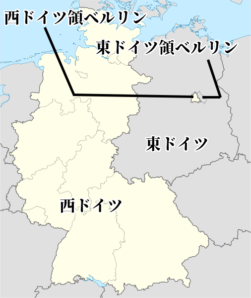

# 戦後国際政治史―ColdWar

## ●授業動画一覧
|||
|:----:|:----:|
|高校公民政治分野160／冷戦史1／冷戦前史|[YouTube](https://youtu.be/CWz_2gy623k)|
|冷戦史2／冷戦の始まり1|[YouTube](https://youtu.be/RJD3517iRYw)|
|冷戦史3／冷戦の始まり2|[YouTube](https://youtu.be/q4hdJ5H22eU)|
|冷戦史4／第一次ベルリン危機|[YouTube](https://youtu.be/T5hYh74tw0g)|
|冷戦史5／朝鮮戦争|[YouTube](https://youtu.be/Ikb0KKNmeUM)|
|冷戦史6／「雪解け」|[YouTube](https://youtu.be/QVFZK65vy-A)|
|冷戦史7／「雪解け」の終焉|[YouTube](https://youtu.be/3GhLqxD32PE)|
|冷戦史8／スエズ危機1|[YouTube](https://youtu.be/uDN34Q5Bfa0)|
|冷戦史9／スエズ危機2|[YouTube](https://youtu.be/tcB_xeJpRio)|
|冷戦史10／キューバ危機1|[YouTube](https://youtu.be/DPxEDlqnSGs)|
|冷戦史11／キューバ危機2|[YouTube](https://youtu.be/CdX3QKUGLjc)|
|冷戦史12／キューバ危機後の変化1|[YouTube](https://youtu.be/_vOaCyDEvYg)|
|冷戦史13／キューバ危機後の変化2|[YouTube](https://youtu.be/zH-7owQiB1c)|
|冷戦史14／デタントとベトナム戦争のその後|[YouTube](https://youtu.be/HHjdgKYmtYE)|
|冷戦史15／冷戦終結1|[YouTube](https://youtu.be/zO6TeTcPgNY)|
|冷戦史16／冷戦終結2|[YouTube](https://youtu.be/vEuHl7WEgC4)|

## ●前置きと年表
・冷戦の歴史は普通、政経や公共の授業ではほぼやらない  
・「これぐらい世界史でやってるから当然知ってるよね」という扱いである  
・それはあまりと言えばあまりな…という事で、以下、本稿では冷戦史をそれなりに詳しく扱う  
  
・尚、こちら↓に冷戦の年表を載せておくので、学習の参考にどうぞ  

  
|年月|事件|  
|:----------:|:-----:|    
|1945年2月 |ヤルタ会談                                                                                                                                                                                                                                                                                                                                    |  
|1945年4月 |アメリカ合衆国大統領フランクリン・ルーズベルト死去                                                                                                                                                                                                                                                                                            |  
|1945年5月 |ドイツ国降伏。第二次世界大戦の欧州戦線が終わる                                                                                                                                                                                                                                                                                                |  
|1945年8月 |大日本帝国降伏。一般的に言う、第二次世界大戦終結                                                                                                                                                                                                                                                                                                  |  
|1945年9月|大日本帝国を裏切ったソ連の攻撃が終了。第二次世界大戦が完全に終わる|
|1946年    |チャーチル元英首相による「鉄のカーテン」演説代表的な植民地独立戦争にあたるインドシナ戦争、始まる                                                                                                                                                                                                                                              |  
|1947年    |アメリカ合衆国がトルーマン・ドクトリンとマーシャル・プランを開始。本格的に西側陣営を作り始めるソ連がコミンフォルムを設置。本格的に東側陣営を作り始める                                                                                                                                                                                        |  
|1948年    |敗戦国ドイツの管理を巡って東西の対立が激化。第一次ベルリン危機                                                                                                                                                                                                                                                                                |  
|1949年    |アメリカ合衆国が北大西洋条約機構を結成ソ連がコメコンを設置第一次ベルリン危機終結。結果、ドイツは正式に東西へ分裂する                                                                                                                                                                                                                          |  
|1950年    |朝鮮戦争。冷戦の激化が、ついに代理戦争を発生させた                                                                                                                                                                                                                                                                                            |  
|1953年    |朝鮮戦争休戦協定ソ連書記長スターリン死去。後継はフルシチョフ                                                                                                                                                                                                                                                                                  |  
|1954年    |ジュネーヴ休戦協定。インドシナ戦争が終結し、南北ベトナムが並立する事になる平和五原則の発表。旧植民地各国が第三世界として連帯を示す画期                                                                                                                                                                                                        |  
|1955年    |バンドン会議。平和五原則に続いて、第三世界として連帯を示すジュネーヴ四巨頭会議開催。東西両陣営が話し合いで冷戦を終わらせる姿勢を見せる                                                                                                                                                                                                        |  
|1956年    |フルシチョフのスターリン批判。コミンフォルム解体ハンガリー動乱。スターリン批判やコミンフォルム解体を受けて起きた、ハンガリー人民共和国に於ける反ソ蜂起。ソ連は軍隊を出動して鎮圧し、東西の対立は再び激化していく。また、バンドン会議等で見せた旧植民地国家の連帯も失われていく。 スエズ危機と第二次中東戦争。英仏の国際的影響力が決定的に失墜する|  
|1959年    |キューバ革命。キューバ共和国成立。アメリカ東海岸の目と鼻の先に東側陣営の国ができる事に                                                                                                                                                                                                                                                        |  
|1960年    |アフリカの年。いよいよ英仏の影響力の低下は隠しきれないものとなり、この年、アフリカの植民地が雪崩を打って独立した。計17ヶ国が独立し、国連加盟国もこの年17増えた                                                                                                                                                                                |  
|1961年    |第二次ベルリン危機。ベルリンの壁建設                                                                                                                                                                                                                                                                                                          |  
|1962年    |キューバ危機。核戦力に劣るソ連の乾坤一擲の賭けは、ソ連の譲歩による米ソの妥協によって終わる。結果、 １：核戦争防止の為、米ソ間で積極的に対話を試みるようになる ２：米ソの核戦力拡張競争と、核の管理強化が同時に行われる ３：東西両陣営の構成国が、盟主に不審を抱く。東西両陣営の内部分裂が始まる                                                  |  
|1963年    |部分的核実験禁止条約(PTBT)。キューバ危機の反省から来る平和へのプロセスという位置づけだったが、既に不審を抱いていた仏中の反発を招く                                                                                                                                                                                                            |  
|1965年    |中華人民共和国が、核開発に成功。中ソ関係はほぼ断絶状態となる                                                                                                                                                                                                                                                                                  |  
|          |アメリカ軍がベトナムに上陸。米国によるベトナム戦争の、本格介入の開始                                                                                                                                                                                                                                                                          |  
|1966年    |フランス共和国が、NATOの軍事部門より離脱                                                                                                                                                                                                                                                                                                      |  
|1968年    |核拡散防止条約プラハの春。チェコスロヴァキア社会主義共和国に於ける自由化運動。やっぱりソ連が軍隊で鎮圧する                                                                                                                                                                                                                                    |  
|1960年代末|米国ではベトナム戦争の戦費がかさみ、また国内で反戦運動が激化ソ連では核開発競争や農業政策の失敗で経済の逼迫が顕著に更に中ソ対立が激化。国境線に大軍を配置して睨み合う事態にまで発展上記の事情から、米ソ間でデタント（緊張緩和）の空気が高まる。このデタントの風潮は1960年代末から1970年代末まで続く                                            |  
|1972年    |第一次戦略兵器制限条約(SALT I)締結。デタントが背景                                                                                                                                                                                                                                                                                            |  
|1979年    |親ソと反ソの間で揺れ動くアフガニスタンに、ソ連が武力侵攻。これを以ってデタントは終わり、あらゆる核軍縮交渉は中断され、調印されていた第二次戦略兵器制限条約(SALT II)も批准拒否により流産。新しい冷戦が始まる                                                                                                                                   |  
|1983年    |アメリカ合衆国大統領レーガンが、戦略防衛構想(SDI)を発表。新時代の軍備計画である。ソ連もこれに対応すべく軍備に金をかける。その結果、元からガタガタだったソ連の経済が爆発し始める                                                                                                                                                               |  
|1985年    |ソ連書記長にゴルバチョフが就任。米国との緊張緩和を基本線に、ソ連の立て直しを始める                                                                                                                                                                                                                                                            |  
|1989年    |マルタ会談。米ソ首脳会談により、冷戦が終結冷戦終結により、むしろソ連の状況は悪化する。それまでは「本当はガタガタだけど冷戦の手前見栄を張ってた」のが、冷戦終結で「ごめんねソ連はもう駄目です」宣言してしまったせいで、東側陣営の崩壊、そしてソ連崩壊へ繋がっていく。手始めにベルリンの壁が崩壊                                                  |  
|1990年    |東西ドイツ統一                                                                                                                                                                                                                                                                                                                                |  
|1991年    |コメコン解体。ワルシャワ条約機構解体。ソ連崩壊                                                                                                                                                                                                                                                                                                |  
  
  
  
  
## ●冷戦前史／両雄並び立たず  
  
・アメリカ合衆国は、実は伝統的に、国際政治に於ける存在感の小さい国だった  
⇒工業力は極めて高かったが、国際政治に介入せず孤立する事が伝統的な外交政策だった  
・実際、米国は第二次世界大戦の開幕にほぼ関与していない。主に関与しているのは英国とドイツ  
・米国は、第二次世界大戦で連合国を勝利に導く中で国際影響力を強め、覇権国となっていく  
  
・ところでアメリカ軍は、伝統的に空軍と海軍が強く、陸軍が弱い  
・それ故に、第二次世界大戦に於いて、米国軍は単独でドイツ軍を倒す力がなかった  
※ドイツ軍は陸軍が滅茶苦茶強い。逆に日本軍とは太平洋で、海と空主体の戦争をしたので一人でも勝てた  
・結果米国は、第二次世界大戦では以下のような戦略を採った  
  
・軍需物資から戦車から戦闘機から、様々な支援をソ連に送り付けて、ソ連にドイツを倒させる  
・英国が心肺停止状態なので、同様に様々な支援を送り付けてとにかく死なないようにする  
・太平洋では、自分で日本軍と戦って勝つ  
  
  
1942年の戦況。でっかくソ、とあるのがソ連。ドイツ軍がソ連の欧州部をほぼ制圧している（斜線部）。また英国（グレートブリテン）は上陸こそされていないものの、輸出入に使う船をドイツ海軍に悉く沈められ、国民の食料にすら事欠く有様であった。自分ではドイツを倒せない米国は、ソ連を支援してドイツを叩かせ、同時に心肺停止状態の英国を支援して何とか生き延びさせた。  
Paradox Interactive社のEuropa Universalis IV（Extended TimelineMOD及び日本語化MOD使用）より  
  
  
・このような戦略が可能なのは、米ソの仲が非常に良かったからである  
・と言うか、米国がソ連大好きだったからである  
・もっと言えば、当時の米国大統領ルーズベルトが、ソ連の事が大好きだったからである  
・何だったら、対立する英国とソ連の間を仲裁してもいるぐらいである  
  
・そんな関係の中、1945年2月に開かれたのが［ヤルタ会談］  
・戦勝を目前にした英米ソ三ヶ国の首脳が、戦後世界の枠組みをどうするか話し合った会談である  
⇒今の感覚だと「何で英国おるん？　米ソの二ヶ国で話し合ったらええやん」となるが、前も言ったように第二次世界大戦までの米国は、国際政治で大きな影響力を持っていなかった。第二次世界大戦末期のこの時期は、英国の影響力が弱まり、また米国の力が強まり、米国が英国を追い越した頃。だからまだ英国もいる。これが、第二次世界大戦が終わると、英国の存在感はどんどん薄くなっていく  
※一般的に、冷戦とは米ソの対立であり、その冷戦はヤルタ会談から【マルタ会談】まで、と言われる。が、この時点では米ソは友好的だった。但し冷戦とは戦後の話であり、その戦後世界を規定したのがヤルタ会談と考えれば、この時から始まるとは言える。なお、当時の英首相チャーチルは既に、「ソ連はやべーぞ…今は同盟国だけど戦後絶対えらいことになる」という感じ  
  
・そして1945年5月、米国大統領ルーズベルトが死去  
・次の大統領はソ連を警戒しており、以後米ソ関係は急速に悪化する  
  
  
  
## ●冷戦初期／冷戦の始まり  
・1945年8月、枢軸国として最後に残った大日本帝国が降伏。第二次世界大戦が終わる  
・この後の流れは二つある  
１：アメリカ勢力圏（いわゆる西側）とソ連勢力圏（いわゆる東側）の勢力争い  
２：アジア、アフリカ等の旧植民地の独立運動  
  
・まず１について  
・共通の敵がいなくなれば、昨日の味方は今日の敵となる  
・枢軸国という共通の敵がいなくなった米国とソ連は、まさにそういう関係となった  
・まずは、旧枢軸国の奪い合いである  
  
  
冷戦初期の欧州図。ノルウェー、デンマーク、西ドイツ、オーストリア、イタリアのラインより西が西側勢力圏（いわゆる西側）。フィンランド、東ドイツ、チェコスロヴァキア、ハンガリー、ユーゴスラビアのラインより東がソ連勢力圏（いわゆる東側）。  
Paradox Interactive社のEuropa Universalis IV（Extended TimelineMOD及び日本語化MOD使用）より  
  
・東西の勢力圏を確定させるべく、米ソはそれぞれ、似たような政策を採った  
  
|                                |          |                                    |  
|:--------------------------------:|:----------:|:------------------------------------:|  
|アメリカ合衆国                  |政策の種類|ソヴィエト社会主義共和国連邦        |  
|【トルーマン・ドクトリン】の実施|政治的政策|【コミンフォルム】の設置            |  
|【マーシャル・プラン】の実施    |経済的政策|【コメコン(経済相互援助会議)】の設置|  
|【北大西洋条約機構(NATO)】の結成|軍事的政策|【ワルシャワ条約機構(WTO)】の結成   |  
  
  
  
・米国がトルーマン・ドクトリンで政治的結束を強めようとすれば、ソ連はコミンフォルムの設置で対抗  
※トルーマンは、当時の米国大統領の名前  
・米国がマーシャル・プランで欧州に金を注入すれば、ソ連もコメコンを設置して対抗  
※マーシャルは、当時の米国国務長官の名前  
・米国がNATOを結成してソ連の侵攻に備えれば、ソ連もWTOを結成して対抗  
・このように、政経軍の三面から同じような政策を採り西側と東側は勢力圏を確定させていった  
  
・こうして、欧州は東西に引き裂かれた  
・この様子を、英国の［チャーチル］は以下のように評した  
「［アドリア海］から［バルト海］に【鉄のカーテン】が降ろされている」  
※無論、欧州以外の国も東西両陣営に分かたれている。例えば日本は西側、中華人民共和国は東側  
  
・続いて２の「アジア、アフリカ等の旧植民地の独立運動」  
  
・第二次世界大戦前、欧州以外の国はほぼ全て植民地だった  
・アフリカは、リベリアとエチオピア以外植民地  
・中東は、トルコ以外のほぼ全域が植民地か半植民地  
・インドは植民地  
・東アジアは、タイと日本以外は植民地か半植民地  
・オセアニアは、オーストラリア以外植民地  
  
・第二次世界大戦後、この植民地がいよいよ「俺達を独立させろ」と激しく動き始める  
・特にアジアは、大日本帝国がアジア植民地の解放と独立を大義名分にしていたのもあって大変な事に  
・例えば現インドネシアや現ベトナムでは、終戦の直後から独立戦争に突入している  
⇒戦争が終わった後、オランダ（インドネシア宗主国）やフランス（ベトナム宗主国）が「よーしまた植民地経営やるぞー」と戻ってきたのに対し、「ふざけるな、俺は独立するぞ」となった。インドネシアの独立戦争は単にインドネシア独立戦争と呼び、ベトナムのものは［インドシナ戦争］と呼ばれる  
※ちなみに、現インドネシアや現ベトナムでは、敗戦後も現地に残った日本人将兵が、独立戦争に参加している。インドネシアの博物館には独立戦争勝利の象徴として竹槍がめっちゃ飾ってあったりも…日本では敗戦と愚劣の象徴とされる竹槍も、勝てば話は変わるのである  
  
～ここから雑談～  
　結局のところ、第一次ベルリン危機にせよ、朝鮮戦争にせよ、第二次世界大戦中のアメリカ合衆国が、共産主義勢力を過小評価した事のツケであった。これについては、勿論、ソ連大好きな当時の大統領、F.D.ルーズベルトの影響もある。とは言え、これは彼一人のみの過ちではなかった。  
　例えば東アジア。第二次世界大戦が終わるまでは、東アジアに於ける共産主義勢力は大日本帝国が抑え込んでくれていた。アメリカ合衆国はこの国を叩き潰し、占領。初期は「黄色い猿が二度と白人様に逆らえぬ」よう、社会と経済を徹底的に破壊しようとすらした（この時既にルーズベルトは病死している）。  
　しかし、大日本帝国の統制を離れた東アジアでは、中華人民共和国や北朝鮮、更にはソ連の勢力が拡大。朝鮮戦争という、共産主義勢力による侵略戦争すら起きた。アメリカ合衆国は、大日本帝国を叩き潰してしまった結果、今度はアジアの共産主義勢力と対峙せねばならなくなったのである。これは、欧州に於いても同様であった。  
　いかなアメリカ合衆国とて、たった一国で全世界をカバーする事はできない。敗戦国の社会と経済を叩き潰す計画は中止され、新憲法で戦争を放棄させた筈の日本国にすら、事実上の軍隊を整備させる。戦後世界の構想が、あまりにも甘かった。アメリカ合衆国は、そのツケを支払わねばならなくなったのである。  
～ここまで雑談～  
  
  
## ●1947-1953／最初の交戦  
・1948年以降、いよいよ米ソの対立は激化する  
・まず1948年、旧ドイツの管理を巡って衝突し、［第一次ベルリン危機］が発生する  
  
  
by TUBS, CC3.0,  
https://commons.wikimedia.org/wiki/File:Germany,_Federal_Republic_of_location_map_January_1957_-_October_1990.svg  
上記を筆者が改変  
  
・実はヤルタ会談にて既に、以下のようなドイツ統治案が出ていた  
１：ドイツは東側と西側で共同管理する  
２：ドイツ首都ベルリンも、東側と西側で共同管理する  
  
・これが結果として、「東ドイツ内にあるベルリンの西側は西ドイツ領」という謎の状況を生んだ  
  
・米ソの対立はベルリンの管理にも及んだ  
・ベルリン全土を東側で管理する事を望んでいたソ連は、西ベルリン封鎖という挙に出た  
⇒西ベルリンは周囲を東ドイツ領に囲まれているが、西側勢力の東ドイツ領通行を禁止した。鉄道も道路も封鎖した。そうなると、西ベルリンには物資が入ってこなくなり、干上がってしまう。食糧は勿論日用品、更には薬品までもが短期間でなくなると予想された  
  
・西側勢力は、連日輸送機を飛ばして物資を空輸した  
・ソ連は戦闘機を飛ばして西側輸送機を威嚇したが、止められなかった  
⇒ソ連も第三次世界大戦はまだ望んでいなかった為、威嚇ぐらいしかできなかった  
  
・こうして第一次ベルリン危機という米ソ最初の衝突は終わった  
・この衝突は、東西両陣営の武力衝突には至らなかった  
⇒但し、ドイツが東西に、正式に分裂するという結果はもたらした  
・そしてベルリン危機の直後、東西両陣営の武力衝突がついに起こる  
・1950年の［朝鮮戦争］である  
  
  
1950年の図。中華人民共和国は既に内戦に勝利し、中華民国は台湾に追い落とされている。そしてこの年、北朝鮮が38度線を越え、韓国領内へ侵攻を開始する。なお、この図だと日本とソ連のナショナルカラーが一緒になってしまっているがそれはご愛敬という事で…  
Paradox Interactive社のEuropa Universalis IV（Extended TimelineMOD及び日本語化MOD使用）より  
  
  
・終戦直後の朝鮮半島は、［38度線］を挟んで北が東側管理下、南が西側管理下にあった  
・この内、東側管理下にあった北側が、朝鮮民主主義人民共和国（北朝鮮）になる  
・また、西側管理下にあった南側が、大韓民国（韓国）になる  
⇒この二国が並立している状態で、1950年を迎える事になる  
  
・また1950年までには、「いわゆる中国」の内戦が終わっていた  
⇒実は、第二次世界大戦前後の「いわゆる中国」は、ちゃんとした国家があった訳ではない。中華民国や中華人民共和国をはじめとする、様々な勢力が割拠する群雄割拠の戦国時代だった。第二次世界大戦終結後、中華民国と中華人民共和国という二大勢力が「いわゆる中国」の座を巡って争い、内戦となった  
・内戦の結果、【毛沢東】率いる中華人民共和国が勝利した  
・蒋介石率いる中華民国は敗北し、台湾に逃げ込んだ  
⇒令和二年まで続く、台湾海峡を挟んで「中国」が並立する状況はここに完成した  
  
・要するに、1950年というのは、以下のような状況であったと言える  
１：東西両陣営（米ソ）の対立が、武力衝突起こしてもおかしくないぐらい激しくなっていた  
２：朝鮮半島では、朝鮮民主主義人民共和国と大韓民国が並立していた  
３：中華人民共和国が、「いわゆる中国」として大陸に君臨するようになっていた  
  
・この状況で、北朝鮮は武力による南北統一を目指すようになる  
・1950年、北朝鮮はソ連と中華人民共和国の許可を得て、韓国へ軍事侵攻を開始する  
⇒緒戦は北朝鮮軍が南北朝鮮を完全統一する勢いだったが、米国を中心とする西側の多国籍軍が韓国の援軍として参戦、押し返した。すると今度は、中華人民共和国が援軍を投入。一進一退の攻防が続いた。またソ連も援軍を派遣しており、朝鮮戦争は米ソの代理戦争の様相を呈した  
  
・結局、1953年に［朝鮮戦争休戦協定］が結ばれ、38度線を国境として南北朝鮮が並立する事になる  
⇒ちなみに、これは講和条約ではなく「休戦」協定。なので国際法上、北朝鮮と韓国は戦争状態のまま。この状態は、実は令和二年現在も続いている  
  
## ●1953-1955／「雪解け」  
・1953年は、東西両陣営の初の武力衝突であるところの朝鮮戦争が終わった年である  
・一方で、ソ連の独裁者スターリンが死んだ年でもある  
⇒ざっくり言うと、この人は第二次世界大戦や戦後米ソ対立の原因のひとつ。相当ヤバい人で、ヒトラーなんか目じゃないと言ってもいいぐらい。何せヒトラーは（ユダヤ人除けば）自国民には優しいが、スターリンは自国民にも積極的に厳しい。ウクライナで飢饉引き起こして一千万人（諸説あり）死なせたり、軍隊がガタガタになるまで自国軍人を殺しまくったりしている。そんな人の率いるソ連が、共産主義国家の常として世界征服まで企んでいる訳だから、これは大変な事である  
  
・朝鮮戦争の休戦とスターリンの死を機に、東西両陣営に雪解けムードが生まれた  
⇒スターリンの後を継いで書記長となった【フルシチョフ】は、積極的に［スターリン批判］を展開した。これは、「これからのソ連は、今までのあのやべー奴に率いられていたソ連とは違いますよ」というアピールになった  
  
・また、翌1954年には［インドシナ戦争］が［ジュネーヴ休戦協定］によって一旦落ち着く  
※インドシナ戦争は、ベトナム独立戦争にあたる戦争  
・そしてこの頃までには、戦後に独立した旧植民地国家、その第一陣が出揃っていた  
⇒インドも独立していたし、インドネシア独立戦争も終わっていた  
  
・旧植民地国家は、どの国も多かれ少なかれ「白人の手先になって戦うのはもう嫌だ」と考えていた  
・日本国もまた、［第五福竜丸事件］で核武装に反発するなど、独自の動きを見せる部分があった  
⇒［ビキニ環礁］に於ける水爆実験によって飛散した放射性物質により、日本の民間漁船第五福竜丸が被爆した事件。唯一の被爆国という意識もあり、翌年には広島で［原水爆禁止世界大会］を開いている  
・東側陣営の中華人民共和国ですら、独自の動きを見せ始めていた  
⇒中華人民共和国の独裁者毛沢東はスターリン支持者であり、スターリンがいなくなった…どころかスターリンを批判するソ連には、盟主としての魅力を感じなくなりつつあった  
  
・こうして、アジア・アフリカの旧植民地国家が中心となって、独自の動きを見せ始めた  
⇒いわゆる【第三世界】の誕生。米国を盟主とする西側陣営を第一世界、ソ連を盟主とする東側陣営を第二世界とし、その両者に属さず独自に動こうとする勢力をこのように呼んだ  
  
・その第一弾が［平和五原則］  
・中華人民共和国の［周恩来］首相と、インドの［ネルー］首相の会談の末発表されたもの  
・中印の連帯を示す文書と言えた  
  
・そして第二弾が［バンドン会議］。［アジア・アフリカ会議］、［Ａ・Ａ会議］などとも言われる  
・主に旧植民地のアジア・アフリカの各国が集結し行われた。ここで発表されたものが［平和十原則］  
⇒我々は第一世界（西側）にも第二世界（東側）にも属さない、お前達の争いには加担しない。我々は中立だ、我々は第三世界だ、お前達白人に搾取されるのはもううんざりだ、という意思を明確にした  
  
  
・朝鮮戦争の休戦、スターリンの死、更には第三世界の連帯は、東西両陣営に対話の空気を作った  
・こうして、【ジュネーヴ四巨頭会談】が実現した  
⇒【四大国首脳会談】とも。米国の［アイゼンハワー］大統領、ソ連の［フルシチョフ］第一書記、イギリスの［イーデン］首相、フランスの［フォール］首相がジュネーヴに集まり、対話による平和共存の精神を確認した  
## ●1956-1960／落日  
・「雪解け」は、決して幻ではなかった。1956年には【コミンフォルム】が解体されてもいる  
・だが、第三世界の連帯も、東西両陣営の和解ムードも、本当に一瞬だけの出来事に過ぎなかった  
  
・平和五原則による第三世界の連帯、その中核を作った中印自体、領土問題を抱えていた  
⇒バンドン会議からほどなくして、中華人民共和国が征服したチベットで反乱が起きる。これを巡って中印は国境紛争を起こし、令和二年現在に至るまで、中印の仲は非常に悪い。と言うか、敵国同士の関係である  
・中印以外も、連帯を示せるようなまとまりを失っていった  
  
・また、東西両陣営の「雪解け」ムードも、［ハンガリー動乱］で消し飛んだ  
  
・欧州の西側陣営は、元から民主主義兼資本主義国家だった国が多い  
・一方、欧州の東側陣営は、元から全体主義兼社会主義or共産主義国家だったという国は少ない  
⇒基本的には、ソ連が征服した国を傀儡国・衛星国として共産主義国家にしていっている  
・ハンガリー人民共和国もまた、ソ連に征服されて共産主義国家にされた国  
・なので当然、上層部はともかく国民は共産主義やソ連を嫌っている  
⇒「雪解け」ムードを受けて、ハンガリーで反ソ蜂起が起きる。ソ連が軍隊を出してこれを弾圧する。これが、ハンガリー動乱である  
  
・ハンガリー動乱では、ハンガリー人が一万人以上死に、二十万人以上が難民となった  
・これを見た西側陣営は「やっぱソ連やべーわ」と態度を硬化させる  
  
・こうして、第三世界の連帯も、米ソ和解ムードも消し飛んだ  
・「雪解け」は終わり、東西両陣営は核戦力を含めた軍備拡張競争を再開するのだった  
⇒人類を月に送ったアポロ計画を含め、冷戦期の宇宙開発はこの軍備拡張競争の副産物である。核爆弾を運ぶミサイルの技術と宇宙ロケットの技術は、全く同じ技術なのだ。運ぶものと運ぶ先が違うだけである。宇宙開発競争は、対立する米ソが、砲火を交える事なく自らの核戦力の優位を相手に見せつける行為であった  
  
  
・また「雪解け」が終わったこの時期、もう一つの時代が終わろうとしていた  
・いよいよ英仏の国際影響力が地に墜ちたのである。きっかけはスエズ危機だった  
  
  
スエズ運河の図。かつて、欧州から東方（インド等）へ船で向かうには、アフリカ大陸をぐるっと回って行くしかなかった。これは不便だという事で、1869年になってスエズ運河が開通した。これによって、ジブラルタル海峡を抜けて地中海に入り、スエズ運河を抜けて東方へ向かう事ができるようになった。  
CC3.0, https://commons.wikimedia.org/wiki/File:World_map_blank_black_lines_4500px_monochrome.png  
上記を筆者が改変  
  
・スエズ運河は、1869年のエジプトで開通した  
⇒この頃のエジプトは、オスマン帝国の支配下から英仏の植民地への移行期にあたる。スエズ運河の権利も、植民地化の進行の中で英仏へ売却され、英仏の資金によって完成した  
・このスエズ運河は、エジプト独立後もエジプトのものではなかった  
⇒スエズ運河会社が管理し、通行料等の利益は英仏の株主に配分していた  
・これを不満としたエジプトが、1956年、スエズ運河の国有化を宣言する  
  
・この国有化を、英仏は最初から認める気はなかった  
⇒英仏はまだ、現実を認識していなかった。自分達はまだ、「世界中に植民地を持ち、国際政治を動かす超大国」のままであるという、大戦以前の幻想を見ていた。故に、独立したとは言え旧植民地のエジプトを尊重するつもりはなく、軍事行動によってエジプトを「懲罰」しスエズ運河国有化を破棄させるつもりだった  
  
・ただ、英仏は自分達が表立って軍を動かすつもりはなかった  
⇒幻想を見ているとは言っても、流石にかつては国際政治を動かす主役だった国である。アフリカの旧植民地のやる事が気に入らないからと言って軍隊を投入するのは「マズイ」、という時代が来ている事には気付いていた  
・そこで白羽の矢が立ったのがイスラエルである  
  
・イスラエルは、ユダヤ人が戦後作った中東の国である  
・そしてユダヤ人は、歴史的にキリスト教徒及びイスラム教徒から嫌われてきた人々である  
⇒よくドイツに於けるユダヤ人差別・虐殺が言われるが、ドイツ人が特別、ユダヤ人が嫌いという訳ではない。欧州のキリスト教徒は皆ユダヤ人が嫌いであり、ユダヤ人を弾圧し、殺してきた歴史がある。現代の欧米キリスト教徒はユダヤ人に同情的だが、これはむしろ、歴史的には例外である。イスラム教徒もまた、特に近代以降、ユダヤ人を嫌い、弾圧してきた歴史がある  
  
・そして、ユダヤ人はイスラム教徒ばかりの中東にイスラエルを作った  
・故に、イスラエルは建国当初から全方位が敵なのである。当然、エジプトも敵だった  
⇒イスラエルは各国で迫害されるユダヤ人が最後に行き着く地という側面もあり「イスラエルが失われたら、我々にはもう行き場はない」という認識がある。故に、「我々は生き残る為ならどんな事でもする」という強い決意に溢れた国である  
  
・そんなイスラエルに英仏は武器を提供し、エジプト攻撃を示唆した  
・これに乗ったイスラエルがエジプトを攻撃。第二次中東戦争が始まる  
⇒英仏軍もこれを支援し、エジプト軍への攻撃に加わった  
・西側陣営に属する英仏のこの行動を、東側陣営のソ連は非難した  
・どころか、同じ西側陣営である筈の米国までもが、英仏を非難した  
⇒米国は、即時の攻撃中止と全面撤退を勧告している  
  
・実は、第二次中東戦争とハンガリー動乱は同時期に起こっている  
・もし第二次中東戦争がなければ、米国は、ソ連非難一色の国際世論を作れた  
⇒何せ、他国に軍隊を派遣し、市民を殺して回り、難民を大量に出させたのはソ連である  
・ところが、英仏が第二次中東戦争という植民地主義・帝国主義丸出しの戦争を起こしてしまった  
・お陰で、第三世界によるソ連批判は鳴りを潜め、むしろ西側批判が大きくなった  
⇒何せ西側陣営諸国は、かつて植民地を抱えていた国が多い。と言うか英仏を筆頭に、この時点でも植民地を抱えている、という国も多い。しかも第三世界は基本的に、旧植民地が独立した国によって形成されている。故に元々の好き嫌いで言えば西側が嫌い、という国が多い  
  
・で、米国が当然のように激怒した訳である  
  
  
・結局、英仏は米国の勧告を受け入れ、軍を撤収した  
⇒結果的にだが、米国はこう言ったのである。「お前ら夢見てんじゃねぇ。西側のリーダーは俺。お前らは、俺の子分。国際政治の主役でもないし、世界を動かす列強国でもない。昔はどうだったか知らんが、今は俺の子分でしかないの」と  
  
・こうして、かつて世界を動かした大国の国際影響力は、完全に失墜した  
・英仏はまだまだ大量に植民地を抱えていたが、その植民地の独立欲求も、抑えられなくなっていった  
・こうして、［1960年］には、17もの国が独立した  
⇒いわゆる［アフリカの年］。独立した国が皆アフリカ国家だった為こう言われる。また国連加盟国も、この年17ヶ国増えた。この年から、国連加盟国のアフリカの比率が一気に増える  
  
・かつて太陽の沈まぬ国と言われた大英帝国の、落日であった  
  
## ●1959-1962／世界最後の日  
・1953年から1955年にかけて起こった「雪解け」は、1956年のハンガリー動乱以降ご破算となった  
・以降、米ソ両国は外交で激しく争い、軍備増強に力を入れていく  
  
・1959年に東側陣営が収めた大成功が、キューバ革命である  
  
  
カリブ海に浮かぶ島国、キューバ共和国。ここはかつて米国の植民地だったが、キューバ革命によって共産主義国家となり、東側陣営に与する事となった。これは、東側陣営の大成果であった  
Paradox Interactive社のEuropa Universalis IV（Extended TimelineMOD及び日本語化MOD使用）より  
  
・キューバは、元はと言えばスペイン王国の植民地だった  
・キューバの独立戦争に、米国が介入。1902年、キューバは米国の保護国となった  
⇒要は、主人がスペイン王国から米国に変わっただけである  
・植民地状態からの脱却を目指したキューバ人は、1959年、革命を起こして独立を果たす  
・そして、東側陣営に参加した  
⇒独立したキューバは、米国から完全に敵視されていた。実際、キューバ共和国がまだ「米国とは友好的にやっていきたい」と言っていた頃から、米国はキューバへの軍事侵攻を考えていた。西側陣営の頭目に敵視された以上、東側入りは当然と言えば当然の選択であった  
  
・キューバの革命と東側陣営参加は、東側陣営にとって大きな勝利であり、西側陣営にとって大打撃だった  
・と言うのは、当時核戦力に於いて、ソ連は劣勢に立たされていたのである  
  
・当時、ＩＣＢＭ（大陸間弾道弾）は開発されたばかりであった  
・当時の核ミサイルの主力は、ＩＲＢＭ（中距離弾道弾）であった  
⇒北米からモスクワだとまず届かないが、トルコからモスクワなら問題なく届くようなミサイル  
  
・つまり、第三次世界大戦となった場合、西側陣営からソ連首都モスクワを核で攻撃するのは容易  
⇒トルコとかからＩＲＢＭ撃てば届く  
・一方で、東側陣営から米国首都ワシントンを核で攻撃するのは困難  
⇒ＩＲＢＭでは、ソ連最東端から撃ってもアメリカ本土の主要地域には届かない  
  
  
1960年頃の図。モスクワは割と西側陣営から近いが、ワシントンはとにかく遠い。西海岸でもだいぶ遠い。  
Paradox Interactive社のEuropa Universalis IV（Extended TimelineMOD及び日本語化MOD使用）より  
  
・この状況が、米国東海岸の目と鼻の先にあるキューバでの革命で、一気にひっくり返った  
・キューバに核ミサイル基地を配備すれば、いつでもどこでも米国本土の主要地域を撃ち放題である  
⇒実際に核戦争はしないにしても、「こっちは敵国首都を核で壊滅させられないが、向こうはこっちの首都を核で狙える」というのは、政治的駆け引きの上で著しく不利である。「こっちも敵国首都を核で狙えるし、向こうもこっちの首都を核で狙える」なら対等だが  
  
・無論、長距離爆撃機や戦略潜水艦等、他にも核を使う手段はある  
・それでもやはり、地理的な問題から、ソ連は核戦力に於いて不利な立場にあったのである  
  
・キューバ革命当時、米ソの対立は深刻化していた  
・1961年には第二次ベルリン危機が発生し、【ベルリンの壁】が建設されてもいる  
⇒西ベルリンは、東側から西側へ亡命する際の有力な選択肢であった。この時期、東側の厳しい全体主義的監視社会から逃れようと、西側に亡命する知識人は多かった。これに業を煮やした東側は、東西ベルリンの境界に壁を築いた  
  
・この状況下、ソ連はついに、賭けに出た  
・キューバへ秘密裏に核ミサイルを輸送。核ミサイル基地を建設しようとしたのである  
・が、流石に米国の目と鼻の先での話である。当然バレた  
⇒人員だけでも五万人を送る計画であった。必然的に何十隻もの輸送船が往復する事になり、そらまぁバレますわなという  
  
・もし、バレた時には核ミサイル基地が完成していた、というのであれば話は別である  
・もしくは、ソ連はキューバと軍事協力しますと公式に声明を出していればやはり、話は別である  
・だが、ソ連は秘密裏にキューバへ基地を作ろうとし、途中でこれが露見した  
・故に、米国は強硬だった。戦争も辞さない覚悟で基地建設中断を要求した  
  
・ソ連はそもそも、核戦力で劣勢だった訳である  
・核戦力逆転の一手が、キューバに於けるミサイル基地建設であった  
・逆転の一手が未完成な状態では、核戦争を覚悟で米国の要求を撥ねつけるのは不可能だった  
・こうして、ソ連は譲歩。ミサイル基地建設を中止し、全面核戦争は回避された  
  
・［1962年］のこの一連の事件が、いわゆる【キューバ危機】である  
  
・キューバ危機の時の米国大統領が【ケネディ】、ソ連書記長が【フルシチョフ】である  
・敵対する両者はしかし、「核戦争をしない」という一点に、共通の利益を見出した  
⇒両者は大統領執務室と書記長執務室に直通電話（ホットライン）を設置するなど、［平和共存］を謳い、核戦争防止に向けて動いていく事になる  
  
## ●1962-1968／覇権国の憂鬱  
・キューバ危機は、良くも悪くも一つの画期であった  
・冷戦という時代は、キューバ危機の前と後で大きく変わった  
・その要点をまとめると以下の三点になる  
  
１：核戦争防止の為、米ソ間で積極的に対話を試みるようになる  
２：米ソの核戦力拡張競争と、核の管理強化が同時に行われる  
３：東西両陣営の構成国が、盟主に不審を抱く。東西両陣営の内部分裂が始まり、冷戦が多極化する  
  
  
### ○１：核戦争防止の為、米ソ間で積極的に対話を試みるようになる  
・既に見たように、キューバ危機を通して米ソ首脳は共通の利益を見出した  
・即ち、「核戦争をしない」という共通利益である  
・これを追求する為、米ソ首脳間にホットラインが設置されてもいる  
・但しこれは、「米ソ和解の契機」「米ソがこれを機会に対話による平和を目指した」という話ではない  
⇒米ソ両国は、互いに対立し、いつ戦争になってもおかしくない状況を作り出す事で、東西両陣営の頭目という覇権国の地位を確保している。故に、米ソの対立構造は維持すべきだし、互いが互いに優越する為軍備拡張競争も行うべきである。一方、だからと言って、実際に全面核戦争を行ったら人類そのものが滅びかねないし、覇権国の地位も糞もなくなってしまう  
  
・キューバ危機によって、米ソ両国は「核戦争するぞするぞ詐欺」状態が一番だと気付いたのである  
※教科書や参考書によっては、キューバ危機の教訓によって両国の和解が始まったとしているが、国際政治はそう単純ではない  
  
・これが為に、以後、米ソ両国は以下のように、一見矛盾した行動をとる  
Ａ：互いに平和共存を謳い、対話のチャンネルをしっかり確保しながら  
Ｂ：一方で対立をやめるつもりはなく、核戦力を含む軍備拡張競争は継続する  
⇒一見矛盾したこの行動は、「米ソ両国が覇権国の地位を維持する」為の「核戦争するぞするぞ詐欺」だと考えるとしっくりくるだろう  
  
### ○２：米ソの核戦力拡張競争と、核の管理強化が同時に行われる  
・「核戦争するぞするぞ」詐欺によって米ソが覇権国でいる為にはいくつか、条件がある  
・そのひとつが、「米ソが圧倒的な核戦力を持つ」事である  
⇒もっと言えば、「米ソが核戦力を独占する」事が望ましい  
※米ソだけが人類を何度でも滅ぼせるほどの核を持っているからこそ、「核戦争するぞするぞ詐欺」の世界に於いて、米ソは各陣営の長として振る舞える。これが、日本国やフランス共和国や中華人民共和国やハンガリー人民共和国といった様々な国々も大量の核兵器を装備したとなると、そういう訳にはいかない。「あ、うち自前の核いっぱいあるんで。中立でいますね」とか言われかねない  
  
・米ソ両国は、この点で利害が一致した  
・キューバ危機以来整備された対話チャンネルも生かして、「米ソだけが核を持てる世界」を目指した  
  
・その第一弾が、1963年の【部分的核実験禁止条約(PTBT)】である  
・部分的に核実験を禁止する訳だが、具体的な話は正式名称を見ると分かりやすい  
・即ち、「大気圏内、宇宙空間及び水中における核兵器実験を禁止する条約」  
⇒地下核実験ならセーフ  
  
・核開発で世界をリードする米ソは地下核実験の技術を既に開発済みであり、問題なかった  
・一方、当時核装備を目指していたフランス共和国や中華人民共和国にはこの技術はなかった  
⇒いわば、米ソ両国が核兵器を独占する為の条約である  
  
・第二弾は、1968年の【核拡散防止条約(NPT)】である  
・これはもっと露骨で、参加国を「核保有が許された国」と「核保有が許されない国」に分ける条約である  
・「核保有が許されない国」は、国連の【国際原子力機関(IAEA)】による［核査察］を受け入れる義務を負う  
⇒要するに、「核保有が許されない国」は立ち入り検査を受け入れる義務を負うという事。流石に露骨すぎやしないかと思われそうな反面、査察するのを国連機関にしているだけオブラートに包んでいるとも言える  
  
・尚、蛇足ではあるが、実は英国も核兵器を保有している  
・米国の核開発自体、元から英米共同開発だったのもあり、1950年代には核兵器を装備している  
⇒ただ、英国は終戦以降すっかり影が薄くなり、更にスエズ危機以降は対米追従を強めた為、特に問題にはならなかった。NPTにも、核保有国として明記されている  
  
  
### ○３：東西両陣営の構成国が、盟主に不審を抱く。東西両陣営の内部分裂が始まり、冷戦が多極化する  
・こんな事ばかりしていれば、東西両陣営構成国から不満の声が上がるのは当然である  
・実際、核武装を目指していた中華人民共和国とフランス共和国は、PTBTに参加しなかった  
・またNPTについても、仏中両国が参加したのは1992年の話である  
  
・特にソ連率いる東側陣営は、問題が頻発した  
・ただでさえハンガリー動乱やプラハの春の武力弾圧は、東側構成国の激しい反発を受けていた  
⇒この際、ソ連は［制限主権］論を唱えた。東側諸国の主権は制限されているもので、よってソ連が武力で内政に介入しても内政干渉にはあたらないし主権侵害にもあたらないという理屈。そら反発されますわ  
・その上キューバ危機では自分から仕掛けた癖に結局、米国へ譲歩し、弱腰を非難された  
・そこに来て1960年代の露骨な核兵器政策である。内部分裂が起きて当然であった  
・中華人民共和国は核開発を続行し、ソ連とは国交断絶に近い状態になる  
⇒2018年頃にロシア連邦と中華人民共和国の間に妥協が成立するまで、両国は敵国同士となる  
・ルーマニア社会主義共和国や朝鮮民主主義人民共和国も、ソ連から離反する動きを見せていく  
・日本共産党がソ連共産党と決別したのもこの時期である  
  
・一方、米国率いる西側陣営も、ただでは済まなかった  
・特にフランス共和国が、西側陣営から積極的に離れて独自路線を歩んだ  
⇒この時期のフランス共和国大統領はシャルル・ド・ゴール。彼は、フランス人に夢を見せた男である。フランスはもう世界の中心ではない、最早列強ですらないという現実に対し、「いや、フランスはまだ世界の中心なんだ」という夢を見せた。それ故、米ソの核独占政策にも反発したし、米国に追従しない独自路線を演出した  
・こうして、1966年には、フランス共和国は［NATO］から離脱する  
⇒直接の契機は、米国がベトナムの戦争に本格的に介入を始めた事への反発。尚、正確に言えばフランス共和国は「北大西洋条約機構」からは抜けたが、「北大西洋条約」には残っている（「北大西洋条約」に基づいて作られた軍事同盟が「北大西洋条約機構」）。「政治的には同盟、軍事的には独立」とする事で、フランス共和国の独自性を演出したのである。結局、2009年に復帰している  
  
## ●1960年代末-1979／デタント  
・1960年代の末には、米ソ両国の勢いが、かつてほどではなくなっていく  
・そしてまた、互いが互いに、関係を改善したいと思うようになる  
  
・特にソ連が顕著だった  
・と言うのもソ連は、極めて危機的な状況に陥っていた  
・冷戦開始以来、東側陣営は揃って農業政策が大失敗していた  
・そして1960年代になるといよいよ、食糧が足りなくなり始めた  
⇒ソ連は1962年から農作物を輸入し始めており、1960年代を通して輸入量は増加している。特に1970年代初頭は、顕著に食糧が足りなくなり、輸入量も激増した。じゃあどこから輸入していたのかと言えば、何と北米をはじめとする西側国家から輸入していた  
・食糧を自給できない国が、食糧の輸入元（というか依存先）と仲が悪いのは、極めてまずい  
  
・また、ソ連と中華人民共和国の関係は悪化の一途を辿り、1969年には軍事衝突まで起こしていた  
・東側経済の悪化もあり、東欧の共産主義国家への統制も緩み始めていた  
⇒例えば1968年には、ハンガリー動乱によく似た事件、［プラハの春］も起こっている。チェコスロヴァキア社会主義共和国に於ける、自由化を志向した改革をソ連が軍隊で弾圧した事件である。ソ連の力が弱まり、東側陣営の国家の手綱を握りきれなくなってきている証拠と言える事件だった  
・こうして、米国と対立してばかりもいられなくなってきたのである  
  
・一方米国は、そこまで危機的な状況ではなかった  
・しかし、ソ連との関係を改善したい、と思う用にもなっていた  
・そのきっかけは、ベトナム戦争の泥沼化にあった  
  
・ベトナムは基本的に、かつて仏領インドシナと呼ばれた地域である  
・第二次世界大戦後、ベトナムは独立戦争（インドシナ戦争）を起こした  
・結果として、北ベトナム（ベトナム民主共和国）と南ベトナム（ベトナム共和国）の並立体制になった  
・なぜ「ベトナム」という一つの国として独立しなかったかと言えば、米国が介入したから  
⇒インドシナ戦争に敗れたフランス共和国はベトナムから手を引いた。しかし米国が代わりに介入してきた。と言うのは、ベトナム独立を指導していたのが共産主義者だったのである。西側陣営の旗手たる米国としては、ベトナム独立によってベトナム全土が東側構成国になってしまうのを危惧せざるを得なかった  
⇒こうして、かつて仏領インドシナと呼ばれた地域には、共産主義の北ベトナム（東側が支援）と、資本主義の南ベトナム（西側が支援）が並び立つ事になった  
  
   
・この南北ベトナムは、恒常的に抗争関係にあった  
・1960年代から、米国は南北ベトナムの争いに本格的に介入していく  
・いわゆるベトナム戦争だが、この戦争に米軍は大苦戦する  
⇒理由はいくつかあるが、基本的には「非効率な戦争遂行」「本腰を入れなかった」というこの二つが原因。前者は、例えば航空部隊が敵基地の爆撃任務を受けたとする。そして敵基地は思ったより柔らかく、爆弾がたっぷり残ったまま帰る途中、敵の補給部隊を発見したとする。こういう時、普通の軍隊ならついでに敵補給部隊に爆弾を落とすが、ベトナム戦争時はそういう攻撃を禁じられる場合が多かった。そらそんなやり方してたら苦戦しますわなという話  
⇒後者は、北ベトナムは米国が本腰を入れて叩くには弱すぎたのが原因。本腰を入れるとはつまり、若い男は皆軍隊へ招集し、民間工場も軍需物資を生産し、というような本気の戦争。そういう事をするには、北ベトナムはあまりに弱すぎた。かと言って片手間に倒すにはかなり強かっただが、片手間にダラダラと、しかも非効率な戦争を続けた結果、苦戦する事になってしまった  
  
・1960年代末になると、流石に長引いたベトナム戦争の戦費がかさんでくる  
・また、一向に終わらない戦争に厭戦気運が蔓延し、反戦運動も盛んになってくる  
・しかも、ベトナム撤退を公約にした共和党のニクソンが1969年、大統領になる  
⇒こうした経緯から、米国はベトナム戦争から手を引こうとし始める  
  
・ただ、手を引くにしても、単純に「負けて逃げた」というのでは西側頭目の面子が立たない  
⇒ベトナムから撤退するのは北ベトナムを叩きのめし、講和会議の席につかせ、講和条約を結んで…それから、という形でないとまずい  
・となると、東側陣営、特にその頭目たるソ連との交渉、関係改善も必要になってくる  
⇒北ベトナムは共産主義国家、つまり東側陣営。となると、ソ連が「やれ」と言う限りは、ベトナム戦争を続ける可能性が高い  
  
・結果として米ソは、互いが互いとの関係を改善したいと思うようになった  
・こうして発生したのが【デタント（緊張緩和）】である  
・この時期、米ソは融和姿勢をとるようになった  
・冷戦が終わりこそしなかったものの、東西の対立は和らぎ、かなり友好的な関係が生まれた  
  
・デタントの東西宥和を象徴するのが、核兵器の軍縮条約である  
・デタント初期の1972年には早速、［第一次戦略兵器制限条約(SALT I)］が結ばれている  
⇒核弾頭（核爆弾）を運ぶ手段（つまり核ミサイル）の保有数の上限を決めた条約。核弾頭や核ミサイルの数を減らす条約ではない  
・デタント末期の1979年には、【第二次戦略兵器制限条約(SALT II)】が調印された  
・しかし奇しくも、この1979年が、デタントの終わりの年となった  
  
・1979年の年末、ソ連はアフガニスタンへの侵攻を開始した  
⇒ざっくり言うと、アフガニスタンは元々、「ソ連派」「反ソ連派（イスラム原理主義者も含む）」が対立している地域だった。1978年、ソ連派のクーデターが起きてソ連派が政権を掌握するが、これに反対する勢力が蜂起して内乱状態になる。この内乱が泥沼化した1979年末、イスラム原理主義を警戒していたソ連は、軍事侵攻を開始した。アフガニスタンを東側に完全に取り込む事、またイスラム原理主義を挫く事が目的であった。この時、ハンガリー動乱等と同様、ソ連は［制限主権］論を唱えている  
  
・ソ連のアフガニスタン侵攻が始まると、西側世論は一斉に反発  
・また、中東のイスラム諸国も反発する国は多かった  
・こうして、米ソの対立は再び深刻化  
・調印されたSALT IIも、米国議会で批准が拒否され、流産となった  
・ここに、デタントは終わったのである  
  
～ちなみに～  
・例のベトナム戦争がどうなったかと言うと…  
・ニクソンが大統領になった後、ついに米軍が真面目に戦争し始めた  
・要は、非効率な作戦遂行をやめて、真面目に北ベトナムへ攻撃を始めた  
※若い男は皆軍隊へ招集し、民間工場も軍需物資を生産し…みたいな本気の戦争はしなかった  
  
・特に、二次に渡ったラインバッカー作戦で北ベトナムは国家崩壊寸前まで追い込まれた  
・追い込まれた北ベトナムは、ずっと拒否していた和平交渉の席につく  
・そして、パリ協定と呼ばれる和平条約を結んだ。1973年の話である  
・1973年中に、アメリカ軍はベトナムからの撤退を完了。米軍にとってのベトナム戦争は終わった  
  
・尚、その後、北ベトナム軍は和平条約を反故にして、南ベトナムへの攻撃を開始する  
・米国は当初、条約違反をしないよう働きかけていたのだが…  
・1974年のニクソン大統領辞任後、デタントの進展もあり、米国はベトナム情勢への興味を失った  
・結果、北ベトナムは「米国による再度の介入は無い」と判断  
・北ベトナムは南ベトナムへの全面攻勢を開始し、南ベトナムは滅亡。ベトナムは統一される事になる  
⇒このようなあまりにもぐだぐだな終戦処理から、一般にこの戦争は「米国の負け」と言われる  
  
・また、北ベトナムによる南北ベトナム統一後は、大虐殺の嵐が吹き荒れた  
・しかしその頃には、米国はベトナムへの興味を失っていた  
・ベトナム戦争時に反戦運動をしていた人達もまた、ベトナムへの興味を失っていた  
  
・結局のところ、米国がきちんと北ベトナムを叩き潰していれば、南北統一後の虐殺はなかった訳である  
・そうしてみると、ベトナム戦争は、反戦運動に対するアンチテーゼの一つと言えよう  
⇒「とにかくアメリカが戦争をやめれば平和になる」「ベトナムの事はベトナム人に任せよう」と言って戦争をやめて米軍も撤退したら、北ベトナムが戦争を再開し、南ベトナムで大虐殺が起きたのだ。しかもその時には、反戦運動家すら、ベトナムへの興味を失っていた。「戦争反対」と言っている者が常に正義という訳ではないのである  
～ここまで余談～

  
## ●1980-1991／ティタノマキア  
・ソ連によるアフガン侵攻後、再び米ソは対立を深刻化させた  
・デタントという宥和の時代の後だった為、アフガン侵攻後の冷戦を［新冷戦］と呼ぶ事もある  
  
・新冷戦は、ソ連にとって誤算続きであった  
・まず、短期間で終えるつもりだったアフガンでの戦争が泥沼化した  
⇒アフガニスタンには、イスラム各国から義勇軍として、イスラム教徒が集まった。彼らはイスラム聖戦士（ムジャヒディン）と呼ばれ、米国はCIAを通じて彼らを支援した。志願兵の中には、後に米国中枢を直撃するテロを起こす、【ウサマ・ビンラディン】の姿もあった  
・アフガンでの戦争の泥沼化は、ただでさえ傾いていたソ連経済に大打撃を与えた  
  
・一方米国では、新冷戦に応じた大統領［レーガン］が、［戦略防衛構想(SDI)］を発表した  
⇒従来、核戦争の抑止は相互確証破壊(MAD)に拠っていた。要するに、「互いが互いを確実に滅亡させるだけの核戦力を装備していれば、戦争してもどっちも滅ぶだけだから、核戦争にならない」というもの。レーガンはそこから抜け出て「核戦争になっても、敵の核攻撃を阻止できるようにしよう」と言い出した  
※尚、宇宙空間に配備した人工衛星のレーザーで核ミサイルを撃墜する計画だと思いっきり誤解された。その為［スターウォーズ計画］とか言われる  
  
・このSDI、結局実現はできなかったし滅茶苦茶カネもかかったが、思わぬ利点があった  
・新冷戦で対立していたソ連もまた、SDIに対抗しようとしたのである  
・当然、ソ連も物凄いカネを消費した  
・ただでさえ経済が傾いており、アフガンでの戦争でも打撃を受けていたソ連が、カネを浪費した  
・結果として、ソ連経済は破綻した  
  
・1985年、［ゴルバチョフ］が新たな書記長になる  
・彼が書記長になった頃には、ソ連経済は完全に破綻していた  
・ゴルバチョフは、「冷戦なんかしてる場合じゃねぇ」とソ連の立て直しに奔走する事になる  
  
・【ペレストロイカ】：経済改革。市場原理の導入を試み、経済の自由化を目指した  
・［グラスノスチ］：政治改革。ソ連の全体主義・秘密主義を反省し、民主主義路線を目指した  
・［新思考外交］：外交改革。米ソ（資本主義と共産主義）は対立しなければならないという前提を捨てた  
⇒実際に、制限主権論の撤廃、アフガンからの撤退、米ソ対立の解消等が行われた  
  
・そして1989年には、【マルタ会談】に臨む  
・会談相手はアメリカ合衆国大統領【ジョージ・Ｈ・Ｗ・ブッシュ】  
※911テロやイラク戦争の時の大統領はジョージ・W・ブッシュ。この二人、実は親子である。なので、ジョージ・Ｈ・Ｗ・ブッシュは“パパ”ブッシュとよく呼ばれる  
・この会談で、［冷戦終結宣言］が出された  
・ここに、戦後から半世紀近くにわたった冷戦は、終わったのである  
  
・こうして冷戦は終わった  
・終わったが、東側陣営、特にソ連の状況は急速に悪化していく  
⇒ぶっちゃけてしまうと、ゴルバチョフ就任の時点で既にソ連は、「本当はガタガタだけど冷戦の手前見栄を張ってた」という状況であった。そこで彼はペレストロイカを行い、また冷戦終結宣言を出したのだが、これは結局、「実を言うとソ連はもうだめです。突然こんなこと言ってごめんね。でも本当です」という宣言にしかなからなかった。結局、ゴルバチョフの行動は全て、東側陣営の崩壊、そしてソ連崩壊へ繋がっていってしまうのである  
  
・手始めに、冷戦終結宣言と同年の1989年、［ベルリンの壁］が崩壊する  
・翌年には、［東西ドイツ］が統一される  
⇒西ドイツ（ドイツ連邦共和国）が東ドイツ（ドイツ民主共和国）を吸収、併合  
  
・また、1991年にはコメコン、ワルシャワ条約機構も解体  
⇒コミンフォルムは、「雪解け」期の最末期、1956年に解体されている  
・そして同年末、ついにソ連は完全に崩壊した  
⇒現代に続くロシア連邦もこの時成立している。また、かつてロシアやソ連に征服された国々がかなりの数、独立した。［バルト三国］（リトアニア、ラトビア、エストニア）や、ウクライナもこの時独立している  
  
・こうして、冷戦という時代だけでなく、時代を築いた巨人もまた、滅んだのである  
  
・ソ連が倒れるのに従って、東欧の旧東側国家でも次々と共産主義政権が倒れた  
⇒東欧の東側国家というのは基本、自分達が共産主義をやりたいから共産主義国家になった国ではない。ソ連に征服されて、ソ連の傀儡国・衛星国として無理矢理共産主義国家にされた国々。当然、上層部はともかく国民は共産主義やソ連を嫌っており、冷戦終結と共に次々と共産主義政権が倒れた  
例１：ドイツ民主共和国（東ドイツ）⇒ドイツ連邦共和国へ吸収  
例２：ポーランド人民共和国⇒ポーランド共和国  
例３：ルーマニア社会主義共和国⇒ルーマニア  
例４： チェコスロヴァキア社会主義共和国⇒チェコ及びスロヴァキア連邦共和国  
※1993年にはチェコ共和国とスロヴァキア共和国へ分離。チェコ人とスロヴァキア人は、分離後の方が仲がいいという、結婚してた頃は仲悪かったけど離婚したら友人として仲がいいみたいな関係にある  
  
・東欧の旧東側国家、及びソ連から独立した東欧の国々は、ロシア人による支配の記憶が今でも強烈である  
・その為、「ロシアは絶対に殺す」「今度何かあったら絶滅するまで戦う」みたいな決意に溢れている  
例１：クリミア危機は要するに、ロシア連邦とウクライナの戦争だが、ウクライナ軍の部隊にはハーケンクロイツを掲げた部隊すらいる。言うまでもなくハーケンクロイツは、ナチス・ドイツ、ドイツ第三帝国の象徴である。第二次世界大戦に於いても、当時ソ連支配下にあったウクライナ地域はドイツ軍に占領され、酷い目に遭っている。それでも、「かつてロシア人をボコボコにした国の象徴」としてハーケンクロイツを掲げ、ロシア軍と戦う部隊がいる。それぐらい、ウクライナ人はロシア人が嫌いということ  
例２：エストニア共和国の選挙には、電子投票制度がある。これは何故かと言えば、「またロシア人に征服され、エストニア人が世界中に亡命して散ったとしても、正統で合法なエストニア政府を維持できるように」という事であるとされている  
⇒東欧の旧ソ連支配下もしくは旧東側国家で今でも親露なのは、ベラルーシ共和国ぐらい。それも怪しくなってはいるが  