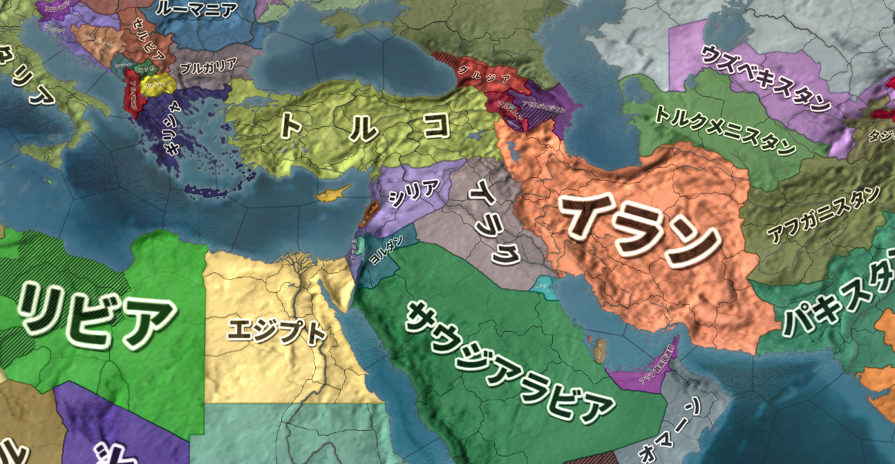

# 現代国際政治史―ModernWarfare
## ●授業動画一覧
|||
|:----:|:----:|
|冷戦末期～後の軍縮1／核軍縮1|[YouTube](https://youtu.be/PLKZ_CArqdQ)|
|冷戦末期～後の軍縮2／核軍縮2|[YouTube](https://youtu.be/w0uQ6DqrtDE)|
|冷戦末期～後の軍縮3／通常戦力関係|[YouTube](https://youtu.be/hteoa3i-Hkw)|
|復活のイスラム1／イスラム教の歴史と特質|[YouTube](https://youtu.be/0TNAxQt-eq8)|
|復活のイスラム2／汎アラブ主義1|[YouTube](https://youtu.be/RjcEM5sHB80)|
|復活のイスラム3／汎アラブ主義2|[YouTube](https://youtu.be/x2Ok2hr0nKQ)|
|復活のイスラム4／イスラム原理主義と米国の蹉跌1|[YouTube](https://youtu.be/8-4JiEO1YFQ)|
|復活のイスラム5／イスラム原理主義と米国の蹉跌2|[YouTube](https://youtu.be/2Wu7WEq42DM)|
|復活のイスラム6／新たなイスラム教の誕生|[YouTube](https://youtu.be/QSAjbiQ-vrk)|

## ●概要
・冷戦終結で、何もかもが変わった訳ではない  
⇒ドイツ連邦共和国（旧西側）の仮想敵国は変わらずロシア連邦（旧東側）だし、日本国（旧西側）の仮想敵国もロシア連邦及び中華人民共和国（旧東側）のままである。冷戦が終わって国際政治の根底が覆る訳ではない  
・とは言え冷戦終結後、国際政治が多極化したのも事実である  
⇒ここまでは米ソの対立に焦点を当てていけば、年代順に一つのストーリーとして国際政治を語れた。だが、冷戦終結後はそうもいかない。冷戦終結後も米露は超大国として国際政治の有力なプレイヤーとなるが、米露だけ見ていてはとても国際政治は語れなくなる  
・そこで、ここからはテーマ別で国際政治を見ていく  
  
  
## ●冷戦末期～冷戦後の軍縮  
・ゴルバチョフの新思考外交以降、米ソ（露）の大量の核装備が問題になった  
⇒相互確証破壊(MAD)の関係から、互いに大量の核戦力を整備していた。冷戦を続けないと考えると、「いくら何でもこんな要らんわ」となってしまった。しかも、核装備を維持するのにもカネが要る  
・こうして、冷戦末期から冷戦終結後しばらくの間、核軍縮が続いた  
・また、核戦力以外の通常戦力についても、「こんなに要らんわ」で軍縮が続いた  
  
  
### 〇核軍縮条約  
  
・1987年：【中距離核戦力(INF)全廃条約】（「INF全廃条約」以外に、単にINFともいう）  
・IRBMに代表される、中距離核戦力を全廃する条約  
※条約では射程が500kmから5500kmまでのものが中距離と定義された  
・例えば米国のこういう核戦力は、主に欧州の西側国家に配備されていた  
・欧州から核戦力を剥がし、米ソにある核戦力だけで核抑止を成立させようという条約  
・2010年以降、ロシア連邦による条約破りが度々指摘される  
・そして2019年には、トランプ大統領が条約破棄を発表。条約は失効した  
  
・1991年：［第一次戦略兵器削減条約(START I)］  
・米ソの戦略（長距離）核兵器の、核弾頭（核爆弾）そのものの数を削減する条約  
※SALTは、核弾頭を運ぶ手段（つまり核ミサイル）の保有数の上限を決めた条約  
・調印した1991年中にソ連が崩壊した為、後継国家のロシア連邦が受け継いだ  
  
・1993年：［第二次戦略兵器削減条約(START II)］  
・START Iに続く、戦略核兵器削減条約  
・調印自体は1993年にされたが、露議会が批准を拒否  
・仕方ないから内容を変更したら、今度は米議会が批准を拒否  
・結局、そのまま流産してしまった  
  
・1996年：【包括的核実験禁止条約(CTBT)】  
・国連で採択された、PTBTを発展させた条約  
・地下核実験を含めて、原則、核爆発を伴うあらゆる実験を禁止しようという条約  
⇒逆に言えば、［未臨界実験］（核爆発を伴わない核実験）はセーフという事。未臨界実験でも充分いける国からしたらノーダメージだし、これじゃ意味がないだろうという事で令和二年現在も未発効。完全に流産した条約と言える  
  
・2002年：［戦略攻撃能力削減条約（モスクワ条約、SORT）］  
・START IIが流産したのを受けて、新しく締結された戦略核兵器削減条約  
・START IIの代わりみたいなものと思っていい  
  
・2010年：［新戦略兵器削減条約(新START)］  
・START Iが2009年に失効した事を受けて、新たに締結された戦略核兵器削減条約  
・SORTの後継条約としても作られており、この新STARTを以ってSORTも失効している  
  
|                          |                |                |                            |  
|:--------------------------:|:----------------:|:----------------:|:----------------------------:|  
|長距離核兵器制限          |中距離核兵器制限|短距離核兵器制限|核実験・核保有そのものの制限|  
|START I、START II、SORT、新START|INF             |特になし        |PTBT、NPT、CTBT                 |  
  
  
|年代                  |条約名        |締結国            |備考                                      |  
|:------------------:|:--------:|:------------:|:--------------------------------------:|  
|1960年代          |PTBT    |多国間      |                                      |  
|↓↓                  |NPT     |多国間      |                                      |  
|1970年代          |SALT I  |米ソ        |                                      |  
|↓↓                  |SALT II |米ソ        |ソ連のアフガン侵攻を受けて流産、未発効|  
|1980年代          |INF     |米ソ        |                                      |  
|1990年代          |START I |米ソ（米露）|                                      |  
|↓↓                  |START II|米露        |未発効                                |  
|↓↓                  |CTBT    |多国間      |未発効                                |  
|2000年代          |SORT    |米露        |                                      |  
|2010年代          |新START |米露        |                                      |  
  
  
  
・おまけ：［非核地帯条約］  
・基本的に、核というのは持っていた方が国際政治上有利である  
・但し、核開発には高度な技術力と大量のカネが必要  
・ついでに核装備の維持にも大量のカネが要る  
・更に言うと、核を新しく持とうとすると米国等から圧力がかかる可能性も高い  
⇒核装備を諦め、「我が国は核なんて野蛮なモノは持ってません、許しません」アピールをする方が、むしろ国益に適うという場合も多い。日本国の非核三原則なんかは典型例  
※また、核兵器を装備する国も、「我が国は核を持ってはいますが平和を愛しているので使うつもりはありません」アピールをしておいた方がいい、という場合は多い  
  
・そんな時にお役立ちなのが非核地帯条約  
・●●の地域では核の使用を許しません、というような条約。世界各地にある  
・代表的な者は↓

|条約名                    |対象となる地域|  
|:--------------------------:|:--------------:|  
|ラロトンガ条約            |南太平洋      |  
|トラテロルコ条約          |中南米        |  
|バンコク条約              |東南アジア    |  
|ペリンダバ条約            |アフリカ      |  
  
  
  
  
  
### 〇通常戦力関係の軍縮条約  
  
・1990年：【欧州通常戦力削減条約(CFE)】  
・冷戦と言えば核兵器！　核は全てを解決する！　みたいなイメージがある  
・が、実際には戦車や銃といった通常戦力も大量に整備されていた  
⇒例えばソ連は、強力な陸軍を整備していた。米国も、「実際に第三次世界大戦になったら、陸戦最強のソ連は止められないから欧州が征服されるのはしょうがない」と考えていたぐらいである。他にも例えば、フランス共和国等の西側欧州諸国は「しょうがないじゃねぇだろ」なので、そういった国々も、自国が征服されないようガチガチに軍備を整えていた  
・勿論、冷戦が終わるという事であれば、過剰な通常戦力は要らなくなる  
・そういう訳で、ロシア地域含む欧州で、冷戦終結に合わせて軍縮しましょうという条約  
・2007年にはロシア連邦が履行停止を宣言  
・2015年には、ロシア連邦が離脱を宣言  
⇒欧州各国の仮想敵国は、基本的にはロシア連邦である（旧西側は冷戦から変わらず、旧東側は冷戦時代の恨みがある）。そう考えると現在、この条約は有名無実化している状態にある  
  
・1992年：［化学兵器禁止条約］  
・第一次世界大戦では、化学兵器（毒ガス）は必須の兵器だった  
・第二次世界大戦になると、「必須ではないが備えあれば患いなし」ぐらいの扱いになる  
⇒その為、この時期には化学兵器の使用を禁止する条約が結ばれている  
・そしてこの時期になると、「非人道的」「野蛮」「テロにでも使うの？」ぐらいの扱いになる  
・こうして、化学兵器の開発、生産、貯蔵、使用を禁止する条約が締結された  
  
・1997年：［対人地雷禁止条約（オタワ条約）］  
・踏むと爆発する罠、地雷は、戦時には極めて便利で有効な兵器と言える  
・問題は戦後で、何処に地雷が埋まってるか分からんような場所で暮らすのは非常に危険  
⇒実際、紛争・戦争が終わって何年も経ってから、地雷を踏んで死んだ、脚が吹っ飛んだ、というような例は後を絶たない  
・だから対人地雷を禁止しましょう、というのでできた条約  
⇒自国領が戦場になりやすいと自覚している国や、戦争から遠い国は批准している場合が多い。逆に、「必要なら戦争ぐらいいくらでもしますよ」という国は批准していない場合が多い。実際、アメリカ合衆国、ロシア連邦、中華人民共和国といった国々は批准していない  
※実際のところ、対人地雷の使用はバリバリ増えているのが現状  
  
・2010年：［クラスター弾に関する条約］  
・クラスター弾というのは、大きな爆弾がぱかっと開いて中から小型の爆弾が大量に出てくるもの  
・絨毯爆撃に便利な爆弾で、戦時には極めて有効な兵器と言える  
・問題は戦後で、不発弾になりやすい。そして不発弾は何かの拍子に爆発する事がある  
・という訳で、地雷と似たような経緯と理由でクラスター弾を制限しようという条約  
・やはり、「必要なら戦争ぐらいいくらでもしますよ」という国は基本、批准していない  
※なのでやっぱり、地雷と同様実際の戦争・紛争ではバリバリ使用されている  
  
## ●復活のイスラム  
### 〇イスラム教の歴史と特質  
・イスラム教は、ユダヤ教、キリスト教と共に旧約聖書を啓典とする宗教である  
・この三宗教の中では、イスラム教の特色として「完成度が極めて高い」というのが挙げられる  
・逆にキリスト教は、「完成度が低い」というのが特色と言える  
  
・キリスト教は、教義の完成度が低い。互いに矛盾するようなところがかなりある  
例：キリスト教は一神教である。ところで、イエス・キリストは神の子である。「神の子って事は神の一種じゃないの？」「って事は神が複数いるって事になりません？」という話に、当然なる。キリスト教には、こういうところが沢山ある  
  
・キリスト教には、教義に矛盾を多く抱えるが故に「完成度が低い」という特色がある  
・しかしこの特色によって、「正しい教義を話し合って決める」という伝統が生まれた  
・そこから更に、「時代に合わせて考えを変えていく」という伝統も生まれた  
例：新旧聖書には、奴隷制が悪い、とは書いていない。奴隷をこういう風に扱いなさいとかは書いてあるが、「奴隷制は悪い事だからやめなさい」とは書いておらず、事実上容認されている。だから、中近世のキリスト教世界には奴隷制が合法的に存在し得た。しかし近代に入ると「キリスト教の博愛と平等の精神から考えたら、奴隷制って駄目では？」という話になり、奴隷制はなくなった。時代に合わせて、考え方を変えたのである  
  
・一方、イスラム教は極めて完成度が高かった  
・コーランもハディースも、極めて完成度が高い  
※コーランが聖典。ハディースは預言者の言行録。イスラム教は基本的に、このふたつ（と聖書の一部）を経典とする  
  
・その完成度の高さがあったからこそ、中近世に於いて、極めて先進的な文明を築けた  
⇒何せ、イスラム教には「どうやって国を統治するか」みたいな教えまである。故にイスラム勢力では、イスラム教の教えに従って国が統治された。そして、中世全体を通して、キリスト教世界を田舎とすればイスラム教世界は都会であった。イスラム教誕生以降、千年以上に渡ってこの構図は維持された  
  
・しかも、コーランやハディースの解釈については、信者個人の自由に任されていた  
⇒イスラム教の学者というのも存在するが、「これはあくまで私の解釈で、真の解釈はアッラーのみがご存知です」というスタンスを崩さない。そういう、極めて先進的でリベラルな姿勢をも持っているのがイスラム教  
  
・ただ、その完成度の高さ故に、「時代に合わせて考えを変えていく」という伝統が生まれなかった  
・一応、ちょっとずつ変わってはいたのだが、本当にちょっとだった  
・となれば、いかに完成度の高い宗教とは言え、誕生から千年以上も経てば時代についていけなくなる  
・こうして、イスラム教は近代に入ると没落を始めてしまう

  
・かつてイスラム帝国として名を馳せた地域は、近代にはその殆どが欧米の植民地になってしまう  
・両大戦を通してそういった地域は独立していくが、その最初の目標は「脱イスラム」「世俗化」だった  
⇒代表例はトルコ共和国。イスラム国家であるところのオスマン帝国の後継国家として誕生したトルコ共和国は、国父ムスタファ・ケマルの指導の下世俗化を掲げ、近代化と欧化を推し進めた。例えば政教分離政策を進めたり、その一環としてターバンの着用を禁止（女性のヒジャブは禁止こそしなかったものの極めて好ましくないものとした）したり、文字をアルファベットに変更したり（そもそもアラビア文字はトルコ語と相性がよくなかったが、イスラム教発祥の地の文字として使われていた）した。そうして、トルコをトルコ共和国という国民国家として、民主主義国家として生まれ変わらせた  
  
・では、脱イスラム、世俗化が掲げられた時代、何を以って統合の象徴としようとしたか？  
・第二次世界大戦後の中東に於いて、それは［民族主義］だった  
⇒両大戦期から戦後にかけて、「自分達の事は自分達で決める」という権利をあらゆる民族に認めよう、という機運が生まれていた。これを「民族自決」などと言うが、そこから世界各地で［ナショナリズム］、つまり［国民主義、国家主義、民族主義］と言われるものが盛り上がっていった  
  
・大戦直後の中東では民族主義が、ナショナリズムが流行った  
例１：パフラヴィー朝イラン帝国では、「俺達はイラン人だ」という意識が高まった  
例２：トルコ共和国では、「俺達はトルコ人だ」という意識が高まった  
例３：他の中東地域では、汎アラブ主義が盛り上がった  
⇒中東に住むアラブ人は、皆兄弟である。兄弟同士、団結しよう。欧米の植民地支配から立ち上がろう。アラブ人の国を皆で作り上げていこう！　みたいな感じの、世界に数ある民族主義のひとつ  
  
### 〇汎アラブ主義  
  
  
令和二年現在の中東周辺図。伝統的に、中東とは北はトルコ、南はイエメン・オマーン、西はエジプト、東はイランまでを指す。この地域に住む者は皆、「アラブ人」という意識をある程度共有していた。戦後、伝統的中東の人間は、汎アラブ主義に熱狂していく。例外はトルコ（トルコ人という意識が既に明確にあった）、イラン（伝統的にペルシア人という意識がある）等。またその例外国も、汎アラブ主義と同じ世俗化路線を採った。  
Paradox Interactive社のEuropa Universalis IV（Extended TimelineMOD及び日本語化MOD使用）より  
  
・汎アラブ主義が本格的に始まるのは第二次世界大戦直後である  
・第二次世界大戦まで、中東に住む者は皆、「アラブ人」という意識をある程度共有していた  
・だからこそ、汎アラブ主義が盛り上がった  
・しかし、第二次世界大戦直後、異邦人がやってくる  
・【ユダヤ人】である  
  
・ユダヤ人は、古代のパレスチナに住んでいた民族である  
・ユダヤ人は国を滅ぼされ、以後千年以上に渡り、国なき民として世界各地に離散する事になる  
・そしてユダヤ人は、歴史的にキリスト教徒及びイスラム教徒から嫌われてきた人々である  
⇒スエズ危機で既に見たが、ドイツ人だけがユダヤ人を嫌いなのではない。欧州のキリスト教徒は皆ユダヤ人が嫌いであり、ユダヤ人を弾圧し、殺してきた歴史がある。欧州キリスト教徒のユダヤ人嫌いの集大成が、第二次世界大戦期のドイツ国による［ホロコースト］と見るべきである  
※第二次世界大戦後の欧米人は、一般にユダヤ人に同情的だが、これは歴史的には例外と言える。何故そうなったかと言えば、戦後の世界というものは「悪のナチス・ドイツを正義の連合国が倒した」という神話によって作られたから。だからこそ、悪のドイツに迫害されたユダヤ人に対しても、欧米人は同情的になったのである  
  
  
・ユダヤ人は嫌われてきたが故に、千年単位で国を持つ事ができなかった  
・ユダヤ人の国がないという事は、逃げ場がないという事である  
⇒日本人は、日本国という日本人の国がある。ヨーロッパとか中東に住んでいて、日本人が迫害されたとなっても、日本国という逃げ場がある。ユダヤ人にはこの逃げ場がなかった  
・第二次世界大戦期に於けるホロコーストは、逃げ場のないユダヤ人の危機感を刺激した  
⇒ユダヤ人の迫害というのは、ドイツだけの特別な現象ではない。ドイツに於けるホロコーストとは所詮、欧米キリスト教徒によるユダヤ人迫害の集大成に過ぎない。次はいつどこでホロコーストが起きてもおかしくない。その時、逃げ場がないのは問題である  
  
・こうして、特に第二次世界大戦期から、ユダヤ人によるユダヤ国家建設運動が盛んとなる  
・終戦直後、ユダヤ人は国連を動かし、父祖の地パレスチナにユダヤ人国家を建設する事を採択させた  
⇒国連を動かしたと言うか、欧米各国を動かした。特にアメリカ合衆国。この当時の国連は冗談抜きの戦勝国クラブであり、戦勝国にあたる連合国を動かす事が重要だった  
・こうして、ユダヤ人の国イスラエルが、中東はパレスチナに建設される事になった  
  
・国連も、なかなかいい面の皮と言える  
・パレスチナが無人ならばともかく、そこにはアラブ人（パレスチナ人）が住んでいたのである  
⇒国連は、既にアラブ人が住んでいるパレスチナを分割し、「パレスチナの一部はユダヤ人の国」「一部はアラブ人の国」という形にしよう、と言ったのである。しかも、現地住人を含むアラブ人の反対を押し切って。当時中東アラブ諸国は殆どがまだ植民地（パレスチナも英国植民地であった）だった為、国連決議を動かす事はできなかった  
  
・パレスチナ分割及びユダヤ人国家建設の国連決議が出た翌日から、パレスチナは内戦状態となった  
・ユダヤ人は、パレスチナにユダヤ人国家を建設せんとする  
・アラブ人はユダヤ人国家の建設を阻止しようとする  
※パレスチナ在住のアラブ人が阻止しようとしただけではない。中東の多くの地域から、ユダヤ人国家建設を阻止すべく、アラブ人が義勇軍として集まってきた  
  
・こうして、イスラエル建国戦争でもある［第一次中東戦争］が起きた  
・ユダヤ人はこの戦争を戦い抜き、何とかイスラエルというユダヤ人国家の建設に成功する  
  
  
・この第一次中東戦争は、中東に大きな爪痕を残した  
  
・ユダヤ人国家イスラエルは建国されたが、その建国を否定される戦争の中でイスラエルは生まれた  
⇒ただでさえイスラエルは、「我々には逃げ場がない」という意識を持つユダヤ人の国である。第一次中東戦争という経験は、「イスラエルが失われたら、我々にはもう行き場はない」という認識を、ユダヤ人へ強烈に刷り込んだ。そして、「我々はどんな事をしてでも生き残ってやる」というユダヤ人の決意を生んだ  
  
・一方、盛り上がり始めたばかりの汎アラブ主義は、ユダヤ人という宿敵を持ってしまった  
・本来なら、汎アラブ主義の敵意が向かうべきは欧米である  
⇒アラブ人を植民地化していたのは欧州各国、英国や仏国である。アラブ人は団結して欧州に対抗しよう、となるのが普通だろう  
・そこに、ユダヤ人という敵が現れ、アラブ人の土地を奪い、そしてアラブ人を戦争で打ち負かした  
⇒ユダヤ人は欧米を動かしてアラブ人の土地を奪い、そしてアラブ人を負かした。この敗北は、「ユダヤ人はアラブ人の敵である」「アラブ人は団結してユダヤ人を倒そう」という意識を生んでしまった。汎アラブ主義華やかなりし頃の中東では、旧ドイツ国軍人や科学者が、「かつてユダヤ人と戦った英雄」として歓呼と共に迎え入れられる事すら起きる。それほどまでに、ユダヤ人の打倒はアラブ人の至上命題となってしまった  
  
・こうして、アラブ人とユダヤ人という、本来なら戦わなくてもいい両者は、宿敵となってしまった  
  
・以後、アラブ人はユダヤ人殲滅を求める  
・一方、イスラエルは領土の拡張を求めた  
⇒自民族の根絶を求める敵に囲まれたイスラエルは、極めて守りにくい地形をしていた。特に建国当初のイスラエルは、国境線に大砲を並べてつるべ撃ちにするだけで全土が焼け野原になるような地形だった。その為、領土拡張によって守りやすい地形を求めた  
  
・冷戦期を通して、汎アラブ主義を掲げるアラブ国家とイスラエルは、何度も戦った  
・第一次オイルショックを引き起こした［第四次中東戦争］も、アラブとイスラエルの戦いである  
・また、［パレスチナ解放戦線(PLO)］も汎アラブ主義諸国の支援を受けている  
⇒パレスチナをアラブ人の手に取り戻す、という目標を掲げた国際テロ組織。特に冷戦期、盛んにテロを繰り返し、またレバノンを征服して活動拠点とした。後に、イスラエル軍の攻撃を受けて弱体化する  
  
### 〇イスラム原理主義の登場と米国の蹉跌  
・汎アラブ主義は、アラブ人の団結、そして世俗化（脱イスラム）による近代化という大義を掲げた  
・しかしイスラエル建国により、もうひとつ、反ユダヤという大義も加わった  
・これが、汎アラブ主義の不幸であった  
  
・イスラエルは、戦った。戦って戦って、常に勝利を収めた  
⇒まさに「我々はどんな事をしてでも生き残ってやる」というユダヤ人の意識が、イスラエルを常に勝利させた。ユダヤ人はあらゆる手を使って欧米諸国の支援を引き出し、兵器を輸入し、兵隊を訓練し、勝利を重ねた  
・反ユダヤという大義をも持ってしまった汎アラブ主義は、度重なる敗戦によって人々の支持を失っていく  
・汎アラブ主義に代わって中東アラブ人の心を捕らえたのは、イスラム教であった  
  
・その明らかな兆候は、冷戦後期に見られる。例えば1979年末からの、ソ連のアフガン侵攻である  
・この時、アフガンには中東各国から義勇軍として、イスラム教徒が集まった  
⇒彼らはイスラム聖戦士（ムジャヒディン）と呼ばれ、米国はCIAを通じて彼らを支援した。志願兵の中には、後に米国中枢を直撃するテロを起こす、【ウサマ・ビンラディン】の姿もあった  
・アフガン侵攻の直前には、イランで革命まで起こっている  
⇒イランは、汎アラブ主義に賛同こそしていなかったものの、世俗化を目指すという意味では汎アラブ主義と同じ路線を採っていた。そのイランで、「世俗化は糞」「イスラム教に基づく統治こそが至高」というイスラム原理主義革命が起こった。明らかに、中東諸国に於ける「脱イスラム」「世俗化」という路線が人気を失い、イスラム教の人気が戻りつつあった  
  
・この時人気が戻ったイスラム教は、アラブ諸国各地で連綿と受け継がれてきた「伝統」という側面が強い  
・昔ながらの伝統と慣習を重視した国家が求められるようになっていった、と言える  
・そのような視点からすると、世俗化とか、近代化とか、そういったものは敵である  
・そして、世俗化とか近代化とは一体何処から来た発想か？　と言えば、それは欧米と答える他ない  
⇒こうした発想の中で、「アラブ諸国は欧米やユダヤ人による侵略を受け、抑圧されている」「我々はイスラム世界を守る為、戦わねばならない」という思想を持つ者も出てくる  
  
・［2001年］の【9月11日】に起きたいわゆる911テロは、この思想の延長線上にあると言ってよい  
⇒アメリカ合衆国の複数の重要施設へ、アルカイダ構成員にハイジャックされた飛行機が突っ込んだ。犠牲者は三千人近くという、大惨事となった  
・首謀者はイスラム原理主義組織［アルカイダ］の【ウサマ・ビンラディン】  
・当時の米国大統領［ブッシュ］は、直ちに報復措置を決意  
・当時アルカイダの本拠地があったアフガニスタンへ攻め込むのである  
  
・これ以降、アメリカ合衆国は中東へ積極的に介入するようになる  
⇒これ以前から介入はしていたが、基本的にはCIA等の情報機関や、外交機関を通じて間接的に介入していた。軍隊を送り、占領して、現地で政府を作って…というような本格的な介入をしていくのは、この911テロ以降と言っていい  
  
・米国による中東介入の最大の例は、2003年の【イラク戦争】である  
・この時、米国は［ブッシュ・ドクトリン］を掲げ、攻撃に踏み切った  
⇒「我が国に対して大量破壊兵器を使う恐れのある国に対する先制攻撃は、自衛の範囲である」とするのがブッシュ・ドクトリン。これに従って、米国はイラク共和国へ攻め込んだ。この攻撃で［サダム・フセイン］のバース党政権は崩壊、米国による占領と統治が始まる。ただ実際には大量破壊兵器は発見されず、「イラクにある油田が欲しかっただけでは？」という声も強い  
  
・こういった中東介入は、結果的に見て、失敗だったと言っていいだろう  
・理由はいくつかあるが、大きな理由として、占領政策の失敗を挙げておくべきだろう  
⇒日本人に対してやったように、「今まで皆さんは、民主主義国家とは名ばかりの独裁政権に支配されていました」「ですから、我々が独裁政権を倒しました！」「これからは、真の民主主義の時代になるのです！」というような占領政策を行った。これが日本でうまくいったのは、大正期以降の日本が、民主主義で運営されていたからである。戦時国家総動員体制から、平時の民主主義体制に戻せばよかった。しかし中東では、民主主義はうまくいかない。民主主義が成功するには、国民一人一人が国の事を考え、「この国をよくするにはこうしたらいいんじゃないか」「いや、こうした方がもっとこの国はよくなるし、皆幸せになれる」と議論を重ねられる環境が必要である。しかし、中東にはそもそも「国って何だよ？」ぐらいの人が多い。自分の部族さえよければそれでいい、国って何だよ、というレベルなのである。これで、民主主義がうまくいく方が不思議である  
  
・この「何でも民主主義にすれば解決！」という勘違いは、別に米国だけのものではない  
・2010年末から、中東諸国で次々と革命が起きた。欧米諸国は、この革命を支援している  
・［アラブの春］と褒めそやし、民主主義国家誕生によって中東はよりよくなると欧米諸国は期待した  
⇒では革命によってできた民主主義国家の皆さんはどうでしたかと言うと、民主制に移行してうまくいったのはチュニジアだけ。リビア、イエメン、シリアは令和二年現在も大絶賛内戦中。エジプトは国内の対立が激化してクーデターが発生、再び独裁政権になっている  
  
・尚、この泥沼化した中東から撤退する、と公約して米国大統領になったのがトランプである  
・実際、中東はカネとアメリカ人の血を吸うばかりで、得られたものは決して多くはなかった  
・言ってみれば、中東と米国の関係はブッシュ、オバマ政権の負の遺産と言える  
⇒オバマ政権も、なんだかんだと言って中東介入路線は継続している。アラブの春の対応を誤ってシリア内戦やリビア内戦を泥沼化させてしまったのもオバマ政権時代の話である  
・この撤退がうまくいくかどうかは、令和二年現在はまだ不明、と言える  
※但し、誰かがいつかやらなければならない仕事なのは確かである  
  
### 〇新たなイスラム教の誕生  
・冷戦期にイスラム教は人気を回復させた  
・このイスラム教は、中東諸国の伝統と慣習の復活という側面があった  
・この伝統と慣習の復活の中で、911テロのアルカイダも生まれた  
  
・さて、2010年代にもなると、イスラム教に新たな潮流が生まれる  
・この頃になると、スマートフォン等の端末が発展途上国含めて世界中に普及する  
・これによって、誰であってもインターネットにアクセスできるようになった  
  
・そうなる以前、イスラム教のコーランやハディースの解釈は、知識人による寡占状態にあった  
⇒コーランが聖典。ハディースは預言者の言行録。イスラム教は基本的に、このふたつ（と聖書の一部）を経典とする。コーランとハディースが分かればイスラム教は分かると言ってもいいぐらい、イスラム教に於いて重要。ただ、コーランやハディースを読めるのは、カネと余裕のある、一部の知識人だけだった  
・それが、スマホでインターネットに繋げば、誰でも原典にあたれるようになった  
・また、どのような解釈が存在するかも、検索すれば出てくるようになった  
・そして自分の解釈はこうだとか言って議論する事も、SNS等で可能になった  
  
・これは一種の革命であったと言っていい  
・こうなる以前は、コーランやハディースといった原典を読めるのは、一部の人間だけだった  
・解釈を行うイスラム法学者達は、基本的には穏健な解釈を提示してきた  
・しかし、技術の進歩によって、誰でも原典にあたれるようになった  
・そして、原典には書いてあるのである  
・例えば、「ジハードしろ」「何か理由付けてジハードしない奴は糞だぞ」とか  
・例えば、「カリフによる統治こそ、イスラム教徒にとって唯一正しい統治体制だぞ」とか  
  
・この革命は、新しいタイプのイスラム教徒を生んだ  
・伝統とか慣習という意味でのイスラム教でなく、原典にあたって得た教えを奉じるイスラム教徒である  
・しかも、以前述べたように、イスラム教に於いて解釈は個人の自由と信仰に任されている  
⇒イスラム法学者は解釈を出すが、その際「これはあくまで私の解釈で、真の解釈はアッラーのみがご存知です」という態度を採らねばならない。つまり、過激な解釈をするイスラム教徒が出てきたから「その解釈は絶対に間違いだ」とか言った場合、「お前はアッラーにでもなったつもりか」と言われてしまう  
  
・こうして生まれた新しいタイプのイスラム教、その到達点の一つが【イスラム国】である  
※ISIS、ISILなどとも呼ばれる  
・アルカイダの幹部だったバグダーディーは、カリフを名乗り、カリフ制国家の樹立を宣言した  
・これは、イスラム教の経典を見れば書いてある、「正しい統治体制」を復活させる宣言であった  
・イスラム国が世界中の若いイスラム教徒を惹き付けた理由はここにある  
・また、新しいタイプのイスラム教だったからこそ、旧来のイスラム勢力とは対立したのである  
⇒実際、バグダーディーはアルカイダ幹部だったにも拘わらず、イスラム国とアルカイダは絶縁関係にあり、敵対している。また、あらゆる「伝統と慣習」型のイスラム勢力から猛批判を浴び、敵対されている  
  
・バグダーディーは2019年、米軍の作戦により死亡している  
・また、シリアに誕生して大勢力を築いたイスラム国の勢力は、ほぼ掃討された  
・しかし、「自分で原典にあたる」タイプのイスラム教が壊滅した訳ではない  
⇒そうである以上、そしてイスラム教の原典の価値観と現代の国民国家や民主主義の価値観が全く相容れないものである以上、問題の根本的な解決は難しいと言えるだろう  
※キリスト教にしても、聖書が奴隷制を否定していないように、原典の価値観と現代の価値観は異なる。しかしキリスト教は、完成度が低いからこそ「時代に合わせて考えを変える」という伝統があった。逆に、イスラム教は完成度が高いが故に、そういう伝統がなかなか生まれなかった。誕生以来穏健な形に少しずつ変わってはいたのだが、本人達に「変わった」という認識はなく、「時代に合わせて考えを変える」という伝統までは生まれなかった。ここに、悲劇がある  
  
・尚、こういった動きはイスラム国を生み出しただけではない  
⇒令和二年現在のトルコ共和国で、カリフ制復活が真剣に議論されているのもこの延長線上にあるとみていいだろう  