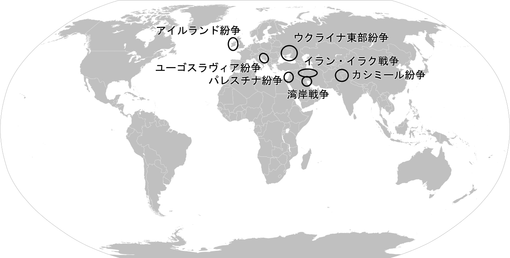
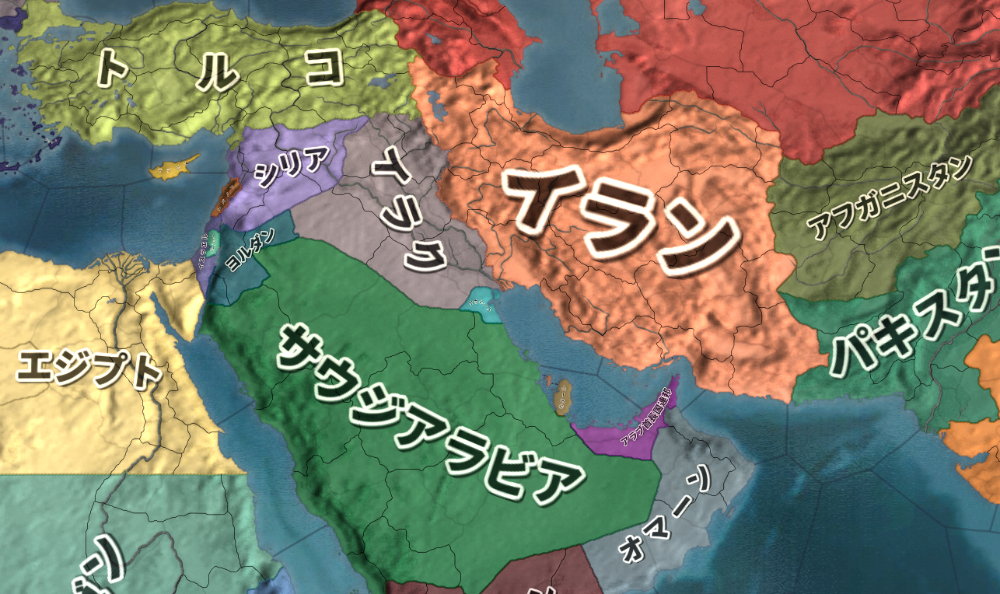
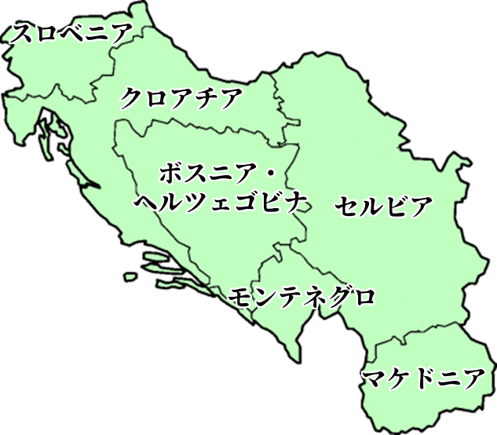
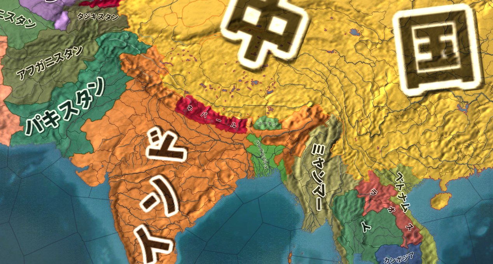
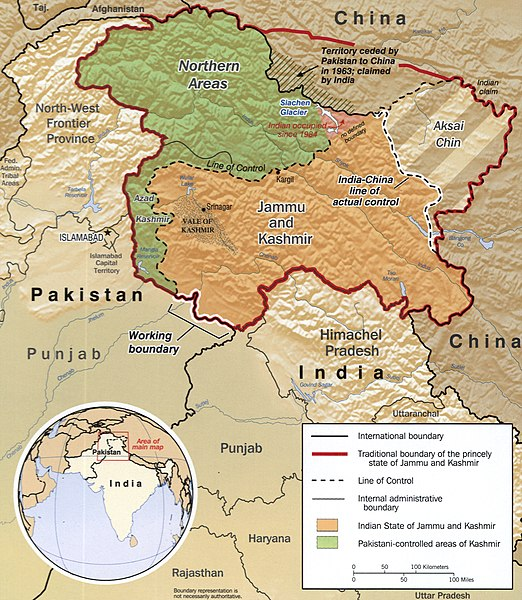

# 世界の紛争
## ●授業動画一覧
|||
|:----:|:----:|
|世界の紛争のパターン1|[YouTube](https://youtu.be/cgh0S3pFg38)|
|世界の紛争のパターン2|[YouTube](https://youtu.be/5KFIo3B8D_0)|
|世界の紛争のパターン3|[YouTube](https://youtu.be/sxdsKcqB3is)|
|世界の紛争のパターン4|[YouTube](https://youtu.be/Cggvr38y2qQ)|
|世界の紛争のパターン5|[YouTube](https://youtu.be/KOQvok8Ltbw)|
|世界の紛争個別紹介1／イラン・イラク戦争|[YouTube](https://youtu.be/W-NXece-dGI)|
|世界の紛争個別紹介2／湾岸戦争|[YouTube](https://youtu.be/xq7wnaGwmRo)|
|世界の紛争個別紹介3／パレスチナ紛争|[YouTube](https://youtu.be/wl7-PL6XqCk)|
|小休止／戦後中東史概略|[YouTube](https://youtu.be/bMYohOD2KQ4)|
|世界の紛争個別紹介4／ウクライナ東部紛争|[YouTube](https://youtu.be/wEzkyVd-xmM)|
|世界の紛争個別紹介5／ユーゴスラヴィア紛争|[YouTube](https://youtu.be/z339Rou5tEg)|
|世界の紛争個別紹介6／北アイルランド紛争|[YouTube](https://youtu.be/YZqlS_gu3Js)|
|世界の紛争個別紹介7／カシミール紛争|[YouTube](https://youtu.be/Zbsa1HE9azA)|
|世界の紛争個別紹介8a／BLM騒動1|[YouTube](https://youtu.be/2dWBN3ssm9E)|
|世界の紛争個別紹介8b／BLM騒動2|[YouTube](https://youtu.be/wzjoWs-wTuM)|

## ●概要
※本当は国際政治史―Modern Warfareの一部ですが、長いので独立させました    
  
・世界には、今でも様々な紛争がある  
・その中でも、有名なものをピックアップ  
・また、かつてあった紛争についても有名どころをピックアップ  
  
  
今回、項目付で取り上げる紛争一覧。勿論、ここに挙げた以外の紛争も沢山ある。  
by Canuckguy and other, public domain, https://commons.wikimedia.org/wiki/File:BlankMap-World.svg  
上記を筆者が改造  
  
  
## ●世界の紛争（パターン分析）  
・現代史に於ける紛争には、原因によってある程度種類分けができる  
・これを知っておくと、色々と助けになるだろう  
  
### 〇共産主義によるもの  
・共産主義は、誕生以来戦争の種になってきた  
・そもそも論として、「金持ちを殺せば幸せになれる」理論なので、暴力革命を誘発する  
・しかも「世界中の皆で金持ちを殺しましょう」理論でもある  
・なので、一度革命が成功すると世界中で革命を成功させようと宣伝・諜報・侵略を始める傾向にある  
・第二次世界大戦や冷戦は、こういった共産主義の特性が原因のひとつになっている  
・ネパール（中華人民共和国とインドの国境地帯にある国）が内戦になったのも、共産主義の輸出が原因  
  
  
### 〇共産主義の失敗によるもの  
・共産主義はだいたいうまくいかない  
⇒「金持ちを殺せば幸せになれる」「金持ちを殺して、労働者の労働者による労働者のための楽園を作りましょう」理論が共産主義だが、その理論がいかにも胡散臭いところから分かるように、まず楽園は作れない  
・そして「楽園が作れないのは、革命の邪魔をする奴がいるからだ。殺せ」と言い始めるのがいつもの流れ  
・なので、共産主義国家では粛清・虐殺が多い  
・当然、そこから紛争に発展する場合も多い  
・独裁者ポル・ポト治世下のカンボジアがまさにこれで、大虐殺を引き起こしその後内戦になった  
⇒多分共産主義政権の中で最も「ヤバい」独裁者。知識人は人民の敵として、本を読む者は死刑、海外旅行した事がある者は死刑、時計が読める者は死刑、眼鏡をかけていたら死刑、果ては手が綺麗だから死刑、みたいな事をやっていた  
・共産主義の北ベトナムによるベトナム統一後も、大虐殺が起きている  
・中華人民共和国で起こった文化大革命による虐殺も、だいたいこれが原因  
・第二次世界大戦期にソ連で起きたウクライナ飢饉も、だいたいこれが原因  
  
### 〇欧米諸国の植民地支配に関係したやらかし  
・欧米諸国は、かつて世界中を植民地にしていた  
⇒例えば東アジアで植民地にならなかったのは、日本とタイぐらいなものである  
・欧米諸国は、植民地の人間を奴隷のように扱い、富を搾取していた  
・普通にそういう事をすれば、植民地の人間は欧米を恨み、団結して反乱を起こす可能性がある  
・そこで欧米諸国が常套手段としたのが「分断して統治せよ」という原則  
⇒植民地の人間を複数の集団（例えば民族）に分割し、特定の集団（少数派の場合が多い）に特権を与え、欧米諸国の代理人として植民地を統治させる。すると、大多数の植民地人の恨みは欧米諸国ではなく、現地で支配者やってる集団に向かう。欧米諸国からすると、植民地の人間同士でいがみあってくれるからこっちに向けては反乱起こしてこないし、搾取は続けられるしニッコニコ、というもの  
・こういう事をやってたので、第二次世界大戦以降、欧米が植民地から手を引くと高確率で内戦になる  
⇒「てめぇ植民地時代はよくもやってくれやがったな」というので虐殺・紛争・内戦が起こる  
・［ルワンダ内戦］なんかはまさにこういうタイプの内戦  
⇒ルワンダを植民地支配したベルギーが、少数派の［ツチ族］に多数派の［フツ族］を支配させていた  
・［スリランカ内戦］も典型例である  
⇒スリランカを植民地支配した英国が、少数派の［タミル人］に多数派の［シンハラ人］を支配させていた  
  
・ミャンマーで少数民族問題がこじれたのに関しては、「分断して統治せよ」にはあまり関係がない  
・が、「結局のところ欧米諸国の植民地支配関係でこうなってるんでしょ？」と言われたらそう  
・より正確には、ミャンマーの場合は民族主義と植民地支配の不手際が混ざって起こっている  
・よって、後でまた述べる  
  
  
  
### 〇傀儡国関係（植民地支配関係のやらかしの亜種）  
・特に冷戦期、米ソはそれぞれ、できるだけ多くの地域を自陣営のものとしようとした  
・とは言え、西側陣営の中核となる欧米諸国は、基本、世界中で嫌われている  
⇒例えば、西側欧米諸国から独立した植民地は、当然西側欧米諸国が嫌いである。彼らは一般的に、西側と対立する東側、つまりソ連になびこうとする。【キューバ】や北ベトナムなんかはまさにそう  
・西側頭目たる米国とすれば、そういう事態はなるべく避けたい  
・だから、親米とあればどんな政権であろうとも支援する  
⇒とは言え、米国はかつて自分達を搾取していた西側欧米諸国、その頭目である。例えば旧植民地の人間なら、普通の人は米国を好きにはならない。なるとしたら、米国のカネ目的のやべー奴ぐらいなものである。そして米国は、やべー奴による政権であろうとも、親米ならば支援しようとする。圧政を布いていようが何だろうがお構いなし。本来ならばとっくに民衆の反対で倒れてるような政権でも、米国のカネと力で生き残らせる  
・で、本当にどうしようもないドン詰まりになってしまって国内が混乱する、というパターン  
・南米で独裁政権からの内戦・内紛が多いのはだいたいこれが原因である  
・イラン革命なんかもこれに近いところがある  
  
### 〇覇権争い、代理戦争  
・冷戦期が顕著だが、大国同士が直接戦争するのではなく、第三国を舞台に代理戦争する場合がある  
⇒冷戦期以降、大国同士で直接戦争すると核戦争になる可能性が出てきた。また、核を持たない国でも、露骨に直接戦争すると、多国籍軍が送られてきたり経済制裁を受けたりする可能性がある。【湾岸戦争】はまさにこの例  
・これを避けるべく、近隣諸国の内戦に介入し、自国寄りの政権を打ち立てる…という行動が増える  
・そして、複数の国が介入した結果、代理戦争化する事もよくある  
・令和二年現在も進行中の［シリア内戦］が泥沼化したのは、これが原因  
⇒米国はトランプ大統領の指揮下で手を引きつつあるため、今後はトルコ共和国、ロシア連邦、イラン共和国といった国々の代理戦争として続く可能性がある。三国共に、中東の覇権を狙っている国である。尚、ロシアとイランは政府軍（［アサド］政権）を、トルコは反政府勢力の一部を支援している  
・［イラン・イラク戦争］も、イラン革命の影響を抑えたい各国が支援しており、代理戦争の側面がある  
  
### 〇大国による小国の征服、侵略  
・昔はよくあったが、第二次世界大戦以降、特に減ったパターン  
・冷戦期以降は基本的に、代理戦争でやる  
・但し、全く例がない訳ではない  
・［ウクライナ東部紛争］でのロシアによるウクライナ領クリミア半島の併合は、まさにこれである  
・また、軍事力によらず、経済力によって征服しようとする場合もある  
⇒［中華人民共和国］の場合、返済不能な多額の借金を小国に背負わせて、借金の「カタ」にその国を支配する、というような手を使っている。［一帯一路］もその延長線上にあるが、現状ではまだ、この手段が紛争に発展した例はない  
・尚、［中華人民共和国］は、現在も軍・経織り交ぜた戦略で［台湾］併合を狙っている  
⇒と言うかぶっちゃけ、日本も標的であると言っていいだろう。中華人民共和国が太平洋に進出するとなると、どうしても邪魔になる位置に日本列島と台湾がある。中華人民共和国が日本・台湾を狙うのは、力と力がぶつかる国際政治の世界では当然の話である。そして狙われた日本・台湾が、力の均衡を狙って米国と結ぶ。このように、現代でも外交による安全保障は【勢力均衡】が基本である  

### 〇民族浄化  
・両大戦期以降、ナショナリズムや民族主義が勃興し、民族は様々な内戦・紛争の種になっている  
・そのひとつの表れが、民族浄化  
・「この国は〇〇人のものだ。△△人、貴様らの居場所ではない」として△△人を皆殺しにする、みたいな  
・［ユーゴスラヴィア内戦］はだいたいこれが原因で悲惨な事になっている  
・尚、民族浄化は必ず皆殺しにする方針を採る訳ではない  
⇒少数民族の住む地域に多数派民族を移住させ、また少数民族の文化・宗教・言語を禁止し、多数派民族に［同化］させてしまう、という手もある。勿論反抗する少数民族は殺すので、全く殺さない訳ではない  
・中華人民共和国で、令和二年現在も続く［チベット］、［ウイグル］問題は同化型の民族浄化である  
⇒共産主義は「宗教は麻薬」として「労働者を惑わす宗教を根絶する」という目標を掲げてもいる。チベット人はチベット仏教を、ウイグル人はイスラム教を主に信仰しており、共産主義国家たる中華人民共和国による民族浄化は、共産主義が原因という側面もある  
  
### 〇民族独立  
・他の民族に支配されている民族が、「俺達の国を作ろう」で独立しようとするもの  
・支配している方は、自分の領土が減るのは嫌なので、大抵独立運動を抑圧する  
・そのせいで、紛争や内戦、独立戦争に発展する事が往々にしてある  
・［ユーゴスラヴィア内戦］の発端はこれである（民族浄化で過激化した）  
・中東各国に少数民族として住む［クルド人］は度々独立運動を起こしており、紛争になっている  
⇒今のところ「クルド人の国」というものはない。そのせいで冷戦期以降は特に独立運動が激しく、トルコやイラクで平和に少数民族として住んでいるクルド人であっても、親戚の親戚には必ず独立を目指すテロ組織に加入している人がいる、というぐらいのレベルである  
・また、支配されている方が、支配している方につく場合もある  
⇒支配民族と婚姻が進んで支配民族寄りになったとか、支配されている方の一部が支配民族によって特権を与えられ、その特権を手放したくないが故に支配民族寄りになる…等の場合である  
・【アイルランド紛争】はまさにこれのせいでこじれた
  
・ミャンマーでこじれている少数民族［ロヒンギャ］問題は、基本的にはこれ  
※他に、欧米の植民地支配と宗教が関わってくる  
・ミャンマーという国は元々、多数派のビルマ人とそれ以外の少数民族の対立が激しい  
・特にロヒンギャは、  
１：宗教が違う（多数派のビルマ人は仏教、ロヒンギャはイスラム教）  
２：割と最近、移民で増えた（イギリスがこの地域を植民地支配した十九世紀以降）  
・という二つの理由から、特にビルマ人から嫌われている  
・ミャンマーはかつて軍隊による、いわゆる軍事政権だったが、この頃から弾圧はあった  
・その後、かつて民主化運動の顔だった［アウン・サン・スー・チー］が政権を奪取したが…  
１：そもそも彼女自身が民主主義的かと言われるとそうではなかった  
２：政権を奪取したにしても、軍隊の力は依然強かった  
３：ロヒンギャ側もテロを起こした  
・というところから、ロヒンギャ問題は一気に悪化、虐殺と言ってよいような事態に発展した  
・しかもアウン・サン・スー・チーの政権自体も軍隊との関係が悪化  
・結果クーデターが起きて、令和三年現在、ミャンマーは内戦に近い状態である  
  
### 〇部族主義  
・欧米以外の地域、特に中東やアフリカでは、「国」とか「国民」という概念が発展していない  
・こういう地域では、「国民」を仲間とは思わない  
⇒自分が属する部族までしか「仲間」と認識しない、という中世的な価値観で止まっている  
・そういう国で現代的な国民国家が作れる筈もなく、部族主義に基づく対立が内戦を引き起こす事も多い  
・［ソマリア内戦］は典型例である  
⇒南部の部族出身の人が大統領となり、税金を南部の開発の為だけに投入した。また、南部の部族出身者だけを重用した。当然、他の部族が激怒して内戦になり、泥沼化して無政府状態となった。治安の悪化から沿岸には海賊も出没しており、日本も海上自衛隊を派遣している  
・［リビア］が内戦になったのも部族主義が原因と言える  
⇒リビアも部族主義が強い。しかし独裁者の［カダフィ］は、石油から得られるカネを全国民に配っていたので、アフリカの中でもかなり豊かで平和な国だった。とは言え、カダフィは弱小部族の出身であり、有力部族からすると弱小部族がでかい顔をしているのは面白くない。アラブの春の時期に起きた反乱を、欧米が「民主主義国家を目指す革命だ！」と言って支援し、カダフィを殺してしまった。結果、自分の部族の事しか考えない人々が利権を求めて争い始め、内戦へ突入していった。リビアは、独裁者は絶対悪で民主主義は絶対善という価値観の分かりやすいアンチテーゼとも言えるだろう  
  
### 〇宗教  
・実は、純粋に宗教だけが原因で紛争が起こる事は少ない  
・中世の十字軍ですら、宗教はせいぜい、主要な要因のひとつでしかない  
・宗教紛争だと思われている紛争も、実際には、宗教は副次的な役割しか果たしていない事は多い  
⇒よく勘違いされるのは、【アイルランド紛争】。これについて詳しくは後述するが…この紛争、【カトリック】のナショナリスト（独立派アイルランド人）と【プロテスタント】のユニオニスト（親英派）の争いだと思われがちである。だが実際にはプロテスタントのナショナリストとかカトリックのユニオニストも結構いる  
⇒他にも例えば、ミャンマーのロヒンギャ問題は宗教問題だと思われている。宗教も勿論大きな要因の一つだが、基本的にはナショナリズム的な問題である  
・現代史ではせいぜい、【イスラム国】の台頭に於いて主要な要因になったぐらいである  
・どちらかと言うと宗教は、紛争の火種があるところに、実力行使の大義名分を与える役割を果たす  
例：中東では「世俗化路線」が衰退し「伝統と慣習」が復活したが、イスラム教が旗印になった。そしてイスラム教を旗印に、イスラム原理主義系テロ組織によるテロが起きている  
  
  
## ●世界の紛争（個別紹介）
### 〇［イラン・イラク］戦争(1980-1988)（宗教、代理戦争型）  
・戦後の中東の歴史は、まずアラブ人とユダヤ人の争いから始まった  
・ユダヤ人のイスラエルと、ユダヤ人によって故郷を追い出されたアラブ人（パレスチナ人）の争いである  
⇒ここに、反ユダヤの汎アラブ主義を奉じるアラブ諸国が介入し、四次にわたった中東戦争も起きた  
・イスラエル撃滅を目的としたアラブ諸国は、しかし一度も勝てなかった  
・結果、アラブ諸国で汎アラブ主義が後退  
⇒「もうイスラエルに勝てないのは分かりきってるし、むしろ仲良くした方が得なのでは？」と考える国が増えていく  
・結果、反ユダヤ・イスラエル撃滅からは手を引くアラブ諸国が増えた  
⇒ユダヤ人を敵視はしているが、実際に戦争を仕掛けはしない程度にまでは軟化した  
・一方、イランではついに、イスラム原理主義革命まで起きた  
  
・アラブ諸国は反ユダヤ・イスラエル撃滅から手を引いたとは言え、基本的には世俗化路線である  
・当然、イランで起きたイスラム原理主義革命は警戒する  
⇒イランでのイスラム原理主義革命は要するに、「世俗化は糞」「イスラム教に基づく統治こそが至高」というものである。こんなものが伝播してくると、世俗化路線の我々の政権を倒されてしまう…とアラブ諸国は危惧した  
  
  
1980年の中東。北側の赤いのはソ連。この頃は冷戦末期なのでまだソ連がある  
Paradox Interactive社のEuropa Universalis IV（Extended TimelineMOD及び日本語化MOD使用）より  
  
・［イラン・イラク戦争］(1980-1988)はこの流れの中で起きている  
・イラン・イスラム共和国はイスラム原理主義革命で誕生した国である  
⇒この革命を指導したのがホメイニ  
・そしてイラク共和国は、最後まで汎アラブ主義を掲げた国の一つ  
⇒独裁者［サダム・フセイン］が率いる  
  
・この両者が争ったのが、イラン・イラク戦争  
・アラブ諸国はイラク共和国を支援した  
⇒イスラム主義が自分達のところへ波及してくるのを恐れた。イラクが戦争して倒してくれるっていうならそれが一番いい。またイスラム原理主義革命の拡大は欧米諸国の望むところでもなく、アメリカ合衆国を筆頭に欧米からの援助もあった  
  
・イラン・イラク戦争は一進一退の戦いが続き、合わせて百万人とも言われる膨大な損害が出た  
・結局、両者痛み分けの形で1988年に停戦となる  
⇒戦争終盤には、石油生産施設への被害も拡大した。それによって石油危機を危惧した欧米諸国が調停に乗り出し、国連安保理の勧告もあって停戦となった  
  
・両者痛み分けの形ではあったが、イスラム原理主義革命は、他国へ輸出されなかった  
⇒イラン・イラク戦争中はそれどころではなかったし、戦争が終わった直後、イラン革命を指導したホメイニが死亡する。その為、中東のイスラム原理主義革命はひとまず、イラン一国に封じ込められる事になった  
・そういう意味では、イラク共和国の辛勝だったと言えるだろう  
・但し、八年にもわたる戦争を続けた結果、イラク共和国は多額の借金を背負う事になった  
  
### 〇【湾岸戦争】((1990-)1991)（大国による小国の征服型）  
・イラン・イラク戦争の結果、イラク共和国はイスラム原理主義革命を抑えたとして国威を高めた  
・また、戦争中に諸外国の援助を引き出して軍隊を強化し、中東の強国にのし上がった  
・一方、長引いた戦争によって、多額の負債を背負う事にもなってしまった  
  
・当然だが、イラク共和国は借金を返さねばならない  
・しかし、イラク共和国には、石油の輸出ぐらいしか稼げる産業がない  
⇒石油を輸出して工業製品を輸入する産業構造になっている。輸出品目の九割を石油が占め、輸入品目の九割を工業製品が占めている  
・なのだが、当時の石油は値段が低かった  
・その為、石油の値段が上がらないと借金も返せない  
  
・ここで【イラク共和国】と対立したのが、【クウェート国】だった  
・クウェート国も産油国であり、「大量生産して安く売る」薄利多売路線を採っていた  
  
  
1990年の中東。北の赤いのは、崩壊間際のソ連。イラク南東部の水色がクウェート。  
Paradox Interactive社のEuropa Universalis IV（Extended TimelineMOD及び日本語化MOD使用）より  
  
・また、イラク共和国は古代で言うところのメソポタミアである  
・クウェート国もまた、古代メソポタミアの一部である  
※人類最古の文明がメソポタミア文明。そのメソポタミアの中でも、最初に文明が発祥したのがシュメールの地。基本的には現代のクウェート＋イラクが、古代のメソポタミアである 
  
・イラク共和国（と言うかフセイン）は以前から「我々は人類文明発祥の地の後継者」と自負していた  
・そして、メソポタミア全域の支配者を主張し、クウェート国の併合を意図してもいた  
  
・こういった要素が複合して、1990年ついに、イラク共和国軍がクウェート国へ攻め込んだ  
・イラン・イラク戦争の時は、イスラム原理主義革命拡大阻止という大義名分があった  
・しかし今回の「クウェート懲罰」「クウェート併合」は、流石に大義名分としては弱すぎた  
・欧米諸国どころかアラブ諸国も含め、世界各国から一斉に非難を受けた  
・国連も、侵略戦争を行うイラク共和国への懲罰を支持  
・多国籍軍が結成され、1991年、クウェート解放戦争でもある湾岸戦争が始まった  
  
・多国籍軍の勝利により、湾岸戦争はイラク共和国の敗北に終わった  
  
・イラン・イラク戦争の頃は、米国とイラク共和国の関係は良好であった  
⇒対イスラム原理主義革命の最前線で戦うイラク共和国を、米国は積極的に援助した  
・しかし湾岸戦争以降、米国はイラク共和国とサダム・フセイン大統領を危険視するようになる  
・更に、2001年の911テロは［ブッシュ・ドクトリン］を生んだ  
⇒米国は、911テロ以降中東に本格介入するようになった。そしてこのテロ以降は特に関係が悪化したイラク共和国にも、ブッシュ・ドクトリンを適用。こうして、話は【イラク戦争】へと繋がっていくのである  
  
### 〇【パレスチナ紛争】(1948\~)  
  
イスラエルの図。北でレバノン共和国と、西でエジプト・アラブ共和国と、東でシリア・アラブ共和国及びヨルダン・ハシミテ王国と国境を接している。ガザ地区、及びヨルダン川西岸地区はパレスチナ人居住地区。この地域は現在、パレスチナ国領土として国際的な承認を受けている。  
  
  
  
  
  
  
  
  
  
  
  
  
  
  
  
  
  
  
  
  
by tenger, public domain,  
https://ja.wikipedia.org/wiki/%E3%83%95%E3%82%A1%E3%82%A4%E3%83%AB:Is-map-ja.PNG  
  
・湾岸戦争は、パレスチナ紛争に新たな局面を生んだ  
  
・四次に渡った中東戦争の後、ユダヤ人とアラブ人の争いは、PLOが主導していた  
⇒正式名称をパレスチナ解放機構と言う、国際テロ組織。ユダヤ人によってパレスチナを追い出されたパレスチナ人による組織である。汎アラブ主義の後退に伴ってパレスチナ紛争から手を引きつつあったアラブ諸国と違い、イスラエルとユダヤ人に対する攻撃を続けていた。逆に言えば、PLOさえ大人しくなってくれるなら、パレスチナ問題解決の糸口が見つかる状況とも言えた  
  
・このPLOは、湾岸戦争でイラク共和国を支持した  
・実は、イラク共和国を懲罰せんとする国際社会に対し、フセイン大統領が↓のような声明を出していた  
「ユダヤ人のパレスチナ侵略を容認しながら、我が国のクウェート併合を非難するのは矛盾である」「仮にユダヤ人がパレスチナから立ち退くのなら、我が国もクウェートから撤退する」  
・このいわゆるリンケージ論から、PLOはサダム・フセイン大統領を支持したのである  
  
・湾岸戦争はイラク共和国の惨敗に終わり、PLOの発言力は大きく後退した  
⇒「ほーん。お前らサダム・フセイン支持か。ほーーーーん」みたいな顔をしたアラブ諸国に支援を打ち切られ、金銭的にも困窮した。既に占領する土地もなくなっていたPLO（かつてレバノンを征服し支配していたが、イラン・イラク戦争中にイスラエル軍によって追放された）は、窮地に立たされた  
・これを好機と見た米国主導で、パレスチナ問題の解決が図られた  
・それが、1991年の【中東和平会議】である  
  
・この中東和平会議は、PLOの参加がなかった事もあり、うまくいかなかった  
・しかしその後、PLOを含めた和平交渉も行われ、1993年、［オスロ合意］が達成された  
⇒イスラエルとパレスチナは、互いが互いの存在を承認する。そして、平和的な共存を目指す…という、画期的な合意。これまで、少なくともパレスチナ人（アラブ人）は、イスラエルの存在そのものを認めていなかった。これを認め、共存していこうという宣言は一つの画期と言える  
  
・が、現地のパレスチナ人の皆さんはと言うと、ユダヤ人との平和共存に反発した  
・まず、「PLOはユダヤ人に妥協した」「PLOはユダヤ人に膝を屈した」と認識された  
・しかも、PLOが「パレスチナ暫定自治政府」として帰還すると、汚職・腐敗が蔓延した  
・その上この時期、パレスチナ人の間では、PLOに代わって新たなテロ組織が支持を集めつつあった  
・イスラム原理主義系のテロ組織、ハマスである  
⇒旧PLOだけがユダヤ人と平和共存しようとしても結局、草の根のパレスチナ人やハマスが反ユダヤ活動を行ってしまう、という状況に陥ってしまった。しかも、旧PLOがユダヤ人との平和共存を進めようとすればするほど、ただでさえ汚職と腐敗で失いつつある支持を更に失ってしまう  
・当然、ユダヤ人とパレスチナ人の対立は続いた  
  
・こうした中、2001年に911テロが起こり、米国が中東へ本格介入を始める  
・その中で、米国はパレスチナ問題も解決しようと介入を行う  
・2003年には、【中東和平ロードマップ】が提示される。イスラエルと旧PLOはこれを受諾した  
  
・しかし、中東和平ロードマップが出た後、旧PLOは急速に勢力を失う  
・2004年にはパレスチナ地方議会選挙でハマスが勝利  
・2006年にはパレスチナ国会議員選挙ではハマスが圧勝  
・こうして、反ユダヤ武装闘争は主導する組織が交代しただけで、今も続いている  
⇒また、隣国レバノンでは、イラン系のイスラム原理主義テロ組織、ヒズボラが大きな勢力を持っている。このヒズボラも、ハマスと同じくユダヤ人殲滅を掲げており、イスラエルへの攻撃を続けている  
  

ここまでの中東の歴史まとめ  
  
|年|パレスチナ問題|パレスチナ以外の中東|その他|  
|:----:|:-----:|:----:|:----:|  
|1945|終戦|終戦。以後、汎アラブ主義が流行り始める。トルコ地域やイラン地域でも世俗化路線が流行る||	
|1948|パレスチナ分割及びユダヤ人国家建設の国連決。第一次中東戦争勃発|アラブ人諸国が、第一次中東戦争に義勇軍を送り込む|ユダヤ人の運動もあって、連合国各国は国連決議に同意|  
|1949|第一次中東戦争終了。イスラエル独立|||  
|1956|スエズ危機（第二次中東戦争）勃発。英仏の支援を受けたイスラエル軍、エジプトへ攻め込む|エジプト政府、スエズ国有化（スエズ危機）|エジプト政府のスエズ国有化を認めない英仏、軍事介入を決定。イスラエル軍をそそのかす|  
|1957|スエズ危機終了。イスラエル軍は戦闘には勝利したが、英仏撤退により自らも撤退せざるを得なくなる|スエズ危機終了。エジプトは戦闘には敗北したものの、スエズ国有化に成功。アラブ諸国の盟主となる|英仏、米国の介入で撤退。以後、両国の国際影響力が完全に失墜|  
|1960|||アフリカの年|  
|1964|PLO結成|||  
|1967|第三次中東戦争。イスラエルはたった一ヶ月で完勝を収める|第三次中東戦争。エジプトをはじめとする汎アラブ主義諸国は完敗する||  
|1973|第四次中東戦争。イスラエルは緒戦で大打撃を受けるが、反撃し勝利。以後、中東の反ユダヤ人闘争はPLOのテロが基本となる|第四次中東戦争。特にこの敗北以降、汎アラブ主義は衰退し始める。また、アラブ諸国がイスラエルへ戦争を仕掛ける事はなくなる||  
|1978||イラン革命開始。ホメイニが指導するイスラム原理主義革命||  
|1979||イラン革命終了。イスラム原理主義のイラン・イスラム共和国誕生。ソ連、アフガニスタン侵攻開始|ソ連、アフガニスタンへ侵攻開始|  
|1980||イラン・イラク戦争開始。イスラム原理主義を警戒するアラブ諸国はイラクを支援|イスラム原理主義を警戒する欧米諸国も、イラクを支援|  
|1982|イスラエル軍、レバノンを占領し拠点としていたPLOを攻撃、レバノンから追い出す|||  
|1988||イラン・イラク戦争終了。イラクは強国となったが多額の負債を負う||  
|1990|PLO、イラクを支持してしまう|湾岸戦争開始。イラクがクウェートに侵攻、征服する。アラブ諸国はイラクを非難|欧米諸国はイラクを非難、制裁を決定|  
|1991|PLO、イラク支持故にアラブ諸国から支援を打ち切られる。占領する土地も支援もなくなったPLOが急速に弱体化し始める。PLOの弱体化を好機と見て中東和平会議開催|湾岸戦争終了。イラク、大敗しクウェートから撤退|欧米諸国、多国籍軍を結成しイラク軍に大勝。日本、軍を出さず金だけ出した結果感謝されず|  
|1993|オスロ合意。PLOはパレスチナの政府として帰還。尚、パレスチナ人は激怒。PLOよりハマスが支持され始める|||  
|2001||アルカイダ、911テロを起こす|911テロ。激怒した米国は同年、アフガニスタンへ攻め込む。そして以後、中東へ軍事介入を始める|  
|2003|中東和平ロードマップ。旧PLO、これ以後特に、急速に支持を失う|イラク戦争。イラクのサダム・フセイン政権崩壊。以後、イラクは米国勢力圏に|米国を中心にイラクへ攻め込む。イラク戦争|  
|2006|ハマス、パレスチナで与党になる|||  
  
  
### 〇【ウクライナ東部紛争】(2014\~)（大国による小国の征服型）  
・ウクライナは、かつてロシア帝国によって征服され、ソ連崩壊によって独立した国である  
・ロシア帝国の精鋭騎兵コサックの供給源でもあり、ロシア人との関係はそう悪くはなかった  
・しかし、ソ連時代に入ると一変  
・スターリン時代のウクライナ飢饉では一千万人（諸説あり）が死んだ  
・他にも強制移住等、ソ連時代にはウクライナ人は過酷な環境に置かれた  
・また、ソ連時代はウクライナへロシア人が大量に移住してきてもいる  
  
・こうして、ソ連崩壊時には、ウクライナ人はロシア人を最も強力に憎む民族のひとつとなった  
・ところで、ウクライナ東部には特に、ソ連時代から多くのロシア人が移住してきていた  
・その為独立後のウクライナに於いてもロシア人は大きな勢力であり、話が更にこじれる要因だった  
  
・簡単に言うと、旧ソ連領にあたるウクライナがEUに接近しようとし、これを阻止しようとしたロシア連邦が軍事介入。ウクライナ東部にある【クリミア半島】を征服した、というのがこの紛争である  
  
  
令和二年現在のウクライナ周辺図。東側の濃い緑がロシア連邦。この紛争によって、ロシア連邦はクリミア半島（ウクライナ南東部、黒海に突き出た半島）を征服した。また、東部の二州（地図では斜線になっているところ）も、ロシア系住民による実効支配が行われている  
Paradox Interactive社のEuropa Universalis IV（Extended TimelineMOD及び日本語化MOD使用）より  
  
・ウクライナは、2000年代からEUに参加しようとしていた  
・ところで、2010年代のウクライナ政府はあまりに多くの負債を抱えていた  
・そこで、ロシア連邦は多額の融資を持ち掛ける  
⇒この融資でウクライナをロシア側に繋ぎとめようとした  
・ウクライナ大統領はこれに応じ、一旦EUへの接近を中止しようとする  
・しかし、ここはロシアを仇敵とみなすウクライナである。大規模な抗議行動に発展する  
・更にウクライナ人とロシア系住民の対立も激化。国内は騒然となる  
  
・ここでロシア連邦は軍事介入を選択  
・こうして、ロシア軍がウクライナ東部を軍事占領する  
⇒一応、ロシア政府の立場としては「ロシア軍はウクライナにいない」である。ロシア軍は、「ロシア系ウクライナ人を助ける謎の親切な人々」という体で介入している  
・そして、ロシア連邦は、ウクライナ東部のクリミア半島を併合した  
※また、東部の二州がロシア系住民によって実効支配される事となった。こちらについては、ロシア連邦は併合まではしていない  
  
・これは、冷戦後の世界に於いて、大国自身による戦争で国境線が変わった初めての例と言える  
・この件について、国際社会は何ら有効な手を打てなかった  
⇒一応EUや米国は経済制裁をしているし、国連加盟国はいずれもこの併合を承認していないが、それだけである  
※一方、ロシア連邦のプーチンは、2020年末の改憲についての記者会見で、「ロシア憲法をあらゆる国際的な規範より優先させることを決めた。領土の不可侵性についても話をした。1993年の軍隊の状況でそれができただろうか」「今や状況は変わった。我々の敵でさえ『彼ら（ロシア軍）は数こそ減ったが、以前よりもずっと効果的になった』と認めている。世界で最も効率的な軍の一つが、我々ロシア軍だ。このことをすべて憲法に明記できるようになった」と、軍隊が強ければ好きな事ができる、みたいな事を言っている  
  
### 〇［ユーゴスラヴィア紛争］(1991\~)（民族独立・民族浄化型）  
・東欧はバルカン半島西部に、かつてユーゴスラヴィアという国があった  
・この国があった地域は、昔から複数の民族が入り混じるように住んでいた  
・しかも、各民族の仲が悪かった  
⇒特に、セルビア人とそれ以外の民族の仲が険悪だった。バルカン半島西部全域はセルビア人の支配するものであるという【大セルビア主義】があった為である。この大セルビア主義の実現を目指すテロ組織もあり、第一次世界大戦の引き金となったオーストリア＝ハンガリー二重帝国皇太子殺人事件も、大セルビア主義テロリストによるものだった  
  
・第二次世界大戦後、バルカン半島西部は、ユーゴスラヴィア社会主義連邦共和国となる  
・この国は、仲の悪い五つの民族を六つの国に詰め込み、その六つの国を合併してできている国であった  
・いかにも空中分解しそうな国だが、冷戦期はチトーというカリスマ的独裁者がいた  
・チトーは常に五つの民族と六つの国の利害を調整し、歪な連邦共和国を運営し得た  
  
  
ユーゴスラヴィアの図。旧ユーゴは、この六つの国から構成されていた。また、セルビアはセルビアで、北と南に自治区（セルビア人以外が多く住んでいる）を持っていた。この二つある自治区の内南がコソボであり、こちらも後に独立を求めて紛争地帯となる。  
by Aivazovsky, CC3.0, https://commons.wikimedia.org/wiki/File:Yugo_template.png  
上記を筆者が改変  
  
・しかしチトーは、五つの民族と六つの国の不和を根本的に解決する事はできなかった  
・所詮は一時凌ぎにしか過ぎず、しかも、優秀な後継者を遺す事も出来なかった  
・1980年にチトーが死ぬと、五つの民族と六つの国の不和は、一気に噴出し始めた  
⇒ユーゴスラヴィアは伝統的に、セルビア人が中心となって運営されていた。その為、チトーの死と同時に、セルビア人への不満が爆発し始めた  
・そこに、冷戦終結とソ連崩壊が追い討ちをかける  
  
・1991年6月、ついに［クロアチア］とスロベニアが独立を宣言  
・同年9月にはマケドニアも独立を宣言  
・更に、1992年にはボスニア＝ヘルツェゴビナも独立を宣言  
・一方、ユーゴスラヴィアの中央政府を支配するセルビア人は、各国の離脱を許さず軍事介入  
・こうして、泥沼のユーゴスラヴィア紛争が始まるのである  
・このユーゴスラヴィア紛争中には、【大セルビア主義】に従った【民族浄化】も大々的に行われている  
⇒民族浄化とは、要するに、ある地域内に於けるある民族を、全員殺すという行為である。旧ユーゴ地域をセルビア人のみが住む地にするべく、他民族を皆殺しにしようとしたのだ。尚、バルカン半島西部に於いてセルビア人だけが民族浄化をした訳ではなく、第二次世界大戦中にはクロアチア人がセルビア人に対して民族浄化を行っている。とにかくバルカン半島西部の各民族は仲が悪く、その中でもセルビア人とその他の民族の仲が最悪である、と思えばよい  
  
・結局セルビア人は、クロアチアをはじめとする各国を旧ユーゴに繋ぎ留められなかった  
・残ったセルビアとモンテネグロは、二国で［新ユーゴスラヴィア連邦］を形成  
・後に［セルビア・モンテネグロ］と改名したが、それも2006年にはモンテネグロが独立してしまう  
・こうして、旧ユーゴスラヴィアはばらばらになった  
  
・尚、2008年には、セルビアの自治区だったコソボも独立を宣言している  
・コソボは米国をはじめとする九十以上の国から独立の承認を受けている  
・一方で、八十以上の国から独立の承認を拒否されている  
・また、セルビア政府は「コソボ独立は永遠に承認しない」との姿勢を崩していない  
  
  
  
### 〇【北アイルランド問題】(1919\~)（民族独立型）  
  
ブリテン諸島図。ブリテン諸島は大きくグレートブリテン島（東のでっかいやつ）と西のアイルランド島（西の大きい島）に分かれる。この内、グレートブリテン島全部とアイルランド島の北部（紫色に塗られてNorthern Irelandと書いてある部分）が、いわゆるイギリスである。  
  
イギリスの歴史は、一面に於いて、イングランド(England)がウェールズ(Wales)、スコットランド(Scotland)、アイルランド島を征服していく歴史である。言ってみれば現在のイギリスは、イングランドがスコットランドやウェールズを支配してできている国と言える。その為、今でも各地で独立運動が行われている。2014年の［スコットランド］独立投票もそのひとつである。  
  
  
  
  
  
  
  
  
  
Source:File:British Isles all.svg by CnbrbFile:United Kingdom countries.svg by Rob984Derived work:Offnfopt / CC BY-SA (https://creativecommons.org/licenses/by-sa/4.0)  
  
・ブリテン島の南部を、イングランドという  
・現代のイギリスは、このイングランドが、ウェールズやスコットランドを征服してできたという面がある  
・隣の島のアイルランドも、清教徒革命期に征服され、以後イングランドの植民地となる  
  
・アイルランド人は【カトリック】を信仰する白人である  
・しかし、歴史的にアイルランド人は白人扱いされてこなかった  
⇒近代以前、「白人扱いされない」とはつまり「人間扱いされない」という事である。例えば独立後のアメリカ合衆国でも、アイルランド人は白人扱いされず、迫害された。米国のマフィアにアイルランド人が多いのは、迫害されたアイルランド系移民が地下に潜った結果である  
  
・それもあって、イングランドによるアイルランド支配は、非常に過酷なものだった  
・分かりやすい例を一つ挙げるとすれば、ジャガイモ飢饉だろう  
・近世のアイルランドは、イングランド支配下にあって貧しい農業国家だった  
・アイルランドはイングランドへ、農作物を輸出していた  
・ところで近世に於ける貧しい農業国家の救世主と言えば、ジャガイモである  
・ジャガイモは寒冷な土地や貧弱な土地でもよく育ち、しかも栄養価も高い  
・そんなジャガイモは、アイルランド人の主食のひとつとなった  
・そのジャガイモの伝染病が、1845年から四年に渡って流行。欧州全域のジャガイモ畑が壊滅した  
・この時、アイルランドを支配するイングランドは、アイルランドを救済しなかった  
⇒アイルランドでは農作物が壊滅して餓死者すら出ている状態だというのに、イングランドへの農作物の輸出を強制した。また、アイルランド人に食糧を配給する、みたいな事もしなかった。こうして、百万人前後と言われる膨大な数のアイルランド人が死んだ。また、これまた百万人以上と言われる、膨大な数のアイルランド人が国外へ脱出した。アイルランド島の人口は、現代に至るも、このジャガイモ飢饉が起きる前の数字に達していないと言われている  
  
・こんな調子なので、当然独立運動が起こる  
・第一次世界大戦直後の1919年には独立戦争が起き、1922年には自治権を獲得する  
・1937年にはアイルランド共和国として正式に独立し、1949年には英連邦からも離脱している  
  
・だがここで問題になったのは、イングランドからの入植者、及びその子孫であった  
⇒彼らは、いわゆるユニオニストの起源である。彼らのアイデンティティは、アイルランドよりはむしろイングランドやイギリスにあった。なお、ユニオニストにはスコットランドからの入植者も多い。一方、独立を望むアイルランド人をナショナリストという  
・ユニオニストは、アイルランド独立に反対した  
・特に、アイルランド北部では、ナショナリストよりもユニオニストの方が多かった  
  
・こうして、アイルランド独立時、アイルランド北部の州が、イギリス側に残った  
・アイルランドという国の北側が、何故かえぐれているのはこのせいである  
・イギリスの正式名称が「グレートブリテン及び北アイルランド連合王国」なのもこのせいである  
  
・さて、イギリスに残った北アイルランドにも、当然独立を望むアイルランド人がいる  
・また、他の地域に住むアイルランド人も、「アイルランド北部を奪われた」と感じるのは当然である  
・こうして、アイルランド北部の奪還を求めた武力闘争が始まった  
・これが、いわゆる【北アイルランド問題】などと言われる紛争である  
  
・ナショナリストもユニオニストも、複数のテロ組織を作り上げ、互いにテロを繰り返した  
・またイギリス政府もユニオニストに加勢し、ナショナリストのテロ組織を攻撃している  
・令和二年現在、既に対話も始まっており、武力紛争は一時に比べれば大分落ち着いている  
・但し、完全に解決した訳ではない  
  
  
・なお、ナショナリストとユニオニストの争いを、宗教紛争に矮小化しようという向きがある  
・確かに、ナショナリストには【カトリック】が多い  
⇒アイルランドは元々カトリック国である為、独立を求めるナショナリストにはカトリックが多い  
・また、確かに、ユニオニストには【プロテスタント】が多い  
⇒イングランドはプロテスタント国であり、スコットランドもプロテスタント国である。故に、イングランドやスコットランドから入植してきた者の子孫が多いユニオニストは、プロテスタントが多い  
・とは言え、プロテスタントのナショナリストもいる  
・また、カトリックのユニオニストも多い  
・北アイルランドの紛争は、根本的に民族間の対立であると言えるだろう  
  
  
  
  
### 〇［カシミール紛争］(1947\~)  
  
  
令和二年現在の南アジア。かつて大英帝国の植民地だったインド帝国は、第二次世界大戦後独立した。但し、「インド」という単一の国家としての独立には失敗し、パキスタンとインドに分かれて独立した。パキスタンはその後、パキスタンとバングラデシュに分裂した（インドの東にありミャンマーとも国境を接している、明るい緑がバングラデシュ）  
Paradox Interactive社のEuropa Universalis IV（Extended TimelineMOD及び日本語化MOD使用）より  
  
カシミール地方の図。太い赤線内が旧ジャンムー・カシミール藩王国。緑がパキスタン支配地域。橙がインド支配地域。それ以外が中華人民共和国支配地域である。  
  
  
  
  
  
  
  
  
  
  
  
  
Central Intelligence Agency, Washington, 2002 / Public domain  
https://commons.wikimedia.org/wiki/File:Kashmir_map_big.jpg  
  
・今第三次世界大戦≒核戦争に最も近い場所は何処か？  
・それは北朝鮮でもロシアでもなく、カシミールであろう  
・三国が争奪戦を繰り広げ、しかも三国全員核を持っている。世界で最も熱い戦場である  
  
・このカシミール紛争の話は、インドがまだ植民地だった時代に遡る  
・近世に於いて、インドは大英帝国の植民地であった  
⇒形式上は、インド帝国の皇帝をイギリス王が兼任する、という形を採っていた  
  
・第二次世界大戦後、このインド帝国が独立する事になる  
・ならば、「インド」というひとつの国として独立するのが本来だろう  
・実際、独立の父【マハトマ・ガンジー】もそのつもりであった  
⇒【非暴力・不服従】を唱えて独立を指導した人物として有名である  
  
・しかし、インド帝国は宗教問題を抱えていた  
・ヒンドゥー教が主流だったが、イスラム教徒もかなりの数いたのである  
・イスラム教徒は、単一国家での独立を拒否していた  
⇒一応、今や大英帝国とは言えなくなった宗主国イギリスは、統一インドの独立を望んではいた。が、最後のインド総督があまりの宗教対立の激しさに「あ、無理ですねこれ」となった。それぐらい、ヒンドゥー教徒とイスラム教徒の対立は激しかった  
  
・こうして、旧インド帝国は、インド共和国とパキスタン・イスラム共和国に分かれて独立する事になった  
・問題は、どの地域がどちらに参加するか、という点である  
  
・ところで、インド帝国は二百以上の藩王国から成っていた  
⇒江戸時代の日本が、二百以上の藩から成っていたのと同じ  
・この藩王国がそれぞれ、インド共和国かパキスタン・イスラム共和国かを選ぶ、という事に決まった  
  
・問題が起きたのは、ジャンムー・カシミール藩王国である  
・ここは、藩王がヒンドゥー教徒、国民の過半はイスラム教徒というねじれた構造をしていた  
・このカシミール藩王国が、インド共和国に参加するという噂が流れた  
・これを阻止するべく、パキスタン側から武装勢力の侵入が始まった  
・藩王は、インド側に軍事介入を要請  
・こうして、第一次印パ戦争が始まった  
  
・以来、インド共和国とパキスタン・イスラム共和国は三度に渡って戦争を繰り返している  
・全て、カシミールの領有権を巡る戦争である  
・これが小規模な武力衝突を含めると、数えきれないほど衝突している  
・しかも、両国は今や核を装備している  
⇒インド共和国は1974年に核装備を宣言。パキスタン・イスラム共和国も1998年には核保有国に  
・まさに、いつ核戦争になってもおかしくない、今一番ホットな地域である  
  
・しかも、このカシミール地方は中華人民共和国との係争地帯でもある  
・1950年、中華人民共和国がチベットを征服する  
・これ以降、インド共和国、パキスタン・イスラム共和国、中華人民共和国は国境を接する事になる  
・ただ、国境を接してすぐの頃は、インド共和国と中華人民共和国の仲はよかった  
・実際、1954年の平和五原則や1955年のバンドン会議は、両国の蜜月関係の賜物である  
  
・しかし、1956年のチベット動乱以降、両国の関係は急速に悪化する  
⇒中華人民共和国の圧政に耐えかねた旧チベット国家元首、ダライ・ラマ十四世がインドへ亡命、チベットでは粛清と虐殺の嵐が吹き荒れ、十万単位でチベット人が殺された。流石にそんなものを、国境を接する地帯で見せられて危機感を感じない方がどうかしている  
  
・インド共和国と中華人民共和国は国境線の解釈でも対立  
⇒両国が国境を接するのはカシミール地方であり、この対立はカシミール地方争奪戦へ発展する  
・1962年、ついに中印国境紛争と呼ばれる武力衝突が発生する  
・この紛争では、中華人民共和国が圧勝した  
・一方インド共和国は、この時の恨みを忘れてはいない  
⇒現在でも、インド共和国の仮想敵国その１その２はパキスタン・イスラム共和国と中華人民共和国である。この二国を倒す、その為の味方を集める、というのが現代でもインド共和国外交の基本方針である  
  
・インド共和国と中華人民共和国の対立という意味でも、カシミール地方は極めてホットと言える  
※2020年にも、インド共和国軍と中華人民共和国軍の間で複数回武力衝突が起き、死者が出ている。両者が核保有国である事も合わせ、極めて危険な地域と言えるだろう  
※なお、パキスタン・イスラム共和国は中華人民共和国と妥協を成立させており、国境紛争には至っていない。敵の敵は味方という事で、どちらもインド共和国を敵とするこの両国の仲は良好である  
  
### 〇2020年［BLM］騒動  
・紛争かと言われると微妙だが、紛争・内戦的要素を持つ重大事件として取り上げておく  
・基本的には、ミネソタ州ミネアポリスの事件をきっかけとする  
⇒白人警官が、黒人容疑者を取り押さえようとした際、誤って殺害してしまった。そしてこの殺害は、「白人は黒人を差別してるから、黒人容疑者の扱いが雑になって殺したんだ」と見られてしまった  
・この件に対する抗議活動が過激化・暴徒化して様々な地域へと広がった事件である  
⇒単に抗議のデモをするだけならいいのだが、街を燃やしたり商店を略奪したり…「黒人差別に反対してるんだよね？」「この機会にスッキリしようとか、この機会にモノ盗もうって話じゃないよね？」みたいになってしまった  
  
・簡単に言うとそれで終わりなのだが、突っ込んで見ていくと現代米国の病理が分かる騒動でもある  
・まず前提が二つある。ひとつは、米国がそもそも極めて差別の激しい国であるという事  
※米国に限らず欧米は基本、日本では考えられないぐらい差別が激しい  
・もうひとつは、新自由主義の台頭である  
⇒この二点目が、分かりづらい。これから解説する  
  
・既に見てきたように、資本主義体制下で自由権を尊重すると、格差は拡大する  
・そもそも資本主義自体、放っておけば金持ちはより金持ちに、貧乏人はより貧乏になる仕組みであり…  
・自由権とは一面に於いて、「俺達に好き放題金儲けさせろ」という考え方だからである  
⇒これを放っておくと、金持ちは「労働者を低賃金＆長時間の実質的な奴隷労働させる自由」や「労働者の参政権を認めない事で、労働者の意見を封殺する自由」を振り回し、貧富の格差は余計に拡大していく  
・それはまずいという事で、自由権は一度後退し、参政権や社会権が拡大されてきた訳である  
・ロシア革命によってソ連ができた事も、特に社会権の拡大に効果があった  
⇒「労働者を虐め過ぎると革命起きる」という恐怖が、資本主義＆自由主義国家に於いても「自由を制限しよう」「労働者に優しくしよう」という発想を浸透しやすくした  
  
・しかし1980年代になると、ソ連が倒れて革命の恐怖がなくなった  
・そして財政赤字の解消や癒着の解消を謳い文句に、再び自由権尊重の時代となった  
⇒自由権が一度後退し、それから再び自由権尊重の時代になったという事で、かつての自由主義とは区別して新自由主義などと言われる。いわゆるネオリベラル。「勤勉で有能な俺達にもっと金を払え！」「無駄を削減しろ！」というような掛け声が、旧西側諸国で広がった  
  
・1980年代からの新自由主義の台頭の際、労働者達は皆「有能な俺の給料が増える」と思っていた  
⇒だからこそ、自分達を守ってくれる社会権の後退を是認して、新自由主義の台頭を歓迎したのである  
・ただここで考えてほしいのは、企業の経営者にとって有能な労働者とは何か、である  
・企業の経営者にとって、有能な労働者とは「タダ同然の給料」で「いくらでも働いてくれる」者である  
・決して、「短時間で大量の案件をこなしてくれる」が「給料がクッソ高い」者ではない  
・当然、労働者の給料は下がり続けた  
・労働者の給料を下げて余ったお金は、経営者と株主で山分けされた  
・「無駄の削減」も同じである  
・「無駄」、例えば労働者がゆっくり働ける環境というのは、一種労働者を守るものだった  
・しかし「無駄」を省こうとなった結果、労働者は朝から晩まで必死に働いている  
・どんなに働いても給料が上がるどころか下がるのに、それでも必死に働かざるを得なくなった   
・「勤勉な俺達にもっと金を払え」とは、逆説的に「怠惰な奴に金を払うな」でもある  
・「勤勉ならば金持ちになれる筈。いつまでも貧乏なのは、怠惰だからだ」という事になる  
・勿論、じゃあ現代は勤勉で有能なら金持ちになれますか？　というとかなり無茶である  
・そもそも資本主義は、放っておけば貧乏人はより貧乏になる仕組みである  
・そこに、金持ちが権力を振るうのを是認する自由権尊重の風潮があっては、どうにもならない  
⇒実際、余程運がよくないと、能力だけで這い上がるのは厳しい…それが現代である。一昔前なら、肉体労働でそれなりの額を稼いで、それを元手に会社を興したり投資したりして金を増やす、みたいな事もできた。現在はどこもかしこも低賃金労働ばかりで、まず元手を稼ぐのすら厳しい状態である  
  
・とにかく、新自由主義は「勤勉な俺達にもっと金を払え！」「怠惰な奴に金を払うな！」で出てきた  
⇒ここから、「金持ちはより金持ちに」「貧乏人はより貧乏に」という仕組みを維持しながら、貧乏人に対しては「俺達は勤勉だから金持ちなんだ。悔しかったら働け、怠け者」と説教できるという、金持ちには理想的な環境が作られていった  
  
・例えば、現代は貧富の格差が拡大し、また貧困層が富裕層に這い上がるのはほぼ不可能な格差社会である  
・二十世紀には、自由権を制限して社会権を拡張し、貧困層を救済しようという発想が出てきた  
・だが、新自由主義下の現代では、そういう話にはならない  
⇒自由権の制限からの社会権拡張は、いわば、「富裕層も貧困層も皆同じ国民、同胞なんだから助け合おう」という発想である。しかし新自由主義下では、「何故、勤勉な俺が稼いだ金を、怠惰な貧困層に配ってやらねばならんのか？」となってしまう  
  
・これ、別に著者がマルクス主義者で、過激な事を言っているという訳ではない  
・新自由主義推進の代表選手、英国のサッチャー首相の言葉を引こう  
「今日、この国に根本的な貧困は存在しません。西欧諸国に残っているのは貧困以外の問題です。たしかに貧困らしきものはあるかもしれない。それは予算の立て方や、収入の使い途を知らないからです。いま残っている問題は、個人のごく基本的な性格の欠陥だけです」  
・一応言っておくが、サッチャー政権下でも貧困に喘ぐ人々はいた  
・と言うか、サッチャー政権後期、1984年から1989年にはホームレスが38%増えている  
※サッチャーは1979年から1990年まで首相  
・このホームレスの増加を「個人のごく基本的な性格の欠陥」と片付けた訳である  
・日本の新自由主義推進者、竹中平蔵も「みなさんには貧しくなる自由がある」とか言っている  
・本気で「俺達は勤勉だから金持ちなんだ。悔しかったら働け、怠け者」なのである  
  
   
・とは言え、流石に何かしら「私達は社会正義を重要だと考えています」というアピールはないとまずい  
・そこから出てきたのが、ポリティカル・コレクトネスという運動だと言っていいだろう  
・これは要するに、差別的な言葉・表現を撲滅しようという運動である  
例１：メリー・クリスマスは差別的である。ハッピー・ホリデーに言い換えよう  
例２：職業名が「~man」なのは差別的である(policemanとか)。言い換えよう(警官ならpolice officer)  
例３：アニメの黒人キャラを白人が演じるのは差別的である。黒人は黒人が演じるようにしよう  
例４：胸の大きい女性をポスターに採用するのは差別的である。そういうのは禁止しよう  
  
・ところどころ「何言ってんだ？？？」と思った人も多いだろう  
・要するに、上辺だけ取り繕って、問題の根本である貧富の格差を解決するつもりはないのである  
・その上辺を取り繕う行為が暴走してしまっているのが、今のポリティカル・コレクトネスと言えるだろう  
  
・さて、米国では、貧困層には黒人が多い。そして金持ちには白人が多い  
・しかし、当然だが、金持ちの黒人もいるし、貧乏人の白人もいる  
・だから本来は、黒人白人の区別なく、貧困層を救済すべきだった  
・しかし、米国社会は上辺を取り繕うばかりで、貧富の格差という根本問題を解決するつもりはない  
⇒「勤勉な黒人は、同じく勤勉な白人の金持ちにとって同胞である」「そんな、勤勉な黒人が肌の色で差別されるなんて、許せない」「え？　貧乏黒人？　無能だからだろ努力しろ」  
・こういう流れになっていった  
⇒金持ちだけでなく、大学教授等の知識人層もこういう思想になっていっている。その為、高学歴者もこういう思想になっていっている。大学を卒業しているが貧困層、という場合であっても、この手の思想に染まっている場合が多い  
  
・今回のBLM運動による暴動は、基本的には貧富の格差の問題が根幹である  
・貧困層には黒人が多く、しかも人種差別までされるなんてやってらんねぇと暴徒化し、略奪している  
・一方、金持ちは貧乏人を救う気はない  
・「肌の色での差別」は許さないが、貧乏人が貧乏なのは怠惰だから自己責任という事である  
・だから、暴動の根幹に貧困があるのは無視し、「肌の色での差別」だけを問題視して、暴動を煽っている  
⇒実際、金持ちは今回の暴動を煽っている場合が多い。「もっと焼け」ぐらいの勢いで  
  
・しかも現代の米国は、金持ちと一般人の住む場所が違う  
・金持ちは「ゲーテッドコミュニティ」と呼ばれる場所に住んでいる  
⇒壁に囲まれ、警備員が警備する場所に住んでいる。一般人は物理的に、入り込む事すら困難な場所である  
・だから、暴動が起きても、金持ちは身の心配をする必要がない  
・「抗議する人々」をテレビで眺めながら、「おうおうもっとやれ」と煽れるのである  
⇒もっと言えば、本来「俺達貧乏人が貧乏なのは、お前ら金持ちが搾取してるからだ！」という形の暴動が起きてもおかしくないところを、肌の色を理由に暴動を起こして、そっちでエネルギーを発散してくれるなら、それは金持ちにとって都合がいい  
  
・この米国社会の分断が今後どうなるかは、未知数である  
  
・尚、このBLM騒動には左派の過激派も参加しており、更なる混乱の元になっている  
・この手の集団だと有名なのは、無政府主義者のAntifaだろう  
  