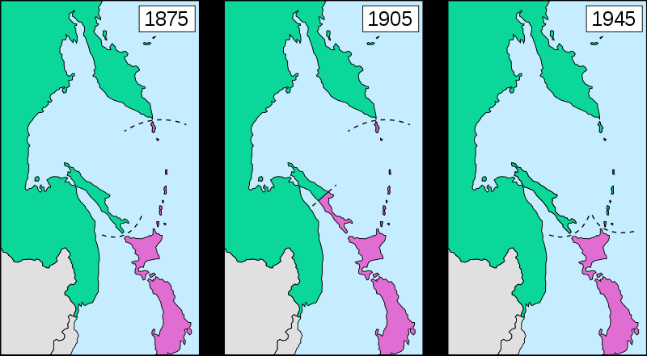

# 戦後日本の国際政治

・本節では、テーマ別に、戦後日本の国際政治を見ていく  
  
## ●米ソとの国交回復と北方領土  
・1945年8月15日、日本は敗戦する  
・敗戦後は、米軍を主とする占領軍が日本へ進駐  
・日本は、【GHQ（連合国最高司令官総司令部）】の軍政下に置かれる事となる  
  
・戦後日本が占領状態を脱するには、まず講和条約を結ばねばならない  
・が、第二次世界大戦が終わってすぐ、米ソが対立を始めてしまった  
⇒普通なら、戦争をした全ての国と講和条約を結び、戦争を終わらせる。しかし日本の場合、国が亡ぶ瀬戸際だった為、まず何はともあれポツダム宣言を受諾して降伏、講和条約は後、とした。そうしていたら、戦勝国が分裂して争い始めた為、戦争相手となった全ての国とまとめて講和交渉をするのも難しくなってしまった  
  
・仕方ないので、日本は米国をはじめとする西側諸国とまず講和条約を結ぶ事にした  
⇒日本を占領しているのは主に米軍であり、また、冷戦に於いて西側陣営になる事は既に分かり切っていた。であればまず、西側陣営と個別に講和して、東側陣営は後回し、という事である  
・こうして結ばれたのが【サンフランシスコ講和条約】である  
・単純に、対日講和条約などと呼ばれる事もある  
・この条約は西側諸国との講和だった為、［片面］講和などと言われる事もある  
⇒一応、日本国内には東側諸国を含む全面講和を主張する勢力もあった。これは、冷戦に於いて日本は中立であるべきであり、その為には西側も東側も平等に扱うべきであって、全面講和すべきであるという主張であった。が、「中立とか冷静に考えて無理でしょ。軍隊も経済も壊滅してんねんぞ」という話になって退けられ、片面講和となった  
  
・サンフランシスコ講和条約によって、日本国は主権を回復し、再び独立国となった  
※沖縄については、1972年に返還されるまで米国領  
・一方で、同年【日米安全保障条約】を結んでいる  
⇒米軍による日本駐留の根拠。一面に於いては、米国による日本占領の継続であり、一面に於いては、戦争放棄を謳う日本の国防の外部委託である  
・また、東側諸国との講和はまだであり、【北方領土】の問題もあった  
  
  
北方領土の支配の変遷。千島列島と樺太は、昔から日本人とロシア人が混住している地域だった。その為1875年、千島樺太交換条約が結ばれ、千島列島は日本領、樺太はロシア領という事にした。その後1905年の日露戦争の戦勝によって、南樺太が日本領となった。そして1945年、第二次世界大戦末期、中立破りで対日参戦を果たしたソ連は、樺太、千島列島、そして北方四島を征服した。  
Furfur / CC BY-SA (https://creativecommons.org/licenses/by-sa/4.0)  
  
・北方領土の支配の変遷は、前掲の図を参照してほしい  
・第二次世界大戦期、日ソは日ソ中立条約を結んでいた  
・お互いに戦争をしない、という条約である  
・なので、同盟国ドイツがソ連を追い詰めていた時も、日本は参戦しなかった  
※これが、同盟国ドイツがソ連に負けた理由の一端でもある  
  
・が、第二次世界大戦末期、ソ連はこの中立条約を破って対日参戦  
・これは要するに、少しでも多く戦後の利権を獲得しようという攻撃であった  
⇒8月15日どころか、降伏文書の調印が終わってからもソ連の攻撃は続き、目的としていた利権（満州、朝鮮半島、北方領土）をだいたい回収し終わった9月5日になってからようやく、攻撃を停止した  
  
・こういう状況であるから、日本はソ連の火事場泥棒に対する嫌悪感が強い  
・サンフランシスコ講和条約でも、日本は北方四島については領有権を放棄しないとしている  
⇒樺太、千島列島については領有権を放棄、としている。とは言えこの講和条約にソ連は調印していないので、ぶっちゃけてしまうとこの条約での領有権放棄は、北方領土問題とはあまり関係ない。北方領土問題とはあくまで日ソ、もしくは日露の問題だからである  
  
・ともあれ、火事場泥棒してきたソ連に対する日本の感情は悪かった  
・一方でソ連も、西側陣営入りの姿勢を明確にした日本を嫌悪しており、関係は悪かった  
  
・潮目が変わるのは、朝鮮戦争が終わった後の「雪解け」期である  
・この時期、日本は国連加盟を至上命題とする鳩山一郎政権になっていた  
⇒国連に加盟するには、全常任理事国の承認が必要である。ソ連は常任理事国であり、ソ連と国交を回復しなければまず拒否される  
・またソ連では、独裁者スターリンが死に、日本とも国交を回復しようという機運が生まれていた  
  
・こうして、国交回復の交渉が始まったが、やはり領土問題で難航した  
・その為、領土問題も講和条約締結も一時棚上げし、とにかく国交を回復する宣言をしようという事になる  
・こうして出たのが、【日ソ共同宣言】である  
⇒日ソは国交を回復しましょう。講和条約は後で結びましょう。領土問題もその時最終的な解決をしましょう。という感じの宣言  
・これによって障害はなくなり、日本は同年、【国連】へ加盟する  
  
・なお、結局、令和二年現在も講和条約は結ばれていない  
・当然と言えば当然で、日本は最低限北方四島ぐらいは返せと言っているしソ連／ロシアは返す気がない  
⇒特に現在のロシア連邦からすると、「北方領土返そうかなー、どうしよっかなー（ちらっ）」ってやれば、日本国から技術援助だの資金援助だのが送られてくるのである。金のなる木を返す訳がない。大体、「北方領土全部返せ」とまず言ってから、交渉の中で「じゃあ四島返還で手を打とう」となるのが普通であって、最初から譲歩した要求を言っても更に値切られる（二島だけにしようとか言われる）だけである  
※なお、北方四島とは、千島列島南側の［択捉島、国後島、色丹島、歯舞群島］である  

・ちなみに北方領土は、ソ連崩壊時にすら返す素振りがなかった  
・実を言うとソ連崩壊直後のロシア連邦は経済が崩壊しており、売れるものは片っ端から売っていた  
・それこそ、かつてドイツから奪った重要都市ケーニヒスベルクすら手放そうとしていた  
・そんな状況にも拘らず、当時のロシア連邦は、北方領土を返す素振りはなかった  

・その理由は簡単で、北方領土はソ連の超重要拠点なのである  
・何故か。地図を見れば一目瞭然である  
・ロシア連邦の軍艦が太平洋に出る時、それを効果的にブロックできるのが千島列島である  
・もっと言えば、北方領土は北極航路の入口及び出口でもある  
⇒大西洋から太平洋まで、北極側のロシア沿岸地域一帯を通って移動しよう、というのが北極航路。現在は極めて非現実的な航路だが、今後実用化されるのではないかと見込まれている  
  
・更に言えば、北方領土は海産物資源に恵まれている  
・その上地下資源も豊富で、油田、天然ガス田もある  
  
・これを総合して考えると、それこそ戦争でもない限りは返ってこないだろう  
⇒逆に言えば、日本側としては、その時までソ連／ロシアの不正を世界に向けて宣伝し続けるのが重要…とも考えられる  
  
## ●日米安保  
・日本国憲法は、素直に読めば戦争が一切できない  
・ところで、終戦からすぐにアメリカとソ連は対立関係となり、いわゆる冷戦が始まる  
・アメリカにとって、日本は韓国と並ぶ極東の最前線基地である。失う訳にはいかない  
⇒こういった事情から、日本の国防を米国へ外部委託する条約が出てきた。これが日米安全保障条約である  
  
・1951年に結ばれたものは、［旧日米安全保障条約］と通称される  
・これはどちらかと言うと、「日本による米軍駐留延長希望」条約である  
⇒同年のサンフランシスコ講和条約で日本国は独立したので、本来なら米軍を含む連合国軍は退去せねばならない。とは言え冷戦が始まったばかりで朝鮮戦争の真っ最中であり、戦争放棄している日本も米軍がいなくなるのは困るし、米国も米軍撤退させたらソ連が日本に攻めてきた、とかは困る。そこから生まれた条約  
  
・1960年に結ばれたものは、［新日米安全保障条約］と通称される  
・この頃、日本は経済的に復興を遂げつつあり、政治的にも安定してきていた  
・それもあって、「日米同盟」「日本の国防に米国が協力する」という形に変化したのが新日米安保である  
  
・性格が変わった為、以下のような変化が起こっている  
・米軍が、部隊の大規模な配置転換をする時等は、日本と［事前に協議］する  
⇒日本の国防に関わる話なので。それこそ一部の警備部隊以外全部本国に引き揚げられた、とか独断でやられたら困る  
・日米は、［共同防衛］義務を負う  
⇒詳しく言うと、アメリカ本土が攻撃された時は、日本は何もしなくていい。逆に日本本土が攻撃された時、米国は協力する義務を負う。また、日本国内にある米軍基地が攻撃された時、日本は協力する義務を負う  
※「同盟っぽく見せる」のと「実質的に米国は日本を守るが日本は米国を守らなくていい」を両立させている。尚、本条約制定当時、日本国内では「アメリカの戦争に巻き込まれる！」と反対運動が起きた模様。何を見て戦争に巻き込まれるって思ったんですか…  
・日本は憲法の規定に反しない範囲で、軍備を増強する義務を負う  
⇒「一応同盟的なアレなんだから、少しぐらいは自分で自分を守る意思を見せてくださいよ」的なもの  
  
・尚、日米安全保障条約には、［日米地位協定］が付属している  
・過去の不平等条約に於ける治外法権のようなもので、基地反対運動の一因になっている  
⇒基本的には、基地内部で起きた犯罪、及び公務中の犯罪については米国で裁き、そうでない場合は日本で裁くというもの。これだけならいいのだが、例えば1974年に沖縄で起きた、公務中ではない米兵が日本人を車で追い掛け回して発砲した事件では、公務証明書を緊急偽造してまで公務中という事にして米兵を守っている  
・一方で、基地反対運動の過激化もあり、地位協定が改変される兆しはない  
  
・また、米軍駐留費の一部を日本が負担しており、その一部を［思いやり予算］と呼ぶ  
・そもそも、日米安保条約は、日本に有利で米国に不利な条約である  
・日本は国防を米国に外部委託できる一方、米国はカネと人的資源を日本へ投下し続けなくてはならない  
・このような状態についての不満が、実は冷戦期からして既に存在していた  
・デタント期に、この不満が噴出。もう少し日本は、カネぐらい出せと米国が言い出す  
・これに対して、協定を結んで追加で米軍駐留費の一部を負担しようとなったのが思いやり予算である  
  
・日米安全保障条約は、現在も更新され続けている  
・一方で近年、米国も経済的に苦しい場面が続いている  
・故に「日本ももうちょっと、東アジアに軍事力を示してもいいのよ？」という態度になってきている  
⇒日米安保条約を米国から見た場合の大きなメリットはふたつ。「日本を米国の傘下に置いておける」「日本が再び軍事大国になる事を阻止できる」である。後者のメリットを多少捨ててでも、「もう少し、東アジアで自己主張してもいいのよ？　ぶっちゃけこっちも全世界に軍隊張り付けられるほどカネねぇし…」となってきている  
※実際、東アジアは太平洋の覇権を狙う中華人民共和国と、日本国、中華民国（台湾）、インド共和国等が対立しており、きな臭いのは事実である  
  
## ●国交回復と外交問題（ソ連以外）  
### 〇朝鮮半島  
・朝鮮半島との国交回復は、かなり難航した  
・何よりもまずかったのは、大韓民国として独立した後の国家指導者として米国が選んだ李承晩である  
・この李承晩、あの米国にすら「これ首挿げ替えた方がいいかも…」と思われたやべー奴である  
⇒米国は基本、自分の傀儡国についてはアバウトで、「親米路線でさえあれば、どんなやばい独裁者でもあんまり気にしない」タイプである。南米でも、南ベトナムでもそうだった。なのに「首挿げ替えた方がいいかも」と思われたのである。朝鮮戦争以前の1940年代後半には既に困ったちゃん扱いで、「こいつに武器なんか渡したら絶対北に攻め込むだろ…」で戦車等の重武装を渡して貰えていない。その後朝鮮戦争の休戦では、最後まで北朝鮮撃滅を主張して米国を困らせている。李承晩の治世下、共産主義者であると疑われた韓国人は十万人単位で虐殺され、また選挙は不正に次ぐ不正によって行われた。そして1960年の失脚直前には、ついにあの米国に「真面目に統治やれ。やれんのならもう知らん」とまで言われてしまっている。圧政・自国民虐殺・戦争狂の三拍子揃った、希代のやべー奴であった  
  
・この李承晩、猛烈な反日主義者でもあった  
・1950年代初期には早くも、【竹島】を軍事占領している  
・竹島周辺は水産資源が豊富で、戦後すぐから、李承晩はこの島に目を付けていた  
・米国にも再三、竹島を韓国領とするよう要求している（そして却下されている）  
・業を煮やした李承晩は、1952年、李承晩ラインを宣言  
⇒竹島を含むラインより朝鮮半島側は、全て大韓民国のものであるという宣言。勿論、一方的な宣言に日本どころか米国からすら非難されている  
・そして1953年、竹島に軍隊を派遣して占領  
・更に、竹島周辺で操業する日本漁船を攻撃するようになる  
⇒最終的に、日本漁船328隻を拿捕し、日本人44人を死傷（死亡者数は不明）させ、3929人を抑留した  
  
・それどころか、日本国内へ秘密工作員を送り込みすらした  
・目的は日本要人の暗殺、日本赤十字社の破壊、鉄道線路の破壊…  
・更には、日本政財界への浸透である  
・結局途中でバレて失敗した。いわゆる新潟日赤センター爆破未遂事件である  
  
・こんな調子なので、日本も日本で態度を硬化させる  
⇒戦後暫く、日本国内には「北朝鮮の方がマシ」という空気があった。当時は冷戦中で、韓国は日本と同じ西側、北朝鮮は東側だったにも拘らず、それでも「北朝鮮の方がマシ」という空気があったのである。これは基本的には、李承晩の無茶苦茶が原因である  
  
・李承晩失脚後、政府レベルでは徐々に交渉が進むが、今度は民間レベルでの反日活動が活発化する  
・日韓関係正常化に反対する韓国人デモが激化し、韓国政府が戒厳令を出したほどである  
・ここから、業を煮やした米国が露骨に介入を始める  
⇒東アジアの西側陣営最前線基地が大韓民国であり、その後方基地が日本国である。この両国がいつまでも国交を正常化してくれないのは、西側陣営頭目の米国としては困る話だった  
  
  
・結果として1965年、［日韓基本条約］が結ばれ、日韓の国交は正常化された  
・日本は、戦前の補償として、当時の韓国の国家予算の三倍もの賠償金の支払いに合意した  
⇒但し、「戦前の補償についてはこれで全て解決です」「もう日本からカネは出しません」「もし個人で、戦前の日本統治によって損害があったから賠償して欲しいって場合があれば、それは韓国政府に請求してください。日本が払ったカネがあるんで」という形  
※逆に言うと、この条約以降、日本に賠償を請求するのは原則全て条約違反である  
・また、竹島問題については棚上げする事となった  
・令和二年現在、竹島は大韓民国の実効支配下にあり、日本国政府は抗議を続けている  
⇒中華人民共和国や朝鮮民主主義人民共和国が何かやらかした時、大韓民国は米国にとって最前線基地であり、日本国にとっては身代わりの盾でもある。竹島問題が過熱して、大韓民国に臍を曲げられると、日米ともに困る。そういう訳で、米韓同盟及び日米同盟が続く限りは、大規模な変化はない可能性が高い。逆に言えば、米国が「韓国切り」を決断した場合、どうなるかは未知数と言える  
  
・さて、日韓基本条約によって、日韓の国交は正常化した  
・但しこの条約、大韓民国を「朝鮮半島唯一の国家」としている  
・ここで、朝鮮民主主義人民共和国は国家として認めない、という態度を鮮明にした形になる  
⇒冷戦の産物と言える。日韓は西側、北朝鮮は東側  
  
・ただ実際のところは、対韓感情よりも対北朝鮮感情の方が良かった  
・二十世紀終盤まで、李承晩政権のやらかしの記憶は強く残っていた  
・多くの日本人漁師が拉致・抑留され、日本の領土を不法占拠され、テロ未遂まであったのである  
⇒戦後の日本人にとっての朝鮮人は、戦後のドイツにとってのユダヤ人みたいなところがあるが、大韓民国はあまりにもやらかし過ぎた  
・一方、北朝鮮は大々的にやらかした訳ではない  
⇒故に、日本人にとっての北朝鮮は、ドイツ人にとってのユダヤ人みたいな扱いのままだった  
  
・そういう背景がある為、北朝鮮による日本人【拉致】問題も初期は騒がれなかった  
・拉致の実行は主に1970年代が中心  
・これが北朝鮮の仕業らしいという話になるのが1980年代  
・なのだが、1990年代まで、政府にもマスコミにも目立った動きはなかった  
⇒むしろ、左派勢力からは「北朝鮮による拉致などでっち上げである」という事すら公然と言われている状態であった。例えば旧日本社会党（現社民党）ははっきりと、でっち上げだと言っていた。また大学教授のような文化人は、伝統的に共産主義が好きな左派が多く、でっち上げを主張する者は多かった  
  
・本格的に話が動くのは、2000年代に入ってからである  
・2002年には日朝首脳会談にて、［小泉純一郎］首相が北朝鮮の金正日と対談  
・この時、金正日は日本人拉致を公式に認めた  
⇒これ以降、でっち上げ論や北朝鮮擁護論は鳴りを潜め、「拉致被害者を返せ」「北朝鮮は敵国」という論調が主流派になっていく。これは、李承晩政権時代の韓国のやらかしの記憶が薄れていくのと同時並行の話でもあった  
  
### 〇中華民国（台湾）、中華人民共和国  
・日本の領土問題として、有名どころに【尖閣諸島】がある  
・この尖閣諸島、「いわゆる中国」との間に戦後起きてきたものである  
  
・第二次世界大戦以前、「いわゆる中国」と呼べる統一国家は存在しなかったと言っていい  
・当時の「いわゆる中国」は、様々な軍閥が割拠する群雄割拠の戦国時代であった  
⇒第二次世界大戦期を通して、徐々に軍閥は淘汰されていった。第二次世界大戦が終わり、大日本帝国がこの地域から手を引いた時、残っていたのは蒋介石率いる中華民国と【毛沢東】率いる中華人民共和国であった  
  

第一次世界大戦直後、1920年代初頭。見事な戦国時代ぶりである  
https://upload.wikimedia.org/wikipedia/commons/6/6a/Chine_1921-1922.png  
Elryck, CC BY-SA 4.0 &lt;https://creativecommons.org/licenses/by-sa/4.0&gt;, via Wikimedia Commons  

1936年頃の図。だいぶ軍閥が淘汰されたが、それでも統一された国家には程遠い。  
Paradox Interactive社のHearts of Iron IV（Japanese Language Mod使用）より  

・中華民国と中華人民共和国は、「いわゆる中国」の座を巡って内戦を繰り広げた  
⇒いわゆる国共内戦  
・国共内戦は、中華人民共和国の勝利に終わった。中華民国は【台湾】へ亡命した  
⇒ちょうど台湾は日本の支配が終わった直後だった。ここに、旧中華民国の政府要人や軍人、更には中華民国に従う人々が雪崩れ込み、新たに台湾を支配するようになった。台湾人がこの件を指して「犬が去って豚が来た」と称したような、中華民国の亡命に伴って流入した外省人と元から台湾に住む本省人の対立は、今も台湾を理解する上で重要である  
  
・ともあれこうして、中華人民共和国という共産主義国家は、中華の地を統一した  
・西側に属する中華民国とは、台湾海峡を挟んで睨み合う事になる  
⇒両国は、互いが互いの存在そのものを認めない。いつか征服して「一つの中国」を実現しようと考えるようになる。特に中華人民共和国は、現在でもこの方針を維持している  
  
・さて、日本は1951年、サンフランシスコ講和条約にて、主に西側諸国と講和条約を結んだ  
・しかしこの条約、東側の中華人民共和国どころか、同じ西側の中華民国も参加していない  
・そこで米国の仲介により、1952年に日華平和条約を調印、国交を回復した  
・一方、中華人民共和国は敵側たる東側陣営という事もあり、国交が断絶したままであった  
  
・最初、尖閣諸島の国境摩擦が起きたのは、この中華民国との間に於いてであった  
  
  
赤丸が尖閣諸島の位置。見ての通り、沖縄本島の西、石垣島の北にある。
Jackopoid, CC BY-SA 3.0 <http://creativecommons.org/licenses/by-sa/3.0/>, via Wikimedia Commons
https://commons.wikimedia.org/wiki/File:Senkaku_Diaoyu_Tiaoyu_Islands.png

  
・尖閣諸島は水産資源が豊富で、また海鳥も多く生息していた  
・しかも第二次世界大戦中、疎開によって日本人は避難し、無人島となっていた  
⇒明治維新後国際的に正式に日本領となった尖閣諸島には、遅くとも二十世紀には日本人が入植していた  
・この無人島と化した尖閣諸島に対し、台湾漁民による密猟・密漁が繰り返された  
  
  
・当時、尖閣諸島を管理する権限を持っていたのは、琉球政府である  
・琉球政府とは、米国によって統治されていた時代の沖縄の統治機構  
⇒日本はサンフランシスコ講和条約によって主権を回復、独立を果たしたが、アジアに於ける対東側の最重要基地たる沖縄（より正確には、沖縄を含む南西諸島）は米国統治下に残された。尖閣諸島から疎開した日本人が戦後、帰れなかったのには、この辺の事情もある。そして米国統治下の南西諸島を統括していたのが、琉球政府である  
・琉球政府は、言ってみれば米国の傀儡である  
・そして米国は、あまりこの問題の解決に乗り気ではなかった  
⇒米国の「傀儡国は、親米でありさえすればとやかく言わない」といういつものアレ。中華民国はアジアに於ける対東側の最前線基地であり、気を使っていたというのもあるようだ  
  
・とは言え、漁民が密猟・密漁していた頃はそこまで大きな問題ではなかった  
⇒結局、台湾人が密猟・密漁しているだけと言えばそうであった。中華民国にしろ中華人民共和国にしろ、政府として公式に、尖閣諸島が米国（琉球政府）統治下にある事実について抗議した事はない  
・大きな問題になるのは、1968年の海底調査以降である  
・尖閣諸島周辺の海底に、大規模な油田が存在する可能性が報告されたのである  
・俄然、尖閣諸島周辺は騒がしくなった  
・1970年には中華民国の船が尖閣諸島に上陸、国旗を掲揚する事件が起きる  
・翌1971年には、中華民国、そして中華人民共和国が相次いで尖閣諸島の領有権を主張する  
  
・ところで、1960年代末から1970年代と言えば、【デタント】の時期である  
・尖閣諸島を巡る対立が深まる一方、東西両陣営は融和へ踏み出していた  
・その中で、米国と中華人民共和国の接近も起きた  
  
・当時、中ソ対立が激化しており、いつ戦争になってもおかしくない次元に到達していた  
・米国が心配したのは、実際に中ソが戦争となり、ソ連が勝つ事だった  
⇒ただでさえソ連は、海軍では米国に劣るとは言え、陸軍では圧倒的に優越する国である。ソ連が中華人民共和国を呑み込めば、いよいよ米国でも手を付けられない世界最強国家になりかねなかった  
・中華人民共和国もまた、今やソ連の方が最大の敵国であると認識し、米国との連携を求め始めていた  
  
・こうして、1971年には［ニクソン］大統領の訪中が実現  
・米中は国交を樹立した  
※尚、当時米中が接近したのは、当時泥沼化していたベトナム戦争に於いて、北ベトナムを中華人民共和国が支援していたからでもある。北ベトナムを本気で攻撃すると、中華人民共和国を刺激してしまう可能性があった。しかしこの米中接近によって「中華人民共和国さえ攻撃しないなら何してもいいよ」という形となり、米軍は北ベトナムを死ぬ寸前まで殴り倒し、講和に持ち込む事に成功する  
  
  
・この米中接近は、日本外交を大きく変化させた  
・日本もこの流れに巻き込まれ、中華人民共和国との国交正常化へ動く事となる  
・1972年には［田中角栄］首相が訪中して［日中共同声明］が出た  
⇒講和条約は後回しにして、とにかく中華人民共和国との国交を正常化させましょうという宣言。この際、中華人民共和国は「中国はひとつである」「中華人民共和国は唯一正統な中国」であると主張。これを呑んだ日本国は、中華民国とは断交。日華平和条約も破棄する事になる  
・1978年には［日中平和友好条約］が結ばれ、中華民国は完全に切り捨てられた  
  
・日本国はこの後暫く、中華人民共和国とは蜜月関係が続き、中華民国との関係は冷え込んだ  
・ただ、公式には断交したとは言え、中華民国とも民間レベルでの交流は続けていた  
・この関係が変化するのは、21世紀に入ってからである  
  
・この時期になると冷戦はとっくに終わり、中華人民共和は大発展を遂げている  
・経済力では不動の世界二位、軍事力でもロシア連邦と二位を争う存在となった  
・強くなった中華人民共和国は、太平洋の覇権を露骨に目指し始めた  
・かつては主な仮想敵国がソ連だった自衛隊も、対象を中華人民共和国に変更し始める  
・こうした中で、同じく中華人民共和国に狙われる者同士、日本国と中華民国が協調を始めた  
⇒米国も、トランプ大統領になってからは特に、覇権国家を目指す中華人民共和国との対決姿勢を強めている。以前は中華人民共和国に遠慮してあまり深く関わらなかった中華民国への武器供与も始めており、日本・台湾・米国（＋韓国）で連携して中華人民共和国に対処する東アジア防衛構想を作っている  
  
・一方で、尖閣諸島については、今も三国の間で取り合いが続いている  
・日本国は、「尖閣諸島は昔から日本固有の領土だし、今も実効支配している」との見解を持つ  
・中華民国も、尖閣諸島については今でも日本国と対立している  
⇒2012年行われた、日本政府による尖閣諸島の国有化に際しては、中華民国の巡視船が尖閣諸島周辺に出撃して示威行動を行っている。日本の海上保安庁も出撃し、放水にて交戦している  
・また中華人民共和国も、度々尖閣諸島への侵犯を繰り返し、領土欲を隠していない  
⇒と言うか、中華人民共和国の場合、沖縄も日本のものではないと言い出している。それだけ、太平洋の覇権を握るという目標に向けて積極的に動いている  
  
・仮に尖閣諸島で軍事力の行使があった場合、米国はどうするかというのも一つ、ポイントである  
・今のところ、有事となった場合は日米安保条約に基づき米国は日本を支援すると、言明している  

## ●今後の日本とアジアの国際情勢
  
令和三年現在の日本周辺図。オーストラリアは見切れているが、インドネシアの右下あたりにある。こうやって地図を眺めると、日本列島、台湾、フィリピン共和国及びインドネシア共和国は、中華人民共和国の太平洋進出を妨げる防壁になる位置にある、というのが分かる  
Paradox Interactive社のEuropa Universalis IV（Extended TimelineMOD及び日本語化MOD使用）  
  
・令和三年現在、日本を取り巻く国際情勢は、中華人民共和国の台頭が主な話題となっている  
・即ち、中華人民共和国は今や、世界二位の経済大国にして軍事大国である  
・この国は現在、世界の覇権国となるべく、活発に動いている。例をいくつか挙げよう  
  
例１：東南アジア方面では九段線を主張し、領土を拡張しようとしている  
例２：他国を借金漬けにして、領土を奪うような戦略を実施している  
例３：インド洋方面では、真珠の首飾り戦略と呼ばれる戦法でインドを包囲している  
※これらの動向は、アメリカ合衆国の世界覇権への挑戦でもある  
  
中華人民共和国の主張する、いわゆる九段線の図。中華人民共和国は、緑の線で囲まれた範囲を自国領であるとし、領土拡大を狙っている。当然、インドネシア共和国やマレーシア、フィリピン共和国といった周辺の国々が大いに反発しているが…例えばフィリピン共和国は、資金援助の見返りに態度を軟化させ、九段線の領有を事実上認めるような声明も出ている。尚、この九段線に関しては中華人民共和国だけでなく、中華民国（台湾）も領有を主張している。何なら、中華民国はもうちょっと広い範囲の領有を主張している。  
U.S. Central Intelligence Agency, Public domain, via Wikimedia Commons  
https://commons.wikimedia.org/wiki/File:9_dotted_line.png  
  
  
  
中華人民共和国の借金漬け外交の最たる例、スリランカ民主社会主義共和国はハンバントタ港の位置。中華人民共和国は国際的なインフラ建設を推進するという名目もあって、様々な国に融資を行っているが…「どう考えてもこんな借金、返せないだろ」みたいな膨大な借金を背負わせる行為が横行している。スリランカでもやはり、ハンバントタ港建設に借りたカネが返せなくなり、結果、「九十九年の間借りる」という形で、中華人民共和国が管理する事になった。かつて、欧米諸国がアジアやアフリカを植民地化した時と、全く同じやり方である。  
Snowolfd4, Public domain, via Wikimedia Commons  
https://commons.wikimedia.org/wiki/File:Hambantota_location.svg  
  
  
いわゆる「真珠の首飾り戦略」の図。赤に黄色の星が中華人民共和国の基地、もしくはその影響下にある場所。青に白の星がアメリカ合衆国の基地、もしくはその影響下にある場所。また、赤と白の丸が戦略的要衝、インド国旗はインド海軍の基地。見ての通り、中華人民共和国がインド共和国を包囲する形になっている。先に紹介したハンバントタ港も、真珠の首飾り戦略で重要な役割を果たす基地と言える。  
EdgarFabiano, CC BY-SA 3.0 &lt;https://creativecommons.org/licenses/by-sa/3.0&gt;, via Wikimedia Commons  
https://commons.wikimedia.org/wiki/File:Collardeperlaschino.png  
  
・このような中華人民共和国の野心を、野蛮と批判するのは簡単である  
・しかし我々は、国益と国益がぶつかり合う国際政治の世界に生きている  
・世界二位の大国となった中華人民共和国が、更なる覇権を目指して拡大せんとするのは当然であり…  
・当然、日本国としてはその拡張を妨害せねばならない立場にある  
⇒地図を見れば分かるように、日本列島、台湾、フィリピン共和国及びインドネシア共和国は、中華人民共和国の太平洋進出を妨げる防壁になる位置にある。当然、覇権を狙う中華人民共和国としては、そういった国々は潰すか、自分の傘下に加えたい。日本国もまた、中華人民共和国の標的なのである  
  
・とは言え、日本国単独では、中華人民共和国には対抗できない  
・確かに日本国は、世界三位の経済大国だが…  
・軍隊は、「米軍が助けに来るまで粘る」自衛隊しか持っていない  
・経済的に見ても、中華人民共和国は世界二位の経済大国なのである  
  
・とは言え、手が無い訳ではない  
・中華人民共和国の覇権主義に反感を持つ国は多い  
・それにまた、日本国はアメリカ合衆国と同盟を結んでもいるのである  
・こういった国々と連携していくに如くはない  
  
・とは言え、その中で要となるべき国はやはり、世界一位の経済と軍隊を誇るアメリカ合衆国である  
・そしてアメリカ合衆国は、2001年の911テロの後を受けたアフガン侵攻以来、中東に夢中であった  
・日本国としては、どうにかして米国の目をアジアに向けさせる必要があった訳である  
  
・その試みとして特筆すべき最初のものは、第一次安倍内閣である  
・この内閣が2007年に始めたのが、日米豪印戦略対話、いわゆるクアッド(Quad)だった  
⇒日本国、アメリカ合衆国、オーストラリア、インド共和国、この四ヶ国で連携していきましょう、というもの。良くも悪くも軍事同盟ではなく、「色々な分野で連携していきましょう」というもの。ただ、その「連携」が、中華人民共和国の台頭と野心を念頭に置いてものである事は明らかだった  
  
・勿論、クアッドが発足したからと言ってすぐに中華人民共和国包囲網ができた訳ではない  
・音頭を取った安倍晋三自身、2007年秋には持病で辞任する羽目になっている  
・また、伝統的に親中政策を採る事の多かったオーストラリアが、2009年に離脱するような一幕もあった  
※2010年には復帰  
・米国もまた、2009年から新たにバラク・オバマ大統領になったものの、中東に夢中であった  
  
・しかし2012年、安倍晋三が内閣総理大臣に復帰すると、この四ヶ国の連携を強力に推進し始める  
・2012年には早くも、セキュリティダイヤモンド構想を発表  
⇒日本国、アメリカ合衆国、オーストラリア、インド共和国それぞれを線で結んだ四角形によって、インド洋と太平洋に於ける法の支配と貿易路を守ろう…という構想。明らかにクアッドの更なる発展を狙ったものであり、その海域で「法」を守ろうとしていないのは誰か、「貿易路」を誰から守るのか、となると…これはもう、想定される国は一国しかない  
  
・この戦略構想の転換点となったのは、2017年である  
・2017年一月、米国では新たにドナルド・トランプが大統領に就任した  
・彼は、「アメリカファースト（アメリカ第一主義）」を掲げ、今までの外交政策を大転換すると宣言した  
・これは、全ての海外地域から引き揚げてアメリカ大陸に引きこもります、という意味ではない  
  
・その事実は、彼のスローガン”Make America Great Again”が示している  
・彼の目的は、ボロボロになった米国を再び偉大な国にする事である  
⇒実際、911テロ直後から続く中東外交は、米国の利益にはならなかった。米国のカネと人名が消えていく割に、米国の国際的影響力は下がった。また、経済的に見ても、1980年代以来始まった新自由主義の流行は、かつて起きた貧富の格差拡大等々の問題を復活させていた  
  
・彼のアメリカ第一主義は、米国の国益を第一にして行動するぞ、という宣言であった  
・これは明らかに転機であった  
・実際のところ、どの国だって自国の利益を第一にして行動する  
・口先で「世界平和の為」「地域への貢献」とか言ってるだけで、国益を第一にする  
・しかし逆に言えば、そうやって口先では適当な事を言うのが普通でもあるのだ  
  
・トランプ大統領は、その口先で誤魔化す事すらしないと宣言したのだ  
・国益になる事ならやるが、ならない事はやらないと宣言したのである  
・これは明らかに転機であった  
・逆に言えば、「米国の利益になる」とトランプ大統領が思えば、米国はアジアに目を向けるのだ  
  
  
・時の総理大臣安倍晋三は、トランプ大統領の抱き込みに成功した  
⇒共にマスコミの誹謗中傷に耐え抜いて選挙で勝った者同士、共感するところがあったという見方もある。実際、報道だけ見てるとトランプ大統領は精神異常者だし、安倍晋三は独裁を目指す危険人物である  
  
・また、このトランプ政権期に、米国の長期的な戦略も変化した  
・この時期から本格的に、「中華人民共和国は、アメリカ合衆国の主敵だ」と認識されるようになったのだ  
・これはトランプ大統領だけが敵視しているという話ではない  
・アメリカ合衆国の政界全体が、中華人民共和国を仮想敵と認識するようになってきた、という話である  
  
・このような状況で、安倍晋三が以前から推進してきた戦略構想は、魅力的であった  
・クアッド、セキュリティダイヤモンド構想、そして「自由で開かれたインド太平洋」  
⇒2016年から安倍内閣は、本格的に「自由で開かれた」「インド太平洋」というようなキーワードを使い始めた  
  
・そしてアメリカ合衆国は、この「自由で開かれたインド太平洋」戦略に乗ったのである  
・トランプ政権期に、中華民国（台湾）への武器供与を始めたのも、この戦略と無関係ではない  
  
・トランプ＝安倍期には、他の国々も、アジア情勢に介入する姿勢を見せ始めた  
・例えばブレグジットを決めたイギリスは、新たにアジアを重視する姿勢を見せている  
・また、独自路線を採りたいフランス共和国も、アジア復帰姿勢を見せ始めた  
⇒EU内ではドイツ連邦共和国に頭が上がらないフランス共和国だが、この国は冷戦期のド・ゴール政権期以来、「独自路線を歩みたい」欲求が強い  
  
・そして、令和三年現在  
・米国の大統領は、共和党のトランプから民主党のジョー・バイデンへ変わった  
・民主党は、伝統的に親中（華人民共和国）路線なのだが…  
・そのバイデン政権になっても、米中の対決姿勢は続いている  
  
・更に2021年秋、AUKUSが結成された  
・これは、豪英米三国の、新たな軍事同盟である  
⇒オーストラリア(Australia)、イギリス(United Kingdom of great britain and northern ireland)、米国(United States of america)の三国でAUKUS  
・この軍事同盟は、明らかに中華人民共和国への対抗を意図したものである  
  
・今や、時代は変わった  
・東アジアは、現代の覇権国と、そこに挑戦する新興覇権国の、対決の場になったのである  
・日本国は、その最前線に位置している  
  
・勿論、だからと言ってあなたは、中華人民共和国を「敵だ」と思わねばならない訳ではない  
・しかし、自分がそういう時代に生きており、そういう地域に住んでいる自覚は、しておくべきであろう  
  
  
おまけ　現代の主要国の状況まとめ  

|                      |                                                                                                                                                                                                                                                                                                                                |  
|----------------------|--------------------------------------------------------------------------------------------------------------------------------------------------------------------------------------------------------------------------------------------------------------------------------------------------------------------------------|  
|アメリカ合衆国        |軍事的にも経済的にも最強ながら、往時の勢いはない                                                                                                                                                                                                                                                                                |  
|中華人民共和国        |経済的には不動の二位、軍事的にも二位を争い、米国の覇権に挑戦する                                                                                                                                                                                                                                                                |  
|日本国                |米国のアジアの相棒として、中華人民共和国に対峙する世界三位の経済大国                                                                                                                                                                                                                                                            |  
|インド                |南アジアの地域大国。経済も順調に成長している。中華人民共和国の暴走を掣肘し得る準主役級の役者だが、一番やりたいのはパキスタン・イスラム共和国の殲滅である                                                                                                                                                                        |  
|欧州諸国              |ロシア連邦を第一の仮想敵国としており、米中対立にはどっちつかず。また、EUの矛盾に苦しんでいる側面もあり、統一感は失われつつある（例えばEUを抜けたイギリスはアジアで日米に協力する姿勢を見せている一方、EUを主導するドイツ連邦共和国は中華人民共和国寄りの姿勢を見せている）                                                      |  
|ロシア連邦            |経済的には十位程度で小粒ながら、軍事的には二位を争う軍事大国。欧州と対立する一方、米国とも対立している。特に中東での勢力拡大に熱心。また、アジアでの勢力拡大を完全に諦めた訳ではなく、国境を接する日本国としても警戒対象。更に、中華人民共和国とも長い間敵対してきた国でもあり、一度妥協が成立しているとは言え、予断を許さない  |  
|トルコ共和国          |長年、自分を欧州の国と思い、EUに入ろうと運動してきた。しかし欧州諸国には「お前はアジア、中東」と拒絶され続け、結果、イスラム原理主義が台頭。今や、カリフ制復活が真剣に議論されるほどの国となった。また、中東の覇権を目指して躍動する国の一つともなり、同じく中東の覇権を目指すロシア連邦、イラン・イスラム共和国と鎬を削っている|  
|イラン・イスラム共和国|中東の覇権を目指す国の一角                                                                                                                                                                                                                                                                                                      |  
  
  
  
  
現代のアジアは、米中新冷戦の最前線である。日本自身は日米豪印の四ヶ国による包囲網で中華人民共和国に対抗せんとするし、米豪英は新同盟を結成、台湾も重要な反中包囲網の一員である。一方でロシア連邦もまた、アジアで一切の野心を捨てた訳ではない。中華人民共和国も、主にカネの力でアジアやアフリカで味方を増やしている。予断は許されない状況である。以下、項目を改めるまで全てEuropa Universalis IVより。  
  
  
現代の中東。中東の覇権を争うのは、トルコ共和国、イラン・イスラム共和国、そしてこの地域を裏から操らんとするロシア連邦である。サウジアラビア王国やイスラエル国もまた、重要なプレイヤーとなる。一方で、リビア地域では変わらず混乱が続いており、アフガニスタンでもイスラム原理主義勢力が政権を握る等、混迷は深まっている。  
  
  
一般に、今でもロシア連邦を仮想敵国とする欧州の国々。また、EUは大きな矛盾を抱える。EUについては経済分野で詳しく解説する。  