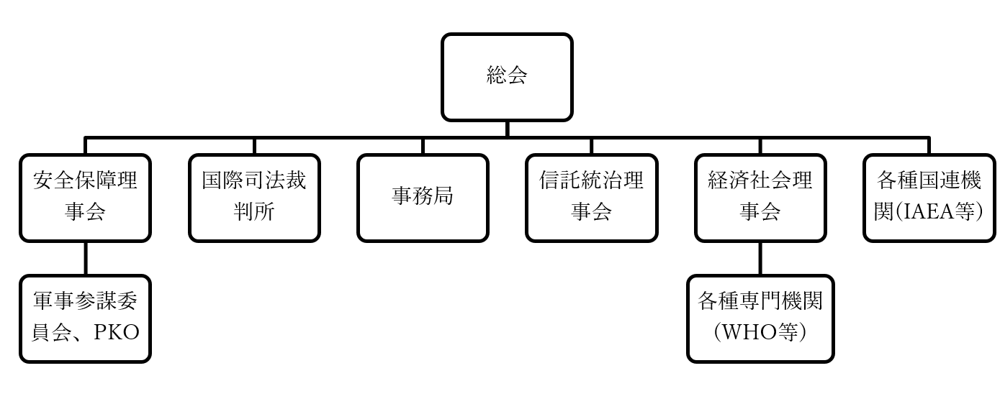

# 国際連合

## ●国際連合設立  
・1939年、第二次世界大戦が始まる  
※この時点では大日本帝国やアメリカ合衆国、ソヴィエト連邦といった国は未参戦  
  
・1941年、英米首脳会談により、［大西洋憲章］ができる  
⇒連合国側による、「戦後世界をこうしよう」という初の構想。ちなみにこの時、アメリカ合衆国はまだ参戦していない。が、大統領フランクリン・ルーズベルトはもう参戦する方向で動いており、ドイツ国海軍に対する宣戦なしでの敵対行動も指示していた  
  
・1944年、［ダンバートン・オークス会議］が行われる  
・大西洋憲章を基に、この会議で戦後世界の構想が練られた  
・この時、現在の国連憲章のベースとなるものもできた  
  
・1945年2月、［ヤルタ会談］が行われる  
・英米ソの首脳会談。戦後、世界をどのように分割するか話し合われた  
・この会談の中で、国際連合では大国に拒否権を持たせようという事で合意ができた  
  
・1945年4月から6月、［サンフランシスコ会議］が行われる  
・大国の首脳だけでなく、中小国も含めた連合国各国代表が集まった会議  
・この会議にて、［国連憲章］が採択され、国際連合が設立された  
・国連の原加盟国は［51ヶ国］だが、要するにサンフランシスコ会議に51の連合国が参加した、という事  
⇒「え…それってつまり、国連って「戦勝国たる連合国各国による、戦勝国クラブ」なのでは…？」と思った方。まぁぶっちゃけ間違ってはいません。何せ、国連の正式名称はUnited Nationsですが、これ、一般的には連合国と訳されるものです。実際、永世中立国でありながら国際連盟には参加していたスイス連邦も、「いや、戦勝国クラブはちょっと…」という事で、二十一世紀になるまで国際連合には加盟しませんでした  
  
## ●加盟国の推移  
  
・1945年に国連が設立された時の加盟国は51ヶ国だった  
・その後、世界は西側資本主義国家と、東側社会主義国家に分かれ、冷戦へ突入する  
⇒西側の盟主はアメリカ合衆国、東側の盟主はソ連  
・ソ連は国連に加盟してはいたが、国連の主導権を握ったのはアメリカ合衆国  
⇒国連は米ソ冷戦の最前線でもあり、ソ連の意向は加盟国の増加にも大きな影響を与えた  
  
・また、第二次世界大戦当時、アジア、アフリカはそのほとんどが欧米の植民地だった  
⇒独立国ではないので、国連に加盟できない  
・欧米植民地は第二次世界大戦以降、徐々に独立闘争を成功させ、独立を獲得していく  
⇒基本的に、独立すると加盟する  
  
1945年：サンフランシスコ会議で国連設立。原加盟国は51ヶ国  
  
1956年：［日本国］加盟  
⇒これまでは、ソ連が日本国加盟に反対していた。同年の日ソ共同宣言によってソ連は日本国の加盟を容認、結果、日本国加盟が実現した  
  
1960年：［アフリカ］で17ヶ国が独立、内16ヶ国が加盟  
⇒いわゆる［アフリカの年］  
  
1971年：「いわゆる中国」を、［中華民国］から［中華人民共和国］へ変更  
⇒元々、国際連合の重要国家として「いわゆる中国」を入れよう、というのは初期から決まっていた。ところが実は、第二次世界大戦直前～初期、「いわゆる中国」は群雄割拠の戦国時代だった。その中でも滅亡まで秒読み段階にあったのが中華人民共和国、中華統一直前にあったのが中華民国。なので、国連初期の「いわゆる中国」枠は中華民国だった。だが中華人民共和国は、第二次世界大戦を利用して下克上を果たし、大戦後には中華民国を台湾へ追い落とす。結果、中華人民共和国は国連でも「いわゆる中国」の地位を獲得した  
  
1973年：［東西ドイツ］（西ドイツ＝ドイツ連邦共和国、東ドイツ＝ドイツ民主共和国）が同時に加盟  
⇒1960年代後半から1970年代前半にかけて、米ソの対立が穏やかになった時期があった。いわゆる［デタント（緊張緩和）］。この時期、［東方外交］と呼ばれる外交も行われ、その成果として同時加盟となった  
  
1991年：【南北朝鮮】の同時加盟。また、【バルト三国】も加盟  
⇒1989年に【冷戦終結宣言】が出ており、1991年にはソ連が解体される。その流れの中で、冷戦の最前線だった【大韓民国】と【朝鮮民主主義人民共和国】が加盟する。また、ソ連から独立したバルト三国、つまり、リトアニア、ラトビア、エストニアも加盟する事になる  
  
  
2002年：【スイス】と【東ティモール】が加盟  
⇒スイスはいわゆる永世中立国。「俺は誰の味方もしねぇぞ」、もっと言えば「俺以外の全員が、俺の敵だ」という政策を採る国。故に同盟とかそういうのには参加しない。そして、国連は元々、連合国が作ったものであり、「戦勝国クラブ」という側面がある（実際、敗戦国の日本やドイツが加盟できたのはだいぶ後になってから）。また、冷戦期の国連は、米ソ冷戦の最前線でもあった。中立国家として、とても参加できるような状態ではなかった。冷戦が終わり、また戦勝国クラブ感もだいぶ薄まった二十一世紀になってようやく加盟を決めた  
⇒東ティモールは、インドネシアから独立した国家。インドネシアは基本的に旧オランダ植民地で、東ティモール地域は旧ポルトガル植民地。それで仲が悪かった  
  
2006年：【モンテネグロ】が加盟  
⇒いわゆるユーゴスラヴィアという国の解体の、最終段階。第二次世界大戦によって成立したユーゴスラヴィア社会主義連邦共和国は、複数の国を合体させてできた国だった。チトーというカリスマ指導者が統率している内はよかったが、チトー死後、各国のいがみあいが表面化。スロベニア、クロアチア、ボスニア・ヘルツェゴヴィナ、マケドニアが離脱し、セルビアとモンテネグロが残る。が、この二国連合も結局、十年ほどでモンテネグロが離脱、ユーゴスラヴィアは完全に終わる。それが2006年であり、独立と同年、国連に加盟した  
  
by Aivazovsky, CC3.0, https://commons.wikimedia.org/wiki/File:Yugo_template.png  
上記を筆者が改変  
2011年：【南スーダン】が加盟  
⇒2020年現在、最後に国連加盟を果たした国。スーダン内戦で独立したアフリカ国家で、独立と同年加盟した。これで、国連加盟国は【193ヶ国】となった  
  
  
  
  
  
  
  
  
## ●国連の概要  
  
〇国連の目的  
・国連の目的は、国連憲章第一条に書かれている。重要なところを抜き出すと…  
・国際の【平和】及び安全を維持すること  
・人民の同権及び［自決（民族自決）］の原則の尊重に基礎をおく［諸国間の友好関係を発展］させること  
・経済的、社会的、文化的または人道的性質を有する国際問題を解決すること  
・人権及び基本的自由を尊重するように助長奨励することについて、【国際協力】を達成すること  
・［諸国の行動を調和するための中心］となること  
⇒最後のものは、いわゆる【国連中心主義】と呼ばれるものとも言える  
  
  
〇国連の組織  
・国連の最高機関にして中心機関が【総会】である  
⇒国連を国に喩えると、国会にあたるもの。【一国一票】が原則  
⇒総会より下位の機関として、【安全保障理事会】、【国際司法裁判所】、【事務局】、［信託統治理事会］、【経済社会理事会】、更に各種の国連機関がある  
  
・各種の専門機関（IMF、WHO等）は、経済社会理事会が従えている  
※経済社会理事会が統率する各種専門機関には、【国際労働機関(ILO)】、【国連食糧農業機関(FAO)】、【世界保健機関(WHO)】、【国連教育科学文化機関(UNESCO)】、【国際通貨基金(IMF)】、【世界知的所有権機関(WIPO)】、【世界銀行】等がある  
  
・各種国連機関（IAEA、人権理事会等）は総会が直接従えている  
※各種国連機関には、【国際原子力機関(IAEA)】、【世界貿易機関(WTO)】、【国連貿易開発会議(UNCTAD)】、【国連児童基金(UNICEF)】、【国連難民高等弁務官(UNHCR)】 、【国連環境計画(UNEP)】等がある  
  

  
・ではここから先、国際連合の各組織について、それぞれ見ていこう  
## ●総会  
・国連の最高機関にして中心機関が総会である  
・国連を国に喩えると、国会にあたるもの。一国一票が原則  
  
・世界中のあらゆる問題を討議する事になっている  
※戦争などの安全保障問題については、安全保障理事会が基本的な担当。総会は、例えば「おい戦争起こってるぞ。安保理、何とかしろ」みたいな感じで勧告を行うのが原則。つまり、安全保障問題の時だけは安全保障理事会が一番偉く、他の場面では全て、総会が一番偉い  
  
・最終的には多数決を行う  
・【一般事項は過半数】で、【重要事項は2/3】で議決する  
  
・国で言えば国会にあたるので当然、総会にもいくつか種類がある  
・【通常総会】は、毎年定期的に開かれる総会。毎年九月の第三火曜日から  
・【特別総会】は、安全保障理事会、もしくは加盟国の過半数の要請で開かれる総会  
⇒通常総会以外の時期に話し合いたい事があればこれ  
・【緊急特別総会】は、安保理、もしくは加盟国の過半数の要請で二十四時間以内に開かれる  
⇒「悠長にやってる場合じゃねぇ！　戦争が起きてるんだぞ！　安保理は頼りになんねーし！！」みたいな時であればこれ。【平和の為の結集決議】が根拠にある  
※本来戦争などの安全保障問題については安全保障理事会が担当で総会は勧告するだけなのだが、肝心の安全保障理事会が機能不全に陥った場合はこの総会を開く事になる  
  
## ●安全保障理事会  
・国際平和と安全維持に第一次的責任を負う、紛争の平和的開発を図る、などとよく言われる機関  
・通称安保理  
・第一次世界大戦以降出てきた【集団安全保障】の根幹を担う機関  
⇒国連加盟国は原則、安保理の決議なしでの武力行使が全面的に禁止されている。安保理の議決を待っていられない、という場合のみ自衛権を行使できる。また、安保理は何かしらの侵略行為があった際、軍事的・非軍事的問わず実力を以ってこれを懲罰し、侵略行為を中止させる役割を担う  
  
・国連の集団安全保障がロクに機能していないのは、基本的に安全保障理事会の問題である  
・安保理がまともに機能しないから、国連による集団安全保障もまた、ロクに機能しない  
・では何故機能しないのか。これを考えながら見て行こう  
  
  
  
### 〇理事国とこれに由来する問題  
・安保理は、【常任理事国】と【非常任理事国】で構成される。合わせて十五ヶ国  
  
・常任理事国は、【アメリカ合衆国】、【イギリス】、【フランス共和国】、【「いわゆるロシア」】、【「いわゆる中国」】の五ヶ国  
⇒「いわゆるロシア」枠は、【ソ連】もしくは【ロシア連邦共和国】。ソ連崩壊前後で変わる  
⇒「いわゆる中国」枠は、1971年以前は【中華民国】、以後は【中華人民共和国】  
※［日本国、ドイツ連邦共和国、インド共和国、ブラジル連邦共和国］を、新たに常任理事国として追加しようという話も出ているが、今のところ実現する気配はない  
  
・非常任理事国は、任期【二年】で【十ヶ国】  
⇒総会で選出。毎年半数を改選。留任はできない  
  
・ところで、安保理が扱う問題は、大きく二つに分けられる  
・ひとつは［手続事項］  
⇒ある紛争を、安保理で取り上げるかどうかを決めるもの  
・手続事項については［九理事国］が賛成すると可決される  
  
・もうひとつが［実質事項］  
⇒手続事項で取り上げると決めた紛争に、実際にどのような措置を採るかを決めるもの  
・実質事項については、【常任理事国全てを含む九理事国】が賛成すると可決される  
⇒逆に言えば、常任理事国が一ヶ国でも反対すれば、実質事項については何も議決できない。常任理事国が持つこの権限を【拒否権】という  
  
・安全保障理事会の問題は、ひとつにはこの実質事項にある  
・どのような対処をするかを決める時、常任理事国が一人でも「嫌だ」と言えば、もう何も決まらない  
・実際、朝鮮戦争では機能不全に陥った  
⇒朝鮮戦争は北朝鮮による侵略によって始まった。集団安全保障の原則から言えば、戦争を起こした国を懲罰して停戦に持っていかねばならないが、同じ東側陣営のソ連が北朝鮮を支持した為、安保理は機能不全に陥った  
  
・この朝鮮戦争の反省としてできたのが、【平和のための結集決議】である  
・安保理が機能不全に陥った場合、【緊急特別総会】を開ける  
・ただ、仮に緊急特別総会が開けても、そしてそこで決議が取れても、問題はまだある  
・その問題も、これら見て行こう  
  
### 〇制裁  
・加盟国であろうとも武力行使があった場合は懲罰する。これによる戦争抑止が集団安全保障である  
・その為には当然、実際に懲罰を行う実行部隊が必要となる  
・実は、ここに安保理、ひいては国連の最大の欠陥がある。これについて見て行こう  
  
・まず、国連憲章［第六章］に基づき、当事国による平和的解決を要請する  
・当事国による平和的解決が望めない場合、何らかの形で制裁を行う事になる  
１：国連憲章【第七章】に基づく【非軍事的】措置（経済制裁等）  
２：国連憲章【第七章】に基づく【軍事的】措置（軍事制裁）  
  
・さて、戦後世界で戦争に訴える国というのは、「国連なんか関係ねぇ」と思っているような国である  
・当然、経済制裁ではとても足りない。軍事力による懲罰がなければ、戦争が止まる筈もない  
・…なのだが、何と国連、この軍事制裁が全くできないのである  
・何故かというと、［国連軍］が影も形も存在しないからである  
・国連憲章では、［特別協定］を結んだ国が供出する兵力によって［国連軍］が編成されるとする  
・が、この特別協定、結んだ国が皆無なのである  
・当然国連軍も、存在した事は一度たりとてない  
  
・故に、安保理で「これは侵略ですわ、軍事制裁しましょう」と決めてもあんまり意味がない  
・同様に、緊急特別総会で「軍事制裁が必要でしょ」と決まっても、あんまり意味がない  
・軍事制裁する為の戦力が、国連にない為である  
⇒国連にできるのはせいぜい、「これは軍事制裁が必要ですわ。あー誰か懲罰の軍隊派遣してくれねーかなー。有志による連合軍でもいいっすねー。誰かやってくれませんかねー？　この制裁に関しては武力行使してもオッケーなんですけどねー？？」とやる事ぐらいである  
  
・一応、【湾岸戦争】では、武力行使容認決議から米国主導で【多国籍軍】が編成されてはいる  
・一見、湾岸戦争では集団安全保障が有効に機能したように見える  
・安保理の決議に基づいて、侵略戦争を行うイラク軍を国連軍が撃破したように見える  
・が、実際には米国主導の多国籍軍でしかなかった  
  
・ちなみにこの多国籍軍、【イラク戦争】でも編成されている  
・そしてイラク戦争時の多国籍軍は、安保理の武力行使容認決議を経ていない  
・一方、2014年からのウクライナ東部紛争という、実質的な戦争には、安保理は機能していない  
・そして、ウクライナ東部紛争では、多国籍軍も編成されなかった  
  
・このように、国連による集団安全保障は以下のような欠陥を抱えている  
１：意思決定の段階で欠陥があり  
２：しかも意思決定がなされたとしても、国連自身では軍事制裁が行えない  
⇒そりゃ、皆集団安全保障なんて信じずに勢力均衡で安全を図るよなぁ、という話  
  
### 〇国連平和維持活動  
・紛争で国連が出番となるのは、集団安全保障よりもむしろ、【国連平和維持活動(PKO)】である  
・PKOには主に二種類ある  
１：［停戦監視］、つまり停戦が履行されているかどうかの監視活動や  
２：［平和維持軍(PKF)］による治安維持  
・こういったPKOは、俗に【国連憲章六章半】活動などとも呼ばれる  
⇒これは、国連憲章六章（当事国による解決）と七章（国連の介入による解決）の間の活動、ということ  
  
・要するに、例えば紛争が停戦になったとして、当事国どちらかが停戦を破らないとは限らない  
・そういう時、誰か第三者に監視させるのが一番いいが、完全に中立な第三者はなかなかいない  
⇒完全に中立という事は基本、その地域に一切の利害関係を持たない国な訳で、そんな国が監視の兵力を寄越してくれますか？　というとまぁ嫌ですよね、という  
・こういう時、建前上は完全に中立な機関であるところの国連は、便利なのである  
  
・PKOは国連軍とは違い、特別協定なしでも国連加盟国の軍隊に参加を要請できる  
・故に、有志による多国籍軍ではなく国連の軍隊として、活動実績を積み上げている  
⇒国連加盟国は、PKOに参加する（かもしれない）待機部隊として、［国連待機］軍を用意している。そして［国連待機］制度により、事前に「うちにはこれぐらいの国連待機軍がいますよー。なんかあったら呼んでね」と国連へ通知している。実際にPKO派遣となった時は、この情報に基づいて「こないだ国連待機軍あるって言ってたよね？　ここに送ってくれない？」という形で、国連が各国に要請する。尚、あくまで要請であり各国の好意による［任意］での派遣となる為、うまくいかない場合もある  
  
・最初のPKOは、［第一次中東戦争］の停戦監視だった  
・続く［第二次中東戦争（スエズ危機）］では、PKFにあたる［国連緊急軍］が組織、派遣されている  
  
・こうしてPKOは、「国連の軍」として実績を積み上げていった  
・この「国連の軍」を、実質的な国連軍にしようと考えるのは、自然な成り行きと言える  
・ただPKOは、そのままだと国連軍にするには難しい原則をいくつも抱えていた  
  
・例えば、PKOは原則として［任意］であり、兵力は加盟国が自発的に提供する  
・また、PKOを受け入れる紛争当事国両方の［同意］がなければ派遣できない  
・また、任務が任務なので［中立］の立場で遂行するという原則も課せられている  
・また、原則として軽装備であり、武器使用要件としては［自衛］の場面である事が求められる  
  
・こういうPKOを改革して実質的な国連軍にしようとしたのが、【ガリ】国連事務総長である  
・彼は、1992年、【平和執行部隊】関係の構想を発表した  
１：紛争発生前に、当事国一国だけの要請でも、PKOを展開できる事とする  
２：また、国連加盟国は国際司法裁判所の判決に従う義務を負う事とする  
３：１及び２による平和が失敗した場合、重武装の平和執行部隊で、平和を強制する  
  
・彼の構想は、［ユーゴスラヴィア］紛争や、［ソマリア内戦］で実施された  
・が、ユーゴ紛争もソマリア内戦もかえって泥沼化し、PKOの国連軍昇格構想は失敗に終わった  
  
### 〇日本とPKO  
・PKOの参加はつまり、軍事力の提供である  
・そして戦後の日本は、軍隊とか軍事力というものにアレルギー反応を示す  
・故に、戦後の日本は、PKOには全く協力してこなかった  
・転機となったのは、1991年の【湾岸戦争】である  
・湾岸戦争ではカネを出しても感謝されなかったが、自衛隊を派遣すると態度が百八十度変わった  
・ここから、日本も積極的にPKOに参加して貢献していこう、という機運が生まれた  
  
・1992年、【国連平和維持活動協力(PKO協力)】法が成立する  
・これにより、日本の自衛隊もPKO参加が可能となった  
・同年中には、【カンボジア】へ派遣されている  
・更に翌年には、［モザンビーク］にも派遣されている  
  
・ただ、やはり戦争アレルギーの戦後日本なので、PKO協力法による制約は厳しかった  
・まず、［PKO参加五原則］というのがあった  
１：紛争当事者間の［停戦合意］が必要  
２：紛争当事者間の［PKO受け入れ合意］が必要  
３：紛争当事者どちらにも肩入れしない［中立性］遵守  
４：１～３が欠けた場合は独自の判断で撤収する  
５：武器の使用は［自衛］の為のみとする  
⇒ぶっちゃけてしまうと、４以外はPKOそのものの原則と同じである。なのでこの点については、そんなに厳しい制約ではない  
  
・厳しい制約を課せられたのは、［PKF本体業務］への参加禁止である  
⇒PKF本体業務とは、要は平和維持軍として、実際に武器を持って現場に出て、治安維持活動にあたるという事である。武装解除を監視したり、危険地域に駐留したり、その地域を巡回したり  
・こういう業務に参加して万が一銃撃戦等になったら、国内がPKO反対一色になるのは目に見えていた  
・その為、PKF本体業務を行う部隊への、補給や医療といった［後方支援］任務のみを行うとした  
・そしてPKF本体業務参加については、国内の理解と支持が得られるまで、無期限凍結とするとした  
  
・この本体業務参加が解禁されたのは、2001年の［アフガニスタン］戦争後である  
・911テロに始まる米国主導の対テロ戦争後の、人道支援活動に自衛隊が参加する為であった  
・以後、自衛隊による海外派兵・海外協力はますます拡大している  
・有名なところでは、［ソマリア］沖での海賊退治に、海上自衛隊を派遣している  
  
## ●その他の国連機関  
  
  
  
### 〇国際司法裁判所  
・国際司法裁判所は、国と国との争いを国際法に基づいて判決する裁判所である  
例：竹島は日本のものか、韓国のものか  
・国際司法裁判所で裁判するには、紛争当事国双方の【付託】が必要である  
⇒普通の国の裁判所なら、判決を国が強制的に執行する。無期懲役判決を受けた被告がどんなに嫌だと騒いでも、刑務所に連れていかれて檻に入れられる。一方、国際司法裁判所はそういう強制力を持っていないので、事前に「我々はどんな判決が出ても従います」と言っておかないといけない  
例：普通に裁判すれば勝てると分かっているから日本は、竹島問題は国際司法裁判所で判断して貰おう、と言う。一方韓国は、普通に裁判すれば負けると分かっているから、国際司法裁判所への付託に同意しない  
  
・ガリ国連事務総長による改革に於いて、この裁判所は重要な立ち位置にあった  
・国際司法裁判所の判決を全国連加盟国が無条件で受け入れるようにしようとしていたのである  
・この判決に抵抗するようなら、平和執行部隊を派遣して強制的に従わせると、そういう構想だった  
  
・ちなみに、【国際刑事裁判所(ICC)】は全く別の組織である  
・こちらは、国際的な関心を集める重大犯罪者を扱う裁判所である  
※「国際的な関心を集める重大犯罪」って何だよ、となるが、基本的には戦争犯罪と思っていい  
・国際司法裁判所は対象が国、国際刑事裁判所は対象が個人と考えると分かりやすい  
・また、国際刑事裁判所は設立にこそ国連が関係するものの、国連とは関係ない独立組織となっている  
  
  
### 〇事務局  
・総会等で「国連としてこういう事をしましょう」と決まったものの、実際の実施を担当する  
  
・【国連事務総長】は、ここの局長である  
・国連事務総長と言うと、どうしても「国連に於ける内閣総理大臣」みたいなイメージがある  
・だが実際には、国連で一番偉いのは総会である  
・国連事務総長は、あくまで総会等で決まった事を実施する機関の局長に過ぎない  
  
・冷戦終結後の国連事務総長は以下  
六代目：【ブトロス・ガリ】（エジプト・アラブ共和国）  
七代目：【コフィー・アナン】（ガーナ共和国）  
八代目：【潘基文】（大韓民国）  
九代目：【アントニオ・グテーレス】（ポルトガル共和国）  
  
  
### 〇信託統治理事会  
・未開発地域の国家独立を支援する機関  
・1994年のパラオ共和国独立により、その任務を終了した  
※ちなみにこのパラオ共和国は第一次世界大戦終結～第二次世界大戦まで大日本帝国によって信託統治されていた。それもあって、パラオ共和国アンガウル州は、公用語を日本語と定めている世界で唯一の例である（日本国は、公用語は何語、と定めてはいない。なのでアンガウルが本当に唯一）  
  
### 〇経済社会理事会  
・各種の専門機関を従えている。有名な専門機関をチェックしておこう  
  
・国際労働機関(ILO)  
・労働者の労働条件、及び生活水準を世界的に上げていく活動を行っている  
  
・国連食糧農業機関(FAO)  
・世界的な食料生産と分配を改善させて、飢餓を撲滅していこうという活動を行っている  
・世界各国の農林水産省（もしくはこれにあたる省庁）の話し合いの機関でもある  
  
・世界保健機関(WHO)  
・国連食糧農業機関の、厚生省版  
・その名の通り、世界中の人々が健康である為の活動を行っている  
・国際的な病理学的研究、医薬品の普及推進、健康的な生活様式の啓蒙も行っている  
・2020年初頭から起こったCOVID-19のパンデミックでは、世界的なWHO不信を巻き起こしている  
⇒既に2019年末の時点で中華民国（台湾）から、人から人へ伝染し得る危険な伝染病であるとの報告を受けていたが、これを黙殺。また、事務局長テドロスも「緊急事態ではない」「人の渡航を妨げる必要はない」「マスク着用は推奨しない」といった発言を繰り返し、結果、COVID-19はスペイン風邪以来の世界的なパンデミックとなった。元々テドロスは中華人民共和国の強い支持を受けていたというのもあり、彼のtwitterアカウントは令和二年現在、常に炎上している  
  
・国連教育科学文化機関(UNESCO)  
・国連食糧農業機関の、文部科学省版  
・世界遺産の登録を行っているのもUNESCOである  
  
・国際通貨基金(IMF)  
・国際金融、国際為替相場の安定を図る機関  
・加盟各国に、「そんな財政政策してたら破綻するぞ」みたいな勧告を行っている  
・また、加盟各国の収支が悪化した際、融資も行っている  
・IMFの経済政策は、結果として景気が悪化するような政策が多い  
・その為、IMFに従った結果景気が悪化する国も多い。日本もこの例である  
・また、日本の財務省から人員を多く受け入れている  
⇒なので、「これIMFが言ってるというよりは財務省が言ってる事では？」みたいな事はよくある  
  
・世界銀行  
・【国際復興開発銀行(IBRD)】と［国際開発協会(IDA)］を合わせてこう言う  
・各国の保証を受けた機関に対し、融資を行っている  
・日本も、国鉄が世界銀行から融資を受け、以って東海道新幹線建設、とかやっている  
・1980年代以降、財政が悪化した発展途上国に対しIMFと共同で経済政策を押し付けるようになる  
・当然、IMFの経済政策なのでその途上国は完全に財政破綻する  
・そして、世界銀行のカネがなければ生きていけないようになる…というような事態が起きている  
・故に、IMFと共に批判される事も多い  
  
  
・世界知的所有権機関(WIPO)  
・国際版特許庁のようなところ  
・世界的な、知的財産権保護の推進活動をしている  