政治分野　復習用資料集  
  
  
  
　この資料は、高校公民の政治分野をまとめたものです。  
　言ってみれば、「私家版教科書　高校公民　政治分野」です。  
  
  
  
  
●凡例  
【】：極めて重要度の高いもの。何を措いても暗記するもの  
［］：高得点を目指すなら、また私大受験とかを考えているのであれば覚えておいた方がいいもの  
  
  
  
  
目次  
  
########## [政治分野第一章　現代国家と政治制度、人権3]()  
################# [国家とは何か4]()  
################# [近世・近代・現代史概略6]()  
######################## [●近世英国史概略6]()  
######################## [●近現代史概略9]()  
################# [国家の正当性の原理11]()  
######################## [●王権神授説11]()  
######################## [●社会契約説12]()  
######################## [●まとめと現代の民主主義14]()  
################# [法の支配と法治主義16]()  
######################## [●人の支配と法の支配16]()  
######################## [●法の支配と法治主義17]()  
######################## [●法の種類18]()  
################# [人権の拡大20]()  
######################## [●中世から近世に於ける人権の拡大20]()  
######################## [●近代に於ける人権の拡大23]()  
######################## [●戦後～現代に於ける人権の拡大25]()  
################# [小休止：現代的な国家の盲点とナショナリズム28]()  
################# [世界の政治制度31]()  
######################## [●抑制と均衡（チェック・アンド・バランス）31]()  
######################## [●イギリスの政治制度33]()  
######################## [●アメリカ合衆国の政治制度36]()  
######################## [●中華人民共和国の政治制度40]()  
################# [政党42]()  
######################## [●右派と左派、保守と革新42]()  
######################## [●政党の機能45]()  
######################## [●複数政党制と一党独裁制45]()  
######################## [●政党の史的変遷47]()  
########## [政治分野第二章　日本国憲法48]()  
################# [大日本帝国憲法と日本国憲法49]()  
######################## [●それぞれの模範と時代背景49]()  
######################## [●憲法そのものについて51]()  
######################## [●大日本帝国憲法の実際の運用など55]()  
################# [日本国憲法の制定57]()  
################# [日本国憲法と国防60]()  
######################## [●憲法の条文60]()  
######################## [●憲法九条の解釈61]()  
######################## [●自衛隊と憲法九条を巡る裁判62]()  
######################## [●戦後日本の国防の流れ64]()  
################# [日本国憲法と人権（総論）67]()  
################# [日本国憲法と人権（自由権）69]()  
######################## [●経済的自由69]()  
######################## [●精神的自由71]()  
######################## [●人身の自由78]()  
################# [日本国憲法と人権（参政権）82]()  
################# [日本国憲法と人権（社会権）86]()  
######################## [●生存権87]()  
######################## [●教育を受ける権利89]()  
######################## [●勤労権89]()  
######################## [●労働三権90]()  
################# [日本国憲法と人権（平等権）92]()  
######################## [●平等権の概要92]()  
######################## [●平等権に関する裁判94]()  
######################## [●その他の平等権と差別解消の試み95]()  
################# [日本国憲法と人権（請求権）96]()  
################# [新しい人権97]()  
######################## [●知る権利97]()  
######################## [●アクセス権98]()  
######################## [●プライバシーの権利99]()  
######################## [●環境権101]()  
######################## [●人格権101]()  
######################## [●平和的生存権101]()  
######################## [●自己決定権102]()  
########## [政治分野第三章　現代日本の統治機構104]()  
################# [現代日本の政治制度と権力分立105]()  
################# [立法府（国会）107]()  
######################## [●国会の概要107]()  
######################## [●国会の定義108]()  
######################## [●衆議院と参議院109]()  
######################## [●会期と解散、委員会110]()  
######################## [●国会の機能113]()  
######################## [●その他国会・国会議員あれこれ118]()  
################# [行政府（内閣）120]()  
######################## [●行政府（内閣）の概要120]()  
######################## [●行政府（内閣）の構造121]()  
######################## [●行政府（内閣）の機能124]()  
################# [司法府（裁判所）125]()  
######################## [●司法府（裁判所）の概要125]()  
######################## [●司法府（裁判所）が扱う案件の種類126]()  
######################## [●司法府（裁判所）の構造128]()  
######################## [●司法の独立と裁判官の身分保障129]()  
######################## [●違憲審査131]()  
######################## [●司法制度改革132]()  
################# [選挙制度136]()  
######################## [●選挙区制137]()  
######################## [●比例代表制139]()  
######################## [●現代日本の国政選挙制度141]()  
######################## [●公職選挙法あれこれ145]()  
######################## [●投票率あれこれ147]()  
######################## [●選挙権あれこれ149]()  
################# [現代日本の政党政治と改革150]()  
######################## [●戦後政党政治史151]()  
######################## [●現代政治の特徴と不満161]()  
################# [地方自治168]()  
######################## [●大日本帝国憲法下の地方自治168]()  
######################## [●地方自治の理念169]()  
######################## [●地方自治体（地方公共団体）の構造170]()  
######################## [●地方自治の財政177]()  
######################## [●地方自治の改革179]()  
########## [政治分野第四章　国際政治183]()  
################# [国際政治の誕生と発展184]()  
######################## [●主権国家の誕生184]()  
######################## [●国際法の誕生186]()  
######################## [●勢力均衡と集団安全保障188]()  
################# [戦後国際政治史―Cold War193]()  
######################## [●冷戦前史／両雄並び立たず195]()  
######################## [●冷戦初期／冷戦の始まり197]()  
######################## [●1947-1953／最初の交戦199]()  
######################## [●1953-1955／「雪解け」202]()  
######################## [●1956-1960／落日204]()  
######################## [●1959-1962／世界最後の日208]()  
######################## [●1962-1968／覇権国の憂鬱211]()  
######################## [●1960年代末-1979／デタント214]()  
######################## [●1980-1991／ティタノマキア216]()  
################# [現代国際政治史―Modern Warfare218]()  
######################## [●冷戦末期～冷戦後の軍縮218]()  
######################## [●復活のイスラム222]()  
######################## [●世界の紛争231]()  
################# [戦後日本の国際政治255]()  
######################## [●米ソとの国交回復と北方領土255]()  
######################## [●日米安保258]()  
######################## [●国交回復と外交問題（ソ連以外）260]()  
################# [国際連合265]()  
######################## [●国際連合設立265]()  
######################## [●加盟国の推移266]()  
######################## [●国連の概要269]()  
######################## [●総会270]()  
######################## [●安全保障理事会271]()  
######################## [●その他の国連機関276]()  
****  
  
  
  
  
# 政治分野第一章　現代国家と政治制度、人権  
  
　本章では、現代の日本国がどのような政治制度を持っているか、というのを細かく見ていくのではなく、現代日本がどういう理屈で、どのように成立しているかを見ていきます。最初に、国家とは何か、どういう要素によって成立しているかを確認し、それから、現代的な国家の誕生から現代に至る歴史をざっくり見て行きます。その上で、では現代国家の正当性とはどのように発展してきたのか、現代国家の人権とはどのように発展してきたのか、等を細かく見ていきます。最後に、世界の政治制度や政党について触れます。  
　なお、公民科の勉強通して言える事ですが、最高の政治制度というものは存在しません。民主主義国家が、あらゆる場面で最高の統治効率を発揮し、しかも安心安全な最高の国家という訳ではありません。とは言え、基本、日本人は現代的な民主主義国家に住んでいます。そういう国に住んでいる以上、「じゃあ何でお前らは俺を支配していいってなってるんだよ」というような事を学んでおくのは、有益でしょう。  
  
  
  
  
## 国家とは何か  
  
・国家とは何か？　と言われた時の、有名な解答が「国家三要素説」  
・ドイツの法学者【ゲオルグ・イェリネック】が［『一般国家学』］で唱えたもの  
・国家は、【領域】【国民】【主権】の三要素を備える、というもの  
⇒この三要素、国民はまぁそこに住んでる人でいいとして、領域と主権について詳しく解説します  
  
  
〇領域  
・領域とは何か？　普通に考えると領土の事だが、実は海や上空も一部、領域となる  
・海について説明する前に、地形について  
  
  
  
・海底というのは普通、岸から離れるほどに深くなっていく  
・なっていくのだが、岸から近い場所は普通、傾斜がなだらかになっている  
・このなだらかな部分を大陸棚と言う  
※この後の海の領域の説明で大陸棚って単語が出てくるので、一応解説しました  
  
・海に面した国家の場合、海の一部も「領域」になる  
  
・まず、沿岸に基準となる線、【基線】を引く  
⇒自然の地形は複雑なので、基線で話を分かりやすくする  
・基線から【12】海里を【領海】と呼ぶ  
⇒領土と同等。完全にその国のものとなる「領域」  
　（1海里＝［1852m］）  
・領海から更に12海里を、［接続水域］という  
⇒領土と同等ではないが、その国の法令が及ぶ「領域」  
  
・基線から【200】海里を、【排他的経済水域(EEZ)】という  
⇒領土と同等ではないがではないが、そこにある水産資源や鉱物資源はその国の専有物と見做される「領域」。また、その国はEEZ内の資源管理と海洋汚染防止の義務を負う  
※EEZは、【国連海洋法条約】(1994年)にて制定。日本は1996年に批准  
※［大陸棚が200海里以上ある］場合、EEZは延長可能  
  
  
Pqks758 11:24, 29 November 2007 (UTC), CC BY-SA 3.0 &lt;http://creativecommons.org/licenses/by-sa/3.0/&gt;, via Wikimedia Commons  
https://commons.wikimedia.org/wiki/File:Zonmar-ja.png  
  
・国の上空、【領空】も国家の領域となる  
・領空は、【領土】と【領海】の上空で、大気圏内まで有効  
  
  
〇主権  
・主権とは何か？　実は、主権という言葉は側面が三つぐらいある  
一：「統治権」  
⇒軍隊・警察のような暴力装置の強制力を背景に、社会集団の秩序を維持し、人民の利益を調整・統合する  
二：「国家意思最終決定権」  
⇒国の政治を、最終的に決定する権利・権力  
　君主が最終的に決定するなら君主主権、国民が最終的に決定するなら国民主権  
三：「対外的独立性」  
⇒国家の権力が対外的に独立しており、他国に口出しされない  
  
## 近世・近代・現代史概略  
  
・ここから先の話は、「どうして我々は現代日本みたいな国家に住んでいるのか」という話  
・その為に「現代的な国家はどういう経緯で登場してきたのか」という話をしていく事になる  
・となると、どうしても歴史について学ぶ必要がある  
・そこで、まず本節では近世・近代・現代史をざっくりと学ぶ  
⇒その後、「では国家の正当性という観点から見ると、現代的な国家はどういう経緯で登場してきたのか」「では人権という観点から見ると、現代的な国家はどういう経緯で登場してきたのか」という感じで、視点を変えながら近世・近代・現代史を何度も振り返ります  
  
  
## ●近世英国史概略  
・現代的な国家の源泉は、実はイングランドにある  
⇒という訳でまずは、ざっくり中近世の英国史をみていきます  
  
  
〇中世／ジョン欠地王とマグナ・カルタ（大憲章）  
　中世盛期。十字軍の時代。この時代、イングランド王国は国難を迎える。ジョン欠地王の即位である。彼は、現代イギリスに於いても無能の見本とされるぐらいのナイスガイである。国を揺るがすレベルの大失策を犯し、その後二度とイングランド国王の名に「ジョン」が使われる事はなかった、というぐらいの男である。どうしてそこまで言われてしまうのかは、地図を見れば一発で分かる。  
  
  
  
  
  
  
  
 ⇒  
  
  
  
  
  
  
  
  
　左が、ジョン欠地王即位時の地図。右が、欠地王没時の地図。イングランド王国がここまで激烈な勢いで領土を失ったのは、後にも先にもない。最近は、ジョン欠地王は巷で言われているほど無能ではなかったという擁護論もあるのだが、何せ結果がコレである。当時の家臣達、つまり貴族や都市の代表から猛烈な突き上げを食らった。「お前もう勝手に動くな」「まず俺らに話を通せ」と。  
　その結果が、マグナ・カルタ（大憲章）である。これは今で言う憲法みたいなもので、「王であってもやってはいけない事はある」「王と雖も議会の言う事を無視してはならない」というような内容だった。ここに、イングランド王国には「王の権利を法で制限する」という伝統ができたのである。  
　その後、イングランド王の権力の拡張に従ってマグナ・カルタは徐々に忘れられていったが、それでもイングランド王国はやはり、フランス王国等と比べると議会の存在感が大きい。1330年頃になると、上院と下院という現代に続く二院制の議会も整備された。国王の権力は、常に議会によって牽制される事となる。  
  
  
〇エリザベス処女王  
　中世末から近世になると、欧州各国では国王の権力と権威が拡大。国は王の持ち物、王は国をどのように支配してもよい、草木一本に至るまで全ては王の意のまま、という絶対王政の時代が到来する。イングランド王国の場合、議会が強くて絶対王政の確立までには至らなかった。最も近い政治を行ったのは、処女王エリザベス一世である。  
　彼女は極めて議会操縦が上手く、高校世界史の分野だと雑に「イングランド絶対王政の絶頂」とされる事もある。の治世は、日本で言えば戦国の戦乱が終わる頃（在位1558～1603。関ケ原が1600年）。この時期、シェイクスピアが活躍し、フランシス・ドレイクがスペインの無敵艦隊を沈め、アメリカ大陸への入植が始まった。彼女の治世は、イングランド王国という欧州の田舎の島国が、世界を支配する大帝国、大英帝国へと雄飛する基礎となった。  
  
  
〇清教徒革命とクロムウェル護国卿の独裁  
　処女王エリザベスも、完璧ではなかった。いくつかある彼女の負の遺産の内、最も強烈だったのは財政難である。しかも処女王の二代後に即位したチャールズ一世は、暗君の教科書のような男であった。財政難と議会との対立が続き、財政難を解決するべく無理な新税を乱発しては更に議会と対立を深めた。また、宗教問題の関係で、国民の支持もあまり強くなかった。  
　そんな中、ついに反乱が起きる。反乱は瞬く間に、内戦へ拡大。1642年から1649年まで続く、清教徒革命と呼ばれる内戦である。国王軍と議会軍に分かれ、数年に及ぶ戦いが展開された。最終的に、議会軍が勝利し、イングランド王国はイングランド共和国と名前を変えるのだが…別に、民主主義とか、そういうものは根付かなかった。と言うか、議会軍の中心人物だったクロムウェルが政治を独裁し、王（チャールズ一世）を処刑し、議会を骨抜きにし、恐怖政治を敷いた。クロムウェルを新たな王に、という動きさえあった。共和国とは一体…  
  
  
〇王政復古と名誉革命  
　そんな事ばっかりやってたので、クロムウェルの死後すぐ、イングランド共和国は瓦解する。処刑された王（チャールズ一世）の子がイングランドに帰還、議会に迎えられて国王に即位、イングランド王国が復活する（王政復古）。  
　…のだが、何で君達は極端から極端に行くのかねという状況になる。国王と対立が深まったからと言って反乱起こして王を処刑する議会も極端だが、国王も国王で、王政復古となれば議会を全力で抑えつけて好き勝手にふるまおうとするのである。  
　1688年、議会は王の追放を決議する。  
　ただ、今回は議会も考えた。ネーデルラント（オランダ）の事実上の王ウィレムを招聘し、彼に即位して貰う事としたのである。ウィレムは軍を率いて上陸、当時のイングランド国王ジェームズ二世は軍を率いて対抗しようとするが、あまりに人気がなさすぎて軍が動かず、亡命。結果、無血での王朝交代となった。これが名誉革命である。翌年には王の諒解の下権利章典が定められ、議会が立法権、徴税権、軍事権、王の任免権を保持する事となり、現代まで続くイギリスの立憲君主制の基礎が確立した。  
　名誉革命と同様民主主義に大きな影響を与えたフランス革命とアメリカ独立戦争は、この後の話。アメリカ独立戦争は1775年に、フランス革命は1789年に始まる。  
  
  
  
## ●近現代史概略  
  
・本項では、名誉革命、アメリカ独立戦争、フランス革命といった革命の時代から現代を概観する  
・特に、それぞれの時期にどのような国家が理想とされ、主流だったかというのを柱にして見ていこう  
  
  
〇十八、十九世紀  
・名誉革命やフランス革命のような市民革命の主役は基本、【資本家】と呼ばれる富裕市民層であった  
※ざっくり言えば、会社の社長や工場長といった層  
・資本家の求める事は「もっと自由に経済活動させろ」「もっと自由に金を儲けさせろ」  
・よって、この時期に最も重視された人民の権利とは【自由権】であった。自由、特に経済活動の自由である。市民革命によって実現したこの時期の国家は、自由を尊重する自由主義国家であった  
・この時期に理想とされた国家を、【夜警国家】という（プロイセンの［ラッサール］がこう呼んだ）  
⇒【国防・治安・最低限の立法や公共事業等、必要最小限の役割だけを担う国家】をこう言う  
　いわゆる【小さな政府】路線  
※この時期の経済活動の自由重視路線は【アダム・スミス】（代表作【『国富論』】）の【自由放任（レッセ・フェール）】主義に基づく  
  
  
〇第一次世界大戦以降、特に世界恐慌以降  
・会社社長や工場長の言う経済的な自由というのは、要するに、労働者を一日に14時間も16時間も18時間も働かせる自由であったり、子供であろうとも過酷な労働に従事させる自由であったりもした  
⇒自由権を最大限尊重する国家（自由主義国家）というのは、国民の行動が政府によって制限されない反面、「貧乏人が貧乏なのは、怠惰で無能だからだ。自己責任である！」になってしまう。当然、労働者をはじめとする貧困層は、これに対する反動を強めていく  
  
・この反動が極限に達して発生したのが、ロシア革命である  
・「そもそも自由権を尊重した結果、貧乏人が困窮する事になったのは誰のせいだ？」「自由主義の美名の下に私腹を肥やし、労働者をいじめる資本家がいるからだ」「資本家を殺せ。皆殺しにしろ。そうすれば労働者は幸せになれる。そして労働者による労働者の為の楽園を作るのだ」という、極端から極端へ行く人達がいた  
⇒ざっくり言うと、これが【共産主義】  
・そして共産主義者は、本当に金持ちを皆殺しにして、革命を起こす。ロシア革命である  
・こうして誕生したソヴィエト社会主義共和国連邦は、世界各国に向けて「君達も金持ちを殺しましょうよ～幸せになれますよ～」とやり始める。また、「金持ちを殺しましょう」教宣教師を各国へ派遣していく。これは第二次世界大戦の原因一つであり、また、冷戦の原因でもある  
※「共産主義と社会主義って何か違うの？」と言うと、まぁ違うは違うんですが、ぶっちゃけこれは神学論争みたいなもんで、言ったもん勝ちです。「俺は社会主義だ！」と言えばそいつは社会主義、ぐらいの雑な認識で構いません。本稿では、ソ連をはじめとする政治勢力として言う時は共産主義、経済理論として言う時は社会主義で使い分けます  
  
  
・当然、ロシア革命及びソ連の「金持ち殺しましょうよ」攻勢に一般自由主義国家の皆さんは恐怖する  
⇒自由主義だとか言って労働者を虐め過ぎたらああなる、という実例が出てきた  
・また、第一次世界大戦により上流階級と貧乏人が親しく接した結果上流階級の態度が軟化したり、世界恐慌で自由放任主義はやっぱり駄目だわという話になったりもした  
・こういった流れから、自由権を多少制限し、代わりに【社会権】を重視しようという潮流が生まれてくる  
⇒ざっくり言うと、「困窮する国民が、国家によって救済される権利」。健康保険制度を導入したり、貧困で食うにも困る国民に生活保護を与えたり、不況で仕事がない国民に公共事業で仕事を与えたりするのは、社会権の実現である  
・そして、【社会権】を重視する【福祉国家】が世界の主流になる  
⇒要するに【社会保障や、公共事業による雇用の創出などを重視する国家】が主流になる  
　いわゆる【大きな政府】路線  
例１：アメリカ合衆国大統領ルーズベルトは、ニューディール政策と呼ばれる公共事業を実施する  
例２：ドイツ国総統ヒトラーは、アウトバーンという高速道路を全国に建設する公共事業を実施する  
※夜警国家の時代の経済理論の基礎にはアダム・スミスがいた。では福祉国家時代は、というと【ケインズ】  
⇒ケインズの代表作は［『雇用、利子及び貨幣に関する一般理論』］  
  
・まとめると、第一次世界大戦以降、特に世界恐慌以降、共産主義国家が誕生した。その影響もあって、自由をある程度制限し、社会権を重視する福祉国家が世界の主流になった  
  
  
〇1980年代以降  
・冷戦という、資本主義＆自由主義国家vs共産主義＆全体主義国家の対立がこの頃、終わる  
⇒「金持ち殺しましょうよ」攻勢がなくなり、「労働者を虐め過ぎたら革命になる」という恐怖が薄まった  
・また、福祉国家の行う公共事業というのは、要するにバラマキという側面がある  
・不況の時は、国民が皆、仕事がなくて金もないという状況なので当然バラマキが必要  
・一方で、好景気でも不況と同じ調子で金をバラマキ続けると【財政赤字】が積もる  
※財政赤字は一概に悪いものでもないのですが、その辺の話は経済分野で  
・また、長くバラマキ続けると、政府と業者の癒着等も起こってくる  
  
・こうして、【財政赤字】解消、【政治腐敗】の防止等を目的に、また、革命の恐怖がなくなった事も背景に、再び【自由権】を重視した【小さな政府路線】へ向かう  
例：日本の【中曽根】首相、アメリカの【レーガン】大統領、イギリスの【サッチャー】首相ら  
※これがいわゆる、［新保守主義（ネオコンサバティズム）］と［新自由主義（ネオリベラリズム）］による現代的な国家  
※日本の場合、こういう流れを最初に始めたのは中曾根康弘だが、決定的にしたのは【小泉純一郎】である  
  
  
〇現代  
・過度の経済的自由、過度のグローバル化から『第一次世界大戦以降、特に世界恐慌以降』と同じような問題が噴出。米国のトランプ大統領当選、英国のブレグジット等、再び時代は変化しつつある  
  
## 国家の正当性の原理  
  
・本節は「国家の正当性という観点から見ると、現代的な国家はどういう経緯で登場してきたのか」にあたる  
⇒国家の正当性、特に統治権を「誰」が「何故」行使できるのか、という正当性の議論と発展を見ていく  
  
  
## ●王権神授説  
・近現代以前、近世の欧州では王政が主流だった  
・王政の中でも、「国王＝国家」という図式の絶対王政が、特に先進的な制度であった  
※太陽王ルイ14世が、家臣に「そんなことをなさっては国家と民のためになりません」と諫言されたのに答えて言った、「民だけでよい」「朕は国家なり」は絶対王政を象徴する名台詞である。この時代、統治権を保持し行使したのは、王だった  
  
・このような体制下ではやはり、「何で王様にはそこまでの権力があるの？」という素朴な疑問が出てくる  
・そういった疑問に回答し、王政を正当化する学説が【王権神授説】である  
※フランス王国の法学者ボダンや神学者【ボシュエ】、［家父長制論］を書いたイングランド王国の思想家【フィルマー】らが主な提唱者  
  
・元々、王が権力を持つ事の説明として、「神に愛されているから」というのがあった  
⇒欧州に於いて貴族や王というのは軍人であり、戦争の勝者であった。そして、戦争で勝てるのは「神に愛されているから」（負けるのは愛されていないから）であり、神に愛されているから権力があるし支配者になれるのだ、みたいな理屈があった  
・中世末から近世はじめになると、王権神授説として理論化される  
  
・「王権は【神】から付与されたものであり、王は【神】に対してのみ責任を負う」「【神】の代理人たる王への反抗は【神】への反抗であり、誰も王の支配に反抗する事は許されない」というのが王権神授説の骨子  
  
  
  
## ●社会契約説  
〇概要  
・近世後半から唱えられ始める説。王権神授説と同じく、統治権を誰が、どうして持つのかを考える学説  
・王権神授説が、正当化の根拠として【神】を用いるのに対し、社会契約説は【合意】を根拠とする  
・社会契約説は必ずしも王政と対立するものではないが、民主主義への道も開いた  
・社会契約説は、主に【ホッブズ】【ロック】【ルソー】の三人によって提唱、発展させられた  
・三人とも、人間の【自然状態】から考えたというのは共通  
⇒人がいるだけで社会も法律も政治も何もない状態、原始時代的な状態  
　この状態で人が有する権利を【自然権】といい、自然状態の人間は自然権を持つというところも三人共通  
・以下、三人の社会契約説をそれぞれ見て行く  
  
  
〇ホッブズ  
・トマス・ホッブズ。エリザベス処女王の時代に生まれ、王政復古期まで生きたイングランドの哲学者  
・代表作は【『レヴァイアサン』】  
  
・彼はまず、人間の【自然状態】（人がいるだけで社会も法律も政治も何もない状態、原始時代的な状態。この状態で人が有する権利を【自然権】という）はどんなものかと考えた時、それは［万人の万人に対する闘争状態］であると結論した  
⇒人間は自己保存（自分が生き延びる事）を至上命題とする生命体であると考えた。その為自然状態では、人々は食料をはじめとする資源を奪い合い殺し合う、YouはShockな状態になると考えた  
・万人の万人に対する闘争状態では、いかにもまずい。そこで人々は、全ての【自然権】を【国家】に譲渡する、という社会契約を結んだ。これが国家の起源であり、それ故に国家（そして国家の主たる王）は人々を支配できる―こう考えたのがホッブズの社会契約説  
  
・ホッブズの社会契約説をまとめると以下  
自然状態：【万人の万人に対する闘争状態】  
契約：自然権を【放棄】、国家へ【全面的に譲渡】  
主権：【国家、王】（自然権を全て譲渡されている為）  
国家に対する人民の抵抗：【認められない】（自然権を全て譲渡してしまった為）  
特徴：【絶対王政】とも親和性が高い  
  
  
  
〇ロック  
・ジョン・ロック。清教徒革命直前に生まれ名誉革命まで生きたイングランドの哲学者  
・代表作は【『統治二論（市民政府二論）』】  
  
・ロックは、自然状態はむしろ平和で、自由で平等であると考えた  
⇒しかし、人間は［過ち］を犯す生き物であり、それによって［人の権利］が侵害される可能性はある  
・そこで人々は、［国家］に［自然権］を守ってもらうよう、［統治権］を［委託］した  
⇒この社会契約が国家の起源であり、故に国家（王や議会、特に議会）は人々を支配できる、と考えた  
  
・ロックの社会契約説をまとめると以下  
自然状態：［自由、平等、平和、独立］。但し時折誰かが［過ちを犯す］  
契約：【自然権】を守ってもらう【委託契約】  
主権：【国民主権】、但し【間接民主制】的な国民主権  
国家に対する人民の抵抗：【認められる】（暴政のような委託契約違反があればOK）  
特徴：【議会】政治と親和性が高い⇒【名誉革命】を正当化し、後の【アメリカ独立戦争】へも影響  
　　　また、王制とも立憲君主制という形で並立できる  
  
  
〇ルソー  
・ジャン＝ジャック・ルソー。革命前夜のフランス王国で活躍した、ジュネーヴ共和国生まれの哲学者  
・代表作【『社会契約論』】【『人間不平等起源論』】  
・実現不可能な高い理想を掲げた男。ヒモだった時期が一番幸せだったと正直に告白する男。教員免許持ちの人間には、「自分は子供を捨てた割に教育学の本を書いた男」としても有名  
  
・ルソーは、自然状態こそが人類の理想郷であると考えた。自然状態の人々は、平等で自由である  
⇒私有財産というものが生まれてしまった為に、人は不平等になり、不自由になった  
※ここから、ルソーの考えは原則「自然に帰れ」となる  
  
・理想は自然に帰る事。しかし今更自然に帰れないから、人々は【一般意思】（公共の利益を考える気持ち）を以って、皆で【話し合って】物事を決めるという契約を結ぶべきである、とルソーは考えた  
⇒全体意思（皆が自分の事だけを考えている状態）で話し合いをしても意味がない。一般意思に従って、皆で話し合う事で決まり事ができる。そういう決まり事に従う事で、人は初めて自由になれる、という考え方  
・議会政治のような間接民主主義では、選挙の時にしか人々に自由はない。直接民主主義でなければ意味がない、というのがルソーの立場  
  
・ルソーの社会契約説をまとめると以下  
自然状態：［理想郷。自由、自足、平等、調和］  
契約：【一般意思】に基づく【話し合い】  
主権：【国民主権】、但し【直接民主制】的な国民主権  
特徴：【直接民主制】と親和性が高い⇒後に【フランス革命】へ影響を与える  
　　　王制とは並立し得ない  
  
## ●まとめと現代の民主主義  
・国家を正当化する理論は↓のように展開してきたと言える  
  
|              |          |  |                          |  |                                  |  |                                      |  
|--------------|----------|--|--------------------------|--|----------------------------------|--|--------------------------------------|  
|説            |王権神授説|⇒|ホッブズの社会契約説      |⇒|ロックの社会契約説                |＋|ルソーの社会契約説                    |  
|正当化する政体|絶対王政  |  |絶対王政                  |  |間接民主制（立憲君主制を含む）    |  |直接民主制                            |  
|自然状態      |          |  |万人の万人に対する闘争状態|  |平和。但し、時々誰かが過ちを犯す  |  |平和。理想郷                          |  
|社会契約      |          |  |自然権を王・国へ譲渡      |  |自然権を政府に守ってもらう委託契約|  |一般意思に基づく、国民全員での話し合い|  
  
  
・日本を含む現代の国家は、その多くが民主主義政体を採用している  
⇒つまり、ロックやルソーの社会契約説によって正当化されている  
・民主主義政体について、もう少し具体的に見て行こう  
  
  
〇民主主義政体の原則  
・【リンカーン】の有名な言葉「人民の、人民による、人民のための政治」がこれをよく表している  
⇒つまり、【国民主権】、【国民自治】、【国民受益】  
・日本国憲法前文も分かりやすい。「そもそも国政は、国民の厳粛な信託によるものであつて、その権威は国民に由来し、その権力は国民の代表者がこれを行使し、その福利は国民がこれを享受する」  
⇒「その権威は国民に由来し」つまり国民主権。「その権力は国民の代表者がこれを行使し」つまり国民自治。「その福利は国民がこれを享受する」つまり国民受益  
  
  
  
〇直接民主制（直接民主主義）  
・国民全員が集まり、討論する形式の民主主義政体  
・古代ギリシアのポリスの政治はこれ（奴隷を除く市民による直接民主制）  
・日本のような大国は言うに及ばず、殆どの国で実行不可能な政体  
⇒何千万という国民をどこに集めてどうやって討論するんですか…という問題  
  
  
〇間接民主制（間接民主主義）  
・現代の日本の政体は？　無論、【立憲君主制】の【間接民主制】である  
⇒つまり、現代日本の国家としての正当性は、ロックの理論に拠っていると言える  
・国民が代表者を選出し、その代表者が統治権を行使する形式の民主主義政体  
⇒代表者なので、政治家の事を代議士とか言う。また、代議士同士が討議を行う議会を形成する。この為、代議制民主主義、議会制民主主義などとも呼ぶ  
  
・間接民主制には、いくつか重要な原理があり、これを逸脱すると間接民主制の意味がなくなる  
１：【代表の原理】  
⇒選挙によって代表（代議士、議員）を選ぶ。また、選ばれた議員は［国民全体の代表者］である事を求められる（特定の集団、特定の地域の代表者であってはならない）  
２：【審議と多数決の原理】  
⇒討論は、多数決によって決する（多数決の原理）。この際、少数意見も尊重せねばならない（審議の原理）  
３：【行政監督の原理】  
⇒統治権の行使に際し、汚職等の問題がないかどうかを、国民が監視せねばならない  
  
・現代日本の政治も、上記の原理によって行われている  
・但し、間接民主制にも欠点があるのは事実  
⇒例えばルソーの「選挙の時にしか人々に自由はない」というような指摘は、一定の理がある  
・その為現代日本では、間接民主制を基本にしつつも、一部直接民主制的な要素を取り入れている  
例：憲法改正の国民投票、地方特別法の住民投票、最高裁判所裁判官の国民審査  
  
## 法の支配と法治主義  
  
・本項は「法という観点から見ると、現代的な国家はどういう経緯で登場してきたのか」にあたる  
⇒現代的な国家は、法がなければ国家権力に捜査されないし、処罰されない。また法がなければ税金を取られないし、法がなければ年金を受け取れない。こういった「法」が強い力を持つ国家は、どういう経緯で作られてきたのかという点を見ていく  
  
  
## ●人の支配と法の支配  
・中世末から近世にかけての絶対王政は、国は王の持ち物であり、王は国であるというもの  
・こういう人の支配に於いては、支配のやり方も法も、王という人の思いのままとなる  
⇒例えば、窃盗は罰金、という法があったとする。しかし絶対王政のような「人の支配」にある国の場合、王は「確かに法では罰金って書いてある。でもそれはそれとしてお前はムカつくから死刑」と言えてしまう。何だったら「盗賊●●は死刑にします法」を特別に制定できてしまう  
※当然、人権も糞もない  
  
・そういうのはよくない、王のような権力者と雖も従わねばならぬものはある、という思想も当然ある  
・王（権力者）の全能を否定し、王と雖も法に従わねばならないとする考え方を【法の支配】という  
※この考え方があるから【人権】を保障できる。と言うか何なら人権の保障は法の支配の目的の一つ  
  
・この法の支配という発想は、イングランドで発展してきた  
・マグナ・カルタ当時の裁判官【ブラクトン】は、「国王と雖も神と法の下にある」と述べている  
・法学者【エドワード・コーク】は、チャールズ一世（エリザベス処女王の二代後の王）に対し、ブラクトンの「国王と雖も神と法の下にある」を引用。議会が王へ法の支配を要求した［権利請願］を起草した  
⇒この要求がチャールズ一世に無視され、それに対する反発が清教徒革命へ繋がる  
・1885年、憲法学者【ダイシー】の代表作［『憲法序説』］以降、「法の支配」と「議会主権」こそがイギリス憲法の二大原理であると認識されるようになった  
  
  
  
## ●法の支配と法治主義  
・ここまで法の支配という考え方の発展を見てきた  
・実は、同じ「法に依る支配」という考え方でも、二種類ある。【法の支配】と【法治主義】  
  
|        |                                            |                      |  
|--------|--------------------------------------------|----------------------|  
|        |目的                                        |認められる法          |  
|法の支配|被治者の【権利・自由の保障】⇒【人権の保障】|【成文法と不文法両方】|  
|法治主義|【行政の効率化】                            |【成文法のみ】        |  
  
  
・法の支配は、既に見てきたようにイングランドで、国王の権力に抵抗する形で発展してきた  
⇒つまり英米系の考え方（アメリカも元イングランド植民地なので考え方を受け継いでいる）  
※【実質的法治主義】ともいう  
  
・国王の権力に抵抗する形で発展してきた以上、目的は【人権の保障】となる  
・また、「国王と雖も神と法の下にある」、つまり「普通に考えたら、王と雖も好き勝手しちゃ駄目でしょ」というところから来ている為、【自然法】や【不文法】も認められる  
※自然法：「普通に考えたら、他人を殺しちゃ駄目でしょ」のような、自然な正義に基づいた法  
※不文法：「民法」「独占禁止法」のような法典になっていない法律  
  
・一方、法治主義は主にプロイセン王国等の大陸国家で発展してきた。【形式的法治主義】ともいう  
・法の支配にせよ、法治主義にせよ、目標とするところは正義の実現である。但し以下のような違いがある  
法の支配：国王の横暴に抵抗する形で発展してきた為、人権の保障が志向される  
法治主義：合理的に政治を行う事こそ正義であるとし、合理的な法律によって正義の政治を目指す  
※第二章で詳しく述べるが、プロイセン王国は「理性的である」「合理的である」という事を至上命題にしてきた国。王や政府が、「圧政は合理的ではない」「人権の蹂躙は理性的ではない」といった発想をする為、あまり圧政を布いてこなかった。故に、法の支配のような考え方が必要なかった…と考えるといい  
  
・故に、国家が機能する際の形式・手続きを法律によって制定し、行政を効率的に執行するのが法治主義の目的となる。当然、法治主義に基づく場合、法律は明文化されていなければならず、不文法は認められない  
  
・日本の場合、戦前は完全に法治主義だった。敗戦と日本国憲法によって法の支配的な考え方が導入され、現代日本は両者のハイブリッドというのが一般的な考え方である  
  
  
〇法の支配と法治主義の欠点（盲点）  
・法の支配にしろ、法治主義にしろ、欠点（もしくは盲点）がある  
  
・法治主義の欠点としては、「一度法として定めてしまえば、どんな悪法でも通用してしまう」がある  
・圧政や暴政を正当化する法であっても［悪法もまた法なり］という事になり、守らねばならなくなる  
・この点、法の支配は「人権保護」が目的なので、「悪法は法ではない」と言う事ができる  
・ただし、法の支配にも、「悪法とはどういう基準で誰が決めるのか」という問題がある  
※一歩間違えれば「これ人の支配と何も変わらんやん」になる可能性がある  
## ●法の種類  
・ここまで見てきた経緯によって、現代日本は法によって支配される事になった  
・ただ、法と一言で述べても、色々ある。本項はこれを整理する  
  
  
〇そもそも法とは何か  
・法とは何か。これは道徳と比べて考えると分かりやすい  
・ここでは「他人を殺してはいけない」という道徳を例にとる。この道徳は、人間の心（内面）に働きかけて、人の外面的な行動を律する（この場合は、他人を殺すような真似をしないようにする）。しかし、実際に他人を殺してしまったからと言って、誰かに罰される訳ではない  
・一方、「他人を殺してはいけない」という法を破った場合、国家によって罰される  
・つまり法とは、人間の外面的な行為を律し、国家による強制力があるものである  
  
・法には大きく分けて二つある。【実定法】と【自然法】である  
  
  
〇実定法と自然法  
・「普通に考えたら、他人を殺しちゃ駄目でしょ」のような、自然な正義、人の本性に基づいた法が自然法  
・ある時代のある社会に於いて実効性を持っている（現実に有効な）法が実定法  
・もしくは、ある社会で実際に効力がある、人が作った法の総称が実定法、と捉えてもいい  
・実定法は、大きく分けて二つある。【不文法】と【成文法】である  
  
  
〇不文法  
・法典という形で明文化されていない法律  
※商法とか刑法とか、そういう法典としてきちんと明文化されていない、という事  
・国によっては法として認められない  
・大々的に法律として認めているので有名な国は、現代の【イギリス】。何せ、【憲法】すら不文法である  
  
・不文法は、主に【慣習法】と【判例法】に分けられる  
・慣習法は、社会的な慣習、伝統的な慣行が、国家によって法としての力を認められたもの  
・判例法は、過去の裁判の判例の集合体  
⇒イギリスは、主に判例の集合体【コモン・ロー】によって裁判を行う  
  
  
  
〇成文法  
・法として明文化されている法律。法の存在を認めるあらゆる国によって認められている  
・成文法は、主に【公法】、【私法】、【社会法】に分けられる  
  
・私法は、私人（個人や企業）と私人の関係を規律する法  
⇒民法、商法等。各私人間の関係を、なるべく自由かつ平等に扱おうとする傾向にある  
・ところで私人と言っても、個人と企業では持つ力が違い過ぎる。個人と企業を対等な存在として扱い、企業を自由にさせ過ぎると、個人は企業に蹂躙され、搾取されてしまう存在となり得る  
⇒個人を保護し、実質的な平等を実現させる法が必要となる。これが社会法。労働基準法、独占禁止法等  
※夜警国家から福祉国家からの流れを思い出してください。あの関係と一緒です  
  
・公法は、国家と私人の関係、手続きを規定する法  
⇒憲法、刑法、地方自治法、民事訴訟法、刑事訴訟法等  
・公法の中でも、権利、義務関係の法を特に［実体法］と呼ぶ  
⇒憲法、刑法、地方自治法  
・公法の中でも、国家と私人の間の手続きを規定する法を［手続法］と呼ぶ  
⇒民事訴訟法、刑事訴訟法等  
  
法の種類まとめ  
  
  
  
## 人権の拡大  
  
・本項は「人権という観点から見ると、現代的な国家はどういう経緯で登場してきたのか」にあたる  
⇒人権はどのように拡大してきたのか、その経緯を見ていく  
  
  
## ●中世から近世に於ける人権の拡大  
・法の支配という概念を生んだイングランド王国、それを直接受け継いだアメリカ合衆国、そしてフランス革命によって民主主義と人権という概念を世界各国へ輸出したフランス共和国。この三ヶ国で、人権の保護という概念はどのように発展し獲得されたか、各国の人権文書を軸に概観する  
  
〇イングランド王国  
基本の流れ：【マグナ・カルタ】⇒【権利請願】⇒【清教徒革命】⇒【名誉革命】⇒【権利章典】  
  
・マグナ・カルタ（大憲章）［1215年］  
⇒ジョン欠地王の暴走と失政を見かねた貴族らが、議会の承諾なしの課税や法的根拠のない逮捕の禁止といった内容を要求。英国の立憲政治の源流であり、人権保障の第一歩  
  
・権利請願［1628年］  
⇒チャールズ一世の暴走と失政を見かねた議会が提出した、請願。法学者の【エドワード・コーク】が起草。内容としてはマグナ・カルタとほぼ同じ。これを無視したチャールズ一世への反発が、清教徒革命の要因の一つ  
  
・清教徒革命［1642～1649］  
⇒ピューリタン革命とも。チャールズ一世の暴走と失政に対する抵抗であり、人権保護の記念碑的事件ではある。が、その後クロムウェル独裁、王政復古による王権の暴走等、再び混乱する。ちなみに、社会契約説でやったホッブズの『レヴァイアサン』が出たのはこの混乱期  
  
・名誉革命［1688］  
⇒清教徒革命からの混乱にけりをつけた事件。議会が王を追放、外国から新たな王を招聘し王朝を交代させた  
  
・権利章典［1689］  
⇒名誉革命を受けて、新王ウィリアムの承認を得て認められたもの。議会主権が明記され、現代でもイギリス不文憲法の中心になっており、「君臨すれども統治せず」のイギリス立憲君主制はここに誕生した。人権面でも、信教の自由、財産権の保障など、現代の人権保障に直接繋がる内容が整備されている。  
  
・おまけ：【『統治二論（市民政府二論）』】［1690年］  
⇒【ロック】の代表作。名誉革命を正当化した社会契約説を発表  
  
〇アメリカ合衆国  
基本の流れ：七年戦争⇒【アメリカ独立戦争】、【コモン・センス】⇒【バージニア権利章典】⇒【アメリカ独立宣言】  
  
・七年戦争（1754年～1763年）  
⇒欧州全域、更には欧州各国の植民地を巻き込んだ大戦争。プロイセン王国＋大英帝国vs残りの欧州列強全部、みたいな戦争  
  
七年戦争の図。青がプロイセン王国・大英帝国側、緑が残りの欧州列強全部側。見るからにプロイセン王国・大英帝国側が劣勢で、事実人口比は四百万対八千万とか１：３０とか言われている。が、この劣勢を覆してプロイセン・大英帝国側が勝利した。当然、これだけの劣勢を挽回するのにプロイセン王国も大英帝国も相当の無茶をしており、大英帝国は特に、アメリカの植民地に膨大な額の税金を課して戦費を調達した  
Gabagool, CC BY 3.0 &lt;https://creativecommons.org/licenses/by/3.0&gt;, via Wikimedia Commons  
https://commons.wikimedia.org/wiki/File:SevenYearsWar.png  
  
・アメリカ独立戦争［1775～1783年］  
⇒大英帝国のアメリカ植民地は重税に反発し、本国は懲罰的な措置で対抗。本国と植民地の対立は頂点に達し、ついに戦争となった。最終的に植民地が勝利し、現代まで続くアメリカ合衆国が建国される事となる  
  
・コモン・センス［1776年1月］  
⇒アメリカ独立戦争が始まってすぐ、【トマス・ペイン】が発行した、一種のパンフレット。アメリカ独立戦争初期の、思想的な裏付けとなった。他にも、独立戦争初期には、スローガンとして「代表なくして課税なし」というのもある  
  
・バージニア権利章典［1776年6月］  
⇒独立戦争中、バージニア州で起草された文書。後のバージニア州憲法（アメリカ合衆国では、各州にも憲法がある）にも収録された。その第一条は「全ての人は生まれながらにして等しく自由で独立しており、一定の生来の権利を有している」とあり、【天賦人権思想】を明文化した初の法的文書として重要とされる  
※天賦人権思想：人権とは、国や王によって授与されるものではない。人は誰であれ、生まれながらに人権を持っている、という思想。【自然権】に由来する  
  
・アメリカ独立宣言［1776年7月］  
⇒独立戦争中、トマス・ジェファーソンが起草した文書。大英帝国の北米植民地十三州の独立宣言。人間には、平等、自由、幸福追求といった基本的人権があるとし、それ故植民地は本国の暴政に抵抗し独立する、とする。即ち、人権保障の観点からアメリカは独立する、という論理構造になっている  
〇フランス共和国  
・仏国に於ける人権保護の展開とその文書については、以下の二つを抑えておけばよい  
・【フランス革命】（［1789年］）  
・【フランス人権宣言】（同年）  
  
・以下、フランス革命に至るまでの簡単な流れから解説  
  
・イングランドでは1688年の名誉革命と翌年の権利章典で絶対王政が完全に崩れた  
・フランス王国ではむしろ、この頃が絶対王政フランス王国の黄金期  
・太陽王ルイ十四世は、特にその治世の前半、戦争に勝利し絶対王政フランスの絶頂を演出した  
・…が、後半ともなると、得るものの少ない戦争を長期に渡って繰り返し、国家財政は大赤字に陥った  
  
・太陽王は結局、「俺はめっちゃ戦争したけど真似したらいかん」との遺言を残して死去  
・次代のルイ十五世は、太陽王の遺言を無視して戦争を繰り返した（しかも得るものはほぼなかった）  
・続くルイ十六世が即位する頃には、国家財政は完全に破綻していた  
・多くの平民は重税に苦しみ、一方で貴族は腐敗して使い物にならない  
・更に、一部の富裕な平民は、もっと自由に金儲けをさせろと不満を溜めていた  
  
・この状況で、平民の不満がついに爆発。これがフランス革命となる  
・王は処刑され、身分制社会は崩壊する  
・この時唱えられた革命の精神が、【自由・平等・博愛】である  
  
・このフランス革命初期の成果の一つが、ラ・ファイエットが起草したフランス人権宣言  
・正式名称は【人間および市民の権利の宣言】  
・この宣言は、ルソーの平等思想とロックの抵抗権の思想の影響を受けている  
・主な特徴は以下の通り  
１：［自由権と平等権の確認］  
※第一条「人間は自由で権利に於いて平等」  
２：【人権保障と権力分立の主張】  
※第十六条「いかなる社会であれ、権利の保障が確保されておらず、また権力の分立が定められていない社会には、憲法はない」  
３：【所有権の不可侵性の確認】  
※第十七条「所有権は、神聖かつ不可侵の権利」  
  
  
  
## ●近代に於ける人権の拡大  
〇18世紀以前  
・フランス革命は、欧州各国へ革命を輸出した。各国では何らかの形で市民革命が起こった  
・フランス革命後の体制を主導したのは、いわゆる資本家だった  
※富裕市民層、つまり会社の社長とか工場長とか  
・資本家が求めたのは【自由権】（［消極的権利］）だった  
⇒「もっと自由に経済活動させろ」「もっと自由に金を儲けさせろ」といった自由  
※この結果、【夜警国家】という［ラッサール］の言葉も生まれる。この時期は、国家の主たる任務は国民の自由の確保にあり、国家はなるべく社会へ干渉すべきでないとする「自由国家」思想が主流であった  
・こうして、革命の世紀たる18世紀では【自由権】が重視され、獲得された  
  
  
〇19世紀  
・資本主義は、放っておくと金持ちはより金持ちに、貧乏人はより貧乏になる体制である  
・また、富裕市民層が求めた自由とは、自分達資本家がいかに儲けるかという自由だった  
⇒労働者を一日に十四時間も働かせたり、労働者の選挙権を認めないようにしたり  
・この合わせ技で、貧富の格差が拡大  
⇒しかし労働者達は、自由権を制限しようとは考えなかった。代わりに、議会へ自分達の代表を送り込む事で、生活を改善させようと考えた  
・こうして、各国で【参政権】獲得運動が起こる  
⇒有名なのはイングランドの【チャーチスト運動】  
・結果として、19世紀では、【参政権】（［能動的権利］）が重視され、獲得されていった  
⇒19世紀の間に、男子普通選挙については各国で達成されていく。  
　男女普通選挙については20世紀の課題となる  
  
  
〇20世紀（第二次世界大戦頃まで）  
・19世紀は参政権が万人に与えられていく傾向にあった一方で、貧富の格差の問題は残った  
・特に第一次世界大戦から世界恐慌の流れは、「「自由国家」じゃ駄目だ。多少自由権を制限するのはもう、仕方ない事なんだ」「もっと国が、企業や個人の活動に介入して、困っている人を救っていかないと駄目だ」という潮流を生んだ  
・しかも、「労働者を虐めすぎると革命が起こる」という実例、ロシア革命も発生した  
・こうして、「自由国家」よりもむしろ「福祉国家」が志向されるようになる  
⇒結果、20世紀中盤までは、【社会権】（［積極的権利］）が重視され、獲得されていく  
・その画期となったのは、1919年のドイツ国で制定された【ヴァイマール憲法】である  
⇒世界で初めて、社会権を明記した憲法  
・日本でも、1947年制定の日本国憲法において社会権が盛り込まれた  
  
  
  
〇第二次世界大戦  
・アメリカが第二次世界大戦に参戦した［1941年］、【F.D.ルーズベルト】が【四つの自由】を発表する  
※アメリカ大統領はルーズベルトが二人いるので注意。戦間期にニューディール政策を行い、第二次世界大戦に参戦したのがフランクリン・デラノ・ルーズベルト。米西戦争で軍を率いた海軍軍人であり、大統領となってからは棍棒外交と呼ばれる帝国主義政策でカリブ海をアメリカの支配下に置いたのが【セオドア・ルーズベルト】である  
・四つの自由は、戦後の人権拡大に影響を与える事となる  
・四つの自由は、以下の四つから構成されていた  
１：【言論と表現の自由】  
２：【信仰の自由】  
３：【欠乏からの自由】  
４：【恐怖からの自由】  
⇒四つの自由とは言うが、自由権だけで構成されている訳ではないので注意。１と２は明らかに自由権だが、３は要するに「餓えない権利」なので社会権。４は「戦争など、生存を脅かされるという恐怖から逃れる権利」なので生存権である  
  
  
  
## ●戦後～現代に於ける人権の拡大  
〇大きな流れ  
・［1948年］の第三回国連総会に於いて、全会一致で【世界人権宣言】が採択される  
⇒「時代は人権保障。少なくとも自国民の人権は保障せねば…」という世界的な流れを受けてのもの  
・この宣言は、戦後の人権保障の基準となった。ただ、宣言なので法的拘束力はなかった  
⇒実際、同年に南アフリカ連邦で【アパルトヘイト】が始まる。これは南アフリカ国内で、白人が黒人を差別する事を公認する政策だった。世界人権宣言には法的拘束力はなく、このような政策を防止する力はなかった。故に、世界人権宣言に法的拘束力を持たせようという動きが出てくる。この動きは、後に【国際人権規約】として結実する  
※逆に言えば、アパルトヘイトのような人権侵害政策はやめようという動きが世界的に出てきたという話でもある。イギリスは南アフリカの宗主国であり、かつてはアメリカ・インディアンに天然痘ウィルスのついた毛布を贈っていたような国だが、それでもアパルトヘイトには賛同しなかった  
  
・こうして、［1966年］に採択され、［1977年］に発効したのが【国際人権規約】である  
※批准した場合、国際条約と同様に法的拘束力を持つ  
・国際人権規約は、様々な人権を包括的に保障しようとして作られた規約で、様々な人権が盛り込まれている  
・この規約は【A規約】と【B規約】に分かれており、批准する場合は別々に批准する  
※当然、B規約だけ批准してA規約は批准しない、みたいな国もある  
・A規約は【社会権】が中心。正式名称「経済的・社会的及び文化的権利に関する国際規約」  
・B規約は【自由権】が中心。正式名称「市民的・政治的権利に関する国際規約」  
・B規約には、【選択議定書】が二つ附属する。この選択議定書の批准は任意  
※A規約B規約共に批准するが、B規約選択議定書は一つも批准しない、とかもできるということ  
・B規約の【第一選択議定書】は、【個人通報制度】  
⇒B規約に記載の人権を侵害された場合、個人が国際連合自由権規約委員会へ通報できる  
・B規約の【第二選択議定書】は【死刑制度廃止】  
※日本の場合、A規約B規約共に批准しているが、B規約の選択議定書は一切批准していない。また、A規約の一部は留保という形にしており、批准していない（休日の労働者への報酬支払等）  
  
・その後も、人権保障は徐々に拡大していく  
⇒個別の人権保障を実現する為の、様々な国際条約も結ばれていく  
※個別の国際条約の詳細については、すぐ後の「戦後（個別の人権保障条約）」にまとめたのでそちらで  
・1980年代以降、新自由主義の台頭（「もっと自由に金を儲けさせろ」思想の復活）が見られる  
⇒これによってグローバル化が促進され、貧富の格差も再び拡大  
  
・新自由主義への揺り戻しが現在、進行しつつある  
⇒トランプ大統領政権誕生、イギリスのブレグジット等。国家の主権回復（参政権の回復）、自由権の過度な重視への反省、社会権の重視といった傾向が見られる。一方で、新自由主義によって得をする層というのも存在するので、対立も見られる  
※新自由主義をざっくり言えば、「実力主義」「自己責任」「無駄の削減」「国家の役割は最小限に」。新自由主義による実力主義の横行は、「貧乏人が貧乏で大変？」「真面目に働けば貧乏からは抜け出せるはずだ」「よって貧乏人が貧乏で大変なんてのは努力不足」「貧乏人が貧乏で死ぬのは自己責任」という風潮を生んだ。金持ちにとって極めて都合のいい風潮である  
〇戦後（個別の人権保障条約）  
・前項で、戦後の人権保障の展開を、大きな流れで概観した  
・その際、【国際人権規約】という包括的な国際規約を見た  
・そして、「個別の人権保障を実現する為の、様々な国際条約も結ばれていく」と述べた  
・本項では、この個別的な人権保障条約を一つ一つ見ていく  
※国際条約は国際的な決まり事であり、国内法に優先する。その為、人権保障の国際条約を批准する事は、「我が国はこういう人権問題について、解決していかねばならないと考えております」と内外にアピールする事へも繋がる。そこで、各条約に日本がどう対応しているかも見ていく  
  
・【ジェノサイド条約】［1948年採択、1951年発効］  
・世界人権宣言を採択した、第三回国連総会で採択された条約  
・読んで字の如く、ジェノサイドを禁止する条約。第二次世界大戦を受けてのもの。日本は【未批准】  
  
・【難民条約】［1951年採択、1954年発効］  
・正式名称「難民の地位に関する条約」。読んで字の如く、難民を保護する条約  
・ここでいう難民とは、人種、宗教、政治的要素による迫害を理由に、国籍国にいられない者をいう  
⇒要するに【経済難民】は難民に含みませんよ、という事  
・この条約を批准した国は、難民に対し様々な権利を保障しなければならない。例えば…  
１：批准国は難民の【追放及び送還を禁止】される。いわゆる【ノン・ルフールマンの原則】  
２：批准国は、批准国へ難民が不法入国した、または不法滞在している事を理由に罰してはならない  
・また、この条約を基に難民保護と難民問題解決を国際的に執り行う組織、【国連難民高等弁務官事務所(UNHCR)】も設立された  
・日本は［1981年］に批准  
・また条約に対応すべく、［1982年］に出入国管理及び難民認定法（いわゆる入管法）を改正  
  
・【人種差別撤廃条約】［1965年採択、1969年発効］  
・正式名称「あらゆる形態の人種差別の撤廃に関する国際条約」。人種差別を撤廃する条約  
・南アフリカ共和国のアパルトヘイトを念頭に置いて、あらゆる人種差別を撤廃する事を趣旨とした条約  
※南アフリカ連邦は、宗主国のイギリスすらアパルトヘイト政策を擁護してくれなかったので、1961年に完全独立して（英連邦から抜けて）南アフリカ共和国となった  
・日本は、［1995年］に批准。これを受け、［1997年］、北海道旧土人保護法をアイヌ文化振興法へ改正  
  
  
・【女子差別撤廃条約】［1979年採択、1981年発効］  
・正式名称「女子に対するあらゆる形態の差別の撤廃に関する条約」  
・女子差別を撤廃する条約。もしくは、男女同権を実現する条約  
⇒例えば性による役割分担（男は外で働き、女は家を守る、みたいな）を否定する。法的な待遇が男女で違う事を否定する。そういうものを求める条約  
・日本は、［対応する法改正を行ってから批准した］  
※他の条約はだいたい批准⇒法改正だが、この条約は逆なので注意！  
・日本は［1984年］、［男女雇用機会均等法］を制定。また同年、［国籍法］を改正  
・そして［翌年］、批准した  
※国籍法はこの時、国籍の取得条件を父系血統主義から父母両系血統主義に変えている。要するに、この法改正までは「父親が日本人なら日本国籍を取れる。母親は日本人だが父親は外国人なら取れない」だった。これを「父親か母親どちらかが日本人なら日本国籍を取れる」に変えた。  
  
・【拷問等禁止条約】［1984年採択、1987年発効］  
・正式名称「拷問及び他の残虐な、非人道的な又は品位を傷つける取り扱い又は刑罰に関する条約」  
・正式名称を読んで分かるように、情報収集の為の拷問のみならず、非人道的な刑罰も禁止する  
・日本は［1999年］に批准している。法改正による対応は特にしていない  
  
・【子どもの権利条約】［1989年採択、1990年発効］  
・正式名称「児童の権利に関する条約」  
・名前のまんま、子供（未成年）の権利を尊重しなさいという条約  
⇒子供は弱く搾取しやすい場合が多い上、「義務を果たしていないから権利もない、よって子供に人権はない」とかやられやすい存在。んな訳ないでしょしっかり権利を守ってあげなさい、という条約  
・日本は1994年に批准している。批准にあたって法改正による対応は必要ないと、政府が見解を出している  
  
・【死刑廃止条約】  
・死刑廃止条約とは、要するに【国際人権規約】の【B規約】の【第二選択議定書】の事である  
※国際人権規約B規約第二選択議定書の事を「死刑廃止条約」という言い方で表現してくる場合もあるので、「え、B規約の選択議定書とは別にそんなんあったの…」とならないように注意  
・前述の通り、日本は未批准  
  
・【障害者権利条約】［2006年採択、2008年発効］  
・正式名称「障害者の権利に関する条約」。そのまんま、障碍者の人権を保障しようという条約  
・日本は、［対応する法改正を行ってから批准］した  
※女子差別撤廃条約と同じ、法改正して状況を整えてから批准した条約。対応した法が二つあるのも同じ  
１：［2011年］、障害者基本法を改正（法自体は元からあったが、条約のレベルに合わせて改正した）  
２：［2013年］、障害者差別解消法を制定（具体的に、障害者差別の禁止と解消を規定した法を制定）  
⇒この流れを受けて、［2014年］に批准  
  
※これらの条約は、「批准しているからその国は人権を重視している」「批准していない国は人権を軽んじている」という風に、単純に考えない方がいい。例えばフランス共和国は死刑廃止条約を批准しているが、その分凶悪犯は大抵、現場で射殺してしまう。「それなら日本の方がましだわ、死刑廃止条約には参加してないけど」という意見は当然あり得るものである  
## 小休止：現代的な国家の盲点とナショナリズム  
  
・ここまでやってきた話は、言ってみれば全て、一見「いい話」である  
・特に人権の保障や、法の支配は、とても「いい話」である  
・しかしここで、気を付けねばならない事がある  
・人権や法は、「誰に対しても例外なく」適用される、という点である  
  
・例えば法治主義にや法の支配は「例え王であろうと法に従わねばならない」という発想である  
・つまり、「誰であろうと平等に、法に従わねばならない」という発想  
  
・だから、例えば生活保護法による貧者救済は、貧者の人格に関係なく行われねばならない  
・だから、例えば弁護士による弁護は、容疑者・被告の人格に関係なく行われねばならない  
  
・世の中には、「こんな奴を税金で養ってるのかよ」みたいな人、確かにいる  
・生活に困った人に支給するおカネをパチンコやら酒やらに突っ込んでるような人はいる  
⇒しかしだからと言って、「国民には文化的な最低限度の生活を送る権利がある」と憲法で定め、「生活に困窮している人を救済する」という法律をひとたび定めたのであれば、その人格に関係なく、必ず救済せねばならない  
・その人格によって救う、救わないを決めるというのは、人の支配的な発想である  
  
・極悪人の弁護も同じ  
・その容疑者がどれほど残忍な極悪人で、現行犯で有罪が明らかであっても、裁判をせねばならない  
・弁護士もつけねばならないし、その弁護士は精一杯、弁護せねばならない  
  
・人の支配、即ち「法律には窃盗罪は罰金って書いてあるけど、お前はムカつくから死刑な」みたいな支配が嫌だと言うのであれば、こういった事も受け入れねばならない。どんな人間の屑であろうと困窮しているのであれば救ってやらねばならないし、残忍な殺人鬼であろうと裁判や弁護を受ける権利は消滅しない  
  
・一見、いい事だらけの法の支配・法治主義だが、そういう盲点もある  
⇒「この人はいい人だから救済する」「この人は悪い人だから救済しない」とかやると、「じゃあその判断は誰がするんだよ」「その判断する人の好みで決まっちゃうじゃん」という話になってしまうので、全員一括で救済する形になるのが、現代的な国家  
  
・同様に人権も、あらゆる人に対して保障される  
⇒人情を寄せられる対象にだけ、人権や尊厳が与えられるのではない  
・どんな人間の屑にでも、どんな残忍な殺人鬼にでも、人権は保障される  
⇒法を犯せば処罰はされるが、その処罰も、法に則った捜査、裁判、弁護を経て執行されねばならない。「こいつはクソだから人権なんかねぇんだ」と言って私刑に処してはならない  
  
  
・「人情を寄せられる対象にだけ人権や尊厳が与えられる」というのは、言ってみれば普通の感覚である  
・誰だって、人権なんか認めたくないという相手はいる  
・友人、親、更にはサラ金にまでカネを借りてパチンコしてるおっさんに、人権を認めたいか？  
・「異臭」がするレベルで不潔なオタクに、人権を認めたいか？  
・ロリコンに、ショタコンに、人権を認めたいか？  
・こういう人達に人権を認めたいと思わない人は、多いだろう  
  
・だが、そういう人達にも、人権は認められるし法は平等に適用される  
⇒既に述べたように、「この人はいい人だから救済する」「この人は悪い人だから救済しない」とかやると、「じゃあその判断は誰がするんだよ」「その判断する人の好みで決まっちゃうじゃん」という話になってしまうので、全員一括で救済する形になるのが、現代的な国家  
  
・この話は、人情が自然と集まるようなタイプについては、人権や法の支配は重要ではない、とも言える  
・貧乏でも清廉潔白で、地道に努力していて、周囲が自然と助けてあげたくなるようなタイプである  
・そういうタイプは、人権やら法の支配やらがなくても、誰かが助けてくれる  
・故に、こういうタイプについては、人権や法の支配はあまり重要ではない、とも言えるのである  
  
・一方、誰もが嫌い反吐がでるような人は、放っておけば誰も助けてはくれない  
・どころか、迫害され、私刑の対象にすらなり得る  
・故に、そういう人達こそ、人権や法の支配によって救済せねばならない、とも言えるのである  
  
・人権や法の支配というのは「思いやり」とか「かわいそう」というような感情とは関係ないのだ  
・「思いやり」の無い人や、「かわいそう」とは思えない人をも救うのが、人権や法の支配である  
⇒「思いやり」の無い人や、「かわいそう」とは思えない人は救いたくない。差別したいものはしたい。そう思うのであれば、人の支配を採用するしかないし、人権が保障されていない国を目指すしかない。無論そういう国を目指すのは、その人の自由ではある。但し、少なくとも現代の日本は、そういう国ではないという事は、頭に入れておいた方がいいだろう  
  
  
  
〇ナショナリズム  
・ところで、この「全員一括で救済する」というのは、［ナショナリズム］と共に発展してきた  
・ナショナリズムは、［国民主義、国家主義、民族主義］などと訳される  
・特に十九世紀中葉以降、欧州各国で盛り上がったものである  
  
・ナショナリズムとは何か  
・要するに、仮に「１民族１国家」として「国境線の内側にいる者は同胞として助け合おう」という思想  
⇒例えば日本なら、「日本では、日本人であるというただそれだけで生きる価値があり、助けられる権利がある」という感じ  
  
・一見、自国民以外は助けない排外主義的な思想と捉えられがちである  
・だが、実は社会権的な、福祉国家的な理想と共に発展してきた思想でもある  
  
・自由権を重視すると、どうしても↓こうなりがち  
「国籍も性別も人種も肌の色も宗教も関係ない。富める者は有能であり、有能な者は皆兄弟である。え？　貧乏人？　無能が貧乏なのは自己責任だろ努力しろ。貧乏から抜け出せないのは無能で怠惰だからだ」  
※個人の自由を重視していくと、どうしても「自分が成功したのは勤勉だからだ」と思うようになる。そしてこれの裏返しは、「失敗者（貧乏人）は勤勉ではないから同情に値しない」となる。で、結果的に↑のような極端な考え方に至ってしまう  
  
・この反省から↓のような発想が出てきた  
「それぞれの国境線の内側までは、それぞれの民族、国民が責任を持って助け合いましょう」  
  
・これがナショナリズムである、そう考えると分かりやすい  
・勿論、これが暴走する事はある  
・排他的になったり、帝国主義と結びついて他国を征服しようとし始めたりする場合もある  
⇒ただ、一見唾棄すべき排外思想と思われがちなナショナリズムも、そういう背景がある事は覚えておいた方がいいだろう。また、世界の人民は皆兄弟であるというようなコスモポリタン思想も、「人類は皆兄弟」「無能は除く」「キモい奴は除く」になりがちという点は、覚えておいた方がいいだろう  
※尚、世界的な傾向として、1980年代から再び自由権重視の時代が来た。「有能な者は兄弟。貧乏人は無能なだけだろ努力しろ」という風潮が強くなった。その反動で、令和二年現在、ナショナリズムの復活が各国で見られる。その結果が、アメリカのトランプ人気やイギリスのブレグジットと言える  
  
  
  
## 世界の政治制度  
  
・本節では、現代の、諸外国の政治制度として、以下の三ヶ国を取り上げて見ていく  
１：我が国によく似た立憲君主制の、議院内閣制国家、英国  
２：西欧民主主義国家代表として、現代の覇権国家アメリカ合衆国  
３：その覇権国に挑戦できる存在へ成長しつつある、中華人民共和国  
  
  
## ●抑制と均衡（チェック・アンド・バランス）  
　現代の、西欧型民主主義国家は、必ず【権力分立】の原則をベースに成立している。まず、この権力分立について、抑制と均衡（チェック・アンド・バランス）という発想を通して解説する。それから改めて、各国の政治制度を見ていく。  
　権力分立の具体例としては恐らく、中学公民以来の「三権分立」という言葉が最も馴染み深いだろう。国を統治する権力を、行政権、立法権、司法権の三つに分けて、それぞれを別の機関（行政権は内閣、立法権は議会、司法権は裁判所）に担当させる、という奴である。  
　こんな面倒な事を何故やるのか。言ってみれば、このやり方は非効率という側面がある。全ての統治権を一人の人間、一つの地位に集約して、その下に彼を支える官僚組織を作り上げれば、極めて効率的に統治ができる。その典型例は、絶対王政である。  
　このやり方の問題点は、「有能な人物がその地位に在れば」効率的だという点である。無能がその地位に就いてしまうと、暴走と失政を誰も止められない。何せ全ての権力を一つの地位に集約してしまっているから、彼を牽制できる権力がない。  
　王政を続けるにせよ民主政をやるにせよ、これはまずい。国のトップになるような人間は、基本的には高度な専門教育を受けているから、どうしようもない無能がなる可能性は低い。が、それはそれとして暴走を制御するシステムが必要である。この、暴走を制御するシステムが権力分立であり、制御と均衡（チェック・アンド・バランス）という思想であると言ってよい。  
　この「制御と均衡（チェック・アンド・バランス）」というのは、ざっくり言えば「権力をいくつかに分けて、権力と権力で綱引きさせる」「権力同士の綱引きによって均衡状態を作る」「そうすると権力の暴走を制御できるしうまくいく」というものである。  
　言い方を変えれば、こういう表現もできる。「権力をいくつかに分ける」「それぞれの権力には、互いにに攻撃（チェック）できる機能を持たせる」「すると、権力と権力は互いに牽制（チェック）し合って膠着状態（バランス）に陥る」「すると、権力が暴走しない。これこそがチェック・アンド・バランスである」  
　制御と均衡の実例を、英国＝日本式の【君臨すれども統治せず】な王（天皇）と内閣の関係から見てみよう。  
　名誉革命以後の英国、伊藤博文による内閣創立以後の日本に於いて、どちらも行政の長は（基本的には）内閣総理大臣である。王もしくは天皇は原則、行政に関する権力を保持せず、大臣や高級官僚を形式的に任免する儀式を執り行うに過ぎない（正確には、英国王は、名誉革命後も議会に働きかける事で実質的な行政権を保持しようとした事はあったが、やがて「君臨すれども統治せず」へと向かっていった。戦前日本の天皇の場合、法的には極めて強力な権力を持っていたが、歴代天皇がその行使を望まなかった。むしろ、いい言い方なら象徴、悪い言い方であればお飾りである事を自ら望み、それを自らに課した）。  
　しかしながら、英国の王にせよ日本の天皇にせよ、権力はないにしても権威は絶大なものがあった。例えば、戦前昭和の日本は軍人による独裁が行われたと思われているが、その軍人達も「やべぇ陛下に怒られる…どうしよう…」みたいな状態によくなっている。そして天皇自身、よく怒っている。天皇に怒られたショックで辞職し、数ヶ月後には心臓発作で死んだ内閣総理大臣までいる。  
　そもそも選挙で選ばれた政治家と、（退位でもしない限りは）死ぬまで王で在り続ける王とは、ものの見え方が違う。政治家は民意で選ばれるが故にその時々の民意を反映できるという強みがあるものの、数年で任期が来て、また選挙となる。それ故に、どうしても近視眼的になりがちで、民衆が喜ぶような派手な（そして往々にして中身がなかったり、長期的に見るとまずかったりする）政策を採りがちである。一方、王は死ぬまで王であるから民意を気にする必要がなく、長期的な視野に立って物事を見る事ができる。また、代々受け継いできた地位であるから、伝統にも理解がある。だが一方で、死ぬまで王であるという強み故に民意に疎く、短期的なものの見方も苦手である。そして、王と内閣総理大臣は、どうしても会話する機会が多くある。  
　こうして、王と内閣総理大臣の間には、力の引っ張り合いによる均衡（均衡、バランス）が生まれる。総理大臣が「こういう政策をするつもりです」と言った時、王が「長期的に見ればそれはよくないと思うけどねぇ」と言うような形で。言うまでもなく、王に権力はなく、権威しかない。決めるのは権力を持つ政治家であり、内閣総理大臣である。だが、絶大な権威を持つ者からの助言は深く、重い。故に、権力の暴走に対する強力なブレーキ（制御、チェック）として働く。  
　今、仲がいいからこの国と同盟しよう。そういう短期的な視点でものを考える政治家に対して、王は長期的な視点から、「その国前の戦争で同盟国裏切ってたやん」とか「その国、あの国と仲悪いから、後で戦争に巻き込まれるかもしれないよ」というような助言を与える。この助言には何の法的拘束力もないが、王という絶大な権威による裏付けがある。最終的に決めるのは民意で選ばれた政治家ではあるが、権力の暴走に歯止めをかける強力な存在として、王が機能する。  
　無論、逆も然りである。いくら王に絶大な権威があると言っても、「絶対王政の夢よもう一度」という感じで王が独裁に向けて暴走する事はできない。実際に物事を決めるのは、国民に選ばれた政治家だからである。故に、王が政治家に対するチェックとして働くのと同じぐらい、政治家が王に対するチェックとしても働く。互いが互いに対するチェックとして機能する。  
　これが、立憲君主制の王と政治家の間に於ける、権力分立と制御と均衡（チェック・アンド・バランス）である。権力を分立させ、それぞれの権力によって相互に監視、牽制を行わせる。そうする事によって権力の暴走が抑えられ、多少非効率であっても、国はよりよい方向へ進めるだろう、と考えるのだ。この観点もあって、西欧型民主主義国家では国家元首（国の一番偉い人）と政府首班（政府の一番偉い人）を分けている例は多い。  
　権力分立という思想は、様々な哲学者や法学者によって語られてきた。が、高校政経レベルで言うなら、【ロック】（代表作【『統治二論（市民政府二論）』】）と【モンテスキュー】（代表作【『法の精神』】）を押さえておけばいいだろう。ロックの権力分立論は、各々の権力は対等ではなく、議会が最高の権力を持つとしたのが特徴であった。英国式の統治体制は、このロックを理論的根拠とする。一方モンテスキューの権力分立論は、行政権、立法権、司法権の三権を平等に分立させるものであり、米国式統治体制の理論的根拠と言える。  
  
  
## ●イギリスの政治制度  
・イギリス、正式名称【グレートブリテン及び北アイルランド連合王国】  
※ちなみに、1707年までがイングランド王国、1707～1800がグレートブリテン連合王国、1801年～1927年がグレートブリテン及びアイルランド連合王国、1927年からがこの国号である  
  
・【立憲君主制】、【不文憲法】、【議院内閣制】、三権分立が厳密でない、等の特徴が挙げられる  
⇒現代日本に割とよく似ている  
・イギリスの政治制度の根幹にある発想は、「国家権力で一番偉いのは、議会。議会の承認がなければ、誰もあらゆる統治権を行使できない」というもの。これを基に政治制度が整備されている  
  
  
〇王制  
・王が国家元首を務める（政府首班は内閣総理大臣）  
・日本と同じ【立憲君主制】国家。即ち、王がいるにはいるが、憲法によってその王権が制限されている  
・しかもその制限の仕方が、現代日本と同じ【君臨すれども統治せず】式  
⇒王は形式的な儀式や外交訪問等をするだけで、権力を行使しない。日英で違うのは、日本の場合は「あらゆる権力を王に持たせない」、英国の場合は「王は権力を持っているが行使しない」になっている点  
  
  
〇憲法  
・不文憲法。きちんとした法典になっている憲法はない  
⇒【マグナ・カルタ（大憲章）】、【権利請願】、【権利章典】、及び慣習法、判例法、更に各種の憲法関係の法律の集合体が憲法とされる  
  
  
〇議会  
・【二院制】。【上院（貴族院）】と【下院（庶民院）】に分かれる  
・［本会議中心主義］で、主に議会での討論で政策を審議・決定する  
⇒日本は、戦前は本会議中心主義だったが、戦後は［委員会中心主義］で、本会議はただの儀式に近い  
  
・上院は、貴族（昔から貴族な世襲貴族、高位の聖職者である聖職貴族、恩典で一代限りの貴族になった一代貴族。また2005年までは、特殊な一代貴族の法服貴族もいた）から成る。よって選挙は無い。また定数もないが、だいたい八百人程度  
・上院は、2005年までは【最高裁判所】としての役割も担っていた  
⇒裁判官としての役割を果たす特殊な一代貴族、法服貴族（2005年時点での定数は十二人）が裁判を行った。2005年に連合王国最高裁判所が設立された際、この法服貴族は上院議員を辞め、そのまま最高裁判所の裁判官となった。但し、法服貴族が一代貴族であるという点は変わらないので、最高裁判所の裁判官を辞めた後は、再び上院議員になっている  
  
・下院は、選挙で選ばれた政治家から成る。定数六百五十議席  
⇒［18歳以上］の国民による、小選挙区制の直接選挙で選ばれる。任期五年  
  
  
・上院と下院では、【下院】が優越する  
１：内閣総理大臣には、原則、【下院の第一党の党首】が任命される  
２：下院で【内閣不信任】となった場合、内閣は総辞職するか下院を解散しなければならない  
※上院でも内閣不信任決議自体はできるが、拘束力がなく無視できてしまう  
３：金銭法案（予算案等）は必ず下院が先議する。上院は下院の決定を拒否できない  
※一応、成立を一ヶ月遅延させる事はできるがそれだけ  
４：非金銭法案の場合も、二期連続で下院が可決した法案は拒否できない  
  
※現代の上院は、その殆どが一代貴族である。そして、現在の一代貴族は政界・官界・軍・司法界の大立者や、一流の学者、経済人、作家、労働組合幹部、芸術家、科学者などから選ばれる事が多い。その為、現代英国の上院は、「政府任命の専門家会議による議会の監視機構」と化している感がある  
  
・下院は、歴史的に【二大政党制】である  
・現代では、【保守党】と【労働党】という二大政党が鎬を削っている  
⇒基本的には保守党が資本家、貴族寄り。労働党が労働者寄り  
※かつてはホイッグ党とトーリー党だった。トーリー党は保守党と名を変えて生き残ったが、ホイッグ党は労働党に支持層を奪われ消滅した  
  
  
〇内閣  
・内閣総理大臣が政府首班を務める（国家元首は王）  
・日本と同じ【議院内閣制】。議会（特に下院）の信任に基づいて内閣が成立する  
・よって、議会（特に下院）の信任を失った場合、そのまま内閣を続ける事はできない  
⇒英国政治制度の根幹的発想にあたる、「国家権力で一番偉いのは、議会。議会の承認がなければ、誰もあらゆる統治権を行使できない」に基づいた制度。基本的には日本と同じで、「議会はお前を信じて行政権を託します」という形で内閣総理大臣が決まる。逆に議会で不信任が決議された場合、「議会はお前を信じて行政権を託したけど、間違いだったわ。辞めろ」という形になる。ちなみに、不信任が決議された場合の対応も、日英でだいたい一緒である。日本では衆議院で内閣不信任が決議された場合、内閣は対抗措置として衆議院を解散するか、内閣が総辞職するかを選択しなければならない。英国でも、下院で内閣不信任が決議された場合は、下院を解散するか、内閣が総辞職するかの二択を迫られる  
※この、「政府首班たる内閣総理大臣は、下院の信任に依る」という原則を作ったのが初代オーフォード伯爵【ウォルポール】である。まだ首相とか内閣総理大臣とかいう地位が制定されていない時代、彼は王、上院、下院に支持されて、首相のように振る舞った。そして、人気が衰えて選挙で負けると（下院の議席数で負けると）、王と上院にはまだ支持されていたのに潔く職を辞した。惜しんだ王がオーフォード伯爵に叙し、公式に首相ではなかったのに現代でも「初代英国首相」と呼ばれる傑物である  
  
・また、日本と同じ議院内閣制である為、内閣総理大臣を含む閣僚は、同時に【国会議員】でもある  
・更に、下院の野党は【影の内閣（シャドー・キャビネット）】を作り、政権交代に備えている  
⇒英国は、議院内閣制国家にとって、適度な政権交代と野党の政策立案能力が必要だと考えている。野党にその能力がなければ与党による一党独裁が続くし、政策に関する健全な議論もできない、という理論である。その為影の内閣は公職であり、その運営は公費に拠り、また議会内には専用の執務室も用意される  
  
  
〇裁判所  
・実は2005年まで、最高裁判所としての機能を貴族院が持っていた  
⇒英国政治制度の根幹的発想にあたる、「国家権力で一番偉いのは、議会。議会の承認がなければ、誰もあらゆる統治権を行使できない」に基づいた制度になっていた。貴族院には、法服貴族という特殊な議員がおり、彼らの議論が最高裁判所として機能していた  
・2005年、貴族院の最高裁判所としての機能を分離、連合王国最高裁判所を創立した  
⇒これによって行政権と司法権が完全に分立する事となった  
・連合王国最高裁判所には、［違憲立法審査権は無い］  
⇒ここは日本とは明確に違うので注意  
  
  
英国の統治制度まとめ図。矢印はチェック・アンド・バランスでいうところのチェックを表しているが、要は攻撃だと思ってほしい。例えば議会の下院は、内閣に対し「内閣不信任」という攻撃ができる。一方で内閣も、議会の下院に対し「解散」という攻撃ができる。一方上院の最高裁判所機能は、下級裁判所（日本で言う地方裁判所とか）に対し「指揮」という攻撃ができ、下級裁判所はこの攻撃に従う他ない。尚、議会の最高裁判所機能は、2005年に連合王国最高裁判所となり議会から分離した  
  
## ●アメリカ合衆国の政治制度  
・現代の覇権国家アメリカ合衆国は、【三権分立】を厳格に採用しているのが特徴である  
⇒英国式の議院内閣制国家の場合、議会（立法権）の信任によって内閣（行政権）が成立する  
つまり、立法権と行政権が完全に分離している訳ではない  
・また、地方分権要素の強い国家であり、【連邦制】を採る事も特徴である  
⇒「中央政府の権力を地方自治体に分け与える」のではなく、「多種多様な地方自治体が合体した結果、合衆国政府ができた」という考え方を採る。その為日本国とは比べ物にならない地方分権ぶりになっている  
・政府首班としては【大統領】制を採る  
  
  
〇連邦制  
・複数の国（もしくは州）が、一つの主権の下に結合してできる国家形態  
⇒アメリカの場合は、五十の州がアメリカ合衆国として結合している。それぞれの州は、主権の独立性が無い以外は、普通の国家と同じ。それぞれが独自の憲法、法律、議会、裁判所、警察、軍隊を持つ  
※他には、例えばアラブ首長国連邦もこの連邦制である。この国は七つの首長国が結合してできており、それぞれの首長国は首都を持ち、絶対王政によって統治されている  
  
  
〇憲法  
・合衆国憲法は、【成文憲法】である  
⇒国レベルの憲法としては、世界初の成文憲法  
※連邦制なので、州ごとにも憲法がある  
  
  
  
〇大統領  
・合衆国大統領は、国家元首であり政府首班でもある  
・大統領は任期【四年】。憲法で【三選】が禁止されている（つまり二期までしかできない）  
  
・合衆国大統領（行政権を司る）は、日英と違って議会（立法権を司る）と明確に分離しているのが特徴  
⇒議会の許可がなければ議会に参加する事さえできないし、議会を解散する事もできない。議会の与党の人間が大統領になるとも限らないし、議会から不信任と決議されたとしても、特に問題は起きない。行政権の長として立法権を司る議会をチェックし、議会は議会で大統領をチェックする、互いが互いをチェックし合うチェック・アンド・バランスの概念に基づいた関係になっている  
  
・大統領は議会に対し［教書］の送付権を持つ  
⇒議会に対し、文書の形で「これからこういう政策をしていきます」という報告や、「こういう法律を審議してほしい」という勧告を行える、という事  
※議会に対して法案提出権を持つ訳ではない。また、「こういう法律を審議しろ」と強制できる訳でもない  
  
・大統領は、議会で可決された法案について［拒否］する事ができる  
⇒拒否した場合、法案は議会に差し戻される。但し、［議会の2/3以上による再可決には抵抗できない］  
  
・大統領は、［高級官吏の任免権］と［条約締結権］を持つ。但し、［上院の同意］が必要  
※高級官吏は、最高裁判事や、各省の長官など  
・大統領は、［臨時議会の招集］、［議会の停会］の権限を持つ  
※招集については、招集できるだけ。法案を提出する権限はない。また、議会も停会はできるが解散は不可  
  
・この他、大統領は［陸海空軍の統帥権］、［恩赦の決定権］を持つ  
  
・大統領選挙は【間接選挙】。［18歳以上］の国民に選挙権がある  
⇒国民は、選挙人と呼ばれる人へ投票する。投票によって選出された選挙人は、それぞれ大統領候補へ投票する。つまり、大統領候補は選挙人による投票で選出され、国民はその選挙人を投票で選出するという形になっているのであって、国民は大統領を直接選挙で選べる訳ではない。ただ一応、各選挙人は、事前に「私は〇〇さんに投票します」と表明してはいる  
  
  
  
〇議会  
・立法権を司る。大統領（政府）に法案提出権すら無い為、全ての法は［議員立法］によって立法される  
⇒日英は議院内閣制で、総理大臣であろうとも国会議員であるので、政府が法案を提出する政府立法が可能  
・連邦議会は【二院制】。【上院（元老院）】と【下院（代議院）】  
・下院は世論に敏感な人民の院、上院は各州の代表の院、という伝統を持つ  
・上院と下院は、立法権に関しては原則、対等の関係にある  
・基本的に、【二年ごと】に選挙を行う。詳しくは後述するが、上院も下院も二年ごとに選挙するのは同じ  
⇒大統領選は四年ごと。大統領選と議会選挙を同時にやり、二年後に議会選挙があり、更に二年後また大統領選と議会選挙を同時にやる、という周期で選挙を行っていく。アメリカでは議会の解散がないので、この周期がずれる事はない。大統領選＋議会選挙と大統領選＋議会選挙の間に行われる議会選挙を【中間選挙】と呼ぶ  
  
・［委員会中心主義］を採る。本会議前の、委員会による話し合いや根回しが中心で、本会議は儀式に近い  
⇒委員会中心主義である為、日本と同様、【ロビイスト】による【ロビイング】が盛ん。即ち、企業や市民団体が圧力団体と化し、自らの主張・利益に沿った法を作って貰えるよう議員へ働きかける政治活動である  
※日本は本来議院内閣制＋本会議中心主義というイギリス式だったのだが、戦後にアメリカから委員会中心主義を導入したので、議院内閣制＋委員会中心主義となった  
  
・下院は、世論に敏感な人民の院という伝統を持つ。任期［二年］、小選挙区制選挙で定数四百三十五名  
・予算の先議権を持つが、立法権については対等である  
・大統領を含む高級官吏（裁判官や各省の長官等）弾劾の訴追権を持つ。実際の弾劾裁判は上院で行う  
  
・上院は、合衆国各州の代表という伝統を持ち、［各州あたり定数二名から成る百名］で構成される  
・任期は［六年］で、［二年ずつ1/3を改選］する  
・上院議長は［副大統領］が務める  
・大統領の行う［高級官吏の任免］と［条約締結］は、上院の同意がなければ執行できない  
・下院の訴追を受けて、弾劾裁判を行う権限を持つ  
※なお、失政の責任を問う形での弾劾裁判はできない。合衆国の法の執行を妨害した、というような法的な責任しか問えない  
  
・アメリカ合衆国の政党は、【二大政党制】となっている。【民主党】と【共和党】  
・民主党は［労働者］の支持が厚く、共和党は［資本家など保守層］の支持が厚い  
⇒民主党は労働者を保護するような政策を採り、共和党は資本家の自由な経済活動を支援するような政策を採る  
※但し、近年の新自由主義の台頭から民主党はグローバル化と自由主義の尊重に走り、結果労働者を顧みなくなってきている。その分かりやすい例が2016年大統領選の民主党候補ヒラリー・クリントンである。一方、本来資本家の味方をして労働者を苦しめる立場にある筈の共和党から、むしろ労働者の権利を擁護するような政治家も出てきた。その最大の例がドナルド・トランプである  
  
  
  
〇裁判所  
・【連邦最高裁判所】の判事は、［大統領の任命と上院の同意］によって任命される  
⇒この連邦最高裁判所が、行政権（大統領）と立法権（議会）へのチェック機能を持つ。一方で、大統領と議会は判事の任命という形で司法権へのチェック機能を持つ  
・連邦最高裁判所は、大統領に対し［違憲行政審査権］を持つ  
⇒大統領へのチェック機能  
・連邦最高裁判所は、議会に対し［違憲立法審査権］を持つ  
⇒議会へのチェック機能。なお、判例上権利があるとされているだけで合衆国憲法に記載がある訳ではない  
  
  
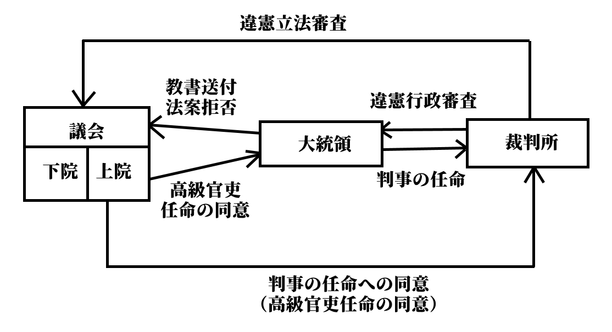  
アメリカの政治制度まとめ図。「三権が完全に分離している」「三権は対等であり、それぞれがそれぞれに対しチェック（攻撃）機能を持つ」というのが特徴。英国と比べると、全然違うのが分かる。  
  
## ●中華人民共和国の政治制度  
・中華人民共和国は共産党が支配するアジアの国家であり、西欧型民主主義国家とは全く異なる  
⇒権力分立とか、そのような発想に基づいて作られた国家ではない。ここまで学んだ政体で言えば、むしろ絶対王政が近い。議会での派閥争いを制した者が王となり、その王が絶対王政を敷き、王の統治を容易ならしめる組織が整備されている、という風にイメージするとよい。立法を司る議会、司法を司る裁判所等もあるが、三権を分立させていると言うよりは、王の下で役割分担して王を補助している、というようなイメージ  
・絶対王政に近い為、長所と短所も似ている。即ち…  
・国家主席（王）の意志が迅速に実行される、極めて効率的な統治が可能  
・気紛れな世論を気にせず、長期的な視野で連続性のある政治が行える  
・但し、一度王権が暴走を始めると止める手立てに乏しい  
・また、短期的な視点が無い故に、悪い意味で保守的になりがち  
  
  
〇政体及び憲法  
・初期は、ソ連的な民主集中制による国家だった  
※民主主義中央集権制とも。民主主義の名の通り一応選挙はあるが、「上位組織の決定に下位組織は絶対服従（批判すら許されない）」「分派形成の禁止（例えば最高指導者がスターリンであるなら、スターリン派以外の存在は許されない。例として、今の最高指導者はスターリンだけどその内トロツキーに最高指導者になってほしいな、とか考える者はトロツキー派とされて粛清される）」といった原則を持つ。国内に存在を許される政党は共産党のみで、共産党が国内を独裁し、その共産党を最高指導者が独裁する仕組みと言える  
・その後、［1982年憲法］にて、自らを［人民民主主義独裁の社会主義国家］と規定する  
※人民民主主義も、共産党によって国内が独裁されるという点は一緒。但し、共産党の体制を支持し、狭い範囲の利益を代表する場合に限り、共産党以外の政党（衛星政党）の存在が認められる。完全な共産党独裁だと国内に不満が溜まりやすいが、この体制ならば衛星政党の存在で幾分、ガス抜きができる  
・更に、［1993年］の憲法改正で【社会主義市場経済】を実施すると謳われた  
※共産主義・社会主義的な経済政策ではもう立ち行かないので、資本主義的な経済を導入しますよ、但しうちらが共産主義国家であるという建前は崩しませんよ、という風に理解するとよい  
  
  
  
〇国家元首と議会  
・国家元首は【国家主席】  
⇒実質的な、中華人民共和国の王。かつてはお飾りだった時期もあるが、江沢民以降は国家主席が共産党総書記（共産党の首長）を兼ねており、これ以降は国家主席こそが中華人民共和国という国の絶対王政的な王と考えてよい。江沢民、胡錦濤を経て、現在習近平が国家主席  
・国家主席の任期は無い  
⇒元は任期五年で二期までという制限があったが、習近平が撤廃した  
  
・議会に当たるのが、【全国人民代表大会】。通称【全人代】。立法機関である  
・【一院制】で、憲法上では（つまり建前上は）最高機関にあたり、国家主席の選出も行う  
⇒実際には、「ここでの派閥抗争を勝ち抜いた者が国家主席となるトーナメント会場」兼「国家主席の立法行為を補助する機関」と考えると分かりやすい  
・また、【全人代常務委員会】の選出も行う  
⇒全人代常務委員会は、全人代の閉会中、代わって役割を果たす  
  
  
〇内閣  
・【国務院】が、他国で言う内閣にあたる。行政機関である  
・【国務院総理】が、他国で言う内閣総理大臣にあたる  
・国務院総理は、国家主席が指名する。一応その後、全人代が承認する事で任命される  
・憲法上は全人代の執行機関。全人代への議案提出権も持つ  
・実際のところは、国家主席の行政、特に内政を補助・代行する機関と考えると分かりやすい  
⇒この機関のお陰で、国家主席は外交等に集中しやすい  
  
  
〇司法  
・【最高人民法院】が、他国で言う最高裁判所にあたる  
・裁判所は、最高、高級、地方、基礎の四階層に分かれている  
・事案によって、扱い始める裁判所が違う。また、二審制である  
⇒例えば、地方人民法院で最初に審理された事件は、控訴された場合高級人民法院に移され、そこで決着する  
  
## 政党  
  
・ここまでは軽く触れるに留まってきた政党について、もう少し突っ込んで解説する  
・政党の定義論としては、【バーク】のものが有名  
⇒「ある特定の主義または原則において一致している人々が、その主義または原則に基づいて公民的利益を増進すべく努力するために結合した団体」  
  
  
## ●右派と左派、保守と革新  
・日常的にニュースで自民党だの共産党だの言っているから、政党と聞いてイメージは浮かぶ筈である  
・しかし、「〇〇党はいわゆる右派政党」みたいな解説を聞くと「？？？」となる人が多い  
・まずはこの辺の解説から始める  
  
・基本的に、「右派＝保守」だと思っていい  
・同様に、「左派＝革新」だと思っていい  
・また、左派＝革新をリベラルと呼ぶ事もある  
・更に、両者の中間を中道と呼ぶ事もある  
⇒特に日本人は「中庸」「特定に勢力には与さない」みたいなのが好きなので、中道を自称する政治家や政党は多い  
  
  
### 〇右派＝保守  
・右派＝保守政党は、伝統の重視を基本とする  
⇒「基本的に今まで通りでやりましょう」「改革するにしてもゆっくりやりましょう」型  
  
・勿論、国や時代によって「今まで通り」は違う  
例１：米国にとって伝統とは即ち、独立戦争で「圧政への反抗」によって勝ち取った「自由」である  
例２：英国にとっての伝統とは、王室や貴族のような、歴史の重みのあるものである  
⇒つまり、英国では王や貴族は尊ぶべきものだが、米国では圧政の象徴であり許されない、となる  
  
・こういった事情から、同じ右派＝保守政党でも、国や時代によって言ってる事は違う  
・一応、「資本家（金持ち）の味方党」になりやすい、というのが数少ない共通項である  
⇒どの国でも、昔は商売の中心に金持ちがいた為。労働者保護、貧困層保護、みたいなのは、基本的には二十世紀に入ってからの考え方である  
  
・今まで見てきた政党だと、英国の保守党や米国の共和党がこれにあたる  
・現代日本では、一般的に自民党（自由民主党）がこれにあたるとされる  
⇒実際、昔は右派＝保守政党だった。現在は包括政党（後述）って奴になってしまった。むしろ令和三年現在に於いては、日本維新の会の方が右派＝保守的と言える  
  
  
### 〇左派＝革新（リベラル）  
・左派＝革新政党は、「不完全で不条理な今を変えよう」と基本とする  
⇒「今まで通り？　何言ってんだ周りを見てみろ、今の世の中なんてなっちゃいない、まるでなっちゃいない」「故にこそ、今こそ改革を断行して、本来あるべき理想社会を実現すべきなのだ」型  
  
・保守と違って、国や時代が変わっても言ってる事は同じ、という事が結構多い  
⇒基本的人権の保護、民主主義政治の実現、不平等の解消と平等の実現、労働者や貧困層の保護、環境保護等々  
  
・主張する内容から、共産主義（社会主義）と親和性がある  
⇒ざっくり言ってしまえば、共産主義とは「金持ちを殺しましょう」教である。共産主義の総本山たるソ連は、各国へ「金持ちを殺しましょう」教宣教師を派遣したが、彼らは基本的に、「労働者の味方」という体で活動した  
  
・今まで見てきた政党だと、英国の労働党や米国の民主党が左派＝革新型の政党である  
・ソ連の共産党なんかもこの類  
・実を言えば、かつての国家社会主義ドイツ労働者党（いわゆるナチ党）もこの類である  
  
・現代日本では、この手の政党は数多い  
⇒旧民主党系の立憲民主党と国民民主党、社民党（社会民主党）、共産党（日本共産党）等々  
  
  
### 〇右派＝保守と左派＝革新の変質  
・近年の政治を見る上で非常に重要なもの  
・二十一世紀に入ってしばらく経った現在、右派＝保守と左派＝革新の主張が変化しつつある  
  
・と言うのは、大体の先進国で、かつて左派＝革新の言っていた事が受け入れられつつあるのである  
  
・例えば一昔前なら、基本的人権の保護なんて、保守からは鼻で笑われるものでしかなかった  
⇒「基本的人権？」「誰もが生まれながらに人権を持っている？」「甘えるな。義務を果たさない奴、働かない奴に人権なんてねぇ」「義務を果たせない奴、働かない奴は刑務所に入れて無理矢理働かせろ」みたいな感じ  
  
・ところが、今や大抵の先進国では、基本的人権のような価値観を多くの人間が重んじている  
・基本的人権の重視は「当然」である、みたいな態度になっている  
・何なら「基本的人権の重視は、我が国の伝統である」みたいな感じになっている  
  
・言ってみれば、かつて左派＝革新が主張し求めた理想は、大枠で実現したのである  
・そしてかつての理想は、今や新たな伝統となり、右派＝保守が守ろうとするものにすらなったのである  
  
  
・ところが、左派＝革新は、「改革を求める」「理想を求める」という基本姿勢を変えなかった  
⇒「我々が求めていた理想は大枠で実現したな！」「よし、後は現実を少しずつメンテナンスしながら、理想に近づけていこう」みたいな、保守っぽい姿勢には至らなかった。「改革断行！」「革命！」みたいな姿勢だけを維持し続けた  
  
・そのせいか、最近の左派＝革新は、かつてとは主張内容が変質しつつある  
・一方で、右派＝保守が、かつての左派＝革新みたいな事を言い出して支持を集める事も多くなった  
  
・例えば米国のオバマ大統領。2009年から2017年の間大統領だった、民主党の大統領である  
※民主党は左派＝革新政党。つまりオバマ大統領も左派＝革新の人間  
・金融危機で不景気だった米国経済は、オバマ政権の下、回復傾向を見せた  
・しかし、労働者の生活は一向に良くならなかった  
・オバマ政権は大企業を支援したが、労働者保護政策は採らなかったからである  
・結果、民主党は労働者層の支持を失った  
・そして、オバマの次を決める大統領選。ドナルド・トランプが共和党から立候補した  
・トランプは「大企業ばっか優遇すんな」「国は労働者を守れ」と主張、当選した  
⇒本来、「労働者の味方党」は左派＝革新、「資本家（金持ち、企業）の味方党」が右派＝保守だった。それが見事に逆転している  
  
・不法移民問題なんかも、この流れで理解できる  
⇒不法移民は、何せ違法に入国してきている。なので、アメリカ人なら「そんなん生活できるか！」みたいな給料でも喜んで働く。企業の経営陣からすると、労働者の給料は安ければ安いほどいい。だからアメリカ人をクビにして不法移民を雇うし、「もっと不法移民入れろ」となる。そこで自国の労働者の保護なんか考えず、不法移民を事実行の合法移民として大々的に受け入れよう、と動いてしまったのが民主党（左派＝革新）。「国は労働者を守れ」と不法移民規制に動いたのが共和党（右派＝保守）  
  
  
・現代日本の場合、事情は複雑である  
・最大の変質は、伝統的に保守政党とされていた自民党が包括政党に変化した事だろう  
⇒後で詳しく触れるが、包括政党は「あらゆる政策を主張する政治家が所属する」政党。だから現代の自民党は、右派の政治家も左派の政治家も中道の政治家も抱えている  
  
・一方左派＝革新政党が「労働者の味方党」ではなくなったという変化は、旧民主党に見られる  
⇒民主党は、2009年に政権を握った左派＝革新政党。かつては自民党と並ぶ二大政党の片翼だった。が、左派＝革新政党の筈の民主党が政権を握っている間、労働者の待遇はよくならなかった（と言うか経済が悪化して失業率も上がり、むしろ悪化した）  
※本来保守政党で「資本家の味方党」の筈の自民党が、2012年末から令和三年現在まで政権を握っている。そして、「労働者の味方党」の筈の民主党政権下では上がらなかった最低賃金（労働者には最低これぐらいの給料を払いなさい、というもの）が、自民党政権になってから上がっている。やはり日本でも、右派＝保守と左派＝革新が変質している  
  
  
## ●政党の機能  
・国民は、一人一人考えている事が違う  
・ただ、各個人のばらばらな考えの中には、一つの形にできる、共通の部分がある場合がある  
・政党は、そういった各個人の持つばらばらな利益・意思を集約して、政策として具体化する機能を持つ  
⇒いわゆる［利益集約機能］。［世論］を政策という形にまとめる  
※こういう機能があるから、【マニフェスト（政権公約）】を掲げて選挙を戦う、という事ができる。「私が当選したらこういう事をします」というのを【公約】と言うが、その公約の中でも、「我々が政権を取ったら」という形を採り、尚且つ財政的な裏付けや実施期限等が示されているものをマニフェスト（政権公約）と呼ぶ  
  
・政党が、利益集約機能によって、政策として世論を具体化して国民に示す  
・すると、国民は「ああ、なるほどこれが今の政治の争点なのか」と気付く  
⇒薄々そうだと考えていたが言語化まではできていなかった国民や、そう考えている人がいると知らなかった国民が、具体化した政治の争点を見て学習する。だからこそ、選挙等で国民が自分の意志を示せるようになる。こういう機能が、いわゆる［政治教育機能］  
  
・与党として政権を獲得し運営する、もしくは、野党として与党を批判し政権獲得を目指す機能  
⇒いわゆる［政権担当機能］  
  
・与党としてにせよ野党としてにせよ、世論と実際の政治を繋ぐ機能  
・言い換えれば、世論を政治の中で実現する機能  
⇒いわゆる［利益媒介機能］  
※この機能に関する有名な台詞が、アーネスト・バーカーの「［政党］は社会と国家の架け橋である」  
  
  
## ●複数政党制と一党独裁制  
・政党を持つ国家は、大きく複数政党制と【一党独裁制】に分けられる  
・複数政党制国家は、【二大政党制】と【多党制】に分けられる  
  
〇一党独裁制  
・一党独裁制は、文字通りある特定の政党しか法的に認められていない体制  
・ソ連がこの典型例にあたる  
・また、人民民主主義制国家のように一党独裁を敷く政党が衛星政党を従える場合も、一党独裁制と呼ばれる  
・なお、現代日本のように、「法律で一党独裁の国って決まっている訳ではないが、事実上一党独裁状態が続いている」国も一党独裁制と呼ぶ場合がある  
  
・一党独裁制は、何より政権交代が存在しないので、支持率など短期的な視点が必要ない  
・その為長期的な視野に立って、連続性のある政治を行う事ができる。絶対王政と似た強味  
・一方、批判する勢力が存在しないので、暴走を止める手立ても少なく、また腐敗もしやすい  
  
  
  
〇二大政党制  
・複数政党制（複数の政党の存在を認める）の国に於いて、二つの巨大政党が並び立っている状態  
⇒法律で二つの政党しか認めないと決まっている訳ではない  
⇒また、二大政党以外の小規模な政党が存在している場合もある。但し、この小規模な政党は政局に影響を及ぼせるほどの勢力は無いものとする。もしそれだけの影響力があるのであれば、多党制と呼ぶべきである  
・アメリカ合衆国や、イギリスが典型例  
  
・主権者にとって、政党が二つしかないという状態は政治の争点を理解しやすい  
⇒政治はとかく複雑であるので、政党だけでも単純化されると把握しやすい  
・その為、投票など主権者の意思表示が容易になる  
・また、互いが互いをチェックする関係にある上、片方が野党なら片方は与党なので政治責任も明確  
⇒政治腐敗防止に役立つ  
・一方、二党どちらとも違う政治主張を持つ人にとっては何ら意味をなさない体制である  
・また、政権交代がある分短期的な人気取り政治になりやすく、長期的な視野に立った政治を行いづらい  
⇒複数政党制に共通する欠点ではある。そしてこの点に関しては多党制よりはましと言える  
  
  
〇多党制  
・複数政党制の国に於いて、多くの政党が並立している状態  
⇒多くの場合、議会の過半数を取れるような大型政党は無い  
・フランス共和国、イタリア共和国がこの典型  
  
・政党が多い分、より広範な政治主張を持つ主権者の意思をも拾い上げる事ができる  
・多くの場合、連立政権になる  
⇒故に政権交代が迅速で、国民の意思が即座に反映されやすい  
⇒また、二大政党による政権交代よりも更に、政治腐敗を防ぐ事ができる  
・同時に、連立政権になりやすいが故に、長期政権はほぼ誕生し得ない  
⇒長期的な視野に立った政治はほぼ絶望的。他国から見て、「こいつ一年ごとに言うこと変わってないか？」みたいな国になってしまう  
・また、連立政権である為に、政治責任の所在は明らかでない  
⇒失政があったとして、「あの政党のせいだ」「いやお前の政党のせいだ」みたいになりがち  
  
  
  
## ●政党の史的変遷  
・半分ぐらい、『人権の拡大』の復習。向こうもよく再確認しておこう  
  
〇革命の時代（18世紀ごろ）  
・名誉革命やフランス革命といった市民革命後の社会をリードしたのは、資本家たる富裕市民層であった  
・言い換えれば会社社長や工場長にあたる彼らは、「もっと自由に金を儲けさせろ」と自由権を求めた  
・結果、この時期は、資本家の利益をいかに最大化するかという政治が行われた  
⇒当然、選挙もある程度以上の金持ちしか投票できない制限選挙が原則だった  
・故に、この時期の政党は［名望家政党］だった  
⇒金持ちの、金持ちによる、金持ちの為の政党。資本家の利益を追求する  
  
  
〇参政権獲得運動から冷戦まで  
・こんな状態で労働者が暴れない筈はなく、参政権獲得運動が起こる  
・その結果として普通選挙が確立すると、政党は金持ちだけのものではいられなくなる  
⇒［大衆政党］の時代到来  
・名望家政党は、資本家の利益だけを追求すればよかったので、いわば同質的利益の追求に終始した  
・一方大衆政党は、意見も立場も利害も様々な人々の、多次元的な利益の追求をせねばならなくなった  
  
  
〇冷戦以降  
・名望家政党は、資本家を支持基盤とした政党であった  
・大衆政党も、あらゆる国民に開かれているとは言え、「資本家向け」「労働者向け」「資本主義者向け」「共産主義者向け」というような、ある程度決められた範囲を支持基盤とした  
・これらに対し、全国民を支持基盤にするようにできているのが［包括政党］である  
⇒包括政党には、資本主義者の議員もいれば共産主義者の議員もいるし、右翼の議員もいれば左翼の議員もいる。労働者擁護の議員もいれば、資本家擁護の議員もいる。そういった、あらゆる政策のオールインワンパッケージになっているのが包括政党である  
  
・この包括政党が台頭してくるのは、冷戦中期以降である  
・冷戦は資本主義と共産主義の対立による、武力によらない戦いである（詳しくは政治分野四章で）  
・この冷戦に於ける両陣営の対立は、1960年代頃から緩和される。いわゆる【デタント（緊張緩和）】  
・このデタントの時期から、［包括政党］が台頭してくる  
  
・典型例は日本の自由民主党。最初は右派（保守）政党だったが、後に包括政党へ変化した  
・包括政党は、複数政党制よりもむしろ一党独裁制に親和性がある  
⇒強力な包括政党が成立してしまうと「法律で一党独裁の国って決まっている訳ではないが、事実上一党独裁状態が続いている」という国にもなってしまい得る。現代日本がまさにこれ。しかも現代日本は内閣総理大臣を国民が選ぶという事もできない（国会議員が選ぶ）ので、「これ、事実上の貴族共和制では？　自民党議員という貴族を選挙という儀式で選出するって形の」という見方も成り立つ  
※現代日本の場合、2000年代には自民党と民主党の二大政党になりそうな気配があり、実際2009年には民主党が政権交代を果たした。しかしあまりにも酷い失策の連続と党内抗争による分裂により、2012年の選挙後はむしろ、自民党による一党独裁体制が加速してしまった  
# 政治分野第二章　日本国憲法  
  
　~~正直こ~~~~の分野~~~~やりたくない~~  
　日本国憲法は、現代日本の最高法規である。日本国という国の成立、そして統治に於ける根本的な規定であり、全ての行政、立法、司法は、この憲法の規定と精神に基づいている。現代の法体系や政治は極めて入り組んでおり、その全てを学ぶのはほぼ不可能だが、どれも結局はこの憲法へ行き着く。その為、弁護士になりたいとかそういうのでもなければ、「一般常識」として日本国憲法をベースに政治や法を学んでおくのがいいだろう。本章は、そういう内容である。  
  
  
## 大日本帝国憲法と日本国憲法  
  
　日本国憲法そのものを見る前に、日本国憲法制定前の憲法、即ち大日本帝国憲法（明治憲法と呼ぶ事も多い）について、日本国憲法と比較しながら見てみよう  
  
  
## ●それぞれの模範と時代背景  
  
大日本帝国憲法：模範は【プロイセン憲法】。【参政権】や【自由権】が重視された時代背景を持つ  
日本国憲法：模範は【アメリカ憲法】。【社会権】が重視された時代背景を持つ  
  
　政治分野第一章で見たように、時代によって重視された人権が異なる。名誉革命やフランス革命によって重視された人権が、【自由権】である。資本家（企業の社長とか工場長とか）の、「もっと自由に金儲けをさせろ」「政府は何もするな、国民に介入してくるな」という権利である。  
　資本家の「自由」によっていじめられた庶民は、自由権を制限するのではなく、自らの代表を議会に送り込んで生活を改善しようと目論んだ。故に、革命の時代に続く十九世紀に重視された人権は【参政権】であった。  
　しかしそれでも貧乏人の生活は改善せず、二十世紀初頭から中頃まで重視されたのが【社会権】である。「どんな貧乏人でも、人間らしく生きる権利はある」「困った国民を助ける為に政府は積極的に介入しろ」という主張が尊重され、「その為には多少、自由権を制限するのも致し方ない」とされたのである。  
　具体的な制定時期は後でやるが、大日本帝国憲法は、末期とは言え十九世紀の制定。一方、日本国憲法は第二次世界大戦後の制定。この為、重視された人権がまず、時代背景によって違う。大日本帝国憲法は参政権を重視し、また前世紀からの伝統で自由権も重視している。逆に、日本国憲法には多数の社会権が盛り込まれているし、自由権は多少の制限を受けている。  
　また、模範とした憲法によっても違いがある。日本国憲法が模範としたのはアメリカ憲法であり、その源流はイギリスにある。イギリスは、度々王が圧政を布いてきた歴史的経緯があり、農民反乱も数多い。憲法も、圧政に対する反乱が契機になって形成されたものである。その為、「王や政府は無茶苦茶をするもの」という認識が前提にあり、無茶苦茶する王や政府から国民を守る為に、【抵抗権】（圧政に対しては抵抗してもよい、という権利）や【天賦人権説】（人権は天与のものであって、王や政府が勝手に制限してはならない）という考え方が重要になる。その為、人権というものに気を使う。また、いかに王（政府）の権限を制限するか、という点にも気を使う。王（政府）に好き勝手な政治をさせると、圧政を布いてくるからである。  
　一方で、プロイセンは歴史的に、そんなに圧政をしてこなかった。プロイセンはドイツ北東部の王国にして後にドイツを統一した王国だが、この国は、「理性的である」「合理的である」という事を至上命題にしてきた国である。例えば、反乱を度々起こされるような圧政は合理的ではない。具体的に、圧政による反乱というものを重税への反発による農民一揆として考えてみよう。反乱を起こされるぐらいの過大な重税は、確かに、短期的には儲かるかもしれない。しかし、結局反乱を起こされてしまえば、その反乱の鎮圧にも金が必要だし、反乱後は間違いなく税収が下がる（税を収める国民の数が確実に減る）。このようなやり方は、効率的とは言えない。即ち、合理的ではないし、理性的でもない。  
　他の例としては、信仰の自由など殆どの国に存在しなかった時代から、プロイセンでは自由な信仰が認められていた。これも、個人の信仰まで国が拘束するのは合理的ではないという判断から来ている。義務さえ果たしてくれるなら何を信仰しようと文句は言わない、という判断である。  
　プロイセンはそういう国なので、歴史的に圧政を布いてこなかった。いかに効率的に、理性的に国を運営するかという事に力を注いできた。その為、抵抗権や天賦人権説という形で人権を重視する必要がない。人権を無視するとか蹂躙するとかそういう行為は理性的ではないから、合理的に、王や政府が人権を国民に与え、保護するという方向になる。また、政府や王の権力を制限する必要もない。とにかく合理的に、効率的に行政が行われる事が重視される。  
　大日本帝国憲法と日本国憲法、それぞれの模範と時代背景の違いから、憲法としての性質は全く違う。大日本帝国憲法に関する文章ではしばしば、「大日本帝国憲法は社会権のような権利が保障されていない」「大日本帝国憲法は所詮［外見的］立憲主義である」などと述べて批判するようなものが見受けられるが、時代背景を知っていれば当たり前の事だと分かるだろう。また、後の比較を理解しやすくなり、暗記もしやすくなる筈だ。  
　なお、日本国憲法の模範はあくまでアメリカ憲法なのだが、「これアメリカ憲法式じゃなくてイギリス憲法式じゃん」という部分も多い。  
  
  
  
  
## ●憲法そのものについて  
〇制定時期  
大日本帝国憲法：1889年2月11日発布、1890年11月29日施行  
日本国憲法：【1946年11月3日公布、1947年5月3日施行】  
※大日本帝国憲法については「発布」、日本国憲法については「公布」を使う。どちらも同じ意味で新しい法律を世に知らしめる行為を言うが、それぞれの憲法について必ずこの用語を使う  
  
  
〇形式  
大日本帝国憲法：【欽定憲法】、［硬性憲法］、成文憲法  
日本国憲法：【民定憲法】、［硬性憲法］、成文憲法  
  
・欽定憲法：王や政府といった、いわゆる「お上」が定めた憲法  
・民定憲法：主権者たる国民が定めた憲法  
※少なくとも高校公民レベルでは、日本国憲法は民定憲法とされる。それと「日本国憲法を定めたのはマッカーサーという「お上」であって国民ではないのでは？」と思った人、その辺の話は後でやります  
  
・硬性憲法：一般的な法律よりも改正しづらい憲法。一般的な法律と変わらない場合は軟性憲法  
・成文憲法：憲法典として成文化されている憲法。憲法典を持たない場合は不文憲法。代表例は【イギリス】  
  
  
〇主権  
大日本帝国憲法：【天皇主権】  
日本国憲法：【国民主権】  
  
※日本国憲法前文は以下のように、主権の所在（と間接民主制の採用）を示している  
  日本国憲法前文（一部抜粋）　ここに【主権】が国民に存することを宣言し、この憲法を確定する。そもそも国政は、国民の厳粛な【信託】によるものであつて、その権威は【国民】に由来し、その権力は国民の【代表者】がこれを行使し、その【福利】は国民がこれを享受する。  
  
  
  
〇天皇  
大日本帝国憲法：【神聖不可侵】、【国家元首】、【統治権の総攬者】  
日本国憲法：主権者である国民の【総意】による、日本国と日本国民統合の【象徴】  
  
※総攬は「全て掌握する」という意味  
※日本国憲法下に於いても、少なくとも外交慣例上は天皇が国家元首として扱われる。実際、天皇を国家元首であるとする見方も多いが、高校公民レベルではあまり、日本国憲法下の国家元首とは見ない  
  
・日本国憲法下では、天皇は国政機能を完全に失い、【国事行為】のみ行える存在となった  
※国政行為：立法や行政のような政治的行為  
※国事行為：形式的、儀礼的行為。例えば、大臣の任命式  
  
・天皇の国事行為には、常に【内閣】による【助言と承認】が必要  
※例えば大臣の任命をやるとして、その大臣を誰にするかは既に決まっている。天皇が「こいつは嫌だなぁ…」と思っても、内閣の承認が必要なので、嫌でも任命しなければならない  
  
  
〇人権  
大日本帝国憲法：天皇が与えるもの。【法律】によって制限可能。【自由権】中心  
日本国憲法：【天賦人権説】を採る。永久不可侵の【自然権】であるとする  
  
※大日本帝国憲法下の人権は、「寛大な天皇陛下が臣民にくださったもの」という扱いであり、恩賜的人権などとも呼ばれる。その性質上、法律によっていつでも制限可能。その実例が【治安維持法】  
※日本国憲法は、厳密には天賦人権説ではないとする意見もあるが、「人権とは人が生まれながらに持っている不可侵の権利である」という意味では天賦人権説そのもの  
※日本国憲法下の人権は基本的に制限されないが、【公共の福祉】によっては制限され得る  
※日本国憲法下の人権は、主に【自由権】、【参政権】、【社会権】、［平等権］、［請求権］といったものがある。この辺の詳しい話は後でやります  
  
  
〇戦争  
大日本帝国憲法：いわゆる［天皇大権］により、天皇は軍の【統帥権】を持つ  
日本国憲法：【戦争放棄】、【戦力不保持】、【交戦権の否認】  
  
※実際には、日本国憲法下でも事実上の軍隊にあたる自衛隊が存在しているのはご存知の通り。ちなみに、自衛隊の統帥権は内閣総理大臣が保持している  
  
  
  
〇義務  
大日本帝国憲法：［臣民］の二大義務は［兵役］と［納税］  
日本国憲法：【国民】の三大義務は【教育】、【勤労】、【納税】  
  
※大日本帝国憲法では、国民という言葉は使わず臣民という言葉を使う  
※日本国憲法の教育の義務は、教育を受けさせる義務。教育を受ける義務ではない  
※日本国憲法は【天賦人権説】を採る為、義務をしないから権利が消滅するという事はない  
  
  
〇地方自治  
大日本帝国憲法：【規定なし】  
日本国憲法：【規定あり】  
  
※大日本帝国憲法は、元が地方分権の極致な封建制を採用した江戸時代だったので、中央集権を志向しており地方自治の規定がない。逆に、日本国憲法は地方分権主義の強いアメリカの影響を受けて、地方自治の規定を憲法に盛り込んでいる  
  
  
〇権力分立  
大日本帝国憲法：天皇が統治権を【総攬】  
日本国憲法：【三権分立】、【議院内閣制】  
  
※大日本帝国憲法下では行政権も立法権も司法権も全て、天皇が掌握するという事。だから裁判は全て天皇の名の下に行われるし、議会に頼らない独自の立法権も有していた  
※日本国憲法は議院内閣制を採る為、三権分立はあまり厳密ではない。二権分立とされる事もある。日本国憲法がアメリカ憲法風ではなくむしろイギリス憲法風な部分の一つ  
  
  
〇国会（立法府）  
大日本帝国憲法：天皇の立法権を補助する［協賛］機関  
日本国憲法：【国権の最高機関】  
  
※大日本帝国憲法下では、実際の運用では多くの場合、法律は帝国議会で立法され、天皇はこれを裁可し公布するだけだった  
※国会が国権の最高機関というあたり、議会主権のイギリス憲法風である  
  
  
  
〇内閣（行政府）  
大日本帝国憲法：各国務大臣は、天皇の各行政権を［輔弼］する  
日本国憲法：【議院内閣制】を採り、内閣総理大臣は必ず［国会議員］。各大臣は必ず【文民】  
  
※輔弼は「補助」と言い換えられる単語。国務大臣は、内閣総理大臣を含む各大臣（外務大臣、大蔵大臣、財務大臣等々）  
※大日本帝国憲法下の各大臣は、例えば外務大臣なら天皇による外交を、陸軍大臣なら天皇による陸軍の統率を、直接補佐する。内閣総理大臣は、各大臣のとりまとめ役に過ぎない、というのが大日本帝国憲法下の内閣の運用。このような運用だった為、内閣総理大臣は軍の動向に介入できなかった。これを【統帥権の独立】という  
※文民とはつまり武官ではない者、軍人ではない者を指す。大日本帝国憲法下では、武官でも大臣になれた。と言うか、陸軍大臣と海軍大臣は、現役の武官でなければならないという規定が昭和にできる  
※日本国憲法下の内閣総理大臣は必ず国会議員だが、他の大臣は［過半数］が国会議員であればそれでよい  
  
  
〇司法  
大日本帝国憲法：【天皇】の名の下に行われる裁判。【特別裁判所あり】。【違憲審査なし】  
日本国憲法：【特別裁判所なし】。【違憲審査あり】  
  
※大日本帝国憲法下の特別裁判所は、行政裁判所、皇室裁判所、軍法会議  
  
  
〇憲法改正  
大日本帝国憲法：勅命により、帝国議会により審議して議決  
日本国憲法：国会で発議して、国民の賛成が必要  
  
※日本国憲法の制定は、実は大日本帝国憲法の改正という形で行われた。故に、勅命（天皇の命令）によって帝国議会で審議し、議決するという形を（少なくとも形式的には）採っている  
※日本国憲法の改正は、分かりやすく言うと以下の三段階で行われる  
１：憲法改正案を、衆議院・参議院両方の議員三分の二以上の賛成によって決定  
２：１で決定した改正案を、国民投票等によって国民が承認  
３：２で承認された改正案を、天皇が公布  
  
  日本国第【九十六条】　この憲法の改正は、【各議院】の総議員の【三分の二】以上の賛成で、国会が、これを【発議】し、国民に提案してその承認を経なければならない。この承認には、特別の【国民投票】又は国会の定める選挙の際行はれる投票において、その過半数の賛成を必要とする。  
  ２　憲法改正について前項の承認を経たときは、天皇は、国民の名で、この憲法と一体を成すものとして、直ちにこれを【公布】する。  
  
  
## ●大日本帝国憲法の実際の運用など  
　既に見てきたように、大日本帝国憲法はプロイセン式の、君主大権が強い憲法である。であるからして、本来であれば当然、天皇親政が行われるべきところだった。なのだが明治政府は、天皇に対しては「君臨すれども統治せず」なイギリス式の王の在り方を求めるという謎の行動に出る。この為、大日本帝国憲法下の統治の運用は、「天皇が統治権を総攬する」と規定されているにも拘らず「天皇は統治権を行使しない」というよく分からないものであった。  
　このような状態であるから、戦前の時点で既に、天皇は象徴に過ぎない存在ではあった。ただ、憲法上は統治権を総攬する立場である為、「お前分かってるんだろうな。建前上はこっちが統治権持ってるんだぞ。しっかりやれ」と各国務大臣の尻を叩く立場でもあった。同じ象徴天皇でも、政治的な行動・発言を厳に禁止されている日本国憲法下の天皇とは、この点が違う。  
  
　大日本帝国憲法下の統治は、初期は［元老］（明治維新の功労者）が天皇に成り代わって政治を行う感が強かった。明治も中頃を過ぎると、内閣に任せる形を採った。元老が天皇に成り代わって内閣総理大臣を任じ、内閣総理大臣が統治を行うという形である。  
　そんな体制なのに、大日本帝国憲法には内閣の規定がない（各国務大臣が天皇を輔弼するという規定はあるが、内閣がどんなものかとか内閣総理大臣はどんな権限を持つかとかそういうものはない）というから、割と滅茶苦茶である。  
　ともあれ、大正期にもなると議会政治も発達し、議会で最大勢力となった党の人間に総理大臣をやらせるという形が一般的となる。実質的な、立憲君主制の民主主義国家へと変化していくのである。ただ、憲法と現実の統治が乖離しているという問題は大きかった。  
　例えば、内閣総理大臣には、各大臣の［任免権］がなかった。憲法上、それぞれの大臣がそれぞれの分野で天皇の統治行為を輔弼するという建前であり、しかも内閣総理大臣の権限の規定がなかったせいで、例えば外務大臣なら「俺は天皇陛下の外交について、直接補佐する権限を持ってるんだ。お前に俺をクビにする権利があるのか」と言われてしまう訳である。その為内閣の決定は全会一致が原則で、一人でも反対が出たら総辞職するしかなかった。この内閣総理大臣の権限の弱さが最も強力に表出してしまったのが、統帥権の独立問題である。  
　やがて戦前日本の議会政治は失政が続いて国民の支持を失い、むしろ新たな指導者として軍隊が脚光を浴びるようになる。また元老もそのほぼ全員が死に絶えた事により、日本政界は第二次世界大戦へ続く混乱に陥っていくのである。  
  
　ちなみに、大正期になって議会政治が発達したのはいわゆる【大正デモクラシー】に因るが、この大正デモクラシーに於いて理論的支柱になったのは【吉野作造】の提唱した【民本主義】である。これは、主権が君主にあろうが国民にあろうが構わないが、その主権が行使される目的は国民の幸福でなければならない、という主義である。  
　同じ大正デモクラシー期には、［美濃部達吉］の［天皇機関説］も台頭した。これは、主権の存する者は誰かについて論じたものである。主権には「統治権」「国家意思最終決定権」「対外的独立性」という三つの側面があったが、「統治権」という意味での主権は国家が所有し、「国家意思最終決定権」という意味での主権は天皇が所有する、としたのが天皇機関説である。  
　ただこの学説、一般国民には理解されず、「畏れ多くも天皇陛下を機関車に喩えるとは何事か」とか言われて攻撃され、美濃部の著書は発禁に追い込まれる事になる。まぁ、現代でも大阪都構想を「新しい首都を大阪に作ろうとはけしからん」みたいに思っている人も多い事を思えば、当然と言えば当然の結果ではあった。尚、昭和天皇自身は、「天皇機関説でいいではないか」と言っていたとされる。  
  
　また、大日本帝国憲法下では、建前上は司法権も天皇が掌握していた。ただ実際の運用では、司法権は天皇から裁判所に委任された形をとっており、これが事実上の司法の独立となっていた。故に、大日本帝国憲法下でも、司法の独立は概ね達成されていたと言ってよかろう。  
　大日本帝国憲法下の司法の独立についてよく挙げられるのが［大津事件］である。明治の、日清戦争すらまだ起きていない時期のアジアの小国日本を訪問していた超大国ロシア帝国の皇太子が、警備にあたっていた日本の警官に斬りつけられたという事件である。後に日露戦争で勝つとは言え、当時の日本は、ロシアの前では吹けば飛ぶような弱小国である。当然、政府は司法に対し圧力をかけたが、裁判長の児島惟謙は「法治国家として法は遵守されなければならない」として、法に則った判決を行っている。このように、実際の運用に於いては、戦前も司法は概ね独立していたと言える。ただ一方で、大逆事件のような政治事件もあるので、「概ね」という注釈付にはなる。  
　なお、特別裁判所があり、特に行政に関する裁判は行政裁判所で行った。また、ここで行われる裁判は大審院（いわゆる最高裁判所）へ上訴できなかった。こういう体制だったのは無論、戦前の日本がプロイセンを範とした為である。実際、プロイセンが作ったドイツ帝国には、行政裁判所にあたるものがある。戦後、三権分立の厳密さを求めるアメリカを模範とした憲法を導入した結果、行政裁判所は消滅する。こういった事情から、行政権との権力分立が厳密ではないという意味では、司法の独立は中途半端であった。  
  
  
## 日本国憲法の制定  
  
　本節では、時系列に沿って、日本国憲法がどのように制定されたかを確認する。これは、日本国憲法という現代日本の法体系の根本にある法が、どのような理屈で正統性を付与されているかという点の確認でもある。  
  
1945年  
8月14日：ポツダム宣言受諾  
8月15日：大日本帝国降伏、第二次世界大戦終結  
10月11日：【GHQ（連合国最高司令官総司令部）】が当時の幣原内閣に憲法改正を示唆  
10月25日：【憲法問題調査委員会（松本委員会）】設置  
10月29日：【憲法研究会】発足。民間の私的な新憲法研究会である  
1946年  
2月1日：松本委員会の憲法案が毎日新聞にすっぱ抜かれる  
2月3日：GHQ、【マッカーサー三原則】を準備  
2月8日：松本委員会の憲法改正案が正式にGHQへ提出  
2月13日：GHQより【マッカーサー草案】が提示される  
以後、マッカーサー草案をベースに憲法改正案を作り直す  
4月10日：初の完全普通選挙。婦人議員39名当選  
6月20日：第90帝国議会に、憲法草案を提出  
10月7日：帝国議会で憲法改正草案を修正の上可決  
11月3日：日本国憲法公布  
1947年  
5月3日：日本国憲法施行  
  
  
　注意したい第一は1945年10月11日。GHQが当時の幣原内閣に憲法改正を示唆しているが、この示唆の内容が「憲法改正」である点に注目したい。大日本帝国憲法の破棄と新憲法の制定という形ではなく、大日本帝国憲法を有効かつ正統な憲法と認めた上で、その後継者として日本国憲法を制定する、という形を求めている。新しい日本の憲法は、あくまで以前からの日本を引き継いだものであるという立場に立つもので、ここにも新憲法の正統性への配慮が見られると言える。  
　この示唆を受けて憲法問題調査委員会、いわゆる松本委員会が設置される訳だが、ほぼ同時期、民間でも独自に、憲法研究会を設置している。このような憲法私案を作る運動は、大日本帝国憲法の制定時にも盛んで、大日本帝国憲法制定前の憲法私案の事は【私擬憲法】などと呼ぶ。  
　さて、松本委員会は、プロイセン憲法風の伝統を残した憲法草案を作成していた。松本委員会が求めていたのは大正デモクラシーによる政党政治・議会政治の復活であり、天皇機関説を正式なものとして取り入れる等、政党政治に憲法の裏付けを与えようというような方向で草案作成の作業を進めていた。憲法破棄からの新憲法制定という訳ではないので、まぁ順当な方向性と言えば順当な方向性ではある。  
　だが、翌2月1日、松本委員会で作成されていた憲法草案の内の一つが、毎日新聞にすっぱ抜かれる。GHQはこれを見て危機感を募らせた。一般的に、日本の占領政策は全てGHQ（とその長マッカーサー）が取り仕切っていたように思われがちだが、GHQの背後には連合国各国があり、各国の思惑にGHQは対処せねばならなかった。  
　そして、GHQは実のところ、天皇制については穏健派で、天皇制の温存を意図していた。しかし、ソ連等、連合国の一部は強硬に日本の国家改造を求めていた。このまま日本人に憲法改正作業を行わせていたら、そういった国々の世論が激発し、天皇制廃止を強硬に要求してくる事態が予想された。  
　これを鑑みて、GHQはマッカーサー三原則を準備した。マッカーサー三原則の内容は、【天皇は国家元首】、【戦争放棄】、【封建制度の廃止】である。最後の封建制度の廃止とは、貴族（華族）制度の廃止を指して言っている。  
　こうして、マッカーサー三原則を元にした、GHQによる憲法草案作成が始まった。マッカーサー草案は10日程度で作成され、しかも法学者が携わらなかったという事で批判の元となっているが、一方で、憲法研究会が作成した憲法私案を参照もしており、日本国憲法は正統であるとの論の根拠にもなっている。  
　このマッカーサー草案が、2月13日に政府へ正式に提示される。この提示にあたっては、マッカーサー草案は既に連合国各国の承認を得ている事や、この草案が受け入れられない場合は天皇の地位も保証できないといった話が伝えられた。日本政府はこれを受け入れ、翻訳と一部修正の上、日本国憲法の草案とした。  
　その後、総選挙が行われた。この総選挙は、初の完全普通選挙（男も女も選挙権・被選挙権を持つ）であった。この総選挙で選ばれた議員によって第90帝国議会が行われ、憲法草案は審議される事になる。この議会に於いても、憲法草案は修正を加えられ、最終的な日本国憲法の形になった。例えば、マッカーサー草案には［生存権］はなかったが、日本国憲法には取り入れられている。GHQが作ったそのままではない、日本人の手が入った部分である。  
　このように、マッカーサー草案はそのまま採用されて日本国憲法になったのではなく、日本の政府、及び国会によって修正が加えられている。特にこの国会は、初の完全普通選挙を経た後すぐに行われた国会であり、いわば日本人全員の意思を代行する資格を持った議員がいたことになる。その国会で審議され、修正された訳だから、元がGHQの草案であったとしても、日本国憲法は正統である、という論が一般に展開される。  
　勿論、実際に日本国憲法が正統なものであるかどうかは、見る人によって変わる。例えば、マッカーサー草案は憲法研究会の私案から大きな影響を受けておりこれが正統性の根拠の一つとなっているが、憲法研究会はそもそも民間のグループであって、日本人や日本政府に承認された正式な機関ではない。「それを正統性の根拠と言えるか？」と言われると「すいませんでした」という話にもなり得る。国会で審議されたという点についても、「進駐軍の占領下、しかも敗戦直後というショック状況下での選挙と国会が正常で正統だと言えるか？」と言われると「まぁそれもそうね」となる。  
　勿論、学校教育レベルでは、日本国憲法は正統なものだとされるし、また、民定憲法だとされる。ただ、日本国憲法が正統なものであるか、日本国憲法が民定憲法と言えるのか、というような話は、最終的には国民一人一人が自分で考え、自分で学び、自分で判断するものと言えるだろう。  
  
  
  
・最後に、日本国憲法制定の流れを元に、日本国憲法の正統性について見るなら、以下のようになる  
  
日本国憲法は正統な憲法であるとする根拠：  
・日本国憲法はマッカーサー草案が元だが、憲法研究会の私案も参考にされている  
・日本は、政府が正式にマッカーサー草案を受け入れている  
・マッカーサー草案の受け入れは、天皇制保持の為に必要だった  
・マッカーサー草案は政府で修正を受け、更に国会で審議されて修正を受けている  
・日本国憲法草案を審議した国会は、直前に総選挙を受けており、マッカーサー草案はただ政府が受け入れただけでなく日本国民全体が受け入れたと見做せる  
  
日本国憲法はマッカーサーによる押し付けであるとする根拠：  
・日本国憲法の元はマッカーサー草案であり、日本人が作ったものではない  
・マッカーサー草案は10日前後の急ごしらえで、しかも作成には法学者が携わってすらいない  
・マッカーサー草案に影響を与えた憲法研究会案は、日本人や日本政府に承認された機関による正統で正式なものではない  
・進駐軍による占領下にあって、マッカーサー草案を日本が拒否できる筈はない  
・敗戦というショック状況下、更に進駐軍による占領統治下の選挙と国会が正常で正統とするのは無理がある  
  
  
～ここから雑談～  
　日本国憲法の制定について、法学の世界（特に憲法学の世界）だと、八月革命説というのが有力です。これはざっくり言ってしまうと、「ポツダム宣言を受け入れて敗戦となった1945年の八月に日本では革命が起きた」「革命によって主権が君主（天皇）から国民へ移動した」というもの。  
　純粋に法学的な見地、特に主権が誰にあるかという点からすると、一定の理がある理論ではあります。一方で、社会科の勉強を真面目にしなかった人が学んでしまうと弊害が起こりやすいものでもあります。  
　と言うのは、大日本帝国憲法下でも、日本は民主主義政治をやっていた訳です。それこそ、マッカーサー草案が出る前に作ってた草案は、大正期にやっていた民主主義政治の復活と安定が主眼でした。しかし、法学部で法学を学んだであろう弁護士や裁判官を見てると、全てを八月革命説に基づいて考えてしまう人が結構います。つまり、「戦前の日本は一貫して独裁国家であった」「八月革命によって初めて、日本に民主主義が誕生した」みたいに考えちゃってる人が、結構いるんですね。  
　中高生が社会科を嫌うのはある程度仕方のないことです。基本授業つまんないし。暗記ばっかだし。  
　しかし、社会科を嫌って真面目に勉強してないと、後々変な思想を吹き込まれ、それがおかしいと考えもできず、その思想に染まってしまう…なんて事件が発生してしまいやすくなるんですね。そういうのが嫌だったら、社会科はきちんとやった方がよろしいでしょう。  
～ここまで雑談～  
  
  
## 日本国憲法と国防  
  
　日本国憲法は、【平和主義】を掲げて戦争放棄を謳っている。一方で、戦争放棄、戦力の不保持を謳いながら、自衛隊という実質的な軍隊を保持している（少なくとも国際法上は、自衛隊は軍隊として扱われ、自衛官は軍人として扱われる）。それに、実際のところ戦争が一切できないというのは困る。他国に攻め込まれたらその時点で日本人が生きるも死ぬも敵軍のお気持ち次第、というのも惨い話である。故に、憲法と現実の折り合いをつけるべく、様々な苦労が重ねられている。  
　このあたりの問題について、細かく見て行こう。  
  
  
## ●憲法の条文  
  
・憲法前文には以下のようにあり、【平和主義】、【国際協調主義】を採る事を示す  
  日本国憲法前文（一部抜粋）　日本国民は、恒久の平和を念願し、人間相互の関係を支配する崇高な理想を深く自覚するのであつて、平和を愛する諸国民の公正と信義に信頼して、われらの安全と生存を保持しようと決意した。  
・また、以下のようにあり、【平和的生存権】を確認している  
  日本国憲法前文（一部抜粋）　われらは、全世界の国民が、ひとしく恐怖と欠乏から免かれ、平和のうちに生存する権利を有することを確認する。  
  
・また、憲法九条は以下のように、【戦争放棄】、【戦力不保持】、【交戦権の否認】を定めている  
  日本国憲法第九条　日本国民は、［正義］と［秩序］を基調とする国際平和を誠実に希求し、［国権］の発動たる戦争と、武力による威嚇又は武力の行使は、国際紛争を解決する手段としては、永久にこれを放棄する。  
  ２　前項の目的を達するため、陸海空軍その他の［戦力］は、これを保持しない。国の［交戦権］は、これを認めない。  
  
  
## ●憲法九条の解釈  
・素直に憲法九条を読めば、日本は一切戦争ができないように見える  
・また、素直に憲法九条を読めば、自衛隊は違憲である  
・とは言え、歴史的に、戦後日本はソ連や中華人民共和国という脅威に晒されてきた  
・そういう事情もあって、憲法には様々な解釈がある。代表的な解釈を見て行こう  
  
  
〇九条は、戦争を全て放棄したとみる解釈  
・1946年の吉田茂の解釈等  
  
　この解釈を「お花畑」と思い、嫌う向きもあろうが、待って欲しい。これは、特に終戦直後からしばらくの間、日本の国防を支えた、極めて現実的な解釈でもある。  
　日本国憲法は、素直に読めば戦争が一切できない。ところで、終戦からすぐにアメリカとソ連は対立関係となり、いわゆる冷戦が始まる。アメリカにとって、日本は韓国と並ぶ極東の最前線基地である。失う訳にはいかない。当然、日本に再軍備させて戦力として活用しようという話が持ち上がる（これは、欧州の敗戦国にして最前線基地だったドイツ連邦共和国でも事情は一緒である）。  
　日本は、自衛隊こそ整備したものの、アメリカ陣営の一翼を担う戦力となる事については突っぱねた。「日本は戦争を放棄しました。誰あろうアメリカの主導で作られた平和憲法によって、もう戦争をする訳にはまいりません。だから日本を守るのは、アメリカの仕事でしょう」という形である。アメリカも、最前線基地の日本を失う訳にはいかないし、憲法改正は自分らが主導してやったという事実自体は言い訳できないので、何も言えない。  
　そういう姿勢によって、日本は朝鮮戦争にもベトナム戦争にも、巻き込まれずに済んだ訳である。ともすれば「押し付け憲法」と言われがちな日本国憲法だが、「押し付け」を逆手に取った形である。こうして日本は、冷戦というどの国も重武装しなければならない時代に、軍隊にかけるカネをアメリカに丸投げできたのだ。  
　ただ、近年になるとアメリカも「うちもうそんなカネある訳じゃないから、ちょっとぐらい！　もうちょっとぐらいでいいんで！　アジアで影響力発揮してくれませんかね…？」という状態になり、それもあって、他の解釈も力を持つようになった。  
  
  
〇九条は侵略戦争のみを放棄したとするが、自衛隊は戦力とみる解釈  
・この解釈は、前文に平和的生存権がある事等から、自衛戦争は可とする  
・但し、自衛隊は戦力と見做し、違憲とみる  
  
  
〇九条は侵略戦争のみを放棄し、また自衛隊は戦力とみない解釈  
・1972年、田中角栄内閣以来の統一見解  
・この解釈は、前文に平和的生存権がある事等から、自衛戦争は可とする  
・自衛隊は、この自衛戦争の為の必要最小限度の実力であるとする  
・実力であって戦力ではないので、合憲であるという解釈  
  
## ●自衛隊と憲法九条を巡る裁判  
・解釈がどうであろうと、素直に憲法九条を読めば、自衛隊は違憲である  
・この為、自衛隊と九条を巡る裁判がいくつか起きている。有名どころを以下に載せる  
・先に結論を言ってしまうと、最終的に合憲か違憲かの判決を下した例はない  
・途中出てくる統治行為論については後述  
  
  
〇【恵庭事件】  
・自衛隊の合憲・違憲が争われた事件  
・北海道恵庭町の酪農家が、自衛隊の通信線を切断した事件  
・酪農家は、自衛隊法121条（防衛器物の破損）で起訴される  
・被告の酪農家は、「そもそも自衛隊は違憲である」として反撃  
・札幌地裁は、通信線は防衛器物ではないからセーフとして無罪を言い渡す  
⇒自衛隊の憲法判断はなし（被告は別の理由で無罪なので必要なし）  
  
  
〇【長沼ナイキ基地訴訟】  
・自衛隊の合憲・違憲が争われた事件  
・北海道長沼町に、地対空ミサイル（ナイキミサイル）基地を建設する事に  
・その用地として長沼町の国有保安林指定が解除され、解除取り消しを住民が訴えた事件  
・憲法違反の自衛隊の為にそんな事をしていいのか、というのが住民の主張  
・札幌地裁は、初めての自衛隊違憲判決を出す  
・札幌高裁は、統治行為論によって憲法判断を回避  
・最高裁は高裁を支持  
⇒原告の請求棄却で決着  
  
  
〇【百里基地訴訟】  
・自衛隊の合憲・違憲が争われた事件  
・茨城県の、百里基地建設予定地の土地を所有している人がいた  
・この人は最初、基地反対派に土地を売却  
・その後、この売却契約を解除して、防衛庁に土地を売った  
・基地反対派が訴え出て、裁判の中で自衛隊の違憲性についても主張する  
・水戸地裁は、統治行為論によって憲法判断を回避  
・東京高裁は、憲法判断必要なしとする（売買契約の問題であって憲法の話ではない）  
・最高裁は高裁を支持  
⇒原告の請求棄却で決着  
  
  
  
〇【砂川事件】  
・自衛隊の合憲・違憲が争われた事件ではない  
・自衛隊の合憲違憲が争われた事件ではないが、セットでよく出てくるのでここで紹介  
・東京都立川市砂川町の米軍基地に基地反対派が立ち入り、起訴された事件  
・被告は、日米安全保障条約、駐留米軍は違憲だと主張して反撃  
・東京地裁は、駐留米軍を違憲と判決  
・最高裁は、在日米軍は合憲と判断（日本の戦力ではないのでセーフ）  
・最高裁はまた、日米安全保障条約は統治行為論によって憲法判断を回避  
⇒地裁に差し戻され、そこで有罪となり、その後上告が棄却されて決着  
※第一審（地裁）で法律や命令等が違憲であるとされた場合、高等裁判所への控訴を経ずに最高裁判所へ上告できる。いわゆる跳躍上告というものだが、砂川事件はその代表例  
  
  
〇【統治行為論】について  
　上記の四事件を見て、「裁判所も面倒な事には関わりたくないんだな」と思ったかもしれないが、その理論的根拠は存在する。その最大のものが、何度か出た統治行為論である。  
　これは要するに、高度の政治性を持つ問題は、裁判所は判断をすべきでないというもの。もうちょっと突っ込んで言えば、国家の行く末に関わるような重大かつ政治的な問題は、国民に選ばれた訳でもなければ失敗した時の責任も負えない司法が判断すべきではなく、国民の信任を受けた議会等に判断を委ねるべきである、という考え方である。  
　基本的にフランスに由来する考え方だが、アメリカ等にも同様の考え方がある。  
  
  
  
## ●戦後日本の国防の流れ  
〇自衛隊の設立  
・1950年の【朝鮮戦争】を受けて、【警察予備隊】を創設  
⇒GHQが出した警察予備令が根拠法令。朝鮮戦争で日本に駐屯していた米軍が出払ってしまった為、その代わりとなる治安部隊を想定していた模様。実際、占領軍の代わりに治安維持の任に就いていたが、朝鮮戦争の戦況悪化で重武装化が進む  
・1952年、警察予備令の期限切れに伴い【保安隊】に改組。また保安庁を設置  
・1954年、【日米相互防衛援助協定（MDA協定）】により日本の再軍備が義務付けられる  
⇒同年、保安隊を改組し【自衛隊】発足。保安庁を改組し【防衛庁】も設置  
※防衛庁は2007年に【防衛省】へ昇格  
  
  
〇日本の国防の原則  
・自衛権の原則  
・戦後の日本は、伝統的に【個別的自衛権】を認め、【集団的自衛権】を認めない立場だった  
⇒自国を守る権利が個別的自衛権。同盟国も守る権利が集団的自衛権。どちらも国連憲章51条であらゆる独立国に認められた権利ではある  
・2014年、安倍内閣が条件付きで集団的自衛権を容認する方向に方針転換  
⇒憲法の解釈を変える事で、集団的自衛権を容認する立場に転換した。このように、憲法そのものを改正せず、憲法の解釈を変える事で運用を変える事を【解釈改憲】という  
  
・【専守防衛】の原則  
・守りに徹する、自分から攻撃はしない  
⇒自衛隊の活動範囲が海外に広がった今も、基本方針である。なので例えば、海上自衛隊のフネは全て「護衛艦」と呼び、航空自衛隊の戦闘爆撃機はかつて「支援戦闘機」と呼ばれた等、呼称にすら苦心する現実がある。また、「防衛に必要だが侵略にも便利」という揚陸艦のような装備の調達にも批判が来る為、それで困る事も多いようだ。  
  
・【非核三原則】  
・いわゆる「核兵器を作らず、持たず、持ち込ませず」  
・［佐藤栄作］が提唱したもの。佐藤栄作はこれで［ノーベル平和賞］を受賞  
  
・【文民統制（シビリアン・コントロール）】の原則  
・自衛隊を統括する者は文民（軍人でない者）でなければならない、という原則  
・日本国憲法では、国務大臣は文民でなければならない  
⇒よって、自衛隊の最高指揮権を持つ内閣総理大臣も、自衛隊の軍政を担当する防衛大臣も、文民  
※戦前、陸軍大臣と海軍大臣は現役の武官でなければならない規定があり、この規定によってしばしば内閣は総辞職に追い込まれた（例えば陸軍に、「お前は気に食わんからうちからは大臣は出さん」と一致して言われたらその時点で大臣の席を埋められず、総辞職するしかなくなる）。その反省  
  
  
・防衛費の制限原則  
・1976年、内閣総理大臣【三木武夫】は、防衛費はGNPの1%までと制限を設けた  
・1987年、内閣総理大臣［中曾根康弘］は1%枠を撤廃した  
⇒［総額明示方式］に変更。五年ごとに作成する防衛力整備計画に「いくら使う」と定めれば1%超えてもOK  
※総額明示方式に変わった後も、結局国防費は大体1%前後のままである。と言っても、日本は今でも世界三位のGDPなので、額だけで言えば世界有数の資金を国防に注ぎ込んでいる。但し、対処しなければいけない相手がロシア連邦と中華人民共和国という世界二位、三位の軍事大国なので、結局、資金はまるで足りていない模様。特に資金面で冷遇されがちな陸上自衛隊は、駐屯地のトイレットペーパーにも事欠く有様とか…  
  
・輸出関係の原則  
・1967年、内閣総理大臣［佐藤栄作］が【武器輸出三原則】を打ち出す  
⇒紛争当事国、共産圏、国連指定国への武器輸出禁止  
・後に内閣総理大臣［三木武夫］はこれを［武器輸出の全面禁止］に拡大  
・2014年、安倍内閣総理大臣は【防衛装備移転三原則】を打ち出す  
⇒武器の輸出を認める方向に方針転換。オーストラリア海軍に自衛隊の潜水艦を売り込んでいたのもこれによる  
  
  
  
〇自衛隊と海外派遣  
・自衛隊は発足当初から、防衛戦争、治安出動、災害救助派遣といった役割を持っていた  
⇒こういった任務にそぐわない、例えば同盟国の戦争に介入するような事はしてこなかった  
  
・1991年初頭の湾岸戦争では資金面で協力するが、金だけ出す姿勢が猛批判を浴びる  
⇒湾岸戦争は要するにクウェート解放戦争なのだが、そのクウェートが戦争終結後に出した感謝広告から、日本は除かれていた  
・1991年夏、湾岸戦争後の機雷除去に海上自衛隊を派遣  
⇒自衛隊初の海外派遣。派遣後は一転して、クウェート国内でも日本国旗をあしらった切手が発売されるなど、日本への評価は好転した。この後日本政府が海外派遣に積極的になっていくのは、この経験がある  
・1992年には、カンボジアへ国連平和維持活動（PKO）で派遣  
⇒初のPKOでの派遣。その前にPKO法を制定してこれを根拠にしている  
  
・2001年9月11日の同時多発テロから受けて、【テロ対策特別措置法】を制定  
⇒湾岸戦争の轍を踏まぬよう、後方支援活動や被災民救援活動はできるようにした  
・2003年には【武力攻撃事態法】、2004年には［国民保護法］を制定  
⇒侵略戦争に対する防衛戦争が自衛隊の任務だが、どういう事をしていいのか、どういう事態になったら自衛権発動なのか、というような具体的な事が決まっていなかった。それを細かく定めたのがこういった有事法制。また、武力攻撃事態法は有事の【国民の協力義務】も定めている  
・2003年のイラク戦争後、【イラク復興支援特別措置法】制定。  
⇒自衛隊のイラク派遣の根拠法。イラク戦争後の人道支援等を行った  
・2006年の自衛隊法改正により、周辺事態に於ける平和・安全維持活動、国際平和協力活動が追加  
・2009年の海賊対処法により、ソマリア沖での海賊対処活動に従事  
・2015年の【国際平和支援法】により、国会の承認さえあれば新規の根拠法の設置なしで海外派遣が可能に  
  
## 日本国憲法と人権（総論）  
  
　日本国憲法の三大原則と言えば、【国民主権】、【平和主義】、【基本的人権の尊重】である。ここまでで国民主権と平和主義についてはざっと見てきたので、ここからは人権について細かく、突っ込んで見て行く。  
　日本国憲法に定められた人権は、大きく分けると【自由権】、【参政権】、【社会権】、［平等権］、［請求権］といった形になり、他にも新しい人権、と呼ばれるものもある。これらを一つ一つ、細かく見て行くので、今どの辺の話をしているのか分からなくならないように、目次になる表を置いておく  
  
|          |                  |  
|----------|------------------|  
|大分類    |小分類            |  
|自由権    |人身の自由        |  
|          |経済的自由        |  
|          |精神的自由        |  
|参政権    |選挙権、被選挙権  |  
|          |その他            |  
|社会権    |生存権            |  
|          |教育を受ける権利  |  
|          |勤労権            |  
|          |労働三権          |  
|平等権    |法の下の平等      |  
|          |選挙人資格の平等  |  
|          |その他            |  
|請求権    |請願権            |  
|          |国家賠償請求権    |  
|          |裁判を受ける権利  |  
|          |刑事補償請求権    |  
|新しい人権|知る権利          |  
|          |アクセス権        |  
|          |プライバシーの権利|  
|          |環境権            |  
|          |平和的生存権      |  
|          |自己決定権        |  
|          |人格権            |  
  
  
  
　また、日本国憲法は社会権が重視された第二次大戦直後に作られた憲法であり、そういう意味では福祉国家的な憲法である。ただもう一歩踏み込んで言うと、日本国憲法（と現代日本）は、あらゆる人権を重視した「人権国家」的なところがある。実際、日本ほど人権を重視している国というのは、諸外国を見回してもあまり例がない。  
  
　さて、『大日本帝国憲法と日本国憲法』で見たように、日本国憲法に於ける人権は以下のような特色がある。  
  
～ここから引用～  
  
大日本帝国憲法：天皇が与えるもの。【法律】によって制限可能。【自由権】中心  
日本国憲法：【天賦人権説】を採る。永久不可侵の【自然権】であるとする  
  
※大日本帝国憲法下の人権は、「寛大な天皇陛下が臣民にくださったもの」という扱いであり、恩賜的人権などとも呼ばれる。その性質上、法律によっていつでも制限可能。その実例が【治安維持法】  
※日本国憲法は、厳密には天賦人権説ではないとする意見もあるが、「人権とは人が生まれながらに持っている不可侵の権利である」という意味では天賦人権説そのもの  
  
～ここまで引用～  
  
　大日本帝国憲法に於ける人権は法さえ作ればいくらでも制限可能。一方、日本国憲法に於ける人権は、永久不可侵であって、原則的には制限できない。では、日本国憲法下での人権は絶対に制限されないのか？　と言うと、一応制限される場合がある。いわゆる【公共の福祉】に反する場合、日本国憲法下でも人権は制限され得る。  
　公共の福祉とは、ざっくり言えば「皆の幸せ」である。人権が皆の幸せに反する場合、人権は制限される。  
　ここで注意したいのは、「公共の福祉というものは人権とは全く別に存在していて、公共の福祉（皆の幸せ）の為であれば人権はいくらでも制限できる」というものではないという事である。この考え方を認めてしまうと、大日本帝国憲法と大して変わらなくなってしまう。「法律さえ作ればいつでも人権を制限可能」と「皆の幸せの為という言い訳さえ作れたらいつでも人権は制限可能」というのは、似たようなものである。  
　実際、終戦直後は特にこの考え方が主流だったので、「ん？」みたいな判決が出てる事もある。  
　「公共の福祉に反する場合、人権は制限される」という概念の解釈として現在、通説になっているのは「人権と人権が衝突してしまう場合、これを皆の幸せの為に調整する」というものである。例えば、表現の自由（人は誰でも、どんな表現でもしていい）という人権と、プライバシーの権利（個人の私生活は公表されない）という人権は、衝突し得る。芸能人の私生活を暴きたい報道機関と、私生活の秘密を守りたい芸能人、それぞれの人権が衝突し得る訳だ。こういう時、どちらかの人権が制限されるしかない訳だが、その基準が公共の福祉（皆の幸せ）、という訳である。  
  
　では、日本国憲法と現代日本ではどのような人権が保障されているか、これから細かく見て行こう。  
  
  
## 日本国憲法と人権（自由権）  
  
　日本国憲法に定められた基本的人権の中でも、最も古典的な人権が自由権である。名誉革命やフランス革命といった革命の時代に重視された人権であり、分かりやすく言えば「政府は何もするな、国民に介入してくるな」という人権である。この為、よく［消極的権利］と呼ばれ、国家からの自由と言われる。  
　自由権は【人身の自由】、【経済的自由】、【精神的自由】の三つに大別できる。それぞれ一つずつ、細かく見て行こう。  
  
  
## ●経済的自由  
　名誉革命やフランス革命といった革命の時代に重視された自由権の中でも、特に重視されたのが経済的自由。この自由を重視し過ぎたせいで、労働者を一日に14時間も16時間も18時間も働かせる自由や、子供であろうとも過酷な労働に従事させる自由があちこちで発生し、反感が強まって時代は参政権の獲得へ動いていった…というのは既に見た通り。  
　本項では、日本国憲法下での経済的自由はどのような権利が保障されているか見て行く。基本的には、憲法に明記されている経済的自由は【二十二条】と【二十九条】にまとめられている。  
　経済的自由による弊害を散々舐め尽くした後の二十世紀中葉にできた憲法らしく、経済的自由は【公共の福祉】によって比較的【制限されやすい】。経済的自由は極めて重要だが、経済的自由を重視し過ぎた余り貧富の格差の拡大のような事態を招く点については制限を加える事に積極的、という形である。この点、日本国憲法は社会権を重視する［福祉国家］的な部分がある。  
  
  
〇二十二条  
  
  日本国憲法第二十二条　何人も、公共の福祉に反しない限り、居住、移転及び職業選択の自由を有する。  
  ２　何人も、外国に移住し、又は国籍を離脱する自由を侵されない。  
  
・二十二条は、【居住、移転、職業選択、外国移住及び国籍離脱の自由】  
  
・要素が二つある。一つは「何処に住んでもよい自由」  
※引っ越すのも自由だし、外国籍を取得して外国へ移住するのも自由  
  
・もう一つは【職業選択の自由】  
・条文に直接書いてはいないが、［営業の自由］もあると解釈されている  
※例えば「薬局をやりたい！」というのは「職業選択の自由じゃなくて営業の自由じゃないか？」という話になってしまうが、憲法には営業の自由について書いていない。「職業選択の自由はあるけど営業の自由はない」というのもおかしいので、二十二条の条文を以って営業の自由もある、と解釈している  
  
・二十二条について争われた訴訟では［薬局距離制限］事件がある  
⇒薬事法の、「新しい薬局は既存の薬局からある程度離れていないと開設できない」という規定について、営業の自由を侵害しているとして違憲判決が出た  
  
〇二十九条  
  
  日本国憲法第二十九条　財産権は、これを侵してはならない。  
  ２　財産権の内容は、公共の福祉に適合するやうに、法律でこれを定める。  
  ３　私有財産は、正当な補償の下に、これを公共のために用ひることができる。  
  
・二十九条は、【財産権】  
・財産権は基本的に不可侵だが、［公共の福祉］で制限を受けると２項にある  
  
・また３項の実例としては、［土地収用］法による土地の強制買収がある  
※土地収用法が実際に使われた例としては、成田空港建設予定地の強制的な土地買収がある  
  
・二十九条について争われた判例としては、［森林法共有林］事件がある  
⇒［森林法］の［共有林分割］規定が違憲であると判決が出た。これは、「森林を誰かと共有している場合、過半の森林を所有する者が同意しないと、森林を分割も売却も出来ない」という規定。この場合、例えば全く対等な立場で森林を共有する二人の仲が悪くなって、片方が「もういい！この森林を分割しよう！」と言っても、もう片方が同意しないと分割できない（「過半」が必要なので。1/2だと駄目）。こういうものを「財産」と呼べるか？　いや駄目でしょ、という判決  
  
  
〇知的財産権  
・憲法に記載がなく、どちらかと言えば新しい人権に属するが、財産権とよく似ているのでここで紹介  
  
・【知的財産権】とは、発明、小説、映画、音楽、アニメ、漫画等の知的創造物に関する権利  
・分かりやすいところで言えば産業財産権や【著作権】がこれにあたる  
⇒発明や工業デザインを守るのが産業財産権。小説、映画等を守るのが著作権  
※ちなみに、日本ではこの著作権が異様に強い。著作者は自分の著作物に対し、ほぼあらゆる権利を有している。例えばある漫画の作者がいたとして、その漫画を元にした二次創作小説や漫画があったとする。この時、著作者は「俺の気に入らない二次創作はNG」「俺の気に入った二次創作はOK」と言って、特定の二次創作物だけ裁判に持ち込む事ができる。それぐらい、日本の著作権は強い  
  
  
## ●精神的自由  
　精神的自由とは、要するに、どんな思想や信仰を持とうがそれは自由である、という自由権である。共産主義思想を持つ者を取り締まる治安維持法のような法律は、日本国憲法下では作れない。現代でも諸外国では、精神的自由を認めつつも「ただし共産主義は除く」「ただし国家社会主義は除く」というような国もあるが、少なくとも現代の日本では、そういう例外は認められない。  
　この精神的自由は民主主義の根幹であると考えられており、【公共の福祉】によっても極めて【制限されにくい】。この点、日本国憲法は【自由国家的】であると言える。自由国家的公共の福祉、などと言われる事もある。  
　経済的自由は福祉国家的に判定し、精神的自由は自由国家的に判定される。自由権だからと言って全て統一された基準で判定されるのではなく、むしろダブルスタンダードが基本であるという点は覚えておこう。  
　精神的自由は、大まかに［思想及び良心の自由］、【信教の自由】、【表現の自由】、【学問の自由】に分かれる。それぞれ一つずつみていく。  
  
  
〇思想及び良心の自由  
・［第十九条］が根拠。［内心の自由］などとも呼ばれる  
  
  日本国憲法第十九条　思想及び良心の自由は、これを侵してはならない。  
  
・国家権力は、個人の思想、信条といったものを強制、規制できない  
・と言うより、探る事すら許されない  
※「俺こんな思想持ってるって国に知られたら、警察とか来るんじゃないかな…」と委縮してしまいかねない。なので、探る事すら許されない。現代日本は、精神的自由を自由国家的に考えるので、この「委縮」という効果を発生させる事すら許されないものとして、厳格に保障する  
  
・精神的自由の中では最優先、かつ絶対に制限されない自由と言ってもいいぐらい重要視される  
  
・関連判例として、［三菱樹脂事件］がある  
・三菱樹脂という会社が、ある学生の採用を、思想を理由に拒否して裁判となった事件  
※この学生は、大学在学中に学生運動に参加していた。学生運動自体は、特に1960年代から共産主義的な社会変革を求めて大学の学生が展開した運動を言う。初期は世論も共感的だったが、警官を鉄パイプで乱打して気絶させた上でガソリンをかけて焼殺するとか、内部抗争によるリンチの果てに仲間を多数殺害するとかいった過激化によって急速に支持を失う。三菱樹脂事件は、学生運動が支持を失った後に起きた事件であり、「学生運動みたいな過激な事してた人を採用するのはちょっと…」と企業が採用を拒否したのに対し、学生が思想及び良心の自由の侵害であるとして訴えた事件である。  
  
・判決のポイントになったのは、憲法が［公法］であるという点  
・憲法は【最高法規】であると同時に［公法］である  
・公法とは、「国と私人」の関係を規定する法  
・一方、三菱樹脂事件は企業と学生、つまり私人と私人  
・よって憲法は関係ないとして、合憲判決が出た  
  
〇信教の自由  
・［二十条］が根拠  
  
  日本国憲法第二十条　信教の自由は、何人に対してもこれを保障する。いかなる宗教団体も、国から特権を受け、又は政治上の権力を行使してはならない。  
  ２　何人も、宗教上の行為、祝典、儀式又は行事に参加することを強制されない。  
  ３　国及びその機関は、宗教教育その他いかなる宗教的活動もしてはならない。  
  
・条文を読んでの通り、日本国憲法下の信教の自由は【政教分離】と不可分である  
・国は一切の宗教的活動が認められない。厳格な政教分離が求められる  
⇒国が推奨する宗教があった場合、「俺…国が推奨してない宗教信じてるもんな…国に何か言われたらどうしよう…」と委縮させてしまう可能性がある。よって、国による宗教活動は認められない  
  
・信教の自由に関する判例は、基本的に政教分離に関する判例である  
・ただ、政教分離で難しいのは、一般的に無神論者であっても墓は建てるし初詣には行くという事実である  
⇒私は神を信じません、私は何の宗教も信じていません、という人ですら、一般的に墓参りや初詣といった宗教的活動を習慣・習俗として行っている。故に政教分離に関する裁判というのは、最高裁でも大抵意見が分かれる  
  
・政教分離に関する裁判では、一般に目的効果基準と呼ばれる基準で判断が行われる  
⇒その行為の目的が、宗教的な意義を持つかどうか。また、その効果が特定の宗教を援助もしくは弾圧する効果を持つかどうか  
  
・［津地鎮祭］訴訟  
・三重県津市が地鎮祭を行った事を、政教分離に反するとした訴訟  
・［合憲］判決。地鎮祭ぐらいどこの誰でもやってるでしょ、という形  
  
・【箕面忠魂碑】訴訟  
・大阪府箕面市が、戦没者の慰霊碑の移設に公費を出し、また市長が慰霊祭に出席した  
・これを政教分離に反するとした訴訟  
・【合憲】判決。国家権力により戦没した者の慰霊を国家権力が行うのは、社会的儀礼である、という形  
  
・［自衛隊合祀］訴訟  
・戦前は、殉職若しくは戦死した人間は靖国神社に合祀され、慰霊された  
・殉職した自衛官は靖国神社にこそ合祀されないものの、各地の護国神社に合祀され、慰霊される  
・殉職した自衛官が護国神社に合祀されたのを不服とした、キリスト教徒の妻が訴訟したもの  
・［合憲］判決  
  
  
・［愛媛県靖国神社玉串料］訴訟  
・愛媛県が、靖国神社に玉串料を公費で支出した事を、政教分離に反するとした訴訟  
※玉串料とは、祈祷を依頼する際に払うお金。但し愛媛県は、玉串料を払うだけで祈祷を依頼した訳ではない。玉串料という名目で献金していたような状態と考えれば分かりやすいか  
・［違憲］判決。靖国神社に金を出すのは宗教的意義があり、神道への援助である、とされた  
・政教分離関係の訴訟で、初めて違憲判決が出たものがこれ  
  
・［空知太神社］訴訟  
・北海道砂川市には、市有地に鎮座する神社がいくつかあった  
・空知太神社もその一つ。神社の敷地として、無償で貸与していた  
・これを政教分離に反するとした訴訟  
・［違憲］判決。無償で土地を貸与するのは違憲とした  
※同時に、富平神社についても争われた。同じ砂川市の市有地に鎮座する神社で、こちらは土地を無償で譲渡していた。この裁判では、今までの目的効果基準は使われず、神社が公有地にあるのは違憲としている。よって空知太神社の場合は違憲、一方、富平神社の方は神社が公有地にあるという違憲状態を解消する為に譲渡した、と考えられるので合憲、としている  
  
・他には、小泉首相が公務中に【靖国神社】に参拝した事について訴えた訴訟もある  
・この際は、裁判所が憲法判断を回避した為、合憲違憲はうやむやになった  
  
〇表現の自由  
・内心の自由があったところで、それを外部へ表現できなければ意味がない  
・特に戦後日本は民主主義国家なので、あらゆる思想が自由に表現されなければ成り立たない  
⇒民主主義国家では、主権を持つ国民があらゆる事について自由に表現し、議論できなければならない。「社会主義の本は発禁！」とか「共産党は非合法！」とかやってたら、それは専制君主制の国が民主主義思想を禁じてるのと何ら変わらない  
・そういった事情から、内心の自由に次ぐ地位を持っている  
  
・日本国憲法では【二十一条】で規定されている  
・二十一条は、１項で【集会、結社】及び【言論、出版】その他一切の表現の自由を保障  
・２項では【検閲】の禁止と【通信】の秘密を保障している  
  
  日本国憲法第二十一条　集会、結社及び言論、出版その他一切の表現の自由は、これを保障する。  
  ２　検閲は、これをしてはならない。通信の秘密は、これを侵してはならない。  
  
・内心の自由と違って外へ向かって行われるものなので、内心の自由よりは制限されやすい  
・それでも、【公共の福祉】による安易な制限は許されない  
⇒規制に［合理的］な目的があり、かつ［必要最小限度］の規制であるか、または［明白かつ現在の危険］がある場合制限が許されるというのが最高裁の判断  
・実際に行われている表現の自由の制限を、下にいくつか挙げよう  
１：刑法１７５条。猥褻文書の販売を禁止（最近表現の自由の不当な侵害だとホットな話題になっている）  
２：［通信傍受法］。［令状］に基づいた、電話やメールの傍受を認める（通信の秘密の制限）  
３：東京都の［公安条例］。デモ行進の事前許可制と事前届出制を定める（集会、結社の自由の制限）  
  
・表現の自由は、「よい表現」と「悪い表現」を区別しない  
・「よい表現」だから表現の自由で守る、「悪い表現」だから公共の福祉で制限、という発想は誤り  
⇒「よい表現」「悪い表現」という判断は、結局は判断する人の主観になる。そういう主観的な判断に拠らず、あらゆる表現を包括的に守るのが表現の自由  
  
・表現の自由とは結局、「よい表現」ではなく「悪い表現」を守るものになる、という事は知っておこう  
・道徳的な「よい表現」は、世間から称賛され肯定されるので、表現の自由で守らなくても残る  
・非道徳的な、世間から眉を顰められ排斥されるような「悪い表現」こそ、表現の自由で守らねば消滅する  
⇒専制君主の時代、民主主義思想を説く本は「悪い表現」である。宗教が強い時代、科学によって自然を解明する者は「悪い表現」をする者である（地動説を論じたガリレオ・ガリレイは裁判にかけられ、有罪となり軟禁され、著書は発禁処分となった）。近年では、いわゆる悪書追放運動によって、漫画をはじめとする娯楽系の書籍を「悪い表現」として、焚書する運動が行われている。しかしそういった「悪い表現」と、悪い表現がもたらした変革によって、現代の社会が作られてきたのである  
⇒そして、「よい表現」「悪い表現」の判断はどうしても主観的になってしまう以上、「悪い表現」をも守るには、あらゆる表現を包括的に守るしかない。これが、表現の自由である  
※ただ、「悪い表現」に自由などない、という風に勘違いしている人が多いのも現実である。みんな社会科嫌いなんだなぁ…  
  
・以下、表現の自由に関係する裁判を、有名どころを挙げていく  
  
・［チャタレー］事件  
・「チャタレイ夫人の恋人」が猥褻な小説だとして、猥褻物販売を禁じた刑法175条に基づき起訴された事件  
・表現の自由の侵害かどうかが争点となったが、性道徳を守る為であるから規制は合憲と判決された  
・1951年起訴、1957年上告棄却で確定の事件  
⇒時期が時期なので、「公共の福祉というものは人権とは全く別に存在していて、公共の福祉（皆の幸せ）の為であれば人権はいくらでも制限できる」というような考え方がまだ主流だった。この判決の場合は、「性道徳」が「公共の福祉」とされた  
※2007年判決が確定した松文館事件に至るまで、このチャタレー事件の判決が踏襲されている。近年、刑法175条自体が違憲であるとか、この条文を理由に警察が出版社や印刷会社、作家に対して影響力を行使している事態が問題であるとかいった議論が盛んになっており、ホットな話題である  
  
・［東京都公安条例］事件  
・デモ行進の事前許可制と事前届出制を定める東京都の条例が、違憲か合憲か争われた  
・裁判所はこの規制を認め、合憲と判断した  
  
・［札幌税関検査］事件  
・外国から輸入した表現物が、関税法の禁ずる「風俗を害」するものだとして禁輸措置を受けた事件  
・輸入しただけで世に出されたものでもないものを検査するのは検閲にあたるから違憲、として争われた  
・裁判所はこの規制を認め、合憲と判断した  
⇒外国で既に発表されているものだからセーフ、等の理由でそもそも検閲にあたらないと判定された  
  
・［北方ジャーナル］事件  
・札幌知事選出馬を予定していた元旭川市長を、雑誌「北方ジャーナル」が批判した事件  
⇒単なる批判ならともかく、虚偽を含む内容で「嘘と、ハッタリと、カンニングの巧みな少年」「ゴキブリ」等と書いてある事を出版前に知った元市長が、出版差し止めを申請。この申請は受理されたが、これは検閲にあたるとして訴訟へ発展した  
・裁判所はこの規制を認め、合憲であると判断した  
⇒「人格権としての名誉権」に基づいて、「その表現内容が真実でない」上「被害者が重大にして著しく回復困難な損害を被る虞」があるのだから出版差し止めをしてもいい、と判断した  
  
・［家永教科書］裁判  
・教科書検定制度は検閲にあたるのではないか、というのが最大の争点となった裁判  
⇒家永三郎の執筆した高校日本史の教科書が教科書検定を通らなかったのが発端。彼の書いた教科書は事あるごとに教科書検定を通らず、三次三十二年に渡って裁判が行われた  
・結局、教科書検定制度は合憲であると判断された  
⇒教科書検定に受からなくても一般図書としては発行できる。検閲にはあたらない、という形  
  
  
  
〇学問の自由  
・憲法【二十三条】が根拠  
  
  日本国憲法第二十三条　学問の自由は、これを保障する。  
  
・具体的には、学問研究の自由、学問研究結果の発表の自由、大学における教授の自由、大学の自治がある  
・見ての通り、大体は大学関係のもの。勿論、全ての国民に対し学問の自由を保障したものでもある  
  
・何故に大学関係ばかりなのかと言うと、昔から大学が弾圧されてきたから  
・大学は、しばしば新しい思想の発生地点となり、それ故に弾圧されてきた歴史を持つ  
⇒日本でも、天皇機関説事件の美濃部達吉は東京帝国大学や法政大学の教授である。世界的に見ても、大学は国家権力によって（例えば警察の立ち入りによって）弾圧されてきた  
・故に、大学の自治を含む学問の自由を憲法によって保障している  
⇒例えば、「大学の自治」によって、警察官は迂闊に大学へ立ち入れない。警察は昔から大学を弾圧してきた存在であるから、余程の理由がないと大学への立ち入りはできないようになっている  
  
・関係する有名な判例としては［東大ポポロ劇団］事件がある  
⇒1952年、東大のポポロ劇団が行っていた演劇の客として、警察官が紛れ込んでいた事件。東大生は東大生で警官に暴行を加え、警官は警官でその時奪われた警察手帳から東大生の思想調査・尾行・張り込み等をしていた事が発覚し、話がこじれた  
・最終的に、大学は治外法権ではないにせよ、大学の自治は認められると判決された  
  
  
  
～ここから雑談～  
  
　割と日本の人権教育は、「思いやり」という形で行われがちである。実はこれが大きな間違いなのだ。「思いやり」だとすると、「不快に思う人がいるからやめよう」という話が当然出てくる。そうなると、「エロ本は不快に思う人がいるから発禁」「犯罪を描いたゲームは不快に思う人がいるから規制」みたいになってしまう。  
　こういう「思いやり」は、日本国憲法で保障された人権とは全く異なる。既に見たように、表現の自由は、「よい表現」も「悪い表現」も含む、あらゆる表現を守るものである。だから、不快に思う人がいたとしても、エロ本や犯罪ゲームは守られねばならない。  
　以前学んだ、内心の自由も同様である。「よい思想」も「悪い思想」も、心の中で思っているだけなら、あらゆる思想を守らねばならない…これが、内心の自由である。故に、人がどんな思想を持っていようが、それだけで罰する事は出来ない。真性のロリコンで、小学生が目の前を通る度に頭の中でレイプする妄想をしているような者であっても、それだけで罰する事はできない。そういうロリコンが存在するという時点で不快に思う人はいるだろうが、罰してはならない。  
  
　こうしてみると、人権とは「思いやり」ではない事が分かる。人権、特に精神的な自由権というのは、あらゆる国民に等しく「我慢」を強いる。「我慢しなくていいんだよ」という「思いやり」ではなく、「我慢しろ」と言うのが人権である。  
　人には人の数だけ個性があり、趣味嗜好があり、思想信条がある。その中には、決して分かり合えないもの、理解不能なもの、多くの人に気持ち悪く思われるものもある。しかし、現代日本の人々に認められた自由とは、あらゆる個性、趣味嗜好、思想信条を持ってもいい、という自由である。  
　故に、我慢しなければならない。分かり合えない個性、理解不能な趣味嗜好、気持ち悪い思想信条…そういうような者を持つ他者の存在は、はっきり言えば気持ち悪い。できる事なら排除したい。もしくは、個性や趣味嗜好、思想信条を「正しい」ものに矯正したくなる。  
　ロリコンなんて趣味は「正しく」ない。警察に逮捕させよう。病院で矯正しよう。そこまでは流石に過激だと思う人も、「ロリコンはいつ子供に手を出すか分からないし、何らかの方法で矯正した方がいいんじゃないか」とは思うのではないか。まだ何の犯罪もしていないロリコンであっても、である。  
　しかし、だ。  
　「ロリコンなんて趣味は正しくない、矯正しなければ」という考え方は、一昔前にあった、「同性愛は異常だ、異性愛者に矯正しなければ」という思想と、何が違うのだろうか。「ロリコン趣味を表に出していない者であっても、探し出して矯正しよう」という考え方は、独裁国家の秘密警察が民主主義者を探し出して「正しい」思想に矯正しようとする行為と、何が違うのだろうか。  
　結局のところ、「正しい」「正しくない」や「よい」「悪い」というものは、時代や地域といった要素で変わる。例えば古代ギリシアでは、成人男性と少年の愛こそ、少年を健全な男へと育て上げる真実の愛であった。もし現代の日本で、男性の小学校教員が男子生徒と交際したら大問題である。  
　戦国時代の武士で同性愛を嗜まない者は例外的存在だったが、明治期以降になると逆に同性愛は異常とされた。中世のフランスでは不倫によってこそ真実の愛が生まれると考えられていたが、現代の欧州国家で不倫をすると、裁判ではまず勝てない。  
　しかも、「正しい」「正しくない」や「よい」「悪い」を誰が判断するのか、という問題もある。政府が決めた「正しい」「よい」思想しか許されない社会というのは、それこそ悪い意味での独裁国家と本質的に同じである。  
  
　だからこそ、基本的人権を尊重する現代日本では、人権という「我慢」が必要なものが重視される。どんな気持ち悪い人間がいたとしても、それは本人の自由である。犯罪でもない限り、人が何を思おうが、何を表現しようが、排除はできないのだ。  
　究極的には、多様性というものも同じである。多様性に溢れる社会というのは、多様な人々が分かり合い、理解し合い、親しく混じり合う社会ではない。様々な、分かり合えない人、理解し合えない人、親しくできない人がいる中で、「多様な人がいるんだから、そりゃあ中にはそういう人だっているよ」と思える事。そして、分かり合えない、理解し合えない、親しくできない人の存在を我慢する社会。それが、多様性に満ちた社会である。  
  
　ちなみに、「我慢」と言ったが、「気持ち悪い」と思ったモノを「気持ち悪い」と言う自由は誰しもある。「気持ち悪いものを気持ち悪いと言う」のもまた、表現の自由である。但し、その「気持ち悪いものを気持ち悪いと言う」表現を批判する自由もある。そしてまた、「気持ち悪いものを気持ち悪いと言」えるだけであって、気持ち悪いものを実際に排除する事はできない。これが、人権というものである。  
  
～ここまで雑談～  
  
  
## ●人身の自由  
　政府の役人が、何の法的な根拠もなく、国民を拘束する。逮捕する。死刑にする。こういう国には、人身の自由がないと言っていい。勿論、だからと言って盗人や殺人鬼を逮捕しない訳にはいかない。とすると、人身の自由を保障するには、刑法と官憲の運用に厳正さが必要とされるという話になろう。  
　故に、人身の自由を保障する日本国憲法には、【適正（法定）手続の保障】や【罪刑法定主義】、【令状主義】といった概念が採用されている。また、これらを補強するいくつかの概念が規定されている。  
　また、これらの概念は自力救済の否定でもある。  
  
  
〇【適正手続の保障】  
・法に基づく適正な手続きなしに、人身の自由は奪われないという考え方  
※【デュー・プロセス】とも呼ばれる。英語のdue process of lawを略して言ったもの  
  日本国憲法第【三十一条】  
  何人も、法律の定める手続きによらなければ、その生命若しくは自由を奪はれ、又はその他の刑罰を科せられない。  
  
  
〇【令状主義】  
・逮捕、住居侵入及びこれを伴う捜査、押収は【裁判官】が発する令状なしにはできない、という主義  
※令状なしで警察が「お宅の様子を見せてください」と言ってきたら、拒否できるという事  
※現行犯は除く  
  
  日本国憲法【第三十三条】　何人も、現行犯として逮捕される場合を除いては、権限を有する司法官憲が発し、且つ理由となつてゐる犯罪を明示する令状によらなければ、逮捕されない。  
  日本国憲法【第三十五条】　何人も、その住居、書類及び所持品について、侵入、捜索及び押収を受けることのない権利は、第三十三条の場合を除いては、正当な理由に基いて発せられ、且つ捜索する場所及び押収する物を明示する令状がなければ、侵されない。  
  ２　捜索又は押収は、権限を有する司法官憲が発する各別の令状により、これを行ふ。  
  
  
  
  
〇【罪刑法定主義】  
・罪と刑罰は法によって定められていなければならない、という主義  
⇒法に定められていないものは罪ではない。法に定められていない罪によって、法に定められていない刑罰を受ける事もない…というもの  
・適正手続の保障と同じく、基本的には【三十一条】に定められている  
  
・罪刑法定主義は一見いい事だが、勿論弊害もある  
⇒法に定められていないものは罪ではない。故に、従来の法律に規定のない、新手の悪事は罰されない  
例：ストーカーはつい最近まで罰されなかった。ストーキングを罰する法がなかったからである。いわゆるストーカー規制法（2000年）が成立した事で、ストーカーは罰されるようになった  
  
  
〇【遡及処罰】の禁止、［二重処罰］禁止、［一事不再理］  
・全て、日本国憲法【第三十九条】に書かれている。それぞれ解説する  
  日本国憲法第三十九条　何人も、実行の時に適法であつた行為又は既に無罪とされた行為については、刑事上の責任を問はれない。又、同一の犯罪について、重ねて刑事上の責任を問はれない。  
  
・遡及処罰の禁止とは、後から違法になった行為については罪に問われない、というもの  
例：ストーカー規制法成立前にストーカー行為していた者は、罪に問われない  
  
・二重処罰の禁止とは、一度有罪になって処罰を受けた罪について、もう一度罰される事はないというもの  
例：平成十年に、他人を死ぬ寸前まで殴った者がいたとする。この者が平成十五年に傷害罪で懲役十年の判決を受け、平成二十五年に釈放されたとする。その後、「お前平成十年に人を殴っただろう」と、同じ事件でもう一度逮捕して裁判にかける…みたいなことはできない  
  
・一事不再理とは、一度無罪になった犯罪について、再審理されないというもの  
例：殺人罪に問われて裁判になって、無罪になったとする。警察や検察が「いや、絶対こいつが殺したに違いない」と言ってもう一回裁判に訴える、というような事はできない  
※有罪になった者が「実は無罪だったかもしれない」という事で［再審］、という話とは別なので注意  
  
  
  
  
〇被疑者、被告人、受刑者の権利  
　日本国憲法下の人身の自由は【適正手続の保障】、【罪刑法定主義】、【令状主義】といった概念を基礎とする、というのは既に見た。では実際に、法に基づいて捜査されたり起訴されたりしてしまった場合は？　どのような権利が保障されているのか？　という話  
　なお、被疑者とは「まだ起訴されていない人」をいう。犯罪者と疑われているが、起訴までいっておらず捜査中という事。被告人は、「起訴された人」。起訴されて裁判中。また、有罪となって実際に刑罰を受ける人が受刑者。そういった人々には、憲法上どのような権利が保障されているのか？  
  
・［奴隷的拘束・苦役の禁止］  
  日本国憲法［第十八条］　何人も、いかなる奴隷的拘束も受けない。又、犯罪に因る処罰の場合を除いては、その意に反する苦役に服させられない。  
  
・［抑留及び拘禁の制約］  
  日本国憲法［第三十四条］　何人も、理由を直ちに告げられ、且つ、直ちに弁護人に依頼する権利を与へられなければ、抑留又は拘禁されない。又、何人も、正当な理由がなければ、拘禁されず、要求があれば、その理由は、直ちに本人及びその弁護人の出席する公開の法廷で示されなければならない。  
  
・［拷問及び残虐な刑罰の禁止］  
  日本国憲法［第三十六条］　公務員による拷問及び残虐な刑罰は、絶対にこれを禁ずる。  
※死刑は合憲。1948年に最高裁で、「晒し首とかなら残虐な刑罰だけど絞首刑だし」「社会と国民がより成熟していけば、やがては死刑自体が残虐と思われるかもしれないが、今はまだその時ではない」という形で合憲判決がでている  
  
・刑事事件に於ける、裁判を受ける権利  
  日本国憲法［第三十七条］　すべて刑事事件においては、被告人は、［公平］な裁判所の［迅速］な［公開］裁判を受ける権利を有する。  
  ２　刑事被告人は、すべての証人に対して審問する機会を充分に与へられ、又、公費で自己のために強制的手続により証人を求める権利を有する。  
  ３　刑事被告人は、いかなる場合にも、資格を有する［弁護人］を依頼することができる。被告人が自らこれを依頼することができないときは、国でこれを附する。  
※何らかの理由（金が無い等）で弁護人を依頼できない場合、無料で［国選弁護人］を付ける権利もある  
※国選弁護人は、上記のように憲法上は［被告人］にしかつかない。つまり、実際に起訴されてからでないとつかなかった。普通、一般人が無罪を勝ち取りたければ被疑者の段階で弁護人をつけないと厳しい。この状況を重く見た日本弁護士連合会は、無料で弁護人を呼べる［当番弁護士］制度を行っている。一応、刑事訴訟法の2004年の改正で被疑者にも国選弁護人つけられるようになったが、非常に限定的であり、当番弁護士制度に頼らざるを得ない場面は多い  
  
  
・【疑わしきは罰せず】【疑わしきは被告人の利益に】の原則  
・ただ疑わしいというだけで、証拠による証明がない場合は無罪とする、という原則  
・【憲法上にはない】概念。根拠は刑事訴訟法  
  
・1975年の［白鳥事件］の最高裁判決にて、この原則を［再審］にも適用すると判断された  
⇒1980年代には、多くの死刑判決に［再審］請求が認められ、逆転無罪が多数出た  
※白鳥以前は、有罪判決を完全に覆すに足る決定的な証拠が新たに発見されない限り、再審は認められなかった。これ以降は、「この有罪判決に使われた証拠は合理的に考えておかしい」というだけで再審が請求できるようになった。結果、1980年代の多数の再審実施と逆転無罪に繋がった  
  
・上記の原則と似たようなものとして、推定無罪の原則もある  
・これは、「有罪を証明できないのであれば、無罪になる」という原則  
⇒「検察が有罪を証明する」のであって、「被告が無罪を証明する」のではない、というもの  
・推定無罪はまた、「有罪判決が確定するまでは、犯罪者として扱われない」という意味をも持つ  
  
  
・［自白強要の禁止］と［自白の証拠能力の限界］  
・自白の証拠能力に制限が加えられ、唯一の証拠が自白のときは無罪とされる  
  日本国憲法［第三十八条］　何人も、自己に不利益な供述を強要されない。  
  ２　強制、拷問若しくは脅迫による自白又は不当に長く抑留若しくは拘禁された後の自白は、これを証拠とすることができない。  
  ３　何人も、自己に不利益な唯一の証拠が本人の自白である場合には、有罪とされ、又は刑罰を科せられない。  
  
・自白強要の禁止はいわゆる［黙秘権］も生み出している  
  
  
  
## 日本国憲法と人権（参政権）  
  
　十八世紀以前、名誉革命やフランス革命といった革命の時代。この時代をリードしたのはいわゆる資本家。会社の社長や工場長のような層である。この革命の時代に於いては、基本的に、時代をリードした彼らだけが参政権を持ち、政治に参画し、人権を享受した。  
　この革命の時代では、自由権が重視された。自由権は「政府は何もするな、国民に介入してくるな」というものだが、この時代の自由の本質は経済的自由にあった。資本家による「もっと自由に金儲けをさせろ」であった。故に、革命の時代の自由権とは、労働者の給料を極限まで減らす自由であったり、労働者を一日十四時間も働かせる自由であったり、労働者の参政権を認めない事で労働者の意見を封殺する自由であった。  
　この状況に反発した労働者層、即ち庶民は、【参政権】の獲得によって事態を打開しようと試みた。革命の時代、参政権は資本家のような、要は金持ちにしかなかった。故に政治は金持ちの為に行われた。どんな貧乏人であっても参政権は所持している、という状況を作り出す事で、事態を好転させようとしたのである。十九世紀になると、【チャーチスト運動】などを通じて【普通選挙】の実現という形で参政権は獲得されていく。自由権を制限するのではなく、自由権は尊重したまま、政治に参加する事で庶民の待遇を改善しようとしたのである。  
　こういった参政権は［能動的権利］と言われ、国家への自由と言われる。この参政権も、日本国憲法で保障されている。  
  
〇参政権の分類  
  
　参政権とは要するに政治に参加する権利であり、民主主義を保障する。一般読者にとって馴染みの深い分類は、【間接】民主制と【直接】民主制による分類だろう。現代の日本原則的に間接民主制だが、一部直接民主制的な要素を採用している…というのは中学公民でよく見る説明である。  
　日本の政治は基本的に、間接民主制による。選挙と、選挙で選ばれた代議士（いわゆる政治家、議員）によって構成される議会（国会）を中心に、政治が行われる。一方で、間接民主制は決して万能の制度ではないから、直接民主制的な要素によって欠点を補強する。憲法改正に於ける【国民投票】、地方特別法に於ける【住民投票】、最高裁判所裁判官の【国民審査】等である。日本国憲法下の民主主義は、こういう構造になっている。  
  
|                                            |              |  
|--------------------------------------------|--------------|  
|現代日本の民主主義政治                      |              |  
|間接民主制要素                              |直接民主制要素|  
|選挙及び、選挙で選ばれた代議士による議会政治|国民投票      |  
|                                            |住民投票      |  
|                                            |国民審査      |  
  
  
　一方、国民の参政方法について、「間接的なもの」と「直接的なもの」に分ける分類もある。例えば上図では間接民主制要素で一言「選挙」と述べたが、この選挙に関する参政権は、間接的なものと直接的なものに分けられる。即ち、選挙で票を投じて国民の代表を選び、間接的に参政する【選挙権】。そして、選挙に立候補し、また選挙で選ばれて議員等の公職に就任し、実際に政治を行う（直接的に参政する）【被選挙権】である。  
  
|                            |                                                            |  
|----------------------------|------------------------------------------------------------|  
|現代日本の参政方法          |                                                            |  
|間接的なもの                |直接的なもの                                                |  
|選挙権（選挙で票を投じる）  |被選挙権（選挙で選ばれて、国会議員、知事等の公職に就任する）|  
|国民罷免（いわゆるリコール）|公務就任（地方公務員、警官等の各種公務員に就任する）        |  
|                            |国民表決（国民投票等）                                      |  
  
  
　他には、いわゆるリコールにあたる国民罷免等が間接的な参政方法として挙げられる。一方で、直接的な参政方法としては、各種公務員に自ら就任する公務就任や、国民投票のような形で示された国民の意思がそのまま国家の意思となる国民表決等が挙げられる。  
  
  
  
〇日本国憲法下の選挙  
・参政権については、基本的に日本国憲法【十五条】、四十三条、［四十四条］に定められている  
・先に四十三条から見て、それから十五条（と四十四条）を見て行こう  
・十五条は４項まであって色々と定められているので、分けて解説する  
  
・参政権は民主主義政治を保障するが、基本的に日本は【間接民主制】を採用する  
・また、間接民主制を支える代議士は［全国民を代表］する  
⇒例えば東京都選挙区で当選した国会議員だからと言って、東京都の利益だけを代表していればいいという訳ではない。代議士はあくまで全国民の代表者  
  日本国憲法前文　日本国民は、正当に選挙された国会における代表者を通じて行動（後略）  
  第四十三条　両議院は、全国民を代表する選挙された議員でこれを組織する。  
  
・憲法【十五条】の［１項］には、公務員の［選定］及び［罷免］の権利が定められている  
・なお、同２項には、公務員が［全体の奉仕者］としても定められている  
  第十五条　公務員を選定し、及びこれを罷免することは、国民固有の権利である。  
  ２　すべて公務員は、全体の奉仕者であつて、一部の奉仕者ではない。  
※ここでいう公務員とは、一般に「公務員」と言って想像される、各種の地方公務員や警官、消防官、自衛官等ではない。国会議員、地方団体の首長、地方議員、最高裁判所の長官及び裁判官を指す  
  
・憲法【十五条】の［１項］は即ち、【選挙権】を保障した条文である  
・【被選挙権】については記載がないが、選挙権があると書いてある以上、当然被選挙権もあると解釈される  
  
・間接民主制を支える選挙は、【普通選挙】、【秘密選挙】、【平等選挙】を原則とする  
・普通選挙は日本国憲法【十五条】の［３項］に、秘密選挙は同［４項］にある  
・平等選挙は［四十四条］にある  
  第十五条　３　公務員の選挙については、成年者による普通選挙を保障する。  
  ４　すべて選挙における投票の秘密は、これを侵してはならない。選挙人は、その選択に関し公的にも私的にも責任を問はれない。  
  第四十四条　両議院の議員及びその選挙人の資格は、法律でこれを定める。但し、人種、信条、性別、社会的身分、門地、教育、財産又は収入によつて差別してはならない。  
  
・また、日本国憲法に記載は無いが、［直接選挙］も原則とされている  
・これらの憲法条文で保障された選挙を、具体的にどのように行うかは【公職選挙法】に定められている  
※選挙の細かい話は政治分野第三章でやります  
  
〇参政権関連の訴訟  
・［在外日本人選挙権］訴訟  
・1998年の公職選挙法改正で、衆議院・参議院選挙の【比例代表】に限って【在外投票】が認められた  
・逆に言えば、在外投票では選挙区には投票できないと決められた  
※在外投票：何らかの理由で海外に住んでいる日本人が、海外の日本大使館等で投票できる制度  
・在外投票は比例代表のみというのは参政権の不当な制限ではないか、という訴訟  
・［違憲］判決が出た  
⇒この判決を受けて、2006年に公職選挙法が改正され、在外投票で比例代表も選挙区も投票できるようになった  
  
・何度も訴訟になったテーマとして、選挙に於ける【戸別訪問】禁止がある  
・選挙に於ける戸別訪問は、公職選挙法で禁止されている  
※戸別訪問：選挙運動に於いて、各家庭を直接訪ねて「ぜひ〇〇に清き一票を！」とやるもの  
・最高裁判所では一貫して、戸別訪問禁止は［合憲］と判断されている  
⇒戸別訪問は密室での活動なので、買収等の危険があるという理由  
  
## 日本国憲法と人権（社会権）  
  
　十八世紀以前の革命の時代、自由権が重視された。自由権は「政府は何もするな、国民に介入してくるな」というものだが、この時代の自由の本質は経済的自由にあった。資本家による「もっと自由に金儲けをさせろ」である。故に、革命の時代の自由権とは、労働者の給料を極限まで減らす自由であったり、労働者を一日十四時間も働かせる自由であったり、労働者の参政権を認めない事で労働者の意見を封殺する自由であった。  
　この状況に反発した労働者層、即ち庶民は、自由権の制限は求めなかった。代わりに、参政権を求めた。十九世紀を通して、徐々に参政権が拡大していった。男子普通選挙が、多くの国で達成された。しかし、それでも貧富の格差は残った。特に第一次世界大戦から世界恐慌の流れは、自由主義国家の理論的支柱だったアダム・スミスの「神の見えざる手」理論を完全に崩壊させた。そして、「「自由国家」じゃ駄目だ。国が、企業や個人の自由を制限して（企業や個人の活動に介入して）、困っている人を救っていかないと駄目だ」という潮流を生んだ。第一次世界大戦によって上流階級と労働者が戦友となり、同じ国民としての仲間意識を持った事も、この風潮を後押しした。  
　こうして、二十世紀的人権として誕生してくるのが【社会権】である。社会権は［積極的権利］と呼ばれ、国家による自由などとも言われる。この風潮は二十世紀中頃まで続く。日本国憲法は、まさにこの風潮の真っただ中で誕生した憲法であり、社会権もまた細かく規定されている。  
　大きく分けると、【生存権】、［教育を受ける権利］、【勤労権】、【労働三権】の四種類となる。また、累進課税に代表される富の再分配も、この社会権がベースになっている。  
　ちなみに、社会権に関する日本国憲法の条文は、実は連続している。生存権は日本国憲法【二十五条】で保障されているが、［二十六条］で教育を受ける権利が、［二十七条］で勤労権が、［二十八条］で労働三権が保障されている。  
  
  
  
  
  
  
  
  
## ●生存権  
・生存権は【プログラム規定説】と切っても切れない関係にある  
・なので具体提起に生存権はどういうものかとかそういう話をする前に、プログラム規定説の話を  
・プログラム規定とは要するに、努力目標という意味である  
・ある憲法の条文をプログラム規定とみると、「これは努力目標である」「守れなくても仕方ない」となる  
⇒この説明を見ただけで、特大級の爆弾と分かる考え方である。プログラム規定説を広範に認めた場合、それこそ憲法九条も「プログラム規定だから守らなくてもよい。よって軍隊が存在しようが戦争しようが問答無用でセーフ」になり得る  
  
・日本国憲法では、生存権を定めた【二十五条】がプログラム規定説で解釈されている  
※但し、厳密な意味でのプログラム規定説ではない。細かい話は後で見るので、まずは条文を見てみよう  
  
  日本国憲法第二十五条　すべて国民は、健康で【文化的】な【最低限度】の生活を営む権利を有する。  
  ２　国は、すべての生活部面について、社会福祉、社会保障及び公衆衛生の向上及び増進に努めなければならない。  
  
・この条文で問題になるのは、「健康で文化的な最低限度」というのは具体的にどんなものかという話  
・もっと言えば、「健康で文化的な最低限度の生活」がどんなものか決めるのは誰か、という点である  
・誰が決めるか、及びプログラム規定説との関わりを、有名な訴訟を挙げて見ていこう  
  
・食糧管理法違反事件  
　第二次世界大戦中、国民の食料は配給制になっていた。各家庭に引換券が配られ、この引換券を持って役所等に行くと食料と交換できる、という制度である。が、敗戦によってこの配給制が崩壊する。具体的には、配給される食糧が明らかに少なくなり、配給された食料だけでは生きていけないという状況に陥った。この為、いわゆる闇市が開かれ、違法な食糧が流通していた。1947年には、裁判官が餓死するという事件も起きている。この裁判官は配給制度を守り、闇市から食料を購入しなかったのだが、それで餓死したのである。  
　こうした状況の中、闇市で違法に食料を調達していた者が摘発されて裁判にかけられ、むしろこの配給制度こそが違法であると反撃したのが、いわゆる「食糧管理法違反事件」である。現実に配給制度では餓死者が続発しているのだから、配給制度そのものが生存権の侵害であり、憲法二十五条に反するとしたのである。  
　実際のところ、素直に条文を読み、尚且つ状況を考えれば国の負けである。とは言え、配給制度は少ない食料で多くの国民を生かす為の制度である。そういう配給制度でも国民が餓死するのは、食料が少ないから（連合軍が戦争で徹底的に日本のインフラを破壊したから）である。この状況で配給制度は違憲として廃止すれば、少ない食料を巡っての奪い合い、無法状態が発生して余計に国民が死ぬのは目に見えている。  
　そこで、裁判所が採用したのがプログラム規定説である。憲法二十五条の言う「健康で文化的な最低限度の生活」の保障というのは、これは努力目標であって、結果的に守れなくても仕方ない。具体的にどのような生活が「健康で文化的な最低限度の生活」なのかは国が決める。そういう形にする事でその場をしのいだのだ。  
　この判決が出たのは1948年9月。この年の年末には配給される食糧の量も大幅に増え、翌年には飲食店が再開するなど、国民の食生活は改善され、餓死者は見られなくなっていく。  
  
・【朝日訴訟】  
・生存権を保障する法律の一つが、【生活保護法】  
・生活保護法は、以下のような法律である  
  生活保護法第一条　この法律は、日本国憲法第二十五条に規定する理念に基き、国が生活に困窮するすべての国民に対し、その困窮の程度に応じ、必要な保護を行い、その最低限度の生活を保障するとともに、その自立を助長することを目的とする。  
・生活保護を受けていた人が、現行の生活保護による支給額では「最低限度の生活」ができないと提訴  
※起訴したのは1957年で、当時の生活保護の支給額は600円。これは、原告の請求を棄却した（支給額600円は合憲とした）高等裁判所も、その判決で「日用品費月600円はすこぶる低い」と言うぐらいには低かった。この為、支給額の増額を求めて提訴したのが朝日訴訟である  
・最高裁は、原告の【請求を棄却】した  
⇒食糧管理法違反事件のプログラム規定説を踏襲し、憲法二十五条は努力目標であるとした。また、「健康で文化的な最低限度の生活」の基準を決めるのは国である、と示した  
  
・高校公民では、朝日訴訟（と［堀木訴訟］）によって生存権はプログラム規定説になった、とされる  
・実際、受験等では「朝日訴訟で憲法二十五条はプログラム規定と示された」とか書いて問題ない  
・ただ、朝日訴訟からは、厳密にはプログラム規定説でない事も知っておきたい  
  朝日訴訟最高裁判決　現実の生活条件を無視して著しく低い基準を設定する等憲法および生活保護法の趣旨・目的に反し、法律によって与えられた裁量権の限界をこえた場合または裁量権を濫用した場合には、違法な行為として司法審査の対象となることをまぬかれない。  
⇒要するに、「憲法二十五条は努力目標ですよ」「何が最低限度の生活かは国が決めますよ」という基本線は踏襲するが、一方で、「あまりにも劣悪な環境に国民を置いたら、それはそれで違憲ですよ」とも言っている。割と玉虫色感のある判決。実際、この判決の後、生活保護の支給額は増額されている  
  
・［堀木訴訟］  
・障害福祉年金と児童扶養手当は、併給不可だった  
※障害福祉年金：障害者と認定されると国から貰えるお金  
※児童扶養手当：何らかの理由で片親となってしまった子供の養育費を地方自治体が一部支給するもの  
・この併給不可は憲法二十五条違反である、併給させろと提訴したのが堀木訴訟  
・最高裁は、原告の［請求を棄却］した  
⇒朝日訴訟を踏襲した。「憲法二十五条は努力目標ですよ」「何が最低限度の生活かは国が決めますよ」「あまりにも劣悪な環境に国民を置いたら、それはそれで違憲ですよ」の三本柱がそのまま継承されている  
  
  
・以上のように、生存権とプログラム規定説は切っても切れない関係にある  
・高校公民のレベルでは、ざっくり「生存権はプログラム規定」でいい  
・が、現代に生きる日本国民としては、「厳密なプログラム規定ではない」というのも知っておきたい  
  
※実を言うと、生存権を保障する法律として、【労働基準法】というのもある。これについて詳しくは、経済分野で  
  
## ●教育を受ける権利  
・［二十六条］によって保障されている権利  
・文化的生存権とか、社会権であると同時に平等権でもあるとか言われる権利  
  
  日本国憲法第二十六条　すべて国民は、法律の定めるところにより、その能力に応じて、ひとしく［教育を受ける権利］を有する。  
  ２　すべて国民は、法律の定めるところにより、その保護する子女に［普通教育を受けさせる］義務を負ふ。義務教育は、これを［無償］とする。  
  
・ポイントは三点  
１：全ての国民は［教育を受ける権利］を有する  
２：全ての国民は、その保護する子女に［普通教育を受けさせる］義務を負う  
３：義務教育は［無償］  
  
  
## ●勤労権  
・［二十七条］によって保障されている権利  
・二十七条は、労働の権利と義務を同時に定めている  
・労働は義務であると同時に権利でもあるので、国は労働の権利を保障しなければならないと解される  
⇒労働の意思があるのに労働できない、という状況の解消が国に求められる  
・よってこの勤労権を根拠に、国が［職業安定所（ハローワーク）］を設置している  
  
・ちなみに、児童労働の禁止を定めているのも二十七条  
・労働基準法のような、労働者を守る法律を定めるように明記しているのも二十七条  
⇒労働基準法は、「労働者は、最高でも〇時間までしか働かせちゃ駄目」「労働者を、最低限これぐらいは休ませてやれ」といった事を定めている法律  
  
  
  
## ●労働三権  
・企業と労働者の関係は、基本的には私人と私人、対等の関係である  
⇒実際、企業と労働者の関係を規定する法律は［私法］である  
・だが、じゃあ企業と労働者の力関係は対等か？　と言うと明らかに企業の力の方が大きい  
例１：労働者A「給料上げろー！」企業「うるせぇクビだ」  
例２：労働者B「休みを増やせー！」企業「うるせぇ左遷だ」  
  
・このまま放っておくと、労働者の給料は減る一方、待遇は悪化する一方である  
・そこで、労働者が団結して、企業と戦う必要が出てくる  
⇒実際、労働者の賃金は基本的に、労働者が組合作って企業と戦わないと上がらない。当然だが、企業の経営者からしてみれば、労働者の給料など安い方が儲かるのである。だから、労働者が団結して戦わないと給料は上がらないし、待遇もよくならない。戦後日本の歴史を見てもそう。労働者が労働組合を組織して企業と戦っていた高度経済成長期は賃金が上がっていたし、バブル崩壊後労働者が戦わなくなり、労働組合も訳に立たなくなると、賃金は上がらなくなった。と言うか、下がり続けた。現在もこの傾向は続いており、あまりにも賃金が上がる気配を見せないせいで、大企業が支持母体の自民党が法定最低賃金を上げ始める始末  
  
・こういった事情から、労働者が企業と戦う権利を保障するものが労働三権である  
・［二十八条］で保障されている  
・労働三権は、基本的に以下の三権  
１：【団結権】　⇒　労働組合を結成する権利  
２：【団体交渉権】　⇒　労働組合が団体で使用者と交渉する権利  
３：【団体行動権（争議権）】⇒　労働争議（実力行使）をする権利  
  
・また、労働者が起こす労働争議としては、以下の手段がある  
１：【同盟罷業（ストライキ）】（労働者が示し合わせて、一斉に仕事を完全放棄する）  
２：【怠業（サボタージュ）】（仕事を完全放棄こそしないが、意図的に怠けて仕事をする）  
３：【ピケッティング】（ストライキに参加しない労働者が仕事をしようとするのを阻止したり、ストライキへの参加を勧誘したりする）  
※尚、使用者（企業）の側も【ロックアウト】という対抗手段を持つ。職場を閉鎖して、労働者を働かせないもの。要するにストライキの逆。ただ、余程の事情がないと違法になるので軽々しくは使えない  
  
〇労働三権の制限  
・こういった労働三権は、原則、あらゆる労働者に認められている  
・但し、あくまで労働者に認められるというだけなので、企業の経営陣等には当然認められない  
⇒個人事業主にも認められない  
※ちなみに、個人事業主には労働基準法も適用されない。なので、企業からしてみれば、社員を全て個人事業主にしてしまえば、働かせ放題、給料削り放題、待遇悪化し放題になる  
  
・また、公務員は労働三権が一部、制限されている  
・公務員の内、［警察官、自衛官、刑務官、海上保安庁職員］等は、労働三権が一切認められていない  
・それ以外の公務員も、［団体行動権］は認められていない  
⇒公務員の労働三権を制限するのは違憲ではないかという裁判は、複数起きている。最高裁の判断は、公務員の労働三権制限は合憲、というもの。日本国憲法に、公務員は［全体の奉仕者］であると書かれている、というのが理由  
  
・なお、公務員はこのように労働三権が制限されている為、放っておくと給料が上がらない  
・その為、［人事院］による勧告制度がある  
⇒公務員は労働三権が制限されている一方で、「公務員の待遇は模範」という側面もある。「公務員すらこれぐらいいい待遇を受けてるんだから、民間企業もこれに倣えよ」という側面である。これはどういう事かと言うと…普通の労働者は、給料とかの待遇がいいところに就職したがる。例えば、公務員と民間企業を比べた時、公務員の方がいい待遇だとなれば、皆公務員になりたがる。そうなってしまうと、民間企業には新入社員が来なくなる。だから、公務員の待遇がいいと、民間企業も労働者の待遇を上げる必要が出てくる。このように、公務員の待遇には全国労働者の待遇を間接的に左右する効果がある  
※と考えると、「民間企業の社員は劣悪な待遇で働いてるんだから公務員も苦しめ」という考え方は、まぁヤバイと分かりますね  
  
## 日本国憲法と人権（平等権）  
  
　基本的人権の内、代表的なものを三つ挙げよと言われたならば、十八世紀的権利の自由権、十九世紀的権利の参政権、二十世紀的権利の社会権となるだろう。だが、これら以外にも人権はある。ここからは、そういう人権について見て行こう。  
  
  
## ●平等権の概要  
・日本国憲法に於ける平等権は、代表的なところでは【法の下の平等】と［選挙人資格の平等］がある  
  
〇法の下の平等  
・日本国憲法では、【十四条】に定められている  
  
  第十四条　すべて国民は、法の下に平等であつて、人種、信条、性別、社会的身分又は門地により、【政治的、経済的又は社会的】関係において、【差別】されない。  
  ２　華族その他の貴族の制度は、これを認めない。  
  ３　栄誉、勲章その他の栄典の授与は、いかなる特権も伴はない。栄典の授与は、現にこれを有し、又は将来これを受ける者の一代に限り、その効力を有する。  
  
※初期は、「人種、信条、性別、社会的身分又は門地」の部分は、これによる差別を禁止する、と解釈されていた。近年は、この部分は単に、例を列挙したものと解釈されている。よって、「人種、信条、性別、社会的身分又は門地」以外も含めて、あらゆる差別を禁止したものと解釈されている  
  
・法の下の平等により、現代日本は【実質的】平等を実現するものとされる  
形式的平等：機会の平等。平等に機会が与えられていればOK  
実質的平等：結果の平等。国家による平等の実現  
⇒機会の平等だけだと、「これ平等って言っていいのか」みたいな格差が発生し得る。例えば学力。金持ちは私立学校も家庭教師も塾も、いくらでもなんとかなる。一方貧乏なら、学校は行けて公立中学まで、家庭教師や塾なんてもっての外、となり得る。こういう状況で、「誰であっても受験資格があり、試験で合格すれば入学できる」という「機会の平等」を用意したとして、平等な社会と言えるのか…という話である。そこで、「ある程度は結果の平等も保障しよう」という話になったのが現代の日本。共産主義国家みたいな「誰が何をやっても必ず結果が同じ」という意味での「結果の平等」ではない  
  
・なお、差別の禁止と言っても、【合理的理由】のある差別は禁止されていないと解釈されている  
例１：未成年に選挙権がない  
例２：労働基準法の［女子労働者保護］規定（産休をあげなさい、等の規定）  
例３：公務員の［国籍］条項（公務員は基本、日本国籍がないとなれない）  
  
  
  
〇選挙人資格の平等  
・参政権にも被る部分  
・［四十四条］で、平等選挙を定めている  
⇒一人一票、一票の価値が平等  
  
  第四十四条　両議院の議員及びその選挙人の資格は、法律でこれを定める。但し、人種、信条、性別、社会的身分、門地、教育、財産又は収入によつて差別してはならない。  
  
## ●平等権に関する裁判  
〇栃木実父殺害事件  
・刑法の【尊属殺重罰規定】について、違憲判決が出た事件  
・尊属殺とは、直系目上の親族（父母や祖父母）を殺す事  
・かつての刑法には、尊属殺は無期懲役か死刑のみという規定があった  
⇒普通の殺人罪の刑は、こんなに重くない  
・尊属殺重罰規定は何度も合憲違憲が争われたもので、戦後直後からずっと合憲判決が出ていた  
⇒1973年に出たこの事件の判決で、ついに違憲判決が出た  
・以降、法務省は尊属殺の規定を使わないように通達  
⇒1995年の刑法改正に際して削除された  
  
  
〇【議員定数不均衡】問題  
・何度も繰り返し裁判になった問題  
・例えば、現在神奈川県の人口は920万人。和歌山県の人口が92万人である  
・もし、神奈川県から1人、和歌山県からも1人国会議員を選ぶとする  
・すると単純計算で、和歌山県で議員になるには神奈川県の十分の一の票しか必要ない事になる  
・言い換えれば、和歌山県民の一票は、神奈川県民の十票に相当する事になる  
⇒流石にこれは平等な選挙とは言えない。こういう【一票の格差】の問題が、繰り返し訴訟になってきた  
  
・衆議院選挙参議院選挙共に、最高裁は何度か違憲判決を下している  
・但し、最高裁は違憲とした選挙について、［無効］であるとした事はない  
⇒この選挙は無効、やり直し、となると政治の大混乱が必至になる為。［事情判決の法理］とか言う  
  
・実際のところ、有権者の数が変動する以上、票の価値を完全に平等にするのは無理  
・しかも、選挙区の再編はそのまま当選する政治家の顔ぶれが変わる事にもなり得る  
⇒この為、票の格差解決に向けた改正はなかなかうまくいかず、結局、何度も訴訟が起こる事になる  
  
  
〇婚外子［国籍］訴訟  
・日本人の父と外国人の母から生まれた婚外子に、［日本国籍］を認めるよう求めた訴訟  
※婚外子は、結婚していない男女から生まれた子供。非嫡出子ともいう。嫡出子は、結婚している男女から生まれた子供。当時は、外国人との間に生まれた子供は、嫡出子でないと日本国籍が取れなかった  
・［違憲］判決が出て、婚外子でも日本国籍が取れるようになった  
  
  
〇婚外子［相続］差別訴訟  
・婚外子（非嫡出子）は、相続の際の取り分を嫡出子の二分の一にするという規定があった  
・この規定は［違憲］であると判決が出て、相続上の差別はなくなった  
  
## ●その他の平等権と差別解消の試み  
〇家族関係における個人の尊厳と【両性】の平等  
・男女は［本質的平等］であり、結婚は［両性の合意］に於いてのみ成立するとされる  
・［二十四条］に規定がある  
⇒前提として、大日本帝国憲法下の日本に於ける、二つの事実があった。第一に、女子の権利が明確に制限されていた事。また、家の中では戸主（一般的には父）が絶対君主として振る舞う事を認める家制度があった事。この二つを明確に否定し、個人を尊重し、人を平等にすると定めたもの  
  
  
〇教育を受ける権利  
・社会権でもやった奴。［二十六条］が根拠  
・社会権であると同時に平等権でもある、とされるので一応載せておきました  
  
  
〇女子差別解消  
・【女子差別撤廃条約】の批准に伴い、日本は［男女雇用機会均等法］を制定、［国籍法］を改正している  
⇒この条約関係の女子差別撤廃の動きについて詳しい事は政治分野第一章の『人権の拡大』をどうぞ  
・条約の批准から十四年後の1999年、【男女共同参画社会基本法】もできる  
⇒単純に、男女の雇用機会を均等にする法律が男女雇用機会均等法。いわば、機会の平等を求めるもの。一方男女共同参画社会基本法は、結果の平等を求めるもの。その為に、いわゆる［アファーマティブ・アクション］（積極的格差是正措置とかポジティブ・アクションとも言われる）が必要であると明記されている。アファーマティブ・アクションとは、機会の均等を用意しただけでは結局少数しか就職できないし昇進できない弱者集団について、進学・就職・昇進の優遇措置を採るという事  
  
  
〇外国人差別解消  
・日本では［外国人登録法］に基づき、定住外国人には［指紋押捺］制度が設けられていた  
・これが外国人差別であるとして、1999年までには廃止された  
・また同様に、［外国人登録法］に基づき、定住外国人には登録証の携帯が義務付けられていた  
・これも、2012年までには廃止され、日本人と同様［住民登録］を行うようになった  
・なお指紋制度については、2006年、入国する外国人は指紋照合を行うよう出入国管理法が改正された  
⇒テロ対策が理由  
  
## 日本国憲法と人権（請求権）  
  
　日本国憲法下の国に対する請求権は、［請願権］、【国家賠償請求権】、【裁判を受ける権利】、［刑事補償請求権］に分けられる。それぞれを見て行く。  
  
●請願権  
・日本国憲法［十六条］が根拠  
・ざっくり言えば、国会議員や地方議員に、「こういう政策をやってくれ」とお願いする権利  
  
・選挙の時しか国民が意志を示せないとしたら、それは国民主権と言っていいのだろうか？  
⇒国民が選挙でしか意志を示せないなら、選挙は白紙委任状になる。もっと言えば、「国会議員」という「貴族」を選出する儀式になってしまい、日本は特殊な貴族共和制国家になってしまう  
・貴族共和制では当然、まずい  
・選挙の時は勿論、選挙の後も、国民が議員を監視できねばならない  
⇒そういう時、「あれをやってくれ」「これをやってくれ」「こういうことはやらんでくれ」と代議士に請願する権利が大事になってくる。このように請願権は、参政権を補完する（もしくは行政を［民主化］する）機能を持つ  
  
  
●国家賠償請求権  
・日本国憲法【十七条】が根拠  
・公務員の不法行為によって損害が発生した場合、［損害賠償］を請求できる権利  
例１：水俣病のような、［公害］訴訟  
例２：C型肝炎訴訟等の［薬害］訴訟  
例３：国家賠償を限定的にしか認めなかった旧［郵便法］訴訟  
※まだ郵便が国営だった頃、郵便法で、配達ミスによる賠償は一部しか認めないと定められていた。具体的には、遅配による損害は賠償しないと規定されていた。これを、国家賠償請求権が一部しか認められていないのは問題として、違憲判決が出た訴訟  
  
  
●裁判を受ける権利  
・日本国憲法［三十二条］が根拠  
・そのまんま、裁判を受ける権利  
・公平迅速な公開裁判を経なければ、処罰されないという権利  
・と同時に、「私人同士で話がこじれた時、裁判に訴える事ができる」という権利でもある  
・この権利を保障する為に［法律扶助制度］がある  
・お金がなくて裁判がまともに受けられない、という人を救済する制度をまとめてこう呼ぶ  
⇒例えば刑事事件なら国選弁護人がこれにあたる  
  
  
●刑事補償請求権  
・国家賠償請求の中でも特に、刑事事件での補償を求める場合は刑事補償請求権という  
⇒逮捕拘禁されて裁判になったが無罪になった場合や、有罪で収監されたが後に再審で無罪になった場合  
## 新しい人権  
  
・新しい人権とは、要するに日本国憲法制定時は存在しなかった人権である。  
⇒日本国憲法制定後の社会の変化の中で、「憲法には書いていないが、憲法の理念を考えれば認められるべきでしょう」となって生まれてきた種々の人権が「新しい人権」と言える  
・その性格から、新しい人権は日本国憲法に明記【されていない】  
・とは言え、日本国憲法に全く根拠がない訳ではない  
⇒一般的には日本国憲法［十三条］の【幸福追求権】が根拠となっている  
・新しい人権としてよく挙げられるのは以下の通り  
⇒【知る権利】、【アクセス権】、【プライバシーの権利】、【環境権】、人格権、平和的生存権、【自己決定権】  
  
  
## ●知る権利  
・根拠は以下  
・日本国憲法［十三条］の【幸福追求権】  
・［二十一条］の［表現の自由］  
・［十五条］の［国民主権］  
  
・現代日本のような民主主義国家では、国民の自由な言論が政治の基本となる  
・「国民の自由な言論」とは言っても、重要な情報を知らずに議論してもしょうがない  
・同様に、嘘の情報を基に議論してもしょうがない  
⇒国民に、正確で適切な情報を「知る」権利を保障しなければ、民主主義の意味がない  
  
・特に近年の知る権利は、【行政】に対し【情報公開】を請求する権利として知られている  
・実際、知る権利の制度化と言える各種の情報公開制度が全国的に整備されている  
・情報公開制度は、まず地方の条例として始まり、その後情報公開法として成立した  
⇒即ち情報公開制度は、地方から国へ広がった制度の例である  
※但し、情報公開法には【知る権利】が明記されていない。代わりに、国の【説明責任（アカウンタビリティー）】が記されている  
  
・知る権利に関する有名な裁判が［外務省機密漏洩事件］（西山事件、沖縄密約事件）  
・1971年の沖縄返還当時、日本がアメリカに金を払うという密約があった  
・毎日新聞記者の西山が、この密約の情報を女性事務官から入手  
・西山は国家機密漏洩教唆の罪に問われ、国民には知る権利があると反撃した  
・最高裁は知る権利に基づく報道の自由を認めたが、無制限ではないとして西山を有罪にした  
※西山は、既婚の女性事務官を泥酔させた上で強姦し、それをネタに強請って密約の情報を手に入れていた。この事件によって全国的な非難の的となった毎日新聞は、オイルショックもあり、全国紙で唯一倒産へ追い込まれる事となる  
  
  
## ●アクセス権  
・知る権利と同義として用いられる事もある  
・一般的には【マスメディア】に対する【反論】の権利として使われる  
⇒即ち、「マスメディアが批判報道を行った事に対して、それが法的に問題ではあらずとも、そのメディアに反論を無料で掲載できる権利」として使われる  
  
・根拠は以下  
・日本国憲法［十三条］の【幸福追求権】  
・［二十一条］の［表現の自由］  
・［十五条］の［国民主権］  
  
・この権利を主張して争った裁判が［サンケイ新聞］事件  
・自民党が、共産党を批判する意見広告をサンケイ新聞に掲載した  
・これに対し、共産党は反論する意見広告をサンケイ新聞に無料で掲載するよう求め、拒否される  
・共産党はアクセス権を求めて提訴  
・最高裁は、名誉棄損があるか、もしくはアクセス権を認める法律がなければ駄目、と判決した  
⇒この結果から、現代日本ではアクセス権は確立していない、と言える  
  
  
  
## ●プライバシーの権利  
・簡単に言えば、私生活を公開されない権利  
・根拠は以下  
・日本国憲法［十三条］の【幸福追求権】  
・［二十一条２項］の［通信の秘密］  
・［三十五条］の［住居の不可侵］及び［令状主義］  
・［十五条４項］の［投票の秘密］  
  
・プライバシーの権利については、二つの裁判を知っておけばよい  
⇒［宴のあと］事件と【石に泳ぐ魚】事件  
  
・「宴のあと」は、三島由紀夫の小説。実在の人物をモデルにした  
・モデルにされた元外務大臣が、プライバシーの侵害だとして提訴。裁判となった  
・三島由紀夫は表現の自由を標榜して争った  
⇒三島由紀夫は、この裁判はチャタレー事件以来の、表現の自由の不当な制限という悪弊であるとしていた  
・この裁判のポイントは以下の二点  
１：一審判決で、プライバシーの権利が認められた  
２：最高裁までは行かなかった  
⇒二審中に原告が死亡してしまい、そのまま和解となった為。なお一審判決に於いて、プライバシーの権利と表現の自由、どちらが優先するかは場合によるとされた  
  
・宴のあと事件の後に起きたのが、【石に泳ぐ魚】事件  
・小説「石に泳ぐ魚」の主人公のモデルになった女性が、出版差し止めを求めて起訴した事件  
⇒本人の同意なく書かれたこの小説は、出身大学や親の前歴といった細かいところまで一緒だった。その上この女性は顔に腫瘍があり、しかもこの障害についてしっかり描写されており、「読んだら私のことだと一発で分かるという強迫観念に一生付きまとわれることになる」として訴訟になった  
・表現の自由と【プライバシーの権利】の衝突として有名な事件である  
・最終的に、女性の名誉とプライバシーを守るには致し方ないとして、出版差し止めは合憲と判決された  
⇒ここに最高裁が初めて、プライバシーの権利を認めた  
  
  
  
〇プライバシーの権利の発展  
・プライバシーの権利とは、簡単に言えば私生活を公開されない権利である  
・この権利は本来、「他人の私生活に介入してくるな」という自由権的な発想の権利であった  
・近年、「個人情報を適切に管理しろ・自分で管理させろ」という社会権的な発想の権利へと発展した  
・【個人情報保護法】ができたのは、この流れの延長線上にある  
  
・個人情報保護法は、特定の機関に個人情報の保護と本人の同意のない情報の流出を禁じている  
⇒具体的には、行政機関、独立行政法人、五千人以上の個人情報を取り扱う民間事業者が対象  
・ちなみに、個人情報保護法では［個人情報開示請求権］も認めている  
⇒自分自身に関する情報がどう登録されているか確かめる権利。「個人情報を適切に管理しろ・自分で管理させろ」という形に進化したプライバシーの権利を基にした権利である  
  
・個人情報の保護で話題になりやすい制度が【住民基本台帳】と【国民共通番号（マイナンバー）】  
・住民基本台帳は、全国住民の住所氏名生年月日等をオンライン化して、一元管理するもの  
・国民共通番号は、全国民にいわば「背番号」を割り振って、その番号で個人情報を一元管理するもの  
⇒どちらも、基本的には「国民が便利になる」制度。例えば［住民基本台帳カード（住基カード）］があれば全国のコンビニで住民票を発行できる。マイナンバーカードを発行していれば、確定申告がオンラインでできる。一方で、プライバシー保護の観点や、管理社会への移行の不安、情報流出の不安から反対が大きい。結果として、本来想定していたよりもかなり不便な制度になってしまった  
※例えば、2020年のコロナパンデミックに於ける、給付金。もしマイナンバーが予定通り運用されていれば、全国民のマイナンバーを通じて紐づけられた銀行口座に１０万円振り込んで、それで終わりだった。しかし現実のマイナンバーは、「管理社会なんてやだ」「情報流出怖い」という声に応えた結果、とてもそんな運用は出来ない代物になっていた。結果、葉書で申し込みさせてそれを読んで人力で振り込みするという、とんでもない重労働が現場の役所に課せられた。当然、給付金が届くのは非常に遅かったし、二度目三度目の給付金もなさそうである。  
  
## ●環境権  
・簡単に言えば、よりよい環境で生きる権利  
・いわゆる［日照権］、［眺望権］、［静穏権］といったものを含む  
・有名な権利で学説上も一定の地位がある一方、判例や法律では認められていないという稀有な存在  
  
・環境権を求めた訴訟には、［大阪空港騒音］訴訟がある  
・大阪の伊丹空港周辺住人が、騒音公害の賠償及び夜間飛行の取りやめを求めて訴訟したもの  
・最高裁は原告の請求を全面的に棄却している  
⇒この裁判に限らず、裁判所は原則、環境権を認めていない。勿論、公害訴訟等で原告側が環境権を主張する場合は沢山あり、結果原告が勝訴する場合もある。但しその場合も、裁判所は環境権の侵害ではなく人格権の侵害としている  
  
  
## ●人格権  
・個人の人格を傷つけられない権利  
・例えば名誉毀損による損害賠償請求の裁判は、この人格権が侵害されたとして起こすものである  
・また、環境権の侵害を訴えた裁判が、人格権の侵害として判決される事もある  
  
  
## ●平和的生存権  
・読んで字のごとく、平和裏に生存する権利  
・日本国憲法前文には書いてある一方、判例や法で認められてはいない  
  
  
  
## ●自己決定権  
・簡単に言えば、自分の事は自分で決める権利  
  
・いかに死ぬか、という話と関連して話題に上がりやすい  
・特に【安楽死】や【尊厳死】の問題に於いて、その根拠として使われる  
・安楽死は【積極的安楽死】とも言われ、要するに安楽に自殺する事である  
⇒スイス等一部の国では、安楽死の補助が法的に認められている  
・尊厳死は【消極的安楽死】とも言われ、延命治療を拒否して自然死を選択する事である  
⇒日本の場合、医師の倫理基準が「例え確実に死ぬと分かっていても、一分一秒でも延命させる」というところにある為、寝たきりだろうが植物状態だろうが延命治療をせねばならない。故にこういう問題も起こってくる。近年では、元気な内に延命治療拒否の意思表示（【リビング・ウィル】と呼ばれる）をしておくという人も増えてきた  
※ちなみに、「寝たきりになってまで生きる価値はない」という日本とは真逆の倫理基準を採用する国もある。スウェーデン王国ともなると、延命治療を一切しないので「寝たきりゼロ」の国である  
  
・【インフォームドコンセント】も、自己決定権を尊重する為の取り組みの一つである  
⇒医者が患者に、病状や治療方針を説明して同意を得るもの  
  
・保険証等に、死亡時の【臓器提供】の意思を示す項目があるのもやはり、自己決定権尊重の取り組みである  
・1997年に【臓器移植法】が成立し、臓器移植が可能になった  
⇒【ドナー（提供者）】が書面で意思を表示しており、【家族】が同意しており、また医師二人以上が【脳死】と判定すれば臓器移植が可能…という形になった  
・2009年の臓器移植法改正により、【脳死】の場合【家族】の同意によって臓器移植が可能となった  
  
  
～ここから雑談～  
　リプロダクティブ・ヘルス・ライツ（リプロ）とか呼ばれるものも、基本的には自己決定権から発生したものである。  
　これは要するに、「（特に女性が）自分の身体をどうするかは自分で決めさせろ」という権利の話。日本を含め、歴史的に女性の身体は「子供を産む」という行為の道具であり、そこに本人の意志は介在していなかった。そういう状況は当然、人権（自己決定権）があるとは言えない。  
　例えば、「産むか産まないか」を女性自身が決められる。例えば、避妊を女性自身の意志で実行できる。例えば、中絶を女性自身の意志で実行できる（中絶医療を自己の意志で受けられるし、逆に強制もされない）。そういった状況こそ自己決定権が尊重されている状態であり、こういった権利を求める運動がリプロである。  
　日本の場合、このリプロはあまり進行していない。勿論中絶の権利は認められているが、一方で、女性自身や女性の権利を擁護する筈のフェミニストが、リプロを推進しないのである。  
　例えば、「ピル、特にアフターピル（性交後でも飲めば避妊できるピル）を薬局で売れ」という運動がある。アフターピルは、要はコンドーム等による避妊に失敗した時や、レイプされた時に飲むものなのだが、現状では産婦人科で処方してもらうか個人で輸入するしかない。「緊急に必要なこの手の薬を、悠長に輸入するのか？」「レイプされましたとか、避妊失敗しましたとか、翌日の朝に病院で言えるのか？」という事で、薬局で買えるようにしろ…という運動である。この運動に、基本的にフェミニストは参加していない。むしろ、「そんな簡単に買えるようになったら、クズ男が「ピル飲めよ、俺はゴムつけねぇ」とか言い出すぞ！」とかよく分からない事を言って反対してすらいた。  
　そんな状態なので、日本のリプロはまだまだ微妙である。他にも女性の身体に関する人権問題としては、危険度が高くまた費用もかかる中絶方法がまだまだ主流な産婦人科の問題や、「ワクチンには副作用がある！」というデマのせいで子宮頸癌のような「女性特有の、ワクチン打っとけば予防できる」病気にかかる人が多い問題もある。  
～ここまで雑談～  
  
～ここから雑談の雑談～  
　リプロに限らず、人権というのは「自立した個人」を前提にしている。情報を自分で集め、自分なりに正しく判断し、意志を以って行動する「自立した個人」である。だから、先に挙げたピルの運動で出た「そんな簡単に買えるようになったら、クズ男が「ピル飲めよ、俺はゴムつけねぇ」とか言い出すぞ！」という批判は、完全に的外れである。  
　人権というのは、そういう時、クズ男の言う事をきっぱり断れるような「自立した個人」を前提とする。現代日本に於ける国民は原則、「自由」だがその分「責任」ある、「自立した個人」なのである。大日本帝国憲法下のように、「支配者」（自由だがその分責任がある人）と「被支配者」（自由はないがその分楽な人）に分かれてはいないのである。  
～ここまで雑談の雑談～  
  
  
# 政治分野第三章　現代日本の統治機構  
  
　~~中学の公民でやったじゃん~~  
　本章は、中学の公民でもやったような話が中心である。「日本は三権分立だよー」「国会は二院制だよー」「衆議院は小選挙区比例代表並立制だよー」というような、無味乾燥でつまらない話が多い。しかしじゃあこういう話が完全にどうでもいいかと言うと、そうでもない。  
　というのは、こういう知識を基にすると、「現代日本の政治って何でこうなってるの」という話が理解できるのである。例えば、現代日本国民の多くは、「選挙に行っても何も変わらない」と思っている。だから政治的無関心・政治的無力感を持った国民が多い。じゃあ、何で国民の多くが「選挙に行っても何も変わらない」と思うようになってしまったのか？　無味乾燥でつまらない知識を詰め込んだ後、そういう話をしていくのが本章である。  
  
  
  
## 現代日本の政治制度と権力分立  
  
・政治分野第一章でやったように、現代の欧米型民主主義国家は権力分立を骨子として成立する  
・現代日本の場合、英米式のハイブリッドと言っていい形で権力分立を行っている  
・まずは本節で、大雑把に日本の政治制度と権力分立を見る  
  
・現代日本の政治制度は、【立憲君主制】や【議院内閣制】を採るという意味では英国式に近い  
⇒三権分立がさほど厳密ではないとか、君主が「君臨すれども統治せず」式だというのも同じ。一方で、英国式政治制度の根本にある「国家権力で一番偉いのは、議会。議会の承認がなければ、誰もあらゆる統治権を行使できない」という議会主権の発想は受け継いでいない。日本はあくまで国民主権である、という事になっている  
・一方、「三権それぞれがそれぞれに対しチェック機能を持つ」という意味では米国式に近い  
⇒特に、裁判所が【違憲立法審査権】及び【違憲行政審査権】を持つのは英国式とは違うところ。イギリスの場合、内閣と議会は（不充分にせよ）互いに対しチェック機能を持っているが、裁判所は内閣や議会に対しチェック機能を持っていない  
・【国民主権】なのも日本の政治制度・権力分立の特徴の一つ  
※但し、「英国に比べれば厳密であるにせよ、米国ほどには三権分立が厳密ではない」の影響で、米国式に比べると「国民主権って言う割に国民あんま政治に参加できないね？」という形になってはいる  
  
現代日本の権力分立図  
  
  
  
〇立法府と行政府  
・国会は衆参問わず、行政府に対し【国政調査】を行う事ができる  
・衆議院は、【内閣総理大臣】を指名できる  
※［国会議員］の中から指名する  
・衆議院は、【内閣不信任】決議を行う事ができる  
・内閣は、衆議院を【解散】させる事ができる  
※解散には二種類ある。内閣不信任が決議された時にやるもの（六十九条型）と、普段からいつでもできるもの（七条型）。詳しい話は後述  
  
  
〇行政府と司法府  
・内閣は、最高裁判所【長官】を指名する  
※指名するだけ。任命は天皇の国事行為  
・内閣は、最高裁判所【裁判官】を選定し、任命する  
・全ての裁判所は、行政府に対し【違憲行政審査】を行う事ができる  
  
  
〇立法府と司法府  
・国会は、全ての裁判所裁判官について【弾劾裁判】を行う事ができる  
※弾劾裁判で「不適格」とされた裁判官は罷免される  
・全ての裁判所は、【違憲立法審査】を行う事ができる  
  
  
〇国民と三権  
・【十八歳】以上の全国民は、【国会】の選挙に参加する  
・【十八歳】以上の全国民は、【最高裁判所裁判官（長官含む）】の審査に参加する  
⇒この国民審査で「不適格」とされた裁判官は罷免される  
・逆に、首相（内閣総理大臣）、国務大臣、国会議員の【リコール】はない  
・また、国民は【首相（内閣総理大臣）】の選定に参加できない  
⇒言い換えると、【首相公選制】ではない  
  
  
  
・では、次節から、立法府、行政府、司法府のそれぞれについて、詳しく見ていこう  
  
## 立法府（国会）  
  
## ●国会の概要  
・基本的に復習ゾーン  
  
  
### 〇構造  
・【十八歳】以上の全国民による選挙で議員を選ぶ  
・【衆議院】と【参議院】の二院制  
・【参議院】は、任期途中での解散がない  
・【衆議院】は、任期途中での解散があり得る  
⇒解散があり得るのでより短期的な視点でものを見る衆議院と、解散が無いのでより長期的な視点でものを見る参議院で綱引きをさせて権力を均衡させる（チェック・アンド・バランスを働かせる）、という設計になっている  
  
  
### 〇三権分立関係：内閣との関係  
・国会、特に【衆議院】の信任によって内閣が成立する  
⇒内閣総理大臣は、憲法六十七条によって「［国会議員］の中から【国会】の議決で指名される」と規定されている  
・国会、と言うか【衆議院】は、【過半数】の賛成によって内閣に対し【不信任】決議を行える  
・不信任が決議された場合、内閣は【十日】以内に衆議院を【解散】するか、または【総辞職】する  
  
  
### 〇三権分立関係：司法との関係  
・国会は、裁判官に罷免を行う［弾劾裁判］を行う事ができる  
⇒より具体的に言うと、国会は［弾劾裁判所］を設置できる。この弾劾裁判所は、衆議院議員七名、参議院議員七名によって構成される  
・一方、裁判所は【違憲立法審査】を行う事ができる  
  
  
  
## ●国会の定義  
・国会とは何かというものは、日本国憲法［四十一条］に明記されている  
  日本国憲法第四十一条　国会は、【国権の最高機関】であつて、国の唯一の【立法機関】である。  
  
  
### 〇国権の最高機関  
・実を言えば、日本国憲法は結構「ん？」みたいなところが多い。これがその一つ  
・何せ、この言葉を額面通り信用すれば、国会は内閣や裁判所に優越する最高の権力という事になる  
※英国式の、議会主権国家だという事になる  
・ただ一方で、日本国憲法前文には「ここに主権が国民に存することを宣言」とある  
・また、行政権にしろ司法権にしろ、国会に従属するとは書いていない  
  日本国憲法第六十五条　行政権は、内閣に属する。  
  日本国憲法第七十六条　すべて司法権は、最高裁判所及び法律の定めるところにより設置する下級裁判所に属する。  
  
⇒「国権の最高機関」という言葉を信用するなら、現代日本は議会主権国家だし、内閣や裁判所は国会の指揮下にある事になる。にも拘らず、憲法前文には国民主権って書いてあるし、七十六条に至っては、司法権は裁判所が独占する、みたいな書き方になっている。矛盾である  
  
・そういう訳で、この「国権の最高機関」という言葉は、「単なる美称」と解釈される場合が多い  
※大日本帝国の頃から、日本の民主主義は英国式を模範としてきた。英国式民主主義は議会主権なので、その影響が日本国憲法にもうっかり、ポロッと出ちゃった…と思っておくといい  
  
  
### 〇国の唯一の立法機関  
・この言葉には、大体二つの側面がある  
⇒［国会中心立法］の原則と［国会単独立法］の原則  
  
・国会中心立法の原則とは、国会だけが立法行為を行える、という意味  
※原則なので、例外もある。地方自治体が制定する条例なんかはその典型  
・国会単独立法の原則とは、立法には国会の議決しか要らない、という意味  
※やっぱりこっちも例外はある。国民投票も必要になる憲法改正なんかはその典型  
  
  
## ●衆議院と参議院  
### 〇概要  
・定数  
衆議院：【465】名  
参議院：【248】名  
※ちなみに、世界的に見ると現代日本は議員数が滅茶苦茶少ない。国民100万人あたりの議員数で言うと日本は5.63人で、これは全世界188国中168位。少ない分、議員の仕事は大変である  
  
・任期、解散  
衆議院：【四】年、解散【あり】  
参議院：【六】年、解散【なし】  
  
・選挙  
衆議院：小選挙区＋全国十一区に分けた比例代表。一度の選挙で全議員を選出する  
参議院：大・小選挙区＋全国ひとまとめの比例代表。三年毎に半数を改選  
※詳しくは別途、「選挙制度」という節を設けてありますのでそっちで  
  
・被選挙権  
衆議院：［二十五］歳以上  
参議院：［三十］歳以上  
  
・優越  
・基本的には【衆議院】が優越する  
※例えば、衆議院はA党が過半数だが参議院はB党が過半数みたいな、いわゆる【ねじれ】国会のような時。こういう時、衆議院と参議院の意見が対立する場合が想定されるが、最終的には衆議院の意見が通る…というようなもの。具体的にどういう時、どのように優越するのかは後述  
  
## ●会期と解散、委員会  
### 〇会期  
・実は、国会は一年中やっている訳ではない  
・一年に一回定期的に開かれるものの他、臨時に開かれるものもある  
  
|                      |                                                                                                                                                      |                                                                                              |  
|----------------------|------------------------------------------------------------------------------------------------------------------------------------------------------|----------------------------------------------------------------------------------------------|  
|会期まとめ            |                                                                                                                                                      |                                                                                              |  
|名称                  |招集                                                                                                                                                  |主な内容                                                                                      |  
|【常会】【通常国会】  |毎年一月に召集。会期［百五十］日                                                                                                                      |主に来年度予算の審議                                                                          |  
|【臨時会】【臨時国会】|１：内閣が決定２：衆参いずれかの議員［四分の一］の要求３：衆議院の任期満了選挙後［三十日］以内に必ず招集４：参議院の通常選挙後［三十日］以内に必ず招集|その時による                                                                                  |  
|【特別会】【特別国会】|衆議院の解散総選挙後、［三十日］以内に必ず招集                                                                                                        |［内閣総理大臣］の指名                                                                        |  
|［参議院の緊急集会］  |衆議院の解散中に緊急の必要がある場合に招集                                                                                                            |その時による。但し、議決した内容は次の国会で［十日］以内に衆議院の同意を得られないと無効となる|  
  
  
  
### 〇衆議院の解散二種  
・衆議院の解散は、二種類ある  
１：憲法七条に基づく解散  
⇒内閣の判断に応じて、天皇が国事行為として衆議院を解散するもの  
※日本国憲法七条は「天皇は、内閣の助言と承認により、国民のために、左の国事に関する行為を行ふ」とあり、その後十項の国事行為が列挙されている。その中に「三　衆議院を解散すること」がある。要するに、天皇が執行する国事行為（儀礼行為）として「衆議院を解散する」があり、この国事行為の実施を内閣が指示できる、という形  
２：憲法六十九条に基づく解散  
⇒衆議院で内閣不信任が決議された場合、内閣は十日以内に衆議院を解散するか総辞職する、というもの  
  
  
  
### 〇内閣総理大臣の指名時期  
・いつどこで内閣が総辞職して総理大臣の指名になるのか、意外と分かりづらいので図説する  
  
  
```  
内閣不信任可決  
```  
  
```  
内閣総辞職  
```  
  
```  
衆議院解散  
```  
  
```  
衆議院議員選挙  
  
```  
  
```  
【特別国会】  
開幕に内閣総辞職  
その後内閣総理大臣指名  
```  
  
```  
  
内閣総理大臣指名  
```  
  
```  
［四十日］以内  
```  
  
```  
［十日］以内  
```  
  
```  
［三十日］以内  
```  
  
```  
衆議院任期満了  
```  
  
※七条型解散の場合は、「衆議院解散」からスタート  
※内閣不信任可決からそのまま内閣総辞職が発生した事はない  
※これ以外にも、何らかの理由（事故死等）で総理大臣が欠けた場合も、内閣総辞職からの総理大臣指名となる。どの国会で指名するかは、場合による。例えば2000年に小渕恵三内閣総理大臣（当時）が病死した際は、通常国会が開催中だった為、その通常国会で新しい総理大臣を指名した  
  
  
### 〇委員会  
・国会が一年中やっていない理由は色々あるが、そのひとつに［委員会中心主義］がある  
・通常国会や臨時国会のような、議員が一堂に会して議論するのを本会議と言う。議決もここでやる  
・一方、少人数の議員が集まって、専門的な議論をするのを委員会と言う  
  
・現代日本は［委員会中心主義］を採る  
・即ち、本会議前の、委員会による話し合いや根回しが中心で、本会議は儀式に近い  
⇒米国式と同じ。米国同様、日本でも【ロビイスト】による【ロビイング】が盛ん。ロビイングとは、企業や市民団体が圧力団体と化し、自らの主張・利益に沿った法を作って貰えるよう議員へ働きかける政治活動である。逆に言えば、こういう団体を作っていない職業や業界は政治から軽んじられがち  
例：フリーター（バイトの掛け持ちで生活しなければならない人）は政治による保護が弱い。詳しくは経済分野でやるが、例えば各種の社会保険も、本来経営者向け（つまり金持ち向け）に作られたものに入らなければならないので、収入が低い割に保険料が滅茶苦茶高い。何故こうなるかと言えば、その理由の一端としては、フリーターは圧力団体を作って圧力をかけないから…というのがある  
  
  
・日本国憲法でも定められているように、戦後日本国会の本会議は［公開］が原則  
※そりゃ国民主権ですから。国民が見れない国会なんて、ね？　一応出席議員の［三分の二］の賛成で秘密会を実施できるが、実際に実施された事はない  
・しかし、日本国憲法下の委員会は［非公開］で構わない  
・実際、戦後から長い間、日本の委員会は非公開が原則だった  
・しかも、実は内閣の閣議は今でも［非公開］が原則である  
⇒戦後日本の国会の本会議は所詮儀式に過ぎず、実際の政治は委員会（と内閣）で行われている。が、委員会は非公開、内閣の閣議も非公開が原則。ついでに言えば、日本国民は内閣総理大臣を選べない（議院内閣制だから、国会議員が選ぶ）…  
  
・これ本当に国民主権か？  
・やっぱり「国会議員という名の貴族を、選挙という儀式で選ぶ貴族共和制」じゃないか？  
・という訳で近年、委員会は公開が原則になりつつある  
※大日本帝国憲法下では、議院内閣制＋本会議中心主義という英国式だった。「内閣総理大臣を選べないし、内閣が何やってるかは分からないが、議会が偉いしその議会が何をやってるかも公開された本会議で見れる」式。それが、戦後に米国から委員会中心主義だけを導入したせいで、議院内閣制＋委員会中心主義となってしまい、政治の密室化が進んだ  
  
・制度的な話をすると、国会議員は［常任委員会］のいずれかに所属して活動している  
例１：防衛委員会に所属した議員は、防衛省関係や安全保障関係の政治活動をしている  
例２：環境委員会に所属した議員は、環境省関係や環境問題関係の政治活動をしている  
・この常任委員会は、衆議院と参議院がそれぞれに設置する  
・衆議院と参議院は、必要に応じて［特別委員会］を設置する事もある  
例：東日本大震災以来、「東日本大震災復興特別委員会」が設置されている  
・委員会の亜種みたいなものとして、長期的な政治活動として参議院が［調査会］を設置している  
  
・委員会の議員は、その分野で専門的に活動しているとは言え、基本的には素人である  
・そこで、玄人を呼ぶ場合がある。それが［公聴会］  
⇒呼ぶのは、利害関係者や学識経験者が多い  
・公聴会は、［総予算］、及び重要な歳入法案では開催を義務付けられている  
・近年、［参考人］制度ができた事で、公聴会はほぼ開かれなくなった  
⇒公聴会は、少なくとも形式上は、「この事案について詳しい人、誰か委員会で発言してくれませんか」と公募をかけないといけない。一方参考人は、「この人に話を聞こう」と委員会側で都合のいい人を指名できる。そりゃあ参考人制度しか使いませんよね、という  
  
  
  
## ●国会の機能  
・国会は、立法府と言うだけあって基本的には法律を作るところ  
・ただ実は、他にも様々な機能を持っている  
・とは言え、どの機能にせよ、最終的には議決するという点には変わりない  
・という訳で、国会での議決の仕方をやってから、国会の各機能を見ていく  
※国会の各機能を見ていく時には、いわゆる衆議院の優越についても併せて見る  
  
### 〇国会の議決  
・根本的に、総議員の三分の一以上が出席していないと、国会は開けない  
・いわゆる「可決」には、原則［出席議員の過半数］の賛成が必要  
※賛否が同数の場合は、議長が決める  
  
・議題によっては、もっと多くの賛成が必要になる場合もある  
例１：【衆】議院に於ける【法案の再可決】。［出席］議員の【三分の二】の賛成が必要  
例２：議員の［除名］。［出席］議員の［三分の二］の賛成が必要  
例３：［資格争訟］。［出席］議員の［三分の二］の賛成が必要  
※「こいつ、当選した時実は未成年だったんじゃない？」「被選挙権ないじゃん除名しよう」みたいなものを資格争訟と言う  
例４：秘密会（非公開の国会）の開催の判断。［出席］議員の［三分の二］の賛成が必要  
例５：憲法改正の【発議】には【総】議員の【三分の二】の賛成が必要  
  
・その他の議決関連あれこれを以下に記載する  
・国会の会期中に審議はされたが議決されなかった、という議案はそれで廃案となる  
・国会の会期中に一度議決された議案は、その会期中には再審議できない  
※逆に言えば、次の会期になれば出せる。どんな悪法でもしつこく法案を提出し続ければいつか可決されるかもしれない。と考えると、やっぱり国民がきちんと国会を監視するのは大事ですね  
  
  
### 〇国会の機能まとめ  
|                |                |                                                                      |              |  
|----------------|----------------|----------------------------------------------------------------------|--------------|  
|国会の機能まとめ|                |                                                                      |              |  
|概要            |根拠条文        |解説                                                                  |衆議院の優越  |  
|【法案】の議決  |五十九条        |法律を制定する。衆参どちらから審議を始めてもよい                      |あり。法案型  |  
|【予算】の議決  |六十条          |【内閣】が作成した予算案を議決により承認する。［衆議院］が先に審議する|あり。その他型|  
|【条約】の承認  |六十一条七十三条|【内閣】が締結した国際条約を承認する。事前でも事後でもよい            |あり。その他型|  
|【首相】の指名  |六十七条        |首相（内閣総理大臣）を指名する                                        |あり。その他型|  
|【内閣不信任】  |六十九条        |内閣に総辞職しろと勧告する                                            |あり。不信任型|  
|［国政調査］    |六十二条        |主に行政が適切に行われているかの調査を行う                            |なし          |  
|【弾劾裁判】    |六十四条        |裁判官の罷免を行う                                                    |なし          |  
|【憲法改正】    |九十六条        |憲法改正の【発議】（この改正案で憲法改正しましょう、の提案）を行う    |なし          |  
  
### 〇【法案】の議決  
・名前の通り、法案を審議するもの。立法府としての立法機能  
・法案が可決されると、国の法律として制定される  
・法案は、衆議院、参議院のどちらから審議を始めても構わない  
  
・両院の意見が対立した場合、衆議院が優越【する】  
衆議院先議の場合：衆議院が可決⇒参議院が否決、もしくは衆議院の可決後【六十日】経っても参議院で未決⇒衆議院の［出席議員］の【三分の二】以上の賛成が取れるかどうかで再議決⇒衆議院の議決を国会全体の議決として採用  
参議院先議の場合：参議院が可決⇒衆議院が否決⇒衆議院の議決を国会全体の議決として採用（法案は廃案となる）  
※衆議院先議の場合、衆議院で再度決議する前に、両院協議会を開いて交渉する場合もある  
※この手の優越の仕方をするのは、法案の議決をする時のみ。なので前掲表でも「法案型」と表記  
  
  日本国憲法第五十九条　法律案は、この憲法に特別の定のある場合を除いては、両議院で可決したとき法律となる。  
  ２　衆議院で可決し、参議院でこれと異なつた議決をした法律案は、衆議院で出席議員の三分の二以上の多数で再び可決したときは、法律となる。  
  ３　前項の規定は、法律の定めるところにより、衆議院が、両議院の協議会を開くことを求めることを妨げない。  
  ４　参議院が、衆議院の可決した法律案を受け取つた後、国会休会中の期間を除いて六十日以内に、議決しないときは、衆議院は、参議院がその法律案を否決したものとみなすことができる。  
  
  
### 〇【予算】の議決  
・【内閣】が作成した予算案を審議し、議決するもの  
・可決された場合、予算は承認され実際に執行される  
・必ず［衆議院］が先に審議する  
  
・衆議院と参議院の意見が対立した場合、衆議院が優越【する】  
・【条約】の承認、【首相】の指名と（ほぼ）同じ形で優越する  
※なので、前掲表でも「その他型」と表記  
  
・両院の意見対立時の順序としては、三通りに分かれる。以下に示す  
１：衆議院が可決⇒参議院が否決⇒【両院協議会】で調整⇒両院協議会でも決裂⇒衆議院の議決を国会全体の議決として採用  
２：衆議院が可決⇒参議院が否決⇒【両院協議会】で調整⇒両院協議会で妥協案が成立⇒衆議院、参議院共に妥協案を議決⇒両院共に妥協案を可決した場合、妥協案で成立  
３：衆議院が可決⇒参議院が特定の日数（予算、条約の場合は【三十】日間、首相の場合は【十】日）経過しても未決⇒衆議院の議決を国会全体の議決として採用  
※法律型と違って、順序１、２の場合は両院協議会を必ず開く  
  
  
### 〇【条約】の承認  
・【内閣】が締結した条約を承認するもの  
※条約は基本的に首相や国家元首が締結するが、それだけでは駄目で、その国の議会が承認して初めてその条約が成立した事になる…という形。現代的な西欧型民主主義国家なら、大体この形を採っている  
・この承認をやる時期は、［締結前でも締結後でも構わない］  
  
・衆議院と参議院の意見が対立した場合、その他型で衆議院が優越【する】  
※参議院未決により成立する日数は【三十】日  
  
  
### 〇【首相（内閣総理大臣）】の指名  
・名前の通り、内閣総理大臣の指名を行うもの  
・何らかの形で内閣総理大臣がいなくなった場合、行われる  
  
・衆議院と参議院の意見が対立した場合、その他型で衆議院が優越【する】  
※参議院未決により成立する日数は【十】日  
  
・衆議院の優越の関係で、基本的には衆議院で過半数を取った政党の人間が総理大臣に指名される  
・単独で過半数を取れる政党がいない場合、複数の政党が協力して内閣を作る場合もある  
⇒いわゆる［連立］内閣  
  
例１：衆議院の定数は、令和三年現在465人。なので、例えば自民党が300人当選すれば、自民党が一致して「この人を総理大臣に！」とやればそれで決まる。残りの165人が全員反対したって、覆しようがない  
例２：衆議院選挙の結果、自民党150人、立憲民主党150人、国民民主党150人だった場合。それぞれの政党がばらばらの候補者を選んでしまっては、話が進まない。そこで、立憲民主党が国民民主党に対し、「我が党は、国民民主党さんの党首を総理大臣に選びます。代わりに、うちの党の人間を大量に、大臣として採用してください」と持ち掛けたとする。この交渉が成立すれば、国民民主党の党首が300人の賛成を得て内閣総理大臣となる。こういうのが、連立内閣  
  
  
### 〇［国政調査］  
・名前の通り、国の政治が適正に行われているか調査するもの  
・実際には、主に行政府（内閣やその下にある各省庁）が適正に活動しているか監査する場合が多い  
※「国政」調査の「国政」は立法、行政、司法、全てを含む。ただ、司法は【司法の独立】（司法府のやる事は、憲法に書いてあるような方法でもない限り、他所から一切介入されない）があるので、基本的には手を出さない。立法はそもそも国会でやってる。という事で、基本系には行政が相手になる  
※国政調査に於いて、衆議院と参議院に差はない  
  
・国政調査では、［証人喚問］として国会に証人を呼ぶ事ができる  
・呼ばれた証人が理由もなく［出頭を拒否］したり、［偽証］したりすると罪に問われる  
  
・この国政調査で有名な例としては、【ロッキード事件】がある  
⇒元内閣総理大臣【田中角栄】を中心とした汚職事件。戦後最大の疑獄である。ロッキード社から賄賂を受け取り、その分ロッキード社へ優先的に仕事を回していた事が発覚したもの。この時、国政調査権に基づき国会で証人喚問が行われている  
※基本的に行政が相手に行われる為、国政調査の主な役割は［行政民主化］や国民の【知る権利】への奉仕となる。前者は、内閣や省庁の役人といった、国民が関与できないところで選ばれた人間が行う「行政」に、国民に選ばれた議員が介入するという事。後者は、国民には分からない密室で行われる「行政」への介入である  
  
・また、国勢調査が原因で騒動になったものとして、【浦和事件】がある  
⇒一家で無理心中を図ったが結局死にきれず自首した【浦和充子】という女性がいた。彼女に対する量刑が軽すぎるとして、参議院が国政調査を行った。すると最高裁判所が【司法の独立】の侵害だと抗議し、一方参議院も国政調査は憲法で認められた議会の権能だと主張、真っ向からぶつかって大騒動になった  
※現在では、国政調査で司法に介入する事はなくなっている  
  
  
### 〇【内閣不信任】  
・【議院内閣制】を採る日本では、内閣は議会の信任によって成立している  
・その内閣に、議会が「お前らは信用ならん、辞めろ」というもの  
・不信任が決議された場合、内閣は【十日】以内に衆議院を【解散】するか、または【総辞職】する  
  
・【衆議院】のみが内閣不信任を決議できる  
・【参議院】は、内閣不信任を決議できない代わり、【問責】決議ができる  
⇒この決議に法的拘束力はない。嫌がらせにはなるが  
  
  
### 〇【弾劾裁判】  
・国会は、裁判官に罷免を行う［弾劾裁判］を行う事ができる  
⇒より具体的に言うと、国会は［弾劾裁判所］を設置できる。この弾劾裁判所は、衆議院議員七名、参議院議員七名によって構成される  
  
  
### 〇【憲法改正】  
・日本国憲法の改正は、分かりやすく言うと以下の三段階で行われる  
１：憲法改正案を、衆議院・参議院両方の議員三分の二以上の賛成によって決定（これが発議）  
２：１で決定した改正案を、国民投票等によって国民が承認  
３：２で承認された改正案を、天皇が公布  
  
  日本国第【九十六条】　この憲法の改正は、【各議院】の総議員の【三分の二】以上の賛成で、国会が、これを【発議】し、国民に提案してその承認を経なければならない。この承認には、特別の【国民投票】又は国会の定める選挙の際行はれる投票において、その過半数の賛成を必要とする。  
  ２　憲法改正について前項の承認を経たときは、天皇は、国民の名で、この憲法と一体を成すものとして、直ちにこれを【公布】する。  
  
  
## ●その他国会・国会議員あれこれ  
### 〇国会議員の身分保障  
・政治分野第二章でも見たように、国会議員は［全国民］の代表である  
  日本国憲法前文　日本国民は、正当に選挙された国会における代表者を通じて行動（後略）  
  第四十三条　両議院は、全国民を代表する選挙された議員でこれを組織する。  
  
・故に、国会議員は全国民の代表として、他の権力に脅かされずに行動できねばならない  
例：詳しくは後述するが、警察は行政府（内閣）に属する。故に、警察が国会議員を逮捕できるとした場合、内閣が「あの国会議員邪魔だなぁ」「警察庁ちゃん？　ちょっとあの議員逮捕してくれない？」…みたいな事が発生し得る。実際、似たような事件は大日本帝国憲法下であった  
⇒このような事態が発生し得るようでは、国会議員は全国民の代表として、十全に活動できるとは言い難い  
  
・そこで、国会議員は様々な［議員特権］を持っている  
  
・［不逮捕］特権は、分かりやすく「国会議員は、会期中に逮捕される事はない」というもの  
⇒警察（行政府に所属）に対抗する為の権利。但し、［現行犯］の場合、及び［所属する院］の許諾がある場合は可能となる  
  
・［免責］特権は、「国会議員は、国会での活動について［法律］上の責任を問われない」というもの  
⇒裁判所（司法府）に対抗する為の権利。但し、所属する議院の合議と議決によって［懲罰］を受けたり、最悪［除名］されたりする事はある  
※尚、国務大臣になっている場合は、［内閣総理大臣］の同意によって訴追が可能になる  
  
・［歳費］特権は、「国会議員の給料、経費、待遇は良質のものを保障する」というもの  
⇒これがないと、貧乏人は国会議員になれなくなる。言い換えれば、金持ちしか国会議員にしかならなくなる。そうなると、金持ち向けの政治ばかり行われるようになってしまう  
※実際地方議会の議員は、副業としてやらないとまず生きていけないというような次元で給料が少なく、待遇は悪い。故に、「地元の名士」みたいな層ばかりが議員になってしまっている上、若者の貧困化が進んだのもあり、議員の高齢化も進んでいる。「全国民の代表」と定義される国会議員がそうなるのは、明らかにまずい  
※このような事情から、むしろ庶民ほど「議員の待遇はよくしてやれ」と言わねばならない。日本人はどうしても「俺も給料少なくて苦しいんだから、お前も少ない給料に苦しめ」になりがちだが、その行き着く先は、金持ちの金持ちによる金持ちの為の政治である  
  
  
  
### 〇官僚主導から政治主導へ  
・元々、「日本の政治は官僚主義だ」という批判があった  
⇒「官僚の言う通り政治が動くってのは、国民主権とは言えないだろう」という批判。実際、官僚は国民に選ばれてなった訳ではないので、本当に日本の政治が官僚主導であったとするなら、理のある批判である  
・そこで、1999年に国会審議活性化法というものが出た  
・この法律の骨子は以下の三点  
  
１：［党首討論］制  
・国会の開催中には週一回、国家基本政策委員会に於いて、与党党首と野党各党首が討論する制度  
・英国の［クエスチョン・タイム］制を参考に導入された  
※ではこの制度は有効に機能しているのかと言うと、そもそも現代日本は自民党による事実上の一党独裁状態。政権交代の芽がまずない者達と、まず政権を持ち続けるだろうと思われる者達が討論してもね…という話が厳然として存在する  
  
２：［政府委員］の廃止  
・かつては、委員会での審議に於いて、首相や国務大臣への質問に対し官僚が答えるという制度があった  
⇒「こういう方針でやってます」ならともかく、「具体的にこういう事をしています」という話なら、実務を担当する官僚が答えた方がいいだろう…という制度と考えていい  
・一理ある制度ではあったが、一方で「それで政治してるって言えるの？」という問題はあった  
・そこで政府委員を廃止し、政治家が直接答弁するように変えた  
  
３：［副大臣］と［大臣政務官］の設置  
・基本的に立法府（国会）ではなく行政府（内閣）の話だが、国会審議活性化法で設置されたので一応  
・当時は、各国務大臣の補佐役として政務次官というのがいた  
・いたのだが、権限が小さく何やってるかよく分からない、何ができるかもよく分からない存在だった  
※若手議員が勉強と人脈作り目的で任命される事が普通にあったほど、どうでもいい存在だった  
・また、度重なる行政改革で省庁が統合された結果、大臣一人あたりの仕事が増えてきてもいた  
※例えば総務省は、自治省、郵政省、総務庁を統合して創設された。総務省の首長にあたる総務大臣は、単純計算で三人分の仕事をこなす必要があるという話になる。どうしても、まともな補佐役が必要である  
  
・こういった経緯から、政務次官を廃止して副大臣と大臣政務官が設置された  
・大臣の仕事全般を補佐し、大臣不在時には職務代行の権限も持つのが副大臣  
・大臣の特定の仕事を補佐し、代行の権限を持たないのが大臣政務官  
  
  
## 行政府（内閣）  
  
## ●行政府（内閣）の概要  
・基本的に復習ゾーン  
  
  
### 〇三権分立関係：内閣との関係と議院内閣制  
・議院内閣制を採る為、内閣は国会の信任によって成立する  
・具体的には【衆議院】の信任によって成立する  
・尚、内閣総理大臣は日本国憲法六十七条によって【国会議員】でなければならないと規定されている  
⇒もうちょっと具体的に言うと、憲法六十七条によって、【国会議員】の中から【国会】の議決で指名される、と決まっている  
  
・国会の中でも【衆議院】は、【過半数】の賛成によって内閣に対し【不信任】決議を行える  
・不信任が決議された場合、内閣は【十日】以内に衆議院を【解散】するか、または【総辞職】する  
⇒この辺の不信任周りについては、日本国憲法六十九条に記載がある。また、総辞職については、日本国憲法六十六条にも記載があって、そこには「行政権の行使について、【国会】に対し【連帯】して責任を負ふ」とある。これを嚙み砕いて言うと、「お前ら内閣は、国会の信任があるからこそ、統治権を行使していいってなってる訳よ」「だから国会の信任を失ったら連帯責任で全員辞めろ」という話  
※尚、内閣総理大臣は、任意の時期に（不信任とか関係なく、好きな時に）衆議院を解散する事もできる。こちらは日本国憲法七条に基づいている  
  
  
### 〇司法との関係  
・司法に対しては、内閣は最高裁判所【長官】の【指名】を行える  
※日本国憲法六条に基づく。任命は、天皇の国事行為の一つ  
・また、最高裁判所【裁判官】の選考と【任命】も内閣が行う  
※こちらは日本国憲法七十九条に基づく  
・一方で、裁判所は【違憲行政審査】を行う事ができる  
  
  
### 〇成立と消滅  
・基本的に、以前の内閣が総辞職した直後、国会で内閣総理大臣が指名されて成立する  
・いつ総辞職するかは既に図で見たので、ここではざっくり箇条書きに  
１：【衆】議院で【内閣不信任】が決議され、【十】日以内に衆議院を解散しなかった時  
２：【衆】議院選挙の直後に開かれる【特別】国会の冒頭  
３：内閣総理大臣が何らかの理由で欠けた時  
  
・衆議院の優越の関係で、基本的には衆議院で過半数を取った政党の人間が総理大臣に指名される  
・単独で過半数を取れる政党がいない場合、複数の政党が協力して内閣を作る場合もある  
⇒いわゆる［連立］内閣  
  
## ●行政府（内閣）の構造  
### 〇概要  
・普通、三権分立に於ける行政権を司るのは、と問うと「内閣」と答えが来る  
・それはそれで正解なのだが、国会や裁判所と違い、内閣≒行政府という事は抑えておきたい  
  
・行政府は、【内閣総理大臣（首相）】の下に【国務大臣】、そして大臣の下に【省庁】を従えている  
⇒単純に「行政府」と言うと、内閣だけを想定しがちだが、厚生労働省や警察庁のような省庁も行政府の一種である  
・また、一口に「内閣」と言っても、内閣官房や内閣府といった組織が付随している  
  
  
```  
内閣総理大臣  
```  
  
```  
特命担当大臣  
```  
  
```  
内閣府  
```  
  
```  
内閣官房  
```  
  
```  
内閣官房長官  
```  
  
```  
各種行政大臣  
```  
  
```  
副大臣  
```  
  
```  
 内閣簡略組織図  
```  
  
```  
大臣政務官  
```  
  
```  
事務次官  
```  
  
```  
 各種省庁  
```  
  
```  
各種省庁の官僚の皆さん  
```  
  
```  
 いわゆる「内閣」  
```  
  
※一般に「内閣」と呼ばれるのは、「内閣総理大臣＋各種行政大臣＋内閣府＋内閣官房」  
※図では省略したが、内閣官房長官や特命担当大臣の下にも無論、部下がいる  
  
  
  
### 〇内閣総理大臣  
・憲法六十六条によって、【文民】でなければならないと規定されている  
・憲法六十七条によって「【国会議員】の中から【国会】の議決で指名される」と規定されている  
※内閣総理大臣の任命は、天皇の国事行為  
  
・行政府の【首長】であり、国務大臣の【任免】権を持つ  
⇒内閣の意思決定は、内閣構成員による会議（いわゆる【閣議】）によって行われるが、これは［非公開］と［全会一致］を原則とする。内閣総理大臣は大臣の任免権を持っている為、全会一致が無理そうとなれば造反分子を免職すればよい  
※大日本帝国憲法下でも、非公開と全会一致の原則は一緒。但し内閣総理大臣は国務大臣の任免権を持っておらず、誰か一人でも反対が出たらもう総辞職するしかなかった。日本国憲法になって、国務大臣をクビにできるようになった  
  
・内閣総理大臣は、国会に［出席］する［権利］と［義務］を持つ  
⇒仮に内閣総理大臣が衆議院議員であっても、必要であれば参議院議員に出てよい…というような権利を持っている。また、国会で出席を要請された場合は、内閣総理大臣の出席は義務となる  
  
・内閣総理大臣は国務大臣の［訴追同意］権を持つ  
※言い換えれば、国務大臣は内閣総理大臣の同意がなければ裁判にかけられない  
  
・内閣総理大臣は、自衛隊の【最高指揮】権を持つ  
⇒自衛隊の最高指揮官が内閣総理大臣、普段から自衛隊を統括しているのが【防衛大臣】  
  
  
### 〇国務大臣  
・国務大臣は【内閣総理大臣】によって任命される  
※この任命を認証するのも、天皇の国事行為  
  
・国務大臣の過半数は【国会議員】から選ばれなければならない  
・国務大臣の数は、原則【十四】人以内、最大【十七】人とされている  
※2001年の改正以来。その後、期間限定の大臣追加が何度か行われ、令和三年現在は原則十七人、最大二十人になっている  
  
・国務大臣として任命されると、続いて「君は〇〇大臣ね」という風に任命される  
⇒この二度目の任命では、「文部科学大臣」のように特定の省庁の長として任命される場合と、そうでない場合がある。前者を行政大臣、後者を無任所大臣と呼ぶ  
  
・行政大臣の下には［副大臣］と［大臣政務官］がいて、大臣を補佐する  
・副大臣の下には、官僚の最高位として事務次官がいて省庁の官僚全てを統括している  
例：文部科学大臣⇒文部科学副大臣⇒文部科学省事務次官⇒文部科学省の官僚の皆さん  
  
・現代の日本では、無任所大臣は原則、特命担当大臣として内閣府に所属する  
特命担当大臣例：沖縄及び北方対策担当大臣、少子化対策担当大臣、男女共同参画担当大臣  
### 〇内閣府と内閣官房  
・どちらも、複数の省庁にまたがる必要のある仕事をする、という点では一緒  
  
・特命担当大臣が所属しているのが内閣府  
・主に、「政権が変わっても継続してやらねばならない仕事」を扱う  
⇒先に出した、特命担当大臣の例を見ると何となく分かる筈。例えば「沖縄及び北方対策担当大臣」というのがあったが、日本の領土問題は当然、政権が変わっても継続してやらねばならない仕事。少子化対策担当大臣等も同様である  
  
・内閣総理大臣の右腕として、傍で補佐する役割を担うのが内閣官房  
⇒内閣官房長官が総理大臣の代弁者として記者会見してる姿をよく見る筈だが、要は、内閣官房という総理大臣の右腕となる存在の首長だからそういう位置づけになる  
※内閣官房には、官房長官以外にも総理大臣補佐官や内閣危機管理官等がいる  
・内閣官房は、その時の内閣総理大臣の目玉となる仕事を担当する事が多い  
例：第二次安倍政権の働き方改革は、内閣官房主導で行われた  
  
  
## ●行政府（内閣）の機能  
・行政府（内閣）の機能を一口で言えば「行政権の行使」となる  
・実際のところ、この「行政権」を具体的に言うと多岐にわたる  
・基本的には、「立法と司法以外全部」と思った方がいい  
・以下、代表的なものを挙げる  
  
  
### 〇［法律］の執行  
・法律で「こうしなさい」と決まった事を実際にやる事。また、その為の命令を出す事  
※米国と違って、日本の内閣は法案を［拒否］する権利は持たない  
  
・警察も実は行政府の所属  
⇒「この人多分、（刑）法が適用される人だと思うんですけど」と言って、証拠と一緒にその人を検察に引き渡す、法の執行機関が警察。法の執行機関という事はつまり、行政府  
  
・法の執行機関としては、［行政委員会］というものもある  
・【内閣】の指揮下にある一方で、ある程度の独立性も有するのが特徴  
・規則制定等の［準立法］的機能を持つもの、処罰の決定等の［準司法］的機能を持つものも多い  
例１：【公正取引委員会】。詳しくは経済分野でやるが、【独占禁止法】に違反するような、不公正な企業活動を監視、捜査する。更に、捜査の結果「クロ」となれば処罰を申し渡す、準司法的権限も持つ  
例２：【国家公安委員会】。警察が暴走しないように監視する、御目付役。例えば、国民は警察の職務質問に答える義務を持たない（人身の自由でやったように、強制的な捜査には令状が必要）が、答えないと警官が複数でその人を囲んで動けなくする等、不適切な行動に出る場合がある。そういう時連絡する先が国家公安委員会である（弁護士に連絡してもいいが）  
  
  
### 〇予算案の［作成］と［提出］  
・そのまんま、来年度予算の作成と提出を行う  
・提出するのは【通常国会】。詳しい話は前節をどうぞ  
  
  
### 〇［外交］  
・基本的に、外交は行政府がほぼ一手に担っている  
※天皇による外交とかもあるが、その辺の手綱は内閣が握っている  
・【条約】を【締結】するのも内閣の機能の一つ  
  
・条約の成立までの流れは以下  
１：【内閣】が条約を【締結】  
２：【国会】が条約を【承認】（ここで条約が成立する）  
※詳しくは前節。１の前に［やってもいい］  
３：［内閣］が条約を［批准］する（成立の確認）  
４：締結国間で、［批准書］を交換する（条約が国際的な効力を持つようになる）  
  
## 司法府（裁判所）  
  
## ●司法府（裁判所）の概要  
### 〇概要の概要  
・ざっくり言えば、司法権とは「裁判を行う権力」  
・もう少し言えば、法の適用を独占する権力である  
⇒行政府（内閣）が行うのは、「法の執行」。法律で「こうしなさい」と決まった事を実際にやる。司法府（裁判所）は、「結局この場合、この法律を適用するの？　しないの？」という時に「適用しろ」「適用するな」という判断を下せる存在  
  
・【三審】制を採用しており、一つの案件について、原則三回まで裁判を行える  
※最初にやる裁判を一審、二回目にやる裁判を二審、というように呼ぶ場合もある。また、「これが最後の裁判。ここでの判決が最後だからね」という意味で、終審という用語を使う場合もある  
※一審から二審へ訴える事を【控訴】と言う。その為二審を【控訴】審と言う場合もある。同様に、二審から三審（終審）へ訴える事を【上告】と言い、三審を【上告】審と呼ぶ場合もある  
例：一審⇒気に入らない⇒控訴⇒二審（控訴審）⇒気に入らない⇒上告⇒三審（終審、上告審）  
  
  
### 〇裁判所（司法府）の権限  
・憲法［七十六］条１項により、司法権は原則、裁判所が独占している  
  日本国憲法第七十六条　すべて司法権は、［最高裁判所］及び法律の定めるところにより設置する下級裁判所に属する。  
  ２　【特別裁判所】は、これを設置することができない。行政機関は、終審として裁判を行ふことができない。  
  
・上記の条文により、法の適用ができるのは原則、裁判所だけとなった  
※例えば警察は、司法機関ではない。「この人多分、（刑）法が適用される人だと思うんですけど」と言って、証拠と一緒にその人を検察に引き渡す行政機関である。検察も行政機関で、「うん、やっぱりこの人（刑）法適用せんとあかんわ」と確認して、証拠と一緒にその人を裁判所に連れていくの仕事。「じゃあ刑法〇条適用！　懲役〇年！」という形で、法の適用を判断できるは裁判所だけ  
  
・また、２項によって、大日本帝国憲法では設置されていた【特別裁判所】がなくなった  
※皇室裁判所、軍法会議等の、【最高裁判所の指揮下にない】裁判所を特別裁判所と呼ぶ  
  
・ところで、先程「憲法［七十六］条１項により、司法権は原則、裁判所が独占している」と言った  
・原則と言うからには基本、例外がある  
・その例外が２項。「行政機関は、終審として裁判を行ふことができない」という部分  
・これはつまり、「行政機関が裁判をやっていいよ」「但し終審は裁判所がやりますよ」という事  
例：行政府（内閣）でやった公正取引委員会は、独占禁止法関係に限り、裁判所に代わって裁判（のような事）ができる。一方で、公正取引委員会の言い分が不服な場合の異議申し立ては、裁判所へと持ち込まれる。当然、最終的な判断（終審）も裁判所がやる事になる  
  
## ●司法府（裁判所）が扱う案件の種類  
・裁判所と言うからには、裁判所が扱うのは裁判である  
・ただ一口に裁判と言ってもいくつか種類があるのでご紹介  
・大きく分けて【刑事】裁判、【民事】裁判、【行政】裁判がある  
  
  
### 〇刑事裁判（刑事事件）  
・いわゆる【犯罪】があったと思われる場合に行われる裁判  
※犯罪は、刑法等の「刑罰が定められた法に触れる行為」と思うといい  
・基本的には、【被告（人）】対【検察（官）】という図式で行われる  
※被告は普通素人なので、被告の味方として、弁護士が【弁護人】としてつく  
  
・政治分野第二章でやった、日本国憲法［第三十七条］関係の権利は、この刑事裁判が対象  
⇒「［公平］な裁判所の［迅速］な［公開裁判］を受ける権利」と「［弁護人］を依頼する権利」  
  
・基本的には、以下の順序で刑事裁判へと至る  
１：まず、警察が捜査して犯人と思しき人（被疑者）を特定する  
２：警察は、「この人が犯人でしょう。証拠はこれ」と検察に伝える（いわゆる送検）  
３：検察は、改めて調査した上で起訴する（裁判に訴える）かどうか決める  
４：起訴した時点で被疑者は【被告（人）】へと変化し、刑事裁判が始まる  
※３の時点で、「やっぱり起訴しない」となった場合がいわゆる不起訴。ただ不起訴にも二種類あって、「起訴すればまず有罪にできるけど微罪だし、別にいいか…」がいわゆる起訴猶予、「これは起訴しても無罪になるでしょ」がいわゆる嫌疑不十分  
※検察は、［公益］を代表して犯罪を捜査し、犯罪を立証し、以って刑事裁判に訴える権利を与えられている。その為、刑事裁判に訴える事を［公訴］、刑事裁判を［公判］と呼ぶ事もある  
  
～ちょっと雑談～  
　起訴猶予と嫌疑不十分、どちらも前科はつかないが、代わりに前歴がつく。と言っても、嫌疑不十分なら社会的に「裁判で無罪を勝ち取った人」とほぼ同等と扱われる。しかし起訴猶予は、社会的に前科者と同等に扱われてしまう。  
　それだけならいいのだが、現代日本の刑事裁判の問題として、「起訴猶予の場合、裁判によって身の潔白を証明できない」というものがある。現代日本の法制だと、起訴するかどうかは検察が決める。その検察が「起訴猶予」と言ったら、被疑者の方は「何言ってんだ俺は無罪だ、裁判で白黒つけようぜ」と言っても裁判にならないのである。  
　一応、犯罪被害者や告発者であれば、不起訴になった時は検察審査会というのに申し立てる事もできるのだが、被疑者はここへの申し立てもできないという構造になっている。  
～ちょっと雑談終わり～  
  
  
  
### 〇民事裁判（民事事件）  
・私人間の争いについての裁判をこう呼ぶ  
※私人は、私法の時と同じく「一般市民」や「民間企業」を指すと思ってよい  
・基本的には、【原告】対【被告】で行われる  
※告発（起訴）した方が原告（告発の源）、告発された方が被告  
  
  
### 〇行政裁判  
・国や地方公共団体を、国民が訴える場合はこれになる  
・基本的には、【原告（国民）】対【被告（国、地方公共団体）】という形で行われる  
⇒もう少し詳しく言えば、国の行政府や地方公共団体の行政行為、これによって権利を侵害された国民が裁判に訴えるもの。だから行政裁判と呼ぶ。尚、「被告（国）」の国は、「国の行政府」を指す  
  
・例としては、政治分野第二章でやった朝日訴訟  
～ここから引用～  
・生活保護を受けていた人が、現行の生活保護による支給額では「最低限度の生活」ができないと提訴  
※起訴したのは1957年で、当時の生活保護の支給額は600円。これは、原告の請求を棄却した（支給額600円は合憲とした）高等裁判所も、その判決で「日用品費月600円はすこぶる低い」と言うぐらいには低かった。この為、支給額の増額を求めて提訴したのが朝日訴訟である  
～ここまで引用～  
⇒生活保護法を作るのは立法府（国会）だが、実際に生活保護として貧困者にカネを支給するのは行政府。つまり、「生活保護でカネを支給する」という法の執行は、法の執行者たる行政府の仕事であり、行政行為。その行政行為で生存権を侵害された、として裁判に訴えたのが朝日事件なので、これは完全に行政裁判  
  
  
### 〇一つの事件から三種の裁判を見る  
・仮に、ある人が自動車を運転中、他人を轢いてしまったとする  
・この場合、三種の裁判全てに派生する可能性がある  
  
・まず、自動車運転処罰法違反や道路交通法違反によって、刑事裁判にかけられる可能性がある  
※自動車運転処罰法は、いわゆる危険運転致死傷罪のような「刑罰」が規定されている法律  
  
・続いて、轢かれた人に訴えられて、民事裁判に発展する可能性がある  
⇒轢いた人が刑事裁判で有罪になっても、轢かれた人は気分がスッキリするだけ。治療費とかを搾り取りたかったら、民事裁判に訴える必要がある。勿論、民事裁判にまでは発展せず、話し合いによって「治療費として〇〇円を支払います」というような取り決めが行われる場合もある。こういうものを示談と言う  
※ちなみに、示談する場合も必ず弁護士に連絡して間に入って貰った方がいい。その場で約束だけして踏み倒すというのは割とよくある  
  
・また、轢いた人は、運転免許取消等の行政による処罰（行政処分）を受ける場合がある  
※運転免許を管理しているのは、行政府でやった国家公安委員会である  
・この行政による処罰という行為が不服な場合、轢いた人は行政裁判に訴える事になる  
  
## ●司法府（裁判所）の構造  
・【最高】裁判所が最も偉く、これ以外の裁判所は【下級】裁判所と呼ばれる  
・全ての下級裁判所は、最高裁判所の指揮下にある  
・下級裁判所には、【高等】裁判所、【地方】裁判所、【簡易】裁判所、【家庭】裁判所がある  
※細かい話を言えば、［特許］や［著作］権を扱う［知的財産高等］裁判所なんかもあるにはある。が、基本的には前記の四種類だと思ってよい。実際、知的財産高等裁判所も、更に細かい話をすると東京高等裁判所の支部であり、「別口で数える必要があるか？」と言うと微妙  
  
・現代日本の司法府は三審制を採用しており、原則三回の裁判が受けられる  
・次の図を見ながら、どの裁判所がどの審判を担当するかをチェックしよう  
  
  
```  
最高裁判所  
```  
  
```  
高等裁判所  
```  
  
```  
地方裁判所  
```  
  
```  
簡易裁判所  
```  
  
```  
家庭裁判所  
```  
  
  
・普通は【地方】裁判所で一審、【高等】裁判所で二審、【最高】裁判所で終審となる  
  
・仮に有罪だとしても［軽微］な罪にしかならない刑事事件の場合、一審が【簡易】裁判所となる  
・もしくは、［少額］の民事事件の場合、一審は【簡易】裁判所となる  
・刑事事件の一審を簡易裁判所でやった場合、控訴先は［高等］裁判所となる  
・民事事件の一審を簡易裁判所でやった場合、控訴先は［地方］裁判所となる  
※この場合、終審は高等裁判所となる  
  
・少年犯罪や、離婚等の家庭内問題の場合、一審が【家庭】裁判所となる  
・一審を家庭裁判所でやった場合、控訴先は［高等］裁判所となる  
  
  
  
  
## ●司法の独立と裁判官の身分保障  
### 〇司法の独立  
・司法府たる裁判所は、場合によっては行政府や立法府にNOを突き付ける場所である  
⇒違憲立法審査や違憲行政審査はまさにそう。立法府が作った法律に「憲法違反です。無効」と言ったり、行政府の行政行為に「憲法違反です。やめろ。あと賠償しろ」と言ったりせねばならない  
・そういう場所である以上、他の権力によって判決が左右されるような事はあってはならない  
・こういう、「司法府が第三者によって影響されない」という事を【司法の独立】と言う  
  
・司法の独立は、日本国憲法七十六条の３項に明記されている  
  第七十六条３項　すべて裁判官は、その［良心］に従ひ［独立］してその職権を行ひ、この［憲法及び法律］にのみ拘束される。  
・この条文から、司法の独立に二種類あると考えられる  
⇒【対外的独立性】と【対内的独立性】  
  
・対外的独立性は、司法府以外の権力による影響を排除するもの  
・分かりやすいところで言うと、戦前の例ではあるが大津事件がある  
～ここから引用～  
　大日本帝国憲法下の司法の独立についてよく挙げられるのが［大津事件］である。明治の、日清戦争すらまだ起きていない時期のアジアの小国日本を訪問していた超大国ロシア帝国の皇太子が、警備にあたっていた日本の警官に斬りつけられたという事件である。後に日露戦争で勝つとは言え、当時の日本は、ロシアの前では吹けば飛ぶような弱小国である。当然、政府は司法に対し圧力をかけたが、裁判長の児島惟謙は「法治国家として法は遵守されなければならない」として、法に則った判決を行っている。このように、実際の運用に於いては、戦前も司法は概ね独立していたと言える。  
～ここまで引用～  
  
※無論、現代日本は権力分立によるチェック・アンド・バランスを採用しているので、立法府も行政府も、司法府に圧力をかける（チェックする）手段を憲法で保障されてはいる。これは逆に言えば、憲法に書かれた手段以外では、一切、司法府に圧力をかけてはならないという事でもある  
  
・対内的独立性は、司法府内部での影響を排除するもの  
例：ある裁判官が、上司から「この案件は有罪にしろ」と圧力をかけられる  
⇒実例としては、政治分野第二章でやった長沼ナイキ訴訟で、司法の独立が侵害された事件があった。長沼ナイキ訴訟そのものは、自衛隊の存在が合憲か違憲かという争点について、一審が初めて違憲判決を出した事件として有名だが…実は、一審で裁判長を務めた人が、地方裁判所所長から「合憲判決を出せ」と圧力をかけられていた。彼はこの圧力を跳ねのけて違憲判決を出したが、以後、閑職に回されて二度と裁判長を務める事はなかった  
※長沼ナイキ訴訟では、司法の独立が見事に侵害されてしまった。が、一応憲法上は、こういう事をしてはいけないという事になっている  
  
  
### 〇裁判官の身分保障概説  
・司法の独立を達成する為には、裁判官の身分が充分に保障されていなければならない  
⇒「判決の内容によってはクビになるかも…」というような程度の身分保障だった場合、司法の独立も裁判所の機能も何もなくなってしまう  
・日本国憲法七十八条にも、その旨が書かれている  
  日本国憲法第七十八条　裁判官は、裁判により、心身の故障のために職務を執ることができないと決定された場合を除いては、公の弾劾によらなければ罷免されない。裁判官の［懲戒］処分は、［行政］機関がこれを行ふことはできない。  
  
・こういった事情から、裁判官の身分保障は非常に厳格である  
・今回は、裁判官の身分保障を「選定、任命」と「罷免」から見ていく  
  
  
### 〇裁判官の選定、任命  
・最高裁判所【長官】は、内閣によって【指名】される。任期は無し（終身）  
※任命は天皇の国事行為  
・また、最高裁判所【裁判官】の選考と【任命】も内閣が行う  
  
・下級裁判所裁判官については、【最高】裁判所が名簿を作り、これに従って内閣が任命する  
・下級裁判所裁判官の任期は【十年】  
⇒と言っても再任されるのが原則なので、基本的には定年まで裁判官をやる事になる  
  
  
### 〇裁判官の罷免  
・裁判官が罷免されるのは、以下の三つの手段による  
１：【国民審査】（【最高】裁判所裁判官のみ）（長官を含む）  
２：【弾劾裁判】（【国会】に設置される【弾劾】裁判所による）  
３：［分限裁判］（裁判所内部で開かれる）  
  
・国民審査をやる時期は、以下の通り  
１：任命後初めての【衆】議院議員選挙  
２：１から【十】年以上経過した後の、初めての【衆】議院議員選挙  
  
・弾劾裁判と分限裁判で裁判官が罷免される理由は、主に以下の三つ  
１：職務上の［義務］に著しく違反し、又は職務を甚だしく［怠った］とき  
２：その他職務の内外を問わず、裁判官としての威信を著しく失うべき［非行］があったとき  
３：回復の困難な［心身］の故障  
※仮に、ある裁判官が重い病気になって、「これはもう仕事できないなぁ」となったとしても、それでも罷免するなら裁判は開かなければならない。それぐらい身分保障が厳格になっている  
  
## ●違憲審査  
### 〇現代日本の違憲審査権の概要  
・現代日本の司法府は、【違憲審査】権を認められている  
⇒憲法は、国の【最高法規】。例えば、法律に書いてある事と憲法に書いてある事が矛盾している場合、法律に書いてある事が無効になる。現代日本の司法府は、この「矛盾しているかどうか」の審査ができる  
  
・【違憲立法】審査、【違憲行政】審査のどちらも認められているとされる  
・下級裁判所を含［む全ての］裁判所に違憲審査権があるとされている  
⇒最高裁判所は特に［憲法の番人］などと言われている  
  
  日本国憲法第八十一条　最高裁判所は、一切の【法律】、命令、規則又は処分が憲法に適合するかしないかを決定する権限を有する終審裁判所である。  
  
・「法律」  
⇒法律が違憲かどうか調べる権力がある、と解釈される。つまり違憲立法審査権がある、と解される  
・「命令」  
⇒法律に基づいて、もしくは法律で決まっていない事を命令として出すのが行政府の仕事。その命令が違憲かどうか調べる権力がある、と解釈される。つまり違憲行政審査権がある、と解される  
・「終審裁判所である」  
⇒終審と言うからには、一審、二審があると想定していると思われる。つまり、一審二審を担当する下級裁判所にも違憲審査権がある、と解される  
  
  
### 〇通常裁判所型と憲法裁判所型  
・現代日本の違憲審査は、通常の裁判所によって行われる  
・類型としては、米国と同じ  
※と言うか、日本国憲法を作る時に米国から輸入した  
  
・逆に、ドイツ等では伝統的に、特別な裁判所（【憲法】裁判所）を設けてそこにやらせている  
・現代でも、フランス共和国やイタリア共和国で採用されている  
  
・憲法裁判所型の違憲審査の場合、「そもそもこの法令は合憲か違憲か」というような抽象的な審査をする  
・この場合、違憲と判断された法令は、直ちに全て無効となる  
⇒こういうのを、【一般的効力説】と言う  
※違憲と判断された法令は、一般に無効となる、というところから命名  
  
・逆に、通常裁判所による違憲審査の場合、具体的な事件を前提とする  
⇒「こういう事件があった訳だけど…原因になったこの法令、よく考えたら違憲じゃない？」というような形で合憲か違憲かを審査する  
・この場合、仮に違憲判決が出ても、その法令は全て無効とはならない  
⇒当該事件でのみ法令を無効とする。こういうのを、【個別的効力説】と言う  
※個別の事件で無効となる、というところから命名。勿論、当該事件のみとは言っても似たような訴訟を起こされたらまた違憲判決が出かねないので、違憲判決後は普通、法令の改正が行われる  
## ●司法制度改革  
・従来から、日本の司法制度には大きな問題があると指摘されてきた  
  
例１：長すぎる裁判  
⇒特に刑事事件については「迅速」と憲法に書いてある割に、戦後日本の裁判は異常に長くかかる。長い例を挙げれば、かつて日本で革命を起こさんとした新興宗教オウム真理教の刑事裁判。1995年に教祖が逮捕されてから、全ての刑事裁判が終わるまで二十三年かかっている  
  
例２：法執行機関の不適切な捜査とそれを容認する裁判所  
⇒「逮捕や起訴をされても、判決が出るまでは罪人として扱わない」「自白を第一としてはならず、物的証拠に基づかなければならない」というような原則は、高校の公民でやる知識である。しかし、警察や検察がどうも、そういった知識を持っていないのではないかというような事をする場合が多い  
例：容疑者を逮捕したとして、原則すぐ解放せねばならない。ずっと逮捕して勾留したままにしてもいいのは、よっぽど逃亡する恐れがあるとか、証拠隠滅の恐れがある時だけで、裁判所の許可も必要。…なのだが、現実には、明らかに逃げる恐れがなくとも、罪状を否認する限り解放しない事が多い。長期間拘束して自白を強要し、そのまま有罪に持っていく訳である。裁判所も、「長期間勾留したい」と言われると右から左へ許可を出してしまう。勾留されている方も、一ヶ月近く拘束されていると会社をクビになるかもしれないし、無実であっても自白して解放を選択し、そのまま有罪になる事が多い  
  
例３：高過ぎる弁護士費用  
⇒そのまんま。特に2004年までは弁護士報酬規程というのがあって、これに準ずると高額の民事事件なんかはかなり高くなった。当然、貧乏人が弁護士を頼むのも難しかった  
  
・こういった数多くの問題を解決するべく、1999年から司法制度改革が進んだ  
・その多くは失敗に終わっているが、本節ではどのように改革されたのか見てみよう  
  
  
  
### 〇法科大学院（ロースクール）と弁護士過剰  
・現代国語では、弁護士、裁判官、検察官の三種を合わせて法曹と呼ぶ  
・この法曹人口を増やそうというのは、司法制度改革の柱の一つ  
・その目玉として投入されたのが、［法科大学院（ロースクール）］である  
⇒法科大学院が開設されたのは2004年  
  
・普通の大学生は、学部を四年で修了して学士を取る  
・法科大学院の場合、学士を取った後入学する  
・二年～三年で修了し、法務博士というものを取る  
・同時に、司法試験の受験資格を得る  
※法科大学院に行かずとも、一応、予備試験というのを受ければ司法試験の資格は取れる。ただ、制度の基本としては「法科大学院出て司法試験受けるのが本流」というもので、また、法科大学院を作った時は「法科大学院を出れば、八割ぐらいの人は司法試験に受かります！」と宣伝していた  
  
・司法試験に合格すると、弁護士、裁判官、検察官のどれかになれる  
⇒裁判官と検察官は公務員なので、採用人数は決まっている。裁判官にも検察官にもならないなら弁護士になる、という感じ  
※厳密に言うと、司法試験合格の後も司法修習生考試というのがある  
  
・この改革の結果、司法試験の合格者数が増えた  
・その割に、政府は裁判官と検察官の採用人数を増やさなかった  
・結果、弁護士だけが異常なまでに増えた  
  
・その結果どうなったかと言うと、いわゆる過当競争が発生した  
⇒弁護士の数が増えただけで、弁護士を雇いたいという人の数は別に増えなかった。となると「弁護士の仕事の数は同じ」なのに「弁護士の数だけ増えた」状態で、仕事の取り合いとなり、弁護士の生活環境は急激に悪化した。基本的に、司法試験に合格した時点での年齢は二十八歳後半なのだが、にも拘らず、「弁護士資格は取りましたが、就職できません」「昨年は弁護士初年度でしたが、弁護士としての収入はゼロでした。バイトで生きてました」みたいな例が大量に発生した  
⇒しかも、弁護士費用も別に、言うほど下がらなかった。元々、弁護士は大抵の場合、暴利をむさぼっていた訳ではなかった。「弁護士を雇う」という行為そのものがどうしたってカネかかるものに過ぎなかったのである。弁護士の数が増えれば競争が発生して価格が下がるかに思われた（この辺の細かい市場原理の話は経済分野で）が、別にそんな事はなかった  
  
・この結果、法科大学院入学者や司法試験受験者は減り続けている  
・2020年には、ついに司法試験の合格者が旧司法試験よりも低い数となった  
※2020年の合格者数は1450人。法科大学院導入前だと、例えば2004年の合格者数は1483年。ついに事態はここまで来てしまった…  
  
  
### 〇法テラス  
・弁護士費用というものはどうしても高い  
⇒当たり前の話で、実際に訴訟するともなれば、専門家を数ヶ月～数年間拘束するのである。しかも、生半可な専門家ではない。弁護士になるには、普通の大学生より二、三年多く大学に通い、更に複数の難しい試験を突破してようやくである。弁護士になる頃には、三十代が見えている。そんな専門家を長期間拘束して、安く済む筈がない  
  
・その為、従来の日本では、法的な問題が発生した時、弁護士に相談する人は少なかった  
・大抵は行政機関（村役場とか）とか、警察に相談していた  
・しかしそれが私人間の事であれば、基本的に行政機関は「知らん」である  
・警察にしても、犯罪でもない限りは「そんな事を言われても」である  
・本来はこういう時、弁護士に相談しなければならないのだが、連絡の取り方も分からないし何より高い  
・結果、泣き寝入りする人が多かった  
  
・このような問題を解消するべく導入されたのが［法テラス］である  
※正式には日本司法支援センターと言う  
・刑事民事を問わず、無料で法律相談に乗ってくれる  
・また、適切な弁護士を紹介してくれたり、弁護士費用の立替もしてくれたりする  
・法的な問題で困った時はまずここに電話する、でもいいぐらいの優良施策である  
  
※一般国民からすると信じられないぐらいの優良施策だが、弁護士からすると嫌われている部分もあるようだ。何せ司法改革でできたものなので、当然、弁護士の生活が苦しくなったのと同時期にできたもの。そして、法テラスで受けた案件は、大抵赤字のような低価格で受ける事になる…という事で、できれば関わり合いになりたくないと思う弁護士は多いようである  
  
  
### 〇裁判の迅速化  
・現代日本の裁判は、とかく時間がかかる  
※実際には諸外国の裁判もかなり時間がかかるのだが、一般の感覚として時間がかかりすぎなのは事実  
・司法制度改革に於いてはここも重視され、2003年には［裁判迅速化］法が制定されている  
・この法律では、一審はできるだけ［二年］以内に終わらせるようにと定められている  
  
・尚、現実には、相変わらずやたらと時間がかかる  
・結局、現代日本の場合、裁判官の数が足りていないのである  
⇒一般に、裁判官は一人で二百以上の案件を常時抱えていると言われている。そら遅いわ。法科大学院を作った時に、一緒に裁判官の採用人数を増やせばよかったのだが…結局裁判官も公務員である。そして、国民は「無駄を省け」「公務員の待遇を悪くしろ」「公務員を減らせ」が大好きである。結局、何をどうしたって「民間企業の社員は劣悪な待遇で働いてるんだから公務員も苦しめ」という考え方は駄目なのだ  
  
  
### 〇裁判員制度  
・言ってみれば、かつての日本の判決は全て、専門家によって行われているものだった  
・いくら公開裁判と言っても、裁判官は国民に選ばれた訳でもなし、どうしても密室という感はある  
・そこで導入されたのが裁判員制度。国民も裁判の判決に参加する  
  
・この手の制度は二種類ある。【参審制】と【陪審制】  
・陪審制は、有罪か無罪かの判断を【民間人】が行い、量刑の判断を【裁判官】が行う  
⇒米国等で行われている  
・参審制は、有罪か無罪かの判断、量刑の判断共に【民間人と裁判官】が共同で行う  
⇒フランス等で行われている  
・司法制度改革で現代日本へ導入されたのは、【参審制】である  
  
・現代日本の裁判員制度が実行されるのは、【地方】裁判所のみである  
⇒地方裁判所の、重大な【刑事】事件の時のみ、裁判員制度が適用される  
・裁判員制度適用となると、有権者から無作為に［六］名が選ばれる  
・前記の六名と、専門の裁判官【三】名で、協力して有罪無罪の判定や量刑を行う  
⇒基本的には、［過半数］で判決を決定する。但し、賛成の中に最低一人は裁判官が入っていなければならない  
  
・裁判員には出頭義務や［守秘義務］があり、破れば罰則が科せられる  
・辞退が認められる場合も、非常に限られている  
⇒この辺の制度設計がかなり滅茶苦茶なのが、裁判員裁判制度の最大の問題と言える  
例１：守秘義務が終身。つまり裁判員は生涯、裁判員として「評議の秘密」「職務上知り得た秘密」を口外できない。なので、「裁判員やった時こうこうこういう事があったから、ここは変えていった方がいい」というような話は基本出来ない  
例２：ただの一般人に、重大犯罪の判決をやらせている事そのもの。例えば、裁判官の仕事は、言ってみれば暴力団組員のような相手を有罪にして、後で報復されるかもしれないという仕事である。プロの裁判官は、そういう危険がある事を知った上で裁判官になっているからいいが、裁判員は強制的に集められた一般人である。実際、被告人の暴力団員が、裁判員に対し「あんたらの顔は覚えとるけね」と声をかけた（そして裁判員が集団で辞退を申し出た）という事件も発生している  
  
・尚、裁判員制度に合わせて［公判前整理手続］が導入されている  
・これは、裁判に入る前に、裁判官、弁護人、検察官が会議して、争点を整理しておくものである  
⇒従前の裁判は、裁判が始まってから証拠が提出され、議論があって、徐々に争点ができていくものだった。当然これだと時間がかかるし、分かりづらい。裁判員は素人だし、また本業がある訳だから短期間で裁判を終えたい。そこで、先に専門家同士である程度整理してから裁判を始めよう、という制度  
※尚、公判前整理手続は裁判の迅速化という観点も含めて導入されたものだが、この手続には平均七ヶ月かかるという事で、迅速化に貢献しているかと言われると微妙である  
  
## 選挙制度  
  
・既に見たように、現代日本の選挙制度は四つの原則によって実施されている  
  
１：【普通選挙】  
⇒財産や性別、身分、教育等で制限せず、全ての成年者に選挙権を与える  
※日本国憲法【十五条】の［３項］に書いてある  
※何らかの形で選挙権を制限する場合は、【制限選挙】と呼ぶ  
  
２：【秘密選挙】  
⇒誰が誰に投票したか、という情報が秘密として守られる  
※日本国憲法【十五条】の［４項］に書いてある  
※誰が誰に投票したか公開される場合は、【公開選挙】と呼ぶ  
  
３：【平等選挙】  
⇒選挙権を持つ者は皆、同等の票を持つ（例えば全国民一人一票）。また、票の価値に差もない（金持ちの一票は貧乏人の票十票分の価値がある…とかそういう事が無い）  
※日本国憲法の［四十四条］にある  
※持てる票に格差があったり、一票の価値に格差があったりする場合は【不平等選挙】と呼ぶ  
  
４：［直接選挙］  
⇒選挙権を持つ国民が、候補者の選挙に直接参加する  
※日本国憲法に記載は無い。地方議会選挙、及び地方の首長選挙については記載されているが、国政選挙については無い  
※まず国民が選挙人を選び、選挙人が改めて選挙を行う…というような場合は［間接選挙］と呼ぶ  
⇒アメリカ大統領選なんかはこれ。一応日本でも、内閣総理大臣なんかは実質間接選挙で選ばれているとは言える  
  
・また、現代日本の選挙の原則として［自由選挙］を追加する場合もある  
⇒他者の思惑や権力、圧力で、投票先を強制されない選挙  
※日本国憲法に記載は無い。少なくとも明確に自由選挙を定めた文言は無い  
  
・尚、現代日本の選挙では、［任意投票］制が採用されている  
⇒投票するかしないかは自由。有権者の判断で投票しない（棄権）という選択もしていい  
※「投票は義務」「投票しなかったら罰則」という国もある。いわゆる［強制（義務）投票］制  
  
・ともあれ、本節では以後、こういった原則で行われる現代の国政選挙の制度について詳しく見ていく  
※現代日本の国政選挙は、衆参両院共に選挙区制と比例代表制を併用している。なのでまずは、選挙区って何だ、比例代表って何だ、というような話から進めていく  
※尚、実は選挙区制と比例代表制にも色々な種類があるのだが、本稿では戦後日本で使われている（いた）形式のみを解説する  
  
## ●選挙区制  
・選挙区制とは、要は以下のようなものである  
例１：「神奈川県を一つの選挙区として、ここから六人の議員を当選させます」  
例２：「横浜市を一つの選挙区として、ここから一人の議員を当選させます」  
⇒要は、地図上で「ここからここまで」と区切った地域を「選挙区」とし、「この選挙区から〇人当選させます」というようなもの  
  
・選挙区制は、大きく分けて二種類ある  
・一つの選挙区から一人しか当選しない【小選挙区】制  
⇒現代日本の国政選挙では、【衆議院】議員選挙で採用。【参議院】も一部はこれ  
・一つの選挙区から複数人が当選する【大選挙区】制  
⇒現代日本の国政選挙では、【参議院】議員選挙が一部これを採用  
※戦後日本では1994年まで、衆議院議員選挙に於いて大選挙区制が採用されていたが、これを特に［中選挙区］制と呼び習わしている  
  
  
### 〇特徴  
・大選挙区の場合、その選挙区からは複数の候補者が当選する  
・故に以下の特徴を持つ  
１：【小政党】に有利で【大政党】だけが多数当選、は難しい（二位三位でも当選できる）  
２：１から、【小党乱立】が起きやすく、政局も【不安定化】しやすい  
３：【死票】が少なく済む  
４：【同士討ち】が起きる（複数当選する以上、同一政党から複数の候補者が出る）  
  
・小選挙区の場合、その選挙区で一位の得票数だった候補者だけが当選し、残りは落選する  
・故に以下の特徴を持つ  
１：【大政党】に有利で【小政党】に不利（弱小政党は一位取るのが厳しい）  
２：１から、【小党乱立】が防止されやすく、政局も【安定】しやすい  
３：【死票】が大量に出る（一位の候補者以外に投じられた票は全て、選挙結果に活かされない）  
４：【同士討ち】が起きない（同一政党の候補者による同士討ちが起きない）  
５：［ゲリマンダー］が起きやすい（後述）  
  
・基本的には、以下のように考えるとよい  
・大選挙区は［少数代表］制だから【公平】だがその分【小党乱立】になりがち  
・小選挙区は［多数代表］制だがその分政局が【安定】する  
※少数代表制とは、少数の人間にしか支持されていない候補者も当選できる制度。少数派の意見も政治に反映しやすくそういう意味では公平だが、その分小党乱立になりがちで、「この国いつも内閣総辞職しとるな」みたいな不安定な政局になりがち。多数代表制はその逆  
  
### 〇ゲリマンダー  
  
  
ゲリマンダーの概念図。青丸は青党に投票する人の数、赤丸は赤党に投票する人の数と考えるといい  
https://commons.wikimedia.org/wiki/File:Gerrymandering_Comparison.png  
  
・先に出たゲリマンダーは、選挙区の区割りを、わざと特定の候補者や政党に有利なようにする事を言う  
・前掲図で言えば、左の区割りの場合、四つの選挙区全てで青党と赤党は八票ずつ獲得する  
・しかし、ゲリマンダーで右の区割りにすると、青党は三選挙区で勝利するようになる  
  
## ●比例代表制  
・比例代表制は、その選挙区の得票数に応じた数の議席を政党へ分配する制度である  
  
・基本的な特徴は、同士討ちが起きない大選挙区制をより極端にしたもの  
１：【小政党】に極めて有利で、【大政党】が単独で過半数を獲得、みたいなのはまず無理  
２：１から、【小党乱立】がほぼ確実に起こる。当然政局も【不安定化】しやすい  
３：【死票】はほぼ皆無に近いところまで減る  
  
  
### 〇得票計算  
・比例代表制では得票数に応じて議席を分配する（当選する）  
・この「得票数に応じて」の具体的な計算方法は、現代日本では［ドント式］を使う  
・以下、例としてA党が120票、B党が90票、C党が51票、D党が30票獲得したとして説明する  
  
|        |    |    |    |    |  
|--------|----|----|----|----|  
|        |Ａ党|Ｂ党|Ｃ党|Ｄ党|  
|獲得票数|120 |90  |51  |30  |  
|÷１    |120 |90  |51  |30  |  
|÷２    |60  |45  |25.5|15  |  
|÷３    |40  |30  |17  |10  |  
  
  
・その場合、前掲のような表を作る  
※前掲表では÷３までしか作っていないが、必要なら÷４、÷５と更に作っていく  
・そして、前掲表で色を付けた部分の数字が大きい順に、議席を割り振っていく  
例１：定数が3の場合、120、90、60でＡ党が２議席、Ｂ党が１議席となる  
例２：定数が５の場合、120、90、60、51、45でＡ党が２議席、Ｂ党が２議席、Ｃ党が１議席となる  
  
  
### 〇拘束名簿式と非拘束名簿式  
・ドント式で得票数を計算して、政党に議席数を割り振る、それは分かった  
・では、具体的に誰が当選するのか？  
・例えばＡ党に議席が２与えられたとして、具体的に当選する二人の議員は誰になるのか？  
・それを決めるのが名簿式。現代日本では、【拘束名簿】式と【非拘束名簿】式が使われている  
  
・拘束名簿式は、現代日本では基本的に【衆議院】議員選挙で採用されている方式  
・この方式では、有権者は【政党名だけ】を書いて投票する  
・政党名が書かれた投票用紙の数を集計して、前記のドント式で議席数が決まる  
・一方政党は、あらかじめ、順位をつけた名簿を作っておく  
・この名簿の順位に従って、当選する議院が決まる  
⇒A党に議席が２与えられたとしたら、事前に作った名簿で一位と二位に配置されていた人が当選する  
  
・非拘束名簿式は、現代日本では基本的に【参議院】議員選挙で採用されている方式  
・この方式では、有権者は【政党名か候補者名】を書いて投票する  
・集計では、候補者名が書かれた投票用紙もその政党の票として集計する  
例：A党から、山田太郎さんが出馬していたとする。この場合、有権者は「A党」と書いてもいいし、「山田太郎」と書いてもいい。仮に「山田太郎」と書いたとしても、ドント式で計算する時は、その票は「A党」と書いたものとして扱われる  
  
・一方政党は、拘束式名簿の時と同様、あらかじめ名簿を作っておく  
・但し、非拘束式名簿の名簿には順位が無い  
・当選順位は、名前で投票された票の数によって決まる  
例：A党から、山田太郎さん、鈴木花子さん、佐藤権兵衛さんが出馬していたとする。そして、「A党」と書かれた票が1000、「山田太郎」と書かれた票が800、「鈴木花子」と書かれた票が600、「佐藤権兵衛」と書かれた票が100だったとする。この場合、ドント式で議席を計算する時は、「A党」の得票は2500と扱われる。そして仮に、ドント式で計算した結果A党に議席が２与えられた場合、山田太郎と鈴木花子が当選する  
  
  
### 〇ちなみに  
・比例代表制という言い方は、多数代表制、少数代表制とかと同じ類の言い方である  
・要するに以下のような感じ  
多数代表制：その選挙区で最大多数を獲得した政党が当選の権利を独占する形式  
少数代表制：その選挙区で二位や三位になった政党にも当選の権利を与える形式  
比例代表制：その選挙区での得票数に比例して当選の権利を与える形式  
  
・また、小選挙区、大選挙区という見方で言うと、比例代表制は大選挙区制の一種とも言える  
⇒大選挙区は「一つの選挙区から複数人が当選する」形式。比例代表を、「一つの選挙区から複数人が当選する」形式と考えれば、大選挙区の一種という話になる  
  
・ただ基本的には、小・大選挙区制と比例代表制は全くの別物として扱った方が分かりやすい  
・よって本稿でも、以後小・大選挙区制と比例代表制は別物として扱う  
## ●現代日本の国政選挙制度  
### 〇衆議院議員選挙概要  
・戦後日本では、1994年までは［中選挙区］制を採っていた  
⇒一つの選挙区から、二人～五人程度を選出する  
・1994年の法改正で、【小選挙区比例代表並立】制へ移行した  
⇒小選挙区で〇〇人選出、それとは別に比例代表で〇〇人選出、と文字通り小選挙区と比例代表を並立させる方式  
  
・小選挙区比例代表並立制では、比例代表は【拘束名簿】式を使う  
・また、この制度では、【重複立候補】が認められている  
⇒平たく言えば、小選挙区で立候補する一方で、比例代表の名簿に名前を載せる事もできる、という事  
  
・この重複立候補容認により、【復活当選】が可能である  
⇒「小選挙区で落ちちゃった」「けど比例代表の名簿に載せてたから（重複立候補してたから）、比例代表の枠で当選できました！」という事ができる  
  
・尚、重複立候補する候補者について、比例代表の名簿には同一順位で記す事が認められている  
例：ある政党では、小選挙区と比例代表の両方で立候補する人が十人、比例代表のみで立候補する人が五人いるとする。この時、比例代表のみの五人を一位～五位とし、重複立候補する十人を全員六位として名簿に載せる、というような事ができる  
  
・重複立候補して、尚且つ同一順位で拘束名簿に載っている場合の順位は［惜敗率］で決める  
⇒惜敗率の計算方法は、「小選挙区でその候補者が獲得した票数÷その選挙区の当選者が獲得した票数」。例えば、小選挙区で900票獲得したが二位だった、一位は1000票獲得した…という結果になったのであれば、900÷1000＝0.9。要は90%。この数値が高い方から順に比例代表枠で復活当選する  
  
  
### 〇衆議院議員定数  
・衆議院議員の定数も、法改正によって徐々に変わっている  
⇒基本的には、徐々に減っている。前述の通り、日本は国民一人当たりの国会議員の数がかなり少ないので、当然、議員の仕事はより大変になり、国民の意見が反映されづらくなっていっていると言える  
  
・1994年の法改正当初の定数  
合計　　：【500】人  
小選挙区：［300］人  
比例代表：［200］人  
  
・2000年の法改正による定数  
合計　　：【480】人  
小選挙区：［300］人  
比例代表：［180］人  
  
・2012年の法改正による定数  
合計　　：【475】人  
小選挙区：【295】人  
比例代表：【180】人  
  
・2016年の法改正による定数  
合計　　：【465】人  
小選挙区：【289】人  
比例代表：【176】人  
  
### 〇参議院議員選挙概要  
・参議院の議員は、日本国憲法で【三】年毎に半数を改選すると決まっている  
  
・戦後すぐから暫くは、［全国区］と［地方区］という二つの選挙区制で選挙をやっていた  
⇒地方区は、普通の大選挙区制。全国区は、日本全国を一つの選挙区として行う大選挙区制  
  
・1982年の法改正により、【選挙区】制と【比例代表】制を並立させる制度となる  
  
・各選挙区で当選できる人数については、その選挙区の人口によって変わる  
例：東京都選挙区（2015年時点人口1351万）は定数６、青森県選挙区（2015年時点人口130万）は定数１  
・また選挙区は、基本的に都道府県ごとに作られる  
※その為、選挙区の数は47だった。しかし近年の人口減少を受け、2015年の法改正で［島根県・鳥取県］と［徳島県・高知県］が一つの選挙区として統合された。なので、現在の選挙区の数は45という事になる  
  
・比例代表は、1982年の改正から2000年の改正まで、［拘束名簿］式を採用していた  
・2000年の法改正により、【非拘束名簿】式となった  
・2018年の法改正により、一部【拘束名簿】式が取り入れられた  
⇒【特定枠】の名前で導入された  
※2015年の法改正までは、47の都道府県から最低一人は議員が出ていたのだが、この改正で島根県・鳥取県選挙区（定数１）と徳島県・高知県選挙区（定数１）が誕生した。これで「誰も参議院議員になれなかった県」が誕生する可能性が出てきた為、2018年から「この人は優先的に当選させます」という枠が導入された  
  
  
### 〇参議院議員定数  
・参議院議員選挙は「半数を改選」なので、定数の二分の一が選挙の対象となる  
・参議院議員定数も減少傾向にあったが、2018年には珍しく増加した  
  
・1982年の法改正当初の定数  
合計　　：【252】人  
選挙区　：［152］人  
比例代表：［100］人  
  
・2000年の法改正による定数  
合計　　：【242】人  
選挙区　：［146］人  
比例代表：［96］人  
  
・2018年の法改正による定数  
合計　　：【248】人  
選挙区　：【148】人  
比例代表：【100】人  
  
### 〇国政選挙制度変遷一覧表  
  
|                |                                                                                                                                                                                                 |  
|----------------|-------------------------------------------------------------------------------------------------------------------------------------------------------------------------------------------------|  
|戦後しばらくの間|衆議院議員選挙は中選挙区制参議院議員選挙は全国区制と地方区制                                                                                                                                     |  
|1982年          |参議院議員選挙を、【選挙区】制と【拘束名簿式比例代表】制に定数合計【252】人。内選挙区［152］人、比例代表［100］人                                                                                |  
|1994年          |衆議院議員選挙を、【小選挙区比例代表並立制】に定数合計【500】人。内小選挙区［300］人、比例代表［200］人                                                                                          |  
|2000年          |衆議院定数変更。定数合計【480】人。内小選挙区［300］人、比例代表［180］人参議院議員選挙の比例代表を、【非拘束名簿】式に変更参議院定数変更。定数合計【242】人。内選挙区［146］人、比例代表［96］人|  
|2015年          |人口減少を受け、参議院の選挙区が変更。［島根県・鳥取県］選挙区（定数１）と［徳島県・高知県］選挙区（定数１）が誕生。参議院全体の定数に変更は無し                                                 |  
|2016年          |衆議院定数変更。定数合計【465】人。小選挙区【289】人、比例代表【176】人                                                                                                                          |  
|2018年          |参議院議員選挙の比例代表に【特定枠】（【拘束名簿】式的なもの）を追加参議院定数変更。合同選挙区の定数増加が主眼定数合計【248】人。内選挙区【148】人、比例代表【100】人                            |  
  
  
  
## ●公職選挙法あれこれ  
・ここまで、「どう投票して」「どう集計して」「何人当選」みたいな話をしてきた  
・そういった制度は、基本的には【公職選挙法】に書いてある  
・そして公職選挙法には、他にも色々な決まりごとがある  
⇒基本的には、「金持ちでなくても選挙で勝負できるように」という決まりが多い。「金持ちじゃないと選挙に出られなくする」ような決まりもあるにはあるが、大抵は「金持ちでなくても選挙で勝負できるように」という規則になっている  
  
  
〇選挙運動期間  
・選挙運動（「〇〇に清き一票をお願いします！」みたいな）は、やっていい期間が決まっている  
⇒具体的には投票の前日までで、衆議院が［十二］日間、参議院［十七］日間  
・逆に言えば、決められた期間以外で選挙運動をしてはいけないという事  
⇒いつでも選挙運動していいなら、長期間の選挙運動をやる財力のある者が有利になる  
※決められた期間より前から選挙運動を行う事を［事前運動］などと呼び、禁止されている。事前運動と言ってもポスターの作成や選挙事務所の設置のような準備だけならセーフだが、街宣車に乗って「〇〇に清き一票をお願いします！」とかやったら完全にアウト  
  
  
〇禁止事項  
・【個別訪問】は禁止  
※政治分野第二章の参政権でやったアレ  
・【署名】運動は禁止  
⇒「特定の候補者に投票します」もしくは「特定の候補者に投票しません」という形で署名を集めてはならない。選挙本番で投票すればいい事だし、秘密選挙の原則にも反する  
・［未成年者］の選挙運動は禁止  
⇒そもそもまだ選挙権ないでしょ、というアレ  
・［公務員］の選挙運動は禁止  
⇒現代日本の人間は忘れがちだが、公務員は権力者である。権力を使って公正な選挙を妨害されては困る  
  
  
〇制限事項  
・［ポスター］や［ビラ］には明確な制限がある  
⇒枚数は勿論、内容にも制限があって、一定の形式に沿ったものしか認められない。無制限に作っていいなら当然、金持ちが有利  
・【インターネット】による選挙運動は、【解禁】されたが制限はある  
⇒2013年に法改正が行われ、それまで全面禁止だったものが解禁となった。選挙運動を行う者は連絡先を明かさねばならない等、いくつかの制限はある  
  
  
  
〇違反者の処罰  
・選挙で不正があった、例えば禁止事項を破った場合、当然、罰する事になる  
・その際は、【連座制】によって立候補者の当選が無効になる場合もある  
⇒当然だが、選挙運動は立候補者一人でやる訳ではなく、様々な協力者（いわゆる選挙運動員）がいる。主要な選挙運動員が不正をした場合、立候補者の当選も無効にするよ、という制度  
  
・1994年の法改正で、「主要な選挙運動員」の対象が拡大した  
⇒［秘書］や［組織的選挙運動管理者］も対象となった  
※これ以前だと秘書は対象外だったので、国会議員が不正を追及されては「秘書がやった事です」と答える姿がよく見られた  
  
  
〇［供託金］  
・選挙に立候補する時は、一定額のカネを提出せねばならないという制度  
⇒例えば、衆議院の小選挙区なら三百万、比例代表なら六百万が基本  
・元々、大日本帝国憲法下の普通選挙法と同時に導入された制度  
⇒当時は共産主義も勢いがあった。そして共産主義は基本、「労働者の味方」という体で出てくる。そういう事情から、「貧乏人が立候補できないようにすれば、共産主義者の当選を減らせるのでは？」というので導入された  
  
・一応、選挙で一定以上の票を集めれば返しては貰える  
・逆に言えば、一定以上の票を集められなかった場合、没収される  
※結局、票を集められなくて供託金を没収されるのは、大抵新人である。その為、新人候補者の出現を抑止できる供託金制度は、現職議員の立場を守るのに都合がよく、戦後も生き残った。と言うか、生き残るのみならず値上げされ続けてきた。立候補するなら大抵無職でないと（仕事を辞めないと）できない、という現実と合わせて、庶民の政治参加を阻害する制度と言える  
  
・没収された供託金は、選挙［公営］化資金に使われる  
⇒選挙に必要な経費を、公費で賄ってあげましょうという制度  
※一応、売名目的で落ちる事前提みたいな金持ちが落選した時の供託金を、貧乏で真面目な立候補者の援助に回す…的な制度とは言えるのだが…結局、年収三百万（手取り収入二百万）行けば御の字、というこの時代に、無職になった上で何百万もポンと払って選挙に出るって時点で特権階級ですよね、という話になって終わる  
  
## ●投票率あれこれ  
・現代日本は［任意投票］制というのもあって、あまり投票率は高い方ではない  
・と言うかぶっちゃけ、下から数えた方が早い  
⇒大体、日本の投票率は50%～60%を推移している  
  
  
### 〇投票率の低さの原因（半分雑談半分復習）  
・「投票したって何も変わらない」は大きな原因ではあろう  
⇒何事も理由が一つで起こるとは言えないので難しいが、「じゃあ何で投票行かないの？」という質問に対する答えは突き詰めると、「投票したって何も変わらないから」に帰着しがち  
  
・じゃあ何で「投票したって何も変わらない」になりがちなのかは、今まである程度喋ってきましたね  
１：委員会中心主義なので、国会で何が起こってるか分かりづらい  
⇒本会議中心主義なら、本会議さえ見てれば何が起こってるか大体分かる。委員会中心主義だと、大量に存在する委員会を全部見ないと、何が起こってるか分からない。普段から忙しい国民が、委員会を全部見れる訳が無い  
２：委員会中心主義なのに、ロビイングを嫌がる国民性  
⇒委員会中心主義だと、国民皆が委員会を全部見る、みたいなのは無理。その分、業界団体を作る等して、各委員会に対し圧力をかけていくロビイングが大事になる。が、これ、一般日本人から見ると「癒着」「汚職」である  
  
・結局、「選挙で何が変わるか」と言うと、変わるのは国会議員の顔ぶれ、つまり国会である  
・その国会の委員会中心主義と国民性が悪魔合体して、「選挙で投票はしたが、国会で何が起きてるのか分からない」「何が起きてるのか分からないから、何が変わったかも分からない」「「分からない」だけが変わらない」。結果、「投票したって何も変わらない」という認識に至る…と  
  
※勿論他にも色々あるでしょう。いち主権者として、たまにはこういう問題について考えてみるのもいいでしょう  
※例えば、「三人以上の候補者から一人を選ぶ」というような選挙に於いて、いわゆる多数決が欠陥制度だというのは既に指摘されていて、学問として研究されています。気になる人は「社会的選択理論」とかで調べてみましょう  
  
  
### 〇投票率向上に向けての取り組み  
・一応、投票率向上に向けての取り組みをしていない訳ではない  
・例えば、戦前からある【不在者投票】制度はその代表格である  
⇒投票は住民票のある市町村で行われる。何らかの理由でその市町村にいない場合、事前に投票ができる、という制度  
例：山田さんは北海道旭川市生まれ。高校までは地元で過ごしていましたが、東京の大学に通う事になり上京しました。ただ、住民票は実家から動かしませんでした（こういう人意外と多いです）。そうしていたら、六月に衆議院議員選挙が行われる事になりました。山田さんの住民票は旭川にあるので、旭川で投票しなければいけませんが、大学の授業があるので帰る訳にもいきません。そういう時、旭川市の選挙管理委員会に「不在者投票したいです」と申請すると、投票用紙が郵送されてきます。送られてきた封筒を持って、投票の前日までに最寄りの役所へ行けば、不在者投票ができます  
  
・1997年に公職選挙法が改正され、不在者投票を拡充する形で【期日前投票】制度もできた  
⇒投票が行われる日、住民票のある市町村に滞在はしているのだが、事情があって投票には行けない…という人向けの制度。投票日の前日までできる。投票日より前に投票する、という点以外はほぼ、普通の投票と同じやり方で投票する  
  
・また、1997年の改正では、投票時間が【午後八時】までに延長されてもいる  
⇒それまでは午前七時～午後六時までだった  
  
・更に1998年に改正では、【在外投票制度】も設けられている  
⇒政治分野第二章の参政権でやった、［在外日本人選挙権］訴訟のアレ。何らかの理由で海外に住んでいる日本人が、海外の日本大使館等で投票できる制度  
※当初は、衆議院・参議院選挙の【比例代表】に限って在外投票が認められた。つまり、選挙区には在外投票できなかった。これに違憲判決が出て、2006年の法改正によって、選挙区・比例代表問わず在外投票できるようになった   
  
※上記で見てきたように、投票制度自体はかなり便利になってきている。ぶっちゃけ私もお世話になってます。ただ、こういった取り組みは「元から投票する気はあったけど事情があって投票できなかった人」向けであって、「投票する気が無い人」をどうにかするのは難しいとも言える  
  
・尚、現代日本の国政選挙では、［電子投票］は認められていない  
⇒一応、2001年の公職選挙法の改正で、地方選挙では認められた。但し、［投票所］に［タッチパネル］を設置して行う類の電子投票である。まぁエストニア共和国みたいに、「いつまたロシア人に征服されるか分からない」というリアルな危機感を持った国ではないので…  
  
## ●選挙権あれこれ  
〇年齢  
・現代日本に於ける、国政選挙の選挙権（投票する権利）は【十八歳】から  
⇒2015年の法改正から。それまでは【二十歳】からだった  
※十八歳から選挙権を持てる国が世界的に増えてきた事、2014年に憲法改正の国民投票制度を作った時、「十八歳から投票できる」としてしまったので整合性を取る、というような理由から引き下げられた  
・衆議院の被選挙権（立候補する権利）は【二十五歳】から  
・参議院の被選挙権は【三十歳】から  
  
  
〇国籍  
・日本で選挙に参加するには、年齢以外に【日本国籍】の所持が原則である  
・この原則は、国政選挙か地方選挙かを【問わない】  
⇒日本国憲法第十五条（の１項）が「公務員を選定し、及びこれを罷免することは、国民固有の権利である」なので、まぁそりゃ日本国民じゃない（つまり国籍持ってない）人はそうなりますよね、という  
  
・国際的に見ても、国政選挙で外国人に参政権を与えるのは例外と言っていい  
⇒EUですら、EU加盟国がEU加盟国人に国政選挙権を与えるというのは極めて珍しい  
  
・逆に、地方選挙の場合は、選挙権を認める場合もそれなりにある  
⇒「住民自治を尊重する」という立場から。先に挙げたEU加盟国だと、大抵、EU加盟国人が国内に長期間居住している場合、地方選挙に於ける選挙権を認めている  
  
・日本では1995年の最高裁判決が拡大解釈され、論争の的になってきた  
・この裁判は、「地方選挙の選挙権を外国人に与えないのは違憲である」として起こった  
・最高裁の判決（つまり法的拘束力のある部分）は以下の通り  
  「地方公共団体の長及びその議会の議員の選挙の権利を日本国民たる住民に限るものとした」法律は憲法「に違反するものということはでき」ない  
・なのだが、この判決に至った理由（つまり法的拘束力のない部分）に、以下のように書いてあった  
  １：憲法は日本国民の選挙権を保障しているのであって、外国人の地方参政権は保障していない  
  ２：と言っても、憲法は外国人（の中でも特に、永住者でしかも地方公共団体と緊密な関係を持った者）に対し、地方参政権の付与を禁止している訳ではない  
  ３：とは言え、「禁止している訳ではない」からと言って「外国人に参政権を付与しないのは違憲だ」とはならない  
・で、上記で言う「２」だけを取り上げて、「外国人に参政権を付与しろ！」と運動してる者が多い  
⇒「最高裁は外国人地方参政権を合憲だと言った！」「最高裁の言う事に逆らうなんて許されない！」「外国人に参政権を付与しないなんて、最高裁判決に逆らうつもりか！」みたいな感じ  
※そんな騒動になってしまったので、当時の裁判長が「次似たような裁判あったらもっと違う書き方した方がいいわ」みたいな事を言ってたりもする  
  
・令和三年現在までのところ、日本では、外国人に参政権は【国政・地方問わず付与されていない】  
  
## 現代日本の政党政治と改革  
  
・ここまで、現代日本の統治機構という事で、色々やってきた  
・そして結局のところ、現代日本の統治機構としては、国会が中心にあるというのは否定できない  
⇒今のところ明らかに国会関係の文量が多いのが、その分かりやすい証拠。結局、日本は三権分立と言ったところで基本的には英国式に近い議院内閣制を採るので、どうしたって政治の中心は国会と国会議員になる  
  
・日本の統治機構の中心たる国会を動かすのは、当然国会議員である  
・そして国会議員は、大多数が政党に属している  
・要は、大正デモクラシー以来の政党政治が、現代日本の統治機構を動かしている訳である  
  
・では、現代日本の政党政治とはどんなものか。どんな流れの延長線上にあるのか  
・また、どのような改革が行われて現代の形になっているのか  
・そういうような話をするのが本節である  
  
※尚、本節では、詳しい話は別の場所でやる話が多い。政治分野第四章でやる国際政治史の話や、経済分野でやる予定の経済史の話である。その辺の話は、今はよく分からなくても適当に流しておいて大丈夫。国際政治や経済史を学んでから、もう一度本節を復習してみてほしい  
  
## ●戦後政党政治史  
### 〇五十五年体制の成立  
・五十五年体制の成立は、ざっくり言えば以下のような形で起こる  
１：1950年代前半の日本の政党は、右派にせよ左派にせよ小規模な政党に分裂していた  
２：改憲運動が盛り上がる  
３：危機感を感じた左派政党が団結して日本社会党となる  
４：日本社会党の存在に危機感を感じた右派政党が団結して自由民主党となる  
  
  
１：1950年代前半の日本の政党は、右派にせよ左派にせよ小規模な政党に分裂していた  
・右派（保守）政党なら、自由党や日本民主党が存在していた  
・左派（革新）政党なら、日本社会党が右派と左派に分裂していた  
⇒日本社会党は、1945年に「日本共産党以外の左派全部」が合同する形で誕生。が、1950年代初頭に分裂した  
※ちなみに、日本共産党も1945年に復活した  
  
  
２：改憲運動が盛り上がる  
・終戦直後は、当たり前だが日本国憲法は多くの国民から嫌われていた  
⇒政治分野第二章で見たように、確かに日本国憲法は、現代日本の正統な憲法とも取れる。これは逆に言えば、「産まれた時から日本国憲法しか存在しない」「日本国憲法ができてから半世紀以上経った」時代に生きている我々ですら「正当な憲法とも取れる」程度、という事である。終戦直後であれば、国民の大多数は大日本帝国憲法に慣れ親しんできた人々な訳で、「マッカーサーの押し付け憲法を潰せ」と思われていて当然である  
  
・結果、戦後日本が独立を回復した1950年代ともなると、改憲運動が盛り上がった  
  
  
３：危機感を感じた左派政党が団結して日本社会党となる  
・日本社会党や日本共産党は、日本国憲法下でなければ安心して活動できない政党である  
⇒例えば共産党は戦前、ソ連の「金持ちを殺しましょう」教宣教師集団として危険視されていた  
※まぁそりゃ、例えば戦前の共産党はその運営資金の大体がソ連から出てたし、1930年代には「戦争を内乱に転化しよう」「内乱を利用して革命を起こそう」とか言ってた組織なので…1932年には銀行強盗までしている  
※日本社会党は、より正確に言えば、誕生したのは戦後。ただ、その源流は戦前に存在した政党にあり、弾圧されたり非合法とされたりした歴史を持っている  
  
・日本社会党や日本共産党は、言論の自由が保障された日本国憲法下でこそ合法的に活動できるのである  
・改憲が現実のものとなった場合、再び弾圧・非合法化される可能性がある  
・結果、分裂していた社会党系政党は再度団結。【日本社会党】となる  
⇒国会の三分の一程度を占める勢力となる  
  
  
４：日本社会党の存在に危機感を感じた右派政党が団結して自由民主党となる  
・日本社会党は日本共産党ほど露骨ではないが、やはり社会主義（共産主義）政党である  
・つまり、「金持ちを殺しましょう」教団である  
⇒統一された日本社会党の誕生は即ち、「「金持ちを殺しましょう」教団が、国会の三分の一を取った」という事である。そりゃまぁ、「やべーぞ」という話になる  
  
・財界の要請もあり、右派（保守）政党の自由党と日本民主党が合同  
・この合同によって、【自由民主党（自民党）】が誕生した  
⇒国会の三分の二程度を占める勢力となる  
  
・日本社会党の再統一、自民党の結党、どちらも【1955】年に起きた  
・その為、自民党の結党によって誕生した体制を【五十五年体制】と呼ぶ  
  
  
### 〇五十五年体制成立直後  
・1950年代は、国際的に見れば【朝鮮戦争】が起こり、米ソの対立が激化した時期である  
・また、経済的には朝鮮戦争による［朝鮮特需］で日本経済が息を吹き返した時期にあたる  
  
・五十五年体制の成立直後は、自由民主党と日本社会党という二大政党が並立した  
・言ってみれば、二大政党制とでも言うべき状況だった  
・但し、先に見たように、勢力で言うと自由民主党の方が有利であった  
⇒自由民主党が国会の三分の二程度を占め、日本社会党が国会の三分の一程度を占めた  
  
・言い方を変えると、自由民主党が１に対し、日本社会党が0.5という事になる  
・ここから、二大政党制ならぬ【一と二分の一政党制】と呼ばれる事になる  
⇒どう呼ぶにせよ、自民党１に対し社会党0.5という勢力比は、五十五年体制初期の特徴と言える  
  
・自由民主党は、日本社会党と鋭く対立した  
・その対立は、政策と言うよりは［社会思想（イデオロギー）］的な対立であった  
⇒自由民主党は、改憲運動が盛り上がる中できた右派（保守）政党であり、マッカーサーによる押し付け憲法の改憲を求めていた。一方日本社会党は改憲運動に危機感を覚えてできた左派（革新）政党であり、護憲運動を展開した  
  
・そしてまた、自民党１に対し社会党0.5という勢力比は、なかなか動かなかった  
・それ故に、「自民党は過半数を取れる」が「改憲に必要な三分の二は獲得できない」が続いた  
⇒自民党は国会の三分の二程度を占めていたのだが、微妙に届かなかった  
  
・ちなみに、この頃から既に［日本共産党］は存在する  
・それこそ、1955年から1960年までは、自由民主党と日本社会党以外の政党は［日本共産党］だけだった  
・が、無視してよい規模だというのは今とあまり変わらないので、本稿ではさしあたり放っておく  
※終戦直後にテロを起こしまくったせいで国民から嫌われていた。お陰で、1953年の衆議院議員総選挙での獲得議席が１、1955年が２、1958が１、というような惨状を呈した  
  
### 〇五十五年体制の1960年代  
・1960年代は、国際的に見れば、キューバ危機が起こる等東西両陣営の対立が激しかった時期である  
・経済的に見れば、【高度経済成長期】に入り、日本の経済力は爆発的に増加していった  
⇒特にこの年代は、［神武］景気、［岩戸］景気、［オリンピック］景気、更には【いざなぎ】景気と四つの好景気が連続している。1961年には、当時の池田勇人首相が「十年で日本のGNPを二倍にする」という［所得倍増計画］をぶちあげる（そして十年後、本当に達成する）等、本当に景気のいい時期だった  
  
・この時期になると、自由民主党の優位が明らかになる  
・これは、左派（革新）系の政党が日本社会党に一本化されなくなったのが原因である  
  
・と言うのは、「一般的な選挙をいわゆる多数決で実施する」というのには、欠陥があるのだ  
・例えばある選挙区から、一人の国会議員を選ぶとする  
・そしてその選挙区の有権者は、以下のようだとする  
  「右派政党に絶対入れる」と思う人：四割  
  「左派政党に絶対入れる」と思う人：六割  
  
・この場合、「右派政党が自民党のみ」「左派政党が社会党のみ」なら、社会党の候補者が当選する  
・しかし、「右派政党は自民党のみ」「左派政党は社会党と民主社会党」であればどうなるか？  
・仮に、「左派政党に絶対入れる」という六割の人が、社会党と民主社会党に半分ずつ入れたとしよう  
・すると、自民党四割、社会党三割、民主社会党三割になって、自民党の候補者が当選してしまう  
  
・このように、多数決による選挙には「票が割れる」という欠陥がある  
⇒逆に言うと、（少なくとも傍から見て）民主主義政治が安定して運営されている国に二大政党制が多いのは、まぁそういう事である。二大政党制なら大きい政党二つなので、票が割れないのだ  
※この辺が個人的に気になる、という人は「社会的選択理論」で調べてみよう！  
  
  
・さて、1960年代の日本は、日本社会党以外の左派（革新）政党が多数登場した  
・1960年には早速、日本社会党から分離した一派が民主社会党を設立  
・1964年には、［公明党］が設立されて国政選挙に参戦する  
⇒仏教系の新興宗教、創価学会を母体とした政党。中道を謳っており、実際、左派政党の中では右寄りと言える  
  
・こうして、「左派（革新）政党に投票したい」という人には多数の選択肢が生まれ、結果、票が割れた  
・一方、「右派（保守）政党に投票したい」という人の選択肢は一本化されたままだった  
⇒こうして自由民主党の優位は盤石となり、野党からしてみれば政権交代は夢のまた夢となってしまった  
  
・尚、この頃になると、日本国憲法が社会に浸透し始める  
・それもあって、自由民主党の改憲への意欲も鳴りを潜めていく事になる  
⇒この事が、自民党を右派（保守）政党から包括政党へ変化させる最初の動きだったと言えるかもしれない  
  
### 〇五十五年体制の1970年代  
・1960年代は、国際的に見れば、いわゆるデタント期で東西両陣営の緊張が緩和された時期である  
・経済的に見れば、全世界的に経済が混乱した時期である  
⇒1971年の【ニクソンショック】、1973年の【第一次オイルショック】、1979年の【第二次オイルショック】が代表的な事件  
  
・日本経済は、1960年代終盤には高度経済成長を終えつつあった  
・更に上記の事件の影響もあり、1970年代には、高度経済成長期は完全に終了する  
・1970年代の日本経済は、不景気～安定成長ぐらいに落ち着くようになった  
  
・景気後退もあり、1970年代に入った自民党はかつての優勢を失う  
⇒1970年代の自民党は、国会の議席を［半分］程度しか取れなくなった。過半数は安定して取れていたから政権を失う事は無かったが、まさに［保革伯仲］という言葉がよく似合う状況であった  
  
・また、1970年代には戦後最大の疑獄と言うべき【ロッキード事件】が起こる  
⇒元内閣総理大臣【田中角栄】を巡る汚職事件  
・このロッキード事件により、新党［新自由クラブ］が誕生する  
⇒自民党から分離する形で誕生。こうして、自由民主党結党以来の「保守の選択肢は自民党のみ」という状況は終わった。とは言え新自由クラブの国会での議席は多くて十代、大抵は一桁という状態だった。1970年代の間、自民党は退勢を示しつつも単独で過半数を取り続けた  
  
  
・一方社会党も、1970年代には明らかに勢いを失った。原因を挙げるとすれば三つ  
  
１：1960年代終盤から1970年代にかけて、社会主義に幻滅するような事件が起こった  
⇒例えば、プラハの春事件で、ソ連軍が同盟国の筈のチェコスロヴァキア社会主義共和国へ攻め込んだ。例えば、文化大革命で、中華人民共和国が自国民を虐殺した。例えば、社会主義を基に反戦運動していた日本の学生運動が、仲間を拷問して殺していた。そういう事件が次々と起こった  
※社会党も、共産党ほど極端ではないだけで基本的には社会主義（共産主義）政党である。その社会主義がこんだけやらかせばまぁ、国民の支持を失うよねという話  
  
２：草の根運動を怠った  
⇒社会党は、どちらかと言うと都市部のインテリ層向けの政党だった。それもあって、地道な活動というのを全然してこなかった。例えば「会社クビになった…貯金もない…ホームレスになるしかないのか…」というような人がいたとして、「生活保護申請しましょう！」「同行しますよ！」みたいな。そういう、地域住民に密着した活動をまるでしていなかった  
※こういう草の根活動を積極的にやっていたのは、主に共産党や公明党。この二つの政党は今でもそういう活動を熱心にやっている。両政党の地方議会に於ける議席数が、現代でも明らかに多いのはこのせいである  
  
３：いつまでもイデオロギーにこだわった  
⇒社会党は、いつまでも「反戦」「軍備全廃」「日米安保（日米同盟）反対」「護憲」というような主張にこだわり続けた。一方、国民は徐々に「自衛隊いてもいいじゃん」「アメリカと同盟してもいいじゃん」になってしまい、自民党も改憲は目指さなくなってしまった  
### 〇五十五年体制の崩壊  
・五十五年体制は1980年代に揺らぎ始め、［1993］年に崩壊する  
・この時期は、国際政治的には冷戦が再び激化し、最終的にソ連が崩壊して終わる時期である  
・経済的には、いわゆるバブル景気とバブル崩壊の時期でもある  
⇒バブル景気によって日本は空前の好景気に湧いた。そのバブルが1990年代初頭に崩壊、大不況に突入する  
・また、世界的に新自由主義が台頭し、福祉国家の時代が終わる時期でもある  
  
・1980年代序盤は、1970年代を引き継いで自民党は苦戦を続けていた  
・1983年の衆議院選挙では、ついに単独で過半数を取れず、新自由クラブと連立政権を組む事にすらなった  
⇒元々自民党から分離した保守政党なので、協力して内閣を作る事自体はさほど難しくなかった  
・そして1980年代終盤には、二つの失策により、自民党は支持を大きく失った  
  
１：疑獄事件の発生  
⇒より突っ込んで言えば、1988年の［リクルート事件］。これは、立件された数こそ少ないものの自民党の大物政治家は軒並み関わっていたという、ロッキード事件と双璧を成す戦後の一大汚職事件である  
２：［消費税］の導入  
⇒詳しくは経済分野でやるが、まぁやるまでもなく、誰からも嫌われている最低最悪の税金とでも言うべき存在。1989年に導入された  
  
・上記二つの失策により、自民党は1989年に行われた参議院議員選挙で［惨敗］  
⇒自民党は参議院で単独過半数を失い、いわゆるねじれ国会状態へ  
※消費税導入の直後に参議院選挙があった  
  
・更に1992年には、東京佐川急便事件なる新たな疑獄事件まで発生  
・自民党から分離した新たな党が多数誕生する  
⇒新生党、新党さきがけ、日本新党  
  
・そして1993年、衆議院で内閣不信任が決議される  
※当時の内閣総理大臣は【宮澤喜一】  
・内閣不信任に伴い衆議院は解散され、同年、総選挙が行われる  
・この選挙で、自民党は単独過半数を失い大敗。結党以来初めて【政権】を失い、野党となった  
⇒一応、大敗したとは言っても、自民党は単独で一番大きい政党ではあった。しかし、自民党と共産党以外の八党が連合し、自民党の議席数を上回った。こうして、非自民系政党による連立政権（内閣総理大臣は新党日本の［細川護熙］）が誕生し、自民党は野党となった  
  
・五十五年体制は、こうして崩壊した  
  
### 〇非自民党政権の誕生  
・五十五年体制の崩壊から三年ほど、非自民党政権が続く  
⇒五十五年体制崩壊が1993年8月。その後1996年1月まで、自民党以外の政党から総理大臣が出た  
  
・この時期は、経済的にはバブル崩壊以後の大不況期である  
⇒特に1992年から2002年の大不況期を、「失われた十年」などと呼ぶ  
  
・この時期の総理大臣は三人、以下に列挙する  
１：［細川護熙］（ほそかわもりひろ）（1993年８月～1994年４月）  
２：羽田孜（はねだつとむ）(1994年４月～1994年６月)  
３：【村山富市】（1994年４月～1996年１月）  
  
・細川内閣は、政治腐敗を撲滅するという形で誕生した  
⇒五十五年体制の直前は、リクルート事件に東京佐川急便事件と疑獄が相次いだ時期である。国民は自民党だけでなく、政治に失望していた。そこに「腐敗した古い自民党」から離脱した議員によって作られた新生党、新党さきがけ、日本新党といった政党が中心となって誕生した連立内閣が、細川内閣である  
※この連立政権には、社会党も入っている。が、社会党の衰退は最早止めようのないものになっており、細川内閣を誕生させた衆議院選挙でも大敗している（元は136議席だったのに、70議席まで減った）。故に、中心となったのは自民党から離脱して作られた政党だった。細川自身も、元自民党で新党日本代表である  
  
・政治腐敗の撲滅を目指す細川内閣は、1994年には［政治改革関連四法］を成立させる  
⇒この法律によって、それまで［中選挙区］制だった衆議院選挙は【小選挙区比例代表並立】制となった  
※中選挙区をやめる事がどうして政治腐敗撲滅になるのかは、後でやります  
  
・また同年、［政党助成法］も制定された  
⇒そもそも政治にはカネが必要だから、そのカネを無理にでも集めようという話になり、汚職や腐敗に繋がる。それなら国から政党にカネをやろう、という事で、［一定の条件を満たした政党］に助成金を出す制度  
※「え、じゃあ企業とかが政治家に献金する、ってルートは断たなかったの？」と言うと、この時期はまだ放置された。［政治家個人］への献金を禁じる［政治資金規正法］の改正は、1999年を待たねばならない  
  
・さて、その1994年には早くも、連立政権内部がごたつく  
・その結果、社会党と新党さきがけが連立政権より離脱  
※この離脱には、「票集めやらせたら日本一だが他はやらせちゃいけない」「新しい党を作るのは得意だがその党を必ず壊す」男、小沢一郎（新生党幹事長）が嫌われた、という面もある  
  
・離脱した社会党と新党さきがけは、むしろ自民党と手を組んだ  
⇒何としてでも政権に復帰したかった自民党が、「総理大臣は社会党でいいから！」「組もう！」「な！」という感じで動いた  
・結果、当時の社会党党首村山富市を首班とする、村山内閣が誕生する  
※この連立政権を、よく「自社さ」などと呼ぶ  
  
### 〇自民党政権の復活  
・社会党は、結党以来、「護憲」「反戦」というような主張を掲げてきた  
・だから例えば、自衛隊を「違憲軍隊」として嫌ってきたような政党である  
・だから例えば、日米安保条約を「日本を、米国の侵略戦争に引き込む悪の条約」としてきた政党である  
・そして、違憲軍隊を揃え、悪の条約を締結した自民党を批判してきた政党である  
  
・その社会党が、自民党と手を組んだ  
・自民党と手を組んで、内閣総理大臣を出した  
・そしてその内閣総理大臣は、違憲軍隊や悪の条約を追認する構えを見せた  
・これは、減りつつもまだ残っていた社会党支持者が、一斉に減るきっかけとなった  
  
・村山内閣が誕生してから初の選挙となる1995年の参議院選挙では、社会党は16議席と惨敗  
・この結果もあって、村山富市は自ら辞職。1996年１月、自民党の【橋本龍太郎】が首相となる  
・こうして、自民党政権は復活した  
⇒自民党議員が再び内閣総理大臣になった事は、［五十五年体制の復活］などと呼ばれた  
  
・一応、橋本龍太郎内閣が誕生した当時は、まだ自社さ連立政権ではあった  
・しかし、橋本内閣が誕生してから初の選挙では、社会民主党（社会党が改称した）は惨敗  
⇒衆議院選挙。細川内閣ができた時の選挙の、次の衆議院選挙だった。この選挙で、社民党（社会民主党。旧社会党）は、70議席から15議席へ激減。以後、社民党の議席数が往時の数に戻る事は無かった  
  
・こうして、二大政党の片翼を担った日本社会党は、社会民主党という名の泡沫政党へと落ちぶれた  
・橋本龍太郎内閣は続投となったが、連立を解消、自民党単独政権となる  
・後に、自民党は公明党と連立を組むようになる  
⇒単独で過半数を取れていても、それでも公明党と組むようになる。この協力は令和三年現在も続いている  
  
・一方、社会党の没落に合わせて、新しい政党が誕生する  
・1996年に結党した【民主党】である  
・民主党は結党後、様々な政党の議員を吸収して勢力を拡大させていく  
⇒かつて細川内閣を構成していた（そして社会党と新党さきがけの離脱で政権を失った）政党の議員や、社会党を離脱した議員等を吸収した  
  
・やがて、日本の政治は「自民党＋公明党ｖｓ民主党」という図式で安定する事になる  
  
※ちなみに、新党さきがけも、社民党が15議席になった選挙で惨敗した。そもそもが、「自民党の腐敗した政治を打破する！」って言ってできた政党なのに、自民党と連立組んでたらそりゃあね…力を失った新党さきがけの議員は、その多くが民主党へ合流した  
  
### 〇小泉劇場  
・五十五年体制の崩壊と民主党の誕生は、「自民党＋公明党ｖｓ民主党」という図式を生んだ  
・2010年代前半まで、この図式が続く事になる  
・尚、基本的にはずっと、自民党が与党である  
  
・自民党が再び首相を出すようになってからしばらくの総理大臣を以下に示す  
・橋本龍太郎（1996年１月～1998年７月）  
・小渕恵三（1998年７月～2000年４月）  
・森喜朗（2000年４月～2001年４月）  
・【小泉純一郎】（2001年４月～2006年９月）  
  
・この中で特に重要なのが、新自由主義の申し子小泉純一郎内閣である  
・重要な理由は二つ  
１：新自由主義的な改革を断行した事  
２：戦後初めて、ポピュリズム政治家的な人間が首相となった  
  
・１については、政治分野第一章を思い出してほしい  
⇒二十世紀は基本的に、社会権が重視された福祉国家の時代だった。大きな政府が国民の生活に介入し、多少自由が制限されても、平等と公正を実現しようという時代だった。それが、1980年代ぐらいから、自由権を重視した小さな政府路線へ戻り始めた…というアレ  
※ざっくり言えば「実力主義」「自己責任」「無駄の削減」「国家の役割は最小限に」が、新自由主義  
  
・日本に於ける、自由権重視の社会への揺り戻し  
・これを始めたのは、五十五年体制末期の内閣総理大臣、【中曽根康弘】である  
※彼自身も、国営鉄道を民営化して今のJRにする、というような政策を実施している  
・そしてその流れを決定づけたのが、この小泉純一郎だった  
・小泉は、【郵政民営化】をはじめとする【聖域なき構造改革】を掲げ、次々と改革を断行した  
・これは、現代日本の「とにかく国の事業は民営化しよう」という風潮を決定づけたものだった  
  
・２については、ポピュリズムという言葉はぶっちゃけ定義が曖昧なのだが…  
※何せ、政敵を非難する時の便利な言葉として、「ヒトラー」ぐらいの感覚で使われる  
・ここでは、ポピュリズムを「大衆（を扇動してでも）の人気を集める」という程度の意味で使う  
  
・この頃の国民は（今と同様）政治不信と政治的無力感という状況にあった  
⇒「誰を選んでも一緒。政治家は汚職ばっかり」「選挙に行ったって何も変わらない」みたいな状態だった  
・その国民に、小泉は語りかけた  
・「私は郵政民営化の為に選挙をやります！」みたいに  
・「私が勝ったら、腐敗した郵政官僚をぶっ潰します！」みたいに  
※元々、郵便事業は郵政公社という一種の国営企業によって行われていた。当然そこには官僚が勤めている。その郵政を民営化する、民間企業にする、と言った形  
  
  
・彼の政策には自民党内部から反対論も出たが、小泉は彼らを「抵抗勢力」と呼んだ  
・そしてまた、国民に語り掛けた  
・「国民の皆さん、私を支持してください！」みたいに  
・「皆さんの支持があれば、私が抵抗勢力をぶっ潰します！」みたいに  
  
・このように、小泉は「国民の支持」を煽り、また「国民の支持」を梃子に、様々な改革を断行した  
・だからこそ、小泉期の選挙では【投票率】も急上昇している  
・このような大衆の支持を背景にした政治家が内閣総理大臣となったのは、戦後初めてだったと言えよう  
※戦前も含めると、近衛文麿という前例がある  
  
  
### 〇政権交代  
・小泉純一郎は、任期を終えると総理を辞職する  
⇒自民党内部の規約で、「総理大臣になるのは自民党の総裁（党首）」と決まっており、総裁の任期も決まっていた。これに従って、総裁の任期が来た時点で総理大臣を辞職。尚、その時点ではまだ衆議院議員ではあった為議員としては活動していたが、衆議院議員としての任期が来た時、そのまま引退した  
  
・その後も自民党は政権を握り続けたが、内閣支持率は低迷した  
⇒小泉は、大衆に語り掛け、何なら大衆を扇動した総理大臣だった。その後を継いだのは、割と普通の政治家だった。当然、反動は大きい。また、そもそも論として、バブル崩壊以来の日本は原則、ずっと不況である。不況期の内閣の支持率は基本、下がるもの  
  
・この低迷期に内閣総理大臣だったのが、【安倍晋三】、福田康夫、麻生太郎らである  
⇒安倍晋三は、実は小泉純一郎の次の内閣総理大臣（2006年から2007年）だった。いわゆる第一次安倍内閣。一般的に、安倍晋三は長期政権の首長というイメージがあるが、これは第二次安倍政権（2012年から2020年）である  
※第一次安倍政権は正直、ぱっとしない。強いて挙げるなら、憲法改正に必要な［国民投票］の法律を作ったのは第一次安倍政権である。実は、「憲法改正の国民投票を仮にやるとして、具体的にどうやるのか」というのはこの時期まで決まっていなかったのだ  
  
・この低迷期の自民党政権に追い討ちをかけたのが、世界的な大不況だった  
・詳しくは経済分野でやるが、［サブプライムローン］問題に端を発した金融危機が、2008年に発生する  
・いわゆる【リーマンショック】である。これによって、日本もまた大不況となった  
・この大不況に、当時の麻生内閣は耐えられなかった  
  
・2009年８月に行われた衆議院総選挙で、自民党は歴史的惨敗を喫した  
※自民党119議席、公明党21議席、民主党308議席  
・地滑り的な大勝利により、ついに民主党が政権交代を果たしたのである  
  
・この政権交代は、二大政党制が日本に根付く第一歩に見えた  
⇒自民党（＋公明党）と民主党という二大勢力が、政権交代を繰り返す。そんな、健全な二大政党制民主主義政治の時代が、やってくるかに思えた  
  
### 〇現代へ  
・現実は甘くなかった  
  
・圧勝した民主党は【鳩山由紀夫】内閣総理大臣の下、政権を発足させたのだが…  
※実は、民主党単独政権ではなく、［社民党］及び国民新党との連立政権だった。が、民主党が単独で300議席を越え、他の党は合わせて10議席という惨状だった為、実質的に民主党の単独政権であった  
  
・はっきり言ってしまえば、民主党には政権を担当する能力が無かった  
・民主党政権は失策を繰り返し、内閣支持率は急落  
・2010年６月には、一年と保たず鳩山が辞任  
・代わって［菅直人］が内閣総理大臣に就任するが、翌月の参院選では惨敗  
・最早、民主党政権に先は無かった  
  
・しかも、2011年３月には【東日本大震災】が発生  
・この大震災への対処に、民主党政権は致命的なまでに失敗する  
・最早、内閣支持率の低下は止めようがなくなった  
  
・2011年９月には菅直人も辞任し、代わって【野田佳彦】が内閣総理大臣となる  
・が、焼け石に水だった  
・と言うか、2012年８月に【消費税】増税についての法案を通過させてしまった  
⇒当たり前だが、百人いたらまず九十九人は「糞」と述べるのが消費税である。それを、段階的に増税するという法案を通してしまった。ただでさえ、内閣支持率が死んでいる状況で、である  
  
・当然、2012年の衆議院選挙では、民主党は惨敗  
※自民党294議席、公明党31議席、民主党57議席  
・大勝した自民党は、政権に返り咲いた  
  
・この時内閣総理大臣に就任したのが【安倍晋三】で、以後、2020年まで長期政権を率いる事となる  
・一方、民主党は二度と、「二大政党の片翼」の地位には戻れなかった  
・民主党政権時代の失政の記憶は根強く、結局、【立憲民主党】と【国民民主党】へ分裂する事となる  
⇒両党とも、かつての勢いはない。令和三年現在の日本は、あまりに野党が弱すぎて「法律で一党独裁制と決まっている訳ではないが、実質自民党の一党独裁国家」状態と言える  
  
※ちなみに、民主党政権が通した消費税増税法案は、「2014年に8%、2015年に10%にする」というもの。「ん？」「消費税8%とか10%？」「それって自民党、と言うか安倍政権の話じゃないの？」と思った人もいるかもしれないが、安倍政権が増税したのにはこういう事情があったのである  
  
  
## ●現代政治の特徴と不満  
・五十五年体制は、日本が再独立してすぐの1955年から1993年まで続いた  
・その長い期間故に、この五十五年体制が、現代日本の政治の方向性を決定づけた  
⇒言ってみれば、現代日本の政治は「ポスト五十五年体制」の時代にある。それこそ、現代日本の政治を「五十五年体制的な政治から脱却しようと試行錯誤している時代」という形で理解する事も可能と言える  
  
  
### 〇特徴１：政党内での政権交代  
・五十五年体制下では、自民党が常に政権を持ち続けた。いわば、政権交代が無かった  
・しかし、自民党内部には多数の派閥があった。この派閥同士が争った  
・派閥と派閥が争う中で、有力となった派閥の長が自民党の長になる  
・五十五年体制下に於ける自民党の長とは即ち、内閣総理大臣である  
  
・このように、五十五年体制下では、自民党内部での派閥争いによる実質的な政権交代が行われていた  
・これがうまくいっていたから、五十五年体制下の戦後日本は成長の時代だったとも言える  
・しかし、このような形での政治は当然、民主主義的とは言えない現実を生んでしまった  
⇒即ち、「これ、事実上の貴族共和制では？　自民党議員という貴族を選挙という儀式で選出するって形の」というような状況を生んでしまった  
  
・この自民党議員による貴族共和制は、要するに政権交代が無かったから発生したものである  
・しかし五十五年体制崩壊直後と、2009年から2012年の民主党政権の間、自民党は野党を経験した  
・故に、日本政治の貴族共和制感はかなり薄まったとは言えるだろう  
・一方で、民主党政権の失政の連発は、国民に新しい形の政治不信を抱かせた  
⇒即ち、「自民党がいくらクソだと言っても、自民党以外に政権を持たせてはいけない」「特に旧民主党系には二度と政権を持たせてはいけない、えらいことになる」という政治不信である  
  
・新たな政治不信及び自民党の包括政党化によって、貴族共和制はむしろ強化された見る事もできよう  
  
  
### 〇特徴２：［金権］政治  
・派閥争いで勝つに必要なのは、国民の票ではない  
・国会議員の支持を集める政治力、そしてカネである  
※小泉みたいに、国民の支持を梃子に派閥争いをねじ伏せるのは例外中の例外  
・故に、「いかにカネを集めるか」が焦点となっていった  
⇒元々選挙はカネが要るもので、民主主義政治と金権政治は不可分である。が、「それにしたってカネにまみれてますね」という次元で金権政治になった  
  
・そもそも日本人は、伝統的に金権政治が嫌いである  
・それもあって五十五年体制末期には強い批判に晒され、取り締まる法律を作った事もある  
・とは言え、民主主義政治にカネが必要なのは事実  
⇒政治活動に、カネを使わない訳にはいかない  
・それ故、現代日本の政治では「いかに金権政治と見られないようにカネを使うか」が重要になっている  
  
### 〇特徴３：［利益誘導］政治  
・特徴２にも関連するが、五十五年体制期は選挙も、基本的にカネで解決した  
・即ち選挙で、「私は地元にこういう利益を持ってきます」として選挙運動を行った  
例：田名角栄は、1947年から1986年まで衆議院で当選し続けた政治家であり、1972年から1974年まで内閣総理大臣でもあった。選挙区は新潟（新潟三区）。そんな田中角栄は、関越自動車道や上越新幹線で首都圏と新潟の交通路を改善し、柏崎刈羽原子力発電所も誘致した。冬期には雪で集落が孤立しがちだった、新潟県の山間部に隧道（トンネル）を多数建設。新潟県の都市部にも融雪装置を設置…と、新潟県に利益を持ち込み続けた。だからこそ、約四十年の長きに渡って田中角栄は当選し続け、選挙地盤を引き継いだ田中真紀子もしばらく当選し続けた  
  
・この利益誘導政治は、当時の衆議院選挙が［中選挙区］制だった事も影響している  
⇒中選挙区だと、一つの選挙区から二人とか三人とか当選する。そうなると、自民党の議員もやはり、複数人立候補する。つまり有権者は「自民党だから」で投票してくれるとは限らず、「私の方がより、この選挙区に貢献できます！」とやらないといけない。その結果が利益誘導政治、という話  
  
・この利益誘導政治もやはり、五十五年体制末期に大批判されたものである  
※利益誘導政治の象徴として、中選挙区制や公共事業が批判された  
・だからこそ、中選挙区制が小選挙区比例代表並立制に切り替わった  
⇒この切り替えが五十五年体制末期に議論され始め、五十五年体制崩壊直後に政治改革関連四法として成立したのは偶然ではない  
  
・結果として、利益誘導政治は明らかに減った  
・これは、選挙区制の変化だけでなく、新自由主義の導入によるものでもあった  
⇒新自由主義は、ざっくり言えば「実力主義」「自己責任」「無駄の削減」「国家の役割は最小限に」。国のカネで、田舎に道路をひいたりダムを作ったりするのは、「無駄」だし「国家の役割」が大きすぎる。田舎のような「実力」の無い場所が不便なのは「自己責任」である…という感じ  
※また、利益誘導政治によって行われる事の多い公共事業が悪の象徴のように扱われた、という面もある  
  
・その結果、どうなったか。どこもかしこも、インフラがガタガタになった  
・特に田舎がガタガタになった  
  
・結局、「日本全土、隅々までインフラが行き渡っている」としたいのなら、利益誘導政治は必要悪となる  
※日本のどんな田舎でも、水道が通っている。電気が通っている。ネットが使える。災害対策のダムや妨砂ダムがある…そんな風にしたい場合、利益誘導政治は有効な対策になる、という話  
・都市ならば、利益誘導政治がなくても、企業がやるだろう。人が沢山いるし、儲かるから  
・そうでなくとも、民主主義政治は多数決。人が沢山いる都市を開発するという決定は、国も出しやすい  
・しかし、田舎はそうではない。人はあまりいないし儲からない。企業はそこに何も作らない  
・企業は儲からないところに何も作らない。国が田舎を開発しようとしても、大多数の国民が反発する  
  
・結局、利益誘導政治のようなものがなければ、誰も田舎にカネを使おうとしないのである  
⇒もし利益誘導政治をしないのであれば、国が計画的に、日本全土の開発を担当しなければならない。今そんな事をやったら「税金の無駄遣い」と言われて終わりであろう。結局、利益誘導政治という必要悪を否定するのであれば、国民の意識が変わらないと、どうにもならない  
### 〇特徴４：［族議員］の存在  
・族議員を一言で表現すると、「特定の分野・政策に精通した議員」となる  
※道路建設政策に精通していれば道路族、安全保障政策に精通していれば国防族、といった感じ  
例：橋本龍太郎は、父が厚生大臣だった事もあり、立候補する事になった時は厚生省（厚生労働省になったのは2001年から）を見学して勉強したという生粋の厚生族である。故に厚生省がやるような社会保障政策や福祉政策に精通しており、厚生省の官僚が新しい政策をまとめて持っていっても「ここが駄目、やり直し」と言える存在だった  
  
・現代の国家は、国家がやらねばならない仕事が、昔に比べて格段に増えた  
・特に、行政府に属する省庁の仕事が増えた  
例：昔は社会保障や福祉なんてあってないようなものだった。現代は、老人福祉、障害者福祉、労働者保護（ブラック企業取り締まりとか）、貧困者保護（生活保護とか）…とやる事は山盛りである  
・省庁の仕事が増えるにつれ、省庁に属し実際に仕事をこなす官僚の数と権限も増えた  
※このような、行政府が【肥大化】する現象を【行政国家】化、とかいう  
  
・言ってみれば族議員は、巨大化・複雑化する現代の官僚機構を政治家が統制する手段と言える  
⇒一人で全ての省庁の仕事に精通するのは無理。ならば、俺は厚生省の仕事を勉強して、厚生省が関係するような仕事に関する政策を取り扱う政治家になろう…というような感じ  
  
・ただ、この族議員、癒着と汚職の温床にもなった  
・と言うのは、族議員は特定の政策に精通し、官僚も敵わない相手  
・また、当然、その特定の政策を実施する企業とも関係が深い  
⇒例えば道路族なら、道路建設を担当する道路建設業者の事をよく知っており、手綱を握っているというのでなければ、当然道路族とは呼べないだろう  
  
・つまり、族議員は［政界、官界、財界（政官財）］が癒着する結節点にもなり得る訳である  
※この三者の癒着を、俗に［鉄のトライアングル］などと呼ぶ事もある  
・実際、族議員は利益誘導政治を実行していた存在とも言える  
・それもあって、五十五年体制末期から批判の嵐に晒されるようになった  
  
・結果として、現在、族議員の数は減っている  
・また、存在してはいても、族議員としての仕事ができない状況になっている場合もある  
・それが全面的にいいことなのか？　と言われると首肯しづらいところはある  
  
・例えば、民主党政権期、族議員は（ほぼ）存在しなかった  
※民主党は基本的にずっと野党だった為、族議員がいなかった  
・故に、民主党政権は、族議員なしで官僚と向き合う結果になった  
・結果、民主党政権は、官僚の言いなりになる場面が非常に多かった  
⇒それこそ、消費税増税はその象徴である。民主党は基本、「消費税増税なんて論外」という立場でやってきた政党である。一方、財務省の官僚はずっと、消費税を上げたくて仕方なかった。そして気付いたら、民主党政権は消費税を10%にまで上げる法案を通してしまった訳である  
  
  
・癒着の解消という意味では、入札を一般競争入札にしようという動きもある  
⇒公権力が発注するものを企業が用意する、という契約を結ぶ事を入札と呼ぶ。例えば公共事業を発注して、契約した企業が工事する。自衛隊の戦車を発注して、契約した企業が生産する。みたいな  
  
・入札のやり方は主に三種類  
１：随意契約：公権力が指名する特定の企業と契約する  
２：指名競争入札：公権力が指名する複数の企業が見積もりを出し、最も安い企業が契約する  
３：一般競争入札：あらゆる企業が見積もりを出せる。最も安い企業が契約する  
  
・上記の中で、できるだけ一般競争入札だけを使おう、という話である  
⇒族議員を減らす事だけを目的としたものではないが、癒着の解消という意味では族議員に対抗する政策と言える  
  
・確かに、一般競争入札にすれば癒着の解消は期待できる  
・但し、あらゆる企業が応募できる以上、どんな企業が応募するか分からない  
・それこそ、手抜き工事で安く済ませるつもりの企業が出てきて、契約してしまうかもしれない  
※実際、2020年の秋にも、中央自動車道の工事で手抜きが発覚した。こういう高速道路は基本、鉄筋コンクリートと言って、鉄の骨組みにコンクリートで肉付けして作る。コンクリートだけだと、地震が来た時簡単に壊れるからである。なのに、鉄筋（鉄の骨組み）がなかった、という重大な手抜きがバレてしまった  
  
・結局、族議員はいればいるで癒着の温床にはなる  
・だからと言って、いなければいないで、政治家は官僚に対抗できない  
・また、公共事業とか国が関わる事業で手抜きがあっても「これ怪しいぞ？」と見抜けないのである  
  
  
### 〇特徴５：［議員政党］  
・選挙は、自民党議員という貴族を選出する儀式。貴族になれば後は、貴族同士の争い…  
・この儀式については、自民党議員は基本的に利益誘導政治で対処した  
・また自民党にせよ社会党にせよ、組織票を大々的に活用もした  
⇒「うちの会社は自民党の〇〇先生を応援する！」「うちの社員は全員〇〇先生に入れろ！」みたいな奴  
  
・こういった事情から、自民党が地域で地道な活動をする必要性は低くなった  
⇒先に述べた社会党と同じく、草の根運動を怠ったという事  
・こうして国政を支配する自民党は、「党員≒議員」となった  
⇒五十五年体制の最大野党たる社会党や、2000年代の二大政党の片翼を担った民主党も同様である。別に議員でなくても党員になれるが、なる人は少ない。だからこそ、自民党にしろ社会党（現社民党）にしろ民主党（現国民民主党及び立憲民主党）にしろ、地方議会の議員の勢力が異様に弱い  
※逆に言えば、先に述べたように草の根運動を重視する公明党と共産党は、「議員ではない党員」がかなり多い。だからこそ、国政はともかく地方議会で強いのである  
  
### 〇特徴６：［国対政治］  
・五十五年体制で構築された日本の政治は、基本的には自民党議員という貴族による共和政である  
・即ち、自民党内部で力を持った者が内閣総理大臣となる  
・また、自民党内部で是とされた政策が実際に実施される  
  
・しかし一応、制度上は民主主義国家である  
・当然、国会で野党の相手はせねばならない  
・その際、国会の本会議や委員会で正面からぶつかるより、根回ししておいた方が楽である  
⇒「社会党さん社会党さん」「次の法案に反対してたでしょ？」「そっちの意見取り入れたこんな形にしたんですよ。これならそっちも妥協できるでしょ？」「あ、やっぱり反対したってポーズは見せたいですか？」「なら〇月△日の本会議で乱闘しましょ乱闘。んでそっから自民党が強行採決しやがったみたいな流れにしましょう。大丈夫大丈夫それぐらい付き合いますよ」…みたいな  
  
・こういう根回しを担当するのが、国会対策委員（長）、通称国対である  
・国会対策委員会は法律で定められた制度ではないが、五十五年体制の間に各政党が私的に作った  
  
・自民党の国対が、野党の国対に「話し合い」を持ち掛け、審議の流れを先に決めておく  
・国体が作った流れに沿って、国会の本会議や委員会という「儀式」が行われる  
・これが、国対政治と呼ばれるものである  
※ここまで、議院内閣制なのに委員会中心主義だから政治の密室化が進んだ、みたいな話を何度かしてきた。実は五十五年体制の間、委員会中心主義からもう一歩進んで、国対政治という更なる密室化が行われていた訳である  
  
・こうなったのは結局、自民党が1955年の結党以来、半世紀近くに渡って与党であり続けたからである  
・逆に言えば、野党は半世紀近くに渡って野党であり続けた  
・故に、野党は政権交代への意欲を失ってしまった  
・政権交代しないのであれば、野党は与党と「戦う」必要はない  
・なんとなれば、与党による「話し合い」、言わば「裏取引」に応じる余地も出てくる訳である  
⇒逆に言えば、政権交代が現実的なものであれば、裏取引に応じる必要性もない。その為、数度の政権交代を経た現代日本では、国対政治はかなり弱体化してはいる。ただ結局、委員会中心主義である以上、究極のロビイング、究極の委員会とも言える国対による政治を完全に抹消するのは無理であろう  
  
  
  
  
### 〇特徴７：無党派層の増加と政治不信、政治無関心  
・支持する政党は特に無い、という者を総称して無党派層と呼ぶ  
⇒政治に無関心な層ではない。勿論、無党派層の中には政治に無関心な層もいる（政治に無関心な者が特定の政党を支持する筈もない）が、一方で、「既存政党は支持しないが政治に興味はあるし、選挙へ行く意欲もある」という層もいる。  
  
・この無党派層、元々は非常に少なかった  
・全国新聞の世論調査のような資料を見ても、1960年代までの無党派層は一桁％程度の数しかない  
・これが1970年代に入ると一気に増える  
⇒既に見たように、1970年代には社会党に対する失望が広がった。しかし旧社会党支持者は、別の政党を支持するようにはならなかった。「社会党はもう嫌」「でも自民党も嫌」「他の革新政党も嫌」になった訳である  
  
・更に1980年代終盤から、自民党支持率の低下に合わせて激増した  
⇒疑獄の続発、消費税の導入といった失策を連発する自民党を、自民党支持者が見放した。彼らもまた、他の政党の支持者にはならず、無党派層となった  
  
・こうして、五十五年体制が崩壊した1990年代前半には、無党派層の数は50%近くに達する事となる  
⇒当然、これ以後の日本の政治（と言うか選挙）は、「無党派層をどう取り込むか」という課題を抱える事になった。既に見た「小泉劇場」はまさに、この課題に取り組んで大成功した例である  
※ちなみに無党派層の数はこの後、一時は下落傾向となった。民主党という、社会党に代わる新たな左派（革新）政党にして、二大政党制の片翼を担える政党が登場したのがその背景にある。しかし、2009年に誕生した民主党政権がひたすらに失政を連発して急速に支持を失う中、無党派層の数は急激に増加した。2019年現在、無党派層の数は40%程度で推移している  
  
※無党派層の数については、全て読売新聞の世論調査を使用。当然、調査する機関によって数字は前後する  
  
・また、五十五年体制とその崩壊、そして無党派層の激増は、政治的無関心層の増加にも繋がった  
・政治的無関心層の数は基本的に投票率で見れるので、投票率でその数の推移を確認してみよう  
・五十五年体制の間、投票率はそこまで大きく変化しなかった  
⇒その時々で上下はするのだが、基本的に、70%台前半から60%台後半で推移していた  
  
・これが、五十五年体制の崩壊により、60%を僅かに割り込むまで急落する  
・その後、民主党の台頭によって投票率は五十五年体制期の水準に戻る  
・しかし、やはり民主党政権の誕生と失策の連発により、再び急落して現在に至る  
  
  
  
・こうして見ると、以下の二つの問題が、ある形に分析可能となる  
１：無党派層が異様に多い  
２：政治的無関心な層が多い  
  
・１は、要するに「自民党は嫌だが他がいない」という層である  
・２は、要するに「投票に行っても何も変わらない」という層である  
⇒故に、政治的無力を感じている層と言える  
  
・１が２を引き起こす事は、まぁ容易に想像できる  
・ただでさえ日本は戦後、自民党議員による事実上の貴族共和制だった  
・国民が政治的無力を感じて当然である  
⇒結局、国民がやっているのは自民党議員という貴族の地位を承認する事でしかないとなれば、「国民主権って何だよ」となって無力を感じるのも仕方ない  
  
・しかも、何だかんだと言って自民党は二回、野党になった  
・一回目はともかく二回目は、民主党という二大政党の片翼が過半数を取った、堂々たる政権交代だった  
・その民主党が、政権担当能力を持たないという事実を曝け出してしまった  
・民主党政権は、「旧民主党系にだけは政権渡したら駄目だ」という認識を国民に与えてしまった  
⇒「国民が選挙で投票して、自民党にNOを突き付けても、自民党より酷い政治が待ってるんだろ？」「じゃあ結局、自民党に投票するしかねぇじゃん」という話になってしまった  
  
・これで、「無党派層増えんな！」と言っても無理である  
・同時に、これで「政治的無力を感じるな！」と言っても無理である  
  
・この無党派層と政治的無力感という問題を解決するのは、極めて難しいと言えるだろう  
⇒現代日本が民主主義という建前を採り続ける限りは、「「こいつに政権運営やらせても大丈夫！」と信頼されており、尚且つ国民の人気を集める政党」が出てこないと、どうにもならない  
  
・ただ一方で、選挙は白紙委任状ではない、という事実は一般常識として知っておくべきではある  
・現代日本では請求権の存在が認められており、憲法にも書かれている  
・極端な話を言えば、最初の選挙では適当に選んだ候補者に投票したっていいのである  
・但し、投票した候補者、及び自分の選挙区から当選した議員の行動を、逐一確認するのだ  
・そこで、変な行動をしていると感じれば、事務所に意見を送る  
・また、必要な行動をしていないと感じれば、やはり事務所に意見を送る  
・そうやって、選挙以外でも民意を示す事は、現在でも可能である  
⇒と言うか、政権交代の可能性がほぼない現状、主権者たる国民に求められる政治的な行動とはむしろ、そういうものだと言えるだろう  
  
## 地方自治  
  
## ●大日本帝国憲法下の地方自治  
・政治分野第二章でも見たように、大日本帝国憲法はプロイセン憲法を基にした中央集権的憲法  
・これは、江戸時代が封建制という地方分権の極致だったから  
⇒「中世的な地方分権的統治体制から脱却して、近代的で文明的な中央集権国家になろう！」というところから作られたのが大日本帝国憲法  
  
・故に、大日本帝国憲法には地方自治の項目が【無い】  
・勿論、だからと言って大日本帝国憲法下の日本に、府や県、市町村が無かった訳ではない  
  
・当時の府県知事は［官選］だった  
・即ち、府や県の知事は中央政府の官僚として任命され、赴任するという形を採った  
※実際に選ぶのは政府だが、形式的には［天皇］が任命した  
※任命されるのは、内務省の官僚や有力政党の政治家が多かった  
  
・赴任した府県知事は［内務省］の指揮監督下にあり、また、市町村長を指揮監督した  
・いわば、中央政府（内務省）を頂点としたピラミッド構造になっていたのが戦前の地方自治である  
  
・尚、各市町村長の選び方は時期によって二種類あった  
１：各市町村議会で推薦する者を選び、その中から中央政府が任命  
２：各市町村議会で選挙する  
※２で選ばれたとしても、各市町村長は各府県知事の指揮監督下にあったので、結局ピラミッド構造という点は変わらない  
※各市町村議会の議員は、住民の選挙で選ばれた  
  
  
```  
内務省  
```  
  
```  
各府県知事  
```  
  
```  
各市町村長  
```  
  
```  
各市町村議会  
```  
  
```  
指揮監督  
```  
  
```  
指揮監督  
```  
  
```  
推薦、もしくは選挙で選出  
```  
  
```  
指揮監督  
```  
  
```  
各府県議会  
```  
  
```  
指揮監督  
```  
  
  
  
## ●地方自治の理念  
・政治分野第二章でやったように、日本国憲法には地方自治の規定が【ある】  
・これは、極めて地方分権的な政治体制を採る米国を参考にしたからである  
・故に、日本国憲法下の日本は、大日本帝国憲法下に比べると地方分権的と言える  
  
  日本国憲法第九十二条　地方公共団体の組織及び運営に関する事項は、地方自治の［本旨］に基いて、［法律］でこれを定める。  
  
・日本国憲法下の日本に於ける地方自治は全て、最終的にはこの条文を根拠とする  
・しかし、「地方自治の本旨」が何であるかという解説は、実は日本国憲法には書いていない  
  
・現在は、「地方自治の本旨」とは恐らく、以下の二つであろうと解釈されている  
  
１：【団体自治】  
⇒地方の行政は、中央政府から独立した地方公共団体（地方自治体。都道府県とか市町村とか）が自主的に実施する、というもの。その自主性を確保するべく、例えば財源を確保する為の［課税権］や、［立法権］を持つ。ドイツ系の考え方  
※現代日本の場合、課税権は地方税として、立法権は条例制定権として具体化されている  
  
２：【住民自治】  
⇒地方の行政は、住民の意志に従って決定され、実施されるというもの。英米系の考え方  
※現代日本の場合、首長（知事や市町村長）の［選挙］や［住民投票］の実施、［直接請求権］といった形で具体化されている  
  
  
・「そもそも地方自治って必要なの？」という点については、以下の言葉がよく引用される  
  
・「地方自治は【民主】政治の最良の【学校】、その成功の最良の保証人なり」（ブライス子爵ジェームズ）  
⇒「住人皆が顔見知り…というような農村に於いて、話し合いで物事を決める」というような地方自治を想定。結局、民主主義で国を運営するというのは、そういう顔見知り同士の話し合いを国全体に拡大したものと言える。だから、そういう地方自治は民主主義による国政の学校でもあるし、そういう地方自治が盛んな地域は民主主義政治で成功する。という話  
※より正確には、ブライスの台詞と言うよりはブライスの『近代民主政治』という本に載っている格言  
  
・「地方自治制度の［自由］に対する関係は、小学校が学問に対して持つ関係と同じである」（トクヴィル）  
⇒小学校できちんと基礎を学んだからこそ学問が研究できるのと同じように、地方自治をちゃんとやるからこそ自由が保障される、という話。民主主義は多数派が勝つので、「民主主義で決まったから」と多数派が少数派を抑圧する、即ち自由が失われる方向に行きやすい。そうならないように、地方自治が必要だよ、というもの  
※「地方自治は民主主義の小学校である」とされる場合もあるが、恐らくブライスのものと混同している  
  
※言うまでもなく、「いつでもどこでも絶対・最高の統治体制」なんてものはありません。「現代日本は地方自治を重視するべきかどうか」もまた、主権者たる国民一人一人が考える事です  
## ●地方自治体（地方公共団体）の構造  
### 〇地方自治体（地方公共団体）の種類  
・都道府県や市町村のような法人を、地方自治体や地方公共団体と呼ぶ  
⇒どちらかと言えば、地方公共団体の方が公的な言い方  
  
・地方公共団体は、大きく分けて二つ  
１：［普通］地方公共団体  
⇒四十七の都道府県や市町村等、普通の地方公共団体  
２：［特別］地方公共団体  
⇒その名の通り、特別な地方公共団体  
  
・特別地方公共団体の代表例としては、特別区がある  
・「市ではない」「市町村には属さない」「市に準じた機能を持つ」という特別な地方公共団体である  
・特別区の実例は、今のところ東京都二十三区のみ  
⇒東京都の二十三区は、「市ではない」し、「市町村には属さない」が「市に準じた機能を持つ」。これは何故かと言えば、特別区だからである  
※法的には東京都の二十三区以外も特別区になれるのだが、令和三年現在、特別区になった地方公共団体は東京都二十三区以外にない  
  
  
### 〇地方自治体（地方公共団体）の二元代表制  
・地方公共団体は、原則［二元代表制］と呼ばれる制度を採用している  
⇒【首長】（知事や市町村長）と【（地方）議会】（都道府県議会や市町村議会）が並び立つもの。基本的に地方自治は、この二つの機関によって行われる。尚、裁判所に関しては全て国の管轄下にある  
  
・首長の選任は、住民の【直接選挙】で選ばれる【首長公選制】を採用している  
・任期は【四】年  
※【首長の直接選挙】は、日本国憲法［九十三条］に定められている  
  
・地方議会は、［一院制］を採る  
・地方議員は、住民の【直接選挙】で選ばれる。任期は【四】年  
※地方議会の【設置】や、議員の【直接選挙】は、日本国憲法［九十三条］に定められている  
  
  日本国憲法第九十三条　地方公共団体には、法律の定めるところにより、その議事機関として議会を設置する。  
  ２　地方公共団体の長、その議会の議員及び法律の定めるその他の吏員は、その地方公共団体の住民が、直接これを選挙する。  
  
  
### 〇二元代表制の権力分立  
・国政のいわゆる三権分立は、チェック・アンド・バランス（制御と均衡）が働くようになっている  
・地方自治に於ける二元代表制もまた、チェック・アンド・バランスが働くようになっている  
・基本的には首長（とその下にある官僚組織）が行政権を、議会が立法権を担う形になっている  
  
・議会は、［条例］や［予算］を議決できる  
・首長は、議会が議決した条例案や予算案を【拒否】できる  
・議会は、首長に拒否された案を【三分の二】以上の賛成によって強制的に成立させられる  
  
・議会は、首長の［不信任］を決議できる  
・不信任が決議された場合、首長は［十日］以内なら議会を［解散］できる  
⇒議会を解散して選挙して、選挙後再び不信任が議決された場合、首長は辞任しなければならない  
  
  
```  
首長  
```  
  
```  
議会  
```  
  
```  
住民  
```  
  
```  
直接選挙  
```  
  
```  
議員の直接選挙  
```  
  
```  
議案の拒否  
議会の解散  
```  
  
```  
拒否された議案の再議決  
首長の不信任決議  
```  
  
  
・こうして見ると、二元代表制は［大統領］制と［議院内閣］制の折衷案だというのが分かる  
・首長公選制は［大統領］制的  
・予算案や条例案といった議案の拒否権、及び議会の再議決権は［大統領］制的  
・議会の首長不信任決議権は［議院内閣］制的  
・首長の議会解散権は［議院内閣］制的  
  
※このようなチェック・アンド・バランス構造を持つ二元代表制だが、従来、首長に比べて議会の方が弱かった。その為近年は、議会の権力を強化しようという向きがある。例えばかつて、副知事もしくは副市長村長のような重要な役職を、首長は自由に選任していた。これが現在は、議会の承認がなければ選任できない、という形に変わっている  
※なお、そこまでやっても、「二元代表制は機能していない」「首長が強すぎる」という声は大きい  
  
### 〇地方議会の権能と条例  
・地方議会の権能は、主なところでは以下の三つになる  
１：［条例］の制定、改廃  
２：［予算］の議決  
３：首長の［不信任］決議  
※他にも、（国との協議は必要だが）地方税を独自に制定したり、住民の請願や陳情を受理したりするのも地方議会の仕事である  
  
  
・条例について説明する前に、法令の優劣について  
・既に見たように、憲法は国の最高法規であり、これに違反する法律は無効となる  
・ここから分かるように、法令には優劣があり、上位の法令に反する下位の法令は無効である  
・主な法令の順序は、以下の通り  
  
・憲法＞条約＞法律＞命令＞条例  
  
・憲法はそのまんま憲法、現代日本なら日本国憲法  
・条約は国際条約、国同士の約束事。国の法律に優先する  
・法律は、国が定めた法律。現代日本なら、国会で議決された法である  
・命令は、法律に従って行政府が出すもの  
⇒行政府、つまり内閣や省庁は法の執行も仕事。法律に書かれている事を実現するに必要な命令を出す事も当然ある  
  
・条例は、こういったものの下位に属する法律である  
・それ故に、法律や命令に反する条例は制定できない  
・日本国憲法でもそのように書かれている  
  日本国憲法第九十四条　地方公共団体は、その財産を管理し、事務を処理し、及び行政を執行する権能を有し、［法律］の範囲内で条例を制定することができる。  
  
・但し実際には、法律の規制より、より厳しい規制を定めた条例を制定する事もある  
・このような条例を［上乗せ］条例と呼ぶ  
⇒上乗せ条例について、裁判所は「それぞれの趣旨、目的、内容および効果を比較」して個別に「法律の範囲内」「法律違反」と判断すべきだ、というもの。そんな玉虫色の判断をしてしまった以上当然と言えば当然だが、上乗せ条例を巡っては「これは法律に違反している！」「いや違反していない！」みたいな感じで問題が起こる場合も多い  
  
・条例は、地方公共団体の議会が制定し、その地方公共団体の中でのみ通用する  
例：もし、日本国の法律に殺人罪がなく、条例でのみ定められているとする。この場合、殺人罪を定めていない地方公共団体があった場合、そこで殺人を犯しても刑罰を科されない  
  
・条例は、［罰則］付のものを制定する事も可能である  
例：一般的に痴漢は、各地方公共団体の迷惑行為防止条例に基づいて処罰される  
  
・条例の制定についての議論は普通、議会内部でのみ行われ一般住民は関与できない  
・一応、時折だが、［条例］の制定について諮問機関として［審議会］が開かれる事がある  
※諮問機関：「新しい法律作ろうと思うんだけど、ぶっちゃけ議員は素人だからよくわからんのだわ。専門家会議作って、そこに話を聞こう」みたいなもの。この諮問機関の返事に法的拘束力はないが、大抵は専門家の意見として尊重される（尊重する気が無いのに諮問する場合も無くはないが、そう多くはない）  
・この審議会に、時折、一般住民が公募で参加できる場合があり、その場合は関与できる  
  
  
### 〇首長の権能  
・より正確に言えば、首長個人だけでなく、首長の部下たる官僚の仕事も含む  
１：議会が議決した［条例］、［予算］に対する［拒否］権  
２：議会の招集権、［解散］権  
３：条例の執行  
４：地方税の徴収  
５：条例案、予算案の提出  
６：【自治事務】の執行  
７：【法定受託事務】の執行  
  
・１と２は基本、既に見た。招集権は読んで字の通り、議会の招集は首長がやる  
・３は、当然と言えば当然。首長は基本的に行政権を司るので、法の執行も行う  
・４は、地方税も最終的には条例という形で制定するので、３と同じ理屈  
  
・５は、二元代表制の特殊なところ  
・首長は、議院内閣制の内閣のように、法案を提出できる  
・どころか、予算案まで提出できる  
⇒と言うか、基本的に首長しか提出できない。議会の権能にある「予算の議決」とは、首長が提出してきた予算案を承認する（かもしくは拒否する）という事でしかない。勿論、「こんな予算だったら承認しねぇぞ」と言って修正させる事も可能である…と言うか、地方議会の主な仕事がそれになっている感は実際ある  
※そりゃあ「二元代表制は機能していない」「首長が強すぎる」と言われますわ、という話  
  
・６の自治事務は、地方公共団体が自主的に行う、あらゆる事務である  
例：都市計画の決定、飲食店の営業許可、公共施設の管理等  
・７の法定受託事務は、法律で決まった「国のお手伝い」である  
⇒例えば国政選挙は、公職選挙法のような国の法律で決まったものであり、本来国でやるべきものである。ただ、投票所の設置や管理といった仕事は、国がやるより地方公共団体に委託した方がいい。そういう、「法律で決まった、国から委託された事務」が法定受託事務である  
### 〇住民の権利  
・地方自治に於ける住民の権利は、主なところでは以下の通り  
１：首長の【直接】選挙権  
２：地方議員の【直接】選挙権  
３：［住民投票］ の権利  
４：地方自治法に基づく直接請求権  
  
・１と２は既にやった通り。憲法にも書かれている  
・３と４は下記で詳しくやる  
  
  
### 〇住民投票  
・実は、一口に住民投票と言っても種類がある  
１：憲法改正の際の住民投票  
２：［地方特別法］の住民投票  
３：［住民投票条例］による住民投票  
  
・１は、国政に於ける住民投票である  
・以下復習。引用文中の２がこれにあたる  
  
～ここから引用～  
・日本国憲法の改正は、分かりやすく言うと以下の三段階で行われる  
１：憲法改正案を、衆議院・参議院両方の議員三分の二以上の賛成によって決定（これが発議）  
２：１で決定した改正案を、国民投票等によって国民が承認  
３：２で承認された改正案を、天皇が公布  
～ここまで引用～  
  
・続いて、２の「［地方特別法］の住民投票」は、地方自治に於ける住民投票である  
・日本国憲法九十五条に定められているもの。故に法的拘束力を［持つ］  
⇒特定の地方公共団体にのみ有効な法律（これを地方特別法と呼ぶ）を制定する場合、その地方公共団体の住人による住民投票を実施して［過半数］が賛成しないと駄目、というもの  
  日本国憲法第九十五条　一の地方公共団体のみに適用される特別法は、法律の定めるところにより、その地方公共団体の住民の投票においてその過半数の同意を得なければ、国会は、これを制定することができない。  
  
・３もまた、地方自治に於ける住民投票。地方公共団体の意思決定を住民投票に委ねるもの  
例：1996年、新潟県巻町に原子力発電所を作るかどうかという住民投票が行われた  
・この住民投票は、かつてはそれ専用の［住民投票条例］を作って実施する例が多かった  
例：先の巻町の場合、「巻町における原子力発電所建設についての住民投票に関する条例」という専用の条例を作って住民投票を実施した  
・一方で、汎用の［住民投票条例］を制定し、いつでも住民投票できるようにした自治体も増えた  
※この住民投票条例による住民投票は、原則法的拘束力が［無い］。が、大抵は結果が尊重される  
  
### 〇直接請求権  
  
|                                  |                      |                                |                  |                                                                                            |  
|----------------------------------|----------------------|--------------------------------|------------------|--------------------------------------------------------------------------------------------|  
|地方自治法に於ける直接請求権まとめ|                      |                                |                  |                                                                                            |  
|住民発案と住民解職                |請求の種類            |必要署名数                      |請求先            |請求後の展開                                                                                |  
|【住民発案(イニシアチブ)】        |【条例の制定、改廃】  |有権者の【五十分の一】以上      |【首長】          |二十日以内に地方議会を招集、そこで可決されれば制定、改廃が行われる                          |  
|                                  |監査                  |                                |監査委員          |監査を実施し、その結果を首長や議会へ報告する                                                |  
|【住民解職(リコール)】            |【議会の解散】        |有権者の【三分の一】以上（原則）|【選挙管理委員会】|【住民投票】を行い、【過半数】の賛成があれば解散、もしくは解職する                          |  
|                                  |【首長、議員】の解職  |                                |                  |                                                                                            |  
|                                  |副知事、副市長等の解職|                                |【首長】          |議会にかけ、【三分の二】以上の議員が出席している状態で【四分の三】以上の賛成があれば解職する|  
  
※住民解職三種の必要署名数は、有権者数によって変動する。有権者総数四十万以下の場合、三分の一以上。四十万人超八十万以下なら［六分の一］以上。八十万超の場合は［八分の一］以上  
  
・直接請求権は、言ってみれば、「地方自治という間接民主制に於ける直接民主制要素」である  
⇒国政と同じ。現代日本は、国政に於いては原則、間接民主主義を採用している。が、憲法改正の際の住民投票のように「直接民主主義っぽい要素」が混ぜ込まれている。それの地方自治版と考えればよい  
⇒基本的には、「この直接請求権を行使しましょう！」という署名を集めて提出する。その署名が必要数に達していれば、前掲表の「請求後の展開」にあるような事が起こる  
  
・直接請求権で有名な概念として、住民発案と住民解職がある。具体的に何に当たるかは前掲表参照  
  
・前掲表は覚える項目が多くて面倒だが、覚えるコツもある  
・必要署名数は、住民解職なら原則三分の一、それ以外なら五十分の一  
・条例の制定、改廃の請求先は、議会を招集する人。つまり首長  
⇒条例の制定、改廃をするのは地方議会。ただ、地方議会は首長が招集する。なら招集する人に請求するのが手っ取り早い  
・住民解職の請求先は、選挙で選ばれるモノについては選挙管理委員会、そうでない職は首長  
⇒議会は選挙で選ばれた議員で構成されるし、首長も選挙で選ばれる。一方、副知事や副市長のような職は基本的に首長が選ぶ（そして議会が承認する）ので、首長に「おいお前が選んだこいつクビにしろ」と請求する  
  
  
### 〇外国人住民の権利  
・ここでいう権利とは、勿論地方自治に参加する権利である  
・令和三年現在、外国人が地方選挙に参加する権利は【無い】  
⇒国政選挙、地方選挙問わず、外国人が選挙に参加する権利は無い。まぁ当然と言えば当然だが…  
  
・一方、地方公務員については、外国人が任用される場合【もある】  
・外国人の登用についての政府の見解は、1953年以来以下の通り  
  
  「法の明文の規定が存在するわけではないが、公務員に関する当然の法理として、公権力の行使または国家意思の形成への参画にたずさわる公務員となるためには、日本国籍を必要とするものと解すべきである」  
  
・当たり前と言えば当たり前の話ではある  
⇒日本は日本人の国である。「日本人の国で公の権力を行使できるのは日本人だけに決まってるでしょ」「外国人が日本の国家意思の形成に関与したいってどういうこっちゃねん、スパイか何か？」という話  
  
・こういう理由で、外国人は国家公務員にはなれない  
・一方で、地方公務員なら採用できる場合もある  
⇒「公権力を行使しないなら…」「国家意思の形成に関与しないなら…」という形。具体的にどういう職種なら「公権力を行使しない」「国家意思の形成に関与しない」のか、という判断は地方公共団体による  
  
  
## ●地方自治の財政  
・地方公共団体は、国家ではない。故にその自治には限界がある  
・代表例として、限界の最たるものとして挙げられるのが財政である  
  
・詳しくは経済分野でやるが、原則、カネというのは金持ちのところに集まる  
・即ち、現代のような資本主義社会では、放っておくと金持ちはより金持ちになっていく  
・逆に言えば、貧乏人はより貧乏になっていく  
・これは地域で見てもそうで、放っておくと都市はどんどん人が集まり豊かになっていく  
・同様に、放っておくと田舎はどんどん人がいなくなり貧乏になっていく  
  
・これはいい悪いの問題ではなく、「そういうもの」であると言える  
・現代的な資本主義社会は、放っておくとそうなっていくモノなのである  
  
・ところで、地方自治にもカネが必要である  
・そして、現代的な資本主義社会は、放っておくと金持ちはより金持ちに、貧乏人はより貧乏になっていく  
⇒つまり、「うちの国は地方自治重視だから。自治に使うカネは地方が自分で用意してね」で放っておくと、都市は潤沢な資金を用意できるが、田舎は「自治も糞もないわこんなん」みたいな資金しか集まらない、という事態に陥ってしまう  
  
・結局、地方自治と言ったところで、地方だけではどうにもならない  
・国が補助金を出してやらないと、話にならないのである  
⇒都市のような金持ちの地方公共団体にはちょっとだけ、田舎のような貧乏な地方公共団体には沢山の補助金を。そうやって初めて、都市も田舎もきちんとした地方自治ができる。逆に言えば、そうしないと田舎は衰退していくばかりになってしまう。基本的に都市は田舎から搾取して成り立つので、都市が田舎から搾取したカネを国が補填してやらないと、田舎は遠からず死んでしまう  
※「都市は田舎から搾取して成り立つ？？？」ってなる人もいると思うので一つ例を。令和二年現在、東京都の出生率は全国最低である。しかし東京都の人口は増え続けている。何で、と言えば、田舎から人が集まってくるからである。そして、所属する人口は多ければ多いほど、その地方の経済活動は活発になる。逆に言えば、人がいなくなった地方の経済活動は死ぬ。東京という都市は、全国の田舎から人を奪って、活発な経済活動を実現している訳である  
  
・そういう訳で、戦後以来、全国の地方自治は中央政府の手厚い援助を受けてきた  
  
|                          |                    |                          |  
|--------------------------|--------------------|--------------------------|  
|地方公共団体の収入の代表例|                    |                          |  
|                          |［一般財源］        |［特定財源］              |  
|【自主財源】              |【地方税】          |使用料及び手数料          |  
|【依存財源】              |【地方交付税交付金】|【国庫支出金】、［地方債］|  
  
  
・予算を組む者の意志で、何にでも使っていい収入を［一般財源］と呼ぶ  
・一方、最初から「これに使え」と決まっている収入を［特定財源］と呼ぶ  
・地方公共団体が、自分で集めたカネを【自主財源】と呼ぶ  
・政府から地方公共団体への援助金を、まとめて【依存財源】と呼ぶ  
  
・自主財源であり一般財源でもあるものの代表例は【地方税】  
例：いわゆる住民税、自動車税、固定資産税  
※地方公共団体によって異なるが、基本的に、自主財源の殆どはこの地方税である  
  
・自主財源であり特定財源でもあるものの代表例は、使用料及び手数料  
例：公共施設の利用料や、公共サービスの手数料  
※例えば公共施設の利用料として支払われたカネは、そのまま、その施設の運営費用として使われる  
  
・依存財源であり一般財源でもあるものの代表例は【地方交付税交付金】  
・国が集める税金（いわゆる国税）は、「一定額は地方の援助に回す」と決まっているものがある  
例：酒税の50%、法人税の33.1%等  
・このカネを、全国各地の地方公共団体へ配る。これが地方交付税交付金である  
※基本的に、貧乏な公共団体には沢山、金持ちの公共団体にはちょっとだけ、という形で配る  
  
・依存財源であり特定財源でもあるものの代表例は【国庫支出金】  
・先に述べたように、「本来は国の事業だが地方にやって貰った方がいい事業」というものはある  
・また、「本来は地方の事業だが国の利害にも関係する事業」というものも当然、存在する  
・そういうものを地方公共団体が実施する際、費用の一部もしくは全部を国が負担する場合がある  
・これが国庫支出金である  
  
・［地方債］もまた、依存財源であり特定財源でもある  
・これは要するに、「これこれこうするのにカネが足りないから借金します」というもの  
⇒なので特定財源  
・地方公共団体が行う借金ではあるが、事前に国や上位の地方公共団体に相談しないとできない  
⇒都道府県なら国に、市町村なら都道府県に相談してからでないと借金できないようになっている  
・こういう事情から、一般財源ではなく依存財源とされる  
  
## ●地方自治の改革  
・従来の地方自治を揶揄する言葉として、【三割自治】という言葉があった  
・由来は、地方公共団体の収入に占める【自主財源】の割合が、伝統的に【三割】だから…とされる  
・「地方自治だ！」「国と地方は対等だ！」と言うなら、自主財源がメインの収入でなければならない  
・が、実際には三割ぐらいしかなく、その分地方公共団体の自主性も（お察しください）  
・…というのが、一般的な三割自治の説明である  
  
・実際には、地方公共団体の収入に対する自主財源の割合は、平均すると四割ぐらいある  
・正直、「三割」がどこから出てきたのかは割と謎である  
・また、「国が介入しなかったら田舎が死にますけど？」というのも既に見た通りである  
  
・こういう訳で、三割自治というのはかなり胡散臭い言葉である  
⇒ただ、時期的には五十五年体制の崩壊以後、「国と地方を対等に」「地方公共団体は国の下請けではない」「真の地方自治の実現を」というような声がそれなりに強くなっていった。その中でお題目として掲げられたものの一つが、「三割自治の解消」であった事は間違いない  
  
・また、中央政府から見ても、五十五年体制崩壊後は即ち、バブル崩壊後の大不況の時代である  
・令和三年現在も、日本は不況だと言っていい。三十年ぐらいずっと不況という事  
・不況なので当然、中央政府としても地方に配るカネは減らしたい  
  
・更に、五十五年体制崩壊直前から、新自由主義が流行り始めた  
・新自由主義をざっくり言えば「実力主義」「自己責任」「無駄の削減」「国家の役割は最小限に」である  
⇒新自由主義による実力主義の横行は、「貧乏人が貧乏で大変？」「真面目に働けば貧乏からは抜け出せる筈だ」「よって貧乏人が貧乏で大変なんてのは努力不足」「貧乏人が貧乏で死ぬのは自己責任」という風潮を生んだ  
  
・こうして、以下の三つが悪魔合体して行われるようになったのが、地方分権改革である  
１：地方自治の強化という大義名分  
２：地方にカネをあげたくない中央政府の本音  
３：実力主義の横行による、「貧乏人が貧乏で死ぬのは自己責任」という風潮  
  
・「これまでは、国が地方の世話を焼く代わり、地方は国の下請け…みたいな状態でした！」  
・「それ、やめます！」「これからの国と地方は、対等です！」  
・「あ、だから援助とか減らします。対等だもんね？」  
・…要は、こういう形で行われてきたのが地方分権改革である  
・端的に言えば、国は「地方」という「無駄」を切り捨てるのに、地方分権を利用したのである  
  
### 〇地方分権改革一括法  
・1995年に成立した［地方分権推進法］ができた  
⇒「地方分権を推進する法律を作りましょう」という法律。なので、これに基づいて、「地方分権を推進する法律」を作る事になる  
・その成果が、1999年制定の［地方分権一括法］である  
  
・地方分権一括法の目玉は、国と地方の関係変化である  
・従来、国と地方の関係は［上下・主従］関係であった  
・これを［対等・協力］関係に変えよう、というのが本法の骨子である  
  
・最大の目玉は、地方公共団体が取り扱う事務の再編である  
・地方公共団体の事務は、従来、［固有事務］、［団体委任事務］、【機関委任事務】があった  
・これらが、【自治事務】と【法定受託事務】へ再編された  
⇒「地方公共団体が自主的に行う、あらゆる事務」が自治事務。「法律で決まった、国から委託された事務」が法定受託事務である  
  
・また、これに合わせて【機関委任事務】が廃止された事が大きく取り上げられる  
⇒国から委託された事務、という意味では法定受託事務と同じ。ただ、機関委任事務はあくまで「国の事務」とされていた。それ故に、機関委任事務については国に指揮監督権があり、地方公共団体の意見を反映させるのは難しかった。それこそ、「機関委任事務の遂行に怠慢があった」として、首長をクビにする権限すら国は持っていた。「これはいかんでしょ」という事で、機関委任事務は廃止され、自治事務と法定受託事務へと再編された  
※固有事務や団体委任事務もまた、自治事務と法定受託事務へ再編されている。が、機関委任事務はモノがモノだけに、その廃止が大きく取り上げられやすい  
  
・尚、地方分権一括法によって、地方税の分野も変わった  
・地方税というのは、基本的に、地方税法という国の法律に規定されている  
・ただ、地方自治体が、地方税法に載っていない独自の地方税を作る事もできる  
・これがいわゆる［法定外］税というものだが、地方分権一括法によってこれが作りやすくなった  
※ちなみに…『地方議会の権能』で、「他にも、（国との協議は必要だが）地方税を独自に制定したり、住民の請願や陳情を受理したりするのも地方議会の仕事である」と述べた。この「（国との協議は必要だが）地方税を独自に制定」するというのは、法定外税の事を指す  
  
  
  
  
### 〇三位一体の改革  
・続いて、新自由主義の申し子【小泉純一郎】が内閣総理大臣だった時期に改革が行われた  
・彼は自らの【聖域なき構造改革】に於いて、「【民間】でできる事は【民間】に」とお題目を掲げた  
・同様に、「【地方】にできる事は【地方】」として、地方自治改革を行った訳である  
・それが［三位一体の改革］で、以下の三点が核心だった  
１：【地方交付税交付金】の削減  
２：【国庫支出金】の削減  
３：国から地方への【財源移譲】  
  
・要するに、新自由主義という「無駄の削減」を奉じる内閣は、無駄を削減したかったのである  
・言い換えれば、地方（自治）という「コスト」「無駄」を切り捨てたかったのだ  
・そこで、３にある財源移譲をする代わり、１と２を実行した  
⇒財源移譲については、国税を減税してその分地方税を増やす、というような手段を採用した。例えば【所得税】を減税してその分【住民税】を増やした。また、【消費税】は国の取り分と地方の取り分がある（例えば、令和三年現在の消費税は10%だが、実は7.8%が国の取り分、2.2%が地方公共団体の取り分である）のだが、地方の取り分を増やしてもいる  
  
・結果として、国の負担は軽くなり、地方が獲得できるカネは減った  
⇒財源移譲で国の収入は減った（地方の収入は増えた）が、それ以上に地方交付税交付金と国庫支出金が減った  
  
・勿論、元から地方税による収入が大きかった地方公共団体には、さしたる問題はない  
・言い換えれば、人口が多く経済も発展した都市部は、問題ない  
・が、人口が減っており経済も停滞しつつある田舎は…  
  
  
### 〇平成の大合併  
・地方分権一括法から三位一体の改革にかけて、市町村合併が強力に推進された  
  
・日本は大日本帝国の時代、明治中期に市町村制が導入された  
・それ以来、一貫して地方公共団体の数は減少している  
⇒昔はインターネットどころか、電話も自動車もなかった。当然、一つの地方公共団体が把握できる人数は少なかった。それが技術の発達で、一つの地方公共団体でも把握できる人数は大幅に増えていった。また、中央政府として、小さい団体が大量にあるよりは、それなりの規模の団体が少数ある方が管理しやすい  
  
・「無駄の削減」という裏の顔を持つ地方分権改革に於いて、市町村合併も大きな目標であった  
・市町村の数が減ればそれだけ、地方行政は［効率］化され、地方公務員や地方議員も削減できる  
・言ってみれば、「地方」という「無駄」「コスト」を削減できる訳である  
  
・地方分権一括法では、［合併特例法］が改正され、合併しやすくなった  
・更に、三位一体の改革では「合併した地方公共団体の交付金は［十年］は減らさない」とした  
⇒三位一体の改革では地方交付税交付金が削減されたが、合併するなら猶予をあげるよ、という形  
・また、［合併特例債］の発行も認めた  
⇒合併に必要な費用を捻出する為の借金。この借金は、実質的な返済額の70%を負担するという、破格のものだった  
  
・このような政策によって、【平成の大合併】と呼ばれる、空前の規模の市町村合併が行われた  
  
  
# 政治分野第四章　国際政治  
  
　世界の覇権国アメリカ合衆国も、覇権国に挑戦する中華人民共和国も、いまだ世界三位の経済規模を誇る日本国も、全て、国際政治の世界に生きている。  
　どの国も、国内には「国家」という絶対的な支配者がおり、殺人のような悪徳を犯せば「国家」の権力（警察とか検察とか裁判官とか）によって裁かれる。…まぁ、内戦状態にある国とか、マフィアの方が国家より強い国とか、ガチガチの失敗国家とかは別として、普通の国はそういう仕組みになっている。  
　ところが、国家と国家の間には、こういう仕組みはない。それらしいものはあるが、有効に作用していない。例えば強い国が弱い国を理不尽に攻撃しても、全地球の支配者がこれを断罪するというような事はない。現代日本を含むあらゆる国家は、この自由で、それ故に恐ろしい世界を乗り切っていかねばならない。国家がこの荒波を越えんとする姿こそが、国際政治そのものである。  
  
  
  
## 国際政治の誕生と発展  
  
## ●主権国家の誕生  
・国際政治とはつまり、国と国との付き合い、政治であると言える  
・もう少し突っ込ん言うと、【主権国家】同士の付き合い、政治を言う  
  
・政治分野第一章で言った通り、主権には三つの側面がある  
  
～ここから引用～  
一：「統治権」  
⇒軍隊・警察のような暴力装置の強制力を背景に、社会集団の秩序を維持し、人民の利益を調整・統合する  
二：「国家意思最終決定権」  
⇒国の政治を、最終的に決定する権利・権力  
　君主が最終的に決定するなら君主主権、国民が最終的に決定するなら国民主権  
三：「対外的独立性」  
⇒国家の権力が対外的に独立しており、他国に口出しされない  
～ここまで引用～  
  
・要するに、主権国家というのはこの三要素をきちんと備えた国家である  
・この主権国家という概念は、【ヴェストファーレン条約】によって誕生した  
⇒【ウェストファリア条約】ともいう。欧州全体を巻き込んだ大戦争、【三十年戦争】の講和条約  
  
・逆に言えば、ヴェストファーレン以前の国家は主権国家ではなかったと言える  
・何故かと言えば、神聖ローマ皇帝という存在があったから  
⇒元来、神聖ローマ皇帝とは、神の恩寵によるキリスト教世界の守護者という位置付けで誕生した地位である。だから本来であれば、神聖ローマ皇帝というのは、「神聖ローマ帝国の皇帝」ではないし、「神聖ローマ帝国の指導者」でもない。「キリスト教世界の皇帝」であり「キリスト教世界に在るあらゆる国家の指導者」である。実態はともかくとして、理念としてはそうなのだ。欧州世界の支配者こそ、神聖ローマ皇帝である。中世盛期以来の混乱によって神聖ローマ皇帝位は力を失っていったが、それでも大きな権威を持ち、欧州の各国の政治に口を出していた  
  
・ざっくり言うと、三十年戦争とはこの神聖ローマ皇帝と反皇帝勢力の戦争である  
神聖ローマ皇帝：「俺は皇帝だ。一番偉いんだ」  
神聖ローマ皇帝：「だからお前らは俺の言う事を聞け。お前らの国の政治にも口を出させろ」  
反皇帝諸国：「は？（半ギレ）」  
神聖ローマ皇帝：「戦争の時間だね（にっこり）」  
  
  
・この三十年戦争で、結局、皇帝は反皇帝諸国に言う事を聞かせられなかった  
・一方、反皇帝諸国も、皇帝を滅ぼす事はできなかった  
・そこで、妥協が成立した  
ヴェストファーレン条約：「今後、各国は各国の主権を尊重しましょう。他国の政治に介入しないようにしましょう。【内政不干渉】でいきましょう。例えば、自分の国がどの宗教を信仰するかは自分の国で決めればよろしい。他国に口を出される話ではない。そういう感じで行きましょう」  
  
・要するに、ヴェストファーレン条約は、「キリスト教世界の皇帝」という理念を否定した  
⇒各国には、自分で自分の国を統治し、自分で自分の国の意志を決定し、そして統治と意志決定を他国に左右されない権利―即ち主権があると、認めた。これは、「キリスト教世界の皇帝」たる神聖ローマ皇帝の死であった。故に、ヴェストファーレン条約は神聖ローマ帝国の死亡診断書などと呼ばれる事もある  
  
・主権を尊重すると言っても、戦争しない訳じゃないし、他国を屈服させようとしない訳ではない  
・しかし、「それぞれの国は本来同等・平等である」という建前を、各国は受け入れた  
⇒本来同等・平等な国が自由に競争し、その結果勝った国と負けた国が出る事自体は仕方ない。それによって、負けた国が勝った国に服従するのも仕方ない。ただ、それぞれの国が「本来同等・平等」であるという事は受け入れた。だから、「うちは皇帝が国家元首だから、お前らの国より偉いんだ。支配させろ」みたいなのはやめよう、となった  
  
・ヴェストファーレン以後、少なくとも欧州の国家は、互いが互いを主権国家として尊重するようになる  
⇒国際政治の始まり。国際政治学でも、ヴェストファーレン条約を出発点として扱う  
※え？　アジア？　アフリカ？　アメリカ？　蛮族を文明化してあげるのは白人の責務だから仕方ないね（にっこり）　…という事で、ヴェストファーレン条約による主権国家の誕生には「欧州では」という但し書きがつく  
  
  
## ●国際法の誕生  
・ヴェストファーレン条約によって、各国は互いの主権を尊重するようになった  
⇒それぞれの国がやりたい事を、それぞれが自由に決めて、それぞれが各国のやる事を尊重する  
・主権の尊重自体は結構な事である  
・ただ、一つ問題がある。↓のような場合である  
Ａ国：「「それぞれの国がやりたい事を、それぞれが自由に決め」るので、「それぞれの国が戦争するのも自由」。という訳で、我が国は貴国に宣戦を布告しまーす」  
  
・戦争は勝てば利益があり、負ければ不利益があるのが普通  
・勝てる戦争ならやりたいのが人情だが、負ける戦争はやりたくないのも人情  
・また勝てる戦争でも、無用な被害は抑えたいもの  
  
・こういう訳で、三十年戦争以降、戦争を抑制する、もしくは戦争の被害を抑制する取り組みが行われた  
・［国際法］の確立も、その一つ  
・国際法の理論的枠組みを提供した法学者が、ネーデルラント連邦共和国の［グロティウス］である  
⇒三十年戦争期の人物。主要著書は［『戦争と平和の法』］、『自由海論』  
  
・グロティウス以前にも、成文不文問わず、国家間を律するルールみたいなものはあった  
例：捕虜は誓約違反でもない限り、名誉をもって丁重に扱われねばならない  
⇒そういうルールを、「国際法」という明確な、目に見える形にまとめあげた最初の人物がグロティウス、と考えるとよい  
  
  
  
〇国際法の種類  
・国際法にも色々種類があるので、その分類を紹介する  
  
・成文不文での分類  
［条約（成文慣習法）］：〇〇条約、〇〇議定書、みたいな形で文章になっているもの  
［国際慣習法］：↑のような形にはなっていないが、慣例として各国が守っているもの  
  
※条約（成文慣習法）は対象の数によって以下のように分類できる  
［二国間条約］：対象となる二国にのみ効果がある条約  
［多国間条約］：条約に参加する、複数の国に効果がある条約  
  
・状況での分類  
［戦時国際法］：戦争中に適用される国際法  
［平時国際法］：平時に適用される国際法  
  
  
・これだけだと分かりづらいので例を挙げます  
  
例：女子差別撤廃条約  
・成分不文での分類：条約（成文慣習法）  
・対象の数による分類：多国間条約  
・状況での分類：平時国際法  
  
  
  
  
## ●勢力均衡と集団安全保障  
・既に見たように、三十年戦争以降、戦争を抑制する、もしくは戦争の被害を抑制する取り組みが行われた  
・その取り組みの一つが国際法  
⇒勿論、国際法と言ったところで、国内法と違って絶対の裁定者がいない以上、十全に信頼できるものではない。戦勝国からしたら「国際法なんて紙切れ以下」というのは世界史上よくある。と言うか第二次世界大戦なんてまさにそれ  
・という訳で、他にも取り組みがあった  
・その最大のものは、やはり外交による安全保障であろう  
  
  
  
〇勢力均衡  
・三十年戦争以降、外交による安全保障は【勢力均衡】政策で行われた  
  
・勢力均衡は、「力の空白は侵略を招く」という理屈に立脚している  
⇒侵略元の国から見て侵略先の国があまりに無力（力の空白）だと、侵略が起きやすいという理屈  
例１：ソ連によるバルト三国征服  
例２：中華人民共和国によるチベット征服  
※どちらも、「侵略元の国から見て侵略先の国があまりに無力」だった。その為、侵略によって領土が増えるという利益の一方、戦争による被害は極めて小さいと見込めた。よって、簡単に侵略を決意できた  
  
・逆に対立する諸国のパワーが均衡状態にあれば、侵略の代償は大きくなり、戦争は起こりにくくなる  
例：ABCDというよっつの国があるとする。それぞれの国力を3、1、2、2、とする。この場合、ABが同盟を組み、CDが同盟を組めば、それぞれの同盟の国力の合計値は4と4となり、それぞれの勢力のパワーは均衡状態となる。こうなってしまうと、互いに迂闊には手が出せなくなり、戦争は起こりづらくなる。結果、国際情勢も安定する  
|             |             |             |           |  
|-------------|-------------|-------------|-----------|  
|A国　国力：３|B国　国力：１|C国　国力：２|D国：国力２|  
  
  
・勢力均衡には、二つの側面がある  
・一つは、戦争を起こさない為の、言ってみれば理想の側面である  
・プロテスタント的な考え方として、「各々が最善の努力をすれば世界は最善となる」というものがある  
※自由主義的な考え方と言ってもいい  
・先の例で言えば、「ABCD各国が最善の努力をすれば、自然と勢力均衡の形になり、平和になる」  
⇒無論、現実には、例えばAB同盟とCD同盟が対立しているところ、AB同盟がCを引き込んで三国でDを攻撃する、と言うのもあり得る。しかしそういう事態は、「ABCD各国が最善の努力を」していれば起きない、というような考え方。逆に言えば、そういう事態が起きてしまったという事は、例えばD国がC国との関係を強固にしようと最善の努力をしなかった、という事になる  
  
・先の理想の面から導き出される、勢力均衡のもう一つの面が、現実的な側面である  
・普通、戦争は勝てば利益があり、負ければ不利益があるもの  
・だから普通は、「勝てる戦争ならバンバンやりたい」「負ける戦争はやりたくない」と考える  
・この考え方に適合した安全保障政策こそ、勢力均衡と言えるのである  
  
・先の例の、「ABCD各国が最善の努力をすれば、自然と勢力均衡の形になり、平和になる」  
・ここでいう「最善の努力」とは、「互いが互いに優越しようと努力する」事である  
・他国より上へ行こう、他国に勝とう、それぞれの努力が最善であれば、かえって勢力均衡で平和になる  
・そして、外交的に孤立したりして戦争になり、負けるのは、「最善の努力」をしていなかったからである  
⇒こういう考え方は、「勝てる戦争ならバンバンやりたい」「負ける戦争はやりたくない」に見事に適合する訳である  
  
  
  
〇勢力均衡の欠点  
  
・勢力均衡の欠点は、理性的な相手にしか通じない、という点。代表的な例が第一次世界大戦  
・第一次世界大戦前夜、欧州を中心に世界は大きく二つの勢力に分かれていた  
・片方は中央同盟。ドイツ帝国、オーストリア・ハンガリー二重帝国、イタリア王国、オスマン帝国等  
・片方は協商国。大英帝国、フランス共和国、ロシア帝国、大日本帝国、セルビア王国等  
・それぞれの勢力は互角。本来なら、世界を二つに分けての戦争など起こる筈がなかった  
  
・…が、セルビア王国のテロリストが、二重帝国の皇太子を暗殺  
⇒この時期のセルビア王国は二重帝国と仲が悪かった。セルビア人テロリストによる二重帝国官吏の暗殺（未遂）事件も頻繁に起きていた。「オーストリアの豚どもをぶっ殺せ」ぐらいのノリである。その最大の事件が、二重帝国の皇太子暗殺事件、サラエヴォ事件である。しかも悪い事に、この時期のセルビア王国政府はテロリストに同情的で、「テロリストなんか知らん。捜査もしないよ」という態度だった  
・結果、当然の如く二重帝国は激怒  
・二重帝国はセルビア王国に最後通牒を発し、セルビア王国が拒否するに及んで、戦争となった  
⇒四年に及ぶ大戦争が始まり、負けたドイツ帝国や二重帝国は崩壊、一方で勝った大英帝国やフランス共和国も衰退するという、未曽有の事態になった。普通、戦争は勝つと国が強くなる。だというのに、勝った大英帝国もフランス共和国も、没落したのである  
  
・ここから汲み取れる教訓はやはり、「勢力均衡は理性的な相手にしか通用しない」という事である  
・勢力均衡というものは、各主権国家が↓のように考えられる事を前提にしている  
「こちらも向こうも戦力的にはほぼ同等。となれば、戦争して勝ったとしても大きな損害が出る。勝っても旨味はさほどない。戦争はやめておこう」  
・言い方を変えれば、各主権国家が、理性的に、国益を最大化するよう行動する、という前提に立脚する  
・逆に言えば、理性的ではない相手には通じない、という意味でもある  
⇒その最たる例が、サラエヴォ事件を起こしたテロリスト  
・また、主権国家でない相手にも通じない  
⇒アルカイダやイスラム国は主権国家ではなく、勢力均衡的な考え方は通用しない  
  
・一応、教科書レベルでは、勢力均衡には別の欠点も指摘される  
・均衡する勢力間で【軍備拡張競争】が起こり、バランスが崩れると戦争が起こる、という欠点である  
⇒より正確には、国力が急速に増加、もしくは減少している国がいる場合、勢力均衡のバランスが崩れやすい、と言うべきだろう。例えば急速に国力を増加させている国がいると、同盟関係は変わっていないのにパワーバランスは変わる、という事態が起き得る  
※ただ、「勝てる戦争ならバンバンやりたい」「負ける戦争はやりたくない」に適合した安全保障政策が勢力均衡であると考えると、「そこは許容しないと、勝てる戦争ができないのでは？」という話はある  
  
〇集団安全保障  
・第一次世界大戦は、破滅的な戦争だった  
・敗戦国は文字通り破滅し、戦勝国すらも衰退した  
⇒基本的に、戦争は勝てば利益のあるもので、大戦争の勝利ともなれば世界の覇権という巨大な利益が得られる。…普通は。だと言うのに、第一次世界大戦を主導した大英帝国やフランス共和国は衰退した。それぐらい、第一次世界大戦は異常な戦争だった  
  
・この破滅的な戦争から、「もう戦争はやめよう」という機運が高まる  
⇒従来の国家は、「勝てる戦争ならバンバンやりたい」「負ける戦争はやりたくない」という形。これに適合した安全保障政策こそ、勢力均衡だった。そこから、「もう戦争はしたくない」に変わった  
※実際には三十年も経つと次の世界大戦が起こるので、「嘘つけそんな事絶対思ってないだろお前ら」と思うかもしれない。が、第一次世界大戦が終わった直後は割と真剣に、「もう戦争はしたくない」と思っている国は多かった。1928年には［ケロッグ・ブリアン条約］というものが作られているが、これは［不戦条約］の別名の通り、戦争を禁止する旨の条約である。終戦直後に限っては、皆真剣に「もう戦争はしたくない」と思っていた  
  
・こうして、【集団安全保障】方式というものが生まれた  
⇒集団平和機構（国際連盟や国際連合みたいなもの）を作り、この機構には可能な限り多くの国に参加して貰う。そして、加盟国への侵略に対し、全加盟国で【集団制裁】を行う。これによって、あらゆる戦争の発生を抑止する  
  
・集団安全保障の理論を提供した有名どころは、プロイセン王国の［カント］  
⇒哲学者として有名で、倫理の分野でも絶対に出てくる巨人だが、一方で安全保障についても『永久平和のために』を書いている  
・また、フランス王国の［サン＝ピエール］も有名。主著は『永久平和草案』  
  
・一方、集団安全保障の実現を提唱したのはアメリカ合衆国大統領【ウィルソン】  
⇒集団安全保障に不可欠な集団平和機構、【国際連盟】の基礎となる［平和原則十四ヶ条］を提唱した  
  
  
・結局、集団安全保障と国際連盟は有効に機能しなかった  
⇒第二次世界大戦を抑えられなかった  
  
・第二次世界大戦が起こった理由はいくつかある。ざっくり言うと…  
１：いくら第一次世界大戦が破滅的な戦争でも、三十年も経てば記憶は薄れる  
２：協商国が、あまりにもドイツ国を虐め過ぎた  
⇒国土の多くを削られ、天文学的な賠償金を背負わされ、払えそうにないと見るや軍隊が進駐してくるような状態だった  
※今の日本で例えれば、北海道をロシア連邦に、九州と中国地方を中華人民共和国に取られ、「こんなもん払える訳ないやろ、払うのに１００年はかかるぞ」みたいな賠償金を課され、中京工業地帯と京浜工業地帯には米軍が進駐して「金払え～金払え～お前らの作ったもん売った金は俺のものだからな～」とかやってる状態。そらドイツ人も怒るわ  
３：ソ連の脅威  
⇒ソ連はすごくざっくり言うと「金持ちを皆殺しにすればみんな幸せになれる」って言って、本当に金持ちを皆殺しにして（ロシア革命）できた国。それだけならともかく、世界各国に「金持ち殺しましょう」教宣教師を派遣し、派遣先の各国に於ける金持ち皆殺しクーデター計画を支援していた。そりゃあ戦争の火種になりますわという  
  
・そんなこんなで始まる第二次世界大戦を、国際連盟は止められなかった  
・この国際連盟の欠点は、一般に以下の三つが挙げられる  
１：採決が［全会一致］を原則とした結果、何か重要な問題が起こっても何も決められなかった  
２：［軍事制裁］規定がなかった  
⇒集団制裁と言っても、経済制裁のみで軍事力の行使がない、というのではあまりに無力  
３：大国の不参加、除名、脱退  
⇒［アメリカ合衆国］の不参加、ソ連の除名、大日本帝国、ドイツ国、イタリア王国の脱退。アメリカ合衆国は正直、第二次世界大戦が起こるまで、大した国際影響力を持っていた訳ではない（工業力は極めて高かったが、国際政治に介入せず孤立する事が伝統的な外交政策だった）。とは言え、大日本帝国とアメリカ合衆国の関係がこじれ、それが第二次世界大戦拡大の原因の一つとなった考えれば、やはり痛いと言えるだろう  
  
・結局、集団安全保障そのものの欠点としては、「戦争の絶対抑止にはならない」という現実がある  
・実際、国際連盟にしろ国際連合にしろ、結成後戦争は起こっている  
・最近の例では、ウクライナに対するロシア連邦の実質的な侵略戦争に、まるで有効な手を打てていない  
・一応、湾岸戦争（イラク共和国によるクウェート国侵略）では制裁が有効に機能はしている  
⇒ただ、「勝てる戦争ならバンバンやりたい」「負ける戦争はやりたくない」に適合した勢力均衡と違って、「あらゆる戦争の抑止」が基本線となる集団安全保障にとって、「中小国の紛争には対応できるけど大国には対応できない」はやはりまずい  
  
・結局、第一次世界大戦後も、外交による安全保障は勢力均衡で行われているのが現実である  
⇒教科書レベルでは、【第一次世界大戦】までが【勢力均衡】、その後は【集団安全保障】とされる。が、まぁ現実はどうですかと言われると…  
  
## 戦後国際政治史―Cold War  
  
・冷戦の年表を↓に載せておくので、冷戦を学ぶ参考にどうぞ  
  
|          |                                                                                                                                                                                                                                                                                                                                              |  
|----------|----------------------------------------------------------------------------------------------------------------------------------------------------------------------------------------------------------------------------------------------------------------------------------------------------------------------------------------------|  
|冷戦年表  |                                                                                                                                                                                                                                                                                                                                              |  
|1945年2月 |ヤルタ会談                                                                                                                                                                                                                                                                                                                                    |  
|1945年4月 |アメリカ合衆国大統領フランクリン・ルーズベルト死去                                                                                                                                                                                                                                                                                            |  
|1945年5月 |ドイツ国降伏。第二次世界大戦の欧州戦線が終わる                                                                                                                                                                                                                                                                                                |  
|1945年8月 |大日本帝国降伏。第二次世界大戦が完全に終わる                                                                                                                                                                                                                                                                                                  |  
|1946年    |チャーチル元英首相による「鉄のカーテン」演説代表的な植民地独立戦争にあたるインドシナ戦争、始まる                                                                                                                                                                                                                                              |  
|1947年    |アメリカ合衆国がトルーマン・ドクトリンとマーシャル・プランを開始。本格的に西側陣営を作り始めるソ連がコミンフォルムを設置。本格的に東側陣営を作り始める                                                                                                                                                                                        |  
|1948年    |敗戦国ドイツの管理を巡って東西の対立が激化。第一次ベルリン危機                                                                                                                                                                                                                                                                                |  
|1949年    |アメリカ合衆国が北大西洋条約機構を結成ソ連がコメコンを設置第一次ベルリン危機終結。結果、ドイツは正式に東西へ分裂する                                                                                                                                                                                                                          |  
|1950年    |朝鮮戦争。冷戦の激化が、ついに代理戦争を発生させた                                                                                                                                                                                                                                                                                            |  
|1953年    |朝鮮戦争休戦協定ソ連書記長スターリン死去。後継はフルシチョフ                                                                                                                                                                                                                                                                                  |  
|1954年    |ジュネーヴ休戦協定。インドシナ戦争が終結し、南北ベトナムが並立する事になる平和五原則の発表。旧植民地各国が第三世界として連帯を示す画期                                                                                                                                                                                                        |  
|1955年    |バンドン会議。平和五原則に続いて、第三世界として連帯を示すジュネーヴ四巨頭会議開催。東西両陣営が話し合いで冷戦を終わらせる姿勢を見せる                                                                                                                                                                                                        |  
|1956年    |フルシチョフのスターリン批判。コミンフォルム解体ハンガリー動乱。スターリン批判やコミンフォルム解体を受けて起きた、ハンガリー人民共和国に於ける反ソ蜂起。ソ連は軍隊を出動して鎮圧し、東西の対立は再び激化していく。また、バンドン会議等で見せた旧植民地国家の連帯も失われていくスエズ危機と第二次中東戦争。英仏の国際的影響力が決定的に失墜する|  
|1959年    |キューバ革命。キューバ共和国成立。アメリカ東海岸の目と鼻の先に東側陣営の国ができる事に                                                                                                                                                                                                                                                        |  
|1960年    |アフリカの年。いよいよ英仏の影響力の低下は隠しきれないものとなり、この年、アフリカの植民地が雪崩を打って独立した。計17ヶ国が独立し、国連加盟国もこの年17増えた                                                                                                                                                                                |  
|1961年    |第二次ベルリン危機。ベルリンの壁建設                                                                                                                                                                                                                                                                                                          |  
|1962年    |キューバ危機。核戦力に劣るソ連の乾坤一擲の賭けは、ソ連の譲歩による米ソの妥協によって終わる。結果、１：核戦争防止の為、米ソ間で積極的に対話を試みるようになる２：米ソの核戦力拡張競争と、核の管理強化が同時に行われる３：東西両陣営の構成国が、盟主に不審を抱く。東西両陣営の内部分裂が始まる                                                  |  
|1963年    |部分的核実験禁止条約(PTBT)。キューバ危機の反省から来る平和へのプロセスという位置づけだったが、既に不審を抱いていた仏中の反発を招く                                                                                                                                                                                                            |  
|1965年    |中華人民共和国が、核開発に成功。中ソ関係はほぼ断絶状態となる                                                                                                                                                                                                                                                                                  |  
|          |アメリカ軍がベトナムに上陸。米国によるベトナム戦争の、本格介入の開始                                                                                                                                                                                                                                                                          |  
|1966年    |フランス共和国が、NATOの軍事部門より離脱                                                                                                                                                                                                                                                                                                      |  
|1968年    |核拡散防止条約プラハの春。チェコスロヴァキア社会主義共和国に於ける自由化運動。やっぱりソ連が軍隊で鎮圧する                                                                                                                                                                                                                                    |  
|1960年代末|米国ではベトナム戦争の戦費がかさみ、また国内で反戦運動が激化ソ連では核開発競争や農業政策の失敗で経済の逼迫が顕著に更に中ソ対立が激化。国境線に大軍を配置して睨み合う事態にまで発展上記の事情から、米ソ間でデタント（緊張緩和）の空気が高まる。このデタントの風潮は1960年代末から1970年代末まで続く                                            |  
|1972年    |第一次戦略兵器制限条約(SALT I)締結。デタントが背景                                                                                                                                                                                                                                                                                            |  
|1979年    |親ソと反ソの間で揺れ動くアフガニスタンに、ソ連が武力侵攻。これを以ってデタントは終わり、あらゆる核軍縮交渉は中断され、調印されていた第二次戦略兵器制限条約(SALT II)も批准拒否により流産。新しい冷戦が始まる                                                                                                                                   |  
|1983年    |アメリカ合衆国大統領レーガンが、戦略防衛構想(SDI)を発表。新時代の軍備計画である。ソ連もこれに対応すべく軍備に金をかける。その結果、元からガタガタだったソ連の経済が爆発し始める                                                                                                                                                               |  
|1985年    |ソ連書記長にゴルバチョフが就任。米国との緊張緩和を基本線に、ソ連の立て直しを始める                                                                                                                                                                                                                                                            |  
|1989年    |マルタ会談。米ソ首脳会談により、冷戦が終結冷戦終結により、むしろソ連の状況は悪化する。それまでは「本当はガタガタだけど冷戦の手前見栄を張ってた」のが、冷戦終結で「ごめんねソ連はもう駄目です」宣言してしまったせいで、東側陣営の崩壊、そしてソ連崩壊へ繋がっていく手始めにベルリンの壁が崩壊                                                  |  
|1990年    |東西ドイツ統一                                                                                                                                                                                                                                                                                                                                |  
|1991年    |コメコン解体。ワルシャワ条約機構解体。ソ連崩壊                                                                                                                                                                                                                                                                                                |  
  
  
  
  
## ●冷戦前史／両雄並び立たず  
  
・アメリカ合衆国は、実は伝統的に、国際政治に於ける存在感の小さい国だった  
⇒工業力は極めて高かったが、国際政治に介入せず孤立する事が伝統的な外交政策だった  
・実際、米国は第二次世界大戦の開幕にほぼ関与していない。主に関与しているのは英国とドイツ  
・米国は、第二次世界大戦で連合国を勝利に導く中で国際影響力を強め、覇権国となっていく  
  
・ところでアメリカ軍は、伝統的に空軍と海軍が強く、陸軍が弱い  
・それ故に、第二次世界大戦に於いて、米国軍は単独でドイツ軍を倒す力がなかった  
※ドイツ軍は陸軍が滅茶苦茶強い。逆に日本軍とは太平洋で、海と空主体の戦争をしたので一人でも勝てた  
・結果米国は、第二次世界大戦では以下のような戦略を採った  
  
・軍需物資から戦車から戦闘機から、様々な支援をソ連に送り付けて、ソ連にドイツを倒させる  
・英国が心肺停止状態なので、同様に様々な支援を送り付けてとにかく死なないようにする  
・太平洋では、自分で日本軍と戦って勝つ  
  
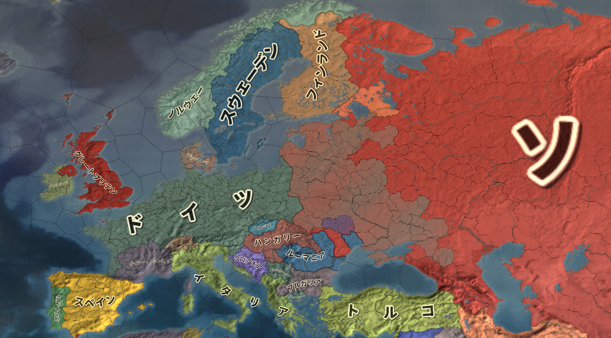  
1942年の戦況。でっかくソ、とあるのがソ連。ドイツ軍がソ連の欧州部をほぼ制圧している（斜線部）。また英国（グレートブリテン）は上陸こそされていないものの、輸出入に使う船をドイツ海軍に悉く沈められ、国民の食料にすら事欠く有様であった。自分ではドイツを倒せない米国は、ソ連を支援してドイツを叩かせ、同時に心肺停止状態の英国を支援して何とか生き延びさせた。  
Paradox Interactive社のEuropa Universalis IV（Extended TimelineMOD及び日本語化MOD使用）より  
  
  
・このような戦略が可能なのは、米ソの仲が非常に良かったからである  
・と言うか、米国がソ連大好きだったからである  
・もっと言えば、当時の米国大統領ルーズベルトが、ソ連の事が大好きだったからである  
・何だったら、対立する英国とソ連の間を仲裁してもいるぐらいである  
  
・そんな関係の中、1945年2月に開かれたのが［ヤルタ会談］  
・戦勝を目前にした英米ソ三ヶ国の首脳が、戦後世界の枠組みをどうするか話し合った会談である  
⇒今の感覚だと「何で英国おるん？　米ソの二ヶ国で話し合ったらええやん」となるが、前も言ったように第二次世界大戦までの米国は、国際政治で大きな影響力を持っていなかった。第二次世界大戦末期のこの時期は、英国の影響力が弱まり、また米国の力が強まり、米国が英国を追い越した頃。だからまだ英国もいる。これが、第二次世界大戦が終わると、英国の存在感はどんどん薄くなっていく  
※一般的に、冷戦とは米ソの対立であり、その冷戦はヤルタ会談から【マルタ会談】まで、と言われる。が、この時点では米ソは友好的だった。但し冷戦とは戦後の話であり、その戦後世界を規定したのがヤルタ会談と考えれば、この時から始まるとは言える。なお、当時の英首相チャーチルは既に、「ソ連はやべーぞ…今は同盟国だけど戦後絶対えらいことになる」という感じ  
  
・そして1945年5月、米国大統領ルーズベルトが死去  
・次の大統領はソ連を警戒しており、以後米ソ関係は急速に悪化する  
  
  
  
## ●冷戦初期／冷戦の始まり  
・1945年8月、枢軸国として最後に残った大日本帝国が降伏。第二次世界大戦が終わる  
・この後の流れは二つある  
１：アメリカ勢力圏（いわゆる西側）とソ連勢力圏（いわゆる東側）の勢力争い  
２：アジア、アフリカ等の旧植民地の独立運動  
  
・まず１について  
・共通の敵がいなくなれば、昨日の味方は今日の敵となる  
・枢軸国という共通の敵がいなくなった米国とソ連は、まさにそういう関係となった  
・まずは、旧枢軸国の奪い合いである  
  
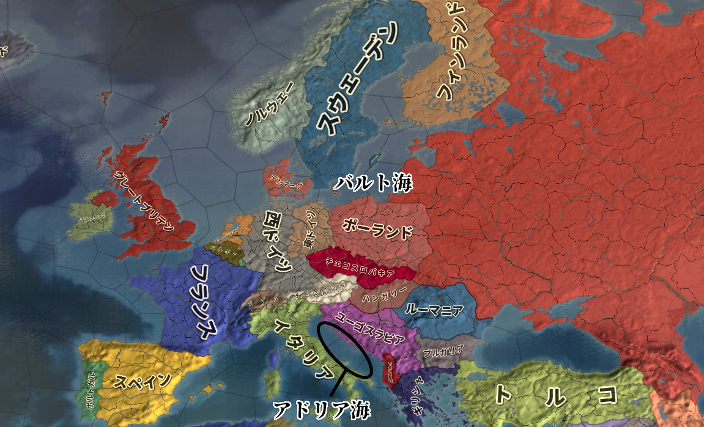  
冷戦初期の欧州図。ノルウェー、デンマーク、西ドイツ、オーストリア、イタリアのラインより西が西側勢力圏（いわゆる西側）。フィンランド、東ドイツ、チェコスロヴァキア、ハンガリー、ユーゴスラビアのラインより東がソ連勢力圏（いわゆる東側）。  
Paradox Interactive社のEuropa Universalis IV（Extended TimelineMOD及び日本語化MOD使用）より  
  
・東西の勢力圏を確定させるべく、米ソはそれぞれ、似たような政策を採った  
  
|                                |          |                                    |  
|--------------------------------|----------|------------------------------------|  
|アメリカ合衆国                  |政策の種類|ソヴィエト社会主義共和国連邦        |  
|【トルーマン・ドクトリン】の実施|政治的政策|【コミンフォルム】の設置            |  
|【マーシャル・プラン】の実施    |経済的政策|【コメコン(経済相互援助会議)】の設置|  
|【北大西洋条約機構(NATO)】の結成|軍事的政策|【ワルシャワ条約機構(WTO)】の結成   |  
  
  
  
・米国がトルーマン・ドクトリンで政治的結束を強めようとすれば、ソ連はコミンフォルムの設置で対抗  
※トルーマンは、当時の米国大統領の名前  
・米国がマーシャル・プランで欧州に金を注入すれば、ソ連もコメコンを設置して対抗  
※マーシャルは、当時の米国国務長官の名前  
・米国がNATOを結成してソ連の侵攻に備えれば、ソ連もWTOを結成して対抗  
・このように、政経軍の三面から同じような政策を採り西側と東側は勢力圏を確定させていった  
  
・こうして、欧州は東西に引き裂かれた  
・この様子を、英国の［チャーチル］は以下のように評した  
「［アドリア海］から［バルト海］に【鉄のカーテン】が降ろされている」  
※無論、欧州以外の国も東西両陣営に分かたれている。例えば日本は西側、中華人民共和国は東側  
  
・続いて２の「アジア、アフリカ等の旧植民地の独立運動」  
  
・第二次世界大戦前、欧州以外の国はほぼ全て植民地だった  
・アフリカは、リベリアとエチオピア以外植民地  
・中東は、トルコ以外のほぼ全域が植民地か半植民地  
・インドは植民地  
・東アジアは、タイと日本以外は植民地か半植民地  
・オセアニアは、オーストラリア以外植民地  
  
・第二次世界大戦後、この植民地がいよいよ「俺達を独立させろ」と激しく動き始める  
・特にアジアは、大日本帝国がアジア植民地の解放と独立を大義名分にしていたのもあって大変な事に  
・例えば現インドネシアや現ベトナムでは、終戦の直後から独立戦争に突入している  
⇒戦争が終わった後、オランダ（インドネシア宗主国）やフランス（ベトナム宗主国）が「よーしまた植民地経営やるぞー」と戻ってきたのに対し、「ふざけるな、俺は独立するぞ」となった。インドネシアの独立戦争は単にインドネシア独立戦争と呼び、ベトナムのものは［インドシナ戦争］と呼ばれる  
※ちなみに、現インドネシアや現ベトナムでは、敗戦後も現地に残った日本人将兵が、独立戦争に参加している。インドネシアの博物館には独立戦争勝利の象徴として竹槍がめっちゃ飾ってあったりも…日本では敗戦と愚劣の象徴とされる竹槍も、勝てば話は変わるのである  
  
  
  
## ●1947-1953／最初の交戦  
・1948年以降、いよいよ米ソの対立は激化する  
・まず1948年、旧ドイツの管理を巡って衝突し、［第一次ベルリン危機］が発生する  
  
  
by TUBS, CC3.0,  
https://commons.wikimedia.org/wiki/File:Germany,_Federal_Republic_of_location_map_January_1957_-_October_1990.svg  
上記を筆者が改変  
  
・実はヤルタ会談にて既に、以下のようなドイツ統治案が出ていた  
１：ドイツは東側と西側で共同管理する  
２：ドイツ首都ベルリンも、東側と西側で共同管理する  
  
・これが結果として、「東ドイツ内にあるベルリンの西側は西ドイツ領」という謎の状況を生んだ  
  
・米ソの対立はベルリンの管理にも及んだ  
・ベルリン全土を東側で管理する事を望んでいたソ連は、西ベルリン封鎖という挙に出た  
⇒西ベルリンは周囲を東ドイツ領に囲まれているが、西側勢力の東ドイツ領通行を禁止した。鉄道も道路も封鎖した。そうなると、西ベルリンには物資が入ってこなくなり、干上がってしまう。食糧は勿論日用品、更には薬品までもが短期間でなくなると予想された  
  
・西側勢力は、連日輸送機を飛ばして物資を空輸した  
・ソ連は戦闘機を飛ばして西側輸送機を威嚇したが、止められなかった  
⇒ソ連も第三次世界大戦はまだ望んでいなかった為、威嚇ぐらいしかできなかった  
  
・こうして第一次ベルリン危機という米ソ最初の衝突は終わった  
・この衝突は、東西両陣営の武力衝突には至らなかった  
⇒但し、ドイツが東西に、正式に分裂するという結果はもたらした  
・そしてベルリン危機の直後、東西両陣営の武力衝突がついに起こる  
・1950年の［朝鮮戦争］である  
  
  
1950年の図。中華人民共和国は既に内戦に勝利し、中華民国は台湾に追い落とされている。そしてこの年、北朝鮮が38度線を越え、韓国領内へ侵攻を開始する。なお、この図だと日本とソ連のナショナルカラーが一緒になってしまっているがそれはご愛敬という事で…  
Paradox Interactive社のEuropa Universalis IV（Extended TimelineMOD及び日本語化MOD使用）より  
  
  
・終戦直後の朝鮮半島は、［38度線］を挟んで北が東側管理下、南が西側管理下にあった  
・この内、東側管理下にあった北側が、朝鮮民主主義人民共和国（北朝鮮）になる  
・また、西側管理下にあった南側が、大韓民国（韓国）になる  
⇒この二国が並立している状態で、1950年を迎える事になる  
  
・また1950年までには、「いわゆる中国」の内戦が終わっていた  
⇒実は、第二次世界大戦前後の「いわゆる中国」は、ちゃんとした国家があった訳ではない。中華民国や中華人民共和国をはじめとする、様々な勢力が割拠する群雄割拠の戦国時代だった。第二次世界大戦終結後、中華民国と中華人民共和国という二大勢力が「いわゆる中国」の座を巡って争い、内戦となった  
・内戦の結果、【毛沢東】率いる中華人民共和国が勝利した  
・蒋介石率いる中華民国は敗北し、台湾に逃げ込んだ  
⇒令和二年まで続く、台湾海峡を挟んで「中国」が並立する状況はここに完成した  
  
・要するに、1950年というのは、以下のような状況であったと言える  
１：東西両陣営（米ソ）の対立が、武力衝突起こしてもおかしくないぐらい激しくなっていた  
２：朝鮮半島では、朝鮮民主主義人民共和国と大韓民国が並立していた  
３：中華人民共和国が、「いわゆる中国」として大陸に君臨するようになっていた  
  
・この状況で、北朝鮮は武力による南北統一を目指すようになる  
・1950年、北朝鮮はソ連と中華人民共和国の許可を得て、韓国へ軍事侵攻を開始する  
⇒緒戦は北朝鮮軍が南北朝鮮を完全統一する勢いだったが、米国を中心とする西側の多国籍軍が韓国の援軍として参戦、押し返した。すると今度は、中華人民共和国が援軍を投入。一進一退の攻防が続いた。またソ連も援軍を派遣しており、朝鮮戦争は米ソの代理戦争の様相を呈した  
  
・結局、1953年に［朝鮮戦争休戦協定］が結ばれ、38度線を国境として南北朝鮮が並立する事になる  
⇒ちなみに、これは講和条約ではなく「休戦」協定。なので国際法上、北朝鮮と韓国は戦争状態のまま。この状態は、実は令和二年現在も続いている  
  
## ●1953-1955／「雪解け」  
・1953年は、東西両陣営の初の武力衝突であるところの朝鮮戦争が終わった年である  
・一方で、ソ連の独裁者スターリンが死んだ年でもある  
⇒ざっくり言うと、この人は第二次世界大戦や戦後米ソ対立の原因のひとつ。相当ヤバい人で、ヒトラーなんか目じゃないと言ってもいいぐらい。何せヒトラーは（ユダヤ人除けば）自国民には優しいが、スターリンは自国民にも積極的に厳しい。ウクライナで飢饉引き起こして一千万人（諸説あり）死なせたり、軍隊がガタガタになるまで自国軍人を殺しまくったりしている。そんな人の率いるソ連が、共産主義国家の常として世界征服まで企んでいる訳だから、これは大変な事である  
  
・朝鮮戦争の休戦とスターリンの死を機に、東西両陣営に雪解けムードが生まれた  
⇒スターリンの後を継いで書記長となった【フルシチョフ】は、積極的に［スターリン批判］を展開した。これは、「これからのソ連は、今までのあのやべー奴に率いられていたソ連とは違いますよ」というアピールになった  
  
・また、翌1954年には［インドシナ戦争］が［ジュネーヴ休戦協定］によって一旦落ち着く  
※インドシナ戦争は、ベトナム独立戦争にあたる戦争  
・そしてこの頃までには、戦後に独立した旧植民地国家、その第一陣が出揃っていた  
⇒インドも独立していたし、インドネシア独立戦争も終わっていた  
  
・旧植民地国家は、どの国も多かれ少なかれ「白人の手先になって戦うのはもう嫌だ」と考えていた  
・日本国もまた、［第五福竜丸事件］で核武装に反発するなど、独自の動きを見せる部分があった  
⇒［ビキニ環礁］に於ける水爆実験によって飛散した放射性物質により、日本の民間漁船第五福竜丸が被爆した事件。唯一の被爆国という意識もあり、翌年には広島で［原水爆禁止世界大会］を開いている  
・東側陣営の中華人民共和国ですら、独自の動きを見せ始めていた  
⇒中華人民共和国の独裁者毛沢東はスターリン支持者であり、スターリンがいなくなった…どころかスターリンを批判するソ連には、盟主としての魅力を感じなくなりつつあった  
  
・こうして、アジア・アフリカの旧植民地国家が中心となって、独自の動きを見せ始めた  
⇒いわゆる【第三世界】の誕生。米国を盟主とする西側陣営を第一世界、ソ連を盟主とする東側陣営を第二世界とし、その両者に属さず独自に動こうとする勢力をこのように呼んだ  
  
・その第一弾が［平和五原則］  
・中華人民共和国の［周恩来］首相と、インドの［ネルー］首相の会談の末発表されたもの  
・中印の連帯を示す文書と言えた  
  
・そして第二弾が［バンドン会議］。［アジア・アフリカ会議］、［Ａ・Ａ会議］などとも言われる  
・主に旧植民地のアジア・アフリカの各国が集結し行われた。ここで発表されたものが［平和十原則］  
⇒我々は第一世界（西側）にも第二世界（東側）にも属さない、お前達の争いには加担しない。我々は中立だ、我々は第三世界だ、お前達白人に搾取されるのはもううんざりだ、という意思を明確にした  
  
  
・朝鮮戦争の休戦、スターリンの死、更には第三世界の連帯は、東西両陣営に対話の空気を作った  
・こうして、【ジュネーヴ四巨頭会談】が実現した  
⇒【四大国首脳会談】とも。米国の［アイゼンハワー］大統領、ソ連の［フルシチョフ］第一書記、イギリスの［イーデン］首相、フランスの［フォール］首相がジュネーヴに集まり、対話による平和共存の精神を確認した  
## ●1956-1960／落日  
・「雪解け」は、決して幻ではなかった。1956年には【コミンフォルム】が解体されてもいる  
・だが、第三世界の連帯も、東西両陣営の和解ムードも、本当に一瞬だけの出来事に過ぎなかった  
  
・平和五原則による第三世界の連帯、その中核を作った中印自体、領土問題を抱えていた  
⇒バンドン会議からほどなくして、中華人民共和国が征服したチベットで反乱が起きる。これを巡って中印は国境紛争を起こし、令和二年現在に至るまで、中印の仲は非常に悪い。と言うか、敵国同士の関係である  
・中印以外も、連帯を示せるようなまとまりを失っていった  
  
・また、東西両陣営の「雪解け」ムードも、［ハンガリー動乱］で消し飛んだ  
  
・欧州の西側陣営は、元から民主主義兼資本主義国家だった国が多い  
・一方、欧州の東側陣営は、元から全体主義兼社会主義or共産主義国家だったという国は少ない  
⇒基本的には、ソ連が征服した国を傀儡国・衛星国として共産主義国家にしていっている  
・ハンガリー人民共和国もまた、ソ連に征服されて共産主義国家にされた国  
・なので当然、上層部はともかく国民は共産主義やソ連を嫌っている  
⇒「雪解け」ムードを受けて、ハンガリーで反ソ蜂起が起きる。ソ連が軍隊を出してこれを弾圧する。これが、ハンガリー動乱である  
  
・ハンガリー動乱では、ハンガリー人が一万人以上死に、二十万人以上が難民となった  
・これを見た西側陣営は「やっぱソ連やべーわ」と態度を硬化させる  
  
・こうして、第三世界の連帯も、米ソ和解ムードも消し飛んだ  
・「雪解け」は終わり、東西両陣営は核戦力を含めた軍備拡張競争を再開するのだった  
⇒人類を月に送ったアポロ計画を含め、冷戦期の宇宙開発はこの軍備拡張競争の副産物である。核爆弾を運ぶミサイルの技術と宇宙ロケットの技術は、全く同じ技術なのだ。運ぶものと運ぶ先が違うだけである。宇宙開発競争は、対立する米ソが、砲火を交える事なく自らの核戦力の優位を相手に見せつける行為であった  
  
  
・また「雪解け」が終わったこの時期、もう一つの時代が終わろうとしていた  
・いよいよ英仏の国際影響力が地に墜ちたのである。きっかけはスエズ危機だった  
  
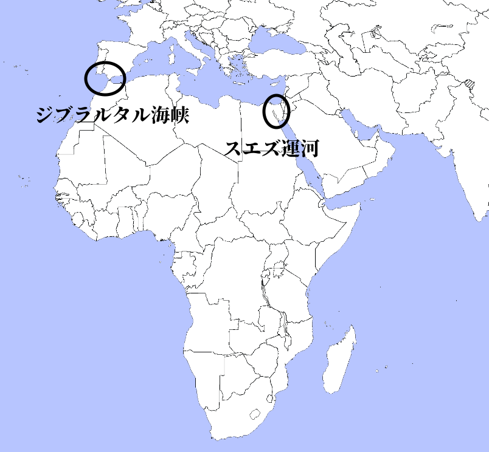  
スエズ運河の図。かつて、欧州から東方（インド等）へ船で向かうには、アフリカ大陸をぐるっと回って行くしかなかった。これは不便だという事で、1869年になってスエズ運河が開通した。これによって、ジブラルタル海峡を抜けて地中海に入り、スエズ運河を抜けて東方へ向かう事ができるようになった。  
CC3.0, https://commons.wikimedia.org/wiki/File:World_map_blank_black_lines_4500px_monochrome.png  
上記を筆者が改変  
  
・スエズ運河は、1869年のエジプトで開通した  
⇒この頃のエジプトは、オスマン帝国の支配下から英仏の植民地への移行期にあたる。スエズ運河の権利も、植民地化の進行の中で英仏へ売却され、英仏の資金によって完成した  
・このスエズ運河は、エジプト独立後もエジプトのものではなかった  
⇒スエズ運河会社が管理し、通行料等の利益は英仏の株主に配分していた  
・これを不満としたエジプトが、1956年、スエズ運河の国有化を宣言する  
  
・この国有化を、英仏は最初から認める気はなかった  
⇒英仏はまだ、現実を認識していなかった。自分達はまだ、「世界中に植民地を持ち、国際政治を動かす超大国」のままであるという、大戦以前の幻想を見ていた。故に、独立したとは言え旧植民地のエジプトを尊重するつもりはなく、軍事行動によってエジプトを「懲罰」しスエズ運河国有化を破棄させるつもりだった  
  
・ただ、英仏は自分達が表立って軍を動かすつもりはなかった  
⇒幻想を見ているとは言っても、流石にかつては国際政治を動かす主役だった国である。アフリカの旧植民地のやる事が気に入らないからと言って軍隊を投入するのは「マズイ」、という時代が来ている事には気付いていた  
・そこで白羽の矢が立ったのがイスラエルである  
  
・イスラエルは、ユダヤ人が戦後作った中東の国である  
・そしてユダヤ人は、歴史的にキリスト教徒及びイスラム教徒から嫌われてきた人々である  
⇒よくドイツに於けるユダヤ人差別・虐殺が言われるが、ドイツ人が特別、ユダヤ人が嫌いという訳ではない。欧州のキリスト教徒は皆ユダヤ人が嫌いであり、ユダヤ人を弾圧し、殺してきた歴史がある。現代の欧米キリスト教徒はユダヤ人に同情的だが、これはむしろ、歴史的には例外である。イスラム教徒もまた、特に近代以降、ユダヤ人を嫌い、弾圧してきた歴史がある  
  
・そして、ユダヤ人はイスラム教徒ばかりの中東にイスラエルを作った  
・故に、イスラエルは建国当初から全方位が敵なのである。当然、エジプトも敵だった  
⇒イスラエルは各国で迫害されるユダヤ人が最後に行き着く地という側面もあり「イスラエルが失われたら、我々にはもう行き場はない」という認識がある。故に、「我々は生き残る為ならどんな事でもする」という強い決意に溢れた国である  
  
・そんなイスラエルに英仏は武器を提供し、エジプト攻撃を示唆した  
・これに乗ったイスラエルがエジプトを攻撃。第二次中東戦争が始まる  
⇒英仏軍もこれを支援し、エジプト軍への攻撃に加わった  
・西側陣営に属する英仏のこの行動を、東側陣営のソ連は非難した  
・どころか、同じ西側陣営である筈の米国までもが、英仏を非難した  
⇒米国は、即時の攻撃中止と全面撤退を勧告している  
  
・実は、第二次中東戦争とハンガリー動乱は同時期に起こっている  
・もし第二次中東戦争がなければ、米国は、ソ連非難一色の国際世論を作れた  
⇒何せ、他国に軍隊を派遣し、市民を殺して回り、難民を大量に出させたのはソ連である  
・ところが、英仏が第二次中東戦争という植民地主義・帝国主義丸出しの戦争を起こしてしまった  
・お陰で、第三世界によるソ連批判は鳴りを潜め、むしろ西側批判が大きくなった  
⇒何せ西側陣営諸国は、かつて植民地を抱えていた国が多い。と言うか英仏を筆頭に、この時点でも植民地を抱えている、という国も多い。しかも第三世界は基本的に、旧植民地が独立した国によって形成されている。故に元々の好き嫌いで言えば西側が嫌い、という国が多い  
  
・で、米国が当然のように激怒した訳である  
  
  
・結局、英仏は米国の勧告を受け入れ、軍を撤収した  
⇒結果的にだが、米国はこう言ったのである。「お前ら夢見てんじゃねぇ。西側のリーダーは俺。お前らは、俺の子分。国際政治の主役でもないし、世界を動かす列強国でもない。昔はどうだったか知らんが、今は俺の子分でしかないの」と  
  
・こうして、かつて世界を動かした大国の国際影響力は、完全に失墜した  
・英仏はまだまだ大量に植民地を抱えていたが、その植民地の独立欲求も、抑えられなくなっていった  
・こうして、［1960年］には、17もの国が独立した  
⇒いわゆる［アフリカの年］。独立した国が皆アフリカ国家だった為こう言われる。また国連加盟国も、この年17ヶ国増えた。この年から、国連加盟国のアフリカの比率が一気に増える  
  
・かつて太陽の沈まぬ国と言われた大英帝国の、落日であった  
  
## ●1959-1962／世界最後の日  
・1953年から1955年にかけて起こった「雪解け」は、1956年のハンガリー動乱以降ご破算となった  
・以降、米ソ両国は外交で激しく争い、軍備増強に力を入れていく  
  
・1959年に東側陣営が収めた大成功が、キューバ革命である  
  
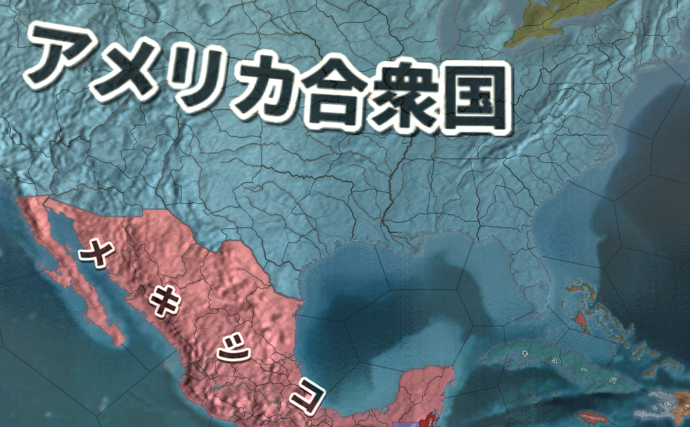  
カリブ海に浮かぶ島国、キューバ共和国。ここはかつて米国の植民地だったが、キューバ革命によって共産主義国家となり、東側陣営に与する事となった。これは、東側陣営の大成果であった  
Paradox Interactive社のEuropa Universalis IV（Extended TimelineMOD及び日本語化MOD使用）より  
  
・キューバは、元はと言えばスペイン王国の植民地だった  
・キューバの独立戦争に、米国が介入。1902年、キューバは米国の保護国となった  
⇒要は、主人がスペイン王国から米国に変わっただけである  
・植民地状態からの脱却を目指したキューバ人は、1959年、革命を起こして独立を果たす  
・そして、東側陣営に参加した  
⇒独立したキューバは、米国から完全に敵視されていた。実際、キューバ共和国がまだ「米国とは友好的にやっていきたい」と言っていた頃から、米国はキューバへの軍事侵攻を考えていた。西側陣営の頭目に敵視された以上、東側入りは当然と言えば当然の選択であった  
  
・キューバの革命と東側陣営参加は、東側陣営にとって大きな勝利であり、西側陣営にとって大打撃だった  
・と言うのは、当時核戦力に於いて、ソ連は劣勢に立たされていたのである  
  
・当時、ＩＣＢＭ（大陸間弾道弾）は開発されたばかりであった  
・当時の核ミサイルの主力は、ＩＲＢＭ（中距離弾道弾）であった  
⇒北米からモスクワだとまず届かないが、トルコからモスクワなら問題なく届くようなミサイル  
  
・つまり、第三次世界大戦となった場合、西側陣営からソ連首都モスクワを核で攻撃するのは容易  
⇒トルコとかからＩＲＢＭ撃てば届く  
・一方で、東側陣営から米国首都ワシントンを核で攻撃するのは困難  
⇒ＩＲＢＭでは、ソ連最東端から撃ってもアメリカ本土の主要地域には届かない  
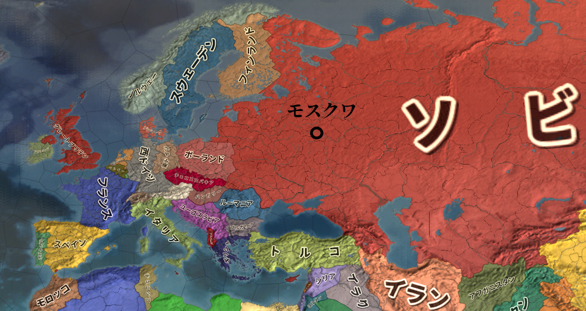  
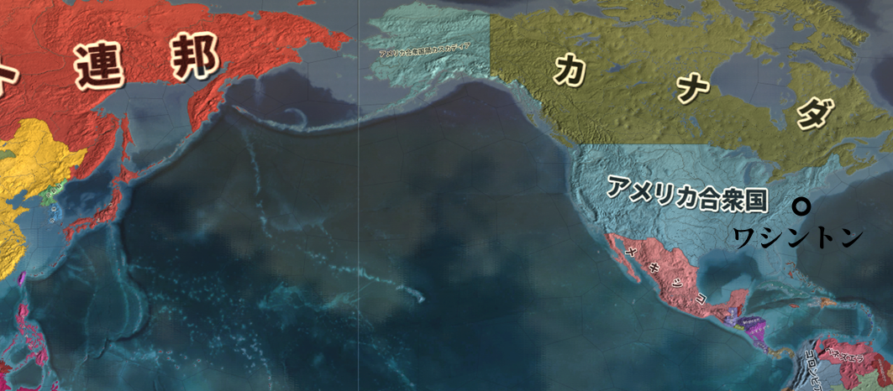  
1960年頃の図。モスクワは割と西側陣営から近いが、ワシントンはとにかく遠い。西海岸でもだいぶ遠い。  
Paradox Interactive社のEuropa Universalis IV（Extended TimelineMOD及び日本語化MOD使用）より  
  
・この状況が、米国東海岸の目と鼻の先にあるキューバでの革命で、一気にひっくり返った  
・キューバに核ミサイル基地を配備すれば、いつでもどこでも米国本土の主要地域を撃ち放題である  
⇒実際に核戦争はしないにしても、「こっちは敵国首都を核で壊滅させられないが、向こうはこっちの首都を核で狙える」というのは、政治的駆け引きの上で著しく不利である。「こっちも敵国首都を核で狙えるし、向こうもこっちの首都を核で狙える」なら対等だが  
  
・無論、長距離爆撃機や戦略潜水艦等、他にも核を使う手段はある  
・それでもやはり、地理的な問題から、ソ連は核戦力に於いて不利な立場にあったのである  
  
・キューバ革命当時、米ソの対立は深刻化していた  
・1961年には第二次ベルリン危機が発生し、【ベルリンの壁】が建設されてもいる  
⇒西ベルリンは、東側から西側へ亡命する際の有力な選択肢であった。この時期、東側の厳しい全体主義的監視社会から逃れようと、西側に亡命する知識人は多かった。これに業を煮やした東側は、東西ベルリンの境界に壁を築いた  
  
・この状況下、ソ連はついに、賭けに出た  
・キューバへ秘密裏に核ミサイルを輸送。核ミサイル基地を建設しようとしたのである  
・が、流石に米国の目と鼻の先での話である。当然バレた  
⇒人員だけでも五万人を送る計画であった。必然的に何十隻もの輸送船が往復する事になり、そらまぁバレますわなという  
  
・もし、バレた時には核ミサイル基地が完成していた、というのであれば話は別である  
・もしくは、ソ連はキューバと軍事協力しますと公式に声明を出していればやはり、話は別である  
・だが、ソ連は秘密裏にキューバへ基地を作ろうとし、途中でこれが露見した  
・故に、米国は強硬だった。戦争も辞さない覚悟で基地建設中断を要求した  
  
・ソ連はそもそも、核戦力で劣勢だった訳である  
・核戦力逆転の一手が、キューバに於けるミサイル基地建設であった  
・逆転の一手が未完成な状態では、核戦争を覚悟で米国の要求を撥ねつけるのは不可能だった  
・こうして、ソ連は譲歩。ミサイル基地建設を中止し、全面核戦争は回避された  
  
・［1962年］のこの一連の事件が、いわゆる【キューバ危機】である  
  
・キューバ危機の時の米国大統領が【ケネディ】、ソ連書記長が【フルシチョフ】である  
・敵対する両者はしかし、「核戦争をしない」という一点に、共通の利益を見出した  
⇒両者は大統領執務室と書記長執務室に直通電話（ホットライン）を設置するなど、［平和共存］を謳い、核戦争防止に向けて動いていく事になる  
  
## ●1962-1968／覇権国の憂鬱  
・キューバ危機は、良くも悪くも一つの画期であった  
・冷戦という時代は、キューバ危機の前と後で大きく変わった  
・その要点をまとめると以下の三点になる  
  
１：核戦争防止の為、米ソ間で積極的に対話を試みるようになる  
２：米ソの核戦力拡張競争と、核の管理強化が同時に行われる  
３：東西両陣営の構成国が、盟主に不審を抱く。東西両陣営の内部分裂が始まり、冷戦が多極化する  
  
  
〇１：核戦争防止の為、米ソ間で積極的に対話を試みるようになる  
・既に見たように、キューバ危機を通して米ソ首脳は共通の利益を見出した  
・即ち、「核戦争をしない」という共通利益である  
・これを追求する為、米ソ首脳間にホットラインが設置されてもいる  
・但しこれは、「米ソ和解の契機」「米ソがこれを機会に対話による平和を目指した」という話ではない  
⇒米ソ両国は、互いに対立し、いつ戦争になってもおかしくない状況を作り出す事で、東西両陣営の頭目という覇権国の地位を確保している。故に、米ソの対立構造は維持すべきだし、互いが互いに優越する為軍備拡張競争も行うべきである。一方、だからと言って、実際に全面核戦争を行ったら人類そのものが滅びかねないし、覇権国の地位も糞もなくなってしまう  
  
・キューバ危機によって、米ソ両国は「核戦争するぞするぞ詐欺」状態が一番だと気付いたのである  
※教科書や参考書によっては、キューバ危機の教訓によって両国の和解が始まったとしているが、国際政治はそう単純ではない  
  
・これが為に、以後、米ソ両国は以下のように、一見矛盾した行動をとる  
Ａ：互いに平和共存を謳い、対話のチャンネルをしっかり確保しながら  
Ｂ：一方で対立をやめるつもりはなく、核戦力を含む軍備拡張競争は継続する  
⇒一見矛盾したこの行動は、「米ソ両国が覇権国の地位を維持する」為の「核戦争するぞするぞ詐欺」だと考えるとしっくりくるだろう  
  
〇２：米ソの核戦力拡張競争と、核の管理強化が同時に行われる  
・「核戦争するぞするぞ」詐欺によって米ソが覇権国でいる為にはいくつか、条件がある  
・そのひとつが、「米ソが圧倒的な核戦力を持つ」事である  
⇒もっと言えば、「米ソが核戦力を独占する」事が望ましい  
※米ソだけが人類を何度でも滅ぼせるほどの核を持っているからこそ、「核戦争するぞするぞ詐欺」の世界に於いて、米ソは各陣営の長として振る舞える。これが、日本国やフランス共和国や中華人民共和国やハンガリー人民共和国といった様々な国々も大量の核兵器を装備したとなると、そういう訳にはいかない。「あ、うち自前の核いっぱいあるんで。中立でいますね」とか言われかねない  
  
・米ソ両国は、この点で利害が一致した  
・キューバ危機以来整備された対話チャンネルも生かして、「米ソだけが核を持てる世界」を目指した  
  
・その第一弾が、1963年の【部分的核実験禁止条約(PTBT)】である  
・部分的に核実験を禁止する訳だが、具体的な話は正式名称を見ると分かりやすい  
・即ち、「大気圏内、宇宙空間及び水中における核兵器実験を禁止する条約」  
⇒地下核実験ならセーフ  
  
・核開発で世界をリードする米ソは地下核実験の技術を既に開発済みであり、問題なかった  
・一方、当時核装備を目指していたフランス共和国や中華人民共和国にはこの技術はなかった  
⇒いわば、米ソ両国が核兵器を独占する為の条約である  
  
・第二弾は、1968年の【核拡散防止条約(NPT)】である  
・これはもっと露骨で、参加国を「核保有が許された国」と「核保有が許されない国」に分ける条約である  
・「核保有が許されない国」は、国連の【国際原子力機関(IAEA)】による［核査察］を受け入れる義務を負う  
⇒要するに、「核保有が許されない国」は立ち入り検査を受け入れる義務を負うという事。流石に露骨すぎやしないかと思われそうな反面、査察するのを国連機関にしているだけオブラートに包んでいるとも言える  
  
・尚、蛇足ではあるが、実は英国も核兵器を保有している  
・米国の核開発自体、元から英米共同開発だったのもあり、1950年代には核兵器を装備している  
⇒ただ、英国は終戦以降すっかり影が薄くなり、更にスエズ危機以降は対米追従を強めた為、特に問題にはならなかった。NPTにも、核保有国として明記されている  
  
  
〇３：東西両陣営の構成国が、盟主に不審を抱く。東西両陣営の内部分裂が始まり、冷戦が多極化する  
・こんな事ばかりしていれば、東西両陣営構成国から不満の声が上がるのは当然である  
・実際、核武装を目指していた中華人民共和国とフランス共和国は、PTBTに参加しなかった  
・またNPTについても、仏中両国が参加したのは1992年の話である  
  
・特にソ連率いる東側陣営は、問題が頻発した  
・ただでさえハンガリー動乱やプラハの春の武力弾圧は、東側構成国の激しい反発を受けていた  
⇒この際、ソ連は［制限主権］論を唱えた。東側諸国の主権は制限されているもので、よってソ連が武力で内政に介入しても内政干渉にはあたらないし主権侵害にもあたらないという理屈。そら反発されますわ  
・その上キューバ危機では自分から仕掛けた癖に結局、米国へ譲歩し、弱腰を非難された  
・そこに来て1960年代の露骨な核兵器政策である。内部分裂が起きて当然であった  
・中華人民共和国は核開発を続行し、ソ連とは国交断絶に近い状態になる  
⇒2018年頃にロシア連邦共和国と中華人民共和国の間に妥協が成立するまで、両国は敵国同士となる  
・ルーマニア社会主義共和国や朝鮮民主主義人民共和国も、ソ連から離反する動きを見せていく  
・日本共産党がソ連共産党と決別したのもこの時期である  
  
・一方、米国率いる西側陣営も、ただでは済まなかった  
・特にフランス共和国が、西側陣営から積極的に離れて独自路線を歩んだ  
⇒この時期のフランス共和国大統領はシャルル・ド・ゴール。彼は、フランス人に夢を見せた男である。フランスはもう世界の中心ではない、最早列強ですらないという現実に対し、「いや、フランスはまだ世界の中心なんだ」という夢を見せた。それ故、米ソの核独占政策にも反発したし、米国に追従しない独自路線を演出した  
・こうして、1966年には、フランス共和国は［NATO］から離脱する  
⇒直接の契機は、米国がベトナムの戦争に本格的に介入を始めた事への反発。尚、正確に言えばフランス共和国が離脱したのはNATOの軍事部門であり、政治部門には残っている。「政治的には同盟、軍事的には独立」とする事で、フランス共和国の独自性を演出したのである。結局、2009年に復帰している  
  
## ●1960年代末-1979／デタント  
・1960年代の末には、米ソ両国の勢いが、かつてほどではなくなっていく  
  
・米国の場合、ベトナム戦争の泥沼化が原因  
・ベトナムは、基本的には元々仏領インドシナと呼ばれる地域だった  
・第二次大戦後、ベトナムは独立戦争（インドシナ戦争）を起こし、南北ベトナム並立体制になった  
・なぜ「ベトナム」という一つの国として独立しなかったかと言えば、米国が介入したから  
⇒インドシナ戦争に敗れたフランス共和国はベトナムから手を引いた。しかし米国が代わりに介入してきた。と言うのは、ベトナム独立を指導していたのが共産主義者だったのである。西側陣営の旗手たる米国としては、ベトナム独立によってベトナム全土が東側構成国になってしまうのを危惧せざるを得なかった  
・こうして、共産主義の北ベトナムと、資本主義の南ベトナム並立体制となった  
  
・この南北ベトナムは、恒常的に抗争関係にあった  
・1960年代から、米国は南北ベトナムの争いに本格的に介入していく  
・いわゆるベトナム戦争だが、この戦争に米軍は大苦戦する  
⇒理由はいくつかあるが、基本的には「非効率な戦争遂行」「本腰を入れなかった」というこの二つが原因。前者は、例えば航空部隊が敵基地の爆撃任務を受けたとする。そして敵基地は思ったより柔らかく、爆弾がたっぷり残ったまま帰る途中、敵の補給部隊を発見したとする。こういう時、普通の軍隊ならついでに敵補給部隊に爆弾を落とすが、ベトナム戦争時はそういう攻撃を禁じられる場合が多かった。そらそんなやり方してたら苦戦しますわなという話。後者は、北ベトナムは米国が本腰を入れて叩くには弱すぎたのが原因。本腰を入れるとはつまり、若い男は皆軍隊へ招集し、民間工場も軍需物資を生産し、というような本気の戦争。そういう事をするには、北ベトナムはあまりに弱すぎた。かと言って片手間に倒すにはかなり強かっただが、片手間にダラダラと、しかも非効率な戦争を続けた結果、苦戦する事になってしまった  
  
・1960年代末になると、流石に長引いたベトナム戦争の戦費がかさんでくる  
・また、一向に終わらない戦争に厭戦気運が蔓延し、反戦運動も盛んになってくる  
・しかも、ベトナム撤退を公約にした共和党のニクソンが1969年、大統領になる  
⇒こうした経緯から、米国はベトナム戦争から手を引こうとし始める  
  
・ただ、手を引くにしても、単純に「負けて逃げた」というのでは西側頭目の面子が立たない  
・「名誉ある撤退」的な感じにしないとまずい  
⇒となると、ソ連との交渉、関係改善が必要になってくる  
※北ベトナムは共産主義国家、つまり東側陣営。なので北ベトナムそのものとの交渉や関係改善よりも、その頭目との交渉や関係改善の方がよっぽど大事  
  
  
・一方ソ連は、極めて危機的な状況に陥っていた  
・冷戦開始以来、東側陣営は揃って農業政策が大失敗していた  
・そして1960年代になるといよいよ、食糧が足りなくなり始めた  
⇒ソ連は1962年から農作物を輸入し始めており、1960年代を通して輸入量は増加している。特に1970年代初頭は、顕著に食糧が足りなくなり、輸入量も激増した。じゃあどこから輸入していたのかと言えば、何と北米をはじめとする西側国家から輸入していた  
・食糧を自給できない国が、食糧の輸入元（というか依存先）と仲が悪いのは、極めてまずい  
  
・また、ソ連と中華人民共和国の関係は悪化の一途を辿り、1969年には軍事衝突まで起こしていた  
・東側経済の悪化もあり、東欧の共産主義国家への統制も緩み始めていた  
⇒例えば1968年には、ハンガリー動乱によく似た事件、［プラハの春］も起こっている。チェコスロヴァキア社会主義共和国に於ける、自由化を志向した改革をソ連が軍隊で弾圧した事件である。ソ連の力が弱まり、東側陣営の国家の手綱を握りきれなくなってきている証拠と言える事件だった  
・こうして、米国と対立してばかりもいられなくなってきた  
  
・結果として米ソは、互いが互いとの関係を改善したいと思うようになった  
・こうして発生したのが【デタント（緊張緩和）】である  
・この時期、米ソは融和姿勢をとるようになった  
・冷戦が終わりこそしなかったものの、東西の対立は和らぎ、かなり友好的な関係が生まれた  
  
・デタントの東西宥和を象徴するのが、核兵器の軍縮条約である  
・デタント初期の1972年には早速、［第一次戦略兵器制限条約(SALT I)］が結ばれている  
⇒核弾頭（核爆弾）を運ぶ手段（つまり核ミサイル）の保有数の上限を決めた条約。核弾頭や核ミサイルの数を減らす条約ではない  
・デタント末期の1979年には、【第二次戦略兵器制限条約(SALT II)】が調印された  
・しかし奇しくも、この1979年が、デタントの終わりの年となった  
  
・1979年の年末、ソ連はアフガニスタンへの侵攻を開始した  
⇒ざっくり言うと、アフガニスタンは元々、「ソ連派」「反ソ連派（イスラム原理主義者も含む）」が対立している地域だった。1978年、ソ連派のクーデターが起きてソ連派が政権を掌握するが、これに反対する勢力が蜂起して内乱状態になる。この内乱が泥沼化した1979年末、イスラム原理主義を警戒していたソ連は、軍事侵攻を開始した。アフガニスタンを東側に完全に取り込む事、またイスラム原理主義を挫く事が目的であった。この時、ハンガリー動乱等と同様、ソ連は［制限主権］論を唱えている  
  
・ソ連のアフガニスタン侵攻が始まると、西側世論は一斉に反発  
・また、中東のイスラム諸国も反発する国は多かった  
・こうして、米ソの対立は再び深刻化  
・調印されたSALT IIも、米国議会で批准が拒否され、流産となった  
・ここに、デタントは終わったのである  
  
## ●1980-1991／ティタノマキア  
・ソ連によるアフガン侵攻後、再び米ソは対立を深刻化させた  
・デタントという宥和の時代の後だった為、アフガン侵攻後の冷戦を［新冷戦］と呼ぶ事もある  
  
・新冷戦は、ソ連にとって誤算続きであった  
・まず、短期間で終えるつもりだったアフガンでの戦争が泥沼化した  
⇒アフガニスタンには、イスラム各国から義勇軍として、イスラム教徒が集まった。彼らはイスラム聖戦士（ムジャヒディン）と呼ばれ、米国はCIAを通じて彼らを支援した。志願兵の中には、後に米国中枢を直撃するテロを起こす、【ウサマ・ビンラディン】の姿もあった  
・アフガンでの戦争の泥沼化は、ただでさえ傾いていたソ連経済に大打撃を与えた  
  
・一方米国では、新冷戦に応じた大統領［レーガン］が、［戦略防衛構想(SDI)］を発表した  
⇒従来、核戦争の抑止は相互確証破壊(MAD)に拠っていた。要するに、「互いが互いを確実に滅亡させるだけの核戦力を装備していれば、戦争してもどっちも滅ぶだけだから、核戦争にならない」というもの。レーガンはそこから抜け出て「核戦争になっても、敵の核攻撃を阻止できるようにしよう」と言い出した  
※尚、宇宙空間に配備した人工衛星のレーザーで核ミサイルを撃墜する計画だと思いっきり誤解された。その為［スターウォーズ計画］とか言われる  
  
・このSDI、結局実現はできなかったし滅茶苦茶カネもかかったが、思わぬ利点があった  
・新冷戦で対立していたソ連もまた、SDIに対抗しようとしたのである  
・当然、ソ連も物凄いカネを消費した  
・ただでさえ経済が傾いており、アフガンでの戦争でも打撃を受けていたソ連が、カネを浪費した  
・結果として、ソ連経済は破綻した  
  
・1985年、［ゴルバチョフ］が新たな書記長になる  
・彼が書記長になった頃には、ソ連経済は完全に破綻していた  
・ゴルバチョフは、「冷戦なんかしてる場合じゃねぇ」とソ連の立て直しに奔走する事になる  
  
・【ペレストロイカ】：経済改革。市場原理の導入を試み、経済の自由化を目指した  
・［グラスノスチ］：政治改革。ソ連の全体主義・秘密主義を反省し、民主主義路線を目指した  
・［新思考外交］：外交改革。米ソ（資本主義と共産主義）は対立しなければならないという前提を捨てた  
⇒実際に、制限主権論の撤廃、アフガンからの撤退、米ソ対立の解消等が行われた  
  
・そして1989年には、【マルタ会談】に臨む  
・会談相手はアメリカ合衆国大統領【ジョージ・Ｈ・Ｗ・ブッシュ】  
※911テロやイラク戦争の時の大統領はジョージ・W・ブッシュ。この二人、実は親子である。なので、ジョージ・Ｈ・Ｗ・ブッシュは“パパ”ブッシュとよく呼ばれる  
・この会談で、［冷戦終結宣言］が出された  
・ここに、戦後から半世紀近くにわたった冷戦は、終わったのである  
  
・こうして冷戦は終わった  
・終わったが、東側陣営、特にソ連の状況は急速に悪化していく  
⇒ぶっちゃけてしまうと、ゴルバチョフ就任の時点で既にソ連は、「本当はガタガタだけど冷戦の手前見栄を張ってた」という状況であった。そこで彼はペレストロイカを行い、また冷戦終結宣言を出したのだが、これは結局、「実を言うとソ連はもうだめです。突然こんなこと言ってごめんね。でも本当です」という宣言にしかなからなかった。結局、ゴルバチョフの行動は全て、東側陣営の崩壊、そしてソ連崩壊へ繋がっていってしまうのである  
  
・手始めに、冷戦終結宣言と同年の1989年、［ベルリンの壁］が崩壊する  
・翌年には、［東西ドイツ］が統一される  
⇒西ドイツ（ドイツ連邦共和国）が東ドイツ（ドイツ民主共和国）を吸収、併合  
  
・また、1991年にはコメコン、ワルシャワ条約機構も解体  
⇒コミンフォルムは、「雪解け」期の最末期、1956年に解体されている  
・そして同年末、ついにソ連は完全に崩壊した  
⇒現代に続くロシア連邦もこの時成立している。また、かつてロシアやソ連に征服された国々がかなりの数、独立した。［バルト三国］（リトアニア、ラトビア、エストニア）や、ウクライナもこの時独立している  
  
・こうして、冷戦という時代だけでなく、時代を築いた巨人もまた、滅んだのである  
  
・ソ連が倒れるのに従って、東欧の旧東側国家でも次々と共産主義政権が倒れた  
⇒東欧の東側国家というのは基本、自分達が共産主義をやりたいから共産主義国家になった国ではない。ソ連に征服されて、ソ連の傀儡国・衛星国として無理矢理共産主義国家にされた国々。当然、上層部はともかく国民は共産主義やソ連を嫌っており、冷戦終結と共に次々と共産主義政権が倒れた  
例１：ドイツ民主共和国（東ドイツ）⇒ドイツ連邦共和国へ吸収  
例２：ポーランド人民共和国⇒ポーランド共和国  
例３：ルーマニア社会主義共和国⇒ルーマニア  
例４： チェコスロヴァキア社会主義共和国⇒チェコ及びスロヴァキア連邦共和国  
※1993年にはチェコ共和国とスロヴァキア共和国へ分離。チェコ人とスロヴァキア人は、分離後の方が仲がいいという、結婚してた頃は仲悪かったけど離婚したら友人として仲がいいみたいな関係にある  
  
・東欧の旧東側国家、及びソ連から独立した東欧の国々は、ロシア人による支配の記憶が今でも強烈である  
・その為、「ロシアは絶対に殺す」「今度何かあったら絶滅するまで戦う」みたいな決意に溢れている  
例１：クリミア危機は要するに、ロシア連邦共和国とウクライナの戦争だが、ウクライナ軍の部隊にはハーケンクロイツを掲げた部隊すらいる。言うまでもなくハーケンクロイツは、ナチス・ドイツ、ドイツ第三帝国の象徴である。第二次世界大戦に於いても、当時ソ連支配下にあったウクライナ地域はドイツ軍に占領され、酷い目に遭っている。それでも、「かつてロシア人をボコボコにした国の象徴」としてハーケンクロイツを掲げ、ロシア軍と戦う部隊がいる。それぐらい、ウクライナ人はロシア人が嫌いということ  
例２：エストニア共和国の選挙には、電子投票制度がある。これは何故かと言えば、「またロシア人に征服され、エストニア人が世界中に亡命して散ったとしても、正統で合法なエストニア政府を維持できるように」という事であるとされている  
⇒東欧の旧ソ連支配下もしくは旧東側国家で今でも親露なのは、ベラルーシ共和国ぐらい。それも怪しくなってはいるが  
## 現代国際政治史―Modern Warfare  
  
・冷戦終結で、何もかもが変わった訳ではない  
⇒ドイツ連邦共和国（旧西側）の仮想敵国は変わらずロシア連邦共和国（旧東側）だし、日本国（旧西側）の仮想敵国もロシア連邦共和国及び中華人民共和国（旧東側）のままである。冷戦が終わって国際政治の根底が覆る訳ではない  
・とは言え冷戦終結後、国際政治が多極化したのも事実である  
⇒ここまでは米ソの対立に焦点を当てていけば、年代順に一つのストーリーとして国際政治を語れた。だが、冷戦終結後はそうもいかない。冷戦終結後も米露は超大国として国際政治の有力なプレイヤーとなるが、米露だけ見ていてはとても国際政治は語れなくなる  
・そこで、ここからはテーマ別で国際政治を見ていく  
  
  
## ●冷戦末期～冷戦後の軍縮  
・ゴルバチョフの新思考外交以降、米ソ（露）の大量の核装備が問題になった  
⇒相互確証破壊(MAD)の関係から、互いに大量の核戦力を整備していた。冷戦を続けないと考えると、「いくら何でもこんな要らんわ」となってしまった。しかも、核装備を維持するのにもカネが要る  
・こうして、冷戦末期から冷戦終結後しばらくの間、核軍縮が続いた  
・また、核戦力以外の通常戦力についても、「こんなに要らんわ」で軍縮が続いた  
  
  
〇核軍縮条約  
  
・1987年：【中距離核戦力(INF)全廃条約】（「INF全廃条約」以外に、単にINFともいう）  
・IRBMに代表される、中距離核戦力を全廃する条約  
※条約では射程が500kmから5500kmまでのものが中距離と定義された  
・例えば米国のこういう核戦力は、主に欧州の西側国家に配備されていた  
・欧州から核戦力を剥がし、米ソにある核戦力だけで核抑止を成立させようという条約  
・2010年以降、ロシア連邦共和国による条約破りが度々指摘される  
・そして2019年には、トランプ大統領が条約破棄を発表。条約は失効した  
  
・1991年：［第一次戦略兵器削減条約(START I)］  
・米ソの戦略（長距離）核兵器の、核弾頭（核爆弾）そのものの数を削減する条約  
※SALTは、核弾頭を運ぶ手段（つまり核ミサイル）の保有数の上限を決めた条約  
・調印した1991年中にソ連が崩壊した為、後継国家のロシア連邦共和国が受け継いだ  
  
・1993年：［第二次戦略兵器削減条約(START II)］  
・START Iに続く、戦略核兵器削減条約  
・調印自体は1993年にされたが、露議会が批准を拒否  
・仕方ないから内容を変更したら、今度は米議会が批准を拒否  
・結局、そのまま流産してしまった  
  
・1996年：【包括的核実験禁止条約(CTBT)】  
・国連で採択された、PTBTを発展させた条約  
・地下核実験を含めて、原則、核爆発を伴うあらゆる実験を禁止しようという条約  
⇒逆に言えば、［未臨界実験］（核爆発を伴わない核実験）はセーフという事。未臨界実験でも充分いける国からしたらノーダメージだし、これじゃ意味がないだろうという事で令和二年現在も未発効。完全に流産した条約と言える  
  
・2002年：［戦略攻撃能力削減条約（モスクワ条約、SORT）］  
・START IIが流産したのを受けて、新しく締結された戦略核兵器削減条約  
・START IIの代わりみたいなものと思っていい  
  
・2010年：［新戦略兵器削減条約(新START)］  
・START Iが2009年に失効した事を受けて、新たに締結された戦略核兵器削減条約  
・SORTの後継条約としても作られており、この新STARTを以ってSORTも失効している  
  
|                          |                |                |                            |  
|--------------------------|----------------|----------------|----------------------------|  
|核軍縮まとめその１        |                |                |                            |  
|長距離核兵器制限          |中距離核兵器制限|短距離核兵器制限|核実験・核保有そのものの制限|  
|START ISTART IISORT新START|INF             |特になし        |PTBTNPTCTBT                 |  
  
  
|                  |        |            |                                      |  
|------------------|--------|------------|--------------------------------------|  
|核軍縮まとめその２|        |            |                                      |  
|1960年代          |PTBT    |多国間      |                                      |  
|                  |NPT     |多国間      |                                      |  
|1970年代          |SALT I  |米ソ        |                                      |  
|                  |SALT II |米ソ        |ソ連のアフガン侵攻を受けて流産、未発効|  
|1980年代          |INF     |米ソ        |                                      |  
|1990年代          |START I |米ソ（米露）|                                      |  
|                  |START II|米露        |未発効                                |  
|                  |CTBT    |多国間      |未発効                                |  
|2000年代          |SORT    |米露        |                                      |  
|2010年代          |新START |米露        |                                      |  
  
  
  
・おまけ：［非核地帯条約］  
・基本的に、核というのは持っていた方が国際政治上有利である  
・但し、核開発には高度な技術力と大量のカネが必要  
・ついでに核装備の維持にも大量のカネが要る  
・更に言うと、核を新しく持とうとすると米国等から圧力がかかる可能性も高い  
⇒核装備を諦め、「我が国は核なんて野蛮なモノは持ってません、許しません」アピールをする方が、むしろ国益に適うという場合も多い。日本国の非核三原則なんかは典型例  
※また、核兵器を装備する国も、「我が国は核を持ってはいますが平和を愛しているので使うつもりはありません」アピールをしておいた方がいい、という場合は多い  
  
・そんな時にお役立ちなのが非核地帯条約  
・●●の地域では核の使用を許しません、というような条約。世界各地にある  
  
|                          |              |  
|--------------------------|--------------|  
|代表的な非核地帯条約まとめ|              |  
|条約名                    |対象となる地域|  
|ラロトンガ条約            |南太平洋      |  
|トラテロルコ条約          |中南米        |  
|バンコク条約              |東南アジア    |  
|ペリンダバ条約            |アフリカ      |  
  
  
  
  
  
〇通常戦力関係の軍縮条約  
  
・1990年：【欧州通常戦力削減条約(CFE)】  
・冷戦と言えば核兵器！　核は全てを解決する！　みたいなイメージがある  
・が、実際には戦車や銃といった通常戦力も大量に整備されていた  
⇒例えばソ連は、強力な陸軍を整備していた。米国も、「実際に第三次世界大戦になったら、陸戦最強のソ連は止められないから欧州が征服されるのはしょうがない」と考えていたぐらいである。他にも例えば、フランス共和国等の西側欧州諸国は「しょうがないじゃねぇだろ」なので、そういった国々も、自国が征服されないようガチガチに軍備を整えていた  
・勿論、冷戦が終わるという事であれば、過剰な通常戦力は要らなくなる  
・そういう訳で、ロシア地域含む欧州で、冷戦終結に合わせて軍縮しましょうという条約  
・2007年にはロシア連邦共和国が履行停止を宣言  
・2015年には、ロシア連邦共和国が離脱を宣言  
⇒欧州各国の仮想敵国は、基本的にはロシア連邦共和国である（旧西側は冷戦から変わらず、旧東側は冷戦時代の恨みがある）。そう考えると現在、この条約は有名無実化している状態にある  
  
・1992年：［化学兵器禁止条約］  
・第一次世界大戦では、化学兵器（毒ガス）は必須の兵器だった  
・第二次世界大戦になると、「必須ではないが備えあれば患いなし」ぐらいの扱いになる  
⇒その為、この時期には化学兵器の使用を禁止する条約が結ばれている  
・そしてこの時期になると、「非人道的」「野蛮」「テロにでも使うの？」ぐらいの扱いになる  
・こうして、化学兵器の開発、生産、貯蔵、使用を禁止する条約が締結された  
  
・1997年：［対人地雷禁止条約（オタワ条約）］  
・踏むと爆発する罠、地雷は、戦時には極めて便利で有効な兵器と言える  
・問題は戦後で、何処に地雷が埋まってるか分からんような場所で暮らすのは非常に危険  
⇒実際、紛争・戦争が終わって何年も経ってから、地雷を踏んで死んだ、脚が吹っ飛んだ、というような例は後を絶たない  
・だから対人地雷を禁止しましょう、というのでできた条約  
⇒自国領が戦場になりやすいと自覚している国や、戦争から遠い国は批准している場合が多い。逆に、「必要なら戦争ぐらいいくらでもしますよ」という国は批准していない場合が多い。実際、アメリカ合衆国、ロシア連邦共和国、中華人民共和国といった国々は批准していない  
※実際のところ、対人地雷の使用はバリバリ増えているのが現状  
  
・2010年：［クラスター弾に関する条約］  
・クラスター弾というのは、大きな爆弾がぱかっと開いて中から小型の爆弾が大量に出てくるもの  
・絨毯爆撃に便利な爆弾で、戦時には極めて有効な兵器と言える  
・問題は戦後で、不発弾になりやすい。そして不発弾は何かの拍子に爆発する事がある  
・という訳で、地雷と似たような経緯と理由でクラスター弾を制限しようという条約  
・やはり、「必要なら戦争ぐらいいくらでもしますよ」という国は基本、批准していない  
※なのでやっぱり、地雷と同様実際の戦争・紛争ではバリバリ使用されている  
  
## ●復活のイスラム  
〇イスラム教の歴史と特質  
・イスラム教は、ユダヤ教、キリスト教と共に旧約聖書を啓典とする宗教である  
・この三宗教の中では、イスラム教の特色として「完成度が極めて高い」というのが挙げられる  
・逆にキリスト教は、「完成度が低い」というのが特色と言える  
  
・キリスト教は、教義の完成度が低い。互いに矛盾するようなところがかなりある  
例：キリスト教は一神教である。ところで、イエス・キリストは神の子である。「神の子って事は神の一種じゃないの？」「って事は神が複数いるって事になりません？」という話に、当然なる。キリスト教には、こういうところが沢山ある  
・キリスト教には、教義に矛盾を多く抱えるが故に「完成度が低い」という特色がある  
・しかしこの特色によって、「正しい教義を話し合って決める」という伝統が生まれた  
・そこから更に、「時代に合わせて考えを変えていく」という伝統も生まれた  
例：新旧聖書には、奴隷制が悪い、とは書いていない。奴隷をこういう風に扱いなさいとかは書いてあるが、「奴隷制は悪い事だからやめなさい」とは書いておらず、事実上容認されている。だから、中近世のキリスト教世界には奴隷制が合法的に存在し得た。しかし近代に入ると「キリスト教の博愛と平等の精神から考えたら、奴隷制って駄目では？」という話になり、奴隷制はなくなった。時代に合わせて、考え方を変えたのである  
  
・一方、イスラム教は極めて完成度が高かった  
・コーランもハディースも、極めて完成度が高い  
※コーランが聖典。ハディースは預言者の言行録。イスラム教は基本的に、このふたつ（と聖書の一部）を経典とする  
・その完成度の高さがあったからこそ、中近世に於いて、極めて先進的な文明を築けた  
⇒何せ、イスラム教には「どうやって国を統治するか」みたいな教えまである。故にイスラム勢力では、イスラム教の教えに従って国が統治された。そして、中世全体を通して、キリスト教世界を田舎とすればイスラム教世界は都会であった。イスラム教誕生以降、千年以上に渡ってこの構図は維持された  
・しかも、コーランやハディースの解釈については、信者個人の自由に任されていた  
⇒イスラム教の学者というのも存在するが、「これはあくまで私の解釈で、真の解釈はアッラーのみがご存知です」というスタンスを崩さない。そういう、極めて先進的でリベラルな姿勢をも持っているのがイスラム教  
・ただ、その完成度の高さ故に、「時代に合わせて考えを変えていく」という伝統が生まれなかった  
・いかに完成度の高い宗教とは言え、千年以上も経てば時代についていけなくなる  
・こうして、イスラム教は近代に入ると没落を始めてしまう  
  
・かつてイスラム帝国として名を馳せた地域は、近代にはその殆どが欧米の植民地になってしまう  
・両大戦を通してそういった地域は独立していくが、その最初の目標は「脱イスラム」「世俗化」だった  
⇒代表例はトルコ共和国。イスラム国家であるところのオスマン帝国の後継国家として誕生したトルコ共和国は、国父ムスタファ・ケマルの指導の下世俗化を掲げ、近代化と欧化を推し進めた。例えば政教分離政策を進めたり、その一環としてターバンの着用を禁止（女性のヒジャブは禁止こそしなかったものの極めて好ましくないものとした）したり、文字をアルファベットに変更したり（そもそもアラビア文字はトルコ語と相性がよくなかったが、イスラム教発祥の地の文字として使われていた）した。そうして、トルコをトルコ共和国という国民国家として、民主主義国家として生まれ変わらせた  
  
・では、脱イスラム、世俗化が掲げられた時代、何を以って統合の象徴としようとしたか？  
・第二次世界大戦後の中東に於いて、それは［民族主義］だった  
⇒両大戦期から戦後にかけて、「自分達の事は自分達で決める」という権利をあらゆる民族に認めよう、という機運が生まれていた。これを「民族自決」などと言うが、そこから世界各地で［ナショナリズム］、つまり［国民主義、国家主義、民族主義］と言われるものが盛り上がっていった  
  
・大戦直後の中東では民族主義が、ナショナリズムが流行った  
例１：パフラヴィー朝イラン帝国では、「俺達はイラン人だ」という意識が高まった  
例２：トルコ共和国では、「俺達はトルコ人だ」という意識が高まった  
例３：他の中東地域では、汎アラブ主義が盛り上がった  
⇒中東に住むアラブ人は、皆兄弟である。兄弟同士、団結しよう。欧米の植民地支配から立ち上がろう。アラブ人の国を皆で作り上げていこう！　みたいな感じの、世界に数ある民族主義のひとつ  
  
〇汎アラブ主義  
  
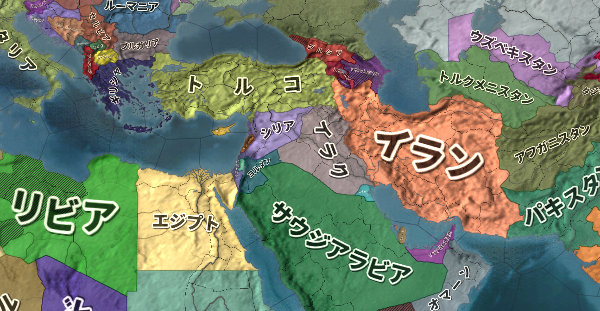  
令和二年現在の中東周辺図。伝統的に、中東とは北はトルコ、南はイエメン・オマーン、西はエジプト、東はイランまでを指す。この地域に住む者は皆、「アラブ人」という意識をある程度共有していた。戦後、伝統的中東の人間は、汎アラブ主義に熱狂していく。例外はトルコ（トルコ人という意識が既に明確にあった）、イラン（伝統的にペルシア人という意識がある）等。またその例外国も、汎アラブ主義と同じ世俗化路線を採った。  
Paradox Interactive社のEuropa Universalis IV（Extended TimelineMOD及び日本語化MOD使用）より  
  
・汎アラブ主義が本格的に始まるのは第二次世界大戦直後である  
・第二次世界大戦まで、中東に住む者は皆、「アラブ人」という意識をある程度共有していた  
・だからこそ、汎アラブ主義が盛り上がった  
・しかし、第二次世界大戦直後、異邦人がやってくる  
・【ユダヤ人】である  
  
・ユダヤ人は、古代のパレスチナに住んでいた民族である  
・ユダヤ人は国を滅ぼされ、以後千年以上に渡り、国なき民として世界各地に離散する事になる  
・そしてユダヤ人は、歴史的にキリスト教徒及びイスラム教徒から嫌われてきた人々である  
⇒スエズ危機で既に見たが、ドイツ人だけがユダヤ人を嫌いなのではない。欧州のキリスト教徒は皆ユダヤ人が嫌いであり、ユダヤ人を弾圧し、殺してきた歴史がある。欧州キリスト教徒のユダヤ人嫌いの集大成が、第二次世界大戦期のドイツ国による［ホロコースト］と見るべきである  
※第二次世界大戦後の欧米人は、一般にユダヤ人に同情的だが、これは歴史的には例外と言える。何故そうなったかと言えば、戦後の世界というものは「悪のナチス・ドイツを正義の連合国が倒した」という神話によって作られたから。だからこそ、悪のドイツに迫害されたユダヤ人に対しても、欧米人は同情的になったのである  
  
  
・ユダヤ人は嫌われてきたが故に、千年単位で国を持つ事ができなかった  
・ユダヤ人の国がないという事は、逃げ場がないという事である  
⇒日本人は、日本国という日本人の国がある。ヨーロッパとか中東に住んでいて、日本人が迫害されたとなっても、日本国という逃げ場がある。ユダヤ人にはこの逃げ場がなかった  
・第二次世界大戦期に於けるホロコーストは、逃げ場のないユダヤ人の危機感を刺激した  
⇒ユダヤ人の迫害というのは、ドイツだけの特別な現象ではない。ドイツに於けるホロコーストとは所詮、欧米キリスト教徒によるユダヤ人迫害の集大成に過ぎない。次はいつどこでホロコーストが起きてもおかしくない。その時、逃げ場がないのは問題である  
  
・こうして、特に第二次世界大戦期から、ユダヤ人によるユダヤ国家建設運動が盛んとなる  
・終戦直後、ユダヤ人は国連を動かし、父祖の地パレスチナにユダヤ人国家を建設する事を採択させた  
⇒国連を動かしたと言うか、欧米各国を動かした。特にアメリカ合衆国。この当時の国連は冗談抜きの戦勝国クラブであり、戦勝国にあたる連合国を動かす事が重要だった  
・こうして、ユダヤ人の国イスラエルが、中東はパレスチナに建設される事になった  
  
・国連も、なかなかいい面の皮と言える  
・パレスチナが無人ならばともかく、そこにはアラブ人（パレスチナ人）が住んでいたのである  
⇒国連は、既にアラブ人が住んでいるパレスチナを分割し、「パレスチナの一部はユダヤ人の国」「一部はアラブ人の国」という形にしよう、と言ったのである。しかも、現地住人を含むアラブ人の反対を押し切って。当時中東アラブ諸国は殆どがまだ植民地（パレスチナも英国植民地であった）だった為、国連決議を動かす事はできなかった  
  
・パレスチナ分割及びユダヤ人国家建設の国連決議が出た翌日から、パレスチナは内戦状態となった  
・ユダヤ人は、パレスチナにユダヤ人国家を建設せんとする  
・アラブ人はユダヤ人国家の建設を阻止しようとする  
※パレスチナ在住のアラブ人が阻止しようとしただけではない。中東の多くの地域から、ユダヤ人国家建設を阻止すべく、アラブ人が義勇軍として集まってきた  
  
・こうして、イスラエル建国戦争でもある［第一次中東戦争］が起きた  
・ユダヤ人はこの戦争を戦い抜き、何とかイスラエルというユダヤ人国家の建設に成功する  
  
  
・この第一次中東戦争は、中東に大きな爪痕を残した  
  
・ユダヤ人国家イスラエルは建国されたが、その建国を否定される戦争の中でイスラエルは生まれた  
⇒ただでさえイスラエルは、「我々には逃げ場がない」という意識を持つユダヤ人の国である。第一次中東戦争という経験は、「イスラエルが失われたら、我々にはもう行き場はない」という認識を、ユダヤ人へ強烈に刷り込んだ。そして、「我々はどんな事をしてでも生き残ってやる」というユダヤ人の決意を生んだ  
  
・一方、盛り上がり始めたばかりの汎アラブ主義は、ユダヤ人という宿敵を持ってしまった  
・本来なら、汎アラブ主義の敵意が向かうべきは欧米である  
⇒アラブ人を植民地化していたのは欧州各国、英国や仏国である。アラブ人は団結して欧州に対抗しよう、となるのが普通だろう  
・そこに、ユダヤ人という敵が現れ、アラブ人の土地を奪い、そしてアラブ人を戦争で打ち負かした  
⇒ユダヤ人は欧米を動かしてアラブ人の土地を奪い、そしてアラブ人を負かした。この敗北は、「ユダヤ人はアラブ人の敵である」「アラブ人は団結してユダヤ人を倒そう」という意識を生んでしまった。汎アラブ主義華やかなりし頃の中東では、旧ドイツ国軍人や科学者が、「かつてユダヤ人と戦った英雄」として歓呼と共に迎え入れられる事すら起きる。それほどまでに、ユダヤ人の打倒はアラブ人の至上命題となってしまった  
  
・こうして、アラブ人とユダヤ人という、本来なら戦わなくてもいい両者は、宿敵となってしまった  
  
・以後、アラブ人はユダヤ人殲滅を求める  
・一方、イスラエルは領土の拡張を求めた  
⇒自民族の根絶を求める敵に囲まれたイスラエルは、極めて守りにくい地形をしていた。特に建国当初のイスラエルは、国境線に大砲を並べてつるべ撃ちにするだけで全土が焼け野原になるような地形だった。その為、領土拡張によって守りやすい地形を求めた  
  
・冷戦期を通して、汎アラブ主義を掲げるアラブ国家とイスラエルは、何度も戦った  
・第一次オイルショックを引き起こした［第四次中東戦争］も、アラブとイスラエルの戦いである  
・また、［パレスチナ解放戦線(PLO)］も汎アラブ主義諸国の支援を受けている  
⇒パレスチナをアラブ人の手に取り戻す、という目標を掲げた国際テロ組織。特に冷戦期、盛んにテロを繰り返し、またレバノンを征服して活動拠点とした。後に、イスラエル軍の攻撃を受けて弱体化する  
  
〇イスラム原理主義の登場と米国の蹉跌  
・汎アラブ主義は、アラブ人の団結、そして世俗化（脱イスラム）による近代化という大義を掲げた  
・しかしイスラエル建国により、もうひとつ、反ユダヤという大義も加わった  
・これが、汎アラブ主義の不幸であった  
  
・イスラエルは、戦った。戦って戦って、常に勝利を収めた  
⇒まさに「我々はどんな事をしてでも生き残ってやる」というユダヤ人の意識が、イスラエルを常に勝利させた。ユダヤ人はあらゆる手を使って欧米諸国の支援を引き出し、兵器を輸入し、兵隊を訓練し、勝利を重ねた  
・反ユダヤという大義をも持ってしまった汎アラブ主義は、度重なる敗戦によって人々の支持を失っていく  
・汎アラブ主義に代わって中東アラブ人の心を捕らえたのは、イスラム教であった  
  
・その明らかな兆候は、冷戦後期に見られる。例えば1979年末からの、ソ連のアフガン侵攻である  
・この時、アフガンには中東各国から義勇軍として、イスラム教徒が集まった  
⇒彼らはイスラム聖戦士（ムジャヒディン）と呼ばれ、米国はCIAを通じて彼らを支援した。志願兵の中には、後に米国中枢を直撃するテロを起こす、【ウサマ・ビンラディン】の姿もあった  
・アフガン侵攻の直前には、イランで革命まで起こっている  
⇒イランは、汎アラブ主義に賛同こそしていなかったものの、世俗化を目指すという意味では汎アラブ主義と同じ路線を採っていた。そのイランで、「世俗化は糞」「イスラム教に基づく統治こそが至高」というイスラム原理主義革命が起こった。明らかに、中東諸国に於ける「脱イスラム」「世俗化」という路線が人気を失い、イスラム教の人気が戻りつつあった  
  
・この時人気が戻ったイスラム教は、アラブ諸国各地で連綿と受け継がれてきた「伝統」という側面が強い  
・昔ながらの伝統と慣習を重視した国家が求められるようになっていった、と言える  
・そのような視点からすると、世俗化とか、近代化とか、そういったものは敵である  
・そして、世俗化とか近代化とは一体何処から来た発想か？　と言えば、それは欧米と答える他ない  
⇒こうした発想の中で、「アラブ諸国は欧米やユダヤ人による侵略を受け、抑圧されている」「我々はイスラム世界を守る為、戦わねばならない」という思想を持つ者も出てくる  
  
・［2001年］の【9月11日】に起きたいわゆる911テロは、この思想の延長線上にあると言ってよい  
⇒アメリカ合衆国の複数の重要施設へ、アルカイダ構成員にハイジャックされた飛行機が突っ込んだ。犠牲者は三千人近くという、大惨事となった  
・首謀者はイスラム原理主義組織［アルカイダ］の【ウサマ・ビンラディン】  
・当時の米国大統領［ブッシュ］は、直ちに報復措置を決意  
・当時アルカイダの本拠地があったアフガニスタンへ攻め込むのである  
  
・これ以降、アメリカ合衆国は中東へ積極的に介入するようになる  
⇒これ以前から介入はしていたが、基本的にはCIA等の情報機関や、外交機関を通じて間接的に介入していた。軍隊を送り、占領して、現地で政府を作って…というような本格的な介入をしていくのは、この911テロ以降と言っていい  
  
・米国による中東介入の最大の例は、2003年の【イラク戦争】である  
・この時、米国は［ブッシュ・ドクトリン］を掲げ、攻撃に踏み切った  
⇒「我が国に対して大量破壊兵器を使う恐れのある国に対する先制攻撃は、自衛の範囲である」とするのがブッシュ・ドクトリン。これに従って、米国はイラク共和国へ攻め込んだ。この攻撃で［サダム・フセイン］のバース党政権は崩壊、米国による占領と統治が始まる。ただ実際には大量破壊兵器は発見されず、「イラクにある油田が欲しかっただけでは？」という声も強い  
  
・こういった中東介入は、結果的に見て、失敗だったと言っていいだろう  
・理由はいくつかあるが、大きな理由として、占領政策の失敗を挙げておくべきだろう  
⇒日本人に対してやったように、「今まで皆さんは、民主主義国家とは名ばかりの独裁政権に支配されていました」「ですから、我々が独裁政権を倒しました！」「これからは、真の民主主義の時代になるのです！」というような占領政策を行った。これが日本でうまくいったのは、大正期以降の日本が、民主主義で運営されていたからである。戦時国家総動員体制から、平時の民主主義体制に戻せばよかった。しかし中東では、民主主義はうまくいかない。民主主義が成功するには、国民一人一人が国の事を考え、「この国をよくするにはこうしたらいいんじゃないか」「いや、こうした方がもっとこの国はよくなるし、皆幸せになれる」と議論を重ねられる環境が必要である。しかし、中東にはそもそも「国って何だよ？」ぐらいの人が多い。自分の部族さえよければそれでいい、国って何だよ、というレベルなのである。これで、民主主義がうまくいく方が不思議である  
  
・この「何でも民主主義にすれば解決！」という勘違いは、別に米国だけのものではない  
・2010年末から、中東諸国で次々と革命が起きた。欧米諸国は、この革命を支援している  
・［アラブの春］と褒めそやし、民主主義国家誕生によって中東はよりよくなると欧米諸国は期待した  
⇒では革命によってできた民主主義国家の皆さんはどうでしたかと言うと、民主制に移行してうまくいったのはチュニジアだけ。リビア、イエメン、シリアは令和二年現在も大絶賛内戦中。エジプトは国内の対立が激化してクーデターが発生、再び独裁政権になっている  
  
・尚、この泥沼化した中東から撤退する、と公約して米国大統領になったのがトランプである  
・実際、中東はカネとアメリカ人の血を吸うばかりで、得られたものは決して多くはなかった  
・言ってみれば、中東と米国の関係はブッシュ、オバマ政権の負の遺産と言える  
⇒オバマ政権も、なんだかんだと言って中東介入路線は継続している。アラブの春の対応を誤ってシリア内戦やリビア内戦を泥沼化させてしまったのもオバマ政権時代の話である  
・この撤退がうまくいくかどうかは、令和二年現在はまだ不明、と言える  
※但し、誰かがいつかやらなければならない仕事なのは確かである  
  
〇新たなイスラム教の誕生  
・冷戦期にイスラム教は人気を回復させた  
・このイスラム教は、中東諸国の伝統と慣習の復活という側面があった  
・この伝統と慣習の復活の中で、911テロのアルカイダも生まれた  
  
・さて、2010年代にもなると、イスラム教に新たな潮流が生まれる  
・この頃になると、スマートフォン等の端末が発展途上国含めて世界中に普及する  
・これによって、誰であってもインターネットにアクセスできるようになった  
  
・そうなる以前、イスラム教のコーランやハディースの解釈は、知識人による寡占状態にあった  
⇒コーランが聖典。ハディースは預言者の言行録。イスラム教は基本的に、このふたつ（と聖書の一部）を経典とする。コーランとハディースが分かればイスラム教は分かると言ってもいいぐらい、イスラム教に於いて重要。ただ、コーランやハディースを読めるのは、カネと余裕のある、一部の知識人だけだった  
・それが、スマホでインターネットに繋げば、誰でも原典にあたれるようになった  
・また、どのような解釈が存在するかも、検索すれば出てくるようになった  
・そして自分の解釈はこうだとか言って議論する事も、SNS等で可能になった  
  
・これは一種の革命であったと言っていい  
・こうなる以前は、コーランやハディースといった原典を読めるのは、一部の人間だけだった  
・解釈を行うイスラム法学者達は、基本的には穏健な解釈を提示してきた  
・しかし、技術の進歩によって、誰でも原典にあたれるようになった  
・そして、原典には書いてあるのである  
・例えば、「ジハードしろ」「何か理由付けてジハードしない奴は糞だぞ」とか  
・例えば、「カリフによる統治こそ、イスラム教徒にとって唯一正しい統治体制だぞ」とか  
  
・この革命は、新しいタイプのイスラム教徒を生んだ  
・伝統とか慣習という意味でのイスラム教でなく、原典にあたって得た教えを奉じるイスラム教徒である  
・しかも、以前述べたように、イスラム教に於いて解釈は個人の自由と信仰に任されている  
⇒イスラム法学者は解釈を出すが、その際「これはあくまで私の解釈で、真の解釈はアッラーのみがご存知です」という態度を採らねばならない。つまり、過激な解釈をするイスラム教徒が出てきたから「その解釈は絶対に間違いだ」とか言った場合、「お前はアッラーにでもなったつもりか」と言われてしまう  
  
・こうして生まれた新しいタイプのイスラム教、その到達点の一つが【イスラム国】である  
※ISIS、ISILなどとも呼ばれる  
・アルカイダの幹部だったバグダーディーは、カリフを名乗り、カリフ制国家の樹立を宣言した  
・これは、イスラム教の経典を見れば書いてある、「正しい統治体制」を復活させる宣言であった  
・イスラム国が世界中の若いイスラム教徒を惹き付けた理由はここにある  
・また、新しいタイプのイスラム教だったからこそ、旧来のイスラム勢力とは対立したのである  
⇒実際、バグダーディーはアルカイダ幹部だったにも拘わらず、イスラム国とアルカイダは絶縁関係にあり、敵対している。また、あらゆる「伝統と慣習」型のイスラム勢力から猛批判を浴び、敵対されている  
  
・バグダーディーは2019年、米軍の作戦により死亡している  
・また、シリアに誕生して大勢力を築いたイスラム国の勢力は、ほぼ掃討された  
・しかし、「自分で原典にあたる」タイプのイスラム教が壊滅した訳ではない  
⇒そうである以上、そしてイスラム教の原典の価値観と現代の国民国家や民主主義の価値観が全く相容れないものである以上、問題の根本的な解決は難しいと言えるだろう  
※キリスト教にしても、聖書が奴隷制を否定していないように、原典の価値観と現代の価値観は異なる。しかしキリスト教は、完成度が低いからこそ「時代に合わせて考えを変える」という伝統があった。逆に、イスラム教は完成度が高いが故に、そういう伝統がなかなか生まれなかった。誕生以来穏健な形に少しずつ変わってはいたのだが、本人達に「変わった」という認識はなく、「時代に合わせて考えを変える」という伝統までは生まれなかった。ここに、悲劇がある  
  
・尚、こういった動きはイスラム国を生み出しただけではない  
⇒令和二年現在のトルコ共和国で、カリフ制復活が真剣に議論されているのもこの延長線上にあるとみていいだろう  
  
  
## ●世界の紛争  
・世界には、今でも様々な紛争がある  
・その中でも、有名なものをピックアップ  
・また、かつてあった紛争についても有名どころをピックアップ  
  
  
本項で、項目付で取り上げる紛争一覧。勿論、ここに挙げた以外の紛争も沢山ある。  
by Canuckguy and other, public domain, https://commons.wikimedia.org/wiki/File:BlankMap-World.svg  
上記を筆者が改造  
  
  
### 〇世界の紛争のパターン  
・現代史に於ける紛争には、原因によってある程度種類分けができる  
・これを知っておくと、色々と助けになるだろう  
  
・共産主義によるもの  
・共産主義は、誕生以来戦争の種になってきた  
・そもそも論として、「金持ちを殺せば幸せになれる」理論なので、暴力革命を誘発する  
・しかも「世界中の皆で金持ちを殺しましょう」理論でもある  
・なので、一度革命が成功すると世界中で革命を成功させようと宣伝・諜報・侵略を始める傾向にある  
・第二次世界大戦や冷戦は、こういった共産主義の特性が原因のひとつになっている  
・ネパール（中華人民共和国とインドの国境地帯にある国）が内戦になったのも、共産主義の輸出が原因  
  
  
・共産主義の失敗によるもの  
・共産主義はだいたいうまくいかない  
⇒「金持ちを殺せば幸せになれる」「金持ちを殺して、労働者の労働者による労働者のための楽園を作りましょう」理論が共産主義だが、その理論がいかにも胡散臭いところから分かるように、まず楽園は作れない  
・そして「楽園が作れないのは、革命の邪魔をする奴がいるからだ。殺せ」と言い始めるのがいつもの流れ  
・なので、共産主義国家では粛清・虐殺が多い  
・当然、そこから紛争に発展する場合も多い  
・独裁者ポル・ポト治世下のカンボジアがまさにこれで、大虐殺を引き起こしその後内戦になった  
・共産主義の北ベトナムによるベトナム統一後も、大虐殺が起きている  
・中華人民共和国で起こった文化大革命による虐殺も、だいたいこれが原因  
・第二次世界大戦期にソ連で起きたウクライナ飢饉も、だいたいこれが原因  
  
・欧米諸国の植民地支配に関係したやらかし  
・欧米諸国は、かつて世界中を植民地にしていた  
⇒例えば東アジアで植民地にならなかったのは、日本とタイぐらいなものである  
・欧米諸国は、植民地の人間を奴隷のように扱い、富を搾取していた  
・普通にそういう事をすれば、植民地の人間は欧米を恨み、団結して反乱を起こす可能性がある  
・そこで欧米諸国が常套手段としたのが「分断して統治せよ」という原則  
⇒植民地の人間を複数の集団（例えば民族）に分割し、特定の集団（少数派の場合が多い）に特権を与え、欧米諸国の代理人として植民地を統治させる。すると、大多数の植民地人の恨みは欧米諸国ではなく、現地で支配者やってる集団に向かう。欧米諸国からすると、植民地の人間同士でいがみあってくれるからこっちに向けては反乱起こしてこないし、搾取は続けられるしニッコニコ、というもの  
・こういう事をやってたので、第二次世界大戦以降、欧米が植民地から手を引くと高確率で内戦になる  
⇒「てめぇ植民地時代はよくもやってくれやがったな」というので虐殺・紛争・内戦が起こる  
・［ルワンダ内戦］なんかはまさにこういうタイプの内戦  
⇒ルワンダを植民地支配したベルギーが、少数派の［ツチ族］に多数派の［フツ族］を支配させていた  
・［スリランカ内戦］も典型例である  
⇒スリランカを植民地支配した英国が、少数派の［タミル人］に多数派の［シンハラ人］を支配させていた  
・ミャンマーで少数民族問題がこじれているのも、これに起因するところが大きい  
⇒ミャンマーでは、かつて民主化運動の顔だった［アウン・サン・スー・チー］が政権を奪取してから、少数民族［ロヒンギャ］問題が一気に悪化。虐殺と言ってよい事態に発展している  
  
  
・傀儡国関係（植民地支配関係のやらかしの亜種）  
・特に冷戦期、米ソはそれぞれ、できるだけ多くの地域を自陣営のものとしようとした  
・とは言え、西側陣営の中核となる欧米諸国は、基本、世界中で嫌われている  
⇒例えば、西側欧米諸国から独立した植民地は、当然西側欧米諸国が嫌いである。彼らは一般的に、西側と対立する東側、つまりソ連になびこうとする。【キューバ】や北ベトナムなんかはまさにそう  
・西側頭目たる米国とすれば、そういう事態はなるべく避けたい  
・だから、親米とあればどんな政権であろうとも支援する  
⇒とは言え、米国はかつて自分達を搾取していた西側欧米諸国、その頭目である。例えば旧植民地の人間なら、普通の人は米国を好きにはならない。なるとしたら、米国のカネ目的のやべー奴ぐらいなものである。そして米国は、やべー奴による政権であろうとも、親米ならば支援しようとする。圧政を布いていようが何だろうがお構いなし。本来ならばとっくに民衆の反対で倒れてるような政権でも、米国のカネと力で生き残らせる  
・で、本当にどうしようもないドン詰まりになってしまって国内が混乱する、というパターン  
・南米で独裁政権からの内戦・内紛が多いのはだいたいこれが原因である  
・イラン革命なんかもこれに近いところがある  
  
・覇権争い、代理戦争  
・冷戦期が顕著だが、大国同士が直接戦争するのではなく、第三国を舞台に代理戦争する場合がある  
⇒冷戦期以降、大国同士で直接戦争すると核戦争になる可能性が出てきた。また、核を持たない国でも、露骨に直接戦争すると、多国籍軍が送られてきたり経済制裁を受けたりする可能性がある。【湾岸戦争】はまさにこの例  
・これを避けるべく、近隣諸国の内戦に介入し、自国寄りの政権を打ち立てる…という行動が増える  
・そして、複数の国が介入した結果、代理戦争化する事もよくある  
・令和二年現在も進行中の［シリア内戦］が泥沼化したのは、これが原因  
⇒米国はトランプ大統領の指揮下で手を引きつつあるため、今後はトルコ共和国、ロシア連邦共和国、イラン共和国といった国々の代理戦争として続く可能性がある。三国共に、中東の覇権を狙っている国である。尚、ロシアとイランは政府軍（［アサド］政権）を、トルコは反政府勢力の一部を支援している  
・［イラン・イラク戦争］も、イラン革命の影響を抑えたい各国が支援しており、代理戦争の側面がある  
  
・大国による小国の征服、侵略  
・昔はよくあったが、第二次世界大戦以降、特に減ったパターン  
・冷戦期以降は基本的に、代理戦争でやる  
・但し、全く例がない訳ではない  
・［ウクライナ東部紛争］でのロシアによるウクライナ領クリミア半島の併合は、まさにこれである  
・また、軍事力によらず、経済力によって征服しようとする場合もある  
⇒［中華人民共和国］の場合、返済不能な多額の借金を小国に背負わせて、借金の「カタ」にその国を支配する、というような手を使っている。［一帯一路］もその延長線上にあるが、現状ではまだ、この手段が紛争に発展した例はない  
・尚、［中華人民共和国］は、現在も軍・経織り交ぜた戦略で［台湾］併合を狙っている  
⇒と言うかぶっちゃけ、日本も標的であると言っていいだろう。中華人民共和国が太平洋に進出するとなると、どうしても邪魔になる位置に日本列島と台湾がある。中華人民共和国が日本・台湾を狙うのは、力と力がぶつかる国際政治の世界では当然の話である。そして狙われた日本・台湾が、力の均衡を狙って米国と結ぶ。このように、現代でも外交による安全保障は【勢力均衡】が基本である  
・民族浄化  
・両大戦期以降、ナショナリズムや民族主義が勃興し、民族は様々な内戦・紛争の種になっている  
・そのひとつの表れが、民族浄化  
・「この国は〇〇人のものだ。△△人、貴様らの居場所ではない」として△△人を皆殺しにする、みたいな  
・［ユーゴスラヴィア内戦］はだいたいこれが原因で悲惨な事になっている  
・尚、民族浄化は必ず皆殺しにする方針を採る訳ではない  
⇒少数民族の住む地域に多数派民族を移住させ、また少数民族の文化・宗教・言語を禁止し、多数派民族に［同化］させてしまう、という手もある。勿論反抗する少数民族は殺すので、全く殺さない訳ではない  
・中華人民共和国で、令和二年現在も続く［チベット］、［ウイグル］問題は同化型の民族浄化である  
⇒共産主義は「宗教は麻薬」として「労働者を惑わす宗教を根絶する」という目標を掲げてもいる。チベット人はチベット仏教を、ウイグル人はイスラム教を主に信仰しており、共産主義国家たる中華人民共和国による民族浄化は、共産主義が原因という側面もある  
  
・民族独立  
・他の民族に支配されている民族が、「俺達の国を作ろう」で独立しようとするもの  
・支配している方は、自分の領土が減るのは嫌なので、大抵独立運動を抑圧する  
・そのせいで、紛争や内戦、独立戦争に発展する事が往々にしてある  
・［ユーゴスラヴィア内戦］の発端はこれである（民族浄化で過激化した）  
・中東各国に少数民族として住む［クルド人］は度々独立運動を起こしており、紛争になっている  
⇒今のところ「クルド人の国」というものはない。そのせいで冷戦期以降は特に独立運動が激しく、トルコやイラクで平和に少数民族として住んでいるクルド人であっても、親戚の親戚には必ず独立を目指すテロ組織に加入している人がいる、というぐらいのレベルである  
・また、支配されている方が、支配している方につく場合もある  
⇒支配民族と婚姻が進んで支配民族寄りになったとか、支配されている方の一部が支配民族によって特権を与えられ、その特権を手放したくないが故に支配民族寄りになる…等の場合である  
・【アイルランド紛争】はまさにこれのせいでこじれた  
  
・部族主義  
・欧米以外の地域、特に中東やアフリカでは、「国」とか「国民」という概念が発展していない  
・こういう地域では、「国民」を仲間とは思わない  
⇒自分が属する部族までしか「仲間」と認識しない、という中世的な価値観で止まっている  
・そういう国で現代的な国民国家が作れる筈もなく、部族主義に基づく対立が内戦を引き起こす事も多い  
・［ソマリア内戦］は典型例である  
⇒南部の部族出身の人が大統領となり、税金を南部の開発の為だけに投入した。また、南部の部族出身者だけを重用した。当然、他の部族が激怒して内戦になり、泥沼化して無政府状態となった。治安の悪化から沿岸には海賊も出没しており、日本も海上自衛隊を派遣している  
・［リビア］が内戦になったのも部族主義が原因と言える  
⇒リビアも部族主義が強い。しかし独裁者の［カダフィ］は、石油から得られるカネを全国民に配っていたので、アフリカの中でもかなり豊かで平和な国だった。とは言え、カダフィは弱小部族の出身であり、有力部族からすると弱小部族がでかい顔をしているのは面白くない。アラブの春の時期に起きた反乱を、欧米が「民主主義国家を目指す革命だ！」と言って支援し、カダフィを殺してしまった。結果、自分の部族の事しか考えない人々が利権を求めて争い始め、内戦へ突入していった。リビアは、独裁者は絶対悪で民主主義は絶対善という価値観の分かりやすいアンチテーゼとも言えるだろう  
  
・宗教  
・実は、純粋に宗教だけが原因で紛争が起こる事は少ない  
・中世の十字軍ですら、宗教はせいぜい、主要な要因のひとつでしかない  
・宗教紛争だと思われている紛争も、実際には、宗教は副次的な役割しか果たしていない事は多い  
⇒例えば【アイルランド紛争】は、【カトリック】のナショナリスト（独立派アイルランド人）と【プロテスタント】のユニオニスト（親英派）の争いだと思われがちだが、実際にはプロテスタントのナショナリストとかカトリックのユニオニストも結構いる  
・現代史ではせいぜい、【イスラム国】の台頭に於いて主要な要因になったぐらいである  
・どちらかと言うと宗教は、紛争の火種があるところに、実力行使の大義名分を与える役割を果たす  
例：中東では「世俗化路線」が衰退し「伝統と慣習」が復活したが、イスラム教が旗印になった。そしてイスラム教を旗印に、イスラム原理主義系テロ組織によるテロが起きている  
  
  
### 〇［イラン・イラク］戦争(1980-1988)（宗教、代理戦争型）  
・戦後の中東の歴史は、まずアラブ人とユダヤ人の争いから始まった  
・ユダヤ人のイスラエルと、ユダヤ人によって故郷を追い出されたアラブ人（パレスチナ人）の争いである  
⇒ここに、反ユダヤの汎アラブ主義を奉じるアラブ諸国が介入し、四次にわたった中東戦争も起きた  
・イスラエル撃滅を目的としたアラブ諸国は、しかし一度も勝てなかった  
・結果、アラブ諸国で汎アラブ主義が後退  
⇒「もうイスラエルに勝てないのは分かりきってるし、むしろ仲良くした方が得なのでは？」と考える国が増えていく  
・結果、反ユダヤ・イスラエル撃滅からは手を引くアラブ諸国が増えた  
⇒ユダヤ人を敵視はしているが、実際に戦争を仕掛けはしない程度にまでは軟化した  
・一方、イランではついに、イスラム原理主義革命まで起きた  
  
・アラブ諸国は反ユダヤ・イスラエル撃滅から手を引いたとは言え、基本的には世俗化路線である  
・当然、イランで起きたイスラム原理主義革命は警戒する  
⇒イランでのイスラム原理主義革命は要するに、「世俗化は糞」「イスラム教に基づく統治こそが至高」というものである。こんなものが伝播してくると、世俗化路線の我々の政権を倒されてしまう…とアラブ諸国は危惧した  
  
  
1980年の中東。北側の赤いのはソ連。この頃は冷戦末期なのでまだソ連がある  
Paradox Interactive社のEuropa Universalis IV（Extended TimelineMOD及び日本語化MOD使用）より  
  
・［イラン・イラク戦争］(1980-1988)はこの流れの中で起きている  
・イラン・イスラム共和国はイスラム原理主義革命で誕生した国である  
⇒この革命を指導したのがホメイニ  
・そしてイラク共和国は、最後まで汎アラブ主義を掲げた国の一つ  
⇒独裁者［サダム・フセイン］が率いる  
  
・この両者が争ったのが、イラン・イラク戦争  
・アラブ諸国はイラク共和国を支援した  
⇒イスラム主義が自分達のところへ波及してくるのを恐れた。イラクが戦争して倒してくれるっていうならそれが一番いい。またイスラム原理主義革命の拡大は欧米諸国の望むところでもなく、アメリカ合衆国を筆頭に欧米からの援助もあった  
  
・イラン・イラク戦争は一進一退の戦いが続き、合わせて百万人とも言われる膨大な損害が出た  
・結局、両者痛み分けの形で1988年に停戦となる  
⇒戦争終盤には、石油生産施設への被害も拡大した。それによって石油危機を危惧した欧米諸国が調停に乗り出し、国連安保理の勧告もあって停戦となった  
  
・両者痛み分けの形ではあったが、イスラム原理主義革命は、他国へ輸出されなかった  
⇒イラン・イラク戦争中はそれどころではなかったし、戦争が終わった直後、イラン革命を指導したホメイニが死亡する。その為、中東のイスラム原理主義革命はひとまず、イラン一国に封じ込められる事になった  
・そういう意味では、イラク共和国の辛勝だったと言えるだろう  
・但し、八年にもわたる戦争を続けた結果、イラク共和国は多額の借金を背負う事になった  
  
### 〇【湾岸戦争】((1990-)1991)（大国による小国の征服型）  
・イラン・イラク戦争の結果、イラク共和国はイスラム原理主義革命を抑えたとして国威を高めた  
・また、戦争中に諸外国の援助を引き出して軍隊を強化し、中東の強国にのし上がった  
・一方、長引いた戦争によって、多額の負債を背負う事にもなってしまった  
  
・当然だが、イラク共和国は借金を返さねばならない  
・しかし、イラク共和国には、石油の輸出ぐらいしか稼げる産業がない  
⇒石油を輸出して工業製品を輸入する産業構造になっている。輸出品目の九割を石油が占め、輸入品目の九割を工業製品が占めている  
・なのだが、当時の石油は値段が低かった  
・その為、石油の値段が上がらないと借金も返せない  
  
・ここで【イラク共和国】と対立したのが、【クウェート国】だった  
・クウェート国も産油国であり、「大量生産して安く売る」薄利多売路線を採っていた  
  
  
1990年の中東。北の赤いのは、崩壊間際のソ連。イラクはかつてのメソポタミア（シュメールを除く）にあたり、クウェートはかつてのシュメールにあたる。イラク南東部の水色がクウェート。  
Paradox Interactive社のEuropa Universalis IV（Extended TimelineMOD及び日本語化MOD使用）より  
  
・また、イラク共和国は古代で言うところのメソポタミアである  
・そして、クウェート国は、その古代メソポタミアの中でもシュメールにあたる  
※人類最古の文明がメソポタミア文明。そのメソポタミアの中でも、最初に文明が発祥したのがシュメールの地。現代のクウェートとイラクは、シュメールとシュメール以外のメソポタミア、という形になっている  
・イラク共和国（と言うかフセイン）は以前から「我々は人類文明発祥の地の後継者」と自負していた  
・そして、メソポタミア全域の支配者を主張し、クウェート国の併合を意図してもいた  
  
・こういった要素が複合して、1990年ついに、イラク共和国軍がクウェート国へ攻め込んだ  
・イラン・イラク戦争の時は、イスラム原理主義革命拡大阻止という大義名分があった  
・しかし今回の「クウェート懲罰」「クウェート併合」は、流石に大義名分としては弱すぎた  
・欧米諸国どころかアラブ諸国も含め、世界各国から一斉に非難を受けた  
・国連も、侵略戦争を行うイラク共和国への懲罰を支持  
・多国籍軍が結成され、1991年、クウェート解放戦争でもある湾岸戦争が始まった  
  
・多国籍軍の勝利により、湾岸戦争はイラク共和国の敗北に終わった  
  
・イラン・イラク戦争の頃は、米国とイラク共和国の関係は良好であった  
⇒対イスラム原理主義革命の最前線で戦うイラク共和国を、米国は積極的に援助した  
・しかし湾岸戦争以降、米国はイラク共和国とサダム・フセイン大統領を危険視するようになる  
・更に、2001年の911テロは［ブッシュ・ドクトリン］を生んだ  
⇒米国は、911テロ以降中東に本格介入するようになった。そしてこのテロ以降は特に関係が悪化したイラク共和国にも、ブッシュ・ドクトリンを適用。こうして、話は【イラク戦争】へと繋がっていくのである  
  
### 〇【パレスチナ紛争】(1948\~)  
  
イスラエルの図。北でレバノン共和国と、西でエジプト・アラブ共和国と、東でシリア・アラブ共和国及びヨルダン・ハシミテ王国と国境を接している。ガザ地区、及びヨルダン川西岸地区はパレスチナ人居住地区。この地域は現在、パレスチナ国領土として国際的な承認を受けている。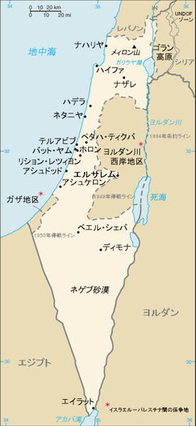  
  
  
  
  
  
  
  
  
  
  
  
  
  
  
  
  
  
  
  
  
by tenger, public domain,  
https://ja.wikipedia.org/wiki/%E3%83%95%E3%82%A1%E3%82%A4%E3%83%AB:Is-map-ja.PNG  
  
・湾岸戦争は、パレスチナ紛争に新たな局面を生んだ  
  
・四次に渡った中東戦争の後、ユダヤ人とアラブ人の争いは、PLOが主導していた  
⇒正式名称をパレスチナ解放機構と言う、国際テロ組織。ユダヤ人によってパレスチナを追い出されたパレスチナ人による組織である。汎アラブ主義の後退に伴ってパレスチナ紛争から手を引きつつあったアラブ諸国と違い、イスラエルとユダヤ人に対する攻撃を続けていた。逆に言えば、PLOさえ大人しくなってくれるなら、パレスチナ問題解決の糸口が見つかる状況とも言えた  
  
・このPLOは、湾岸戦争でイラク共和国を支持した  
・実は、イラク共和国を懲罰せんとする国際社会に対し、フセイン大統領が↓のような声明を出していた  
「ユダヤ人のパレスチナ侵略を容認しながら、我が国のクウェート併合を非難するのは矛盾である」「仮にユダヤ人がパレスチナから立ち退くのなら、我が国もクウェートから撤退する」  
・このいわゆるリンケージ論から、PLOはサダム・フセイン大統領を支持したのである  
  
・湾岸戦争はイラク共和国の惨敗に終わり、PLOの発言力は大きく後退した  
⇒「ほーん。お前らサダム・フセイン支持か。ほーーーーん」みたいな顔をしたアラブ諸国に支援を打ち切られ、金銭的にも困窮した。既に占領する土地もなくなっていたPLO（かつてレバノンを征服し支配していたが、イラン・イラク戦争中にイスラエル軍によって追放された）は、窮地に立たされた  
・これを好機と見た米国主導で、パレスチナ問題の解決が図られた  
・それが、1991年の【中東和平会議】である  
  
・この中東和平会議は、PLOの参加がなかった事もあり、うまくいかなかった  
・しかしその後、PLOを含めた和平交渉も行われ、1993年、［オスロ合意］が達成された  
⇒イスラエルとパレスチナは、互いが互いの存在を承認する。そして、平和的な共存を目指す…という、画期的な合意。これまで、少なくともパレスチナ人（アラブ人）は、イスラエルの存在そのものを認めていなかった。これを認め、共存していこうという宣言は一つの画期と言える  
  
・が、現地のパレスチナ人の皆さんはと言うと、ユダヤ人との平和共存に反発した  
・まず、「PLOはユダヤ人に妥協した」「PLOはユダヤ人に膝を屈した」と認識された  
・しかも、PLOが「パレスチナ暫定自治政府」として帰還すると、汚職・腐敗が蔓延した  
・その上この時期、パレスチナ人の間では、PLOに代わって新たなテロ組織が支持を集めつつあった  
・イスラム原理主義系のテロ組織、ハマスである  
⇒旧PLOだけがユダヤ人と平和共存しようとしても結局、草の根のパレスチナ人やハマスが反ユダヤ活動を行ってしまう、という状況に陥ってしまった。しかも、旧PLOがユダヤ人との平和共存を進めようとすればするほど、ただでさえ汚職と腐敗で失いつつある支持を更に失ってしまう  
・当然、ユダヤ人とパレスチナ人の対立は続いた  
  
・こうした中、2001年に911テロが起こり、米国が中東へ本格介入を始める  
・その中で、米国はパレスチナ問題も解決しようと介入を行う  
・2003年には、【中東和平ロードマップ】が提示される。イスラエルと旧PLOはこれを受諾した  
  
・しかし、中東和平ロードマップが出た後、旧PLOは急速に勢力を失う  
・2004年にはパレスチナ地方議会選挙でハマスが勝利  
・2006年にはパレスチナ国会議員選挙ではハマスが圧勝  
・こうして、反ユダヤ武装闘争は主導する組織が交代しただけで、今も続いている  
⇒また、隣国レバノンでは、イラン系のイスラム原理主義テロ組織、ヒズボラが大きな勢力を持っている。このヒズボラも、ハマスと同じくユダヤ人殲滅を掲げており、イスラエルへの攻撃を続けている  
  
  
  
  
  
### 〇【ウクライナ東部紛争】(2014\~)（大国による小国の征服型）  
・ウクライナは、かつてロシア帝国によって征服され、ソ連崩壊によって独立した国である  
・ロシア帝国の精鋭騎兵コサックの供給源でもあり、ロシア人との関係はそう悪くはなかった  
・しかし、ソ連時代に入ると一変  
・スターリン時代のウクライナ飢饉では一千万人（諸説あり）が死んだ  
・他にも強制移住等、ソ連時代にはウクライナ人は過酷な環境に置かれた  
・また、ソ連時代はウクライナへロシア人が大量に移住してきてもいる  
  
・こうして、ソ連崩壊時には、ウクライナ人はロシア人を最も強力に憎む民族のひとつとなった  
・ところで、ウクライナ東部には特に、ソ連時代から多くのロシア人が移住してきていた  
・その為独立後のウクライナに於いてもロシア人は大きな勢力であり、話が更にこじれる要因だった  
  
・簡単に言うと、旧ソ連領にあたるウクライナがEUに接近しようとし、これを阻止しようとしたロシア連邦共和国が軍事介入。ウクライナ東部にある【クリミア半島】を征服した、というのがこの紛争である  
  
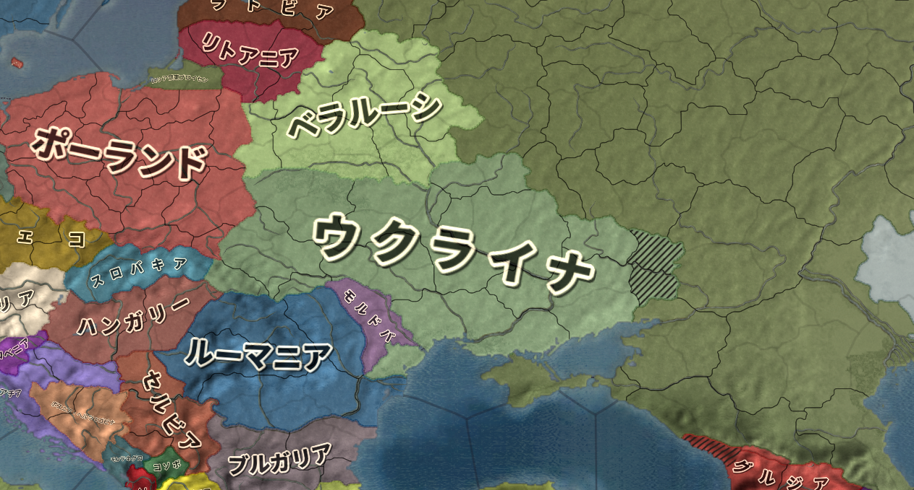  
令和二年現在のウクライナ周辺図。東側の濃い緑がロシア連邦共和国。この紛争によって、ロシア連邦共和国はクリミア半島（ウクライナ南東部、国会に突き出た半島）を征服した。また、東部の二州（地図では斜線になっているところ）も、ロシア系住民による実効支配が行われている  
Paradox Interactive社のEuropa Universalis IV（Extended TimelineMOD及び日本語化MOD使用）より  
  
・ウクライナは、2000年代からEUに参加しようとしていた  
・ところで、2010年代のウクライナ政府はあまりに多くの負債を抱えていた  
・そこで、ロシア連邦共和国は多額の融資を持ち掛ける  
⇒この融資でウクライナをロシア側に繋ぎとめようとした  
・ウクライナ大統領はこれに応じ、一旦EUへの接近を中止しようとする  
・しかし、ここはロシアを仇敵とみなすウクライナである。大規模な抗議行動に発展する  
・更にウクライナ人とロシア系住民の対立も激化。国内は騒然となる  
  
・ここでロシア連邦共和国は軍事介入を選択  
・こうして、ロシア軍がウクライナ東部を軍事占領する  
⇒一応、ロシア政府の立場としては「ロシア軍はウクライナにいない」である。ロシア軍は、「ロシア系ウクライナ人を助ける謎の親切な人々」という体で介入している  
・そして、ロシア連邦共和国は、ウクライナ東部のクリミア半島を併合した  
※また、東部の二州がロシア系住民によって実効支配される事となった。こちらについては、ロシア連邦共和国は併合まではしていない  
  
・これは、冷戦後の世界に於いて、大国自身による戦争で国境線が変わった初めての例と言える  
・この件について、国際社会は何ら有効な手を打てなかった  
⇒一応EUや米国は経済制裁をしているし、国連加盟国はいずれもこの併合を承認していないが、それだけである  
※一方、ロシア連邦共和国のプーチンは、2020年末の改憲についての記者会見で、「ロシア憲法をあらゆる国際的な規範より優先させることを決めた。領土の不可侵性についても話をした。1993年の軍隊の状況でそれができただろうか」「今や状況は変わった。我々の敵でさえ『彼ら（ロシア軍）は数こそ減ったが、以前よりもずっと効果的になった』と認めている。世界で最も効率的な軍の一つが、我々ロシア軍だ。このことをすべて憲法に明記できるようになった」と、軍隊が強ければ好きな事ができる、みたいな事を言っている  
  
### 〇［ユーゴスラヴィア紛争］(1991\~)（民族独立・民族浄化型）  
・東欧はバルカン半島西部に、かつてユーゴスラヴィアという国があった  
・この国があった地域は、昔から複数の民族が入り混じるように住んでいた  
・しかも、各民族の仲が悪かった  
⇒特に、セルビア人とそれ以外の民族の仲が険悪だった。バルカン半島西部全域はセルビア人の支配するものであるという【大セルビア主義】があった為である。この大セルビア主義の実現を目指すテロ組織もあり、第一次世界大戦の引き金となったオーストリア＝ハンガリー二重帝国皇太子殺人事件も、大セルビア主義テロリストによるものだった  
  
・第二次世界大戦後、バルカン半島西部は、ユーゴスラヴィア社会主義連邦共和国となる  
・この国は、仲の悪い五つの民族を六つの国に詰め込み、その六つの国を合併してできている国であった  
・いかにも空中分解しそうな国だが、冷戦期はチトーというカリスマ的独裁者がいた  
・チトーは常に五つの民族と六つの国の利害を調整し、歪な連邦共和国を運営し得た  
  
  
ユーゴスラヴィアの図。旧ユーゴは、この六つの国から構成されていた。また、セルビアはセルビアで、北と南に自治区（セルビア人以外が多く住んでいる）を持っていた。この二つある自治区の内南がコソボであり、こちらも後に独立を求めて紛争地帯となる。  
by Aivazovsky, CC3.0, https://commons.wikimedia.org/wiki/File:Yugo_template.png  
上記を筆者が改変  
  
・しかしチトーは、五つの民族と六つの国の不和を根本的に解決する事はできなかった  
・所詮は一時凌ぎにしか過ぎず、しかも、優秀な後継者を遺す事も出来なかった  
・1980年にチトーが死ぬと、五つの民族と六つの国の不和は、一気に噴出し始めた  
⇒ユーゴスラヴィアは伝統的に、セルビア人が中心となって運営されていた。その為、チトーの死と同時に、セルビア人への不満が爆発し始めた  
・そこに、冷戦終結とソ連崩壊が追い討ちをかける  
  
・1991年6月、ついに［クロアチア］とスロベニアが独立を宣言  
・同年9月にはマケドニアも独立を宣言  
・更に、1992年にはボスニア＝ヘルツェゴビナも独立を宣言  
・一方、ユーゴスラヴィアの中央政府を支配するセルビア人は、各国の離脱を許さず軍事介入  
・こうして、泥沼のユーゴスラヴィア紛争が始まるのである  
・このユーゴスラヴィア紛争中には、【大セルビア主義】に従った【民族浄化】も大々的に行われている  
⇒民族浄化とは、要するに、ある地域内に於けるある民族を、全員殺すという行為である。旧ユーゴ地域をセルビア人のみが住む地にするべく、他民族を皆殺しにしようとしたのだ。尚、バルカン半島西部に於いてセルビア人だけが民族浄化をした訳ではなく、第二次世界大戦中にはクロアチア人がセルビア人に対して民族浄化を行っている。とにかくバルカン半島西部の各民族は仲が悪く、その中でもセルビア人とその他の民族の仲が最悪である、と思えばよい  
  
・結局セルビア人は、クロアチアをはじめとする各国を旧ユーゴに繋ぎ留められなかった  
・残ったセルビアとモンテネグロは、二国で［新ユーゴスラヴィア連邦］を形成  
・後に［セルビア・モンテネグロ］と改名したが、それも2006年にはモンテネグロが独立してしまう  
・こうして、旧ユーゴスラヴィアはばらばらになった  
  
・尚、2008年には、セルビアの自治区だったコソボも独立を宣言している  
・コソボは米国をはじめとする九十以上の国から独立の承認を受けている  
・一方で、八十以上の国から独立の承認を拒否されている  
・また、セルビア政府は「コソボ独立は永遠に承認しない」との姿勢を崩していない  
  
  
  
### 〇【北アイルランド問題】(1919\~)（民族独立型）  
  
ブリテン諸島図。ブリテン諸島は大きくグレートブリテン島（東のでっかいやつ）と西のアイルランド島（西の大きい島）に分かれる。この内、グレートブリテン島全部とアイルランド島の北部（紫色に塗られて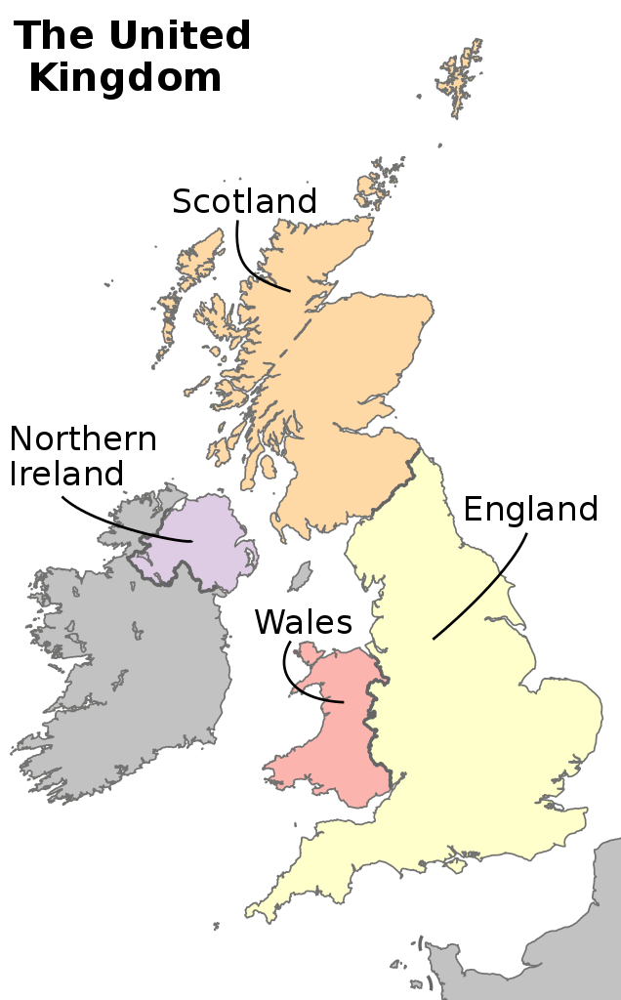Northern Irelandと書いてある部分）が、いわゆるイギリスである。  
  
イギリスの歴史は、一面に於いて、イングランド(England)がウェールズ(Wales)、スコットランド(Scotland)、アイルランド島を征服していく歴史である。言ってみれば現在のイギリスは、イングランドがスコットランドやウェールズを支配してできている国と言える。その為、今でも各地で独立運動が行われている。2014年の［スコットランド］独立投票もそのひとつである。  
  
  
  
  
  
  
  
  
  
Source:File:British Isles all.svg by CnbrbFile:United Kingdom countries.svg by Rob984Derived work:Offnfopt / CC BY-SA (https://creativecommons.org/licenses/by-sa/4.0)  
  
・ブリテン島の南部を、イングランドという  
・現代のイギリスは、このイングランドが、ウェールズやスコットランドを征服してできたという面がある  
・隣の島のアイルランドも、清教徒革命期に征服され、以後イングランドの植民地となる  
  
・アイルランド人は【カトリック】を信仰する白人である  
・しかし、歴史的にアイルランド人は白人扱いされてこなかった  
⇒近代以前、「白人扱いされない」とはつまり「人間扱いされない」という事である。例えば独立後のアメリカ合衆国でも、アイルランド人は白人扱いされず、迫害された。米国のマフィアにアイルランド人が多いのは、迫害されたアイルランド系移民が地下に潜った結果である  
  
・それもあって、イングランドによるアイルランド支配は、非常に過酷なものだった  
・分かりやすい例を一つ挙げるとすれば、ジャガイモ飢饉だろう  
・近世のアイルランドは、イングランド支配下にあって貧しい農業国家だった  
・アイルランドはイングランドへ、農作物を輸出していた  
・ところで近世に於ける貧しい農業国家の救世主と言えば、ジャガイモである  
・ジャガイモは寒冷な土地や貧弱な土地でもよく育ち、しかも栄養価も高い  
・そんなジャガイモは、アイルランド人の主食のひとつとなった  
・そのジャガイモの伝染病が、1845年から四年に渡って流行。欧州全域のジャガイモ畑が壊滅した  
・この時、アイルランドを支配するイングランドは、アイルランドを救済しなかった  
⇒アイルランドでは農作物が壊滅して餓死者すら出ている状態だというのに、イングランドへの農作物の輸出を強制した。また、アイルランド人に食糧を配給する、みたいな事もしなかった。こうして、百万人前後と言われる膨大な数のアイルランド人が死んだ。また、これまた百万人以上と言われる、膨大な数のアイルランド人が国外へ脱出した。アイルランド島の人口は、現代に至るも、このジャガイモ飢饉が起きる前の数字に達していないと言われている  
  
・こんな調子なので、当然独立運動が起こる  
・第一次世界大戦直後の1919年には独立戦争が起き、1922年には自治権を獲得する  
・1937年にはアイルランド共和国として正式に独立し、1949年には英連邦からも離脱している  
  
・だがここで問題になったのは、イングランドからの入植者、及びその子孫であった  
⇒彼らは、いわゆるユニオニストの起源である。彼らのアイデンティティは、アイルランドよりはむしろイングランドやイギリスにあった。なお、ユニオニストにはスコットランドからの入植者も多い。一方、独立を望むアイルランド人をナショナリストという  
・ユニオニストは、アイルランド独立に反対した  
・特に、アイルランド北部では、ナショナリストよりもユニオニストの方が多かった  
  
・こうして、アイルランド独立時、アイルランド北部の州が、イギリス側に残った  
・アイルランドという国の北側が、何故かえぐれているのはこのせいである  
・イギリスの正式名称が「グレートブリテン及び北アイルランド諸国連合」なのもこのせいである  
  
・さて、イギリスに残った北アイルランドにも、当然独立を望むアイルランド人がいる  
・また、他の地域に住むアイルランド人も、「アイルランド北部を奪われた」と感じるのは当然である  
・こうして、アイルランド北部の奪還を求めた武力闘争が始まった  
・これが、いわゆる【北アイルランド問題】などと言われる紛争である  
  
・ナショナリストもユニオニストも、複数のテロ組織を作り上げ、互いにテロを繰り返した  
・またイギリス政府もユニオニストに加勢し、ナショナリストのテロ組織を攻撃している  
・令和二年現在、既に対話も始まっており、武力紛争は一時に比べれば大分落ち着いている  
・但し、完全に解決した訳ではない  
  
  
・なお、ナショナリストとユニオニストの争いを、宗教紛争に矮小化しようという向きがある  
・確かに、ナショナリストには【カトリック】が多い  
⇒アイルランドは元々カトリック国である為、独立を求めるナショナリストにはカトリックが多い  
・また、確かに、ユニオニストには【プロテスタント】が多い  
⇒イングランドはプロテスタント国であり、スコットランドもプロテスタント国である。故に、イングランドやスコットランドから入植してきた者の子孫が多いユニオニストは、プロテスタントが多い  
・とは言え、プロテスタントのナショナリストもいる  
・また、カトリックのユニオニストも多い  
・北アイルランドの紛争は、根本的に民族間の対立であると言えるだろう  
  
  
  
  
### 〇［カシミール紛争］(1947\~)  
  
  
令和二年現在の南アジア。かつて大英帝国の植民地だったインド帝国は、第二次世界大戦後独立した。但し、「インド」という単一の国家としての独立には失敗し、パキスタンとインドに分かれて独立した。パキスタンはその後、パキスタンとバングラデシュに分裂した（インドの東にありミャンマーとも国境を接している、明るい緑がバングラデシュ）  
Paradox Interactive社のEuropa Universalis IV（Extended TimelineMOD及び日本語化MOD使用）より  
  
カシミール地方の図。太い赤線内が旧ジャンムー・カシミール藩王国。緑がパキスタン支配地域。橙がインド支配地域。それ以外が中華人民共和国支配地域である。  
  
  
  
  
  
  
  
  
  
  
  
  
Central Intelligence Agency, Washington, 2002 / Public domain  
https://commons.wikimedia.org/wiki/File:Kashmir_map_big.jpg  
  
・今第三次世界大戦≒核戦争に最も近い場所は何処か？  
・それは北朝鮮でもロシアでもなく、カシミールであろう  
・三国が争奪戦を繰り広げ、しかも三国全員核を持っている。世界で最も熱い戦場である  
  
・このカシミール紛争の話は、インドがまだ植民地だった時代に遡る  
・近世に於いて、インドは大英帝国の植民地であった  
⇒形式上は、インド帝国の皇帝をイギリス王が兼任する、という形を採っていた  
  
・第二次世界大戦後、このインド帝国が独立する事になる  
・ならば、「インド」というひとつの国として独立するのが本来だろう  
・実際、独立の父【マハトマ・ガンジー】もそのつもりであった  
⇒【非暴力・不服従】を唱えて独立を指導した人物として有名である  
  
・しかし、インド帝国は宗教問題を抱えていた  
・ヒンドゥー教が主流だったが、イスラム教徒もかなりの数いたのである  
・イスラム教徒は、単一国家での独立を拒否していた  
⇒一応、今や大英帝国とは言えなくなった宗主国イギリスは、統一インドの独立を望んではいた。が、最後のインド総督があまりの宗教対立の激しさに「あ、無理ですねこれ」となった。それぐらい、ヒンドゥー教徒とイスラム教徒の対立は激しかった  
  
・こうして、旧インド帝国は、インド共和国とパキスタン・イスラム共和国に分かれて独立する事になった  
・問題は、どの地域がどちらに参加するか、という点である  
  
・ところで、インド帝国は二百以上の藩王国から成っていた  
⇒江戸時代の日本が、二百以上の藩から成っていたのと同じ  
・この藩王国がそれぞれ、インド共和国かパキスタン・イスラム共和国かを選ぶ、という事に決まった  
  
・問題が起きたのは、ジャンムー・カシミール藩王国である  
・ここは、藩王がヒンドゥー教徒、国民の過半はイスラム教徒というねじれた構造をしていた  
・このカシミール藩王国が、インド共和国に参加するという噂が流れた  
・これを阻止するべく、パキスタン側から武装勢力の侵入が始まった  
・藩王は、インド側に軍事介入を要請  
・こうして、第一次印パ戦争が始まった  
  
・以来、インド共和国とパキスタン・イスラム共和国は三度に渡って戦争を繰り返している  
・全て、カシミールの領有権を巡る戦争である  
・これが小規模な武力衝突を含めると、数えきれないほど衝突している  
・しかも、両国は今や核を装備している  
⇒インド共和国は1974年に核装備を宣言。パキスタン・イスラム共和国も1998年には核保有国に  
・まさに、いつ核戦争になってもおかしくない、今一番ホットな地域である  
  
・しかも、このカシミール地方は中華人民共和国との係争地帯でもある  
・1950年、中華人民共和国がチベットを征服する  
・これ以降、インド共和国、パキスタン・イスラム共和国、中華人民共和国は国境を接する事になる  
・ただ、国境を接してすぐの頃は、インド共和国と中華人民共和国の仲はよかった  
・実際、1954年の平和五原則や1955年のバンドン会議は、両国の蜜月関係の賜物である  
  
・しかし、1956年のチベット動乱以降、両国の関係は急速に悪化する  
⇒中華人民共和国の圧政に耐えかねた旧チベット国家元首、ダライ・ラマ十四世がインドへ亡命、チベットでは粛清と虐殺の嵐が吹き荒れ、十万単位でチベット人が殺された。流石にそんなものを、国境を接する地帯で見せられて危機感を感じない方がどうかしている  
  
・インド共和国と中華人民共和国は国境線の解釈でも対立  
⇒両国が国境を接するのはカシミール地方であり、この対立はカシミール地方争奪戦へ発展する  
・1962年、ついに中印国境紛争と呼ばれる武力衝突が発生する  
・この紛争では、中華人民共和国が圧勝した  
・一方インド共和国は、この時の恨みを忘れてはいない  
⇒現在でも、インド共和国の仮想敵国その１その２はパキスタン・イスラム共和国と中華人民共和国である。この二国を倒す、その為の味方を集める、というのが現代でもインド共和国外交の基本方針である  
  
・インド共和国と中華人民共和国の対立という意味でも、カシミール地方は極めてホットと言える  
※2020年にも、インド共和国軍と中華人民共和国群の間で複数回武力衝突が起き、死者が出ている。両者が核保有国である事も合わせ、極めて危険な地域と言えるだろう  
※なお、パキスタン・イスラム共和国は中華人民共和国と妥協を成立させており、国境紛争には至っていない。敵の敵は味方という事で、どちらもインド共和国を敵とするこの両国の仲は良好である  
  
### 〇［2020年BLM騒動］  
・紛争かと言われると怪しいが、紛争・内戦的要素を持つ最新の事件として取り上げておく  
・基本的には、ミネソタ州ミネアポリスの事件をきっかけとする  
⇒白人警官が、黒人容疑者を取り押さえようとした際、誤って殺害してしまった  
・これに対する抗議活動が過激化・暴徒化して様々な地域へと広がった事件である  
  
・簡単に言うとそれで終わりなのだが、実は結構難しい問題である  
・まず前提が二つある。ひとつは、米国がそもそも極めて差別の激しい国であるという事  
※米国に限らず欧米は基本、日本では考えられないぐらい差別が激しい  
・もうひとつは、新自由主義の台頭である  
⇒この二点目が、分かりづらい。これから解説する  
  
・既に見てきたように、資本主義体制下で自由権を尊重すると、格差は拡大する  
・そもそも資本主義自体、放っておけば金持ちはより金持ちに、貧乏人はより貧乏になる仕組みであり…  
・自由権とは一面に於いて、「俺達に好き放題金儲けさせろ」という考え方だからである  
⇒これを放っておくと、金持ちは「労働者を低賃金＆長時間の実質的な奴隷労働させる自由」や「労働者の参政権を認めない事で、労働者の意見を封殺する自由」を振り回し、貧富の格差は余計に拡大していく事になる  
・それはまずいという事で、自由権は一度後退し、参政権や社会権が拡大されてきた訳である  
・ロシア革命によってソ連ができた事も、特に社会権の拡大に効果があった  
⇒「労働者を虐め過ぎると革命起きる」という恐怖が、資本主義＆自由主義国家に於いても「自由を制限しよう」「労働者に優しくしよう」という発想を浸透しやすくした  
  
・しかし1980年代になると、ソ連が倒れて革命の恐怖がなくなった  
・そして財政赤字の解消や癒着の解消を謳い文句に、再び自由権尊重の時代となった  
⇒自由権が一度後退し、それから再び自由権尊重の時代になったという事で、かつての自由主義とは区別して新自由主義などと言われる。いわゆるネオリベラル。「勤勉で有能な俺達にもっと金を払え！」「無駄を削減しろ！」というような掛け声が、旧西側諸国で広がった  
  
・1980年代からの新自由主義の台頭の際、労働者達は皆「有能な俺の給料が増える」と思っていた  
⇒だからこそ、自分達を守ってくれる社会権の後退を是認して、新自由主義の台頭を歓迎したのである  
・ただここで考えてほしいのは、企業の経営者にとって有能な労働者とは何か、である  
・企業の経営者にとって、有能な労働者とは「タダ同然の給料」で「いくらでも働いてくれる」者である  
・決して、「短時間で大量の案件をこなしてくれる」が「給料がクッソ高い」者ではない  
・当然、労働者の給料は下がり続けた  
・労働者の給料を下げて余ったお金は、経営者と株主で山分けされた  
・「無駄の削減」も同じである  
・「無駄」、例えば労働者がゆっくり働ける環境というのは、一種労働者を守るものだった  
・しかし「無駄」を省こうとなった結果、労働者は朝から晩まで必死に働いている  
・どんなに働いても給料が上がるどころか下がるのに、それでも必死に働かざるを得なくなった  
  
・「勤勉な俺達にもっと金を払え」とは、逆説的に「怠惰な奴に金を払うな」でもある  
・「勤勉ならば金持ちになれる筈。いつまでも貧乏なのは、無能で怠惰だからだ」という事になる  
・勿論、じゃあ現代は勤勉で有能なら金持ちになれますか？　というとかなり無茶である  
・そもそも資本主義は、放っておけば貧乏人はより貧乏になる仕組みである  
・そこに、金持ちが権力を振るうのを是認する自由権尊重の風潮があっては、どうにもならない  
⇒実際、余程運がよくないと、能力だけで這い上がるのは厳しい…それが現代である。一昔前なら、肉体労働でそれなりの額を稼いで、それを元手に会社を興したり投資したりして金を増やす、みたいな事もできた。現在はどこもかしこも低賃金労働ばかりで、まず元手を稼ぐのすら厳しい状態である  
  
・とにかく、新自由主義は「勤勉な俺達にもっと金を払え！」「怠惰な奴に金を払うな！」で出てきた  
⇒ここから、「金持ちはより金持ちに」「貧乏人はより貧乏に」という仕組みを維持しながら、貧乏人に対しては「俺達は勤勉だから金持ちなんだ。悔しかったら働け、怠け者」と説教できるという、金持ちには理想的な環境が作られていった  
  
・例えば、現代は貧富の格差が拡大し、また貧困層が富裕層に這い上がるのはほぼ不可能な格差社会である  
・二十世紀には、自由権を制限して社会権を拡張し、貧困層を救済しようという発想が出てきた  
・だが、新自由主義下の現代では、そういう話にはならない  
⇒自由権の制限からの社会権拡張は、いわば、「富裕層も貧困層も皆同じ国民、同胞なんだから助け合おう」という発想である。しかし新自由主義下では、「何故、有能で勤勉な俺が稼いだ金を、無能で怠惰な貧困層に配ってやらねばならんのか？」となってしまう  
  
・これ、別に著者がマルクス主義者で、過激な事を言っているという訳ではない  
・新自由主義推進の代表選手、英国のサッチャー首相の言葉を引こう  
「今日、この国に根本的な貧困は存在しません。西欧諸国に残っているのは貧困以外の問題です。たしかに貧困らしきものはあるかもしれない。それは予算の立て方や、収入の使い途を知らないからです。いま残っている問題は、個人のごく基本的な性格の欠陥だけです」  
・一応言っておくが、サッチャー政権下でも貧困に喘ぐ人々はいた  
・と言うか、サッチャー政権後期、1984年から1989年にはホームレスが38%増えている  
※サッチャーは1979年から1990年まで首相  
・このホームレスの増加を「個人のごく基本的な性格の欠陥」と片付けた訳である  
・日本の新自由主義推進者、竹中平蔵も「みなさんには貧しくなる自由がある」とか言っている  
・本気で「俺達は勤勉だから金持ちなんだ。悔しかったら働け、怠け者」なのである  
  
  
・とは言え、流石に何かしら「私達は社会正義を重要だと考えています」というアピールはないとまずい  
・そこから出てきたのが、ポリティカル・コレクトネスという運動だと言っていいだろう  
・これは要するに、差別的な言葉・表現を撲滅しようという運動である  
例１：メリー・クリスマスは差別的である。ハッピー・ホリデーに言い換えよう  
例２：職業名が「\~man」なのは差別的である(policemanとか)。言い換えよう(警官ならpolice officer)  
例３：アニメの黒人キャラを白人が演じるのは差別的である。黒人は黒人が演じるようにしよう  
例４：胸の大きい女性をポスターに採用するのは差別的である。そういうのは禁止しよう  
  
・ところどころ「何言ってんだ？？？」と思った人も多いだろう  
・要するに、上辺だけ取り繕って、問題の根本である貧富の格差を解決するつもりはないのである  
・その上辺を取り繕う行為が暴走してしまっているのが、今のポリティカル・コレクトネスと言えるだろう  
  
・さて、米国では、貧困層には黒人が多い。そして金持ちには白人が多い  
・しかし、当然だが、金持ちの黒人もいるし、貧乏人の白人もいる  
・だから本来は、黒人白人の区別なく、貧困層を救済すべきだった  
・しかし、現代は上辺を取り繕うばかりで、貧富の格差という根本問題を解決するつもりはない  
⇒「勤勉な黒人は、同じく勤勉な白人の金持ちにとって同胞である」「そんな、勤勉な黒人が肌の色で差別されるなんて、許せない」「え？　貧乏黒人？　無能だからだろ努力しろ」  
・こういう流れになっていった  
⇒金持ちだけでなく、大学教授等の知識人層もこういう思想になっていっている。その為、高学歴者もこういう思想になっていっている。大学を卒業しているが貧困層、という場合であっても、この手の思想に染まっている場合が多い  
  
・今回のBLM運動による暴動は、基本的には貧富の格差の問題が根幹である  
・貧困層には黒人が多く、しかも人種差別までされるなんてやってらんねぇと暴徒化し、略奪している  
・一方、金持ちは貧乏人を救う気はない  
・「肌の色での差別」は許さないが、貧乏人が貧乏なのは怠惰だから自己責任という事である  
・だから、暴動の根幹に貧困があるのは無視し、「肌の色での差別」だけを問題視して、暴動を煽っている  
⇒実際、金持ちは今回の暴動を煽っている場合が多い。「もっと焼け」ぐらいの勢いで  
  
・しかも現代の米国は、金持ちと一般人の住む場所が違う  
・金持ちは「ゲーテッドコミュニティ」と呼ばれる場所に住んでいる  
⇒壁に囲まれ、警備員が警備する場所に住んでいる。一般人は物理的に、入り込む事すら困難な場所である  
・だから、暴動が起きても、金持ちは身の心配をする必要がない  
・「抗議する人々」をテレビで眺めながら、「おうおうもっとやれ」と煽れるのである  
⇒もっと言えば、本来「俺達貧乏人が貧乏なのは、お前ら金持ちが搾取してるからだ！」という形の暴動が起きてもおかしくないところを、肌の色を理由に暴動を起こして、そっちでエネルギーを発散してくれるなら、それは金持ちにとって都合がいい  
  
・この米国社会の分断が今後どうなるかは、未知数である  
  
・尚、今回のBLM騒動には左派の過激派も参加しており、更なる混乱の元になっている  
・この手の集団だと有名なのは、無政府主義者のAntifaだろう  
## 戦後日本の国際政治  
  
・本節では、テーマ別に、戦後日本の国際政治を見ていく  
  
## ●米ソとの国交回復と北方領土  
・1945年8月15日、日本は敗戦する  
・敗戦後は、米軍を主とする占領軍が日本へ進駐  
・日本は、【GHQ（連合国最高司令官総司令部）】の軍政下に置かれる事となる  
  
・戦後日本が占領状態を脱するには、まず講和条約を結ばねばならない  
・が、第二次世界大戦が終わってすぐ、米ソが対立を始めてしまった  
⇒普通なら、戦争をした全ての国と講和条約を結び、戦争を終わらせる。しかし日本の場合、国が亡ぶ瀬戸際だった為、まず何はともあれポツダム宣言を受諾して降伏、講和条約は後、とした。そうしていたら、戦勝国が分裂して争い始めた為、戦争相手となった全ての国とまとめて講和交渉をするのも難しくなってしまった  
  
・仕方ないので、日本は米国をはじめとする西側諸国とまず講和条約を結ぶ事にした  
⇒日本を占領しているのは主に米軍であり、また、冷戦に於いて西側陣営になる事は既に分かり切っていた。であればまず、西側陣営と個別に講和して、東側陣営は後回し、という事である  
・こうして結ばれたのが【サンフランシスコ講和条約】である  
・単純に、対日講和条約などと呼ばれる事もある  
・この条約は西側諸国との講和だった為、［片面］講和などと言われる事もある  
⇒一応、日本国内には東側諸国を含む全面講和を主張する勢力もあった。これは、冷戦に於いて日本は中立であるべきであり、その為には西側も東側も平等に扱うべきであって、全面講和すべきであるという主張であった。が、「中立とか冷静に考えて無理でしょ。軍隊も経済も壊滅してんねんぞ」という話になって退けられ、片面講和となった  
  
・サンフランシスコ講和条約によって、日本国は主権を回復し、再び独立国となった  
※沖縄については、1972年に返還されるまで米国領  
・一方で、同年【日米安全保障条約】を結んでいる  
⇒米軍による日本駐留の根拠。一面に於いては、米国による日本占領の継続であり、一面に於いては、戦争放棄を謳う日本の国防の外部委託である  
・また、東側諸国との講和はまだであり、【北方領土】の問題もあった  
  
  
北方領土の支配の変遷。千島列島と樺太は、昔から日本人とロシア人が混住している地域だった。その為1875年、千島樺太交換条約が結ばれ、千島列島は日本領、樺太はロシア領という事にした。その後1905年の日露戦争の戦勝によって、南樺太が日本領となった。そして1945年、第二次世界大戦末期、中立破りで対日参戦を果たしたソ連は、樺太、千島列島、そして北方四島を征服した。  
Furfur / CC BY-SA (https://creativecommons.org/licenses/by-sa/4.0)  
  
・北方領土の支配の変遷は、前掲の図を参照してほしい  
・第二次世界大戦期、日ソは日ソ中立条約を結んでいた  
・お互いに戦争をしない、という条約である  
・なので、同盟国ドイツがソ連を追い詰めていた時も、日本は参戦しなかった  
※これが、同盟国ドイツがソ連に負けた理由の一端でもある  
  
・が、第二次世界大戦末期、ソ連はこの中立条約を破って対日参戦  
・これは要するに、少しでも多く戦後の利権を獲得しようという攻撃であった  
⇒8月15日どころか、降伏文書の調印が終わってからもソ連の攻撃は続き、目的としていた利権（満州、朝鮮半島、北方領土）をだいたい回収し終わった9月5日になってからようやく、攻撃を停止した  
  
・こういう状況であるから、日本はソ連の火事場泥棒に対する嫌悪感が強い  
・サンフランシスコ講和条約でも、日本は北方四島については領有権を放棄しないとしている  
⇒樺太、千島列島については領有権を放棄、としている。とは言えこの講和条約にソ連は調印していないので、ぶっちゃけてしまうとこの条約での領有権放棄は、北方領土問題とはあまり関係ない。北方領土問題とはあくまで日ソ、もしくは日露の問題だからである  
  
・ともあれ、火事場泥棒してきたソ連に対する日本の感情は悪かった  
・一方でソ連も、西側陣営入りの姿勢を明確にした日本を嫌悪しており、関係は悪かった  
  
・潮目が変わるのは、朝鮮戦争が終わった後の「雪解け」期である  
・この時期、日本は国連加盟を至上命題とする鳩山一郎政権になっていた  
⇒国連に加盟するには、全常任理事国の承認が必要である。ソ連は常任理事国であり、ソ連と国交を回復しなければまず拒否される  
・またソ連では、独裁者スターリンが死に、日本とも国交を回復しようという機運が生まれていた  
  
・こうして、国交回復の交渉が始まったが、やはり領土問題で難航した  
・その為、領土問題も講和条約締結も一時棚上げし、とにかく国交を回復する宣言をしようという事になる  
・こうして出たのが、【日ソ共同宣言】である  
⇒日ソは国交を回復しましょう。講和条約は後で結びましょう。領土問題もその時最終的な解決をしましょう。という感じの宣言  
・これによって障害はなくなり、日本は同年、【国連】へ加盟する  
  
・なお、結局、令和二年現在も講和条約は結ばれていない  
・当然と言えば当然で、日本は最低限北方四島ぐらいは返せと言っているしソ連／ロシアは返す気がない  
⇒特に現在のロシア連邦共和国からすると、「北方領土返そうかなー、どうしよっかなー（ちらっ）」ってやれば、日本国から技術援助だの資金援助だのが送られてくるのである。金のなる木を返す訳がない。ソ連崩壊時にすら返す素振りがなかった（この時ロシア連邦共和国は、かつてドイツから奪った重要都市ケーニヒスベルクすら手放そうとしていた。にも拘らず北方領土を返す素振りはなかった）ので、それこそ戦争でもない限りは返ってこないと思われる  
※なお、北方四島は、［択捉島、国後島、色丹島、歯舞群島］である  
  
## ●日米安保  
・日本国憲法は、素直に読めば戦争が一切できない  
・ところで、終戦からすぐにアメリカとソ連は対立関係となり、いわゆる冷戦が始まる  
・アメリカにとって、日本は韓国と並ぶ極東の最前線基地である。失う訳にはいかない  
⇒こういった事情から、日本の国防を米国へ外部委託する条約が出てきた。これが日米安全保障条約である  
  
・1951年に結ばれたものは、［旧日米安全保障条約］と通称される  
・これはどちらかと言うと、「日本による米軍駐留延長希望」条約である  
⇒同年のサンフランシスコ講和条約で日本国は独立したので、本来なら米軍を含む連合国軍は退去せねばならない。とは言え冷戦が始まったばかりで朝鮮戦争の真っ最中であり、戦争放棄している日本も米軍がいなくなるのは困るし、米国も米軍撤退させたらソ連が日本に攻めてきた、とかは困る。そこから生まれた条約  
  
・1960年に結ばれたものは、［新日米安全保障条約］と通称される  
・この頃、日本は経済的に復興を遂げつつあり、政治的にも安定してきていた  
・それもあって、「日米同盟」「日本の国防に米国が協力する」という形に変化したのが新日米安保である  
  
・性格が変わった為、以下のような変化が起こっている  
・米軍が、部隊の大規模な配置転換をする時等は、日本と［事前に協議］する  
⇒日本の国防に関わる話なので。それこそ一部の警備部隊以外全部本国に引き揚げられた、とか独断でやられたら困る  
・日米は、［共同防衛］義務を負う  
⇒詳しく言うと、アメリカ本土が攻撃された時は、日本は何もしなくていい。逆に日本本土が攻撃された時、米国は協力する義務を負う。また、日本国内にある米軍基地が攻撃された時、日本は協力する義務を負う  
※「同盟っぽく見せる」のと「実質的に米国は日本を守るが日本は米国を守らなくていい」を両立させている。尚、本条約制定当時、日本国内では「アメリカの戦争に巻き込まれる！」と反対運動が起きた模様。何を見て戦争に巻き込まれるって思ったんですか…  
・日本は憲法の規定に反しない範囲で、軍備を増強する義務を負う  
⇒「一応同盟的なアレなんだから、少しぐらいは自分で自分を守る意思を見せてくださいよ」的なもの  
  
・尚、日米安全保障条約には、［日米地位協定］が付属している  
・過去の不平等条約に於ける治外法権のようなもので、基地反対運動の一因になっている  
⇒基本的には、基地内部で起きた犯罪、及び公務中の犯罪については米国で裁き、そうでない場合は日本で裁くというもの。これだけならいいのだが、例えば1974年に沖縄で起きた、公務中ではない米兵が日本人を車で追い掛け回して発砲した事件では、公務証明書を緊急偽造してまで公務中という事にして米兵を守っている  
・一方で、基地反対運動の過激化もあり、地位協定が改変される兆しはない  
  
・また、米軍駐留費の一部を日本が負担しており、その一部を［思いやり予算］と呼ぶ  
・そもそも、日米安保条約は、日本に有利で米国に不利な条約である  
・日本は国防を米国に外部委託できる一方、米国はカネと人的資源を日本へ投下し続けなくてはならない  
・このような状態についての不満が、実は冷戦期からして既に存在していた  
・デタント期に、この不満が噴出。もう少し日本は、カネぐらい出せと米国が言い出す  
・これに対して、協定を結んで追加で米軍駐留費の一部を負担しようとなったのが思いやり予算である  
  
・日米安全保障条約は、現在も更新され続けている  
・一方で近年、米国も経済的に苦しい場面が続いている  
・故に「日本ももうちょっと、東アジアに軍事力を示してもいいのよ？」という態度になってきている  
⇒日米安保条約を米国から見た場合の大きなメリットはふたつ。「日本を米国の傘下に置いておける」「日本が再び軍事大国になる事を阻止できる」である。後者のメリットを多少捨ててでも、「もう少し、東アジアで自己主張してもいいのよ？　ぶっちゃけこっちも全世界に軍隊張り付けられるほどカネねぇし…」となってきている  
※実際、東アジアは太平洋の覇権を狙う中華人民共和国と、日本国、中華民国（台湾）、インド共和国等が対立しており、きな臭いのは事実である  
  
## ●国交回復と外交問題（ソ連以外）  
### 〇朝鮮半島  
・朝鮮半島との国交回復は、かなり難航した  
・何よりもまずかったのは、大韓民国として独立した後の国家指導者として米国が選んだ李承晩である  
・この李承晩、あの米国にすら「これ首挿げ替えた方がいいかも…」と思われたやべー奴である  
⇒米国は基本、自分の傀儡国についてはアバウトで、「親米路線でさえあれば、どんなやばい独裁者でもあんまり気にしない」タイプである。南米でも、南ベトナムでもそうだった。なのに「首挿げ替えた方がいいかも」と思われたのである。朝鮮戦争以前の1940年代後半には既に困ったちゃん扱いで、「こいつに武器なんか渡したら絶対北に攻め込むだろ…」で戦車等の重武装を渡して貰えていない。その後朝鮮戦争の休戦では、最後まで北朝鮮撃滅を主張して米国を困らせている。李承晩の治世下、共産主義者であると疑われた韓国人は十万人単位で虐殺され、また選挙は不正に次ぐ不正によって行われた。そして1960年の失脚直前には、ついにあの米国に「真面目に統治やれ。やれんのならもう知らん」とまで言われてしまっている。圧政・自国民虐殺・戦争狂の三拍子揃った、希代のやべー奴であった  
  
・この李承晩、猛烈な反日主義者でもあった  
・1950年代初期には早くも、【竹島】を軍事占領している  
・竹島周辺は水産資源が豊富で、戦後すぐから、李承晩はこの島に目を付けていた  
・米国にも再三、竹島を韓国領とするよう要求している（そして却下されている）  
・業を煮やした李承晩は、1952年、李承晩ラインを宣言  
⇒竹島を含むラインより朝鮮半島側は、全て大韓民国のものであるという宣言。勿論、一方的な宣言に日本どころか米国からすら非難されている  
・そして1953年、竹島に軍隊を派遣して占領  
・更に、竹島周辺で操業する日本漁船を攻撃するようになる  
⇒最終的に、日本漁船328隻を拿捕し、日本人44人を死傷（死亡者数は不明）させ、3929人を抑留した  
  
・それどころか、日本国内へ秘密工作員を送り込みすらした  
・目的は日本要人の暗殺、日本赤十字社の破壊、鉄道線路の破壊…  
・更には、日本政財界への浸透である  
・結局途中でバレて失敗した。いわゆる新潟日赤センター爆破未遂事件である  
  
・こんな調子なので、日本も日本で態度を硬化させる  
⇒戦後暫く、日本国内には「北朝鮮の方がマシ」という空気があった。当時は冷戦中で、韓国は日本と同じ西側、北朝鮮は東側だったにも拘らず、それでも「北朝鮮の方がマシ」という空気があったのである。これは基本的には、李承晩の無茶苦茶が原因である  
  
・李承晩失脚後、政府レベルでは徐々に交渉が進むが、今度は民間レベルでの反日活動が活発化する  
・日韓関係正常化に反対する韓国人デモが激化し、韓国政府が戒厳令を出したほどである  
・ここから、業を煮やした米国が露骨に介入を始める  
⇒東アジアの西側陣営最前線基地が大韓民国であり、その後方基地が日本国である。この両国がいつまでも国交を正常化してくれないのは、西側陣営頭目の米国としては困る話だった  
  
  
・結果として1965年、［日韓基本条約］が結ばれ、日韓の国交は正常化された  
・日本は、戦前の補償として、当時の韓国の国家予算の三倍もの賠償金の支払いに合意した  
⇒但し、「戦前の補償についてはこれで全て解決です」「もう日本からカネは出しません」「もし個人で、戦前の日本統治によって損害があったから賠償して欲しいって場合があれば、それは韓国政府に請求してください。日本が払ったカネがあるんで」という形  
※逆に言うと、この条約以降、日本に賠償を請求するのは原則全て条約違反である  
・また、竹島問題については棚上げする事となった  
・令和二年現在、竹島は大韓民国の実効支配下にあり、日本国政府は抗議を続けている  
⇒中華人民共和国や朝鮮民主主義人民共和国が何かやらかした時、大韓民国は米国にとって最前線基地であり、日本国にとっては身代わりの盾でもある。竹島問題が過熱して、大韓民国に臍を曲げられると、日米ともに困る。そういう訳で、米韓同盟及び日米同盟が続く限りは、大規模な変化はない可能性が高い。逆に言えば、米国が「韓国切り」を決断した場合、どうなるかは未知数と言える  
  
・さて、日韓基本条約によって、日韓の国交は正常化した  
・但しこの条約、大韓民国を「朝鮮半島唯一の国家」としている  
・ここで、朝鮮民主主義人民共和国は国家として認めない、という態度を鮮明にした形になる  
⇒冷戦の産物と言える。日韓は西側、北朝鮮は東側  
  
・ただ実際のところは、対韓感情よりも対北朝鮮感情の方が良かった  
・二十世紀終盤まで、李承晩政権のやらかしの記憶は強く残っていた  
・多くの日本人漁師が拉致・抑留され、日本の領土を不法占拠され、テロ未遂まであったのである  
⇒戦後の日本人にとっての朝鮮人は、戦後のドイツにとってのユダヤ人みたいなところがあるが、大韓民国はあまりにもやらかし過ぎた  
・一方、北朝鮮は大々的にやらかした訳ではない  
⇒故に、日本人にとっての北朝鮮は、ドイツ人にとってのユダヤ人みたいな扱いのままだった  
  
・そういう背景がある為、北朝鮮による日本人【拉致】問題も初期は騒がれなかった  
・拉致の実行は主に1970年代が中心  
・これが北朝鮮の仕業らしいという話になるのが1980年代  
・なのだが、1990年代まで、政府にもマスコミにも目立った動きはなかった  
⇒むしろ、左派勢力からは「北朝鮮による拉致などでっち上げである」という事すら公然と言われている状態であった。例えば旧日本社会党（現社民党）ははっきりと、でっち上げだと言っていた。また大学教授のような文化人は、伝統的に共産主義が好きな左派が多く、でっち上げを主張する者は多かった  
  
・本格的に話が動くのは、2000年代に入ってからである  
・2002年には日朝首脳会談にて、［小泉純一郎］首相が北朝鮮の金正日と対談  
・この時、金正日は日本人拉致を公式に認めた  
⇒これ以降、でっち上げ論や北朝鮮擁護論は鳴りを潜め、「拉致被害者を返せ」「北朝鮮は敵国」という論調が主流派になっていく。これは、李承晩政権時代の韓国のやらかしの記憶が薄れていくのと同時並行の話でもあった  
  
### 〇中華民国（台湾）、中華人民共和国  
・日本の領土問題として、有名どころに【尖閣諸島】がある  
・この尖閣諸島、「いわゆる中国」との間に戦後起きてきたものである  
  
・第二次世界大戦以前、「いわゆる中国」と呼べる統一国家は存在しなかったと言っていい  
・当時の「いわゆる中国」は、様々な軍閥が割拠する群雄割拠の戦国時代であった  
⇒第二次世界大戦期を通して、徐々に軍閥は淘汰されていった。第二次世界大戦が終わり、大日本帝国がこの地域から手を引いた時、残っていたのは蒋介石率いる中華民国と【毛沢東】率いる中華人民共和国であった  
  
・中華民国と中華人民共和国は、「いわゆる中国」の座を巡って内戦を繰り広げた  
⇒いわゆる国共内戦  
・国共内戦は、中華人民共和国の勝利に終わった。中華民国は【台湾】へ亡命した  
⇒ちょうど台湾は日本の支配が終わった直後だった。ここに、旧中華民国の政府要人や軍人、更には中華民国に従う人々が雪崩れ込み、新たに台湾を支配するようになった。台湾人がこの件を指して「犬が去って豚が来た」と称したような、中華民国の亡命に伴って流入した外省人と元から台湾に住む本省人の対立は、今も台湾を理解する上で重要である  
  
・ともあれこうして、中華人民共和国という共産主義国家は、中華の地を統一した  
・西側に属する中華民国とは、台湾海峡を挟んで睨み合う事になる  
⇒両国は、互いが互いの存在そのものを認めない。いつか征服して「一つの中国」を実現しようと考えるようになる。特に中華人民共和国は、現在でもこの方針を維持している  
  
・さて、日本は1951年、サンフランシスコ講和条約にて、主に西側諸国と講和条約を結んだ  
・しかしこの条約、東側の中華人民共和国どころか、同じ西側の中華民国も参加していない  
・そこで米国の仲介により、1952年に日華平和条約を調印、国交を回復した  
・一方、中華人民共和国は敵側たる東側陣営という事もあり、国交が断絶したままであった  
  
・最初、尖閣諸島の国境摩擦が起きたのは、この中華民国との間に於いてであった  
・尖閣諸島は水産資源が豊富で、また海鳥も多く生息していた  
・しかも第二次世界大戦中、疎開によって日本人は避難し、無人島となっていた  
⇒明治維新後国際的に正式に日本領となった尖閣諸島には、遅くとも二十世紀には日本人が入植していた  
・この無人島と化した尖閣諸島に対し、台湾漁民による密猟・密漁が繰り返された  
  
  
・当時、尖閣諸島を管理する権限を持っていたのは、琉球政府である  
・琉球政府とは、米国によって統治されていた時代の沖縄の統治機構  
⇒日本はサンフランシスコ講和条約によって主権を回復、独立を果たしたが、アジアに於ける対東側の最重要基地たる沖縄（より正確には、沖縄を含む南西諸島）は米国統治下に残された。尖閣諸島から疎開した日本人が戦後、帰れなかったのには、この辺の事情もある。そして米国統治下の南西諸島を統括していたのが、琉球政府である  
・琉球政府は、言ってみれば米国の傀儡である  
・そして米国は、あまりこの問題の解決に乗り気ではなかった  
⇒米国の「傀儡国は、親米でありさえすればとやかく言わない」といういつものアレ。中華民国はアジアに於ける対東側の最前線基地であり、気を使っていたというのもあるようだ  
  
・とは言え、漁民が密猟・密漁していた頃はそこまで大きな問題ではなかった  
⇒結局、台湾人が密猟・密漁しているだけと言えばそうであった。中華民国にしろ中華人民共和国にしろ、政府として公式に、尖閣諸島が米国（琉球政府）統治下にある事実について抗議した事はない  
・大きな問題になるのは、1968年の海底調査以降である  
・尖閣諸島周辺の海底に、大規模な油田が存在する可能性が報告されたのである  
・俄然、尖閣諸島周辺は騒がしくなった  
・1970年には中華民国の船が尖閣諸島に上陸、国旗を掲揚する事件が起きる  
・翌1971年には、中華民国、そして中華人民共和国が相次いで尖閣諸島の領有権を主張する  
  
・ところで、1960年代末から1970年代と言えば、【デタント】の時期である  
・尖閣諸島を巡る対立が深まる一方、東西両陣営は融和へ踏み出していた  
・その中で、米国と中華人民共和国の接近も起きた  
  
・当時、中ソ対立が激化しており、いつ戦争になってもおかしくない次元に到達していた  
・米国が心配したのは、実際に中ソが戦争となり、ソ連が勝つ事だった  
⇒ただでさえソ連は、海軍では米国に劣るとは言え、陸軍では圧倒的に優越する国である。ソ連が中華人民共和国を呑み込めば、いよいよ米国でも手を付けられない世界最強国家になりかねなかった  
・中華人民共和国もまた、今やソ連の方が最大の敵国であると認識し、米国との連携を求め始めていた  
  
・こうして、1971年には［ニクソン］大統領の訪中が実現  
・米中は国交を樹立した  
※尚、当時米中が接近したのは、当時泥沼化していたベトナム戦争に於いて、北ベトナムを中華人民共和国が支援していたからでもある。北ベトナムを本気で攻撃すると、中華人民共和国を刺激してしまう可能性があった。しかしこの米中接近によって「中華人民共和国さえ攻撃しないなら何してもいいよ」という形となり、米軍は北ベトナムを死ぬ寸前まで殴り倒し、講和に持ち込む事に成功する  
  
  
・この米中接近は、日本外交を大きく変化させた  
・日本もこの流れに巻き込まれ、中華人民共和国との国交正常化へ動く事となる  
・1972年には［田中角栄］首相が訪中して［日中共同声明］が出た  
⇒講和条約は後回しにして、とにかく中華人民共和国との国交を正常化させましょうという宣言。この際、中華人民共和国は「中国はひとつである」「中華人民共和国は唯一正統な中国」であると主張。これを呑んだ日本国は、中華民国とは断交。日華平和条約も破棄する事になる  
・1978年には［日中平和友好条約］が結ばれ、中華民国は完全に切り捨てられた  
  
・日本国はこの後暫く、中華人民共和国とは蜜月関係が続き、中華民国との関係は冷え込んだ  
・ただ、公式には断交したとは言え、中華民国とも民間レベルでの交流は続けていた  
・この関係が変化するのは、21世紀に入ってからである  
  
・この時期になると冷戦はとっくに終わり、中華人民共和は大発展を遂げている  
・経済力では不動の世界二位、軍事力でもロシア連邦共和国と二位を争う存在となった  
・強くなった中華人民共和国は、太平洋の覇権を露骨に目指し始めた  
・かつては主な仮想敵国がソ連だった自衛隊も、対象を中華人民共和国に変更し始める  
・こうした中で、同じく中華人民共和国に狙われる者同士、日本国と中華民国が協調を始めた  
⇒米国も、トランプ大統領になってからは特に、覇権国家を目指す中華人民共和国との対決姿勢を強めている。以前は中華人民共和国に遠慮してあまり深く関わらなかった中華民国への武器供与も始めており、日本・台湾・米国（＋韓国）で連携して中華人民共和国に対処する東アジア防衛構想を作っている  
  
・一方で、尖閣諸島については、今も三国の間で取り合いが続いている  
・日本国は、「尖閣諸島は昔から日本固有の領土だし、今も実効支配している」との見解を持つ  
・中華民国も、尖閣諸島については今でも日本国と対立している  
⇒2012年行われた、日本政府による尖閣諸島の国有化に際しては、中華民国の巡視船が尖閣諸島周辺に出撃して示威行動を行っている。日本の海上保安庁も出撃し、放水にて交戦している  
・また中華人民共和国も、度々尖閣諸島への侵犯を繰り返し、領土欲を隠していない  
⇒と言うか、中華人民共和国の場合、沖縄も日本のものではないと言い出している。それだけ、太平洋の覇権を握るという目標に向けて積極的に動いている  
  
・仮に尖閣諸島で軍事力の行使があった場合、米国はどうするかというのも一つ、ポイントである  
・今のところ、有事となった場合は日米安保条約に基づき米国は日本を支援すると、言明している  
  
## 国際連合  
## ●国際連合設立  
・1939年、第二次世界大戦が始まる  
※この時点では大日本帝国やアメリカ合衆国、ソヴィエト連邦といった国は未参戦  
  
・1941年、英米首脳会談により、［大西洋憲章］ができる  
⇒連合国側による、「戦後世界をこうしよう」という初の構想。ちなみにこの時、アメリカ合衆国はまだ参戦していない。が、大統領フランクリン・ルーズベルトはもう参戦する方向で動いており、ドイツ国海軍に対する宣戦なしでの敵対行動も指示していた  
  
・1944年、［ダンバートン・オークス会議］が行われる  
・大西洋憲章を基に、この会議で戦後世界の構想が練られた  
・この時、現在の国連憲章のベースとなるものもできた  
  
・1945年2月、［ヤルタ会談］が行われる  
・英米ソの首脳会談。戦後、世界をどのように分割するか話し合われた  
・この会談の中で、国際連合では大国に拒否権を持たせようという事で合意ができた  
  
・1945年4月から6月、［サンフランシスコ会議］が行われる  
・大国の首脳だけでなく、中小国も含めた連合国各国代表が集まった会議  
・この会議にて、［国連憲章］が採択され、国際連合が設立された  
・国連の原加盟国は［51ヶ国］だが、要するにサンフランシスコ会議に51の連合国が参加した、という事  
⇒「え…それってつまり、国連って「戦勝国たる連合国各国による、戦勝国クラブ」なのでは…？」と思った方。まぁぶっちゃけ間違ってはいません。何せ、国連の正式名称はUnited Nationsですが、これ、一般的には連合国と訳されるものです。実際、永世中立国でありながら国際連盟には参加していたスイス連邦も、「いや、戦勝国クラブはちょっと…」という事で、二十一世紀になるまで国際連合には加盟しませんでした  
  
## ●加盟国の推移  
  
・1945年に国連が設立された時の加盟国は51ヶ国だった  
・その後、世界は西側資本主義国家と、東側社会主義国家に分かれ、冷戦へ突入する  
⇒西側の盟主はアメリカ合衆国、東側の盟主はソ連  
・ソ連は国連に加盟してはいたが、国連の主導権を握ったのはアメリカ合衆国  
⇒国連は米ソ冷戦の最前線でもあり、ソ連の意向は加盟国の増加にも大きな影響を与えた  
  
・また、第二次世界大戦当時、アジア、アフリカはそのほとんどが欧米の植民地だった  
⇒独立国ではないので、国連に加盟できない  
・欧米植民地は第二次世界大戦以降、徐々に独立闘争を成功させ、独立を獲得していく  
⇒基本的に、独立すると加盟する  
  
1945年：サンフランシスコ会議で国連設立。原加盟国は51ヶ国  
  
1956年：［日本国］加盟  
⇒これまでは、ソ連が日本国加盟に反対していた。同年の日ソ共同宣言によってソ連は日本国の加盟を容認、結果、日本国加盟が実現した  
  
1960年：［アフリカ］で17ヶ国が独立、内16ヶ国が加盟  
⇒いわゆる［アフリカの年］  
  
1971年：「いわゆる中国」を、［中華民国］から［中華人民共和国］へ変更  
⇒元々、国際連合の重要国家として「いわゆる中国」を入れよう、というのは初期から決まっていた。ところが実は、第二次世界大戦直前～初期、「いわゆる中国」は群雄割拠の戦国時代だった。その中でも滅亡まで秒読み段階にあったのが中華人民共和国、中華統一直前にあったのが中華民国。なので、国連初期の「いわゆる中国」枠は中華民国だった。だが中華人民共和国は、第二次世界大戦を利用して下克上を果たし、大戦後には中華民国を台湾へ追い落とす。結果、中華人民共和国は国連でも「いわゆる中国」の地位を獲得した  
  
1973年：［東西ドイツ］（西ドイツ＝ドイツ連邦共和国、東ドイツ＝ドイツ民主共和国）が同時に加盟  
⇒1960年代後半から1970年代前半にかけて、米ソの対立が穏やかになった時期があった。いわゆる［デタント（緊張緩和）］。この時期、［東方外交］と呼ばれる外交も行われ、その成果として同時加盟となった  
  
1991年：【南北朝鮮】の同時加盟。また、【バルト三国】も加盟  
⇒1989年に【冷戦終結宣言】が出ており、1991年にはソ連が解体される。その流れの中で、冷戦の最前線だった【大韓民国】と【朝鮮民主主義人民共和国】が加盟する。また、ソ連から独立したバルト三国、つまり、リトアニア、ラトビア、エストニアも加盟する事になる  
  
  
2002年：【スイス】と【東ティモール】が加盟  
⇒スイスはいわゆる永世中立国。「俺は誰の味方もしねぇぞ」、もっと言えば「俺以外の全員が、俺の敵だ」という政策を採る国。故に同盟とかそういうのには参加しない。そして、国連は元々、連合国が作ったものであり、「戦勝国クラブ」という側面がある（実際、敗戦国の日本やドイツが加盟できたのはだいぶ後になってから）。また、冷戦期の国連は、米ソ冷戦の最前線でもあった。中立国家として、とても参加できるような状態ではなかった。冷戦が終わり、また戦勝国クラブ感もだいぶ薄まった二十一世紀になってようやく加盟を決めた  
⇒東ティモールは、インドネシアから独立した国家。インドネシアは基本的に旧オランダ植民地で、東ティモール地域は旧ポルトガル植民地。それで仲が悪かった  
  
2006年：【モンテネグロ】が加盟  
⇒いわゆるユーゴスラヴィアという国の解体の、最終段階。第二次世界大戦によって成立したユーゴスラヴィア社会主義連邦共和国は、複数の国を合体させてできた国だった。チトーというカリスマ指導者が統率している内はよかったが、チトー死後、各国のいがみあいが表面化。スロベニア、クロアチア、ボスニア・ヘルツェゴヴィナ、マケドニアが離脱し、セルビアとモンテネグロが残る。が、この二国連合も結局、十年ほどでモンテネグロが離脱、ユーゴスラヴィアは完全に終わる。それが2006年であり、独立と同年、国連に加盟した  
  
by Aivazovsky, CC3.0, https://commons.wikimedia.org/wiki/File:Yugo_template.png  
上記を筆者が改変  
2011年：【南スーダン】が加盟  
⇒2020年現在、最後に国連加盟を果たした国。スーダン内戦で独立したアフリカ国家で、独立と同年加盟した。これで、国連加盟国は【193ヶ国】となった  
  
  
  
  
  
  
  
  
## ●国連の概要  
  
〇国連の目的  
・国連の目的は、国連憲章第一条に書かれている。重要なところを抜き出すと…  
・国際の【平和】及び安全を維持すること  
・人民の同権及び［自決（民族自決）］の原則の尊重に基礎をおく［諸国間の友好関係を発展］させること  
・経済的、社会的、文化的または人道的性質を有する国際問題を解決すること  
・人権及び基本的自由を尊重するように助長奨励することについて、【国際協力】を達成すること  
・［諸国の行動を調和するための中心］となること  
⇒最後のものは、いわゆる【国連中心主義】と呼ばれるものとも言える  
  
  
〇国連の組織  
・国連の最高機関にして中心機関が【総会】である  
⇒国連を国に喩えると、国会にあたるもの。【一国一票】が原則  
⇒総会より下位の機関として、【安全保障理事会】、【国際司法裁判所】、【事務局】、［信託統治理事会］、【経済社会理事会】、更に各種の国連機関がある  
  
・各種の専門機関（IMF、WHO等）は、経済社会理事会が従えている  
※経済社会理事会が統率する各種専門機関には、【国際労働機関(ILO)】、【国連食糧農業機関(FAO)】、【世界保健機関(WHO)】、【国連教育科学文化機関(UNESCO)】、【国際通貨基金(IMF)】、【世界知的所有権機関(WIPO)】、【世界銀行】等がある  
  
・各種国連機関（IAEA、人権理事会等）は総会が直接従えている  
※各種国連機関には、【国際原子力機関(IAEA)】、【世界貿易機関(WTO)】、【国連貿易開発会議(UNCTAD)】、【国連児童基金(UNICEF)】、【国連難民高等弁務官(UNHCR)】 、【国連環境計画(UNEP)】等がある  
  
・ではここから先、国際連合の各組織について、それぞれ見ていこう  
## ●総会  
・国連の最高機関にして中心機関が総会である  
・国連を国に喩えると、国会にあたるもの。一国一票が原則  
  
・世界中のあらゆる問題を討議する事になっている  
※戦争などの安全保障問題については、安全保障理事会が基本的な担当。総会は、例えば「おい戦争起こってるぞ。安保理、何とかしろ」みたいな感じで勧告を行うのが原則。つまり、安全保障問題の時だけは安全保障理事会が一番偉く、他の場面では全て、総会が一番偉い  
  
・最終的には多数決を行う  
・【一般事項は過半数】で、【重要事項は2/3】で議決する  
  
・国で言えば国会にあたるので当然、総会にもいくつか種類がある  
・【通常総会】は、毎年定期的に開かれる総会。毎年九月の第三火曜日から  
・【特別総会】は、安全保障理事会、もしくは加盟国の過半数の要請で開かれる総会  
⇒通常総会以外の時期に話し合いたい事があればこれ  
・【緊急特別総会】は、安保理、もしくは加盟国の過半数の要請で二十四時間以内に開かれる  
⇒「悠長にやってる場合じゃねぇ！　戦争が起きてるんだぞ！　安保理は頼りになんねーし！！」みたいな時であればこれ。【平和の為の結集決議】が根拠にある  
※本来戦争などの安全保障問題については安全保障理事会が担当で総会は勧告するだけなのだが、肝心の安全保障理事会が機能不全に陥った場合はこの総会を開く事になる  
  
## ●安全保障理事会  
・国際平和と安全維持に第一次的責任を負う、紛争の平和的開発を図る、などとよく言われる機関  
・通称安保理  
・第一次世界大戦以降出てきた【集団安全保障】の根幹を担う機関  
⇒国連加盟国は原則、安保理の決議なしでの武力行使が全面的に禁止されている。安保理の議決を待っていられない、という場合のみ自衛権を行使できる。また、安保理は何かしらの侵略行為があった際、軍事的・非軍事的問わず実力を以ってこれを懲罰し、侵略行為を中止させる役割を担う  
  
・国連の集団安全保障がロクに機能していないのは、基本的に安全保障理事会の問題である  
・安保理がまともに機能しないから、国連による集団安全保障もまた、ロクに機能しない  
・では何故機能しないのか。これを考えながら見て行こう  
  
  
  
### 〇理事国とこれに由来する問題  
・安保理は、【常任理事国】と【非常任理事国】で構成される。合わせて十五ヶ国  
  
・常任理事国は、【アメリカ合衆国】、【イギリス】、【フランス共和国】、【「いわゆるロシア」】、【「いわゆる中国」】の五ヶ国  
⇒「いわゆるロシア」枠は、【ソ連】もしくは【ロシア連邦共和国】。ソ連崩壊前後で変わる  
⇒「いわゆる中国」枠は、1971年以前は【中華民国】、以後は【中華人民共和国】  
※［日本国、ドイツ連邦共和国、インド共和国、ブラジル連邦共和国］を、新たに常任理事国として追加しようという話も出ているが、今のところ実現する気配はない  
  
・非常任理事国は、任期【二年】で【十ヶ国】  
⇒総会で選出。毎年半数を改選。留任はできない  
  
・ところで、安保理が扱う問題は、大きく二つに分けられる  
・ひとつは［手続事項］  
⇒ある紛争を、安保理で取り上げるかどうかを決めるもの  
・手続事項については［九理事国］が賛成すると可決される  
  
・もうひとつが［実質事項］  
⇒手続事項で取り上げると決めた紛争に、実際にどのような措置を採るかを決めるもの  
・実質事項については、【常任理事国全てを含む九理事国】が賛成すると可決される  
⇒逆に言えば、常任理事国が一ヶ国でも反対すれば、実質事項については何も議決できない。常任理事国が持つこの権限を【拒否権】という  
  
・安全保障理事会の問題は、ひとつにはこの実質事項にある  
・どのような対処をするかを決める時、常任理事国が一人でも「嫌だ」と言えば、もう何も決まらない  
・実際、朝鮮戦争では機能不全に陥った  
⇒朝鮮戦争は北朝鮮による侵略によって始まった。集団安全保障の原則から言えば、戦争を起こした国を懲罰して停戦に持っていかねばならないが、同じ東側陣営のソ連が北朝鮮を支持した為、安保理は機能不全に陥った  
  
・この朝鮮戦争の反省としてできたのが、【平和のための結集決議】である  
・安保理が機能不全に陥った場合、【緊急特別総会】を開ける  
・ただ、仮に緊急特別総会が開けても、そしてそこで決議が取れても、問題はまだある  
・その問題も、これら見て行こう  
  
### 〇制裁  
・加盟国であろうとも武力行使があった場合は懲罰する。これによる戦争抑止が集団安全保障である  
・その為には当然、実際に懲罰を行う実行部隊が必要となる  
・実は、ここに安保理、ひいては国連の最大の欠陥がある。これについて見て行こう  
  
・まず、国連憲章［第六章］に基づき、当事国による平和的解決を要請する  
・当事国による平和的解決が望めない場合、何らかの形で制裁を行う事になる  
１：国連憲章【第七章】に基づく【非軍事的】措置（経済制裁等）  
２：国連憲章【第七章】に基づく【軍事的】措置（軍事制裁）  
  
・さて、戦後世界で戦争に訴える国というのは、「国連なんか関係ねぇ」と思っているような国である  
・当然、経済制裁ではとても足りない。軍事力による懲罰がなければ、戦争が止まる筈もない  
・…なのだが、何と国連、この軍事制裁が全くできないのである  
・何故かというと、［国連軍］が影も形も存在しないからである  
・国連憲章では、［特別協定］を結んだ国が供出する兵力によって［国連軍］が編成されるとする  
・が、この特別協定、結んだ国が皆無なのである  
・当然国連軍も、存在した事は一度たりとてない  
  
・故に、安保理で「これは侵略ですわ、軍事制裁しましょう」と決めてもあんまり意味がない  
・同様に、緊急特別総会で「軍事制裁が必要でしょ」と決まっても、あんまり意味がない  
・軍事制裁する為の戦力が、国連にない為である  
⇒国連にできるのはせいぜい、「これは軍事制裁が必要ですわ。あー誰か懲罰の軍隊派遣してくれねーかなー。有志による連合軍でもいいっすねー。誰かやってくれませんかねー？　この制裁に関しては武力行使してもオッケーなんですけどねー？？」とやる事ぐらいである  
  
・一応、【湾岸戦争】では、武力行使容認決議から米国主導で【多国籍軍】が編成されてはいる  
・一見、湾岸戦争では集団安全保障が有効に機能したように見える  
・安保理の決議に基づいて、侵略戦争を行うイラク軍を国連軍が撃破したように見える  
・が、実際には米国主導の多国籍軍でしかなかった  
  
・ちなみにこの多国籍軍、【イラク戦争】でも編成されている  
・そしてイラク戦争時の多国籍軍は、安保理の武力行使容認決議を経ていない  
・一方、2014年からのウクライナ東部紛争という、実質的な戦争には、安保理は機能していない  
・そして、ウクライナ東部紛争では、多国籍軍も編成されなかった  
  
・このように、国連による集団安全保障は以下のような欠陥を抱えている  
１：意思決定の段階で欠陥があり  
２：しかも意思決定がなされたとしても、国連自身では軍事制裁が行えない  
⇒そりゃ、皆集団安全保障なんて信じずに勢力均衡で安全を図るよなぁ、という話  
  
### 〇国連平和維持活動  
・紛争で国連が出番となるのは、集団安全保障よりもむしろ、【国連平和維持活動(PKO)】である  
・PKOには主に二種類ある  
１：［停戦監視］、つまり停戦が履行されているかどうかの監視活動や  
２：［平和維持軍(PKF)］による治安維持  
・こういったPKOは、俗に【国連憲章六章半】活動などとも呼ばれる  
⇒これは、国連憲章六章（当事国による解決）と七章（国連の介入による解決）の間の活動、ということ  
  
・要するに、例えば紛争が停戦になったとして、当事国どちらかが停戦を破らないとは限らない  
・そういう時、誰か第三者に監視させるのが一番いいが、完全に中立な第三者はなかなかいない  
⇒完全に中立という事は基本、その地域に一切の利害関係を持たない国な訳で、そんな国が監視の兵力を寄越してくれますか？　というとまぁ嫌ですよね、という  
・こういう時、建前上は完全に中立な機関であるところの国連は、便利なのである  
  
・PKOは国連軍とは違い、特別協定なしでも国連加盟国の軍隊に参加を要請できる  
・故に、有志による多国籍軍ではなく国連の軍隊として、活動実績を積み上げている  
⇒国連加盟国は、PKOに参加する（かもしれない）待機部隊として、［国連待機］軍を用意している。そして［国連待機］制度により、事前に「うちにはこれぐらいの国連待機軍がいますよー。なんかあったら呼んでね」と国連へ通知している。実際にPKO派遣となった時は、この情報に基づいて「こないだ国連待機軍あるって言ってたよね？　ここに送ってくれない？」という形で、国連が各国に要請する。尚、あくまで要請であり各国の好意による［任意］での派遣となる為、うまくいかない場合もある  
  
・最初のPKOは、［第一次中東戦争］の停戦監視だった  
・続く［第二次中東戦争（スエズ危機）］では、PKFにあたる［国連緊急軍］が組織、派遣されている  
  
・こうしてPKOは、「国連の軍」として実績を積み上げていった  
・この「国連の軍」を、実質的な国連軍にしようと考えるのは、自然な成り行きと言える  
・ただPKOは、そのままだと国連軍にするには難しい原則をいくつも抱えていた  
  
・例えば、PKOは原則として［任意］であり、兵力は加盟国が自発的に提供する  
・また、PKOを受け入れる紛争当事国両方の［同意］がなければ派遣できない  
・また、任務が任務なので［中立］の立場で遂行するという原則も課せられている  
・また、原則として軽装備であり、武器使用要件としては［自衛］の場面である事が求められる  
  
・こういうPKOを改革して実質的な国連軍にしようとしたのが、【ガリ】国連事務総長である  
・彼は、1992年、【平和執行部隊】関係の構想を発表した  
１：紛争発生前に、当事国一国だけの要請でも、PKOを展開できる事とする  
２：また、国連加盟国は国際司法裁判所の判決に従う義務を負う事とする  
３：１及び２による平和が失敗した場合、重武装の平和執行部隊で、平和を強制する  
  
・彼の構想は、［ユーゴスラヴィア］紛争や、［ソマリア内戦］で実施された  
・が、ユーゴ紛争もソマリア内戦もかえって泥沼化し、PKOの国連軍昇格構想は失敗に終わった  
  
### 〇日本とPKO  
・PKOの参加はつまり、軍事力の提供である  
・そして戦後の日本は、軍隊とか軍事力というものにアレルギー反応を示す  
・故に、戦後の日本は、PKOには全く協力してこなかった  
・転機となったのは、1991年の【湾岸戦争】である  
・湾岸戦争ではカネを出しても感謝されなかったが、自衛隊を派遣すると態度が百八十度変わった  
・ここから、日本も積極的にPKOに参加して貢献していこう、という機運が生まれた  
  
・1992年、【国連平和維持活動協力(PKO協力)】法が成立する  
・これにより、日本の自衛隊もPKO参加が可能となった  
・同年中には、【カンボジア】へ派遣されている  
・更に翌年には、［モザンビーク］にも派遣されている  
  
・ただ、やはり戦争アレルギーの戦後日本なので、PKO協力法による制約は厳しかった  
・まず、［PKO参加五原則］というのがあった  
１：紛争当事者間の［停戦合意］が必要  
２：紛争当事者間の［PKO受け入れ合意］が必要  
３：紛争当事者どちらにも肩入れしない［中立性］遵守  
４：１～３が欠けた場合は独自の判断で撤収する  
５：武器の使用は［自衛］の為のみとする  
⇒ぶっちゃけてしまうと、４以外はPKOそのものの原則と同じである。なのでこの点については、そんなに厳しい制約ではない  
  
・厳しい制約を課せられたのは、［PKF本体業務］への参加禁止である  
⇒PKF本体業務とは、要は平和維持軍として、実際に武器を持って現場に出て、治安維持活動にあたるという事である。武装解除を監視したり、危険地域に駐留したり、その地域を巡回したり  
・こういう業務に参加して万が一銃撃戦等になったら、国内がPKO反対一色になるのは目に見えていた  
・その為、PKF本体業務を行う部隊への、補給や医療といった［後方支援］任務のみを行うとした  
・そしてPKF本体業務参加については、国内の理解と支持が得られるまで、無期限凍結とするとした  
  
・この本体業務参加が解禁されたのは、2001年の［アフガニスタン］戦争後である  
・911テロに始まる米国主導の対テロ戦争後の、人道支援活動に自衛隊が参加する為であった  
・以後、自衛隊による海外派兵・海外協力はますます拡大している  
・有名なところでは、［ソマリア］沖での海賊退治に、海上自衛隊を派遣している  
  
## ●その他の国連機関  
  
  
  
### 〇国際司法裁判所  
・国際司法裁判所は、国と国との争いを国際法に基づいて判決する裁判所である  
例：竹島は日本のものか、韓国のものか  
・国際司法裁判所で裁判するには、紛争当事国双方の【付託】が必要である  
⇒普通の国の裁判所なら、判決を国が強制的に執行する。無期懲役判決を受けた被告がどんなに嫌だと騒いでも、刑務所に連れていかれて檻に入れられる。一方、国際司法裁判所はそういう強制力を持っていないので、事前に「我々はどんな判決が出ても従います」と言っておかないといけない  
例：普通に裁判すれば勝てると分かっているから日本は、竹島問題は国際司法裁判所で判断して貰おう、と言う。一方韓国は、普通に裁判すれば負けると分かっているから、国際司法裁判所への付託に同意しない  
  
・ガリ国連事務総長による改革に於いて、この裁判所は重要な立ち位置にあった  
・国際司法裁判所の判決を全国連加盟国が無条件で受け入れるようにしようとしていたのである  
・この判決に抵抗するようなら、平和執行部隊を派遣して強制的に従わせると、そういう構想だった  
  
・ちなみに、【国際刑事裁判所(ICC)】は全く別の組織である  
・こちらは、国際的な関心を集める重大犯罪者を扱う裁判所である  
※「国際的な関心を集める重大犯罪」って何だよ、となるが、基本的には戦争犯罪と思っていい  
・国際司法裁判所は対象が国、国際刑事裁判所は対象が個人と考えると分かりやすい  
・また、国際刑事裁判所は設立にこそ国連が関係するものの、国連とは関係ない独立組織となっている  
  
  
### 〇事務局  
・総会等で「国連としてこういう事をしましょう」と決まったものの、実際の実施を担当する  
  
・【国連事務総長】は、ここの局長である  
・国連事務総長と言うと、どうしても「国連に於ける内閣総理大臣」みたいなイメージがある  
・だが実際には、国連で一番偉いのは総会である  
・国連事務総長は、あくまで総会等で決まった事を実施する機関の局長に過ぎない  
  
・冷戦終結後の国連事務総長は以下  
六代目：【ブトロス・ガリ】（エジプト・アラブ共和国）  
七代目：【コフィー・アナン】（ガーナ共和国）  
八代目：【潘基文】（大韓民国）  
九代目：【アントニオ・グテーレス】（ポルトガル共和国）  
  
  
### 〇信託統治理事会  
・未開発地域の国家独立を支援する機関  
・1994年のパラオ共和国独立により、その任務を終了した  
※ちなみにこのパラオ共和国は第一次世界大戦終結～第二次世界大戦まで大日本帝国によって信託統治されていた。それもあって、パラオ共和国アンガウル州は、公用語を日本語と定めている世界で唯一の例である（日本国は、公用語は何語、と定めてはいない。なのでアンガウルが本当に唯一）  
  
### 〇経済社会理事会  
・各種の専門機関を従えている。有名な専門機関をチェックしておこう  
  
・国際労働機関(ILO)  
・労働者の労働条件、及び生活水準を世界的に上げていく活動を行っている  
  
・国連食糧農業機関(FAO)  
・世界的な食料生産と分配を改善させて、飢餓を撲滅していこうという活動を行っている  
・世界各国の農林水産省（もしくはこれにあたる省庁）の話し合いの機関でもある  
  
・世界保健機関(WHO)  
・国連食糧農業機関の、厚生省版  
・その名の通り、世界中の人々が健康である為の活動を行っている  
・国際的な病理学的研究、医薬品の普及推進、健康的な生活様式の啓蒙も行っている  
・2020年初頭から起こったCOVID-19のパンデミックでは、世界的なWHO不信を巻き起こしている  
⇒既に2019年末の時点で中華民国（台湾）から、人から人へ伝染し得る危険な伝染病であるとの報告を受けていたが、これを黙殺。また、事務局長テドロスも「緊急事態ではない」「人の渡航を妨げる必要はない」「マスク着用は推奨しない」といった発言を繰り返し、結果、COVID-19はスペイン風邪以来の世界的なパンデミックとなった。元々テドロスは中華人民共和国の強い支持を受けていたというのもあり、彼のtwitterアカウントは令和二年現在、常に炎上している  
  
・国連教育科学文化機関(UNESCO)  
・国連食糧農業機関の、文部科学省版  
・世界遺産の登録を行っているのもUNESCOである  
  
・国際通貨基金(IMF)  
・国際金融、国際為替相場の安定を図る機関  
・加盟各国に、「そんな財政政策してたら破綻するぞ」みたいな勧告を行っている  
・また、加盟各国の収支が悪化した際、融資も行っている  
・IMFの経済政策は、結果として景気が悪化するような政策が多い  
・その為、IMFに従った結果景気が悪化する国も多い。日本もこの例である  
・また、日本の財務省から人員を多く受け入れている  
⇒なので、「これIMFが言ってるというよりは財務省が言ってる事では？」みたいな事はよくある  
  
・世界銀行  
・【国際復興開発銀行(IBRD)】と［国際開発協会(IDA)］を合わせてこう言う  
・各国の保証を受けた機関に対し、融資を行っている  
・日本も、国鉄が世界銀行から融資を受け、以って東海道新幹線建設、とかやっている  
・1980年代以降、財政が悪化した発展途上国に対しIMFと共同で経済政策を押し付けるようになる  
・当然、IMFの経済政策なのでその途上国は完全に財政破綻する  
・そして、世界銀行のカネがなければ生きていけないようになる…というような事態が起きている  
・故に、IMFと共に批判される事も多い  
  
  
・世界知的所有権機関(WIPO)  
・国際版特許庁のようなところ  
・世界的な、知的財産権保護の推進活動をしている  
  
  
  